./img

[TOC]

# Nginx

```sh
# 支持stream 的nginx
cd 
wget http://nginx.org/download/nginx-1.16.1.tar.gz
tar -zxf nginx-1.16.1.tar.gz -C /usr/local
cd /usr/local/nginx-1.16.1
./configure --prefix=/usr/local/nginx --with-http_stub_status_module --with-http_ssl_module --with-stream
make && make install 
/usr/local/nginx/sbin/nginx -v

stream {
    upstream myapp{
        server IP:9000;
    }
    server {
        listen 20000;
        proxy_connect_timeout 5s;
        proxy_timeout 5s;
        proxy_pass myapp;
    }
}
/usr/local/nginx/sbin/nginx -s reload
```

# 大数据

## Hadoop

### 安装

#### Docker Install

```sh
echo -e "===prepare workspace==="
if [ ! -d "workspace" ]; then
echo "create new workspace"
mkdir workspace
fi
cd workspace

echo -e "===goto current space==="
version=$[$(ls | sort -n | tail -n 1)+1]
mkdir $version
cd $version
echo "Version: $version"
echo "Space: $(pwd)"

cp ../../Dockerfile Dockerfile

cat>core-site.xml<<EOF
<configuration>
    <property>
        <name>fs.defaultFS</name>
        <value>hdfs://localhost:9000</value>
    </property>
    <property>
        <name>hadoop.tmp.dir</name>
        <value>/data/hadoop</value>
    </property>
</configuration>
EOF

cat>mapred-site.xml<<EOF
<configuration>
    <property>
        <name>mapreduce.framework.name</name>
        <value>yarn</value>
    </property>
    <property>
        <name>mapreduce.application.classpath</name>
        <value>\$HADOOP_MAPRED_HOME/share/hadoop/mapreduce/*:\$HADOOP_MAPRED_HOME/share/hadoop/mapreduce/lib/*</value>
    </property>
</configuration>
EOF

cat>yarn-site.xml<<EOF
<configuration>
    <property>
        <name>yarn.nodemanager.aux-services</name>
        <value>mapreduce_shuffle</value>
    </property>
    <property>
        <name>yarn.nodemanager.env-whitelist</name>
        <value>JAVA_HOME,HADOOP_COMMON_HOME,HADOOP_HDFS_HOME,HADOOP_CONF_DIR,CLASSPATH_PREPEND_DISTCACHE,HADOOP_YARN_HOME,HADOOP_MAPRED_HOME</value>
    </property>
    <property>
        <name>yarn.resourcemanager.address</name>
        <value>localhost:8032</value>
      </property>
      <property>
        <name>yarn.resourcemanager.scheduler.address</name>
        <value>localhost:8030</value>
      </property>
      <property>
        <name>yarn.resourcemanager.resource-tracker.address</name>
        <value>localhost:8031</value>
      </property>
</configuration>
EOF

cat>entrypoint.sh<<EOF
/usr/sbin/sshd
if [ ! -d "/data/hadoop" ]; then
hdfs namenode -format
fi
hdfs --daemon start datanode
hdfs --daemon start namenode
\$HADOOP_HOME/sbin/start-yarn.sh
echo "done!"
while true; do sleep 30; done;
EOF

docker build -t hadoop:$version .

docker rm -f hadoop || true
docker run -idt --rm \
  -p 9870:9870 \
  -p 8088:8088 \
  -v /data/hadoop:/data \
  --name hadoop \
  hadoop:$version
docker logs hadoop -f
```

```dockerfile
FROM centos:centos8

# install ssh
RUN \
yum install openssh-server openssh-clients passwd  -y; \
sed -i "s/^UsePAM yes/UsePAM no/g" /etc/ssh/sshd_config; \
echo 123456 | passwd root --stdin; \
ssh-keygen -t rsa -P '' -f ~/.ssh/id_rsa; \
cat ~/.ssh/id_rsa.pub >> ~/.ssh/authorized_keys; \
chmod 0600 ~/.ssh/authorized_keys; \
ssh-keygen -q -N "" -t rsa -f /etc/ssh/ssh_host_rsa_key; \
ssh-keygen -q -N "" -t ecdsa -f /etc/ssh/ssh_host_ecdsa_key; \
ssh-keygen -q -N "" -t ed25519 -f /etc/ssh/ssh_host_ed25519_key;

# install java
RUN \
yum install wget -y; \
wget https://download.java.net/java/early_access/jdk16/27/GPL/openjdk-16-ea+27_linux-x64_bin.tar.gz ;\
tar -zxf openjdk-16-ea+27_linux-x64_bin.tar.gz -C /usr/local/; 

# env java
ENV JAVA_HOME /usr/local/jdk-16
ENV PATH $PATH:$JAVA_HOME/bin

# install hadoop
RUN \
yum install wget -y; \
wget https://mirror.bit.edu.cn/apache/hadoop/common/hadoop-3.3.0/hadoop-3.3.0.tar.gz; \
tar -zxf hadoop-3.3.0.tar.gz -C /usr/local/; 

# env hadoop
ENV HADOOP_MAPRED_HOME /usr/local/hadoop-3.3.0
ENV HADOOP_HOME /usr/local/hadoop-3.3.0
ENV PATH $PATH:$HADOOP_HOME/bin
ENV HDFS_NAMENODE_USER root
ENV HDFS_DATANODE_USER root
ENV HDFS_SECONDARYNAMENODE_USER root
ENV YARN_RESOURCEMANAGER_USER root
ENV YARN_NODEMANAGER_USER root

RUN \
sed '1 iexport JAVA_HOME=/usr/local/jdk-16' \
	-i $HADOOP_HOME/etc/hadoop/hadoop-env.sh; \
sed '1 iexport HADOOP_HOME=/usr/local/hadoop-3.3.0' \
	-i $HADOOP_HOME/etc/hadoop/hadoop-env.sh;
COPY core-site.xml $HADOOP_HOME/etc/hadoop/core-site.xml
COPY mapred-site.xml $HADOOP_HOME/etc/hadoop/mapred-site.xml
COPY yarn-site.xml $HADOOP_HOME/etc/hadoop/yarn-site.xml
COPY entrypoint.sh /entrypoint.sh

CMD ["sh", "/entrypoint.sh"]
```

#### K8S Install

```yaml
cd .
mkdir hadoop || true
cd hadoop

cat>hadoop-deployment.yaml<<EOF
apiVersion: apps/v1
kind: Deployment
metadata:
  name: hadoop-deployment
  labels:
    app: hadoop
spec:
  replicas: 1
  selector:
    matchLabels:
      app: hadoop
  template:
    metadata:
      labels:
        app: hadoop
    spec:
      containers:
      - name: hadoop
        image: sequenceiq/hadoop-docker:latest
        command: ["/etc/bootstrap.sh"]
        args: ["-d"]
        ports:
        - containerPort: 50070
EOF

cat>hadoop-service.yaml<<EOF
apiVersion: v1
kind: Service
metadata:
  name: hadoop-service
spec:
  type: NodePort
  selector:
    app: hadoop
  ports:
    - port: 50070
      targetPort: 50070
      nodePort: 30000
EOF

kubectl apply -f hadoop-deployment.yaml
kubectl apply -f hadoop-service.yaml
```

### Hadoop概述

#### 优点

- 高可靠
- 高拓展
- 高效性
- 高容错

#### HDFS

HDFS是分布式文件系统，包含NameNode, DataNode和Secondary NameNode

| 组件               | 功能                   |
| ------------------ | ---------------------- |
| NameNode           | 储存文件的元数据       |
| DataNode           | 储存文件块，校验和     |
| Secondary NameNode | 协助NameNode处理元数据 |

#### YARN

YARN是分布式资源调度器，包含了ResourceManager, NodeManager, ApplicationMaster, Container

| 组件              | 功能                                                         |
| ----------------- | ------------------------------------------------------------ |
| ResourceManager   | 处理客户端请求，监控NodeManager, 启动ApplicationMaster, 分配和调度资源 |
| NodeManager       | 管理单个节点上的资源，处理ResourceManager和ApplicationMaster的命令 |
| ApplicationMaster | 切分数据，为应用程序申请资源，并分配给任务，处理任务的监控和容错 |
| Container         | 代表节点的CPU,内存，磁盘，网络                               |

#### MapReduce

MapReduce是一个计算模型， Map阶段并行处理数据，Reduce阶段对Map汇总

### HDFS

HDFS全称为Hadoop Distributed File System,适用于一次写入，多次读出，不支持修改

#### Block

文件分块存储，默认是128M，block的寻址时间一般为10ms，寻址时间为传输时间的1%的时候，达到最佳状态，机械硬盘的速率是100M/s, 所以文件分块的大小为100M 较佳，近似到128M.
$$
10ms / 1\% \to 1s\\
1s / 100MB/s \to 100MB \\
100MB \to 128MB
$$

block太小增加寻址时间，太大会导致数据传输的时间过长，所以block的大小取决于磁盘的传输速率

#### HDFS shell

https://hadoop.apache.org/docs/current/hadoop-project-dist/hadoop-common/FileSystemShell.html

#### HDFS读写文件

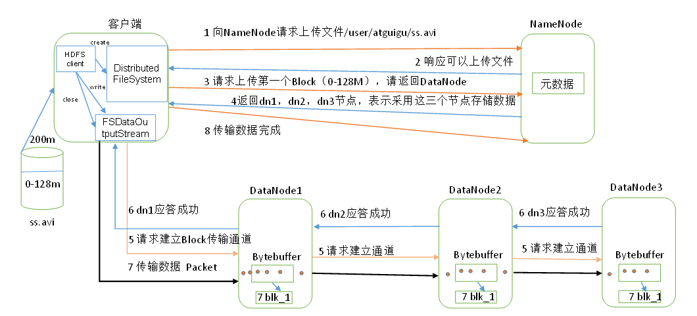

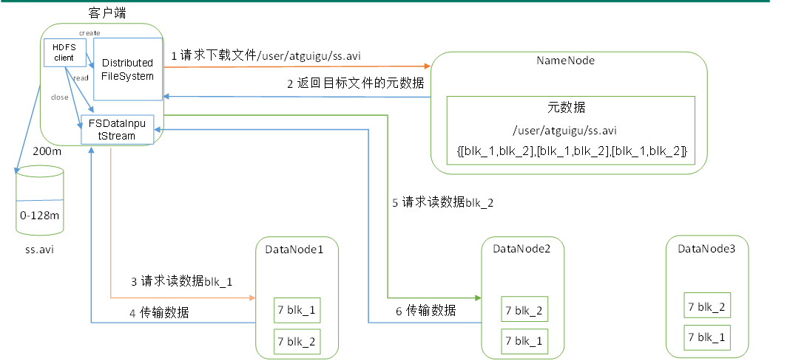

#### NameNode工作机制

NameNode将内存数据持久化到磁盘中，分为fsimage和edits两个文件，fsimage是老的内存镜像，edits是追加格式的日志，表示着内存的变化情况，随着NameNode工作，edits会越来越大，这时候SecondaryNameNode会协助NameNode将edits与fsimage合并为新的fsimage。 注意下图紫色部分的流程即可

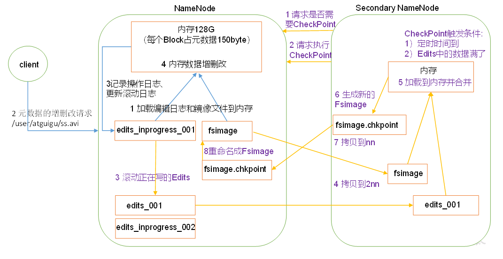

#### 集群安全模式

当NameNode不是第一次启动的时候，会加载Fsimage，并执行Edits日志，最后合并，此后开始监听DataNode请求，这个过程中NameNode一直是安全模式，文件系统处于只读状态，如果满足最小副本数，NameNode会在30秒后退出安全模式

#### NameNode多目录配置

```xml
<property>
	<name>dfs.namenode.name.dir</name>
    <value>file:///xxx,file:///xxx</value>
</property>
```

当我们配置了多个目录以后， NameNode的数据会同时存储在这些目录中，这些目录中的内容是一样的，如果一个目录损坏，NameNode会通过另一个目录恢复

#### DataNode工作机制

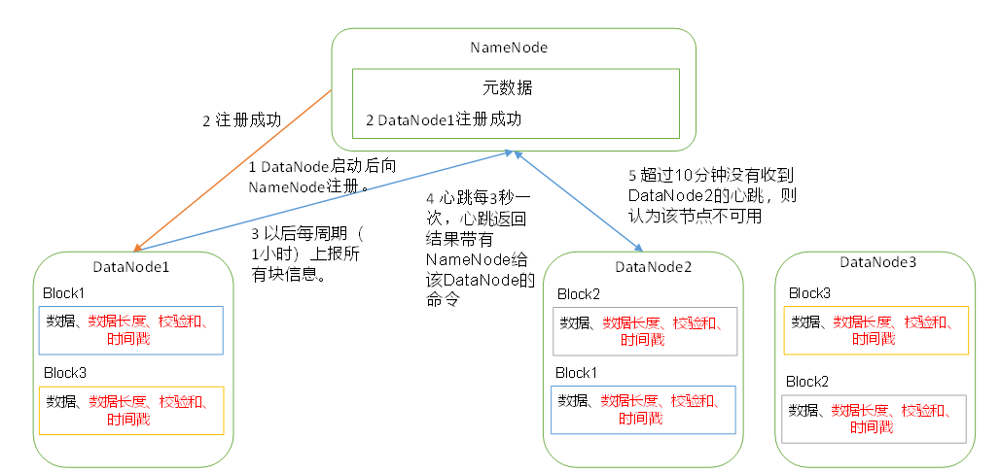

超时时间是2 \* dfs.namenode.heartbeat.recheck-interval + 10 \* dfs.hertbeat.interval

### MapReduce

#### 全过程

(input) `<k1, v1> ->` **map** `-> <k2, v2> ->` **combine** `-> <k2, v2> ->` **reduce** `-> <k3, v3>` (output)

##### InputFormat

InputFormat是执行MapReduce的第一步，他主要用于在从HDFS文件系统输入到MapTask的过程

| 名词     | 解释                                                  |
| -------- | ----------------------------------------------------- |
| 数据块   | Block是HDFS物理上把数据分成的多块                     |
| 数据切片 | Split是逻辑上对数据的分片，每个Split由一个MapTask处理 |
|          |                                                       |

| 切片方法                | 备注                                                         |
| ----------------------- | ------------------------------------------------------------ |
| TextInputFormat         | 按照大小切片，kv分别是行偏移量和行的具体数据                 |
| KeyValueTextInputFormat | 按照大小切片，kv是每一行由分隔符分割的左右两部分             |
| NLineInputFormat        | 按照行数切片，kv分别是行偏移量和行的具体数据                 |
| CombineTextInputFormat  | 按照大小拆分大文件，合并小文件，kv分别是行偏移量和行的具体数据 |

##### Map

 当经过了InputFormat以后，数据就进入到了Map阶段，

在这个阶段，Map框架会对每一对KV进行并行处理，并输出为新的KV，

把新的KV写入环形缓冲区，一端写索引，另一端写数据，

直到环形缓冲区达到80%(80MB)，Map框架将缓冲区数据排序并写入磁盘文件进行分区

直到文件数量达到一定上限，Map框架将文件排序合并，并进行分区


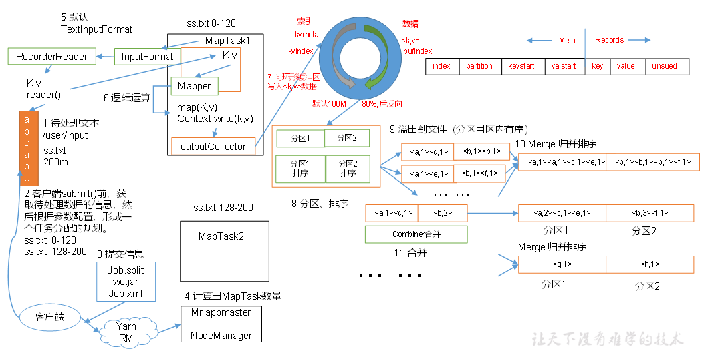

##### Partition

Map后，需要将数据写入不同的分区，

- ReduceTask数大于分区数，则最后几个Reduce为空

- ReduceTask小于分区数大于1，则异常

- ReduceTask=1，则只有一个输出文件

默认的分区是HashPartitioner

###### MapReduce中的排序

MapReduce两个阶段都会进行排序，不管实际是否需要

- Map： 环形缓冲区 -> 达到80% -> 快排 -> 写入文件 -> Map完成 -> 所有文件归并排序
- Reduce： 远程拷贝文件到内存-> 达到内存阈值-> 写入一个磁盘文件-> 磁盘文件个数达到阈值-> 合并文件 ->  拷贝完成->  所有数据(磁盘+内存)归并排序

###### 排序的方法

- 部分排序： 输出是多个文件，保证每个文件有序
- 全排序： 输出是一个文件，保证这个文件有序
- 辅助排序： 
- 二次排序： 排序中有两个判断条件

###### 如何排序

实现WriteableCompable接口即可

##### Combiner

Combiner就是一个局部的Reduce，他不一定必要，并不通用于所有的MR程序，比如求平均值，但是在局部Reduce不影响全局Reduce的情况下它可以降低网络传输压力

```java
job.setCombinerClass(IntSumReducer.class);
```

##### Shuffle

往往我们称Map之后，Reduce之前的操作为Shuffle

##### Reduce

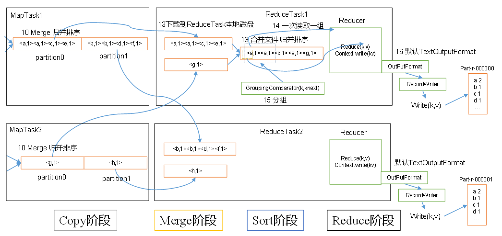


##### OutputFormat

| OUTPUTFORMAT             | 描述             |
| ------------------------ | ---------------- |
| TextOutputFormat         | 把结果写成文本行 |
| SequenceFileOutputFormat | 写成二进制文件   |
|                          |                  |

#### Join

在Reduce端Join： 用同一个key即可

在Map端Join： 用字典手动Join

#### Compress

支持gzip,bzip,Lzo等压缩方式，可以用于输入文件的解压缩，输出文件的压缩，mapreduce中间文件的压缩

Map端压缩

```java
configuration.setBoolean("mapreduce.map.output.compress",true);
configuration.setClass("mapreduce.map.output.compress.codec",
                          BZip2Codec.class, CompressionCodec.class)
```

Reduce压缩

```java
FileOutputFormat.setCompressOutput(job,true);
FileOutputormat.setOutputCompressorClass(job,GzipCodec.class);
```

#### MR速度慢的原因

计算机性能： CPU、内存、磁盘、网络

IO: 数据倾斜，小文件多，不可分块的超大文件多，spill次数多，merge次数多

##### MR优化

- 输入阶段：合并小文件
- Maper阶段：调整环形缓冲区大小和溢写比例
- Maper阶段：调整合并文件的文件个数阈值
- Maper阶段：使用Combiner
- Reduce阶段：合理设置Map Reduce个数
- Reduce阶段：调整slowstart.completedmaps,提前申请Reduce资源
- Reduce阶段：MapTask机器文件 -> ReduceTask机器Buffer -> 磁盘 -> Reduce,  调整Buffer，让Buffer中保留一定的数据，直接传给Reduce
- 压缩数据
- 开启JVM重用

### Yarn

#### 流程

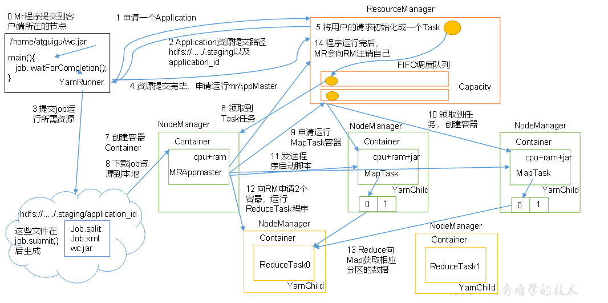

#### 调度器

- FIFIO调度器： 先进先出
- 容量调度器（默认）：支持多个队列，每个队列 有一定的资源，各自采用FIFO，对同一个用户的作业所占资源进行限制，安装任务和资源比例分配新的任务，按照任务优先级、提交时间、用户的资源限制、内存限制对队列中的任务排序
- 公平调度器（并发度非常高）： 多个队列，每个队列中的job可以并发运行，可以每个job都有资源，哪个job还缺的资源最多，就给哪个job分配资源

#### 任务推测执行

当前Job已完成的Task达到5%， 且某任务执行较慢，则开始备份任务
$$
当前任务完成时刻 = 当前时刻 +（当前时刻 - 任务开始时刻）/ 任务运行进度\\
备份任务完成时刻 = 当前时刻 + 所有任务平均花费时间
$$
每个任务最多一个备份任务，每个作业也有备份任务上限

### HA

#### HDFS HA


#### YARN HA

## Impala

impala提供对HDFS、Hbase数据的高性能、低延迟的交互式SQL查询功能。基于Hive使用内存计算，兼顾数据仓库、具有实时、批处理、多并发等优点。

### Impala的优点

- 基于内存计算

- 不使用MR

- C++编写计算层，Java编写编译层

- 兼容大部分HiveSQL

- 支持数据本地计算

- 可以使用Impala JDBC访问

### Impala的缺点

- 对内存依赖很大
- 完全依赖Hive
- 只能读取文本文件，不能读取二进制文件
- 在Impala更新的数据会同步到Hive，但是在Hive更新的数据不会自动同步到Impala

### Impala和关系型数据库的异同

- Impala不支持事务和索引
- Impala可以管理PB级数据，但是关系型数据库只能管理TB

### Impala和Hive的异同

- 使用HDFS，HBase储存数据
- 使用相同的元数据
- 使用类似的SQL词法分析生成执行计划
- Impala生成执行计划树，Hive会生成MR模型
- Impala使用拉的方式，后续节点主动拉取前面节点的数据，是流， Hive使用推的方式，前面的节点执行完成后会将数据主动推送给后面的节点

### Impala的架构

Impala集群有三个重要的组件，他们分别是Impala Daemon, Impala Statestore和Impala Metastore

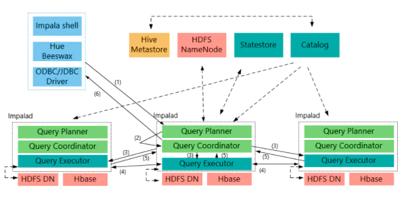

#### Impala Daemon

Impala Daemon（Impalad）在安装Impala的每个节点上运行, 接受来着各种接口的查询，当一个查询提交到某个Impala Daemon的时候，这个节点就充当协调器，将任务分发到集群

#### Impala State

Impala State负责检测每个Impalad的运行状况，如果某个Impala Daemon发生了故障，则这个消息会被通知到所有其他Impla Daemon

#### Impala Matestore

Impala Matestore储存表的元数据信息


### Impala语法

- 时间函数【时间差】

  ```impala
  datediff(now(),to_timestamp(strleft(ftime,10), 'yyyy-MM-dd')) <= 7
  ```

- 字符串求和

  ```impala
  sum(cast(time as bigint))
  ```


## Elasticsearch

### 文档

https://www.elastic.co/guide/en/elasticsearch/reference/current/elasticsearch-intro.html

### Install ES

#### Docker Install ES

```sh
docker run -d \
--name elasticsearch \
-p 9200:9200 \
-p 9300:9300 \
-e "discovery.type=single-node" \
elasticsearch:7.10.1; \

docker run -d \
--link elasticsearch:elasticsearch \
-p 5601:5601 \
kibana:7.10.1
```

#### K8s Install ES


```sh
echo -e "===prepare workspace==="
if [ ! -d "workspace" ]; then
echo "create new workspace"
mkdir workspace
fi
cd workspace

echo -e "===goto current space==="
version=$[$(ls | sort -n | tail -n 1)+1]
mkdir $version
cd $version
echo "Version: $version"
echo "Space: $(pwd)"

echo -e "===deploy to k8s==="
mkdir deploy
cd deploy
cat>elasticsearch-deployment.yaml<<EOF
apiVersion: apps/v1
kind: Deployment
metadata:
  name: elasticsearch-deployment
  labels:
    app: elasticsearch
spec:
  replicas: 1
  selector:
    matchLabels:
      app: elasticsearch
  template:
    metadata:
      labels:
        app: elasticsearch
    spec:
      containers:
      - name: elasticsearch
        image: elasticsearch:7.5.1
        imagePullPolicy: IfNotPresent
        env: 
        - name: "discovery.type"
          value: "single-node"
        ports:
        - containerPort: 9200
        - containerPort: 9300
        resources:
          limits: 
            cpu: 0.3
            memory: 2000Mi
          requests:
            cpu: 0.3
            memory: 300Mi
       # livenessProbe:
       #   httpGet:
       #     path: /
        #    port: 9200
       #   initialDelaySeconds: 10
       #   periodSeconds: 3
      - name: kibana
        image: kibana:7.5.1
        imagePullPolicy: IfNotPresent
        env:
        - name: "ELASTICSEARCH_HOSTS"
          value: "http://127.0.0.1:9200"
        ports:
        - containerPort: 5601
        resources:
          limits: 
            cpu: 0.3
            memory: 1000Mi
          requests:
            cpu: 0.3
            memory: 300Mi
        #livenessProbe:
        #  httpGet:
        #   port: 5601
        #  initialDelaySeconds: 10
        #  periodSeconds: 3
EOF

cat>elasticsearch-service.yaml<<EOF
apiVersion: v1
kind: Service
metadata:
  name: elasticsearch-service
spec:
  type: NodePort
  selector:
    app: elasticsearch
  ports:
    - port: 5601
      targetPort: 5601
      nodePort: 5601
      name: kibana-web
    - port: 9200
      targetPort: 9200
      nodePort: 9200
      name: es-http
    - port: 9300
      targetPort: 9300
      nodePort: 9300
      name: es-tcp
EOF

kubectl apply -f elasticsearch-deployment.yaml
kubectl apply -f elasticsearch-service.yaml
cd ..
```

### Chrome Head Plugin

[插件地址](https://chrome.google.com/webstore/detail/elasticsearch-head/ffmkiejjmecolpfloofpjologoblkegm/related)


### Shell 连接

```sh
curl -u 'password' IP:9200
```


# Linux

换源

https://zhuanlan.zhihu.com/p/61228593

## ele

### firefox

```shell
sudo dpkg --remove --force-remove-reinstreq google-chrome-stable
apt-get install firefox
```

## XXD

这是一个16进制查看工具

```sh
# 查看帮助
xxd -h

# 查看文件前100个字节
xxd -l 100 file.bin
```


## SSH

### Install

```sh
# 必须安装passwd
yum install openssh-server openssh-clients passwd  -y; \
sed -i "s/^UsePAM yes/UsePAM no/g" /etc/ssh/sshd_config; \
echo 123456 | passwd root --stdin; \
ssh-keygen -t rsa -P '' -f ~/.ssh/id_rsa; \
cat ~/.ssh/id_rsa.pub >> ~/.ssh/authorized_keys; \
chmod 0600 ~/.ssh/authorized_keys; \
ssh-keygen -q -N "" -t rsa -f /etc/ssh/ssh_host_rsa_key; \
ssh-keygen -q -N "" -t ecdsa -f /etc/ssh/ssh_host_ecdsa_key; \
ssh-keygen -q -N "" -t ed25519 -f /etc/ssh/ssh_host_ed25519_key; \
/usr/sbin/sshd
```

### Problem

- [System is booting up. Unprivileged users are not permitted to log in yet](https://unix.stackexchange.com/questions/487742/system-is-booting-up-unprivileged-users-are-not-permitted-to-log-in-yet)


### Docker Install

- Dockerfile

```txt
FROM centos:centos8
RUN yum install openssh-server openssh-clients passwd  -y; \
sed -i "s/^UsePAM yes/UsePAM no/g" /etc/ssh/sshd_config; \
echo 123456 | passwd root --stdin; \
ssh-keygen -t rsa -P '' -f ~/.ssh/id_rsa; \
cat ~/.ssh/id_rsa.pub >> ~/.ssh/authorized_keys; \
chmod 0600 ~/.ssh/authorized_keys; \
ssh-keygen -q -N "" -t rsa -f /etc/ssh/ssh_host_rsa_key; \
ssh-keygen -q -N "" -t ecdsa -f /etc/ssh/ssh_host_ecdsa_key; \
ssh-keygen -q -N "" -t ed25519 -f /etc/ssh/ssh_host_ed25519_key;
EXPOSE 22
CMD ["/usr/sbin/sshd", "-D"]
```

- Build

```sh
docker build -t sshd:centos8 .
```

- Run

```sh
docker run -itd -p 2222:22 sshd:centos8
```

- Connect

```sh
ssh localhost -p 2222
```

### USE

```sh
ssh root@9.135.10.2 -p 36000 -P
xxxx
```


## Git

```sh
docker run -it --rm \
	-v ${HOME}:/root \
	-v $(pwd):/git \
	alpine/git \
	clone https://github.com/alpine-docker/git.git
```

### 源码安装

```sh
wget https://github.com/git/git/archive/v2.29.2.tar.gz; \
tar -zxf v2.29.2.tar.gz; \
rm v2.29.2.tar.gz; \
cd /git-2.29.2; \
yum install -y curl-devel expat-devel gettext-devel \
    openssl-devel zlib-devel gcc perl-ExtUtils-MakeMaker; \
make prefix=/usr/local/git all; \
make prefix=/usr/local/git install; \
echo "GIT_HOME=/usr/local/git" >> ~/.bashrc; \
echo "PATH=\$GIT_HOME/bin:\$PATH" >> ~/.bashrc; \
source ~/.bashrc; \
git --version; 

```

修改Git默认编辑器

```sh
 git config --global core.editor "vim"
```

### GIT提交规范

```txt
feat：新功能（feature）
fix：修补bug
docs：文档（documentation）
style： 格式（不影响代码运行的变动）
refactor：重构（即不是新增功能，也不是修改bug的代码变动）
test：增加测试
chore：构建过程或辅助工具的变动
```

### 提交Tag

```
git push origin --tags
```


## vim

```sh
git clone https://github.com/VundleVim/Vundle.vim.git ~/.vim/bundle/Vundle.vim
 
echo >~/.vimrc<<EOF 
" Vundle set nocompatible
filetype off
set rtp+=~/.vim/bundle/Vundle.vim
call vundle#begin()
Plugin 'VundleVim/Vundle.vim'
Plugin 'The-NERD-Tree'
Plugin 'gdbmgr'
Plugin 'mbbill/undotree'
Plugin 'majutsushi/tagbar'
Plugin 'vim-airline/vim-airline' " 状态栏
Plugin 'vim-airline/vim-airline-themes' "状态栏
Plugin 'cohlin/vim-colorschemes' " 主题
Plugin 'tomasr/molokai' " molokai
Plugin 'jiangmiao/auto-pairs' " 括号补全
Plugin 'plasticboy/vim-markdown'
Plugin 'iamcco/mathjax-support-for-mkdp' " 数学公式
Plugin 'iamcco/markdown-preview.vim' " markdown预览
"Plugin 'Valloric/YouCompleteMe'
"Plugin 'zxqfl/tabnine-vim'
Plugin 'w0rp/ale' " 语法纠错
Plugin 'octol/vim-cpp-enhanced-highlight' " c++语法高亮
Plugin 'Shougo/echodoc.vim' " c++函数提示
Plugin 'Chiel92/vim-autoformat' " c++代码格式化
Plugin 'scrooloose/nerdcommenter' " c++代码注释
Plugin 'ashfinal/vim-colors-violet' " 配色
Plugin 'terryma/vim-multiple-cursors' " vim 多行编辑
Plugin 'mhinz/vim-startify'
call vundle#end()
filetype plugin indent on


set et "tab用空格替换

set tabstop=2
set expandtab
" Tab键的宽度

set softtabstop=2
set shiftwidth=2
"  统一缩进为2

set number
" 显示行号

set history=10000
" 历史纪录数

set hlsearch
set incsearch
" 搜索逐字符高亮

set encoding=utf-8
set fileencodings=utf-8,ucs-bom,shift-jis,gb18030,gbk,gb2312,cp936,utf-16,big5,euc-jp,latin1
" 编码设置

" set mouse=a
" use mouse

set langmenu=zn_CN.UTF-8
set helplang=cn
" 语言设置

set laststatus=2
" 总是显示状态行 就是那些显示 --insert-- 的怪东西

set showcmd
" 在状态行显示目前所执行的命令，未完成的指令片段亦会显示出来

set scrolloff=3
" 光标移动到buffer的顶部和底部时保持3行距离

set showmatch
" 高亮显示对应的括号

set matchtime=1
" 对应括号高亮的时间（单位是十分之一秒）

colorscheme molokai
EOF

vim +PluginInstall +qall
```

## Net Commond

### Centos8 IP网络配置

```sh
/etc/sysconfig/network-scripts/*
```


### Centos8重新载入网络设置

```sh
nmcli c reload
nmcli c up ens32
```


# Mysql

## 查看表的定义

```mysql
show create table table_name;
```

## 时间函数

```mysql
date_add(date(imp_date), interval 1 week)
```


# Docker

## 修改源

```sh
cat>/etc/docker/daemon.json<<EOF
{
    "registry-mirrors": [
        "https://dockerhub.woa.com",
        "http://docker.oa.com:8080"
    ],
    "insecure-registries" : [ 
        "hub.oa.com",
        "docker.oa.com:8080",
        "bk.artifactory.oa.com:8080"
    ],
    "exec-opts":["native.cgroupdriver=systemd"]
}
EOF
```

## 常见参数

### 资源限制

```
--cpus 0.8
-m 800m
```

### 文件夹映射

```
-v /root/.m2:/root/.m2
```

# K8S

## 初始化K8S集群


```sh
kubeadm init --pod-network-cidr=10.244.0.0/16
kubectl apply -f https://raw.githubusercontent.com/coreos/flannel/master/Documentation/kube-flannel.yml
kubectl taint nodes --all node-role.kubernetes.io/master-
vim /etc/kubernetes/manifests/kube-apiserver.yaml
#- --service-node-port-range=1000-32000
```

## K8S客户端

```sh
export KUBECONFIG=/etc/kubernetes/admin.conf
sudo kubectl get pods
```

## K8S资源负载情况

```sh
curl -L https://github.com/kubernetes-sigs/metrics-server/releases/download/v0.3.6/components.yaml \
| sed -s 's/k8s.gcr.io/registry.cn-hangzhou.aliyuncs.com\/google_containers/g' \
| kubectl apply -f -
```

[参考](https://www.sklinux.com/posts/k8s/%E9%9B%86%E7%BE%A4%E6%A0%B8%E5%BF%83%E6%8C%87%E6%A0%87%E6%9C%8D%E5%8A%A1/)

```sh
# echo "serverTLSBootstrap: true" >> /var/lib/kubelet/config.yaml

systemctl daemon-reload
systemctl restart kubelet.service
kubectl get csr
kubectl certificate approve xxx ???
```

## K8S 资源限制

```sh
echo "===prepare workspace==="
if [ ! -d "workspace" ]; then
echo "create new workspace"
mkdir workspace
fi
cd workspace

echo "===goto current space==="
version=$[$(ls | sort -n | tail -n 1)+1]
mkdir $version
cd $version
echo "Version: $version"
echo "Space: $(pwd)"


echo "===deploy to k8s==="
mkdir deploy
cd deploy
cat>limitRange.yaml<<EOF
apiVersion: v1
kind: LimitRange
metadata:
  name: cpu-min-max-demo-lr
spec:
  limits:
  - max:
      cpu: "800m"
    min:
      cpu: "200m"
    type: Container
EOF
kubectl apply -f limitRange.yaml
cd ..
```

## K8S重启失败

```sh
systemctl status kubelet -n 1000

free -m # 看看swap分区是否被打开
swapoff -a

systemctl daemon-reload
systemctl restart kubelet

hostname -f
hostname xxxxxxx
```

### 重装

```sh
kubeadm reset
rm -rf /etc/kubernetes
rm -rf /var/lib/etcd/
```


## simple Java Project

```sh
echo -e "===prepare workspace==="
if [ ! -d "workspace" ]; then
echo "create new workspace"
mkdir workspace
fi
cd workspace

echo -e "===goto current space==="
version=$[$(ls | sort -n | tail -n 1)+1]
mkdir $version
cd $version
echo "Version: $version"
echo "Space: $(pwd)"

echo -e "===set parmas==="
gitPath=xxxx
girBranch=xxxx
# mavenMirror=https://maven.aliyun.com/repository/public
mavenMirror=xxxx
mavenCacheVolume=maven-repo
# mavenImage=maven:3.6.3-openjdk-16
mavenImage=maven:3.6.3-jdk-8
mavenPackageTarget=xxx-start/target/*.jar
# jdkImage=openjdk:16-jdk
jdkImage=openjdk:8-jdk
javaApp=xxxx

echo -e "===get code==="
docker run -i --rm \
	-v ${HOME}:/root \
	-v $(pwd)/src:/git \
	alpine/git \
	clone $gitPath .
pwd
echo $girBranch
docker run -i --rm \
	-v ${HOME}:/root \
	-v $(pwd)/src:/git \
	alpine/git \
	checkout $girBranch 
	

echo -e "===build target==="
mkdir .m2
cat>.m2/settings.xml<<EOF
<settings>
    <mirrors>
        <mirror>
            <id>proxy</id>
            <mirrorOf>central</mirrorOf>
            <name>proxy maven</name>
            <url>$mavenMirror</url>
        </mirror>
    </mirrors>
</settings>
EOF
docker volume create --name $mavenCacheVolume
docker run -i --rm \
	-v $(pwd)/src:/usr/src/mymaven \
	-v $mavenCacheVolume:/root/.m2/repository \
	-v $(pwd)/.m2/settings.xml:/root/.m2/settings.xml \
	-w /usr/src/mymaven \
	$mavenImage \
	mvn package -Dmaven.test.skip=true

echo -e "===move jar==="
mkdir image
mv src/$mavenPackageTarget image/main.jar

echo -e "===build image==="
cd image
cat>Dockerfile<<EOF
FROM $jdkImage
COPY main.jar /main.jar
COPY entrypoint.sh /entrypoint.sh
CMD ["sh","entrypoint.sh"]
EOF
cat>entrypoint.sh<<EOF
java -jar -Xmx250m -Xms200m -Dserver.port=80 /main.jar --logger.print-parmas.enable=true
EOF
docker build -t $javaApp:$version .
cd ..

echo -e "===deploy to k8s==="
mkdir deploy
cd deploy
cat>${javaApp}-deployment.yaml<<EOF
apiVersion: apps/v1
kind: Deployment
metadata:
  name: ${javaApp}-deployment
  labels:
    app: $javaApp
spec:
  replicas: 1
  selector:
    matchLabels:
      app: $javaApp
  template:
    metadata:
      labels:
        app: $javaApp
    spec:
      containers:
      - name: $javaApp
        image: $javaApp:$version
        imagePullPolicy: IfNotPresent
        env: 
        - name: ENV
          value: "env"
        ports:
        - containerPort: 80
        resources:
          limits: 
            cpu: 0.3
            memory: 400Mi
          requests:
            cpu: 0.3
            memory: 300Mi
        livenessProbe:
          httpGet:
            path: /swagger-ui/
            port: 80
          initialDelaySeconds: 100
          periodSeconds: 3
  strategy: # 策略
    type: RollingUpdate # 也可以是Recreate
    rollingUpdate: 
      maxUnavailable: 50% # 滚动更新的时候的最大不可用pod数量， 可以是绝对数字或者比例10%
      maxSurge: 50% # 动更新的时候的溢出的pod数量，也可以是绝对数字
  progressDeadlineSeconds: 150 # 进度期限秒数，不懂是什么
  minReadySeconds: 100 # 最短就绪时间， 容器创建多久以后被视为就绪
  revisionHistoryLimit: 3 # 历史修订限制， 保留的rs的数量，这个数量会消耗etcd资源，rs删除了就不能回滚刀那个版本的Deployment了
EOF

cat>${javaApp}-service.yaml<<EOF
apiVersion: v1
kind: Service
metadata:
  name: ${javaApp}-service
spec:
  type: NodePort
  selector:
    app: $javaApp
  ports:
    - port: 80
      targetPort: 80
      nodePort: 10010
EOF

kubectl apply -f ${javaApp}-deployment.yaml
kubectl apply -f ${javaApp}-service.yaml
cd ..
```


# JAVA

## IDEA

### Spring Boot 启动命令行太长

修改文件.idea/workspace.xml

```xml
  <component name="PropertiesComponent">
    <property name="dynamic.classpath" value="true" />
```

##  反编译

```sh
 # https://varaneckas.com/jad/
 wget https://varaneckas.com/jad/jad158e.linux.static.zip; \
 unzip jad158e.linux.static.zip
 jad xxx.class
 cat xxx.jad
```

## Java启动参数

### JVM参数


```sh
-ea
-Dhttp.proxyPort=12639
-Dhttp.proxyHost=127.0.0.1
-Dhttps.proxyPort=12639
-Dhttps.proxyHost=127.0.0.1
-Xmx400m # JVM最大内存
-Xms300m # JVM初始内存
-Xmn200m # 年轻代内存
-Xss128k # 线程堆栈
```

### Java参数

```
--server.port=80
--jasypt.encryptor.password=xxx
--spring.profiles.active=development
```

## Maven

```sh
docker run -it --rm \
	-v "$(pwd)":/usr/src/mymaven \
	-w /usr/src/mymaven \
	maven:3.3-jdk-8 \
	mvn clean install
```

```sh
# 发布
mvn clean javadoc:jar source:jar deploy
```

### 单元测试

```java
@Import(XxxServiceImpl.class)
@RunWith(SpringJUnit4ClassRunner.class)
@SpringBootTest(classes = TestRunner.class)
public class ScriptBizServiceTest {
    @Autowired
    XxxService xxxService;

    @MockBean
    XxxService xxxService;
}
```

```xml
    <dependency>
      <groupId>junit</groupId>
      <artifactId>junit</artifactId>
      <scope>test</scope>
    </dependency>
    <dependency>
      <groupId>org.springframework.boot</groupId>
      <artifactId>spring-boot-starter-test</artifactId>
      <scope>test</scope>
    </dependency>
```

### 源码上传插件

```xml
<plugin>
    <groupId>org.apache.maven.plugins</groupId>
    <artifactId>maven-source-plugin</artifactId>
    <version>3.0.1</version>
    <configuration>
        <attach>true</attach>
    </configuration>
    <executions>
        <execution>
            <phase>compile</phase>
            <goals>
                <goal>jar</goal>
            </goals>
        </execution>
    </executions>
</plugin>
```

### 规范

#### 多仓库规范

https://maven.apache.org/guides/mini/guide-multiple-repositories.html


Remote repository URLs are queried in the following order for artifacts until one returns a valid result:

1. Global `settings.xml`
2. User `settings.xml`
3. Local POM
4. Parent POMs, recursively
5. Super POM

For each of these locations, the repositories within the profiles are queried first in the order outlined at [Introduction to build profiles](https://maven.apache.org/guides/introduction/introduction-to-profiles.html).


## Guava

### RateLimiter

```java
RateLimiter rateLimiter = RateLimiter.create(10);
for (int i = 0; i < 20; i++) {
    int finalI = i;
    new Thread(new Runnable() {
        @Override
        public void run() {
            int cnt = 0;
            while (true) {
                if (rateLimiter.tryAcquire()) {
                    cnt++;
                    System.out.println("thread: " + finalI + " cnt: " + cnt);
                }
            }
        }
    }).start();
}
Thread.sleep(1000 * 100 * 1000);
```


源码流程图：


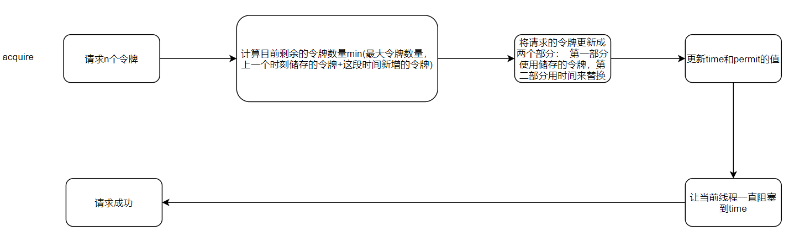

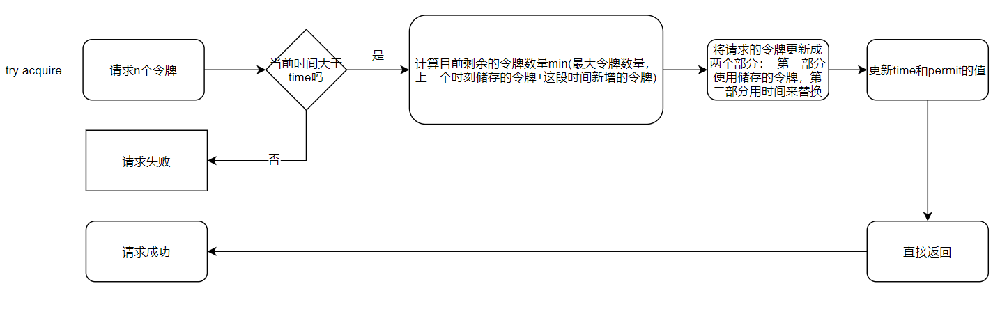


## Spring

### Spring Webflux 5.3.2


#### ResponseBodyResultHandler

这个ResultHandler是最常用的一个,我们可以看到他在containingClass被ResponseBody标记或者方法被ResponseBody标记时生效

```java
	@Override
	public boolean supports(HandlerResult result) {
		MethodParameter returnType = result.getReturnTypeSource();
		Class<?> containingClass = returnType.getContainingClass();
		return (AnnotatedElementUtils.hasAnnotation(containingClass, ResponseBody.class) ||
				returnType.hasMethodAnnotation(ResponseBody.class));
	}

	@Override
	public Mono<Void> handleResult(ServerWebExchange exchange, HandlerResult result) {
		Object body = result.getReturnValue();
		MethodParameter bodyTypeParameter = result.getReturnTypeSource();
		return writeBody(body, bodyTypeParameter, exchange);
	}

```

#### ViewResolutionResultHandler

ViewResolutionResultHandler支持的attributes比较多，它可以解析CharSequence，Rendering，Model，Map，View等

```java
	@Override
	public boolean supports(HandlerResult result) {
		if (hasModelAnnotation(result.getReturnTypeSource())) {
			return true;
		}

		Class<?> type = result.getReturnType().toClass();
		ReactiveAdapter adapter = getAdapter(result);
		if (adapter != null) {
			if (adapter.isNoValue()) {
				return true;
			}
			type = result.getReturnType().getGeneric().toClass();
		}

		return (CharSequence.class.isAssignableFrom(type) ||
				Rendering.class.isAssignableFrom(type) ||
				Model.class.isAssignableFrom(type) ||
				Map.class.isAssignableFrom(type) ||
				View.class.isAssignableFrom(type) ||
				!BeanUtils.isSimpleProperty(type));
	}
```


#### ServerResponseResultHandler

ServerResponseResultHandler只处理返回值为ServerResponse类型的Response，并使用内置的messageWriters和视图解析器来处理他们

```java
	@Override
	public void afterPropertiesSet() throws Exception {
		if (CollectionUtils.isEmpty(this.messageWriters)) {
			throw new IllegalArgumentException("Property 'messageWriters' is required");
		}
	}

	@Override
	public boolean supports(HandlerResult result) {
		return (result.getReturnValue() instanceof ServerResponse);
	}

	@Override
	public Mono<Void> handleResult(ServerWebExchange exchange, HandlerResult result) {
		ServerResponse response = (ServerResponse) result.getReturnValue();
		Assert.state(response != null, "No ServerResponse");
		return response.writeTo(exchange, new ServerResponse.Context() {
			@Override
			public List<HttpMessageWriter<?>> messageWriters() {
				return messageWriters;
			}
			@Override
			public List<ViewResolver> viewResolvers() {
				return viewResolvers;
			}
		});
	}
```

## Spring Boot

### 源码下載

```
git clone https://github.com/spring-projects/spring-boot.git
```

[checkout failed原因](https://www.howtogeek.com/266621/how-to-make-windows-10-accept-file-paths-over-260-characters/)

```sh
git config core.longPaths true
```

### Aware

#### BeanNameAware

beanNameAware可以获得容器中Bean的名称，作用于每一个Bean。当bean被创建的时候设置他的名字，在基本properties填充完成以后，init调用前执行

> 摘自： spring-beans:5.3.4 org.springframework.beans.factory.BeanNameAware
>
> Set the name of the bean in the bean factory that created this bean. <p>Invoked after population of normal bean properties but before an init callback such as {@link InitializingBean#afterPropertiesSet()} or a custom init-method.

```java
package com.example.demo;

import org.springframework.beans.factory.BeanNameAware;
import org.springframework.stereotype.Component;

@Component
public class BeanNameAwareDemo implements BeanNameAware {
    @Override
    public void setBeanName(String name) {
        System.out.println(name);
    }
}
```

输出: 

```txt
beanNameAwareDemo
```


#### BeanFactoryAware

 注入beanFactory

```java
package com.example.demo;

import org.springframework.beans.BeansException;
import org.springframework.beans.factory.BeanFactory;
import org.springframework.beans.factory.BeanFactoryAware;
import org.springframework.stereotype.Component;

@Component
public class BeanFactoryAwareDemo implements BeanFactoryAware {
    @Override
    public void setBeanFactory(BeanFactory beanFactory) throws BeansException {
        System.out.println(beanFactory);
    }
}
```

#### ApplicationContextAware

类比beanFactory

```java
package com.example.demo;

import org.springframework.beans.BeansException;
import org.springframework.context.ApplicationContext;
import org.springframework.context.ApplicationContextAware;
import org.springframework.stereotype.Component;

@Component
public class ApplicationContextAwareDemo implements ApplicationContextAware {
    @Override
    public void setApplicationContext(ApplicationContext applicationContext) throws BeansException {
        System.out.println(applicationContext);
    }
}
```

#### MessageSourceAware

这是使用国际化用到的

```java
package com.example.demo;

import java.util.Locale;
import lombok.extern.slf4j.Slf4j;
import org.springframework.context.MessageSource;
import org.springframework.context.MessageSourceAware;
import org.springframework.stereotype.Component;

@Slf4j
@Component
public class MessageSourceAwareDemo implements MessageSourceAware {
    @Override
    public void setMessageSource(MessageSource messageSource) {
        String hello = messageSource.getMessage("hello", null, Locale.CHINA);
        log.info(hello);
    }
}
```

```txt
2021-03-05 13:36:38.263  INFO 17836 --- [           main] com.example.demo.MessageSourceAwareDemo  : 你好呀小老弟
```

#### ApplicationEventPublisherAware

用于发布事件

```java
package com.example.demo;

import org.springframework.context.ApplicationEventPublisher;
import org.springframework.context.ApplicationEventPublisherAware;
import org.springframework.stereotype.Component;

@Component
public class ApplicationEventPublisherAwareDemo implements ApplicationEventPublisherAware {
    @Override
    public void setApplicationEventPublisher(ApplicationEventPublisher applicationEventPublisher) {
        applicationEventPublisher.publishEvent("hi");
    }
}
```

#### ResourceLoaderAware

用于获取静态文件内容

```java
package com.example.demo;

import java.io.IOException;
import java.io.InputStream;
import lombok.extern.slf4j.Slf4j;
import org.apache.commons.io.IOUtils;
import org.springframework.context.ResourceLoaderAware;
import org.springframework.core.io.ResourceLoader;
import org.springframework.stereotype.Component;

@Slf4j
@Component
public class ResourceLoaderAwareDemo implements ResourceLoaderAware {
    @Override
    public void setResourceLoader(ResourceLoader resourceLoader) {
        try {
            InputStream inputStream =
                    resourceLoader.getResource("classpath:/messages_zh_CN.properties").getInputStream();
            IOUtils.readLines(inputStream).forEach(log::info);
        } catch (IOException ioException) {
            log.error("", ioException);
        }
    }
}
```

```txt
2021-03-05 13:56:08.067  INFO 17700 --- [           main] com.example.demo.MessageSourceAwareDemo  : 你好呀小老弟
```

### 自定义starter

@ConfigurationProperties 不能缺少下面这个依赖，否则不会自动处理配置的提示

```xml
<dependency>
    <groupId>org.springframework.boot</groupId>
    <artifactId>spring-boot-configuration-processor</artifactId>
    <optional>true</optional>
    <scope>compile</scope>
</dependency>
```

### Feign

```java
import com.fasterxml.jackson.databind.DeserializationFeature;
import com.fasterxml.jackson.databind.ObjectMapper;
import feign.codec.Decoder;
import feign.codec.Encoder;
import java.util.Arrays;
import lombok.extern.slf4j.Slf4j;
import org.springframework.beans.factory.ObjectFactory;
import org.springframework.boot.autoconfigure.http.HttpMessageConverters;
import org.springframework.cloud.openfeign.support.ResponseEntityDecoder;
import org.springframework.cloud.openfeign.support.SpringDecoder;
import org.springframework.cloud.openfeign.support.SpringEncoder;
import org.springframework.context.annotation.Bean;
import org.springframework.context.annotation.Configuration;
import org.springframework.http.MediaType;
import org.springframework.http.converter.HttpMessageConverter;
import org.springframework.http.converter.json.MappingJackson2HttpMessageConverter;

@Slf4j
@Configuration
public class CustomFeignConfig {
    @Bean
    public Decoder feignDecoder() {
        MappingJackson2HttpMessageConverter jacksonConverter =
                new MappingJackson2HttpMessageConverter(customObjectMapper());
        jacksonConverter.setSupportedMediaTypes(Arrays.asList(
                MediaType.ALL
        ));
        ObjectFactory<HttpMessageConverters> objectFactory =
                () -> new HttpMessageConverters(jacksonConverter);
        return new ResponseEntityDecoder(new SpringDecoder(objectFactory));
    }
    @Bean
    public Encoder feignEncoder() {
        MappingJackson2HttpMessageConverter jacksonConverter =
                new MappingJackson2HttpMessageConverter(customObjectMapper());
        jacksonConverter.setSupportedMediaTypes(Arrays.asList(
                MediaType.ALL
        ));
        ObjectFactory<HttpMessageConverters> objectFactory =
                () -> new HttpMessageConverters(jacksonConverter);
        return new SpringEncoder(objectFactory);
    }
    public ObjectMapper customObjectMapper() {
        ObjectMapper objectMapper = new ObjectMapper();
        //Customize as much as you want
        objectMapper.configure(DeserializationFeature.ACCEPT_EMPTY_STRING_AS_NULL_OBJECT, true);
        return objectMapper;
    }
    
    @Bean
    public Logger.Level logger() {
        return Logger.Level.FULL;
    }
}
```

### Validaction

https://cloud.tencent.com/developer/article/1465749


依赖

```xml
<dependency>
    <groupId>org.springframework.boot</groupId>
	<artifactId>spring-boot-starter-validation</artifactId>
</dependency>
```

使用方案

```txt
@Null 验证对象是否为null
@NotNull 验证对象是否不为null, 无法查检长度为0的字符串
@NotBlank 检查约束字符串是不是Null还有被Trim的长度是否大于0,只对字符串,且会去掉前后空格.
@NotEmpty 检查约束元素是否为NULL或者是EMPTY.
Booelan检查
@AssertTrue 验证 Boolean 对象是否为 true
@AssertFalse 验证 Boolean 对象是否为 false
长度检查
@Size(min=, max=) 验证对象（Array,Collection,Map,String）长度是否在给定的范围之内
@Length(min=, max=) Validates that the annotated string is between min and max included.
日期检查
@Past 验证 Date 和 Calendar 对象是否在当前时间之前
@Future 验证 Date 和 Calendar 对象是否在当前时间之后
@Pattern 验证 String 对象是否符合正则表达式的规则
数值检查
建议使用在Stirng,Integer类型，不建议使用在int类型上，因为表单值为“”时无法转换为int，但可以转换为Stirng为"",Integer为null
@Min 验证 Number 和 String 对象是否大等于指定的值
@Max 验证 Number 和 String 对象是否小等于指定的值
@DecimalMax 被标注的值必须不大于约束中指定的最大值. 这个约束的参数是一个通过BigDecimal定义的最大值的字符串表示.小数存在精度
@DecimalMin 被标注的值必须不小于约束中指定的最小值. 这个约束的参数是一个通过BigDecimal定义的最小值的字符串表示.小数存在精度
@Digits 验证 Number 和 String 的构成是否合法
@Digits(integer=,fraction=) 验证字符串是否是符合指定格式的数字，interger指定整数精度，fraction指定小数精度。 @Range(min=, max=) Checks whether the annotated value lies between (inclusive) the specified minimum and maximum. @Range(min=10000,max=50000,message=“range.bean.wage”) private BigDecimal wage;
@Valid 递归的对关联对象进行校验, 如果关联对象是个集合或者数组,那么对其中的元素进行递归校验,如果是一个map,则对其中的值部分进行校验.(是否进行递归验证)
@CreditCardNumber信用卡验证
@Email 验证是否是邮件地址，如果为null,不进行验证，算通过验证。
@ScriptAssert(lang= ,script=, alias=)
@URL(protocol=,host=, port=,regexp=, flags=)
```

### Spring Boot Starter Webflux

各个bean详细的功能详见[Spring Webflux 5.3.2](#Spring Webflux 5.3.2)


## Spring Cloud

### Spring Cloud Cluster 1.0.1.RELEASE

[参考](https://cloud.spring.io/spring-cloud-static/spring-cloud.html#_spring_cloud_cluster)

Spring Cloud Cluster提供了分布式系统中集群的特性，例如选主，集群持久化信息储存，全局锁和一次性token

以下是Spring Cloud Cluster 1.0.1的Spring Boot 自动装配流程，其中的zk模式主要用到了第三方框架[CuratorFramework](#CuratorFramework)

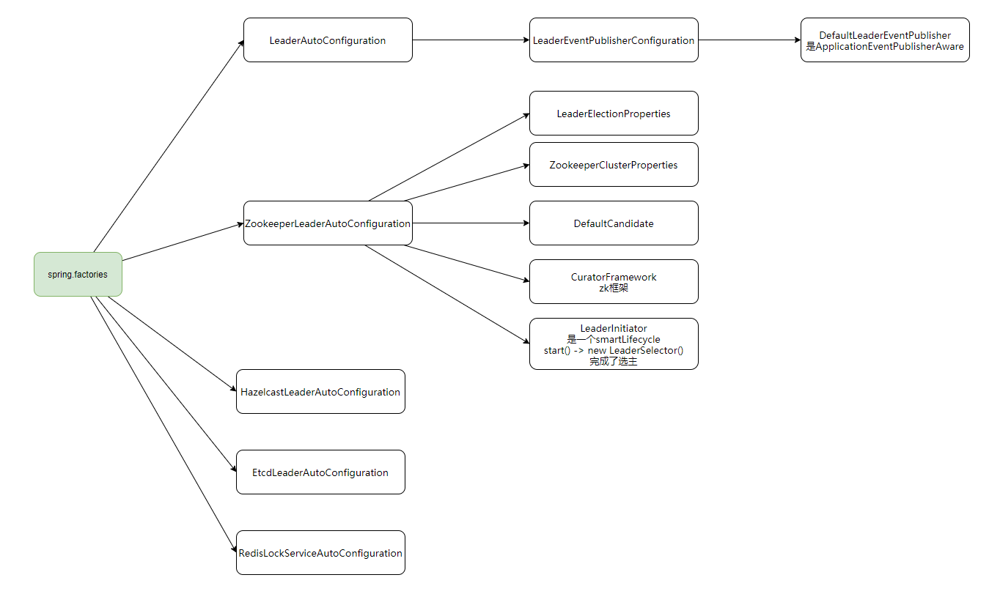


### Spring Cloud Gateway


```java
package com.example.demo;

import java.util.ArrayList;
import java.util.List;
import org.springframework.boot.SpringApplication;
import org.springframework.boot.autoconfigure.SpringBootApplication;
import org.springframework.cloud.gateway.event.RefreshRoutesEvent;
import org.springframework.cloud.gateway.route.RouteDefinition;
import org.springframework.cloud.gateway.route.RouteDefinitionRepository;
import org.springframework.context.ApplicationEventPublisher;
import org.springframework.context.ApplicationEventPublisherAware;
import org.springframework.web.bind.annotation.DeleteMapping;
import org.springframework.web.bind.annotation.GetMapping;
import org.springframework.web.bind.annotation.PostMapping;
import org.springframework.web.bind.annotation.PutMapping;
import org.springframework.web.bind.annotation.RequestBody;
import org.springframework.web.bind.annotation.RestController;
import reactor.core.publisher.Flux;
import reactor.core.publisher.Mono;

// 动态路由
// https://zhuanlan.zhihu.com/p/125018436
@RestController
@SpringBootApplication
public class DemoApplication implements RouteDefinitionRepository, ApplicationEventPublisherAware {

    public static void main(String[] args) {
        SpringApplication.run(DemoApplication.class, args);
    }

    // event publisher
    ApplicationEventPublisher applicationEventPublisher;

    @Override
    public void setApplicationEventPublisher(ApplicationEventPublisher applicationEventPublisher) {
        this.applicationEventPublisher = applicationEventPublisher;
    }


    // router
    List<RouteDefinition> memery = new ArrayList<>();

    private void refreshRoute() {
        applicationEventPublisher.publishEvent(new RefreshRoutesEvent(this));
    }

    @PutMapping
    Mono<Void> putRoute(@RequestBody Mono<RouteDefinition> o) {
        return o.flatMap(routeDefinition -> {
            memery.add(routeDefinition);
            refreshRoute();
            return Mono.empty();
        });
    }

    @PostMapping
    Mono<Void> postRoute(@RequestBody Mono<RouteDefinition> o) {
        return o.flatMap(routeDefinition -> {
            for (int i = 0; i < memery.size(); i++) {
                if (memery.get(i).getId().equals(routeDefinition.getId())) {
                    memery.set(i, routeDefinition);
                }
            }
            refreshRoute();
            return Mono.empty();
        });
    }

    @DeleteMapping
    Mono<Void> deleteRoute(@RequestBody Mono<String> o) {
        return o.flatMap(id -> {
            memery.removeIf(routeDefinition -> routeDefinition.getId().equals(id));
            refreshRoute();
            return Mono.empty();
        });
    }

    @GetMapping
    Mono<List<RouteDefinition>> getRoute(){
        return Mono.just(memery);
    }

    @Override
    public Flux<RouteDefinition> getRouteDefinitions() {
        return Flux.fromIterable(memery);
    }

    @Override
    public Mono<Void> save(Mono<RouteDefinition> route) {
        return Mono.empty();
    }

    @Override
    public Mono<Void> delete(Mono<String> routeId) {
        return Mono.empty();
    }
}
```

```txt
GET http://localhost:52834/test

###

PUT http://localhost:52834
Content-Type: application/json

{
    "id": "test",
    "predicates": [
        {
            "name": "Path",
            "args": {
                "pattern": "/test"
            }
        }
    ],
    "filters": [
        {
            "name": "RewritePath",
            "args": {
                "regexp": "/test",
                "replacement": "/s"
            }
        }
    ],
    "uri": "http://www.baidu.com",
    "order": 0
}

###

GET http://localhost:52834

###

GET http://localhost:52834/test
```

# 微服务

## Zookeeper

### CuratorFramework

# 容器化开发

https://segmentfault.com/a/1190000023095631


## 注意事项

对于所有的容器化开发，我们的时区都需要设置

```docker
-v /etc/localtime:/etc/localtime
```


## Nodejs开发

```sh
docker run -itd \
--restart=always \
--name xxx \
-v /src/xxx:/src/xxx \
-v /etc/localtime:/etc/localtime \
-v /root/.ssh:/root/.ssh \
-p 3000:3000 \
node:14.4.0

# 这个时区设置添加到启动程序中
# process.env.TZ = 'Asia/Shanghai';
```

## Java开发

```sh
# docker 参数
-m 800m
--cpus 1
-v /root/.m2/:/root/.m2
-p 8080:8080 -p
--net docker-net
--ip 192.168.11.2
```

```Dockerfile
FROM maven:3.6.3-jdk-8
COPY . /src
WORKDIR /src
CMD ["sh", "dockerEntryPoint.sh"]
```

```sh
mvn -v
echo "package"
mvn clean package -Dmaven.test.skip=true
echo "start java application ... "
#java -jar -agentlib:jdwp=transport=dt_socket,server=n,address=10.40.28.63:5005,suspend=y main.jar
java -jar \
  -agentlib:jdwp=transport=dt_socket,server=y,suspend=n,address=5005 \
  *.jar
```


第一步，开发一个Spring程序

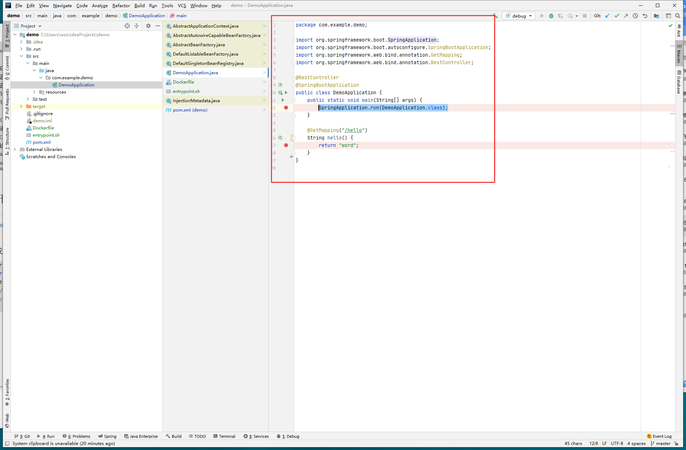

第二步，连接远端Centos

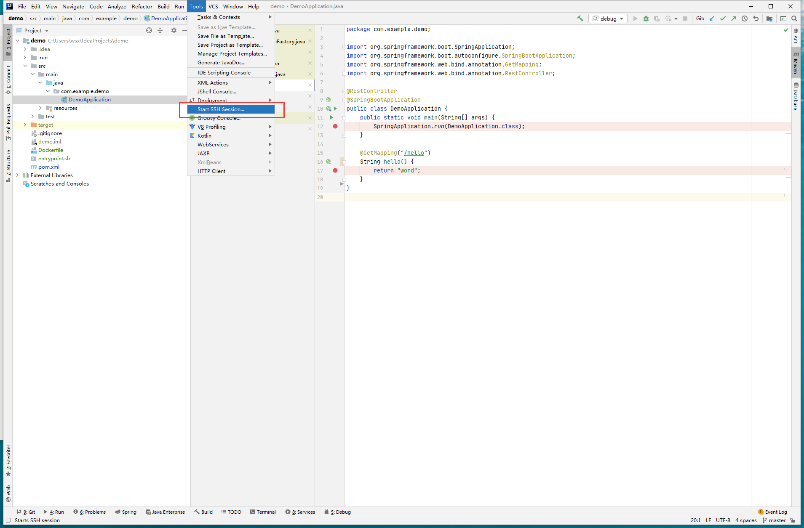

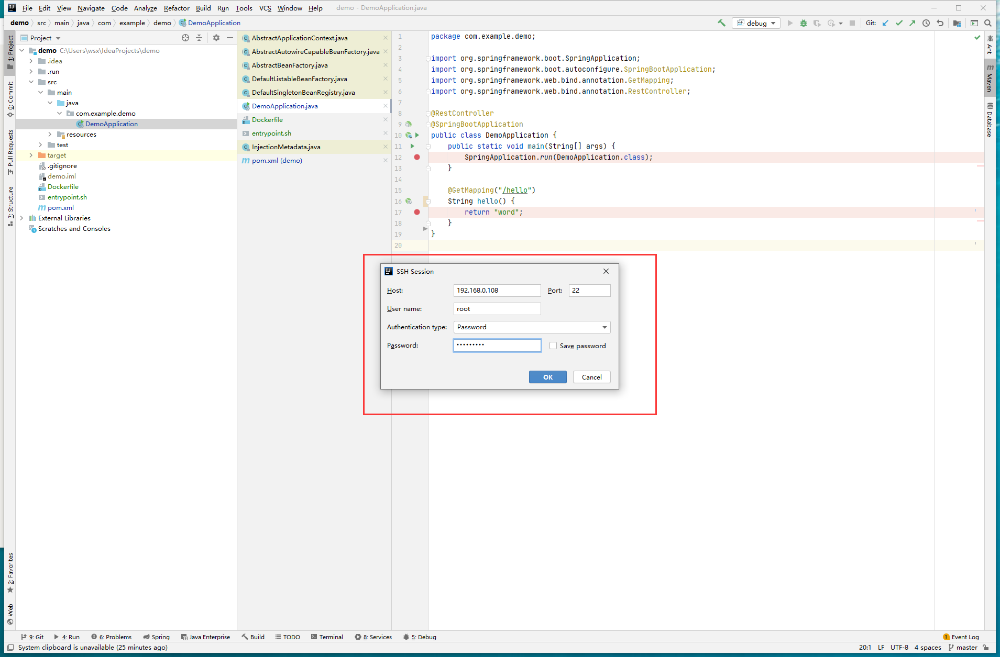

第三步修改docker启动参数并重启docker

```sh
vim /lib/systemd/system/docker.service 
```

增加 ` -H tcp://0.0.0.0:2375`

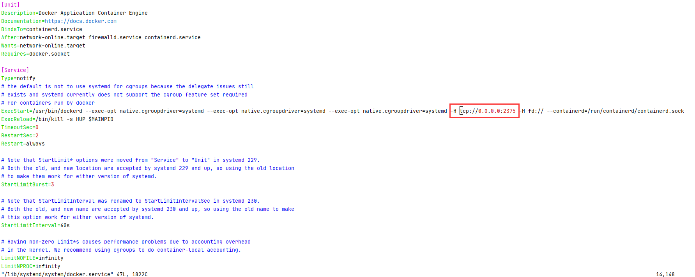

```sh
systemctl daemon-reload && systemctl restart docker && systemctl status docker
```

第四步创建Dockerfile以及entrypoint.sh

**注意Dockerfile中移动的jar包是编译产物**

**注意entrypoint.sh中的address后是自己本地机器的ip**

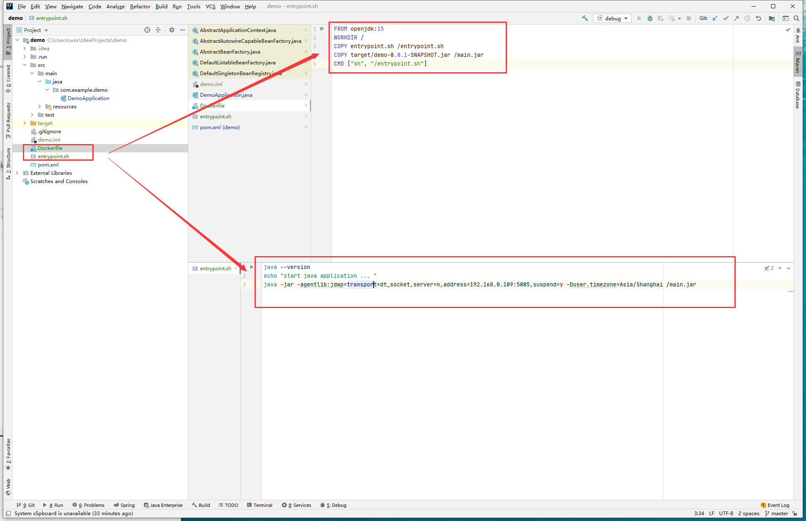

```dockerfile
FROM openjdk:15
WORKDIR /
COPY entrypoint.sh /entrypoint.sh
COPY target/demo-0.0.1-SNAPSHOT.jar /main.jar
CMD ["sh", "/entrypoint.sh"]
```

```sh
java --version
echo "start java application ... "
java -jar -agentlib:jdwp=transport=dt_socket,server=n,address=192.168.0.109:5005,suspend=y -Duser.timezone=Asia/Shanghai /main.jar
```

第五步创建Docker启动配置和Debug启动配置

**注意Dockerfile的Before lanch前加上 mvn package**

**注意Debug的Host为远程ip**

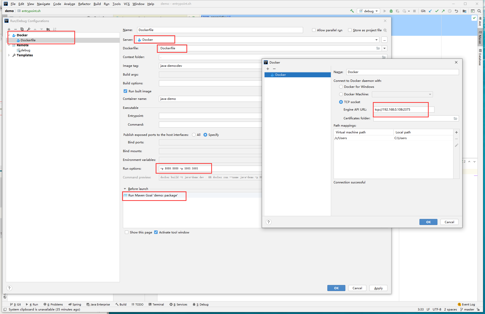

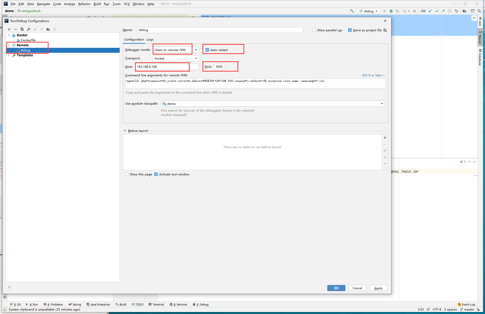

第六步先启动远程调试，后启动docker build

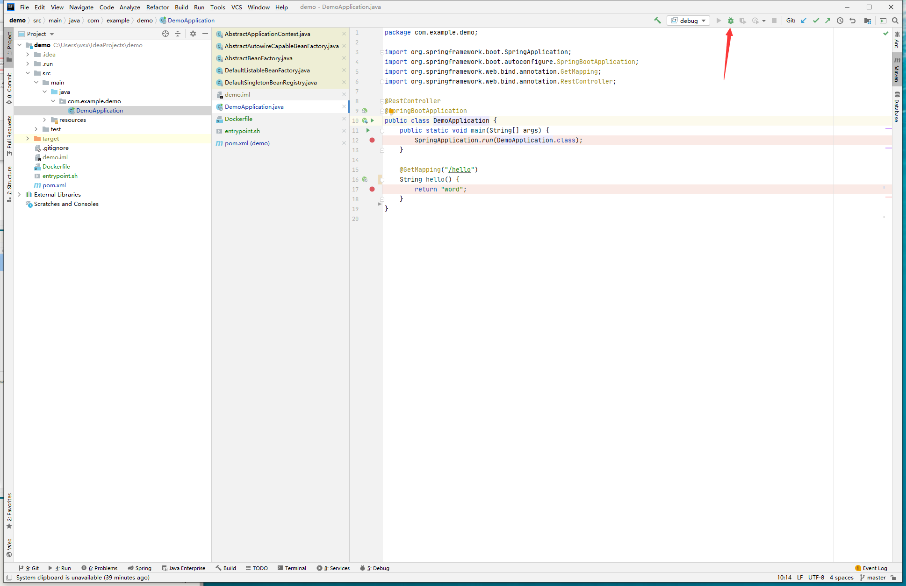

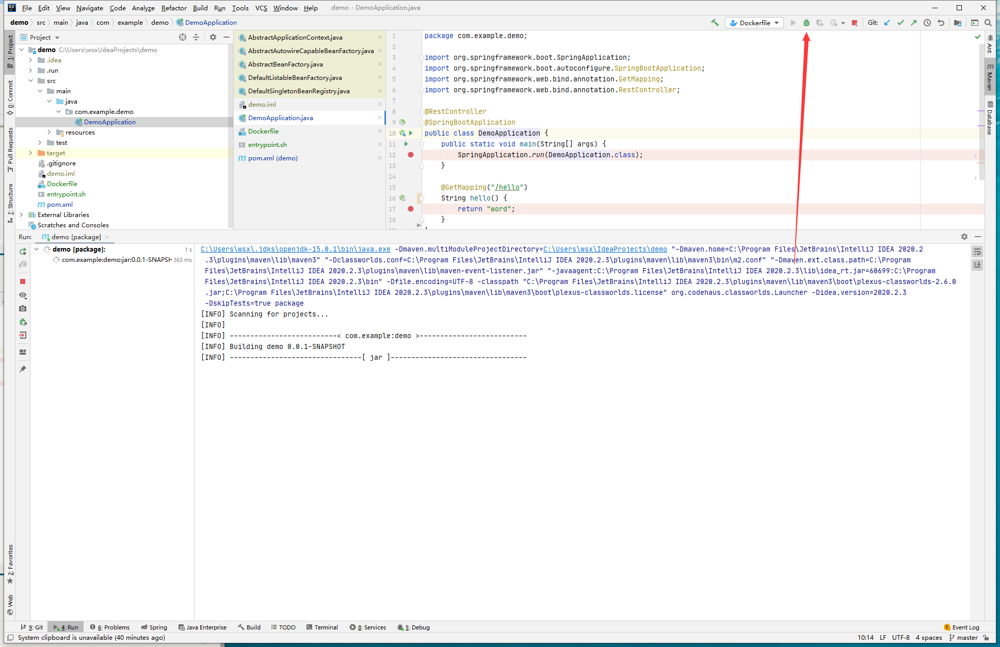

第七步： enjoy it


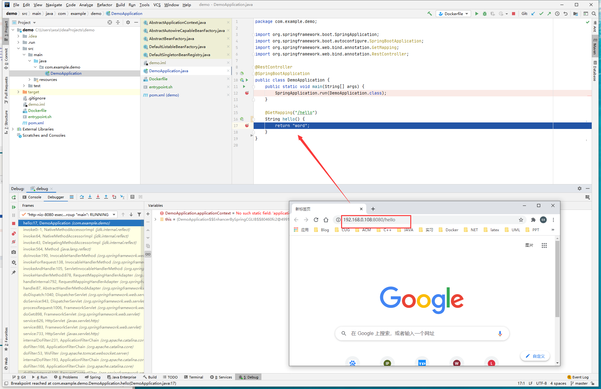


 hexo_post

# Algorithm

## 势能分析


### 势能分析简介
 势能分析是一种常用的数据结构时间复杂度分析的手段，我们常常会定义一个势能函数，用于评价数据结构某个状态的势能，把每个操作的时间复杂度加上操作导致的势能变化作为摊还复杂度，如果经过了一系列操作以后，势能不减少，这一系列操作的时间复杂度之和不大于这一系列操作的摊还复杂度之和。

#### 势能分析更加严谨的简介
 我们对一个初始数据结构$D_0$执行$n$个操作，对于每个$i=1,2,...,n$令$C_i$为第$i$个操作的实际代价,令$D_i$为在数据结构$D_{i-1}$上执行第$i$个操作后得到的结果数据结构，势能函数$\Phi$将每个数据结构$D_i$映射到一个实数$\Phi(D_i)$,此值即为关联到数据结构$D_i$的势，第$i$个操作的摊还代价$\hat{C_i}=C_i+\Phi(D_i)-\Phi(D_{i-1})$,则$n$个操作的总摊还代价为$\sum_{i=1}^n\hat{C_i}=\sum_{i=1}^n{C_i}+\Phi(D_n)-\Phi(D_0)$，如果势能函数满足$\Phi(D_n)\ge\Phi(D_0)$，则总摊还代价$\sum_{i=1}^n\hat{C_i}$是总实际代价$\sum_{i=1}^nC_i$的一个上界

### 后记
 笔者在此不会做势能分析，能进行势能分析的东西太多了，例如splay、pairing heap、fibonacci heap、link cut tree等等,我们将其留在后边的博文中详细介绍。


# BigData

## hadoop


### hadoop 
 hadoop = common+hdfs+mapreduce+yarn

### common
 工具、rpc通信

### hdfs
 分布式文件系统，一个文件分成多个128Mb的文件，存储在多个节点，为了保证分区容错性，存有备份，默认为3。主从架构。
#### namenode
 用来记录各个文件的block的编号、各个block的位置、抽象目录树
 处理读写请求
 可以有多个namenode
#### secondarynamenode
 用来备份namenode,当namenode宕机的时候，帮助namenode恢复
#### datanode
 用来储存数据
#### 副本机制
 如果一个datanode挂了，就再开一个datanode，然后吧挂了的数据通过备份推出来存进去，如果之前那个挂了的又活了，则选择一个节点删掉。副本过多将导致维护成本提高
#### 优点
- 可构建在廉价机器上
- 高容错性 : 自动恢复
#### 缺点
- 不支持数据修改(尽管支持改名和删除)
- 延迟高
- 不擅长存储小文件，寻址时间长，空间利用低


### yarn
 资源调度、管理框架
- resourcemanager 统筹资源
- nodemanager 资源调度

### mapreduce
 分布式计算框架


## Zookeeper


### Zookeeper介绍
Zookeeper是一个为分布式应用提供一致性服务的软件，是Hadoop项目的一个子项目，是分布式应用程序协调服务

### Zookeeper安装
这里有一个下载[地址](https://zookeeper.apache.org/releases.html#download),
也可以`brew install zookeeper`安装
还可以`docker pull zookeeper`安装
<!-- more -->
我们这里采取docker的方式

### Zookeeper单机启动
```sh
docker run -d -p 2181:2181 --name zookeeper --restart always zookeeper
docker exec -it zookeeper bash
./bin/zkCli.sh
```
然后我们能看到下面的输出, 我只截取前几行
```sh
Connecting to localhost:2181
2020-04-17 07:54:30,252 [myid:] - INFO  [main:Environment@98] - Client environment:zookeeper.version=3.6.0--b4c89dc7f6083829e18fae6e446907ae0b1f22d7, built on 02/25/2020 14:38 GMT
...
```
输入`quit`可以退出
### Zookeeper集群启动
嘿嘿嘿

### Zookeeper配置
在conf目录下有配置文件zoo_sample.cfg和log4j.properties,他们分别是zoo的配置文件模版和日志配置，我们可以将zoo_sample.cfg改为zoo.cfg，这个才是Zookeeper默认的配置文件，其中有几个地方比较重要

| 配置                             | 作用                                                         |
| -------------------------------- | ------------------------------------------------------------ |
| tickTime=2000                    | 这个是心跳时间间隔，单位是毫秒                               |
| dataDir=                         | Zookeeper保存数据的目录，默认将日志也保存在其中              |
| clientPort=2181                  | 客户端连接Zookeeper服务器的端口                              |
| initLimit=5                      | 当客户端超过5个心跳间隔仍然与服务器连接失败，则认为他宕机    |
| synLimit=2                       | Leader和Follower之间发送消息的响应、请求时间长度不能超过的心跳间隔 |
| server.1=192.168.211.1:2888:3888 | server.A=B:C:D, A是数字表示服务器编号，B是这个服务器的ip，C是服务器于集群leader交流信息的端口，D是Leader宕机以后选举新Leader的端口 |

### Zookeeper数据模型
Zookeeper会维护一个层次数据结构，他就像一个文件系统一样, 凑合着看吧
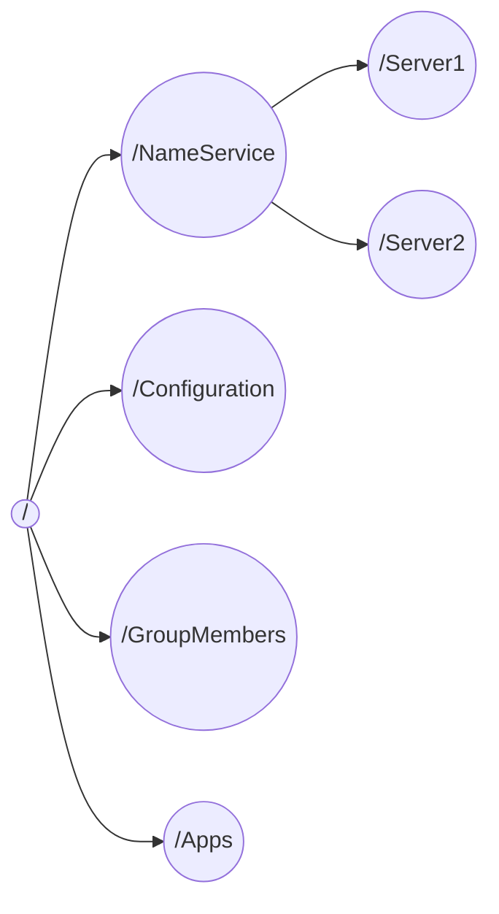
```mermaid
graph LR;
a((/)) --> b((/NameService));
a((/)) --> c((/Configuration));
a((/)) --> d((/GroupMembers));
a((/)) --> e((/Apps));
b((/NameService)) --> b1((/Server1))
b((/NameService)) --> b2((/Server2))
```
#### Zookeeper数据结构的特点
- 所有的目录项都被叫做znode，这个zndoe是被他所在的路径唯一标识，
- znode分4类，EPHEMERAL or PERSISTENT, SEQUENTIAL or N
- 大部分znode都可以有子节点，都可以储存数据， 只有EPHEMERAL不可以有子节点
- znode储存的数据可以拥有版本号
- EPHEMERAL 是临时节点，服务器客户端用心跳机制来保证长连接，如果客户端宕机，这个节点会被删除
- znode可以被监控，是一种观察者模式，客户端可以在目录上注册观察，当目录发生变化，客户端会得到通知


### Zookeeper持久化
Zookeeper的数据分为两个部分，一部分是内存数据，另一部分是磁盘数据，内存数据提供对外服务，磁盘数据用来恢复内存数据，用来在集群汇总不同节点间数据的同步，磁盘数据包括快照和事务日志，快照是粗粒度，事务日志是细粒度。

#### Zookeeper数据加载
先加载快照然后加载日志

#### 快照生成的时机
基于阈值，引入随机因素，我们要避免所有节点同时制造快照，这会导致消耗大量磁盘IO和CPU，降低对外服务能力，参见一个公式 
$$countLog>snapCount/2+randRoll$$
这里的countLog是累计执行的事务个数，snapCount是一个预先设定的阈值，randRoll是一个随机数

#### 事务日志的储存
事务日志是不断写入的，会触发底层磁盘IO，为了减少分配磁盘块对写入的影响，Zookeeper使用预分配的策略，每次分配64MB,当这64MB的空间被使用到只剩下4KB的时候，就开始再次分配空间了

### Zookeeper架构
**过半:**当leader广播一个事务消息以后，收到了半数以上的ack，就认为集群中所有的节点都收到了消息，leader不会等待剩余节点的ack，直接广播commit消息，提交事务，选举投票中也是如此

Zookeeper集群中有3种角色

| 角色     | 任务                                                         |
| -------- | ------------------------------------------------------------ |
| leader   | 一个集群只有一个leader，通过选举产生，负责所有事务的写操作，保证集群事务处理的顺序性 |
| follower | 处理非事务请求，转发事务给leader，参与leader选举投票，       |
| observer | 提供读取服务，不参与投票                                     |

### Zookeeper一致性协议
- 集群在半数以下节点宕机的情况下，能够正常对外提供服务
- 客户端的写请求全部转交给leader处理，以确保变更能实时同步到所有的follower和observer
- leader宕机或者整个集群重启的时候，要确保在leader上提交的事务最终被所有服务器提交，确保只在leader上提出单未被提交的事务被丢弃

#### Zookeeper选主
当集群中的服务器初始化启动或者运行期无法与leader保持连接的时候，会触发选主，投票者们混线传递投票的信息，包含了被推举的leader的服务id、事务zxid、逻辑时钟、选举状态，显然要选举事务zxid最大的那个,如果事务id相同，就选择服务id最大的那个

广播的时候每当外边传入的(id,zxid)比自己内存中的要优的时候，就更新自己的数据，然后向外广播[^理解zookeeper选举机制]

这里有一个有意思的东西，我们什么时候选举结束呢？

当一个(id,zxid)被超过半数的节点所选举的时候，它就有力担当leader，为什么是半数？因为Zookeeper集群的每一条事务，都是在超过半数ack的情况下才能被leader提交，所以如果一个节点在半数中为最优，那么它一定是最优者之一

这就好比一个数列，数列中的最大值的数量超过了半数，那么该序列的任何一个元素个数超过一半的子序列的最值，一定等于整个序列的最值。比方有一个序列[1,2,3,5,5,5,5], 你在其中选择至少4个数，那么他们中的最大值一定是5，其实就是鸽巢原理

另一方面选主的时候，每个节点都是三个线程，一个负责接收投票并放入队列，另一个用于发送投票信息，还有一个用于外部投票同自己的信息比较，选出新的结果

#### Zookeeper选主后的同步
这里的数据不一致可能有两种，要么比leader旧，要么比leader新，旧的话同步即可，新的话撤销这个未提交的事务即可, 两个不一致性的原因这里有谈到[^分析Zookeeper的一致性原理]

#### 两阶段提交
事务由leader发起，follower执行，然后返回ack，最终由leader决定是否提交。


### Zookeeper的应用
#### 统一命名服务
路径就是名字
#### 配置管理
我们的集群，每台机器都有自己的配置文件，这会非常难以维护，实际上我们会把配置文件储存在Zookeeper的某个目录节点中，让集群的每台机器都注册该节点的观察，当配置文件发生改变的时候，这些机器都会的得到通知，然后从Zookeeper更新自己的配置文件。
#### 集群管理
我们的集群需要有一个总管知道集群中每台机器的状态，当一些机器发生故障或者新添加机器的时候，总管必须知道，这就可以用Zookeeper管理

甚至当总管宕机以后，Zookeeper能够重新选出总管，总管会在Zookeeper中创建一个EPHEMERAL类型的目录节点，每个Server会注册这个节点的watch，总管死去的时候，这个目录会被删除，所有的子节点都会收到通知，这时大家都知道总管宕机了，集群默认会选择接待你编号最小的Server作为新的Master。
#### 分布式锁
同样，我们让第一个创建某目录成功的机器获得锁，其他机器在其子目录下创建新的目录节点，当它需要释放锁的时候，只需要删除目录，然后让子节点中编号最小的节点作文新的目录获得锁，其他节点继续跟随即可。
#### 队列管理
同步队列，即当所有成员达到某个条件是，才能以前向后执行，我们创建一个同步目录，每当一个成员满足条件，就去Zookeeper上注册节点，如果当前节点的个数达到n，就创建start节点，否则注册watch，等待start节点被创建，当其被创建就会收到通知，然后执行自己的事情

FIFO队列， 如生产者消费者模型，创建子目录/queue,当生产者生产出东西的时候，在/queue上创建新节点，当消费者需要消费的时候，从当前目录去除编号最小的节点即可


### 参考资料
[Docker下安装zookeeper（单机 & 集群）](https://www.cnblogs.com/LUA123/p/11428113.html)
[ZooKeeper学习 一:安装](https://blog.csdn.net/weixin_41863129/article/details/105028766)
[zookeeper使用和原理探究](http://jm.taobao.org/2010/12/21/665/)
[分布式服务框架 Zookeeper — 管理分布式环境中的数据](https://www.ibm.com/developerworks/cn/opensource/os-cn-zookeeper/)
[mac安装的docker替换镜像](https://www.cnblogs.com/jinzhidao/p/12534064.html)
[Zookeeper持久化原理](https://my.oschina.net/u/3847203/blog/3098735/print)
[ZooKeeper 技术内幕：数据的存储(持久化机制)](https://blog.csdn.net/varyall/article/details/795644180)
[Zookeeper-持久化](https://blog.csdn.net/jpf254/article/details/80769525)
[分析Zookeeper的一致性原理](https://blog.51cto.com/welcomeweb/2103292?utm_source=oschina-app)
[理解zookeeper选举机制](https://www.cnblogs.com/shuaiandjun/p/9383655.html)

## Docker-Zookeeper集群部署

### 创建工作目录
```sh
mkdir ~/DockerDesktop
mkdir ~/DockerDesktop/Zookeeper
cd ~/DockerDesktop/Zookeeper
```
<!-- more -->
### 创建挂载目录
```sh
mkdir node1 
mkdir node1/data
mkdir node1/datalog
cp -r node1 node2
cp -r node1 node3
cp -r node1 node4
cp -r node1 node5
```
### 创建docker-compose.yml
```sh
vim docker-compose.yml
```
```yml
version: '3'

services:
  Zookeeper1:
    image: zookeeper
    hostname: Zookeeper1
    volumes: # 挂载数据
      - ~/DockerDesktop/Zookeeper/node1/data:/data
      - ~/DockerDesktop/Zookeeper/node1/datalog:/datalog
    environment:
      ZOO_MY_ID: 1
      ZOO_SERVERS: server.1=Zookeeper1:2888:3888;2181 server.2=Zookeeper2:2888:3888;2181 server.3=Zookeeper3:2888:3888;2181 server.4=Zookeeper4:2888:3888;2181 server.5=Zookeeper5:2888:3888;2181
    networks:
      default:
        ipv4_address: 172.17.1.1

  Zookeeper2:
    image: zookeeper
    hostname: Zookeeper2
    volumes: # 挂载数据
      - ~/DockerDesktop/Zookeeper/node2/data:/data
      - ~/DockerDesktop/Zookeeper/node2/datalog:/datalog
    environment:
      ZOO_MY_ID: 2
      ZOO_SERVERS: server.1=Zookeeper1:2888:3888;2181 server.2=Zookeeper2:2888:3888;2181 server.3=Zookeeper3:2888:3888;2181 server.4=Zookeeper4:2888:3888;2181 server.5=Zookeeper5:2888:3888;2181
    networks:
      default:
        ipv4_address: 172.17.1.2

  Zookeeper3:
    image: zookeeper
    hostname: Zookeeper3
    volumes: # 挂载数据
      - ~/DockerDesktop/Zookeeper/node3/data:/data
      - ~/DockerDesktop/Zookeeper/node3/datalog:/datalog
    environment:
      ZOO_MY_ID: 3
      ZOO_SERVERS: server.1=Zookeeper1:2888:3888;2181 server.2=Zookeeper2:2888:3888;2181 server.3=Zookeeper3:2888:3888;2181 server.4=Zookeeper4:2888:3888;2181 server.5=Zookeeper5:2888:3888;2181
    networks:
      default:
        ipv4_address: 172.17.1.3

  Zookeeper4:
    image: zookeeper
    hostname: Zookeeper4
    volumes: # 挂载数据
      - ~/DockerDesktop/Zookeeper/node4/data:/data
      - ~/DockerDesktop/Zookeeper/node4/datalog:/datalog
    environment:
      ZOO_MY_ID: 4
      ZOO_SERVERS: server.1=Zookeeper1:2888:3888;2181 server.2=Zookeeper2:2888:3888;2181 server.3=Zookeeper3:2888:3888;2181 server.4=Zookeeper4:2888:3888;2181 server.5=Zookeeper5:2888:3888;2181
    networks:
      default:
        ipv4_address: 172.17.1.4

  Zookeeper5:
    image: zookeeper
    hostname: Zookeeper5
    volumes: # 挂载数据
      - ~/DockerDesktop/Zookeeper/node5/data:/data
      - ~/DockerDesktop/Zookeeper/node5/datalog:/datalog
    environment:
      ZOO_MY_ID: 5
      ZOO_SERVERS: server.1=Zookeeper1:2888:3888;2181 server.2=Zookeeper2:2888:3888;2181 server.3=Zookeeper3:2888:3888;2181 server.4=Zookeeper4:2888:3888;2181 server.5=Zookeeper5:2888:3888;2181
    networks:
      default:
        ipv4_address: 172.17.1.5

networks: # 自定义网络
  default:
    external:
      name: net17
```
### 运行
```
docker-compose up -d
```
我们不难发现Zookeeper5成为了集群的leader，其他都都成为了follower
```
Zookeeper5_1  | 2020-04-18 09:53:01,840 [myid:5] - INFO  [QuorumPeer[myid=5](plain=0.0.0.0:2181)(secure=disabled):QuorumPeer@863] - Peer state changed: leading - broadcast
Zookeeper3_1  | 2020-04-18 09:53:01,871 [myid:3] - INFO  [QuorumPeer[myid=3](plain=0.0.0.0:2181)(secure=disabled):CommitProcessor@476] - Configuring CommitProcessor with readBatchSize -1 commitBatchSize 1
Zookeeper1_1  | 2020-04-18 09:53:01,874 [myid:1] - INFO  [QuorumPeer[myid=1](plain=0.0.0.0:2181)(secure=disabled):CommitProcessor@476] - Configuring CommitProcessor with readBatchSize -1 commitBatchSize 1
Zookeeper1_1  | 2020-04-18 09:53:01,876 [myid:1] - INFO  [QuorumPeer[myid=1](plain=0.0.0.0:2181)(secure=disabled):CommitProcessor@438] - Configuring CommitProcessor with 1 worker threads.
Zookeeper3_1  | 2020-04-18 09:53:01,875 [myid:3] - INFO  [QuorumPeer[myid=3](plain=0.0.0.0:2181)(secure=disabled):CommitProcessor@438] - Configuring CommitProcessor with 1 worker threads.
Zookeeper4_1  | 2020-04-18 09:53:01,874 [myid:4] - INFO  [QuorumPeer[myid=4](plain=0.0.0.0:2181)(secure=disabled):CommitProcessor@476] - Configuring CommitProcessor with readBatchSize -1 commitBatchSize 1
Zookeeper4_1  | 2020-04-18 09:53:01,882 [myid:4] - INFO  [QuorumPeer[myid=4](plain=0.0.0.0:2181)(secure=disabled):CommitProcessor@438] - Configuring CommitProcessor with 1 worker threads.
Zookeeper2_1  | 2020-04-18 09:53:01,890 [myid:2] - INFO  [QuorumPeer[myid=2](plain=0.0.0.0:2181)(secure=disabled):CommitProcessor@476] - Configuring CommitProcessor with readBatchSize -1 commitBatchSize 1
Zookeeper2_1  | 2020-04-18 09:53:01,897 [myid:2] - INFO  [QuorumPeer[myid=2](plain=0.0.0.0:2181)(secure=disabled):CommitProcessor@438] - Configuring CommitProcessor with 1 worker threads.
Zookeeper1_1  | 2020-04-18 09:53:01,909 [myid:1] - INFO  [QuorumPeer[myid=1](plain=0.0.0.0:2181)(secure=disabled):RequestThrottler@74] - zookeeper.request_throttler.shutdownTimeout = 10000
Zookeeper4_1  | 2020-04-18 09:53:01,915 [myid:4] - INFO  [QuorumPeer[myid=4](plain=0.0.0.0:2181)(secure=disabled):RequestThrottler@74] - zookeeper.request_throttler.shutdownTimeout = 10000
Zookeeper3_1  | 2020-04-18 09:53:01,921 [myid:3] - INFO  [QuorumPeer[myid=3](plain=0.0.0.0:2181)(secure=disabled):RequestThrottler@74] - zookeeper.request_throttler.shutdownTimeout = 10000
Zookeeper2_1  | 2020-04-18 09:53:01,928 [myid:2] - INFO  [QuorumPeer[myid=2](plain=0.0.0.0:2181)(secure=disabled):RequestThrottler@74] - zookeeper.request_throttler.shutdownTimeout = 10000
Zookeeper1_1  | 2020-04-18 09:53:02,053 [myid:1] - INFO  [QuorumPeer[myid=1](plain=0.0.0.0:2181)(secure=disabled):QuorumPeer@863] - Peer state changed: following - broadcast
Zookeeper4_1  | 2020-04-18 09:53:02,056 [myid:4] - INFO  [QuorumPeer[myid=4](plain=0.0.0.0:2181)(secure=disabled):QuorumPeer@863] - Peer state changed: following - broadcast
Zookeeper3_1  | 2020-04-18 09:53:02,063 [myid:3] - INFO  [QuorumPeer[myid=3](plain=0.0.0.0:2181)(secure=disabled):QuorumPeer@863] - Peer state changed: following - broadcast
Zookeeper2_1  | 2020-04-18 09:53:02,068 [myid:2] - INFO  [QuorumPeer[myid=2](plain=0.0.0.0:2181)(secure=disabled):QuorumPeer@863] - Peer state changed: following - broadcast
```


## Kafka

### Kafka概述
#### 定义
Kafka是一个分布式的基于发布/订阅模式的消息队列，应用于大数据实时处理领域
#### 消息队列的优点
主要是解耦和削峰
- 解耦
- 可恢复，如果系统中一部分组件失效，加入队列的消息仍然可以在系统恢复后被处理
- 削峰
- 灵活，可动态维护消息队列的集群
- 异步
<!-- more -->
#### 消息队列的两种模式
##### 点对点
一对一，消费者主动拉取消息，收到后清除
##### 发布/订阅模式
一对多，消费者消费后，消息不会清除，当然也不是永久保留，

分两种，一个是发布者主动推送，另一个是消费者主动拉取，Kafka就是消费者主动拉取，

| 推送                         | 拉取                                           |
| ---------------------------- | ---------------------------------------------- |
| 不好照顾多个消费者的接受速度 | 主动拉取，由消费者决定                         |
|                              | 消费者要每过一段时间就询问有没有新消息，长轮询 |
#### 基础架构
Kafka Cluster 中有多个 Broker
Broker中有多个Topic Partion
每个Topic的多个Parttition，放在多个Broker上，可以提高Producer的并发，每个Topic Partition在其他Cluster上存有副本，用于备份，他们存在leader和follower，我们只找leader，不找follower

Topic是分区的，每个分区都是有副本的，分为leader和follower

消费者存在消费者组，一个分区只能被同一个组的某一个消费者消费，我们主要是把一个组当作一个大消费者，消费者组可以提高消费能力，消费者多了整个组的消费能力就高了，消费组中消费者的个数不要比消息多，不然就是浪费资源

Kafka利用Zookeeper来管理配置
0.9前消费者把自己消费的位置信息储存在Zookeeper中
0.9后是Kafka自己储存在某个主题中(减少了消费者和zk的连接)

**[我偷了个图](https://www.bilibili.com/video/BV1a4411B7V9?p=5)**


### Kafka入门
#### Kafka部署
官网下载[Kafka](http://kafka.apache.org)
`brew install kafka`
`docker pull wurstmeister/kafka`
这里我依然选择docker安装，
```
mkdir ~/DockerDesktop
mkdir ~/DockerDesktop/Kafka
cd ~/DockerDesktop/Kafka
mkdir node1 node2 node3 node4 node5
vim docker-compose.yml
```
```yml
version: '3'

services:
  Kafka1:
    image: wurstmeister/kafka
    hostname: Kafka1
    environment:
      KAFKA_ADVERTISED_HOST_NAME: Kafka1
      KAFKA_ADVERTISED_PORT: 9092
      KAFKA_ZOOKEEPER_CONNECT: Zookeeper1:2181,Zookeeper2:2181,Zookeeper3:2181,Zookeeper4:2181,Zookeeper5:2181
    volumes:
    - ~/DockerDesktop/Kafka/node1:/kafka
    external_links:
    - Zookeeper1
    - Zookeeper2
    - Zookeeper3
    - Zookeeper4
    - Zookeeper5
    networks:
      default:
        ipv4_address: 172.17.2.1

  Kafka2:
    image: wurstmeister/kafka
    hostname: Kafka2
    environment:
      KAFKA_ADVERTISED_HOST_NAME: Kafka2
      KAFKA_ADVERTISED_PORT: 9092
      KAFKA_ZOOKEEPER_CONNECT: Zookeeper1:2181,Zookeeper2:2181,Zookeeper3:2181,Zookeeper4:2181,Zookeeper5:2181
    volumes:
    - ~/DockerDesktop/Kafka/node2:/kafka
    external_links:
    - Zookeeper1
    - Zookeeper2
    - Zookeeper3
    - Zookeeper4
    - Zookeeper5
    networks:
      default:
        ipv4_address: 172.17.2.2

  Kafka3:
    image: wurstmeister/kafka
    hostname: Kafka3
    environment:
      KAFKA_ADVERTISED_HOST_NAME: Kafka3
      KAFKA_ADVERTISED_PORT: 9092
      KAFKA_ZOOKEEPER_CONNECT: Zookeeper1:2181,Zookeeper2:2181,Zookeeper3:2181,Zookeeper4:2181,Zookeeper5:2181
    volumes:
    - ~/DockerDesktop/Kafka/node3:/kafka
    external_links:
    - Zookeeper1
    - Zookeeper2
    - Zookeeper3
    - Zookeeper4
    - Zookeeper5
    networks:
      default:
        ipv4_address: 172.17.2.3

  Kafka4:
    image: wurstmeister/kafka
    hostname: Kafka4
    environment:
      KAFKA_ADVERTISED_HOST_NAME: Kafka4
      KAFKA_ADVERTISED_PORT: 9092
      KAFKA_ZOOKEEPER_CONNECT: Zookeeper1:2181,Zookeeper2:2181,Zookeeper3:2181,Zookeeper4:2181,Zookeeper5:2181
    volumes:
    - ~/DockerDesktop/Kafka/node4:/kafka
    external_links:
    - Zookeeper1
    - Zookeeper2
    - Zookeeper3
    - Zookeeper4
    - Zookeeper5
    networks:
      default:
        ipv4_address: 172.17.2.4


  Kafka5:
    image: wurstmeister/kafka
    hostname: Kafka5
    environment:
      KAFKA_ADVERTISED_HOST_NAME: Kafka5
      KAFKA_ADVERTISED_PORT: 9092
      KAFKA_ZOOKEEPER_CONNECT: Zookeeper1:2181,Zookeeper2:2181,Zookeeper3:2181,Zookeeper4:2181,Zookeeper5:2181
    volumes:
    - ~/DockerDesktop/Kafka/node5:/kafka
    external_links:
    - Zookeeper1
    - Zookeeper2
    - Zookeeper3
    - Zookeeper4
    - Zookeeper5
    networks:
      default:
        ipv4_address: 172.17.2.5


networks:
  default:
    external:
      name: net17
```
执行下面的指令，Kafka集群开始运行
```
docker-compose up
```
看到了输出
```
Kafka3_1  | [2020-04-18 10:26:27,441] INFO [Transaction Marker Channel Manager 1002]: Starting (kafka.coordinator.transaction.TransactionMarkerChannelManager)
Kafka4_1  | [2020-04-18 10:26:27,451] INFO [ExpirationReaper-1005-AlterAcls]: Starting (kafka.server.DelayedOperationPurgatory$ExpiredOperationReaper)
Kafka5_1  | [2020-04-18 10:26:27,473] INFO [TransactionCoordinator id=1001] Starting up. (kafka.coordinator.transaction.TransactionCoordinator)
Kafka5_1  | [2020-04-18 10:26:27,524] INFO [TransactionCoordinator id=1001] Startup complete. (kafka.coordinator.transaction.TransactionCoordinator)
Kafka5_1  | [2020-04-18 10:26:27,554] INFO [Transaction Marker Channel Manager 1001]: Starting (kafka.coordinator.transaction.TransactionMarkerChannelManager)
Kafka1_1  | [2020-04-18 10:26:27,635] INFO [TransactionCoordinator id=1003] Starting up. (kafka.coordinator.transaction.TransactionCoordinator)
Kafka1_1  | [2020-04-18 10:26:27,644] INFO [TransactionCoordinator id=1003] Startup complete. (kafka.coordinator.transaction.TransactionCoordinator)
Kafka1_1  | [2020-04-18 10:26:27,669] INFO [Transaction Marker Channel Manager 1003]: Starting (kafka.coordinator.transaction.TransactionMarkerChannelManager)
Kafka2_1  | [2020-04-18 10:26:27,748] INFO [ExpirationReaper-1004-AlterAcls]: Starting (kafka.server.DelayedOperationPurgatory$ExpiredOperationReaper)
Kafka4_1  | [2020-04-18 10:26:27,753] INFO [/config/changes-event-process-thread]: Starting (kafka.common.ZkNodeChangeNotificationListener$ChangeEventProcessThread)
Kafka3_1  | [2020-04-18 10:26:27,843] INFO [ExpirationReaper-1002-AlterAcls]: Starting (kafka.server.DelayedOperationPurgatory$ExpiredOperationReaper)
Kafka4_1  | [2020-04-18 10:26:27,882] INFO [SocketServer brokerId=1005] Started data-plane processors for 1 acceptors (kafka.network.SocketServer)
Kafka4_1  | [2020-04-18 10:26:27,945] INFO Kafka version: 2.4.1 (org.apache.kafka.common.utils.AppInfoParser)
Kafka4_1  | [2020-04-18 10:26:27,950] INFO Kafka commitId: c57222ae8cd7866b (org.apache.kafka.common.utils.AppInfoParser)
Kafka4_1  | [2020-04-18 10:26:27,955] INFO Kafka startTimeMs: 1587205587891 (org.apache.kafka.common.utils.AppInfoParser)
Kafka4_1  | [2020-04-18 10:26:27,976] INFO [KafkaServer id=1005] started (kafka.server.KafkaServer)
Kafka2_1  | [2020-04-18 10:26:27,989] INFO [/config/changes-event-process-thread]: Starting (kafka.common.ZkNodeChangeNotificationListener$ChangeEventProcessThread)
Kafka1_1  | [2020-04-18 10:26:28,076] INFO [ExpirationReaper-1003-AlterAcls]: Starting (kafka.server.DelayedOperationPurgatory$ExpiredOperationReaper)
Kafka3_1  | [2020-04-18 10:26:28,095] INFO [/config/changes-event-process-thread]: Starting (kafka.common.ZkNodeChangeNotificationListener$ChangeEventProcessThread)
Kafka2_1  | [2020-04-18 10:26:28,190] INFO [SocketServer brokerId=1004] Started data-plane processors for 1 acceptors (kafka.network.SocketServer)
Kafka2_1  | [2020-04-18 10:26:28,239] INFO Kafka version: 2.4.1 (org.apache.kafka.common.utils.AppInfoParser)
Kafka2_1  | [2020-04-18 10:26:28,241] INFO Kafka commitId: c57222ae8cd7866b (org.apache.kafka.common.utils.AppInfoParser)
Kafka2_1  | [2020-04-18 10:26:28,243] INFO Kafka startTimeMs: 1587205588196 (org.apache.kafka.common.utils.AppInfoParser)
Kafka2_1  | [2020-04-18 10:26:28,244] INFO [KafkaServer id=1004] started (kafka.server.KafkaServer)
Kafka3_1  | [2020-04-18 10:26:28,253] INFO [SocketServer brokerId=1002] Started data-plane processors for 1 acceptors (kafka.network.SocketServer)
Kafka3_1  | [2020-04-18 10:26:28,292] INFO Kafka version: 2.4.1 (org.apache.kafka.common.utils.AppInfoParser)
Kafka3_1  | [2020-04-18 10:26:28,295] INFO Kafka commitId: c57222ae8cd7866b (org.apache.kafka.common.utils.AppInfoParser)
Kafka3_1  | [2020-04-18 10:26:28,297] INFO Kafka startTimeMs: 1587205588257 (org.apache.kafka.common.utils.AppInfoParser)
Kafka3_1  | [2020-04-18 10:26:28,313] INFO [KafkaServer id=1002] started (kafka.server.KafkaServer)
Kafka1_1  | [2020-04-18 10:26:28,327] INFO [/config/changes-event-process-thread]: Starting (kafka.common.ZkNodeChangeNotificationListener$ChangeEventProcessThread)
Kafka5_1  | [2020-04-18 10:26:28,365] INFO [ExpirationReaper-1001-AlterAcls]: Starting (kafka.server.DelayedOperationPurgatory$ExpiredOperationReaper)
Kafka1_1  | [2020-04-18 10:26:28,533] INFO [SocketServer brokerId=1003] Started data-plane processors for 1 acceptors (kafka.network.SocketServer)
Kafka1_1  | [2020-04-18 10:26:28,582] INFO Kafka version: 2.4.1 (org.apache.kafka.common.utils.AppInfoParser)
Kafka1_1  | [2020-04-18 10:26:28,582] INFO Kafka commitId: c57222ae8cd7866b (org.apache.kafka.common.utils.AppInfoParser)
Kafka1_1  | [2020-04-18 10:26:28,584] INFO Kafka startTimeMs: 1587205588534 (org.apache.kafka.common.utils.AppInfoParser)
Kafka1_1  | [2020-04-18 10:26:28,607] INFO [KafkaServer id=1003] started (kafka.server.KafkaServer)
Kafka5_1  | [2020-04-18 10:26:28,931] INFO [/config/changes-event-process-thread]: Starting (kafka.common.ZkNodeChangeNotificationListener$ChangeEventProcessThread)
Kafka5_1  | [2020-04-18 10:26:29,129] INFO [SocketServer brokerId=1001] Started data-plane processors for 1 acceptors (kafka.network.SocketServer)
Kafka5_1  | [2020-04-18 10:26:29,218] INFO Kafka version: 2.4.1 (org.apache.kafka.common.utils.AppInfoParser)
Kafka5_1  | [2020-04-18 10:26:29,218] INFO Kafka commitId: c57222ae8cd7866b (org.apache.kafka.common.utils.AppInfoParser)
Kafka5_1  | [2020-04-18 10:26:29,220] INFO Kafka startTimeMs: 1587205589130 (org.apache.kafka.common.utils.AppInfoParser)
Kafka5_1  | [2020-04-18 10:26:29,222] INFO [KafkaServer id=1001] started (kafka.server.KafkaServer)
```
同时我们在Zookeeper集群也看到了输出
```
Zookeeper1_1  | 2020-04-18 10:26:09,983 [myid:1] - WARN  [QuorumPeer[myid=1](plain=0.0.0.0:2181)(secure=disabled):Follower@170] - Got zxid 0x500000001 expected 0x1
Zookeeper1_1  | 2020-04-18 10:26:09,990 [myid:1] - INFO  [SyncThread:1:FileTxnLog@284] - Creating new log file: log.500000001
Zookeeper5_1  | 2020-04-18 10:26:09,988 [myid:5] - INFO  [SyncThread:5:FileTxnLog@284] - Creating new log file: log.500000001
Zookeeper2_1  | 2020-04-18 10:26:10,002 [myid:2] - WARN  [QuorumPeer[myid=2](plain=0.0.0.0:2181)(secure=disabled):Follower@170] - Got zxid 0x500000001 expected 0x1
Zookeeper2_1  | 2020-04-18 10:26:10,045 [myid:2] - INFO  [SyncThread:2:FileTxnLog@284] - Creating new log file: log.500000001
Zookeeper4_1  | 2020-04-18 10:26:10,059 [myid:4] - WARN  [QuorumPeer[myid=4](plain=0.0.0.0:2181)(secure=disabled):Follower@170] - Got zxid 0x500000001 expected 0x1
Zookeeper1_1  | 2020-04-18 10:26:10,087 [myid:1] - INFO  [CommitProcessor:1:LearnerSessionTracker@116] - Committing global session 0x500000589e20000
Zookeeper5_1  | 2020-04-18 10:26:10,092 [myid:5] - INFO  [CommitProcessor:5:LeaderSessionTracker@104] - Committing global session 0x500000589e20000
Zookeeper2_1  | 2020-04-18 10:26:10,093 [myid:2] - INFO  [CommitProcessor:2:LearnerSessionTracker@116] - Committing global session 0x500000589e20000
Zookeeper3_1  | 2020-04-18 10:26:10,071 [myid:3] - WARN  [QuorumPeer[myid=3](plain=0.0.0.0:2181)(secure=disabled):Follower@170] - Got zxid 0x500000001 expected 0x1
Zookeeper4_1  | 2020-04-18 10:26:10,098 [myid:4] - INFO  [SyncThread:4:FileTxnLog@284] - Creating new log file: log.500000001
Zookeeper3_1  | 2020-04-18 10:26:10,109 [myid:3] - INFO  [SyncThread:3:FileTxnLog@284] - Creating new log file: log.500000001
Zookeeper1_1  | 2020-04-18 10:26:10,113 [myid:1] - INFO  [CommitProcessor:1:LearnerSessionTracker@116] - Committing global session 0x100000589b30000
Zookeeper2_1  | 2020-04-18 10:26:10,126 [myid:2] - INFO  [CommitProcessor:2:LearnerSessionTracker@116] - Committing global session 0x100000589b30000
Zookeeper2_1  | 2020-04-18 10:26:10,141 [myid:2] - INFO  [CommitProcessor:2:LearnerSessionTracker@116] - Committing global session 0x200000589b20000
Zookeeper4_1  | 2020-04-18 10:26:10,144 [myid:4] - INFO  [CommitProcessor:4:LearnerSessionTracker@116] - Committing global session 0x500000589e20000
Zookeeper3_1  | 2020-04-18 10:26:10,137 [myid:3] - INFO  [CommitProcessor:3:LearnerSessionTracker@116] - Committing global session 0x500000589e20000
Zookeeper1_1  | 2020-04-18 10:26:10,171 [myid:1] - INFO  [CommitProcessor:1:LearnerSessionTracker@116] - Committing global session 0x200000589b20000
Zookeeper3_1  | 2020-04-18 10:26:10,199 [myid:3] - INFO  [CommitProcessor:3:LearnerSessionTracker@116] - Committing global session 0x100000589b30000
Zookeeper4_1  | 2020-04-18 10:26:10,176 [myid:4] - INFO  [CommitProcessor:4:LearnerSessionTracker@116] - Committing global session 0x100000589b30000
Zookeeper4_1  | 2020-04-18 10:26:10,202 [myid:4] - INFO  [CommitProcessor:4:LearnerSessionTracker@116] - Committing global session 0x200000589b20000
Zookeeper3_1  | 2020-04-18 10:26:10,203 [myid:3] - INFO  [CommitProcessor:3:LearnerSessionTracker@116] - Committing global session 0x200000589b20000
Zookeeper4_1  | 2020-04-18 10:26:10,204 [myid:4] - INFO  [CommitProcessor:4:LearnerSessionTracker@116] - Committing global session 0x200000589b20001
Zookeeper4_1  | 2020-04-18 10:26:10,209 [myid:4] - INFO  [CommitProcessor:4:LearnerSessionTracker@116] - Committing global session 0x200000589b20002
Zookeeper2_1  | 2020-04-18 10:26:10,224 [myid:2] - INFO  [CommitProcessor:2:LearnerSessionTracker@116] - Committing global session 0x200000589b20001
Zookeeper3_1  | 2020-04-18 10:26:10,227 [myid:3] - INFO  [CommitProcessor:3:LearnerSessionTracker@116] - Committing global session 0x200000589b20001
Zookeeper3_1  | 2020-04-18 10:26:10,241 [myid:3] - INFO  [CommitProcessor:3:LearnerSessionTracker@116] - Committing global session 0x200000589b20002
Zookeeper2_1  | 2020-04-18 10:26:10,243 [myid:2] - INFO  [CommitProcessor:2:LearnerSessionTracker@116] - Committing global session 0x200000589b20002
Zookeeper5_1  | 2020-04-18 10:26:10,245 [myid:5] - INFO  [CommitProcessor:5:LeaderSessionTracker@104] - Committing global session 0x100000589b30000
Zookeeper5_1  | 2020-04-18 10:26:10,260 [myid:5] - INFO  [CommitProcessor:5:LeaderSessionTracker@104] - Committing global session 0x200000589b20000
Zookeeper5_1  | 2020-04-18 10:26:10,270 [myid:5] - INFO  [CommitProcessor:5:LeaderSessionTracker@104] - Committing global session 0x200000589b20001
Zookeeper5_1  | 2020-04-18 10:26:10,307 [myid:5] - INFO  [CommitProcessor:5:LeaderSessionTracker@104] - Committing global session 0x200000589b20002
Zookeeper1_1  | 2020-04-18 10:26:10,403 [myid:1] - INFO  [CommitProcessor:1:LearnerSessionTracker@116] - Committing global session 0x200000589b20001
Zookeeper1_1  | 2020-04-18 10:26:10,407 [myid:1] - INFO  [CommitProcessor:1:LearnerSessionTracker@116] - Committing global session 0x200000589b20002
```
#### Kafka操作
开始操作
```
docker exec -it kafka_Kafka1_1 bash
cd /opt/kafka/bin
ls
```
我们可以看到一大堆东西
```
connect-distributed.sh               kafka-console-producer.sh            kafka-log-dirs.sh                    kafka-server-start.sh                windows
connect-mirror-maker.sh              kafka-consumer-groups.sh             kafka-mirror-maker.sh                kafka-server-stop.sh                 zookeeper-security-migration.sh
connect-standalone.sh                kafka-consumer-perf-test.sh          kafka-preferred-replica-election.sh  kafka-streams-application-reset.sh   zookeeper-server-start.sh
kafka-acls.sh                        kafka-delegation-tokens.sh           kafka-producer-perf-test.sh          kafka-topics.sh                      zookeeper-server-stop.sh
kafka-broker-api-versions.sh         kafka-delete-records.sh              kafka-reassign-partitions.sh         kafka-verifiable-consumer.sh         zookeeper-shell.sh
kafka-configs.sh                     kafka-dump-log.sh                    kafka-replica-verification.sh        kafka-verifiable-producer.sh
kafka-console-consumer.sh            kafka-leader-election.sh             kafka-run-class.sh                   trogdor.sh
```
指定Zookeeper1，看看消息,结果啥都没有，因为kafka中没有消息
```sh
kafka-topics.sh --zookeeper Zookeeper1:2181 --list
```
创建主题, --topic 定义topic名字，--replication-factor定义副本数量，--partitions定义分区数量， 我们创建3个副本一个分区的主题first
```sh
kafka-topics.sh --zookeeper Zookeeper1:2181 --create --replication-factor 3 --partitions 1 --topic first
```
看到输出
```sh
Created topic first.
```
然后使用`kafka-topics.sh --zookeeper Zookeeper1:2181 --list`就可以看到输出了一个first
```sh
first
```
现在我们回到docker外面的**宿主机**的终端
```sh
cd ~/DockerDesktop/Kafka
ls node1/kafka-logs-Kafka1/ node2/kafka-logs-Kafka2 node3/kafka-logs-Kafka3 node4/kafka-logs-Kafka4 node5/kafka-logs-Kafka5
```
得到了输出,由此可见，我们的node3，node4，node5上分别保留了first的副本,这里还有一个细节，我们现在是在kafka1上执行的命令，这也能说明我们的集群是搭建成功了的
```
node1/kafka-logs-Kafka1/:
cleaner-offset-checkpoint        log-start-offset-checkpoint      meta.properties                  recovery-point-offset-checkpoint replication-offset-checkpoint

node2/kafka-logs-Kafka2:
cleaner-offset-checkpoint        log-start-offset-checkpoint      meta.properties                  recovery-point-offset-checkpoint replication-offset-checkpoint

node3/kafka-logs-Kafka3:
cleaner-offset-checkpoint        first-0                          log-start-offset-checkpoint      meta.properties                  recovery-point-offset-checkpoint replication-offset-checkpoint

node4/kafka-logs-Kafka4:
cleaner-offset-checkpoint        first-0                          log-start-offset-checkpoint      meta.properties                  recovery-point-offset-checkpoint replication-offset-checkpoint

node5/kafka-logs-Kafka5:
cleaner-offset-checkpoint        first-0                          log-start-offset-checkpoint      meta.properties                  recovery-point-offset-checkpoint replication-offset-checkpoint
```
然后我们回到docker中，多来几次
```sh
kafka-topics.sh --zookeeper Zookeeper2:2181 --create --replication-factor 3 --partitions 1 --topic second
kafka-topics.sh --zookeeper Zookeeper3:2181 --create --replication-factor 3 --partitions 1 --topic third
kafka-topics.sh --zookeeper Zookeeper4:2181 --create --replication-factor 3 --partitions 1 --topic four
kafka-topics.sh --zookeeper Zookeeper5:2181 --create --replication-factor 3 --partitions 1 --topic five
```
最后再查看**宿主机**中的磁盘映射，这里一切正常，并且访问zookeeper集群中的任意一台机器都可行
```sh
node1/kafka-logs-Kafka1/:
cleaner-offset-checkpoint        log-start-offset-checkpoint      recovery-point-offset-checkpoint second-0
five-0                           meta.properties                  replication-offset-checkpoint    third-0

node2/kafka-logs-Kafka2:
cleaner-offset-checkpoint        log-start-offset-checkpoint      recovery-point-offset-checkpoint second-0
four-0                           meta.properties                  replication-offset-checkpoint

node3/kafka-logs-Kafka3:
cleaner-offset-checkpoint        five-0                           log-start-offset-checkpoint      recovery-point-offset-checkpoint
first-0                          four-0                           meta.properties                  replication-offset-checkpoint

node4/kafka-logs-Kafka4:
cleaner-offset-checkpoint        five-0                           meta.properties                  replication-offset-checkpoint    third-0
first-0                          log-start-offset-checkpoint      recovery-point-offset-checkpoint second-0

node5/kafka-logs-Kafka5:
cleaner-offset-checkpoint        four-0                           meta.properties                  replication-offset-checkpoint
first-0                          log-start-offset-checkpoint      recovery-point-offset-checkpoint third-0
```
全删掉
```sh
kafka-topics.sh --delete --zookeeper Zookeeper1:2181 --topic first
kafka-topics.sh --delete --zookeeper Zookeeper1:2181 --topic second
kafka-topics.sh --delete --zookeeper Zookeeper1:2181 --topic third
kafka-topics.sh --delete --zookeeper Zookeeper1:2181 --topic four
kafka-topics.sh --delete --zookeeper Zookeeper1:2181 --topic five
```
看到输出,在我的集群中，我发先几秒钟后，就被删干净了
```sh
Topic first is marked for deletion.
Note: This will have no impact if delete.topic.enable is not set to true.
```
为了后续的操作，我们重新创建一个新的主题
```sh
kafka-topics.sh --zookeeper Zookeeper5:2181 --create --replication-factor 3 --partitions 2 --topic first
```
随便起一台Kafka1, 作为生产者, 这里可以用localhost是因为他自己就是集群的一部分
```sh
kafka-console-producer.sh --topic first --broker-list localhost:9092
```
再起**另外**一台Kafka2作为消费者，这台就开始等待了
```sh
kafka-console-consumer.sh --topic first --bootstrap-server localhost:9092
```
在生成者中输出`>hello I am producer`， 我们就能在消费者中看到，那么过时的消费者怎么办呢？我们使用上面的指令再起一台消费者Kafka3， 发现他并不能收到hello那条消息了，在生成者中输入`>this is the second msg`,发现kafka2和kafka3都可以收到消息，然后我们使用下面的指令再其一台Kafka4,等待片刻，发现kafka4收到了所有的消息
```sh
kafka-console-consumer.sh --topic first --bootstrap-server localhost:9092 --from-beginning
```
在宿主机中输入
```sh
ls node1/kafka-logs-Kafka1/ node2/kafka-logs-Kafka2 node3/kafka-logs-Kafka3 node4/kafka-logs-Kafka4 node5/kafka-logs-Kafka5
```
得到输出,可以看到offsets是轮流保存的, 因为分区是为了负载均衡，而备份是为了容错
```sh
node1/kafka-logs-Kafka1/:
__consumer_offsets-14            __consumer_offsets-29            __consumer_offsets-4             __consumer_offsets-9             log-start-offset-checkpoint      replication-offset-checkpoint
__consumer_offsets-19            __consumer_offsets-34            __consumer_offsets-44            cleaner-offset-checkpoint        meta.properties
__consumer_offsets-24            __consumer_offsets-39            __consumer_offsets-49            first-1                          recovery-point-offset-checkpoint

node2/kafka-logs-Kafka2:
__consumer_offsets-0             __consumer_offsets-20            __consumer_offsets-35            __consumer_offsets-5             log-start-offset-checkpoint      replication-offset-checkpoint
__consumer_offsets-10            __consumer_offsets-25            __consumer_offsets-40            cleaner-offset-checkpoint        meta.properties
__consumer_offsets-15            __consumer_offsets-30            __consumer_offsets-45            first-0                          recovery-point-offset-checkpoint

node3/kafka-logs-Kafka3:
__consumer_offsets-13            __consumer_offsets-28            __consumer_offsets-38            __consumer_offsets-8             log-start-offset-checkpoint      replication-offset-checkpoint
__consumer_offsets-18            __consumer_offsets-3             __consumer_offsets-43            cleaner-offset-checkpoint        meta.properties
__consumer_offsets-23            __consumer_offsets-33            __consumer_offsets-48            first-0                          recovery-point-offset-checkpoint

node4/kafka-logs-Kafka4:
__consumer_offsets-1             __consumer_offsets-21            __consumer_offsets-36            __consumer_offsets-6             first-1                          recovery-point-offset-checkpoint
__consumer_offsets-11            __consumer_offsets-26            __consumer_offsets-41            cleaner-offset-checkpoint        log-start-offset-checkpoint      replication-offset-checkpoint
__consumer_offsets-16            __consumer_offsets-31            __consumer_offsets-46            first-0                          meta.properties

node5/kafka-logs-Kafka5:
__consumer_offsets-12            __consumer_offsets-22            __consumer_offsets-37            __consumer_offsets-7             log-start-offset-checkpoint      replication-offset-checkpoint
__consumer_offsets-17            __consumer_offsets-27            __consumer_offsets-42            cleaner-offset-checkpoint        meta.properties
__consumer_offsets-2             __consumer_offsets-32            __consumer_offsets-47            first-1                          recovery-point-offset-checkpoint
```
查看zk中的数据，起一台zk，执行`zkCli.sh`, 再执行`ls /`, 其中除了zookeeper文件以外，其他的数据都是Kafka的,部分终端显示如下
```
Welcome to ZooKeeper!
2020-04-19 07:03:58,554 [myid:localhost:2181] - INFO  [main-SendThread(localhost:2181):ClientCnxn$SendThread@1154] - Opening socket connection to server localhost/127.0.0.1:2181.
2020-04-19 07:03:58,557 [myid:localhost:2181] - INFO  [main-SendThread(localhost:2181):ClientCnxn$SendThread@1156] - SASL config status: Will not attempt to authenticate using SASL (unknown error)
JLine support is enabled
2020-04-19 07:03:58,638 [myid:localhost:2181] - INFO  [main-SendThread(localhost:2181):ClientCnxn$SendThread@986] - Socket connection established, initiating session, client: /127.0.0.1:41878, server: localhost/127.0.0.1:2181
2020-04-19 07:03:58,690 [myid:localhost:2181] - INFO  [main-SendThread(localhost:2181):ClientCnxn$SendThread@1420] - Session establishment complete on server localhost/127.0.0.1:2181, session id = 0x1000223de0e000b, negotiated timeout = 30000

WATCHER::

WatchedEvent state:SyncConnected type:None path:null
[zk: localhost:2181(CONNECTED) 0] ls /
[admin, brokers, cluster, config, consumers, controller, controller_epoch, isr_change_notification, latest_producer_id_block, log_dir_event_notification, zookeeper]
```

### Kafka架构深入
#### 文件储存
面向主题，消息按照主题分类，生产者生产消息,消费者消费消息

topic是逻辑概念, partition是物理概念，因为文件夹是用topic+parttiton命名的
查看first-0的文件内容, 0000.log实际上存的是数据，不是日志
```sh
bash-4.4# ls
00000000000000000000.index      00000000000000000000.log        00000000000000000000.timeindex  leader-epoch-checkpoint
```
Kafka的配置文件中有谈到, 即上面的000000.log最多只能保存1G，当他超过1G以后，会创建新的.log
```properties
### The maximum size of a log segment file. When this size is reached a new log segment will be created.
log.segment.bytes=1073741824
```
##### 分片和索引
```
00000000000000000000.index 
00000000000000000000.log
00000000000000170410.index 
00000000000000170410.log
00000000000000239430.index 
00000000000000239430.log
```
文件名其实值得是当前片段(segment)中最小的消息的偏移量，log只存数据，index存消息在log中的偏移量

当我们要寻找某个消息的时候，先通过二分消息的编号，找到该消息再哪个index中，由于index中的数据都是等长的，所以可以直接用乘法定位index文件中的偏移量，然后根据这个偏移量定位到log文件中的位置
#### 生产者
##### 分区
方便扩展，提高并发，可以指定分区发送，可以指定key发送(key被hash成分区号)， 可以不指定分区不指定key发送(会被随机数轮循)
##### 数据可靠性保证
怎么保证可靠？Kafka需要给我们返回值，但是是leader写成功后返回还是follower成功后返回呢？哪个策略好呢？

###### 副本数据同步策略
| 方案              | 优点                                              | 缺点                                                |
| ----------------- | ------------------------------------------------- | --------------------------------------------------- |
| 半数以上同步则ack | 延迟低                                            | 选举新leader的时候，容忍n台节点故障，需要2n+1个副本 |
| 完全同步则ack     | 选举新leader的时候，容忍n台节点故障,需要n+1个副本 | 延迟高                                              |
Kafka选择了完全同步才发送ack，这有一个问题，如果同步的时候，有一台机器宕机了，那么永远都不会发送ack了
###### ISR
in-sync replica set
leader 动态维护了一个动态的ISR，只要这个集合中的机器同步完成，就发送ack，选举ISR的时候，根据节点的同步速度和信息差异的条数来决定，在高版本中只保留了同步速度，为什么呢？延迟为什么比数据重要？

由于生产者是按照批次生产的，如果我们保留信息差异，当生产者发送大量信息的时候，直接就拉开了leader和follower的信息差异条数，同步快的follower首先拉小了自己和leader信息差异，这时候他被加入ISR，但最一段时间后他会被同步慢但是，最终信息差异小的follower赶出ISR，这就导致了ISR频繁发生变化，意味着ZK中的节点频繁变化，这个选择不可取
##### acks
| ack级别 | 操作                               | 数据问题                                                    |
| ------- | ---------------------------------- | ----------------------------------------------------------- |
| 0       | leader收到后就返回ack              | broker故障可能丢失数据                                      |
| 1       | leader写入磁盘后ack                | 在follower同步前的leader故障可能导致丢失数据                |
| -1      | 等待ISR的follower写入磁盘后返回ack | 在follower同步后，broker发送ack前，leader故障则导致数据重复 |

acks=-1也会丢失数据,在ISR中只有leader一个的时候发生
##### 数据一致性问题
HW(High Watermark) 高水位， 集群中所有节点都能提供的最新消息
LEO(Log End Offset) 节点各自能提供的最新消息
为了保证数据的一致性，我们只提供HW的消费，就算消息丢了后，消费者也不知道，他看起来就是一致性的
###### leader故障
当重新选择leader后，为了保证多个副本之间的数据一致性，会通知follower将各自的log文件高于HW的地方截断，重新同步，这里只能保证数据一致性，不能保证数据不丢失或者不重复
##### 精准一致性(Exactly Once)
ACKS 为 -1 则不会丢失数据，即Least Once
ACKS 为 1 则生产者的每条数据只发送一次， 即At Most Once
他们一个丢数据一个重复数据
###### 幂等性
开启幂等性，将Producer参数中的enable.idompotence设置为true，Producer会被分配一个PID(Producer ID)， 发往同一个Partition的消息会附带序列号，而Broker会对PID，Partition，SeqNumber做缓存，当具有相同的主键消息提交的时候，Broker只会持久化一条，但是要注意PID重启会变化，不同的Partition也有不同的主键，所以幂等性无法保证跨分区会话的Exactly Once。
#### 消费者
##### 分区分配策略
一个consumer group中有多个consumer，一个topic中有多个partition，那么怎么分配呢？

###### RoundRobin策略
```
Topic1: x0,x1,x2
Topic2: y0,y1,y2
-> [x0,y2,y1,y0,x1,x2] 
-> [x0,y1,x1],[y2,y0,x2]
```
把所有主题中的所有partition放到一起，按照hash值排序，然后轮循分配给消费者

这样太混乱了，不太好
###### Range策略
```
Topic1: x0,x1,x2
Topic2: y0,y1,y2
-> [x0,x1,y0,y1],[x2,y2]
```
对于每个主题分开考虑，各自截取一段，分给消费者, 

负载不均衡了
###### 重新分配
当消费者的个数发生变化的时候，就会触发重新分配
##### offset维护
按照消费者组、主题、分区来维护offset，不能按照消费者维护，要是这样就不能让消费者组具有动态性质了
进入zk中
```sh
ls /brokers # 查看kafka集群
ls /brokers/ids # 查看ids
ls /brokers/topics # 查看主题
ls /consumers # 查看消费者组
```
消费者会默认生成一个消费者组的编号,其中有offset/mytopic/0
#### 单机高效读写
##### 顺序写磁盘
写磁盘的时候一直使用追加，官方数据表明同样的磁盘，顺序写可以达到600M/s但是随机写只有100K/s，
##### 零拷贝技术
一般情况下，用户读取文件需要操作系统来协助，先读到内核空间，然后读到用户空间，然后写入内核空间，最后写入磁盘，零拷贝技术允许直接将这个拷贝工作交给操作系统完成

#### Zookeeper
Kafka集群中有一个broker会被选举为Controller，负责管理集群broker的上下线、topic分区副本分配和leader选举等工作

#### Kafka事务
##### Producer事务
引入全局唯一的Transaction ID，替代PID，为了管理Transaction，Kafka引入了Transaction Producer和Transaction Coordinator交互获得Transaction ID。
###### Consumer事务
相对弱一些，用户可以自己修改offset或者跨segment的消费如果出错并且等满7天以后，segment被删除了，这些都导致问题

### Kafka API
#### 消息发送流程
Kafka的Producer发送消息是异步消息，两个线程main和sender，

发送消息的时候分三步，先经过拦截器，然后经过序列化器，最后经过分区器，最后才发出去
#### 创建kafka项目
springinit 里面选择kafka
```properties
### 指定kafka集群
bootstrap.servers=172.17.1.1:9092
### ack应答级别
acks=all
### 重试次数
retries=3
### 批次大小 16K, 当超过16K就提交
batch.size=16384
### 等待时间 ， 当超过1ms就提交
linger.ms=1
### RecordAccmulator缓冲区大小 32M
buffer.memory=33554432
### key value 的序列化类
key.serializer=org.apache.kafka.serialization.StringSerializer
value.serializer=org.apache.kafka.serialization.StringSerializer
```
```java
package com.wsx.study.kafka.debug;

import org.apache.kafka.clients.producer.KafkaProducer;
import org.apache.kafka.clients.producer.ProducerRecord;

import java.io.FileInputStream;
import java.io.FileNotFoundException;
import java.io.IOException;
import java.util.Properties;

public class Main {
    public static void main(String[] args) {
        // 创建Kafka生产者配置信息
        try {
            Properties properties = new Properties();
            FileInputStream in = new FileInputStream("KafkaProducer.properties");
            properties.load(in);
            in.close();
            KafkaProducer<String, String> stringStringKafkaProducer = new KafkaProducer<>(properties);
            for (int i = 0; i < 10; i++) {
                stringStringKafkaProducer.send(new ProducerRecord<>("first", "javarecord" + i));
            }
            stringStringKafkaProducer.close();
        } catch (FileNotFoundException e) {
            e.printStackTrace();
        } catch (IOException e) {
            e.printStackTrace();
        }
    }
}
```
然后创建消费者
```
kafka-console-consumer.sh --topic first --bootstrap-server localhost:9092
```
```properties
### 指定kafka集群
bootstrap.servers=172.17.2.1:9092 # 日了狗了，这些mac似乎不行了
### ack应答级别
acks=all
### 重试次数
retries=3
### 批次大小 16K, 当超过16K就提交
batch.size=16384
### 等待时间 ， 当超过1ms就提交
linger.ms=1
### RecordAccmulator缓冲区大小 32M
buffer.memory=33554432
### key value 的序列化类
key.serializer=org.apache.kafka.common.serialization.StringSerializer
value.serializer=org.apache.kafka.common.serialization.StringSerializer
```
```java
package com.wsx.study.kafka.debug;

import org.apache.kafka.clients.producer.KafkaProducer;
import org.apache.kafka.clients.producer.ProducerRecord;

import java.io.FileNotFoundException;
import java.io.IOException;
import java.io.InputStream;
import java.util.Properties;

public class Main {
    public void test() {
        // 创建Kafka生产者配置信息
        try {
            Properties properties = new Properties();
            InputStream in =  getClass().getClassLoader().getResourceAsStream("KafkaProducer.properties");
            properties.load(in);
            assert in != null;
            in.close();
            KafkaProducer<String, String> stringStringKafkaProducer = new KafkaProducer<>(properties);
            for (int i = 0; i < 1; i++) {
                stringStringKafkaProducer.send(new ProducerRecord<>("first", "javarecord" + i));
            }
            stringStringKafkaProducer.close();
        } catch (IOException e) {
            e.printStackTrace();
        }
    }

    public static void main(String[] args) {
        new Main().test();
    }
}

```
#### 消费者
```java
            for (int i = 0; i < 1; i++) {
                stringStringKafkaProducer.send(new ProducerRecord<>("first", "javarecord" + i), (recordMetadata, e) -> {
                    if(e==null){
                        System.out.println(recordMetadata.offset()+recordMetadata.offset());
                    }
                });
            }
```
#### 自己写分区器
配置文件配置一下就可以了
```java

class MyPartitioner implements Partitioner {

    @Override
    public int partition(String s, Object o, byte[] bytes, Object o1, byte[] bytes1, Cluster cluster) {
        return 0;
    }

    @Override
    public void close() {

    }

    @Override
    public void configure(Map<String, ?> map) {

    }
}
```
#### 生产者
同理，
```java
consumer.subscribe(Arrays.asList("first"));
while(true){
  ConsumerRecords<String,Strings> consumerRecods = consumer.poll(long timeout); // 延迟
}
```
##### 如何--beginning
auto.offset.reset 当没有初始offset或者offset被删除了(数据过期)就会启动earliest,从最老的数据开始消费，这个东西不是0，他叫earlist，是最早不是开头

默认值是latest， 因为命令行的创建出来的是新的消费者组，所以启用了earliest

想要重新开始消费，要设earlist且换新的消费者组

#### offset加速
消费者只会在启动的时候拉取一次offset，如果没有自动提交offset，那么消费者就不会提交，这会导致数据不一致，如果这个时候消费者被强制终止，那么你下一次跑这个代码的时候，还是从之前的offset开始消费，除非你提交
##### enable.auto.commit
可以按时间提交
##### 手动提交
同步: 当前线程会阻塞直到offset提交成功
异步: 加一个回调函数就可以
##### 问题
自动提交速度快可能丢数据，比如我还没处理完，他就提交了，然后我挂了，数据就丢了
自动提交速度慢可能重复数据，我处理完了,他还没提交，然后我挂了，下次又来消费一次数据
手动提交也有这些问题
##### 自定义offset
由于消息往往对消费者而言，可能存在本地的sql中，所以就可以和数据以前做成一个事务，

这可以解决问题，但是碰到了rebalace问题，即当一个消费者挂了以后消息资源要重新分配，借助ConsumerRebalanceListener，[点这里](https://www.bilibili.com/video/BV1a4411B7V9?p=35)， 自己维护一个消费者组数据、自己写代码，(可怕)

#### 自定义拦截器
configure 读取配置信息
onSend(ProducerRecord) 拦截
onAcknowledgement(RecordMetadata,Exception), 这个和上面的回调函数一样，拦截器也会收到这个东西，
close 拦截
##### 例子
现在有个需求，消息发送前在消息上加上时间挫，消息发送后打印发送成功次数和失败次数
时间拦截器
```java
    @Override
    public ProducerRecord<String, String> onSend(ProducerRecord<String, String> producerRecord) {
        //  取出数据
        String value = producerRecord.value();
        // 创建新的
        return new ProducerRecord<String, String>(producerRecord.topic(),
                producerRecord.partition(), producerRecord.timestamp(),
                producerRecord.key(), System.currentTimeMillis()+","+producerRecord.value(),
                producerRecord.headers());
    }

```
计数拦截器
```java
class CountInterceptor implements ProducerInterceptor<String, String>{

    int success = 0;
    int error = 0;

    @Override
    public ProducerRecord<String, String> onSend(ProducerRecord<String, String> producerRecord) {
        return null;
    }

    @Override
    public void onAcknowledgement(RecordMetadata recordMetadata, Exception e) {
        if(e==null){
            success++;
        }else{
            error++;
        }
    }

    @Override
    public void close() {
        System.out.println("success:"+success);
        System.out.println("error:"+error);
    }

    @Override
    public void configure(Map<String, ?> map) {

    }
}
```
注意如果拦截器太多，考虑使用拦截器链

拦截器、序列化器、分区器都是卸载配置文件中的


### Kafka监控
Kafka Eagle
修改Kafka的kafka-server-start.sh, 对其进行修改，
```sh
if ["x$KAFKA_HEAP_OPTS" = "x"] then
  export KAFKA_HEAP_OPTS="-server -Xms2G -Xmx2G -XX:PermSize=128...."
```
然后分发这个文件，再上传kafka-eagle-bin-1.3.7.tar.gz到集群的/opt/software中,

#### 配置文件
可以跟踪多个集群
kafka.eagle.zk.cluster.alisa = cluster1,cluster2
cluster1.zk.list=ip:port,ip:port,...
保存的位置
cluster1.kafka.eagle.offset.storage=kafka
监控图表
kafka.eagle.metrics.charts=true
启动
bin/ke.sh start
http://192.168.9.102:8048/ke
有很多信息都能看到，

### Kafka面试题
#### Kafka 的ISR OSR AR
ISR+OSR=AR
#### HW LEO
高水位，LEO
#### 怎么体现消息的顺序
区内有序
#### 分区器、序列化器、拦截器
#### 生产者的整体结构，几个线程
#### 消费者组中的消费者个数超过了topic就会有消费者收不到数据对吗
对的
#### 提交的是offset还是offset+1
是offset+1
#### 什么时候重复消费
先处理数据后提交
#### 什么时候漏消费
先提交后处理数据
#### 创建topuc背后的逻辑
zk中创建新的topic节点，触发controller的监听，controller创建topic然后更新metadata cache
#### topic分区可以增加吗？
可以，不可以减少
#### kafka内部有topic吗
有个offset
#### kafka分区分配的概念
Rodrobin和range
#### 日志目录结构
二分->index->log
#### kafka controller的作用
相当于老大，他是干活的，他和zk通信，还通知其他人
#### kafka什么时候选举
选controller,leader,ISR
#### 失效副本是什么
这个问题很奇怪，大概是想说重新选举leader的时候，那个HW变化
#### 为什么kafka高效率
顺序写+0拷贝
#### 架构
#### 压测
有一个***perf-test.sh
#### 消息积压，消费者消费能力不够怎么办
增加topic分区、提高消费者组的消费者数量、提高消费者每次拉取的数量(默认500)
#### 
### 参考资料
[Kafka教程](https://www.bilibili.com/video/BV1a4411B7V9?from=search&seid=12526491008816438126)
[docker安装kafka](https://www.cnblogs.com/linjiqin/p/11891776.html)

## 分布式系统

### 集群的到来
你为什么要使用集群? 如果一个问题可以在单机上解决，那就使用单机的方法，在使用分布式解决问题前，要充分尝试别的思路，因为分布式系统会让问题解决变得复杂

并行、容错、通信、安全/孤立

<!-- more -->

难以解决的局部错误

人们设计分布式系统的根本原因是为了获得更高的性能，你的集群到底发挥了多大的能力？1000台发挥了1000倍的能力吗？

如果一个系统，只需要提高几倍的机器的数量，就可以提高几倍的性能或者吞吐量，这就是一个巨大的胜利，因为不需要花高价雇程序员

#### 并行
比方有一个web服务器，一夜之间火了，上亿的人来访问，就需要更多的web服务器，可是当你的web服务器的数量增大以后，数据库又成为了瓶颈，限制了性能，你可以尝试更多的数据库，但是这又会问到其他问题。

#### 容错
假设每台计算机一年只坏一次，那么1000台计算机的集群，每天坏3台，计算机崩溃成为了常见的错误，各种问题，网络，交换机，计算机过热，错误总会发生，

#### 可用性
某个系统经过精心设计，在某些错误下，系统可以正常运行，提供完整的服务，就想没有发生错误一样，比如多个备份，即使一个备份出错，但是另一个备份是正常的

我们的可用性是在一定的条件下的，并非所有的错误都不怕

#### 修复
系统在修复前无法继续工作，当恢复后会正常工作，这一点非常重要，这就是最重要的指标,

#### 非易失性储存
他们更新起来昂贵，构建高性能容错系统非常繁琐，聪明的办法是避免写入非易失性储存

#### 使用复制
管理复制来实现容错，这也很复杂，你需要保证一致性，

#### 强一致性
get得到的值一定是最新的put的值

#### 弱一致性
某人put，你可能看到的是旧值，但一段时间以后他会变成新值，我们不保证时间。我们要避免通信，所以我们更加倾向于弱一致性，强一致性太麻烦了，代价太高

把所有备份放到一个机房，放到一个机架上，这非常糟糕，要是有人不小心绊倒了电源线，就糟糕了,位了让副本更好的容错，人们希望将不同的副本尽可能的分开远放，例如放在不同的城市，

副本在几千英里以外，想抱着强一致性特别困难，你要去等待多个服务器来给你反馈，等个20-30毫秒，这难忍受，并浪费了资源。

### MapReduce
要在TB数量的数据中分析，需要大量的并行计算，我们会把输入分成多份，对每一份进行map，他会生成一堆keyvalue，然后是数据移动，按照key合并，并交给reduce处理，不同的reduce输出不同的结果

MapReduce最大的瓶颈是网络，我们要尽量避免数据的传输，

#### shuffle
map之后的数据，传给reduce，往往意味着由行储存变为列储存，


### 链接
[分布式系统](bilibili.com/video/BV1R7411t71W?p=1)

# C++

## Boost

### Boost学习笔记1 - Boost入门


#### Boost 与c++
 Boost是基于C++标准的现代库，他的源码按照Boost Software License 来发布，允许任何人自由使用、修改和分发。

#### Boost有哪些功能？
 Boost强大到拥有超过90个库，但我们暂时只学习其中一部分


##### Any 
 boost::any是一个数据类型，他可以存放任意的类型，例如说一个类型为boost::any的变量可以先存放一个int类型的值，然后替换为一个std::string的类型字符串。

##### Array
 好像是一个数组容器，和std::vector应该差别不大。

##### and more ...

#### 这个系列的博客来干嘛？
 这个系列的博客用来介绍Boost提供的接口，不对Boost进行源码分析，关于Boost的源码，预计会在Boost源码分析笔记系列的博客中。

### Boost学习笔记2 - Boost.Any


#### Boost.Any
  Any在C++17被编入STL
C++是强类型语言，没有办法向Python那样把一个int赋值给一个double这种骚操作，而Boost.Any库为我们模拟了这个过程，使得我们可以实现弱类型语言的东西。

#### 在基本数据类型中玩弱类型
```cpp
#### include <boost/any.hpp>
int main(){
  boost::any a = 1;
  a = 3.14;
  a = true;
}
```
 这样的代码是允许编译的，大概是因为boost::any内部储存的是指针。

#### char数组不行了
```cpp
#### include <boost/any.hpp>
int main(){
  boost::any a = 1;
  a = "hello world";
}
```
 上诉代码可以编译和运行，但是一定会碰到问题的，当我们把char数组弄过去的时候，就不太行了，原因是char[]不支持拷贝构造，但是我们可以通过把std::string来解决这个问题。
#### 用std::string代替char数组
```cpp
#### include <boost/any.hpp>
int main(){
  boost::any a = 1;
  a = std::string("hello world");
}
```
 可以见到我们用string完美地解决了这个问题。
#### 写很容易，如何读呢？
 我们已经学习了boost::any的写操作，但是应该如何读取呢？
```cpp
#### include <boost/any.hpp>
#### include <iostream>
int main(){
  boost::any a = 1;
  std::cout << boost::any_cast<int>(a) << std::endl;
}
```
 boost提供了一个模版函数any_cast&lt;T&gt;来对我们的any类进行读取
#### 类型不对会抛出异常
 有了any&lt;T&gt;的模版，看起来我们可以对boost进行任意读取，我们试试下这个
```cpp
#### include <boost/any.hpp>
#### include <iostream>
int main() {
  boost::any a = 1;
  a = "hello world";
  std::cout << boost::any_cast<int>(a) << std::endl;
}
```
 抛出了如下异常
```
libc++abi.dylib: terminating with uncaught exception of type boost::wrapexcept<boost::bad_any_cast>: boost::bad_any_cast: failed conversion using boost::any_cast
```
 实际上上诉代码是永远无法成功的。因为你把一个char数组传了进去。

#### 成员函数

 boost的any是有很多成员函数的。比方说empty可以判断是否为空，type可以得到类型信息，
```cpp
#### include <boost/any.hpp>
#### include <iostream>
#### include <typeinfo>

int main() {
  boost::any a = std::string("asdf");
  if (!a.empty()) {
    std::cout << a.type().name() << std::endl;
    a = 1;
    std::cout << a.type().name() << std::endl;
  }
}
```
 代码运行结果如下，表示首先是字符串，然后是整形。
```
NSt3__112basic_stringIcNS_11char_traitsIcEENS_9allocatorIcEEEE
i
```

#### 拿到指针
 当我们把一个any的地址传给any_cast的时候，我们会得到any内部数据的指针，
```cpp
#### include <boost/any.hpp>
#### include <iostream>

int main()
{
  boost::any a = 1;
  int *i = boost::any_cast<int>(&a);
  std::cout << *i << std::endl;
}
```


### Boost 源码分析笔记1 - remove_cv


#### 先挑一个简单的来分析
 remove_cv 这个模版类能够帮我们去掉类型的const，他的实现很简单，即使用模版元技术：
```cpp
template <class T> struct remove_cv{ typedef T type; };
template <class T> struct remove_cv<T const>{ typedef T type;  };
template <class T> struct remove_cv<T volatile>{ typedef T type; };
template <class T> struct remove_cv<T const volatile>{ typedef T type; };
```
 这个代码应该非常容易理解，remove_cv的模版是一个T,我们对他做模版偏特化，将const 和volatile分离，然后使用::value就可以得到没有const、volatile的类型了，所以这个类也叫remove_cv。

### Boost 源码分析笔记2 - is_array


#### is array 
 要先看下面的笔记，才能看懂此篇。


#### 实现
 is array的实现非常简单，我们先假设所有的都不是array，即如第四行所示，然后利用偏特化，特判掉所有的array即可，让他们继承true_type,这样我们在使用的时候用::value即可判断。
```cpp
#### if defined( __CODEGEARC__ )
   template <class T> struct is_array : public integral_constant<bool, __is_array(T)> {};
#### else
   template <class T> struct is_array : public false_type {};
#### if !defined(BOOST_NO_ARRAY_TYPE_SPECIALIZATIONS)
   template <class T, std::size_t N> struct is_array<T[N]> : public true_type {};
   template <class T, std::size_t N> struct is_array<T const[N]> : public true_type{};
   template <class T, std::size_t N> struct is_array<T volatile[N]> : public true_type{};
   template <class T, std::size_t N> struct is_array<T const volatile[N]> : public true_type{};
#### if !BOOST_WORKAROUND(__BORLANDC__, < 0x600) && !defined(__IBMCPP__) &&  !BOOST_WORKAROUND(__DMC__, BOOST_TESTED_AT(0x840))
   template <class T> struct is_array<T[]> : public true_type{};
   template <class T> struct is_array<T const[]> : public true_type{};
   template <class T> struct is_array<T const volatile[]> : public true_type{};
   template <class T> struct is_array<T volatile[]> : public true_type{};
#### endif
#### endif
```


### Boost 源码分析笔记3 - integral_constant


#### integral_consant 
 这也是一个模版元技术，他储存了自己的类型，模版的类型，模版的值的类型，他的实现如下
```cpp
 template <class T, T val>
   struct integral_constant
   {
      typedef mpl::integral_c_tag tag;
      typedef T value_type;
      typedef integral_constant<T, val> type;
      static const T value = val;

      operator const mpl::integral_c<T, val>& ()const
      {
         static const char data[sizeof(long)] = { 0 };
         static const void* pdata = data;
         return *(reinterpret_cast<const mpl::integral_c<T, val>*>(pdata));
      }
      BOOST_CONSTEXPR operator T()const { return val; }
   };
```
 这里很明显了，value是值，value_type是value的类型，type是自己的类型。

#### true_type false_type
这里就很有意思了，看看就懂
```cpp
typedef integral_constant<bool, true> true_type;
typedef integral_constant<bool, false> false_type;
```
 可能有人会问这个有什么用，其实这样的，很多时候我们需要为我们的类添加一个value，表示true或者false，正常的实现方法是写两遍，一遍处理全部，另一遍特化false，这样写的话，代码复用就太low了，这时候，其实我们只需要实现一遍基类，派生的时候一个继承true，另一个继承false就OK了。

### Boost 源码分析笔记4 - is_function


这个代码就nb了，我还没看懂，先留个坑,我猜了一下，大概是用来判断一个类型是否是函数指针的。

### Boost 源码分析笔记5 - remove_bounds


#### remove_bounds
 这个模版元我还真没猜出他的功能，话说怎么可能有人想得到这个bounds指的是数组的bounds呢？这个模版元的功能是传入一个数组，传出他的内容，即将T[]映射为T。注意： remove_bounds就是remove_extent。
```cpp
template <class T> struct remove_extent{ typedef T type; };

#### if !defined(BOOST_NO_ARRAY_TYPE_SPECIALIZATIONS)
template <typename T, std::size_t N> struct remove_extent<T[N]> { typedef T type; };
template <typename T, std::size_t N> struct remove_extent<T const[N]> { typedef T const type; };
template <typename T, std::size_t N> struct remove_extent<T volatile [N]> { typedef T volatile type; };
template <typename T, std::size_t N> struct remove_extent<T const volatile [N]> { typedef T const volatile type; };
#### if !BOOST_WORKAROUND(__BORLANDC__, BOOST_TESTED_AT(0x610)) && !defined(__IBMCPP__) &&  !BOOST_WORKAROUND(__DMC__, BOOST_TESTED_AT(0x840))
template <typename T> struct remove_extent<T[]> { typedef T type; };
template <typename T> struct remove_extent<T const[]> { typedef T const type; };
template <typename T> struct remove_extent<T volatile[]> { typedef T volatile type; };
template <typename T> struct remove_extent<T const volatile[]> { typedef T const volatile type; };
#### endif
#### endif

```
 还是老样子，数组就特判掉，然后返回其头，否则就返回他的本身。

### Boost 源码分析笔记6 - remove_reference


#### remove_reference 
这个名字就很棒，就是移除引用的意思。同样他也是模版元技术，他先将所有的类型映射为自己，然后通过模版偏特化的方式将那些引用映射为本身。这里有一个c++的特性即下面代码
 这个代码看懂的人应该不多了。
```cpp
#### include <iostream>

void f(int& x) { std::cout << "&" << std::endl; }
void f(int&& x) { std::cout << "&&" << std::endl; }

int main() {
  int a = 1, b = 2, c = 3, d = 4;
  f(a);
  f(b);
  f(c);
  f(d);
  f(1);
  f(2);
  f(3);
  f(4);
}
```
 这里的&&就是右值引用的意思，所以输出是
```
&
&
&
&
&&
&&
&&
&&
```
#### 然后我们来看源码
```cpp
namespace detail{
//
// We can't filter out rvalue_references at the same level as
// references or we get ambiguities from msvc:
//
template <class T>
struct remove_rvalue_ref
{
   typedef T type;
};
#### ifndef BOOST_NO_CXX11_RVALUE_REFERENCES
template <class T>
struct remove_rvalue_ref<T&&>
{
   typedef T type;
};
#### endif

} // namespace detail

template <class T> struct remove_reference{ typedef typename boost::detail::remove_rvalue_ref<T>::type type; };
template <class T> struct remove_reference<T&>{ typedef T type; };

#### if defined(BOOST_ILLEGAL_CV_REFERENCES)
// these are illegal specialisations; cv-qualifies applied to
// references have no effect according to [8.3.2p1],
// C++ Builder requires them though as it treats cv-qualified
// references as distinct types...
template <class T> struct remove_reference<T&const>{ typedef T type; };
template <class T> struct remove_reference<T&volatile>{ typedef T type; };
template <class T> struct remove_reference<T&const volatile>{ typedef T type; };
#### endif
```
同样的我们使用模版元技术，将引用就消除了。

### Boost 源码分析笔记7 - decay


#### 这篇博客要求提前知道






#### decay 
 这个模版元的意思是移除引用、移除const、移除volatile、数组移除范围、函数变成指针。
```cpp
   namespace detail
   {

      template <class T, bool Array, bool Function> struct decay_imp { typedef typename remove_cv<T>::type type; };
      template <class T> struct decay_imp<T, true, false> { typedef typename remove_bounds<T>::type* type; };
      template <class T> struct decay_imp<T, false, true> { typedef T* type; };

   }

    template< class T >
    struct decay
    {
    private:
        typedef typename remove_reference<T>::type Ty;
    public:
       typedef typename boost::detail::decay_imp<Ty, boost::is_array<Ty>::value, boost::is_function<Ty>::value>::type type;
    };
```
 实际上做起来的时候是先移除引用，最后移除cv的。

### Boost 源码分析笔记8 - any


#### 这篇博客需要


#### 我们来分析一个简单的any
 如所示，any能够支持我们的c++向python一样，给一个变量瞎赋值，这也太爽了。
#### 构造函数如下
```cpp
        template<typename ValueType>
        any(const ValueType & value)
          : content(new holder<
                BOOST_DEDUCED_TYPENAME remove_cv<BOOST_DEDUCED_TYPENAME decay<const ValueType>::type>::type
            >(value))
        {
        }
```
 这里是接受任意的类型，然后对这个类型使用decay得到他的基本类型，最后让holder来替我们管理。holder保持了一个输入参数的副本，我们发现这个holder类型的值放到了一个叫content的指针中。


#### holder
 holder继承自placeholder，placeholder是一个接口，我们不去管他，holder内部的副本保存在held中。
```cpp

        template<typename ValueType>
        class holder
#### ifndef BOOST_NO_CXX11_FINAL
          final
#### endif
          : public placeholder
        {
        public: // structors

            holder(const ValueType & value)
              : held(value)
            {
            }

#### ifndef BOOST_NO_CXX11_RVALUE_REFERENCES
            holder(ValueType&& value)
              : held(static_cast< ValueType&& >(value))
            {
            }
#### endif
        public: // queries

            virtual const boost::typeindex::type_info& type() const BOOST_NOEXCEPT
            {
                return boost::typeindex::type_id<ValueType>().type_info();
            }

            virtual placeholder * clone() const
            {
                return new holder(held);
            }

        public: // representation

            ValueType held;

        private: // intentionally left unimplemented
            holder & operator=(const holder &);
        };
```
#### any数据类型的读取
 any数据有两种读取方式，一是指针，想要读取出里面的元素，显然元素是operand->content->held, 我们要得到他的指针的话，先构造出指针来： holder&lt;remove_cv&lt;ValueType&gt;::type&gt;*, 因为operand->content是placeholer,这也就是为什么下面的代码的括号在->held之前的原因。最后用boost::addressof取出地址就可以了。
```cpp

    template<typename ValueType>
    ValueType * any_cast(any * operand) BOOST_NOEXCEPT
    {
        return operand && operand->type() == boost::typeindex::type_id<ValueType>()
            ? boost::addressof(
                static_cast<any::holder<BOOST_DEDUCED_TYPENAME remove_cv<ValueType>::type> *>(operand->content)->held
              )
            : 0;
    }
```
 第二种方式是读取拷贝，先移除引用，调用上面的指针读取，最后指针取内容就可以返回了。
```cpp
    template<typename ValueType>
    ValueType any_cast(any & operand)
    {
        typedef BOOST_DEDUCED_TYPENAME remove_reference<ValueType>::type nonref;


        nonref * result = any_cast<nonref>(boost::addressof(operand));
        if(!result)
            boost::throw_exception(bad_any_cast());

        // Attempt to avoid construction of a temporary object in cases when
        // `ValueType` is not a reference. Example:
        // `static_cast<std::string>(*result);`
        // which is equal to `std::string(*result);`
        typedef BOOST_DEDUCED_TYPENAME boost::conditional<
            boost::is_reference<ValueType>::value,
            ValueType,
            BOOST_DEDUCED_TYPENAME boost::add_reference<ValueType>::type
        >::type ref_type;
#### ifdef BOOST_MSVC
####   pragma warning(push)
####   pragma warning(disable: 4172) // "returning address of local variable or temporary" but *result is not local!
#### endif
        return static_cast<ref_type>(*result);
#### ifdef BOOST_MSVC
####   pragma warning(pop)
#### endif
    }

```

#### any的成员函数
 前两个就不说了，直接说第三个，如果content存在，就调用content的type
```cpp
        bool empty() const BOOST_NOEXCEPT
        {
            return !content;
        }

        void clear() BOOST_NOEXCEPT
        {
            any().swap(*this);
        }

        const boost::typeindex::type_info& type() const BOOST_NOEXCEPT
        {
            return content ? content->type() : boost::typeindex::type_id<void>().type_info();
        }
```
 type是这样实现的
```cpp
            virtual const boost::typeindex::type_info& type() const BOOST_NOEXCEPT
            {
                return boost::typeindex::type_id<ValueType>().type_info();
            }
```


### Boost学习笔记3 - Boost


#### Boost::Tuple
 boost::tuple是一个元组。在c++11被编入STL
 第六行无法通过编译，这说明tuple的长度最长只能是10
 第9-12行定义了3个元组
 第13行演示了如何通过make_tuple构造元组
 第14行演示了如何通过get来访问元组里面的元素
 第16行演示了get的返回值是引用
 第19-20行演示了tuple的等号操作
 第23-27行演示了tuple中可以储存引用
 第28行通过tie构造了一个全引用元组
```cpp
#### include <boost/tuple/tuple.hpp>
#### include <boost/tuple/tuple_comparison.hpp>
#### include <boost/tuple/tuple_io.hpp>
#### include <bits/stdc++.h>

// boost::tuple<int, int, int, int, int, int, int, int, int, int, int>too_long;
int main() {
  // 基本操作
  boost::tuple<int, int, int, int, int, int, int, int, int, int> a(
      1, 2, 3, 4, 5, 6, 7, 8, 9, 10);
  boost::tuple<std::string, std::string> b("hello", "world");
  boost::tuple<std::string, std::string> c("hello", "world2");
  std::cout << boost::make_tuple(1, 2, 3, 4) << std::endl;
  std::cout << "a.get<0>() is " << a.get<0>() << std::endl;
  std::cout << "a is " << a << std::endl;
  a.get<0>() = -1;
  std::cout << "a is " << a << std::endl;
  std::cout << "b is " << b << std::endl;
  std::cout << "b==c is " << (b == c) << std::endl;
  std::cout << "b==b is " << (b == b) << std::endl;

  // 进阶操作
  int x = 1, y = 2;
  boost::tuple<int&, int> reference(boost::ref(x), y);
  // boost::tuple<int&, int> reference(x, y); 也可以
  x = 5;
  std::cout << "reference is " << reference << std::endl;
  auto reference2 = boost::tie(x, y);
  x = 10, y = 11;
  std::cout << "reference2 is " << reference2 << std::endl;
}
```
输出
```
(1 2 3 4)
a.get<0>() is 1
a is (1 2 3 4 5 6 7 8 9 10)
a is (-1 2 3 4 5 6 7 8 9 10)
b is (hello world)
b==c is 0
b==b is 1
reference is (5 2)
reference2 is (10 11)
```

### Boost学习笔记4 - Boost


#### Boost::Variant
 boost::variant和any很像，variant和any一样在C++17中被编入STL
 variant可以指定一部分数据类型，你可以在这一部分中随便赋值，就像下面写到的一样，另外和any的any_cast不一样的是variant使用get&lt;T&gt;来获得内容。

```cpp
#### include <boost/variant.hpp>
#### include <iostream>
#### include <string>

int main() {
  boost::variant<double, char, std::string> v;
  v = 3.14;
  std::cout << boost::get<double>(v) << std::endl;
  v = 'A';
  // std::cout << boost::get<double>(v) << std::endl; 这句现在会报错
  std::cout << boost::get<char>(v) << std::endl;
  v = "Hello, world!";
  std::cout << boost::get<std::string>(v) << std::endl;
}
```

#### 访问者模式
 variant允许我们使用访问者模式来访问其内部的成员，使用函数boost::apply_visitor来实现，访问者模式使用的时候重载仿函数。仿函数记得继承static_visitor即可。
```cpp
#### include <boost/variant.hpp>
#### include <iostream>
#### include <string>

struct visit : public boost::static_visitor<> {
  void operator()(double &d) const { std::cout << "double" << std::endl; }
  void operator()(char &c) const { std::cout << "char" << std::endl; }
  void operator()(std::string &s) const { std::cout << "string" << std::endl; }
};

int main() {
  boost::variant<double, char, std::string> v;
  v = 3.14;
  boost::apply_visitor(visit(), v);
  v = 'A';
  boost::apply_visitor(visit(), v);
  v = "Hello, world!";
  boost::apply_visitor(visit(), v);
}
```
输出
```
double
char
string
```


### Boost学习笔记5 - Boost


#### StringAlgorithms
 我终于找到一个暂时没有被编入C++17的库了，听说在C++20中他也没进，哈哈哈。
#### 大小写转化
 首先上来的肯定就是大小写转化啦，使用函数to_upper_copy(string)就可以了。
```cpp
#### include <boost/algorithm/string.hpp>
#### include <iostream>

int main() {
  std::string s = "abcdefgABCDEFG";
  std::cout << boost::algorithm::to_upper_copy(s) << std::endl;
  std::cout << boost::algorithm::to_lower_copy(s) << std::endl;
}
```


#### 删除子串
 erase_all_copy就是说先copy一份，然后再将子串全部删除，如果不带copy就是说直接操作穿进去的母串。下面的代码都可以去掉_copy,erase_first指的是删除第一次出现的，last指的是删除最后一次出现的，nth指的是删除第n次出现的，n从0开始,erase_head值的是删除前n个字符，erase_tail指的是删除后n个字符。
```cpp
#### include <boost/algorithm/string.hpp>
#### include <iostream>

int main() {
  std::string s = "000111000111ababab000111000111";
  std::cout << s << std::endl;

  // boost::algorithm::erase_all(s,"ab");
  std::cout << boost::algorithm::erase_all_copy(s, "ab") << std::endl;
  std::cout << boost::algorithm::erase_first_copy(s, "111") << std::endl;
  std::cout << boost::algorithm::erase_last_copy(s, "111") << std::endl;
  std::cout << boost::algorithm::erase_nth_copy(s, "111",0) << std::endl;
  std::cout << boost::algorithm::erase_nth_copy(s, "111",100) << std::endl;
  std::cout << boost::algorithm::erase_head_copy(s, 4) << std::endl;
  std::cout << boost::algorithm::erase_tail_copy(s, 4) << std::endl;
}
```

#### 查找子串
 find一类的函数，同上,他将返回一个iterator_range的迭代器。这个迭代器可以操作子串。注意子串和母串共享空间。
```cpp
#### include <boost/algorithm/string.hpp>
#### include <iostream>

int main() {
  std::string s = "000111000111ababab000111000111";
  std::cout << s << std::endl;
  auto x = boost::algorithm::find_first(s,"000");
  x[0] = '2';
  std::cout << s << std::endl;
  //std::cout << boost::algorithm::find_last(s, "111") << std::endl;
}
```
 又是一套代码下来了
```cpp
#### include <boost/algorithm/string.hpp>
#### include <iostream>

int main() {
  std::string s = "000111000111ababab000111000111";
  std::cout << s << std::endl;
  auto x = boost::algorithm::find_first(s,"000");
  x = boost::algorithm::find_last(s,"1");
  x = boost::algorithm::find_nth(s,"1",3);
  x = boost::algorithm::find_tail(s,3);
  x = boost::algorithm::find_head(s,3);
  std::cout << s << std::endl;
  //std::cout << boost::algorithm::find_last(s, "111") << std::endl;
}
```

#### 替换子串
 replace又是一套如下
```cpp
#### include <boost/algorithm/string.hpp>
#### include <iostream>

int main() {
  std::string s = "000111000111ababab000111000111";
  std::cout << s << std::endl;

  // boost::algorithm::replace_all(s,"ab");
  std::cout << boost::algorithm::replace_all_copy(s, "ab","all") << std::endl;
  std::cout << boost::algorithm::replace_first_copy(s, "111","first") << std::endl;
  std::cout << boost::algorithm::replace_last_copy(s, "111","last") << std::endl;
  std::cout << boost::algorithm::replace_nth_copy(s, "111", 0,"nth") << std::endl;
  std::cout << boost::algorithm::replace_nth_copy(s, "111", 100,"nth") << std::endl;
  std::cout << boost::algorithm::replace_head_copy(s, 2,"Head") << std::endl;
  std::cout << boost::algorithm::replace_tail_copy(s, 2,"Tail") << std::endl;
}
```

#### 修剪字符串
 trim_left_copy 指的是从左边开始修建，删掉空字符等，trim_right_copy是从右边开始修建，trim_copy是两边一起修剪。
```cpp
#### include <boost/algorithm/string.hpp>
#### include <iostream>

int main() {
  std::string s = "\t  ab  d d  d d d \t";
  std::cout << "|" << s << "|" << std::endl;
  std::cout << "|" << boost::algorithm::trim_left_copy(s) << "|" << std::endl;
  std::cout << "|" << boost::algorithm::trim_right_copy(s) << "|" << std::endl;
  std::cout << "|" << boost::algorithm::trim_copy(s) << "|" << std::endl;
}
```
 这个代码输出了
```
|	  ab  d d  d d d 	|
|ab  d d  d d d 	|
|	  ab  d d  d d d|
|ab  d d  d d d|
```

 我们还可以通过指定谓词来修剪使用trim_left_copy_if
```cpp
#### include <boost/algorithm/string.hpp>
#### include <iostream>

int main() {
  std::string s = " 01 0 1 000ab  d d  d d d 11111111";
  std::cout << "|" << s << "|" << std::endl;
  std::cout << "|" << boost::algorithm::trim_left_copy_if(s,boost::algorithm::is_any_of(" 01")) << "|" << std::endl;
  std::cout << "|" << boost::algorithm::trim_right_copy_if(s,boost::algorithm::is_any_of(" 01")) << "|" << std::endl;
  std::cout << "|" << boost::algorithm::trim_copy_if(s,boost::algorithm::is_any_of(" 01")) << "|" << std::endl;
}
```
 更多的谓词,我们还有is_lower、is_upper、is_space等谓词。
```cpp
#### include <boost/algorithm/string.hpp>
#### include <iostream>

int main() {
  std::string s = " 01 0 1 000ab  d d  d d d 11111111";
  std::cout << "|" << s << "|" << std::endl;
  std::cout << "|" << boost::algorithm::trim_copy_if(s,boost::algorithm::is_space()) << "|" << std::endl;
  std::cout << "|" << boost::algorithm::trim_copy_if(s,boost::algorithm::is_digit()) << "|" << std::endl<<std::endl;
  s = "aaaBBBaBBaaa";
  std::cout << "|" << s << "|" << std::endl;
  std::cout << "|" << boost::algorithm::trim_copy_if(s,boost::algorithm::is_lower()) << "|" << std::endl;


}
```

#### 字符串比较
 starts_with(s,t)判断s是否以t开头，类似的有ends_with,contains,lexicographical_compare分别表示s是否以t结尾，s是否包含t，s与t的字典序比较。
```cpp
#### include <boost/algorithm/string.hpp>
#### include <iostream>

int main() {
  std::cout << boost::algorithm::starts_with("abcde", "abc") << std::endl;
  std::cout << boost::algorithm::ends_with("abcde", "cde") << std::endl;
  std::cout << boost::algorithm::contains("abcde", "cde") << std::endl;
  std::cout << boost::algorithm::lexicographical_compare("abcde", "cde") << std::endl;
  std::cout << boost::algorithm::lexicographical_compare("abcde", "abcde") << std::endl;
  std::cout << boost::algorithm::lexicographical_compare("cde", "abcde") << std::endl;
}
```
#### 字符串分割
 这个就简单多了，直接split+谓词函数就行了
```cpp
#### include <boost/algorithm/string.hpp>
#### include <iostream>

int main() {
  std::string s = "abc abc abc * abc ( abc )";
  std::vector<std::string> v;
  boost::algorithm::split(v, s, boost::algorithm::is_any_of(" *()"));
  for (auto x : v) std::cout << x << ".";
  std::cout << std::endl;
}
```
输出
```
abc.abc.abc...abc...abc...
```

我们注意看有些函数前面有个i，比如ierase_all, 这个说的是忽略大小写。

### Boost学习笔记6 - Boost


#### boost::regex
 C++11的时候，被编入STL
 明天接着整。。。


## C++基础

### c++基础笔记1 - const与指针


#### 前言
 从大一上接触c++,到大一下接触ACM,到现在大三下,我自以为对c++有了很深的理解，其实不然，我不清楚的地方还特别多，准备趁此空闲时间重学c++。

#### const 与指针
 这是这篇博文的重点，常常我们会碰到多种声明
```cpp
const char* const a = new char[10];
const char* a = new char[10];
char* const a = new char[10];
char* a = new char[10];
```

 他们有什么共性与不同呢?下面的程序演示了区别，注释的地方是非法操作会报错。
```cpp
#### include <iostream>
using namespace std;
int main() {
  const char* const a = new char[10];
  const char* b = new char[10];
  char* const c = new char[10];
  char* d = new char[10];
  char* e = new char[10];

  // a[0]='e';
  // a=e;

  // b[0] = 'e';
  b = e;

  c[0] = 'e';
  // c = e;

  d[0] = 'e';
  d = e;

  delete[] a, b, c, d, e;

  return 0;
}
```

 下面解释为啥会出现这种情况，我们注意到const关键字，指的是不可修改的意思，对于b而言，const 修饰char*,表面char*不可修改即指针指向的内容不可修改，对于c而言const修饰c，表示c这个指针本身不可修改。


### c++基础笔记2 - enum back


#### enum back
 这是这篇博文的重点，enum back 是一个很实用的编程技术，很多人都会用到它，更进一步，enum back技术是模版元编程的基本技术

```cpp
#### include <iostream>
using namespace std;
class my_class {
  enum { size = 10 };
  int data[size];
};

int main() {}
```

 这里其实我们也可以用static const size = 10;来实现，但是这不影响enum是一个好方法，enum不会导致额外的内存分配。


### c++基础笔记3 - const修饰返回值


#### const 修饰返回值
 如果有必要，尽量使用const修饰返回值
```cpp
#### include <iostream>
using namespace std;

const int sum(int a, int b) { return a + b; }

int main() { return 0; }
```

#### 有什么好处？
 如果你不小心把==写成了=，下面的代码会报错。当然也有肯定是好处多余坏处
```cpp
#### include <iostream>
using namespace std;

const int sum(int a, int b) { return a + b; }

int main() {
  if (sum(1, 2) = 3) {
    printf("hello world!");
  }
}
```

### c++基础笔记4 - 用const重载成员函数


#### const 能够重载成员函数
 为什么要重载一遍const? 目前笔者也不太懂，只知道const能够让c++代码更加高效。下面的代码解释了如何使用const重载成员函数，大概是这样的，const对象调用成员函数的时候会调用const版，普通的对象调用普通版。
```cpp
#### include <iostream>
using namespace std;

class my_class {
  int x = 1, y = 2;

 public:
  const int& get() const {
    std::cout << "x" << std::endl;
    return x;
  }
  // int& get() const {return x; } 这句话不被允许编译，因为可能会改变x的值
  int& get() {
    std::cout << "y" << std::endl;
    return y;
  }
};

void f(my_class cls) { cls.get(); }
void f2(const my_class cls) { cls.get(); }

int main() {
  my_class cls;

  f(cls);
  f2(cls);
}
```


#### 重载带来的代码翻倍该如何处理？
 大多数情况下，我们不会写上面的代码，那个太蠢了，没人会这样做，通常const版与普通版函数得到的结果是相同的。仅仅多了一个const标记,如果我们对这样相同功能的函数写两份一样的代码，是很不值得的。我们可以这样处理。
```cpp
#### include <iostream>
using namespace std;

class my_class {
  int x = 1, y = 2;

 public:
  const int& get() const {
    std::cout << "const" << std::endl;
    return x;
  }
  // int& get() const {return x; } 这句话不被允许编译，因为可能会改变x的值

  int& get() {
    std::cout << "normal" << std::endl;
    return const_cast<int&>(
        (static_cast<const my_class&>(*this)).get()
      );
  }
};

void f(my_class cls) { cls.get(); }
void f2(const my_class cls) { cls.get(); }

int main() {
  my_class cls;

  f(cls);
  f2(cls);
}
```

### c++基础笔记5 - 对象初始化


#### 对象在使用以前一定要初始化
 基本数据类型这里就不说了，直接讲类
 类的对象的初始化往往使用了构造函数，但是很多人不会写构造函数，他们这样实现
```cpp
#### include <iostream>
using namespace std;

class node {
  int x;

 public:
  node() {}
  node(int x_) { x = x_; }
};

class my_class {
  node a, b, c, d;

 public:
  my_class(node a_, node b_, node c_, node d_) {
    a = a_;
    b = b_;
    c = c_;
    d = d_;
  }
};
int main() {}```

 这样实现没有问题，但是效率较低，c++标准保证类的构造函数调用之前初始化先调用成员的构造函数。这样以来，my_class里面的abcd都被先初始化再赋值了，通常我们使用冒号来构造他们。
​```cpp
#### include <iostream>
using namespace std;

class node {
  int x;

 public:
  node() {}
  node(int x_) : x(x_) {}
};

class my_class {
  node a, b, c, d;

 public:
  my_class(node a_, node b_, node c_, node d_) : a(a_), b(b_), c(c_), d(d_) {}
};

int main() {}```
##### 小细节
 c++标准规定了这里的构造顺序是与声明顺序为序的，而不是冒号后面的顺序。

#### 不同编译单元的非局部静态变量顺序问题
 先看代码，这是一个.h
​```cpp
#### include <iostream>
using namespace std;

class my_class {};
extern my_class mls;
```
 注意到有一个extern my_class mls;如果我们有多个编译单元，每个都extern一些对象，这些对象初始化的顺序，c++没有规定，所以可能导致他们随机的初始化，但是如果这些对象之间有要求有顺序，怎么办？你乱序初始化可能会出错的。这时候我们可以使用单例模式来保证正确的顺序。
```cpp
#### include <iostream>
using namespace std;

class my_class {
 public:
  my_class& singleton() {
    static my_class mls;
    return mls;
  }
};
// extern my_class mls;
```

#### 结语
 不要乱写类的构造函数，少写非局部静态变量。


### c++基础笔记6 - 带引用成员变量的类


#### 编译器默默作出的贡献
 在我们写类的时候，我们可以不写构造函数、拷贝构造函数、赋值操作、析构函数，编译器就为我们作出这一切。

#### 带引用成员变量的类
 我们考虑这样一个类，他有一个成员变量是一个引用类型。
```cpp
#### include <iostream>
using namespace std;

class my_class {
  int& a;
};

int main() { my_class m; }
```
 这个类会报错。因为你缺少对a的初始化，现在有两种选择，第一种方案是用一个变量给他赋值
```cpp
#### include <iostream>
using namespace std;

int hello = 0;
class my_class {
  int& a = hello;
};

int main() { my_class m; }
```
 或者使用构造函数来给他赋值
```cpp
#### include <iostream>
using namespace std;

class my_class {
  int& a;

 public:
  my_class(int& a) : a(a) {}
};

int main() {
  int x = 1, y = 2;
  my_class m1(x);
  my_class m2(y);
  // m1=m2;
}
```
 另一方面，这里的m1=m2,这个赋值操作又不被允许了，原因是c++中没有让一个引用变成另一个引用这样的操作，所以我们必须自己实现赋值函数。


### c++基础笔记7 - 制构造函数或者赋值函数


#### 不让你拷贝
 在应用中我们可能会碰到不允许使用拷贝这样的操作，我们实现这个约束有两种方案。第一是声明这个函数，然后不实现他。这样的话能够实现这功能，但是报错的时候编译器不会报错
```cpp
#### include <iostream>
using namespace std;

class my_class {
 public:
  my_class() {}
  my_class(const my_class& rhs);
};

int main() { 
  my_class m;
  my_class m2(m);
}
```
然后链接器重锤出击。
```
Undefined symbols for architecture x86_64:
  "my_class::my_class(my_class const&)", referenced from:
      _main in cc9GRPax.o
ld: symbol(s) not found for architecture x86_64
collect2: error: ld returned 1 exit status
```
 我也觉得这样有点坑爹。
 正确的做法应该是将这些不希望被使用的函数显示定义为私有函数。这样的话在编译期就会被发现，然后报错。
```cpp
#### include <iostream>
using namespace std;

class my_class {
  my_class(const my_class& rhs) {}

 public:
  my_class() {}
};

int main() {
  my_class m;
  my_class m2(m);
}
```

### c++基础笔记8 - virtual函数


#### virtual函数
 没有什么可说的，他就是为一个类添加了一个成员变量，每当你调用virtual函数的时候，会变成调用一个新的函数，在这个函数里面有一个局部的函数指针数组，根据编译器添加成员变量来决定接下来调用哪一个函数。于是就实现了多态。
#### 无故添加virtual的后果
 如果你对一个不需要virtual的类添加了virtual函数，那么这个类的大小将扩大32位，如果你这个类本身就只有64位大小，那么他将因为你无故添加的virtual增大50%的体积。

### c++基础笔记9 - operator=()的陷阱


#### operator=
 定义赋值函数难吗？难，真的特别难，如果你能看出下面的代码中赋值函数的问题，那你就懂为什么难了。
```cpp
#### include <iostream>
using namespace std;

class my_class {
  int *p;

 public:
  my_class &operator=(const my_class &rhs) {
    delete p;
    p = new int(*rhs.p);
    return*this;
  }
};

int main() {}
```
 这里的问题其实很明显，这个赋值不支持自我赋值。解决方案可以说在最前面特判掉自我赋值，或者是先拷贝最后再delete，又或者是用拷贝构造函数拷贝一份，然后swap来实现。

### c++基础笔记10 - 智能指针与引用计数型智能指针


#### 智能指针与引用计数型智能指针
 这里指的分别是auto_ptr&lt;T&gt; 和shared_ptr&lt;T&gt;

##### 智能指针
 智能指针是一个模版类，他以一个类作为模版，当智能指针被析构的时候，他会去调用他保存的对象的析构函数。这样就达到了自动析构的效果，但是如果将一个智能指针赋值给另外一个智能指针的时候，如果不做处理就可能会导致智能指针指向的区域被多次析构函数，于是智能指针的解决方案是赋值对象会被设置为null。
##### 引用计数型智能指针
 引用计数型智能指针采取了引用计数的方案来解决上诉问题，当引用数为0的时候才对指向的空间进行析构。

### c++基础笔记11 - 智能指针不经意间的内存泄漏


#### 代码少压行，要考虑后果

```cpp
#### include <iostream>
#### include <memory>
using namespace std;

int f() { return 1; }
int g(auto_ptr<int> p, int x) { return 1; }

int main() { g(auto_ptr<int>(new int(2)), f()); }
```
 上诉代码不会发生内存泄漏，但是若f函数会抛出异常，则可能发生。
 c++并没有规定上诉代码的执行顺序，我们不知道f函数什么时候被调用，若它发生在了new int(2)之后，auto_ptr构造前，那就凉凉了。new 了个int,没有传给auto_ptr,这里就泄漏了。

### c++基础笔记12 - 不要返回引用


#### 引用
 为了防止拷贝构造函数导致的额外开销，我们往往把函数的参数设为const &，我也曾一直想如果返回值也是const &,会不会更快
```cpp
#### include <iostream>
#### include <vector>
using namespace std;

vector<int>& f(int n) { 
  vector<int> res(100,0);
  res[0]=n;
  return res;
}

int main() {
  vector<int> a = f(10);
  a[0] = 1;
}
```
 显然是错误的做法。你怎么可以想返回一个局部变量。
 然后是一个看似正确的做法。我们返回一个static内部变量。
```cpp
#### include <iostream>
#### include <vector>
using namespace std;

vector<int>& f(int n) { 
  static vector<int> res(100,0);
  res[0]=n;
  return res;
}

int main() {
  vector<int> a = f(10);
  a[0] = 1;
}
```
 在大多数情况下这确实是正确的做法。然而下面这个操作，
```cpp
int main() { cout << (f(0) == f(1)); }
```
 我不想解释为什么输出是1
 反正就是尽量少用这种引用就行了，单例模式除外。不用你去想着怎么优化这里，编译器会帮我们做。

### c++基础笔记13 - 全特化与偏特化


#### 全特化和偏特化
 这两个东西是针对模版而言的,比方说你定义了一个模版类，但是想对其中的某一个特殊的类做一些优化，这时候就需要这两个东西了。
 STL的vector&lt;bool&gt;就是这样一个东西，他重新为这个类写了一套代码。语法啥的不重要看看就行，我做了一些测试,记住优先级为
 全特化&gt;偏特化&gt;普通模版
```cpp
#### include <iostream>
#### include <vector>
using namespace std;

// 模版
template <class T, class S>
class node {
 public:
  void print() { puts("模版"); }
};
// 偏特化
template <class S>
class node<int, S> {
 public:
  void print() { puts("偏特化"); }
};
// 全特化
template <>
class node<int, int> {
 public:
  void print() { puts("全特化"); }
};

// 函数模版
template <class T, class S>
void f(T a, S b) {
  puts("函数模版");
};
// 偏特化
template <class S>
void f(int a, S b) {
  puts("函数偏特化");
};
// 全特化
template <>
void f(int a, int b) {
  puts("函数全特化");
};

int main() {
  node<double, double> n1;
  node<int, double> n2;
  node<int, int> n3;
  n1.print();
  n2.print();
  n3.print();
  f(1.0,1.0);
  f(1,1.0);
  f(1,1);
}
```
 这个程序的输出是
```
模版
偏特化
全特化
函数模版
函数偏特化
函数全特化
```

### c++基础笔记14 - 降低编译依存关系


#### 降低编译依存关系的两种方法
 很多大型c++项目如果编译的依存关系太复杂，则很有可能稍微修改一行代码就导致整个项目重新编译，这是很不友好的。
#####  第一种方法是使用handle class
```cpp
#### pragma once

namespace data_structure {

template <class T>
class handle {
 private:
  T* ptr;      // 句柄指向的指针
  int* count;  // 句柄引用计数器
 public:
  //构造函数
  handle(T* ptr) : ptr(ptr), count(new int(1)) {}
  // 拷贝构造函数
  handle(const handle<T>& rhs) : ptr(rhs.ptr), count(&++*rhs.count) {}
  //赋值函数
  const handle<T>& operator=(const handle<T>& rhs) {
    if (--*rhs.count == 0) delete ptr, count;
    ptr = rhs.ptr;
    count = &++*rhs.count;
    return *this;
  }

  ~handle() {
    if (--*count == 0) delete ptr, count;
  }

  T& operator*() { return *ptr; }
  T* operator->() { return ptr; }
  const T& operator*() const { return *ptr; }
  const T* operator->() const { return ptr; }
};

}  // namespace data_structure
```
 这就是一个简单的handle类，当然这个类并不能降低依存关系，因为他是一个模版类，所有的模版类都不能够被分离编译。但我们可以对专用的类构造一个专用的handle，即可实现分离编译。
##### 第二种方法是使用interface class
 这里不提供代码了，简单说就是使用基类制造存虚函数作为接口，实现多态。

### c++基础笔记15 - 分离模版类中的模版无关函数


#### 让模版继承一个模版基类
 如果你有一个矩阵模版，模版中包含了行数和列数，而里面有一个类似于矩阵求逆的操作，虽然他与行列有关，但是因为这个函数非常的长，另一方面又有客户定义了许多矩阵，1*1的、2*2的、2*3的、3*2的等等，然后你的代码就会开始膨胀，这非常不友好，我们最好的做法是，定义一个基类，让基类传入行列参数去实现这些代码。这样我们的矩阵模版就不必将求逆这种很长很长的代码放进去了，直接继承就可以。


### c++基础笔记16 - 模版元编程入门


#### 模版元编程
 这种编程方式已经被证明具有图灵完备性了，即他能完成所有的计算工作。

##### 模版元求阶乘
```cpp
#### include <iostream>
using namespace std;


template <int n>
struct node {
  enum { value = n * node<n - 1>::value };
};
template <>
struct node<0> {
  enum { value = 1 };
};

int main(){
  cout<<node<10>::value<<endl;
}
```

##### 模版元筛素数
```cpp
#### include <iostream>
using namespace std;

// 使用dp
// dp[n][i] = 1 表示对于x in [2,i] , n%x!=0
// 否则dp[n][i] = 0
// 于是dp[n][n-1] = 1的时候，n为素数
template <int n, int i>
struct is_prime {
  enum { value = (n % i) && is_prime<n, i - 1>::value };
};

template <int n>
struct is_prime<n, 1> {
  enum { value = 1 };
};

int main() {
  printf("%d %d\n", 2, is_prime<2, 2 - 1>::value);
  printf("%d %d\n", 3, is_prime<3, 3 - 1>::value);
  printf("%d %d\n", 4, is_prime<4, 4 - 1>::value);
  printf("%d %d\n", 5, is_prime<5, 5 - 1>::value);
  printf("%d %d\n", 6, is_prime<6, 6 - 1>::value);
  printf("%d %d\n", 7, is_prime<7, 7 - 1>::value);
}
```


##### gcd和lcm
 有兴趣的读者可以去实现这两个东西，这里我就不提供代码了。

### c++基础笔记17 - policies设计


#### policies设计
 这个设计目前对我而言，还有点深，先留个坑
 假设某个对象有大量的功能需求，这时候大多数人选择的设计方案是：设计一个全功能型接口。这样做会导致接口过于庞大已经难以维护。
 正确的做法是将功能正交分解，用多个类来维护这些接口，达到功能类高内聚，功能类间低耦合，然后使用多重继承来实现，并允许用户自己配置，这样的做法有一个很困难的地方，就是基类没有足够的信息知道派生类的类型。于是我们通过模版套娃，让派生类作为基类的模版参数。
&esp; 代码如下，笔者太菜，不敢自己写，不敢修改。
[](https://www.cnblogs.com/crazyhf/archive/2012/10/02/2710350.html)

```cpp
#### include <iostream>
#### include <tr1/memory>

using std::cin;
using std::cout;
using std::endl;
using std::tr1::shared_ptr;

template <class T>
class CreatorNew {
 public:
  CreatorNew() { cout << "Create CreatorNew Obj ! " << endl; }

  ~CreatorNew() { cout << "Destroy CreatorNew Obj ! " << endl; }

  shared_ptr<T> CreateObj() {
    cout << "Create with new operator !" << endl;
    return shared_ptr<T>(new T());
  }
};

template <class T>
class CreatorStatic {
 public:
  CreatorStatic() { cout << "Create CreatorStatic Obj ! " << endl; }

  ~CreatorStatic() { cout << "Destroy CreatorStatic Obj ! " << endl; }

  T& CreateObj() {
    cout << "Create with static obj !" << endl;

    static T _t;

    return _t;
  }
};

template <template <class> class CreationPolicy>
class WidgetManager : public CreationPolicy<WidgetManager<CreationPolicy> > {
 public:
  WidgetManager() { cout << "Create WidgetManager Obj !" << endl; }

  ~WidgetManager() { cout << "Destroy WidgetManager Obj !" << endl; }
};

int main(int argc, char** argv) {
  cout << "------------- Create WidgetManager Object ! ------------" << endl;

  WidgetManager<CreatorNew> a_wid;

  WidgetManager<CreatorStatic> b_wid;

  cout << endl
       << "-- Create WidgetManager Object With CreateObj Method (New) ! --"
       << endl;

  a_wid.CreateObj();

  cout << endl
       << "-- Create WidgetManager Object With CreateObj Method (Static) ! --"
       << endl;

  b_wid.CreateObj();

  cout << endl
       << "------------ Destroy WidgetManager Object ! ------------" << endl;

  return 0;
}
```

#### policies class 的析构函数
 先说结论，不要使用public继承，上诉代码是错误的，第二policies类不要使用虚析构函数，并且为虚构函数设为protect。

#### policy 组合
 当我们在设计一个智能指针的时候，我们能够想到有两个方向：是否支持多线程，是否进行指针检查，这两个功能是正交的，这就实现了policy的组装

#### 定制指针
 当我们设计智能指针的时候，我们不一定必须是传统指针，我们可以抽象指针为迭代器，缺省设置为一个既包含指针又包含引用的类。

#### 留个坑

### c++基础笔记18 - 静态断言检查器


#### 我们来实现一个静态断言检查器
 最前面给了一个基于构造长度为0的数组的断言检查，我的编译器似乎很强大，允许我这样操作了。。。。我们就忽略他吧
 现在考虑到模版，我们定义一个bool型的模版，对其中的true型偏特化进行实现，false型不实现，当我们用这个类构造的时候，true会被编译通过，但是false就不行了，
 第二种情况是，利用构造函数，似乎还是编译器原因，我的都能编译通过，我们也忽略吧。
 第三种情况，我们考虑用宏把msg替换成一个字符串，这样就OK了,报错的时候还能看到是啥错，你只要输入msg就可以。
```cpp
namespace program_check {

// 第一种静态检查方法
template <bool>
struct CompiledTimeError;

template <>
struct CompiledTimeError<true> {};

// 第二种静态检查的方法
template <bool>
struct CompiledTimeCheck {
CompiledTimeCheck(...){};
};

template <>
struct CompiledTimeCheck<false> {};

}  // namespace program_check

// 第一代静态检查器
#### define STATIC_CHECK_1(expr) program_check::CompiledTimeError<(expr) != 0>()
// 第二代静态检查器,还能输出错误类型
//#define STATIC_CHECK_2(expr, msg)                                        \
{                                                                    \
class ERROR_##msg {};                                              \
(void)sizeof(                                                      \
program_check::CompiledTimeCheck<(expr) != 0>(ERROR_##msg())); \
}

// 我觉得都不太好，不如试试这个
#### define STATIC_CHECK(expr,msg) \
(program_check::CompiledTimeError<(expr) != 0>(), "msg")

int main(int argc, char** argv) {
STATIC_CHECK(false,abssf );
}
```


### c++基础笔记19 - int2type


#### int2type
 int2type是一种技术，他把int映射为一个类型，从而能够让他对函数去实现重载，下面的程序就是一个很好的例子，注意我们的主函数里面用的是int2type&lt;2&gt;如果把2换成1，是无法编译的，因为int没有clone这个函数。
 如果我们不使用这种技术，而是在运行期使用if else来判断，这不可能，你无法通过编译，这事只能在编译器做。
```cpp
namespace trick {
template <int v>
struct int2type {
  enum { value = v };
};
}  // namespace trick
using namespace trick;

template <class T>
class node {
  T *p;

 public:
  void f(T x, int2type<1>) { p->clone(); }

  void f(T x, int2type<2>) {}

  void f(T x, int2type<3>) {}
};
int main() {
  node<int> a;
  a.f(1, int2type<2>());
}
```

### c++基础笔记20 - type2type


#### type2type
 这种技术类似与int2type,他用来解决函数不能偏特化的问题，当然现在的编译器似乎已经支持这个功能了。
```cpp
template <class T>
struct type2type {
  typedef T orignal_type;
};
```

 有了这个代码,我们能模拟出偏特化，甚至函数返回值的重载，而且这个类型不占任何空间。

### c++基础笔记21 - 类型选择器


#### 类型选择器
 在泛型编程中，我们常常会碰到类型选择的问题，若一个类型配置有选择为是否多态，则我们可能需要通过这个bool的值来判断下一步是定义一个指针还是定义一个引用，这时候我们的类型选择器登场了
```cpp
namespace trick {
template <bool c, class T, class S>
struct type_chose {
  typedef T type;
};
template <class T, class S>
struct type_chose<false, T, S> {
  typedef S type;
};
}  // namespace trick
```
 type_choose&lt;false,int\*,int&&gt;::type就是int&,
 type_choose&lt;true,int\*,int&&gt;::type就是int\*,

### c++基础笔记22 - 锁


 互斥锁与共享锁
```cpp
#### include <bits/stdc++.h>

#### include <mutex>
#### include <shared_mutex>
#### include <thread>
using namespace std;

void f(int id, int* _x, shared_mutex* _m) {
  int& x = *_x;
  shared_mutex& m = *_m;
  if (id & 1) {
    for (int i = 0; i < 3000; i++) {
      unique_lock<shared_mutex> lock(m);
      x++;
    }
  } else {
    for (int i = 0; i < 3000; i++) {
      shared_lock<shared_mutex> lock(m);
      int read = x;
      assert(x == read);
    }
  }
}

int main() {
  int x;
  shared_mutex m;
  thread a[10];
  for (int i = 0; i < 10; i++) a[i] = thread(f, i, &x, &m);
  for (int i = 0; i < 10; i++) a[i].join();
  cout << x << endl;
}
```

 递归锁
```cpp
#### include <bits/stdc++.h>

#### include <mutex>
#### include <shared_mutex>
#### include <thread>
using namespace std;

mutex m1;
recursive_mutex m2;

void f(int i){
  //unique_lock<mutex> lock(m1);
  unique_lock<recursive_mutex> lock(m2);
  if(i==0) return;
  else f(i-1);
}

int main() {
  f(10);
}
```

 超时锁，用于一定时间内获取锁，超时递归锁，同理


## STL

### STL源码分析1 - 空间适配器


#### 从这开始我们进入《STL源码分析》的学习
 STL分为6大组件: 空间配置器、容器、迭代器、算法、仿函数、配接器

#### 空间配置器
 STL的空间适配器事STL的基础，我们不能靠操作系统来为我们管理内存，那样的代价太大了，这不划算，作为一个c/c++开发人员，我们要完全控制我们程序的一切。

#### allocator
 这是他的英文名字，我们的allocator定义了四个操作
- alloc::allocate() 内存配置
- alloc::dellocate() 内存释放
- alloc::construct() 构造对象
- alloc::destroy() 析构对象


#### type_traits<T>
 一个模版元技术，他是一个类,能够萃取类型的相关信息，模版元详见C++笔记中的Boost源码分析

#### destroy
 对于基本数据类型，我们啥都不用干，对于用户定义的数据类型，我们显示调用析构函数即可，这个使用模版特化即可。

#### construct
 就是new，但是不用申请空间了，因为allocate已经干了

#### 一级配置器、二级配置器
 一级配置大空间(&gt;128bytes)就是malloc和free，二级配置小空间，利用内存池。

##### 一级配置器
 直接new的，new失败以后调用out of memery的处理方式调用处理例程，让其释放内存，不断尝试,释放的时候直接free

##### 二级配置器
维护16个链表，每个链表维护一种类型的内存，分别为8bytes、16bytes、24bytes、一直到128bytes。更加巧妙的地方是将维护的内存和链表的指针使用联合体组装。这就不浪费空间了。当需要配置内存的时候，向8字节对齐，然后再分配，当释放内存的时候，丢到链表里面就行了
 当链表空了的时候，从内存池中取出20个新的内存块填充链表。
 内存池是一个大块大内存，当内存池空了以后，申请更多的内存，保证每次都比上一次申请的多就行了，要是让我实现，我才不这样做，我要用计算机网络中的自适应rtt原理来做。


### STL源码分析2-迭代器


#### 迭代器
 说白了就是个指针，但是他比指针更强大，更灵活。

#### 迭代器类型
- input iterator 只读
- output iterator 只写
- forward iterator 单向迭代器
- bidirectional iterator 双向移动一个单位
- random access iterator 双向移动多个单位

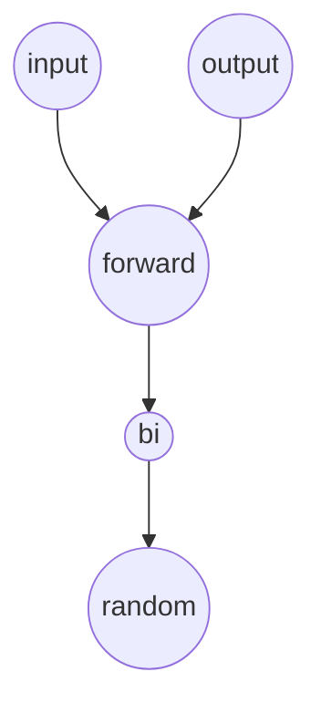
```mermaid
graph TB
1((input)) --> 3((forward))
2((output)) --> 3((forward))
3((forward)) --> 4((bi))
4((bi)) --> 5((random))
```


##### 类型
 首先为了实现的容易，得设计iterator_category为迭代器自己的类型，value_type为迭代器维护的具体数据的类型，diference_type为两个迭代器之间的距离的类型，pointer为原生指针，reference为原生引用。


### STL源码分析3-序列式容器


#### vector
 不讲了，太简单了

##### vector 的迭代器
 服了，居然就是指针，我一直以为他封装了一下，这也太懒了。

#### list
算了这都跳过算了，没啥意思，

#### deque
 用分段连续来制造整体连续的假象。
 两个迭代器维护首尾，一个二维指针维护一个二维数组，感觉很low，每一行被称为一个缓冲区,但是列的话，他前后都预留了一些指针位置。
 当我们随机访问的时候，就可以根据每一行的长度来选择正确的缓冲区了。
##### deque的迭代器
 这个就厉害一些了，他包含了4个地方，当前指针、当前缓冲区首尾指针，中控器上面当前缓冲区的指针。
##### 代码我感觉也一般般，我写也这样

#### queue和stack
 居然是deque实现的，明明有更好的实现方法，再见，看都不想看

#### heap
 算法都是这样写的
##### priority heap
 vector实现的，

#### slist
我还是不适合这个东西

### STL源码分析4-关联式容器


#### 关联式容器
 这玩意就是红黑树啦，上一章的序列容器看的我难受死了，希望这个能爽一些

#### 红黑树
 翻了好几页，都是红黑树，并没有让我感到很吃惊的代码

#### set和map
 set就是直接红黑树，map就把用pair分别存kv，然后自己定一个仿函数，难怪map找到的都是pair

#### multi
 算了自己写过平衡树的都知道，和非multi没几行代码不一样。

#### hashtable
 下一章下一章。。。

### STL源码分析5-算法


#### 算法
 分为质变算法和非质变算法，一个会改变操作对象，另一个不会。

#### accumulate
 这个强，accmulate(first,last,init),将[first,last)的值累加到init上
 accmulate(first,last,init,binary op),将[first,last)从左到右二元操作(init,*)到init上

#### adjacent_difference
 666666666，adjacent_difference(first,last,result)差分都来了[first,last)差分到[result,*)
 6666666,自己定义的差分adjacent_difference(first,last,result,binary_op); 这个能自定定义减法，
 注意可以result设为first

#### inner_product
 内积，inner_product(first1,last1,first2,init),加到init上然后返回。
 参数在加上一个binary_op1和binary_op2,init=binary_op1(init,binary_op2(eme1,eme2))

#### 太强了，佩服的五体投地，明天继续学,看java去

### STL源码分析6-算法2


#### partial_sum
 和前面的差分一样,partial_sum 为前缀和，partial_sum(first,last,result)为前缀和输出到result中
 当然你也可以定义binary_op操作，加在最后面

#### power
 快速幂算法了解一下，power(x,n)x的n次方，n为整数，要求满足乘法结合律。
 power(x,n,op),这个同理

#### itoa
&esmp; itoa(first,last,value);
while(first!=last) *first++=value++;


#### equal
 equal(first1,last1,first2)
 判断[first1,last1) 和[first2,...)是否相同
 同样支持二元仿函数。

#### fill
 fill(first,last,value)
 把区间的值设为value

#### fill_n
 fill(first,n,value)
 把first开始的n个元素设为value

#### iter_swap
 iter_swap(a,b) 
 交换迭代器的内容，这里就有意思了，如何获取迭代器内容的类型呢？还记得之前讲迭代器的时候，在迭代器内部定义的value_type吗？对！就是那个。


#### lexicographical_compare
 lexicographical_compare(first1,last1,first2,last2)
 字典序比大小，需要支持小于号

#### max min
 这俩也支持仿函数

#### mismatch
 mismatch(first1,last1,first2)
 用第一个去匹配第二个，你需要保证第二个不必第一个短，返回匹配尾部
 支持仿函数==

#### swap
 就是很普通的交换，

#### copy(first,last,result)
 特化了char\*和wchar_t\*为memmove，特化了T\*和const T\*，通过萃取，若指向的数据为基本数据类型则调用memmove，否则再分为随机迭代器和非随机迭代器，随机迭代器使用last-first这个值来控制，非随机迭代器用if(last==frist)来控制。

#### copy_backward
 和上面一样，但是为逆序拷贝

#### set_union
set_union(first1,last1,first2,last2,result)
就是遍历两个有序容器，然后赋值到result中，注意到它在碰到相同元素的时候两个迭代器都自增了，导致若第一个中有3个1，第二个中有5个1，则输出的时候只有5个1

#### set_intersection
 同上
 交集，得到3个1

#### set_difference
&esmp; 代码越来越平庸了，这个是S1-S2，出现在S1中不出现在S2中

#### set_symmetric_difference
 对称差，平庸的代码

#### adjacent_find(first,last)
 找到第一个相等的相邻元素，允许自定义仿函数

#### count(first,last,value)
 对value出现对次数计数
 count_if(first,last,op) 对op(*it)为真计数

越看越无聊了

#### find(first,last,value)
 找value出现的位置，这个函数应该挺有用的
 find_if(first,last,op) 同上啦

#### find_end 和find_first_of
 这个函数没用，我为啥不用kmp算法

#### for_each(first,last,op)
 op(\*i)

#### geterate(first,last,op)
 \*i=op()
 generate_n 同上

#### transform(first,last,result,op)
 \*result=op(\*first)

#### transform(first1,last1,first2,last2,result,op)
 \*result=op(\*first1,\*first2)

#### includes(first1,last1,first2,last2)
 保证有序，然后判断2是不是1的子序列，显然On

#### max_element(first,last) 
 区间最大值

#### min_element(first,last)
 同上

#### merge(first1,last1,first2,last2,result)
 归并排序的时候应该用得到吧

#### partition(first,last,pred)
 pred(*)为真在前，为假在后On

#### remove(first,last,value)
 把value移到尾部
 remove_copu(first,last,result,value),非质变算法

#### remove_if remove_copy_if 
同上

#### replace(first,last,old_value,new_value)
 看名字就知道怎么实现的
 replace_copy,replace_if,replace_copy_if

#### revese
 秀得我头皮发麻，这个。。。。。。。
```cpp
while(true)
  if(first==last||first==--last) return;
  else iter_swap(first++,last);
```
随机迭代器的版本还好
```cpp
while(first<last) iter_swap(first++,--last);
```
 reverse_copy ，常见的代码

####  rotate
 这个代码有点数学，大概率用不到，一般情况下我们写splay都用3次reverse来实现的，复杂度也不过On,他这个代码就一步到位了，使用了gcd，没啥意思，STL果然效率第一

#### search
 子序列首次出现的位置，

#### search_n
 好偏，算了，没啥用的代码

#### swap_ranges(first1,last1,first2)
 区间交换，swap的增强版

#### unique 
 移除重复元素
 unique_copy


### STL源码分析7-算法3


#### 这边的算法应该爽一些了

#### lower_bound upper_bound binary_search
 不多说了，就是二分，

#### next_permutation
 一直想不明白这个函数怎么实现的，今天来看看，既然是下一个排列，显然是需要找到一个刚好比现在这个大大排列，简单分析......6532,如果一个后缀都是递减的，显然这个后缀不能更大了，如果一个后缀都不能变得更大，就必须调整更前的，所以我们要找到这样的非降序....16532,把最后一个放到1的位置，其他的从小到大排列好就行了。也即swap(1,2),reverse(6531)
#### prev_permutation
 同理

#### random_shuffle
 洗牌算法，从first往last遍历，每次从最后面随机选一个放到当前位置即可。

#### partial_sort 
 partial_sort(first,middle,last)
 保证[first,middle)有序且均小于[middle,last)直接对后面元素使用堆上浮，这样保证了小的元素均在[first,middle)中，然后使用sort_heap?????
&ems; 为啥第一步不用线性时间选择，第二步不用快排？

#### sort
 大一就听说了这个的大名，现在来学习学习

##### Median_of_three
__median(a,b,c) 返回中间那个值
##### Partitionining
 这个大家都会写，就是按照枢轴，把小的放左边，大的放到右边
##### threshold
 当只有很少很少的几个元素的时候，插入排序更快。
##### final insertion sort
 我们不必在快速排序中进行插入排序，但是可以提前推出，保证序列基本有序，然后再对整体使用插入排序
##### SGI sort 
 先快速排序到基本有序，然后插入排序
###### 快速排序
 先排序右边，后左边，且将左边当作下一层，当迭代深度恶化的时候，即超过了lg(n)*2的时候，采取堆排序
 枢轴的选择，首、尾、中间的中位数
##### RW sort
 这个就少了堆排序了，其他的和SGI一样


####  equal_range
 lower_bound和upper_bound的合体
 比直接lower_bound+upper_bound应该快一些，大概这样，二分中值偏小，做缩左断点，偏大则缩右端点，若二分中值等于value，则对左边lower_bound,对右边upper_bound,然后就能直接返回了

#### inplace_merge
 将两个相邻的有序序列合并为有序序列，他在分析卡空间的做法，再见。。。不缺空间，

####  nth_element
 线性时间选择，三点中值，递归变迭代，长度很小以后直接插入排序，666666

#### mergesort
 借助inplace_merge直接完成了，

#### 总结
 STL的算法还是很厉害的。


### STL源码分析8-仿函数


#### 仿函数
 c++的一大特色，通过重载()来实现像函数一样的功能

#### 一元仿函数
```cpp
template<class Arg,class Result>
struct unary_function{
  typedef Arg argument_type;
  typedef Result result_type;
};
```
 看到上面那玩意没，你得继承它。

- negeta 取反，返回-x
- logical_not  !x
- identity x
- select1st a.first
- select2nd a.second

#### 二元仿函数
```cpp
template<class Arg1,class Arg2,class Result>
struct unary_function{
  typedef Arg1 first_argument_type;
  typedef Arg2 second_argument_type;
  typedef Result result_type;
};
```
- plus a+b
- minus a-b
- multiplies a*b
- divides a/b
- modulus a%b
- equal_to a==b
- not_equal_to a!=b
- greater a>b
- greater_equal a>=b
- less a&lt;b
- less_equal a&lt;=b
- logical_and a&&b
- logical_or a||b
- project1st a
- project2nd b

#### 仿函数单位元
 你要为你的仿函数设置一个identity_element单位元，用于快速幂

#### 


### STL源码分析9-配接器


#### 配接器
 本质上，配接器是一种设计模式，改变仿函数的接口，成为仿函数配接器，改变容器接口，称为容器配接器，改变迭代器接口，称为迭代器配接器

#### 容器配接器
 queue和stack就是修饰了deque的配接器

#### 迭代器配接器
 迭代器的配接器有3个，insert itertors,reverse iterators,iostream iterators.
哇塞这东西有点深，明天再看。

# DataStrcuture

## 线段树


```cpp
### define ml ((l+r)>>1)
### define mr (ml+1)
const int maxn=3e5+5;
int a[maxn];
int ls[maxn*2],rs[maxn*2],tot;// 树结构
int cov[maxn*2];// 懒惰标记结构
ll sum[maxn*2];int mi[maxn*2],mx[maxn*2];// 区间结构

inline void modify(int&u,int l,int r,int cov_){// 这个函数要注意重写
    if(cov_!=-1){// 这行要注意重写
        cov[u]=cov_;// 这行要注意重写
        sum[u]=1ll*cov_*(r-l+1);// 这行要注意重写
        mi[u]=mx[u]=cov_;// 这行要注意重写
    }
}

inline void push_down(int u,int l,int r){
    modify(ls[u],l,ml,cov[u]);// 这行要注意重写
    modify(rs[u],mr,r,cov[u]);// 这行要注意重写
    cov[u]=-1;// 这行要注意重写
}

inline void pushup(int u,int l,int r){
    mi[u]=min(mi[ls[u]],mi[rs[u]]);// 这行要注意重写
    mx[u]=max(mx[ls[u]],mx[rs[u]]);// 这行要注意重写
    sum[u]=sum[ls[u]]+sum[rs[u]];// 这行要注意重写
}

void updatecov(int u,int l,int r,int ql,int qr,int d){//
    if(ql<=l&&r<=qr){// 不要改写为 if(mi[u]==mx[u]) 即使想写也要这样 if(ql<=l&&r<=qr&&mi[u]==mx[u])
        modify(u,l,r,d);// 这行要注意重写
        return;
    }
    push_down(u,l,r);
    if(ml>=ql) updatecov(ls[u],l,ml,ql,qr,d);
    if(mr<=qr) updatecov(rs[u],mr,r,ql,qr,d);
    pushup(u,l,r);
}

void updatephi(int u,int l,int r,int ql,int qr){
    if(ql<=l&&r<=qr&&mi[u]==mx[u]){// 这行要注意重写
        modify(u,l,r,math::phi[mi[u]]);// 这行要注意重写
        return;
    }
    push_down(u,l,r);
    if(ml>=ql) updatephi(ls[u],l,ml,ql,qr);
    if(mr<=qr) updatephi(rs[u],mr,r,ql,qr);
    pushup(u,l,r);
}

ll query(int u,int l,int r,int ql,int qr){
    if(ql<=l&&r<=qr) return sum[u];// 这行要注意重写
    push_down(u,l,r);
    ll ret=0;// 这行要注意重写
    if(ml>=ql) ret+=query(ls[u],l,ml,ql,qr);// 这行要注意重写
    if(mr<=qr) ret+=query(rs[u],mr,r,ql,qr);// 这行要注意重写
    return ret;
}

void build(int&u,int l,int r){
    u=++tot;
    cov[u]=-1;
    if(l==r) sum[u]=mi[u]=mx[u]=a[l];
    else{
        build(ls[u],l,ml);
        build(rs[u],mr,r);
        pushup(u,l,r);
    }
}
```

## splay


```cpp
//初始化时要初始化tot和stk[0]
const int N=3e5+3;
int c[N][2],f[N],stk[N],nie=N-1,tot;//树结构,几乎不用初始化
int nu[N],w[N],cov[N];//值和懒惰标记结构,一定要赋初值，
int sz[N],mx[N],mi[N]; long long s[N];//区间结构，不用赋予初值，

inline void pushfrom(int u,int son){// assert(son!=nie)
    sz[u]+=sz[son],mx[u]=max(mx[u],mx[son]),mi[u]=min(mi[u],mi[son]),s[u]+=s[son];
}
inline void pushup(int u){// assert(u!=nie)
    sz[u]=nu[u],mi[u]=mx[u]=w[u],s[u]=1ll*w[u]*nu[u];
    if(c[u][0]!=nie) pushfrom(u,c[u][0]);
    if(c[u][1]!=nie) pushfrom(u,c[u][1]);
}
inline void modify(int u,int _cov){// assert(u!=nie)
    if(_cov!=-1) {
        w[u]=mx[u]=mi[u]=_cov;
        s[u]=1ll*sz[u]*_cov;
    }
}
inline void pushdown(int u){
    if(u==nie||cov[u]==-1) return;
    if(c[u][0]!=nie) modify(c[u][0],cov[u]);
    if(c[u][1]!=nie) modify(c[u][1],cov[u]);
    cov[u]=-1;
}
inline void rotate(int x){// rotate后x的区间值是错误的，需要pushup(x)
    int y=f[x],z=f[y],xis=c[y][1]==x,yis=c[z][1]==y;
    f[x]=z,f[y]=x,f[c[x][xis^1]]=y;//father
    c[z][yis]=x,c[y][xis]=c[x][xis^1],c[x][xis^1]=y;//son
    pushup(y);
}
inline void splay(int x,int aim){//由于rotate后x的区间值不对，所以splay后x的区间值依旧不对，需要pushup(x)
    while(f[x]!=aim){
        int y=f[x],z=f[y];
        if(z!=aim) (c[y][0]==x)^(c[z][0]==y)?rotate(x):rotate(y);// 同一个儿子先旋转y
        rotate(x);
    }
}
void del(int u){// del compress newnode decompress 是一套独立的函数，可以直接删除，也可以与上面的代码共存
    stk[++stk[0]]=u;
    if(c[u][0]!=nie) del(c[u][0]);
    if(c[u][1]!=nie) del(c[u][1]);
}
inline void compress(int u){ // 压缩区间，将节点丢进栈 assert(u!=nie)
    if(c[u][0]!=nie) del(c[u][0]);
    if(c[u][1]!=nie) del(c[u][1]);
    c[u][0]=c[u][1]=nie,nu[u]=sz[u];
}
inline int newnode(int father,int val,int siz){//
    int u=stk[0]==0?(++tot):stk[stk[0]--];
    f[u]=father,c[u][0]=c[u][1]=nie; //树结构
    w[u]=val,nu[u]=siz,cov[u]=-1; //值和懒惰标记结构,
    sz[u]=siz,mi[u]=mx[u]=val,s[u]=1ll*val*siz;//区间结构
    return u;
}
inline void decompress(int x,int u){// 解压区间并提取第x个值 assert(u!=nie)
    int ls=c[u][0],rs=c[u][1];
    if(x>1) c[u][0]=newnode(u,w[u],x-1),c[c[u][0]][0]=ls;
    if(x<nu[u]) c[u][1]=newnode(u,w[u],nu[u]-x),c[c[u][1]][1]=rs;
    nu[u]=1;
}
inline int id(int x,int u=c[nie][0]){ // 查询排名为x的数的节点下标 n个数 [1,n]
    while(true){
        pushdown(u);
        if(sz[c[u][0]]>=x) u=c[u][0];
        else if(sz[c[u][0]]+nu[u]<x) x-=sz[c[u][0]]+nu[u],u=c[u][1];
        else{
            if(nu[u]!=1) decompress(x,u);
            return u;
        }
    }
}
int build(int father,int l,int r){// 把区间l,r建树，返回根(l+r)>>1
    int u=(l+r)>>1;
    f[u]=father;
    c[u][0]=l<=u-1?build(u,l,u-1):nie;
    c[u][1]=r>=u+1?build(u,u+1,r):nie;
    pushup(u);
    return u;
}

void updatephi(int u){
    pushdown(u);
    if(c[u][0]!=nie) updatephi(c[u][0]);
    if(c[u][1]!=nie) updatephi(c[u][1]);
    w[u]=math::phi[w[u]];
    pushup(u);
    if(nu[u]!=1&&mi[u]==mx[u]) compress(u);
}
```

## 树链剖分


```cpp
const int maxn=1e5+5;
int to[maxn<<1],nex[maxn<<1],head[maxn],w[maxn],cnt;
void ini(){cnt=-1;for(int i=0;i<=n;i++) head[i]=-1;}
void add_edge(int u,int v){to[++cnt]=v;nex[cnt]=head[u];head[u]=cnt;}

int dep[maxn],dad[maxn],siz[maxn],son[maxn],chain[maxn],dfn[maxn];//
void dfs1(int u,int father){//dfs1(1,0)
    dep[u]=dep[father]+1;//ini  because dep[0]=1
    dad[u]=father, siz[u]=1, son[u]=-1;
    for(int i=head[u];~i;i=nex[i]){
        int v=to[i];
        if(v==father)continue;
        dfs1(v,u);
        siz[u]+=siz[v];
        if(son[u]==-1||siz[son[u]]<siz[v]) son[u]=v;
    }
}
void dfs2(int u,int s,int&step){
    dfn[u]=++step;
    chain[u]=s;
    if(son[u]!=-1) dfs2(son[u],s,step);
    for(int i=head[u];~i;i=nex[i]){
        int v=to[i];
        if(v!=son[u]&&v!=dad[u]) dfs2(v,v,step);
    }
}
int query(int x,int y,int k){
    int res=0;
    while(chain[x]!=chain[y]){
        if(dep[chain[x]]<dep[chain[y]]) swap(x,y); //dep[chain[x]]>dep[chain[y]]
        res+=segtree::query(dfn[chain[x]],dfn[x],k);// [左，右，值]
        x=dad[chain[x]];
    }
    if(dep[x]>dep[y]) swap(x,y);// dep[x]<dep[y]
    return res+segtree::query(dfn[x],dfn[y],k);// [左,右,值]
}
```

## lct


```cpp
int top,c[N][2],f[N],tim[N],sta[N],rev[N],val[N];
void ini(){
    for(int i=0;i<=n;i++)c[i][0]=c[i][1]=f[i]=rev[i]=0,tim[i]=i,val[i]=2e9;
    for(int i=n+1;i<=n+m;i++)c[i][0]=c[i][1]=f[i]=rev[i]=0,tim[i]=i,val[i]=R[i-n];
}
inline void pushup(int x){
    tim[x]=x;
    if(val[tim[c[x][0]]]<val[tim[x]]) tim[x]=tim[c[x][0]];
    if(val[tim[c[x][1]]]<val[tim[x]]) tim[x]=tim[c[x][1]];
}
inline void pushdown(int x){
    int l=c[x][0],r=c[x][1];
    if(rev[x]){
        rev[l]^=1;rev[r]^=1;rev[x]^=1;
        swap(c[x][0],c[x][1]);
    }
}
inline bool isroot(int x){return c[f[x]][0]!=x&&c[f[x]][1]!=x;}
inline void rotate(int x){
    int y=f[x],z=f[y],xis=c[y][1]==x,yis=c[z][1]==y;//
    if(!isroot(y)) c[z][yis]=x;//son
    f[x]=z;f[y]=x;f[c[x][xis^1]]=y;//father
    c[y][xis]=c[x][xis^1];c[x][xis^1]=y;//son
    pushup(y);
}
inline void splay(int x){
    top=1;sta[top]=x;//init stack
    for(int i=x;!isroot(i);i=f[i])sta[++top]=f[i];//update stack
    for(int i=top;i;i--)pushdown(sta[i]);//pushroad
    while(!isroot(x)){
        int y=f[x],z=f[y];
        if(!isroot(y)) (c[y][0]==x)^(c[z][0]==y)?rotate(y):rotate(x);
        rotate(x);
    }pushup(x);
}
inline void access(int x){for(int t=0;x;t=x,x=f[x])splay(x),c[x][1]=t,pushup(x);}
inline int treeroot(int x){access(x);splay(x);while(c[x][0])x=c[x][0];return x;}
inline void makeroot(int x){access(x);splay(x);rev[x]^=1;}// 让x变成根
inline void cut(int x,int y){makeroot(x);access(y);splay(y);f[x]=c[y][0]=0;pushup(y);}
inline void link(int x,int y){makeroot(x);f[x]=y;}
```

## 珂朵莉树


##### 珂朵莉树
珂朵莉树是一颗树，我们用集合来维护，c++中集合是红黑树，所以我们借助此集合来完成珂朵莉树。    
我们将区间分段，那么各段有唯一的左端点，我们将左端点放入集合，当我们遍历集合的时候，我们就得到了我们要的序列，此时我们维护了结构，但未维护值，进一步发现我们可以使用map,用键值对来维护更多信息，键用来维护树的结构，值来维护序列的值。


##### split
因为我们要维护区间信息，所以我们需要操作split来提取区间，本质上提取区间为提取单点，这一点在splay中表现的很出色，当我们提取出左端点和右端点的时候，区间也就被提取出来了，如果提取位置x，在红黑树中我们二分到x的位置，若此处是一个区间[l,r]，我们将此区间拆分为[l,x-1][x,r]即可。

##### assign
我们提取出区间，删掉这些节点然后，插入一个新的节点即可

##### add
我们提取出区间，暴力更新所有节点即可

##### sum
我们提取出区间，暴力计算所有节点，使用快速幂

##### kth
我们提取出区间，还是暴力

##### 什么时候选择此数据结构
数据随机且含有区间赋值操作，此数据结构的操作可以在splay上实现，并维护更多信息，map法仅仅只是编码简单了很多。

##### 例题
[C. Willem, Chtholly and Seniorious](https://codeforces.com/contest/896/problem/C)
<details>
<summary>odt代码</summary>

</details>


## Euler Tour Tree


##### Euler Tour Tree
任何一颗树都能够用欧拉旅行路径来表示，欧拉旅行路径是一个序列，他记录了一颗树的dfs的时候的顺序，记录了进入每个节点的时间和退出该节点的时间，这样以后，子树就成了ETT上连续的区间
，当我们对子树进行交换的时候，我们就可以将这个区间平移。这里我们用splay维护即可


## heap


### 总览
这篇博客将用于整理各种堆的数据结构代码以及复杂度证明: 二叉堆、二项堆、斐波拉契堆、配对堆、左偏树、斜堆、bordal队列、B堆

### 注意
 全部代码单对象测试通过，部分代码未实现拷贝构造函数达到深拷贝。

### heap 
堆是一种非常重要的数据结构，在计算机科学中，堆一般指堆是根节点比子孙后代都要大(小)的一种数据结构。

### 项目地址
[链接](https://github.com/fightinggg/fightinggg.github.io/tree/master/cpp/perfect)

### 前置条件
基本数据结构：变长数组、栈、队列、字符串的实现(此时暂未实现，使用STL代替，后面有时间会自己实现)
内存池机制
 


### 基类设计
在这里我们暂且只设置三个接口，如果不够，我们再补充。
<details>
<summary> heap代码 </summary>

</details>

### binary heap
二叉堆，就是我们常见的堆，也是大多数人常用的堆，二叉堆是一个完全二叉树，满足根节点的值大于（小于）子孙的值。我们设计他的时候，采取下标从1开始的数组来直接模拟，使用i,2i,2i+1之间的关系来完成边的构建。

#### push
我们将数放入数组尾部，并不断上浮即可。细节稍微推一下就出来了。每个元素最多上浮堆的高度次，复杂度$O(lgn)$

#### pop
我们直接删掉第一个元素，并让最后一个元素顶替他，然后下沉即可。这里个细节也是稍微推一下就出来了。每个元素最多下沉堆的高度次,复杂度$O(lgn)$

#### top
就是第一个元素,复杂度$O(1)$

#### 代码如下:
<details>
<summary> binary heap代码 </summary>

</details>

### binomial heap
二项堆，是一个堆森林，其中每个堆以及各自的子堆的元素个数都是2的幂，并且森林中没有两个堆元素个数相同的堆。举个简单的例子，一个包含了6个元素的二项堆，这个堆森林中一定是两个堆组成，因为6=2+4，他不能是6=2+2+2由三个堆组成，因为森林中不允许出现元素相同的堆。

#### 堆的具体形状

***        图片源于wiki***


#### merge
 二项堆天然支持合并，即可并堆，当合并的时候，我们很容易发现，只要将森林合并即可,而对于哪些出现的元素个数相同的堆，我们可以两两合并，让其中一个作为另一个的根的直接儿子即可。每次合并的时候，两两合并的复杂度是$O(1)$,最多合并的次数等于森林中元素的个数减1，而森林中堆的个数等于二进制中1的个数，这个是O(lgn)级别的，所以总体复杂度O(lgn)

#### push
 可以看作与一个只包含了一个元素的堆合并,每次push，最坏的情况下时间复杂度为$O(lgn)$,但是多次连续的push，均摊时间复杂度就不一样了，我们来分析一下n次连续push的情况，森林中的堆两两合并的次数等于时间复杂度，定义函数$f(x)$,表示在森林中所有堆中的元素个数的总和为$x$的情况下，push一个值以后，堆中合并发生的次数，显然$f(x)=$x的二进制表示中末尾连续的1的个数，不难发现
$f(x)>=1$的时候$x\%2=1$,
$f(x)>=2$的时候$x\%4=3$,
$f(x)>=3$的时候$x\%8=7$
这里我们通过计数原理推算出
$$
\begin{aligned}
\sum_{i=1}^n{f(i)}=\lfloor\frac{x+1}{2}\rfloor+\lfloor\frac{x+1}{4}\rfloor+\lfloor\frac{x+1}{8}\rfloor+...+\lt x+1 
\end{aligned}
$$
所以在大量连续的push过程中，均摊时间复杂度为O(1)

#### pop
 先遍历各个根，找出最值，不难发现，森林中，任意一个堆去掉根以后，恰好也是一个满足条件森林，这里也可以用合并处理,时间复杂度$O(lgn)$

#### top
 遍历所有堆即可，时间复杂度O(lgn)

#### 程序设计
很多人说用链表实现链接，这确实是一个好方法，但是如果用单链表或循环链表或双向链表实现，则有很多局限性，下面代码中也提及了。我这里采取的是使用数组存森林，使用左儿子右兄弟的手段，将多叉树用二叉树来表示。这个方法非常棒。

#### 代码
<details>
<summary> binary heap代码 </summary>

</details>


### fibonacci heap
 斐波拉契堆，是目前理论上最强大的堆，他和二项堆很长得很相似。和二项堆一样，斐波拉契堆也是一个堆森林，斐波拉契堆简化了几乎所有的堆操作为懒惰性操作，这极大的提升了很多操作的时间复杂度。

#### potential method
 对于一个斐波拉契堆$H$,我们定义势能函数为$\Phi(H) = t(H) + 2m(H)$, 其中$t(H)$是斐波拉契堆$H$的森林中堆的个数,$m(H)$是斐波拉契堆中被标记的点的数量。

#### push 
 当我们向一个斐波拉契堆中添加元素的时候，我们会选择将这个元素做成一个堆，然后链入森林的根集和，常常选择链表维护根集合，同时更新斐波拉契堆中最小值的指针，实际时间复杂度显然是$O(1)$，势能变化为1，因为堆的个数变大了1，均摊复杂度为$O(1)+1=O(1)$

#### merge 
 当我们合并两个斐波拉契堆的时候，我们是懒惰操作，直接将这两个堆森林的根集合并为一个根集，常常选择链表来维护根集合,同时更新新的最小值指针，实际实际复杂度为$O(1)$,势能无变化，均摊复杂度为$O(1)$

#### top 
 $O(1)$

#### decrease
 当我们想要减小一个节点的值堆时候，我们直接将他和父亲断开，然后将他链入森林并减小值，然后标记父亲，如果父亲被标记过一次，则将父亲和爷爷也断开并链入森林，并清除标记，一直递归下去，这里我们不要太认真，加上这条路上一个有$c$个，则我们一共断开了c次，实际复杂度为$O(c)$,势能的第一项变为了$t(H)+c$，第二项变为了$2(m(H)-c)$,于是势能的变化为$c-2c=-c$,于是均摊复杂度为$O(c)-c$,这里本来并不等于$O(1)$,但是我们可以增大势的单位到和这里的$O(c)$同级，这样就得到了$O(1)$

#### erase
 当我们想要删除一个节点的时候,先将其设为无穷小，然后在调用pop

#### pop
 前面偷了很多懒，导致除了erase以外，其他操作的均摊复杂度均为$O(1)$,这里就要好好地操作了，我们是这样来操作的，删掉最小值以后，将他的儿子都链入森林，这里花费了$O(D(H))$的实际代价，这里的$D(H)$指的是斐波拉契堆$H$中堆的最大度数。然后我们更新top的时候，不得不遍历所有的根，这时候我们就顺便调整一下堆。我们遍历所有的根，依次对森林中所有的堆进行合并，直到没有任意两个堆的度数相同，假设最后我们得到了数据结构$H'$，那么这个过程是$O(t(H)-t(H'))$的，于是时间复杂度为$O(t(H)-t(H'))+O(D(H))$,然后我们观察堆的势能变化，显然第一项的变化量为$t(H')-t(H)$,第二项无变化，即势能总变化为$t(H')-t(H)$,则均摊复杂度为$O(t(H)-t(H'))+O(D(H))+(t(H')-t(H))$,这里依然不一定等于$O(D(H))$,但是我们依然可以增大势的单位到能够和$O(t(H)-t(H'))$抵消，最终，均摊复杂度成了$O(D(H))$

#### D(H)
 现在我们进入最高潮的地方。我们考虑斐波拉契堆中一个度数为k的堆，若不考虑丢失儿子这种情况发生，我们对他的儿子按照儿子的度数进行排序，显然第i个儿子的度数为i-1,$i=1,2,3...k$,此时考虑儿子们会丢掉自己的儿子，则有第i个儿子的度数$\ge i-2$,在考虑他自己也会丢失儿子，但这不会影响到第i个儿子的度数$\ge i-2$这个结论。
##### 斐波拉契数列 
$$
\begin{aligned}
F_i = 
\left\{
\begin{aligned}
&0&i=0\\
&1&i=1\\
&F_{i-2}+F_{i-1]}&i\ge 2\\
\end{aligned}
\right.
\end{aligned}
$$
##### 斐波拉契数列的两个结论
$F_{n+2}=1+\sum_{i=1}^nF_i$
$F_{n+2}\ge \phi^n,\phi^2=\phi+1,\phi大约取1.618$

##### 比斐波拉契数更大
 容易用数学归纳法证明对于一个度数为k的堆，他里面的节点的个数$\ge F_{k+2}$,这里$F_{i}$是斐波拉契数列的第i项。
 当k=0的时候，节点数数目为1，大于等于1
 当k=1的时候，节点数数目至少为2，大于等于2
 若$k\le k_0$的时候成立， 则当$k=k_0+1$的时候，节点数目至少为$1+F_1+F_2+...+F_{k_0+1}=F_{k_0+3}=F_{k+2}$

##### 比黄金分割值的幂更大
 现在我们就能够得到一个结果了，一个度数为k的堆，他的节点个数至少为$\Phi^k$,这里我们很容易就能得到这样一个结果，$D(H)\le \log_\Phi 最大的堆内元素的个数$

##### 结尾
 至此我们已经全部证明完成，读者也应该知道为什么斐波拉契堆要叫这个名字。
#### fibonacci heap 代码
<details>
<summary> fibonacci heap代码 </summary>

</details>


### pairing heap
配对堆，名字来源于其中的一个匹配操作。很有趣，他的定义就是一个普通多叉堆，但使用特殊的删除方式来避免复杂度退化。是继Michael L. Fredman和Robert E.Tarjan发明斐波拉契堆以后，由于该数据结构实现难度高以及不如理论上那么有效率，Fredma、Sedgewick、Sleator和Tarjan一起发明的。
#### potential method
 我们有一个配对堆$H$,其中有n节点$node$,$node_i$有$d_i$个儿子,
 则有
 $F(H) = \sum F(node)$, 
 $F(node_i)=1-min(d_i,\sqrt{n})$
 复杂度证明方面，等我把论文看完再来整这个，感觉证明比斐波拉契堆更复杂。
#### merge
合并的时候，让次大堆做最大堆的儿子,显然时间复杂度$O(1)$
#### push
插入的时候，看作与只包含了一个元素的堆合并,所以$O(1)$
#### top
就是根 $O(1)$
#### pop
当我们删除根以后，会形成一个堆森林，这时我们从左到右，每两个连续的堆配对合并一次，然后从右到左依次合并。比方说有这样一个情况AABBCCDDEEFFGGH,我们先将其从左到右合并AA->A,BB->B...得到ABCDEFG，->ABCDEH -> ABCDI -> ABCJ -> ABK -> AL -> M


#### 程序设计
 同样的左儿子右兄弟

#### 代码
<details>
<summary> pairing heap代码 </summary>

</details>


### leftist heap
 左偏树、左式堆、左翼堆是一个堆，除此以外，他定义了距离，没有右子节点的节点的距离为0，其他节点的距离为右子节点的距离加1，在这个定义下，左偏树的左偏体现着每个节点的左子节点的距离不小于右子节点的距离。
#### push
 为新节点建立堆，然后与堆合并 $O(lgn)$
#### pop 
 删除根节点，合并左右子树 $O(lgn)$
#### top
 根节点 $O(1)$
#### merge
 $O(lgn)$, 当我们合并两个堆$H1,H2$的时候，我们只需要比较这两个堆顶的大小，不妨设H1小，并设H3、H4为H1的左右儿子，则我们可以这样来看待，我们将H3,H4从H1中断开，递归合并H4和H2位H5，这时候我们还剩下H3、H5以及H1的堆顶，我们根据左偏树的定义，选择H3、H5分别作为左右或右左儿子即可，
##### 复杂度证明
 算法中每次均选择右儿子递归向下，这导致时间复杂度与右儿子的右儿子的右儿子的...有关，这里不难发现递归的次数就是节点的距离。根据左距离不小于右距离，我们很容易就能得到这个距离是$O(lgn)$级别的。
#### leftist heap 代码
<details>
<summary> leftist heap代码 </summary>

</details>


### skew heap
 我们的左偏树不记录距离，并且每次递归的时候无条件交换左右儿子，则成了斜堆。
#### 复杂度证明
##### potential method
 定义斜堆中的右子树距离比左子树大的节点为重节点，否则为轻节点。
 定义势能函数为重节点的个数。
##### merge
 当我们合并两个斜堆$H_1,H_2$的时候，不妨设他们的右子节点链中的轻重儿子为$l_1,h_1,l_2,h_2$,则时间时间复杂度为$O(l_1+h_1+l_2+h_2)$,经过交换以后，链上的重节点一定会变成轻节点,轻节点可能会变为重节点，我们取最坏的情况，即轻节点全部变为重节点，这时势能的变化量为$l_1+l_2-h_1-h_2$,最后我们的均摊复杂度为$O(l_1+h_1+l_2+h_2)+l_1+l_2-h_1-h_2$，我们依然可以增大势的单位，直到足以抵消所有的h，最终均摊复杂度为$O(l_1+l_2)$,这里不难证明，一条右儿子构成的链上，轻节点的个数是对数级别。
#### skew heap代码
<details>
<summary> skew heap代码 </summary>

</details>


### bordal heap
 这里已经涉及到一些冷门的东西了。暂时先放一下

### B heap
 是一种和B树一样利用内存页的东西。冷门，先放一下

### wiki上还有数不清的堆，学到这里暂停一下


## search_tree


### 总览
这篇博客将用于整理各种搜索树的数据结构,目前已经整理了BST、AVL、BTree、B+Tree、B*Tree、23Tree、234Tree、TTree、RBTree、LLRBTree、AATree、SplayTree、Treap、无旋Treap、scapegoatTree,VPTree、cartesianTree,

### 项目地址
[链接](https://github.com/fightinggg/fightinggg.github.io/tree/master/cpp/perfect)

### 前置条件
基本数据结构：变长数组、栈、队列、字符串的实现(此时暂未实现，使用STL代替，后面有时间会自己实现)
内存池机制

### 树的设计
我们设计一个基类让所有的树来继承此基类，然后在看后面会有什么改变，以后再来更新
### 基类
 我们的基类只提供接口，不提供数据类型
<details>
<summary> tree代码 </summary>

</details>

### 更新： 搜索树的设计
 由于笔者能力有限，设计欠佳，导致后面的空间树、字典树等数据结构无法加入tree中，所以我们在tree的后面加一层search_tree来表示搜索树。

<details>
<summary> 搜索树代码 </summary>

</details>


### B+ Tree
 和B树一样，B+树也具有相同的性质。

#### 不同点
 B+树的内部节点、根节点只保存了键的索引，一般情况下保存的是一个键指向的子树的所有键的集合中最大的那个，即所有左边子树的max，唯一的键保存在叶子节点上，
 叶子节点按照链表有序连接，这导致了B+树能够用链表来遍历整棵树。


### 23tree
参见3阶Btree

### 234tree
参见4阶Btree


### T tree
T tree 是一颗二叉树，他和avl tree有着一定的联系,总所周知，avl树为一颗二叉树，利用其中序维护信息，利用子树高度维护平衡。我们借此修改一下，我们尝试让avl树的每个节点维护多个信息[信息序列]，于是T tree就出现了。T tree是一颗二叉树，每个节点维护一个有序序列，用T 树的中序遍历方式，将其节点维护的序列依次相连即成为了我们维护的信息。

#### T tree 解释
为了便于编码，我们不考虑序列中会出现相同的元素，可以证明，对于泛型编程方式而言，这并不影响该数据结构的功能，该数据结构依旧具备维护相同元素的能力

#### T tree结论
非叶节点维护的序列都充满了各自的容器

#### T tree树上信息
每一颗子树都要维护一个序列，对于每个节点，我们都维护一个稍微小一点的序列，比该序列中元素更小的元素放入左子树，否则放入右子树。


#### T tree搜索
搜索的话，就是普通二叉树的搜索，比当前节点维护的最小值小，就在左子树找，比当前节点维护的最大值大，就在右子树找，否则就在当前节点找

#### T tree插入
当我们插入一个数的时候，我们首先递归向下，找到插入的节点位置，若该节点中储存的序列未满，则置入该节点，否则，有两种处理方式，第一种是从该节点中取出最小值，放入左子树，然后把带插入的树放入该节点，第二种是放入右子树，这里不多说明。插入可能会导致树失去平衡，我们用avl树单旋的方式来让树重新平衡

#### T tree删除
当我们删除一个数的时候，像avl树一样处理，若该数在叶子上，简单删掉并维护树的平衡即可，让该数在非叶节点时，我们取出前驱或后继来顶替即可。

#### T tree一个容易出错的地方
笔者在编码的时候，遇到了一个问题，就是有时候会出现非叶节点维护的数据并未充满容器，这种情况发生的原因是单旋造成的。在单旋的时候，将叶子结点旋转成非叶节点后，我们应该调整数据，让非叶节点重新维护的数据充满容器

#### T treecode
<details>
<summary>TT代码</summary>

</details>

### red black tree
#### red black tree定义
红黑树是一种平衡树，他满足下面的性质
>1.节点是红色或黑色。
>2.根是黑色。
>3.所有叶子都是黑色（叶子是NIL节点）。
>4.每个红色节点必须有两个黑色的子节点。（从每个叶子到根的所有路径上不能有两个连续的红色节点。）
>5.从任一节点到其每个叶子的所有简单路径都包含相同数目的黑色节点。

#### red black tree解读性质
红黑树的性质难以理解，这是因为他太过于抽象了, 如果你了解B Tree, 我们现在考虑节点中最多包含3个键的B Tree，他又叫2-3-4tree,意思是任何一个节点都有2，3或4个直接子孙，直接子孙指的是和当前节点相邻的子孙，相邻指的是恰好有一条边连接。
2-3-4树的编码是比较复杂的，原因在于节点种类过多。我们现在考虑这样一种情况，RB tree中的红色节点代表他和他父亲在一起，即他+他的父亲构成了2key3son-node，若他的兄弟也是红色，则他+兄弟+父亲构成了3key4son-node
性质1显然
性质2的原因是根没有父亲，所以他不能为红
性质3的原因是为了保证更具有一般性
性质4的原因是保证最多只有3key4son-node，不能出现4key5son-node
性质5的原因是B树的完全平衡性质

#### red black tree编码
由此可见，我们仿照234Tree即BTree即可完成编码

#### 为什么红黑树跑得快
我们发现234树的所有操作都能在红黑树上表现,但是234树有一个很大的缺陷，即分裂合并的速度太慢了，要重构很多东西，细心的读者自己模拟会发现，这个过程在RBTree上对应的仅仅是染色问题，这极大的加速了数据结构，这是优势。

#### red black tree erase
删除是比较复杂的，你怎样操作都可以，只要旋转次数少，你可以分很多类来讨论，显然分类越多，平均旋转次数是最少的。正常情况下，erase会引进一个重黑色的概念，这个概念的实际意义指的是该节点有一个0key1son的黑色父亲被隐藏了。

#### red black tree code
<details>
<summary>red black tree代码</summary>

</details>

### left leaning red black tree
####  left leaning red black tree定义
 在红黑树的基础上，左倾红黑树保证了3节点(2key-3son-node)的红色节点为向左倾斜，这导致了红黑树更加严格的定义,
####  left leaning red black tree实现
 在红黑树代码的基础上，我们定义一个left leaning函数，用来调整右倾斜为左倾斜，这个函数需要适当的加入到红黑树代码当中，笔者调试了很久，找到了很多思维漏洞，把这些漏洞全部用数学的方式严格证明以后，调用left leaning函数即可。
####  left leaning red black tree优点
 相比红黑树而言，笔者认为提升不大，真的，但是有人使用了很少的代码就实现了LLRBT，这也算一个吧，笔者是修改的红黑树，所以很难受，代码更长了。
####  left leaning red black tree code
<details>
<summary>left leaning red black tree代码</summary>

</details>

### AA Tree
 AA树真的很棒，虽然他没有普通红黑树那么厉害,但是AA树挺容易实现的，AA树是一棵右倾红黑树23树，注意! 这里是23树，不是234树。
#### AA树的由来
 Arne Andersson教授在论文Balanced search trees made simple中提到，红黑树有7种特殊情况（图片源于wiki）

 为了改进，他提出了使用23树并强行要求3节点(2key-3son-node)向右倾斜，于是，我们只剩下两种情况(图片源于wiki)

 为了更加容易编码，他提出不再使用红黑来标识节点，而是选择高度，这里的高度指的是黑高度，即黑色节点的高度，学习过左偏树(左翼堆)或斜堆的读者应该对这里不太陌生，这里的高度其实和左偏树或斜堆中的右距离是同一个东西。
#### AA树的特性
>所有叶节点的level都是1
>每个左孩子的level恰好为其父亲的level减一
>每个右孩子的level等于其父亲的level或为其父亲的level减一
>每个右孙子的level严格小于其祖父节点的level
>每一个level大于1的节点有两个子节点

#### AA树的skew
skew 是一个辅助函数，他的本质是zig，即如果发现一个节点的左儿子与自己黑高相同，则将左儿子选择至根。这将保证右倾。
#### AA树中的split
 split同样是一个辅助函数，他的本质是zag，即如果发现一个节点的右孙子与自己黑高相同，则将右儿子选择至根，并将黑高+1，这将保证不会出现4节点(3key-4son-node)
#### AA树中的insert
 递归向下，找到插入位置，然后插入，最后调整，调整的时候，树会变高，对每一层递归而言，左儿子变高我们就先让其skew，这可能导致出现4节点，我们再split，对于右儿子变高的情况，这时候可能右儿子本身是一个3节点，当他变高，导致根成为了4节点，我们调用skew即可，全部统一一下，就是先skew后split
#### AA树中的erase
 很多时候删除都是一件困难的事情，但是我们可以通过寻找前驱后继，可以保证删除的节点一定是叶子,对于删除叶子，可能树高下降，同样的，先删除后对每一层进行调整。我们前面说过，AA树只有两种结构。我们来分析一下树高下降产生的影响。

##### 情况1
 右儿子与自己同黑高

###### 情况1.1
  右儿子下降

 这种情况是合法的，不需要调整
###### 情况1.2
  左儿子下降

 我们观察到这里是一种较为复杂的情况，可以这样处理，让节点a和c同时黑下降，得到了

 然后我们考虑到c节点的左右儿子,注意到c和a以前黑同高，所以c的右儿子cr，一定比c矮，当c下降以后，cl、c、cr同高

 根据定义，这里最多还能拖出两个同黑高的，cl的右儿子clr，cr的右儿子crr

 这时候我们对c执行skew，然后clr成了c的左儿子，我们再次对c执行skew，最终a-cl-clr-c-cr-crr同黑高，

 接下来的一步是让我最吃惊的，非常漂亮，我们先对a进行split，然后对根的右儿子再次split，就结束了。对a进行split后我们得到,注意到这里根的高度提高了

 对根对右儿子split,就结束了

##### 情况2
 右儿子与自己不同黑高

###### 情况2.1
 右儿子下降

 让a节点高度降低

 让a进行skew,最后因为b的右儿子高度，分两种情况


 对于b的右儿子太高的时候，对a进行skew

 然后对b进行split即可
###### 情况2.2
 左儿子下降

 让a下降

 这里可能发生c的右儿子与c同高，split（a）即可

#### AA树erase总结
 至此我们的删除已经讨论完了，实际细分只有4种情况，这要比普通红黑树简单多了，

#### AA树缺点
 多次旋转导致性能不及红黑树，旋转次数较多

#### AA树代码
<details>
<summary>AA树代码</summary>

</details>

### splay tree
 伸展树，以其操作splay出名。
 伸展树的本质就是bst，
#### splay操作
 伸展树对splay操作的参数是一个节点，他的结果是将这个节点通过双旋变成根。
#### splay insert
 伸展树insert的时候，先按照bst的操作insert，然后将insert的点进行splay操作即可
#### splay search
 伸展树search的时候，先按照bst的操作search,对找到的节点进行splay即可
#### splay erase
 伸展树erase的时候，先search,这样我们要删除的节点就成为了根，然后按照bst的操作删除即可
#### splay操作详解
##### 重新定义旋转rotate
 rotate(x)即交换x和x的父亲的位置，即如果x是父亲y的左儿子，则rotate(x)等价与zig(y)，反之则等价于zag(y)
##### 定义splay
 如果祖父-父亲-自己构成一条直链，则选rotate父亲再rotate自己，若不是直链则rotate自己两次。知道自己成为根。
#### splay复杂度分析
##### splay势能函数
 对于一个伸展树T，他的一个节点x的子树大小为$s(x)$,定义一个节点x的势能为$X=log_2(s(x))$
###### 对数函数是一个凸函数
 已知a,b>0,则$lg(a)+lg(b)\lt 2lg(\frac{a+b}{2}) = 2lg(a+b)-2$
##### 对于一条直链，我们要先rotate父亲，再rotate自己

 设自己为x，父亲为y，祖父为z， 则势能变化为
$$
\begin{aligned}
&X'+Y'+Z'-X-Y-Z
\\&=Y'+Z'-X-Y\lt X'+Z'-2X
\\&=(3X'-3X)+(X+Z'-2X')
\end{aligned}
$$
这里的x和z‘的子树大小加起来刚好等于x'的子树大小-1。所以势能变化小于$3(X'-X)-2$
##### 对于一条非直链，我们要rotate自己两次，才能上去，rotate父亲不行的

 同理，势能变化为
$$
\begin{aligned}
&X'+Y'+Z'-X-Y-Z
\\&=Y'+Z'-X-Y\lt Y'+Z'-2X
\\&=(2X'-2X)+(Y'+Z'-2X')
\end{aligned}
$$
这里的y'和z'的子树大小加起来刚好等于x‘的子树大小-1，所以势能变化小于$2(X'-X)-2$
##### 单旋
 易证势能变化小于$X'-X$
##### 整理合并
 三种操作的均摊复杂度分别为$O(1)+X'-X$,$O(1)+2(X'-X)-2$,$O(1)+3(X'-X)-2$,对于后面的两种情况,我们增大势的单位来支配隐藏在O(1)中的常数，最终分别为$O(1)+X'-X$,$2(X'-X)$,$3(X'-X)$,再次放缩: $O(1)+3(X'-X)$,$3(X'-X)$,$3(X'-X)$,最后对于所有的旋转求和，因为只有一次单旋所以最终我们得到了均摊复杂度为$O(1)+X'-X\lt O(1)+X'$,显然X'是一个很小的数，他恰好等于伸展树中的元素的个数取对数后的结果。至此所有的操作均取决于splay的复杂度，均为$lg$级别。
#### splay代码
<details>
<summary>splay树代码</summary>

</details>

### Treap
 树堆Treap来源于Tree+Heap的组合, 其实就是一棵树，他的节点储存了两个键，一个是我们维护的信息，另外一个是随机数，我们不妨设前者叫key，后者叫rand_key，Treap的key满足搜索树的性质，Treap的rand_key满足堆的性质。(从某种意义上而言，笛卡尔树是key=rand_key的Treap)
 特点: 若key与rand_key确定后，Treap的形态唯一，
 Treap在大多数情况下显然是平衡的，但我不会证明，也没找到证明，暂时先放一下。
#### Treap insert
 我们向一棵Treap中按照搜索树的性质插入值以后，不会破坏搜索树的特点，但是大概率导致Heap的性质被违反。考虑到单旋不会导致搜索树的性质被破坏，我们通过单旋来从新让Treap满足Heap的性质。考虑回溯，假设我们对某个子树插入了一个值，若最终插入到左子树，则可能导致左子树树根的rand_key比当前节点的rand_key大，同时因为我们只插入了一个节点，所以最多也只有一个节点的rand_key比当前节点的rand_key大，这时候如果使用zig，则树恢复平衡。
#### Treap erase
 还是使用平衡树的操作来对Treap进行删除。如果过程中用到了前驱后继替换的技巧，这将导致替换节点的rand_key和他所处在为位置不匹配，我们就只考虑这颗子树，因为只有这颗子树的树根出现了问题，我们尝试递归向下，将位置不匹配这个现象下移，因为不匹配，必然是这个节点的rand_key比儿子们小，这时候如果左儿子的rand_key大就zig，否则zag,最后能发现这问题在向叶子结点转移，我们能够递归向下，直到最后转移到叶子上，树就恢复平衡了。
#### Treap 代码
<details>
<summary>Treap代码</summary>

</details>

### 无旋Treap
 无旋treap，指的是不使用zig和zag来重新恢复平衡的Treap
 我们使用merge和split
#### 无旋Treap merge
 merge的参数是两个treap，他返回treap合并后的结果,不妨设其中一个为T1，另一个为T2，这里还要求T1的最大key小于等于T2的最小key。merge其实很简单，如果你学过左偏树的话，会很容易理解。我们不妨设T1的根的rand_key比T2的小。那么很显然，最终结果的根为T2的根，这里我们就可以递归了，我们将T2的左子树与T1合并出T3，最后让T3最为T2新的左子树，我们得到的T2就是merge的结果。
#### 无旋Treap split
 split的参数是一个Treap和一个值W，他返回两颗Treap,其中一个的最大key小于W，另一个大于W(不需要考虑等于的情况)，这个过程依然很简单，我们考虑根就可以了，如果根的key大于w，则根和右子树分到一遍，然后递归左儿子，将得到的两个Treap中key大的那个作为之前分到一边的根的左儿子即可。
#### 无旋Treap insert
 先split，然后merge两次
#### 无旋Treap erase
 很多人这里使用了split两次然后merge三次，我认为这个不太好，常数过大，我们可以这样做，先search找到要删的点，然后merge其左右子树顶替自己即可。
#### 无旋Treap代码
<details>
<summary>无旋Treap代码</summary>

</details>

### scapegoat Tree
 替罪羊树，他是一个暴力的bst，与普通bst相比，他记录了子树的大小，用参数alpha来定义平衡，即左右子树的大小都不允许超过根的alpha倍，所以往往aplha是一个0.5到1的数字，当违反了这个性质，就暴力重构，将树构造为完全平衡树。
#### 替罪羊树erase
 为节点打上标记scapegoat，代表这个节点已经被删除了，回溯子树大小信息。
#### 替罪羊树insert
 使用bst插入的方式来插入，注意特判掉那些被打删除标记的点，就可以了
#### 替罪羊树重构
 当我们erase或者insert以后，受影响的节点应该恰好构成了一条从根到目标的链，我们使用maintain来重新调整子树大小的时候，注意标记那些非法(不平衡)的节点，然后当我们maintain到根的时候，我们重构离根最近的不平衡的子树。
#### 替罪羊树代码
<details>
<summary>替罪羊树代码</summary>

</details>


### vantate point tree
vp tree 是一颗二叉树，他和kd tree有着一定的相似度,

#### 树上信息
每一颗子树都要维护一个点集，对于每个节点，我们都维护一个距离d，然后将到该节点的距离小于d的点放到左儿子，其他的放到右儿子中。

#### vantate point
vantate point的选取是一个比较麻烦的事情，我们仔细想想都知道，这个点的选取肯定会影响算法，有一种处理办法是随机选取，这显然不是我们想要的。我们其实可以这样来处理，
>Our algorithm constructs a set of vantage point candidates by random sampling,and then evaluates each of them.Evaluation is accomplished by extracting another sample,from which the median of $\prod_p(S)$,and a corresponding moment are estimated.Finally,based on these statistical images,the candidate with the largest moment is chosen.

这里的$\prod_p(S)$指的就是在该度量空间中点p和点s的距离,作者选取的statistical images是方差，我们可以从伪码中看出。

#### 建树
和kd树一样，建树的过程是一致的，我们选出vantate point,然后递归左右建树

#### 搜索
搜索的话，也是一样的，用结果剪枝即可

#### 修改
这样的树不存在单旋这种方式，我们只能用替罪羊树套vantate point tree来实现


#### 参考资料
[Data Structures and Algorithms for Nearest Neighbor Search in General Metric Spaces Peter N.Yianilos*](http://web.cs.iastate.edu/~honavar/nndatastructures.pdf)

### cartesian tree
笛卡尔树是一颗二叉树，他满足中序遍历为维护的序列，且满足堆的性质

#### build
我们使用单调栈来维护树根到叶子的链，在单调栈的构建中完成树的构建

<details>
<summary>ct代码</summary>

</details>


## BST


### binary search tree
BST是二叉搜索树，满足中序遍历是一个有序的序列,他是最最基础的二叉树，他不一定平衡，

#### BST insert
插入的时候，在树上递归插入，比当前节点大就向右边走，否则向左走

#### BST search
查找的时候，同上

#### BST erase
删除的时候，相对复杂，如果只有一个儿子，很简单，但是当他有两个儿子的时候，我们可以选择将一个儿子顶替自己，另外一个儿子去找前驱或后继即可。

#### BST code
我们使用内存池来维护整个数据结构
<details>
<summary>BST代码</summary>

</details>


## AVL


### AVL Tree
 AVL Tree使用高度差作为平衡因子，他要求兄弟的高度差的绝对值不超过1
#### code
<details>
<summary>avl Tree代码</summary>

</details>


## BTree


### B Tree
B树是一颗多叉树，和二叉树比较类似,但是每个节点有多个子节点和多个键，通常我们称最多拥有N个子节点的B树为N阶B树，B树为了保证树的有序，树上节点的子节点数量恰好比键的数量多1，这就保证了存在一种方式将子节点和键排在一起，且每个键的左边、右边都是子节点，这样形成的序列即为维护的序列。

#### B Tree 约束
B树的节点分三类，根节点、叶子节点、内部节点(除了根节点和叶子节点以外的节点)
所有的叶子节点的深度相同,这一点保证树的平衡
根节点的键的的数量在区间[2,N-1]上 , N>=3
每个内部节点、叶子节点的键的数量在区间$[\lceil\frac{N}{2}\rceil-1,N-1]$上
每个节点的键的个数恰好比子节点个数多1

#### B Tree insert
B树的插入很简单，找到应该插入的叶子节点，然后插入。这会可能导致树不符合约束->叶子节点上键的数量过多，此时叶子结点上的键的数量为N，这时候我们分裂叶子节点为两个叶节点，从中取出中位数置入父节点作为划分这两个叶子节点的键。我们很容易证明$\lfloor\frac{N-1}{2}\rfloor\ge\lceil\frac{N}{2}\rceil-1$,若父节点依旧超出约束范围，同理向上继续对内部节点分裂,直道碰到根节点，若根节点依旧键的个数过多，则继续分裂，然后创建新的根节点将分裂出的节点连接。

#### B Tree erase
B树的删除同普通平衡树一样，若删除点出现在内部节点或根节点中，我们取出他的前驱或后继将他替换。然后再删除。我们将所有情况合并到了删除叶子节点上。若删除后树依旧满足约束，则不需要调整。若不满足约束，根据N>=3我们得出每个节点最少两个子节点，若删除位置的兄弟节点有较多键，我们只需要从兄弟节点移动一个键过来即可。若兄弟节点同样处于最少键时，我们可以合并这两个节点$2*(\lceil\frac{N}{2}\rceil-1)\le N-1$

#### B Tree search
直接二分向下即可。

#### 注意
注意vector的 insert、erase后会导致的引用失效,

#### code
<details>
<summary>B Tree代码</summary>

</details>


## B+Tree


#### B+树优点
 因为内部节点、根节点保存的是索引(指针),这导致单位储存空间储存的指针要比单位空间储存的键多得多，这同时导致了B+树能够比B树更加扁平。

#### 代码
 这东西实现难度有点高，太码农了，我随缘实现吧。哈哈哈哈哈哈。


## BstartTree


### B* Tree
 B*树在B+树的基础上再把内部节点也整上链表，同时要求空间使用率为$\frac{2}{3}$而不是$\frac{1}{2}$

#### 代码
 随缘


## 23Tree


### 23tree
参见3阶Btree


## 234Tree


### 234tree
参见4阶Btree


## TTree


### T tree
T tree 是一颗二叉树，他和avl tree有着一定的联系,总所周知，avl树为一颗二叉树，利用其中序维护信息，利用子树高度维护平衡。我们借此修改一下，我们尝试让avl树的每个节点维护多个信息[信息序列]，于是T tree就出现了。T tree是一颗二叉树，每个节点维护一个有序序列，用T 树的中序遍历方式，将其节点维护的序列依次相连即成为了我们维护的信息。

#### T tree 解释
为了便于编码，我们不考虑序列中会出现相同的元素，可以证明，对于泛型编程方式而言，这并不影响该数据结构的功能，该数据结构依旧具备维护相同元素的能力

#### T tree结论
非叶节点维护的序列都充满了各自的容器

#### T tree树上信息
每一颗子树都要维护一个序列，对于每个节点，我们都维护一个稍微小一点的序列，比该序列中元素更小的元素放入左子树，否则放入右子树。


#### T tree搜索
搜索的话，就是普通二叉树的搜索，比当前节点维护的最小值小，就在左子树找，比当前节点维护的最大值大，就在右子树找，否则就在当前节点找

#### T tree插入
当我们插入一个数的时候，我们首先递归向下，找到插入的节点位置，若该节点中储存的序列未满，则置入该节点，否则，有两种处理方式，第一种是从该节点中取出最小值，放入左子树，然后把带插入的树放入该节点，第二种是放入右子树，这里不多说明。插入可能会导致树失去平衡，我们用avl树单旋的方式来让树重新平衡

#### T tree删除
当我们删除一个数的时候，像avl树一样处理，若该数在叶子上，简单删掉并维护树的平衡即可，让该数在非叶节点时，我们取出前驱或后继来顶替即可。

#### T tree一个容易出错的地方
笔者在编码的时候，遇到了一个问题，就是有时候会出现非叶节点维护的数据并未充满容器，这种情况发生的原因是单旋造成的。在单旋的时候，将叶子结点旋转成非叶节点后，我们应该调整数据，让非叶节点重新维护的数据充满容器

#### T treecode
<details>
<summary>TT代码</summary>

</details>


## RBTree


### red black tree
#### red black tree定义
红黑树是一种平衡树，他满足下面的性质
>1.节点是红色或黑色。
>2.根是黑色。
>3.所有叶子都是黑色（叶子是NIL节点）。
>4.每个红色节点必须有两个黑色的子节点。（从每个叶子到根的所有路径上不能有两个连续的红色节点。）
>5.从任一节点到其每个叶子的所有简单路径都包含相同数目的黑色节点。

#### red black tree解读性质
红黑树的性质难以理解，这是因为他太过于抽象了, 如果你了解B Tree, 我们现在考虑节点中最多包含3个键的B Tree，他又叫2-3-4tree,意思是任何一个节点都有2，3或4个直接子孙，直接子孙指的是和当前节点相邻的子孙，相邻指的是恰好有一条边连接。
2-3-4树的编码是比较复杂的，原因在于节点种类过多。我们现在考虑这样一种情况，RB tree中的红色节点代表他和他父亲在一起，即他+他的父亲构成了2key3son-node，若他的兄弟也是红色，则他+兄弟+父亲构成了3key4son-node
性质1显然
性质2的原因是根没有父亲，所以他不能为红
性质3的原因是为了保证更具有一般性
性质4的原因是保证最多只有3key4son-node，不能出现4key5son-node
性质5的原因是B树的完全平衡性质

#### red black tree编码
由此可见，我们仿照234Tree即BTree即可完成编码

#### 为什么红黑树跑得快
我们发现234树的所有操作都能在红黑树上表现,但是234树有一个很大的缺陷，即分裂合并的速度太慢了，要重构很多东西，细心的读者自己模拟会发现，这个过程在RBTree上对应的仅仅是染色问题，这极大的加速了数据结构，这是优势。

#### red black tree erase
删除是比较复杂的，你怎样操作都可以，只要旋转次数少，你可以分很多类来讨论，显然分类越多，平均旋转次数是最少的。正常情况下，erase会引进一个重黑色的概念，这个概念的实际意义指的是该节点有一个0key1son的黑色父亲被隐藏了。

#### red black tree code
<details>
<summary>red black tree代码</summary>

</details>


## LLRBTree


### left leaning red black tree
####  left leaning red black tree定义
 在红黑树的基础上，左倾红黑树保证了3节点(2key-3son-node)的红色节点为向左倾斜，这导致了红黑树更加严格的定义,
####  left leaning red black tree实现
 在红黑树代码的基础上，我们定义一个left leaning函数，用来调整右倾斜为左倾斜，这个函数需要适当的加入到红黑树代码当中，笔者调试了很久，找到了很多思维漏洞，把这些漏洞全部用数学的方式严格证明以后，调用left leaning函数即可。
####  left leaning red black tree优点
 相比红黑树而言，笔者认为提升不大，真的，但是有人使用了很少的代码就实现了LLRBT，这也算一个吧，笔者是修改的红黑树，所以很难受，代码更长了。
####  left leaning red black tree code
<details>
<summary>left leaning red black tree代码</summary>

</details>


## AATree


### AA Tree
 AA树真的很棒，虽然他没有普通红黑树那么厉害,但是AA树挺容易实现的，AA树是一棵右倾红黑树23树，注意! 这里是23树，不是234树。
#### AA树的由来
 Arne Andersson教授在论文Balanced search trees made simple中提到，红黑树有7种特殊情况（图片源于wiki）

 为了改进，他提出了使用23树并强行要求3节点(2key-3son-node)向右倾斜，于是，我们只剩下两种情况(图片源于wiki)

 为了更加容易编码，他提出不再使用红黑来标识节点，而是选择高度，这里的高度指的是黑高度，即黑色节点的高度，学习过左偏树(左翼堆)或斜堆的读者应该对这里不太陌生，这里的高度其实和左偏树或斜堆中的右距离是同一个东西。
#### AA树的特性
>所有叶节点的level都是1
>每个左孩子的level恰好为其父亲的level减一
>每个右孩子的level等于其父亲的level或为其父亲的level减一
>每个右孙子的level严格小于其祖父节点的level
>每一个level大于1的节点有两个子节点

#### AA树的skew
skew 是一个辅助函数，他的本质是zig，即如果发现一个节点的左儿子与自己黑高相同，则将左儿子选择至根。这将保证右倾。
#### AA树中的split
 split同样是一个辅助函数，他的本质是zag，即如果发现一个节点的右孙子与自己黑高相同，则将右儿子选择至根，并将黑高+1，这将保证不会出现4节点(3key-4son-node)
#### AA树中的insert
 递归向下，找到插入位置，然后插入，最后调整，调整的时候，树会变高，对每一层递归而言，左儿子变高我们就先让其skew，这可能导致出现4节点，我们再split，对于右儿子变高的情况，这时候可能右儿子本身是一个3节点，当他变高，导致根成为了4节点，我们调用skew即可，全部统一一下，就是先skew后split
#### AA树中的erase
 很多时候删除都是一件困难的事情，但是我们可以通过寻找前驱后继，可以保证删除的节点一定是叶子,对于删除叶子，可能树高下降，同样的，先删除后对每一层进行调整。我们前面说过，AA树只有两种结构。我们来分析一下树高下降产生的影响。

##### 情况1
 右儿子与自己同黑高

###### 情况1.1
  右儿子下降

 这种情况是合法的，不需要调整
###### 情况1.2
  左儿子下降

 我们观察到这里是一种较为复杂的情况，可以这样处理，让节点a和c同时黑下降，得到了

 然后我们考虑到c节点的左右儿子,注意到c和a以前黑同高，所以c的右儿子cr，一定比c矮，当c下降以后，cl、c、cr同高

 根据定义，这里最多还能拖出两个同黑高的，cl的右儿子clr，cr的右儿子crr

 这时候我们对c执行skew，然后clr成了c的左儿子，我们再次对c执行skew，最终a-cl-clr-c-cr-crr同黑高，

 接下来的一步是让我最吃惊的，非常漂亮，我们先对a进行split，然后对根的右儿子再次split，就结束了。对a进行split后我们得到,注意到这里根的高度提高了

 对根对右儿子split,就结束了

##### 情况2
 右儿子与自己不同黑高

###### 情况2.1
 右儿子下降

 让a节点高度降低

 让a进行skew,最后因为b的右儿子高度，分两种情况


 对于b的右儿子太高的时候，对a进行skew

 然后对b进行split即可
###### 情况2.2
 左儿子下降

 让a下降

 这里可能发生c的右儿子与c同高，split（a）即可

#### AA树erase总结
 至此我们的删除已经讨论完了，实际细分只有4种情况，这要比普通红黑树简单多了，

#### AA树缺点
 多次旋转导致性能不及红黑树，旋转次数较多

#### AA树代码
<details>
<summary>AA树代码</summary>

</details>


## SplayTree


### splay tree
 伸展树，以其操作splay出名。
 伸展树的本质就是bst，
#### splay操作
 伸展树对splay操作的参数是一个节点，他的结果是将这个节点通过双旋变成根。
#### splay insert
 伸展树insert的时候，先按照bst的操作insert，然后将insert的点进行splay操作即可
#### splay search
 伸展树search的时候，先按照bst的操作search,对找到的节点进行splay即可
#### splay erase
 伸展树erase的时候，先search,这样我们要删除的节点就成为了根，然后按照bst的操作删除即可
#### splay操作详解
##### 重新定义旋转rotate
 rotate(x)即交换x和x的父亲的位置，即如果x是父亲y的左儿子，则rotate(x)等价与zig(y)，反之则等价于zag(y)
##### 定义splay
 如果祖父-父亲-自己构成一条直链，则选rotate父亲再rotate自己，若不是直链则rotate自己两次。知道自己成为根。
#### splay复杂度分析
##### splay势能函数
 对于一个伸展树T，他的一个节点x的子树大小为$s(x)$,定义一个节点x的势能为$X=log_2(s(x))$
###### 对数函数是一个凸函数
 已知a,b>0,则$lg(a)+lg(b)\lt 2lg(\frac{a+b}{2}) = 2lg(a+b)-2$
##### 对于一条直链，我们要先rotate父亲，再rotate自己

 设自己为x，父亲为y，祖父为z， 则势能变化为
$$
\begin{aligned}
&X'+Y'+Z'-X-Y-Z
\\&=Y'+Z'-X-Y\lt X'+Z'-2X
\\&=(3X'-3X)+(X+Z'-2X')
\end{aligned}
$$
这里的x和z‘的子树大小加起来刚好等于x'的子树大小-1。所以势能变化小于$3(X'-X)-2$
##### 对于一条非直链，我们要rotate自己两次，才能上去，rotate父亲不行的

 同理，势能变化为
$$
\begin{aligned}
&X'+Y'+Z'-X-Y-Z
\\&=Y'+Z'-X-Y\lt Y'+Z'-2X
\\&=(2X'-2X)+(Y'+Z'-2X')
\end{aligned}
$$
这里的y'和z'的子树大小加起来刚好等于x‘的子树大小-1，所以势能变化小于$2(X'-X)-2$
##### 单旋
 易证势能变化小于$X'-X$
##### 整理合并
 三种操作的均摊复杂度分别为$O(1)+X'-X$,$O(1)+2(X'-X)-2$,$O(1)+3(X'-X)-2$,对于后面的两种情况,我们增大势的单位来支配隐藏在O(1)中的常数，最终分别为$O(1)+X'-X$,$2(X'-X)$,$3(X'-X)$,再次放缩: $O(1)+3(X'-X)$,$3(X'-X)$,$3(X'-X)$,最后对于所有的旋转求和，因为只有一次单旋所以最终我们得到了均摊复杂度为$O(1)+X'-X\lt O(1)+X'$,显然X'是一个很小的数，他恰好等于伸展树中的元素的个数取对数后的结果。至此所有的操作均取决于splay的复杂度，均为$lg$级别。
#### splay代码
<details>
<summary>splay树代码</summary>

</details>


## Treap


### Treap
 树堆Treap来源于Tree+Heap的组合, 其实就是一棵树，他的节点储存了两个键，一个是我们维护的信息，另外一个是随机数，我们不妨设前者叫key，后者叫rand_key，Treap的key满足搜索树的性质，Treap的rand_key满足堆的性质。(从某种意义上而言，笛卡尔树是key=rand_key的Treap)
 特点: 若key与rand_key确定后，Treap的形态唯一，
 Treap在大多数情况下显然是平衡的，但我不会证明，也没找到证明，暂时先放一下。
#### Treap insert
 我们向一棵Treap中按照搜索树的性质插入值以后，不会破坏搜索树的特点，但是大概率导致Heap的性质被违反。考虑到单旋不会导致搜索树的性质被破坏，我们通过单旋来从新让Treap满足Heap的性质。考虑回溯，假设我们对某个子树插入了一个值，若最终插入到左子树，则可能导致左子树树根的rand_key比当前节点的rand_key大，同时因为我们只插入了一个节点，所以最多也只有一个节点的rand_key比当前节点的rand_key大，这时候如果使用zig，则树恢复平衡。
#### Treap erase
 还是使用平衡树的操作来对Treap进行删除。如果过程中用到了前驱后继替换的技巧，这将导致替换节点的rand_key和他所处在为位置不匹配，我们就只考虑这颗子树，因为只有这颗子树的树根出现了问题，我们尝试递归向下，将位置不匹配这个现象下移，因为不匹配，必然是这个节点的rand_key比儿子们小，这时候如果左儿子的rand_key大就zig，否则zag,最后能发现这问题在向叶子结点转移，我们能够递归向下，直到最后转移到叶子上，树就恢复平衡了。
#### Treap 代码
<details>
<summary>Treap代码</summary>

</details>

### 无旋Treap
 无旋treap，指的是不使用zig和zag来重新恢复平衡的Treap
 我们使用merge和split
#### 无旋Treap merge
 merge的参数是两个treap，他返回treap合并后的结果,不妨设其中一个为T1，另一个为T2，这里还要求T1的最大key小于等于T2的最小key。merge其实很简单，如果你学过左偏树的话，会很容易理解。我们不妨设T1的根的rand_key比T2的小。那么很显然，最终结果的根为T2的根，这里我们就可以递归了，我们将T2的左子树与T1合并出T3，最后让T3最为T2新的左子树，我们得到的T2就是merge的结果。
#### 无旋Treap split
 split的参数是一个Treap和一个值W，他返回两颗Treap,其中一个的最大key小于W，另一个大于W(不需要考虑等于的情况)，这个过程依然很简单，我们考虑根就可以了，如果根的key大于w，则根和右子树分到一遍，然后递归左儿子，将得到的两个Treap中key大的那个作为之前分到一边的根的左儿子即可。
#### 无旋Treap insert
 先split，然后merge两次
#### 无旋Treap erase
 很多人这里使用了split两次然后merge三次，我认为这个不太好，常数过大，我们可以这样做，先search找到要删的点，然后merge其左右子树顶替自己即可。
#### 无旋Treap代码
<details>
<summary>无旋Treap代码</summary>

</details>


## 无旋Treap


##### name

##### descirption


##### input

##### output

##### sample input

##### sample output

##### toturial

##### code


## scapegoateTree


### scapegoat Tree
 替罪羊树，他是一个暴力的bst，与普通bst相比，他记录了子树的大小，用参数alpha来定义平衡，即左右子树的大小都不允许超过根的alpha倍，所以往往aplha是一个0.5到1的数字，当违反了这个性质，就暴力重构，将树构造为完全平衡树。
#### 替罪羊树erase
 为节点打上标记scapegoat，代表这个节点已经被删除了，回溯子树大小信息。
#### 替罪羊树insert
 使用bst插入的方式来插入，注意特判掉那些被打删除标记的点，就可以了
#### 替罪羊树重构
 当我们erase或者insert以后，受影响的节点应该恰好构成了一条从根到目标的链，我们使用maintain来重新调整子树大小的时候，注意标记那些非法(不平衡)的节点，然后当我们maintain到根的时候，我们重构离根最近的不平衡的子树。
#### 替罪羊树代码
<details>
<summary>替罪羊树代码</summary>

</details>


## VPTree


### vantate point tree
vp tree 是一颗二叉树，他和kd tree有着一定的相似度,

#### 树上信息
每一颗子树都要维护一个点集，对于每个节点，我们都维护一个距离d，然后将到该节点的距离小于d的点放到左儿子，其他的放到右儿子中。

#### vantate point
vantate point的选取是一个比较麻烦的事情，我们仔细想想都知道，这个点的选取肯定会影响算法，有一种处理办法是随机选取，这显然不是我们想要的。我们其实可以这样来处理，
>Our algorithm constructs a set of vantage point candidates by random sampling,and then evaluates each of them.Evaluation is accomplished by extracting another sample,from which the median of $\prod_p(S)$,and a corresponding moment are estimated.Finally,based on these statistical images,the candidate with the largest moment is chosen.

这里的$\prod_p(S)$指的就是在该度量空间中点p和点s的距离,作者选取的statistical images是方差，我们可以从伪码中看出。

#### 建树
和kd树一样，建树的过程是一致的，我们选出vantate point,然后递归左右建树

#### 搜索
搜索的话，也是一样的，用结果剪枝即可

#### 修改
这样的树不存在单旋这种方式，我们只能用替罪羊树套vantate point tree来实现


#### 参考资料
[Data Structures and Algorithms for Nearest Neighbor Search in General Metric Spaces Peter N.Yianilos*](http://web.cs.iastate.edu/~honavar/nndatastructures.pdf)


## cartesianTree


### cartesian tree
笛卡尔树是一颗二叉树，他满足中序遍历为维护的序列，且满足堆的性质

#### build
我们使用单调栈来维护树根到叶子的链，在单调栈的构建中完成树的构建

<details>
<summary>ct代码</summary>

</details>


## trie


### 字典树
 字典树是我接触自动机的开端，我们先讲自动机，

### 自动机
 自动机有五个要素，开始状态，转移函数，字符集，状态集，结束状态。

### 自动机识别字符串
 假设我们有一个自动机，他长这个样子,他能识别字符串abc.
 **稍等片刻！下图正在转码中**
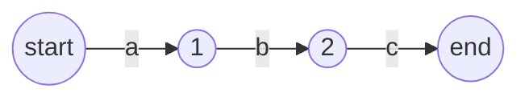
```mermaid
graph LR
start((start))--a--> 1((1))
1((1))--b-->2((2))
2((2))--c-->3((end))
```
 最开始我们在位置start，也就是初始状态，当我们读入字符a的时候，经过转移函数我们到达了1号状态，如果我们在初始状态读到的是字符b，则因为初始状态没有字符b的转移函数。会导致自动机在非终结状态停机，这就意味着无法识别字符b，同理也无法识别c-z,于是在初始状态只能识别a，<br>
 然后分析状态1，只能识别b，到达状态2，只能识别c到达终态。最后就识别了字符串abc。<br>
 然后我们来考虑一个复杂一点的自动机，他能识别字符串abc、abd、bc、ac<br>

 **稍等片刻！下图正在转码中**
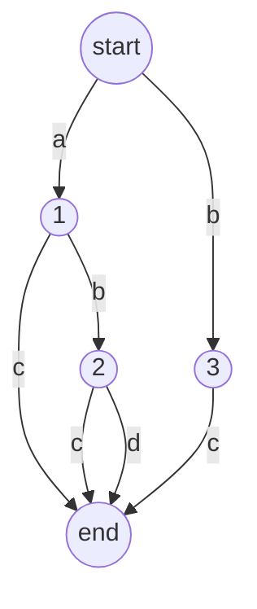
```mermaid
graph TB
start((start))--a--> 1((1))
1((1))--c-->10((end))
start((start))--b--> 3((3))
3((3))--c--> 10((end))
1((1))--b-->2((2))
2((2))--c-->10((end))
2((2))--d-->10((end))
```
 如果我们不去分析其中的end节点，他的本质就是一颗树，他同时又叫做字典树，特别的，如果这个字典树的字符集为01，则他又叫做01字典树。

### 字典树的插入
 字典树的插入应该是一个字符串，这个过程我们可以用递归实现，
### 字典树的删除
 特别注意，为了能够支持多重集合，我们常常用一个数字来代表有多少个字符串在某个状态结束，这样删除的时候只要减少那个值就可以了
### 字典树的查找
 递归。
### 递归转非递归
 因为字典树的代码特别简单，我们常常直接用递归转非递归来实现。
### 代码
 先欠着，暂时拖一个不太友好的代码在这里,这里面有一部分代码就是字典树啦。
[代码链接](https://fightinggg.github.io/ACM/stencil/string/AC自动机.html)

## 三叉搜索树


### ternary search tree

### 字典树的缺点
 不难想到，对于那些字符集特别大的字典树来说，他们的空间消耗特别大，因为每个节点都要储存大量的指针，而这些指针往往又是空的。
### 将BST与trie结合起来
 考虑这样一种树，每个节点有三个儿子，左右儿子表示自己的左右兄弟，向下的儿子表示真正的儿子。这样的树，将极大的提高了空间利用率。
### 偷个图来放着
 这里插入了as,at,be,by,he....


### 三叉搜索树的插入
 考虑递归，假设我们插入到了某个节点，若下儿子与当前字符相等，则递归到下儿子并使用下一个字符来递归，如果当前字符小于下儿子，则递归到左儿子，保持当前字符不变，如果当前节点不存在了，则创建新节点，直接向下儿子走。

### 三叉搜索树的删除
 我们还是用数字来记录终结节点的终结字符串有多少个，若找到待删除的节点以后，终止与此的只有一个字符串，则直接删掉，否则让终极节点的计数器减1，注意在回溯的时候，如果三个儿子都没有终结字符了，就删掉自己。

### 三叉搜索树的查找
 递归递归。

### 三叉搜索树的缺点
 树的平衡是一个很大的问题，这个我也没办法

### 三叉搜索树的本质
 很多时候，很多数据结构像变戏法一样，我们从本质看带三叉搜索树，我们发现下儿子其实是字典树的边，在考虑左右儿子，其实这个就是bst，哈哈哈发现了没有，
 我们考虑删掉所有下儿子，你会发现，剩下的是一个bst森林，就像lct删掉指向父亲没有指向自己的边以后，就是splay森林一样，很神奇。我们将这些bst森林转化为一个一个普通的数组，让这些数组从新充当节点，然后将下儿子连回去，
 一切都清晰了，又变成普通字典树了。
 所以三叉搜索树的本质是优化后的字典树，每个节点都是一个bst。即trie套bst，外层树为trie，内层树为bst。

### 三叉搜索树的优化？
 我们让这里的bst用avl代替？用rbt代替？用sbt代替？都可以，但是我觉得这样编码太难了吧，若实在是真的差这点效率，可以去这样做，但我认为，把普通字典树的节点用avl-map、rbt-map、sbt-map直接范型编程或设为类中类不香吗。在这玩树套树确实高大上，效率也高，但编码难度也太高了。

### 代码
 先欠着，以后再还。

## X快速前缀树


### X快速前缀树
 我以前就说过，当你的数据结构达到了一定的基础，就可以学习那些更加高级的数据结构了，往往那些更加高级的数据结构由基本数据结构组合而成。

### 先提出一个问题
 现在要你维护一个多重集合，支持3种操作，1询问一个值(这个值不一定在集合中)的前驱和后继，2向集合中插入一个元素，3从集合中删掉一个元素，1操作$10^6$次，2操作$10^5$次，3操作$10^5$,要求你在1S内完成回答。保证集合元素都小于M=$10^6$


### 普通平衡树？
 我们考虑到上面三种操作都是普通平衡树常见的操作，很多人可能就直接拿起他自己的平衡树上了。很遗憾，大概率是无法通过的。因为操作次数太多了。

### 观察，思考
 我们的操作需要的是大量的查询，大量、大量，你个普通平衡树怎么操作的过来？

### 新的平衡树
 现在我们提出一个新的平衡树，这个平衡树非常厉害，他支持$O(lgM)$的时间来删除和插入，支持$O(lglgM)$的时间来查询前驱后继。

### X快速前缀树
 字典树+哈希表+维护叶子节点的双向链表+二分
 首先，我们先建立一颗普通的01字典树，这个树我们对他稍作修改，考虑到字典树的节点分3类： 叶子节点、根节点、内部节点，我们让叶子节点间构造双向环状链表，其次，对于仅有左儿子的内部节点，让其右儿子指向子树的最小叶子节点，对于仅有右儿子的内部节点，让其左儿子指向子树的最大叶子节点。另一方面，我们对字典树的每一层都建立一个hash表，hash掉他们节点所代表的值是有还是没有，这样我们就构造出了一个X快速前缀树的模型了。


### X快速前缀树的查找
 假设我们要找一个数k，我们在树上寻找树和k的lca[最低公共祖先]，这个过程可以只要在hash表中二分即可知道lca在哪一个节点，可以证明，这个节点要么没有左儿子，要么没有右儿子。如果有的话，他的儿子和k的lcp[最长公共前缀]一定更长，但是这与他自己是lca的事实相悖。另一方面，由于我们的单儿子节点储存了最值信息，如果这个节点没有右儿子，则他的右儿子指向的值是k的前驱，至于后继，在叶子节点的链表上后移一个单位即可。这个过程总复杂度在二分lca上，树的高度为lgn，二分高度，所以总体复杂度为$O(lglgn)$

### X快速前缀树的插入
 找出lca，若lca没有右儿子，则说明当前节点要插入到右儿子里面。照着做就行了，同时注意向下递归的时候把值也插入到hash表里面，递归到叶子的时候重新连接双向环状链表(前驱和后继)，最后回溯的时候维护单儿子节点的信息，以及树根方面的值就行了。

### X快速前缀树的删除
 找到待删除节点，然后删掉，重新维护叶子链表，回溯的时候从hash表里面删掉自己，对于单儿子的节点也要根据子树回溯即可。


## Y快速前缀树


### Y快速前缀树
 继X快速前缀树以后，Dan Willard又提出了X快速前缀树的改进版本

### 改进X快速前缀树
 我们还是继续考虑n个小于M的整数(n&lt;M)，我们按照大小，从小到大分组,每组的元素的个数在区间$[\frac{lgM}{4},2lgM]$上,对每组构建一颗普通平衡树，这样我们一共会得到$\frac{n}{2lgM}$到$\frac{4n}{lgM}$颗树，我们在这些树中取一个随便的值r，r要在平衡树的最大和最小值之间,这样我们每棵树对应了一个r，把所有的r作为键,其对应的平衡树作为值放到X快速平衡树中，这就是Y快速平衡树。

### Y快速前缀树的查找前驱后继
 首先在上层X前缀树上查找前驱和后继，最终我们会定位到两个叶子节点，也就对应了两颗普通平衡树，我们在这两颗普通平衡树里面直接找前驱后继然后合并就结束了。总复杂度$lglg(\frac{n}{lgM})+2*lg(lgM)=lglgM$

### Y快速前缀树的插入
 先在X前缀树上查询前驱后继，然后在其对应的平衡树上插入真正要插入的值，总复杂度$lglg(\frac{n}{lgM})+lglgM=lglgM$，这里有可能导致插入的值太多，进行分裂，我们来看一下这次分裂前插入了多少元素，我们考虑最坏的情况，不妨设之前也是分裂的，那么他的大小为$lgM$，到这次分裂一共插入了lgM+1个元素，导致现在的大小超过了2lgM，于是这lgM次插入的均摊分裂复杂度为$\frac{lg(\frac{n}{lgM})}{lgM}\lt 1$,于是总复杂度为$lglgM$

### Y快速前缀树的删除
 同样的，我们还是先查询前驱后街，然后在对应的平衡树上删除真正要删除的值，总复杂度为$lglg(\frac{n}{lgM})+lglgM=lglgM$,这里有可能导致平衡树上剩下的值太少，我们考虑合并，合并后如果依然太大，比方说大于lgM，我们就再次分裂为两个平衡树即可。这里可以证明，均摊复杂度依然是O1，因为从$\frac{lgM}{2}$到$\frac{lgM}{4}$也要$\frac{lgM}{4}$次删除，均摊下来，依然是O1,为了懒惰删除，我们甚至可以不必要求合并后超过lgM猜分裂，到2lgM也行。懒惰总是优秀的。于是总体复杂度为$lglgM$

### 总结
 至此，Y快速前缀树的所有操作均为lglgM了.

### 代码
 欠着欠着，以后再补。

## 笛卡尔树


### 笛卡尔树
 这个笛卡尔树没写出来，气死了
 他是二叉树，他是堆，二叉树中序遍历的结果就是数组a

### 笛卡尔树的构造
 先看一个简单的笛卡尔树

 我们使用增量构建笛卡尔树来完成，就和增量构建后缀自动机一样容易。我们来对x分类讨论如果x比5小怎么样，如下

如果x在5和7之间

如果x在7和9之间

如果x比9大呢

 我们不难发现，每当增加一个新的值的时候，笛卡尔树变化的一定只有从根一直向右走的路径，我们可以想出一个很简单的方法，每次新增加值a[i+1]的时候，让他不断和右链比较，找到lower_bound的地方，然后插入到那去就可以了。
 进一步发现，上诉代码需要维护指向父亲的指针，我们考虑到用一个栈来维护右链，栈低为根，栈顶为叶子，在弹栈的时候维护右儿子指针，在压栈的时候维护左儿子指针即可。代码如下
```cpp
int n;
int a[N]; // a[1], a[2], a[3], a[4] ... a[n]
int l[N],r[N]; // 0为空指针
int s[N],top; //栈
void build(){
  s[++top]=1;// 把起点压栈
  for(int i=2;i<=n;i++){
    //r[i]=l[i]=0;
    while(top&&a[s[top]]<=a[i]) l[i]=s[top--]; //弹栈的时候维护左儿子指针
    if(top) r[s[top]]=i; // 压栈的时候维护右儿子指针
    s[++top]=i;
  } // 返回的时候栈顶为根
}

```

# DB

## mysql刷题1


### 查找最晚入职员工的所有信息
查找最晚入职员工的所有信息
CREATE TABLE `employees` (
`emp_no` int(11) NOT NULL,
`birth_date` date NOT NULL,
`first_name` varchar(14) NOT NULL,
`last_name` varchar(16) NOT NULL,
`gender` char(1) NOT NULL,
`hire_date` date NOT NULL,
PRIMARY KEY (`emp_no`));

 我们排序以后选出最大的
```sql
select * from employees
    order by hire_date desc
    limit 0,1
```
 找到最大值以后使用where
```sql
select * from employees
    where hire_date = (select max(hire_date) from employees);
```
<!--more-->

### 查找入职员工时间排名倒数第三的员工所有信息
查找入职员工时间排名倒数第三的员工所有信息
CREATE TABLE `employees` (
`emp_no` int(11) NOT NULL,
`birth_date` date NOT NULL,
`first_name` varchar(14) NOT NULL,
`last_name` varchar(16) NOT NULL,
`gender` char(1) NOT NULL,
`hire_date` date NOT NULL,
PRIMARY KEY (`emp_no`));


```sql
select * from employees
    order by hire_date desc
    limit 2,1
```

 使用distinct去重
```sql
select * from employees
    where hire_date = (
        select distinct hire_date
            from employees
            order by hire_date desc
            limit 2,1
    )
```

### 查找各个部门当前(to_date='9999-01-01')领导当前薪水详情以及其对应部门编号dept_no
CREATE TABLE `dept_manager` (
`dept_no` char(4) NOT NULL,
`emp_no` int(11) NOT NULL,
`from_date` date NOT NULL,
`to_date` date NOT NULL,
PRIMARY KEY (`emp_no`,`dept_no`));
CREATE TABLE `salaries` (
`emp_no` int(11) NOT NULL,
`salary` int(11) NOT NULL,
`from_date` date NOT NULL,
`to_date` date NOT NULL,
PRIMARY KEY (`emp_no`,`from_date`));

```sql
select s.*, d.dept_no
    from
       salaries as s  inner join  dept_manager as d
            on d.emp_no = s.emp_no
    where
         d.to_date = '9999-01-01'
         and S.to_date = '9999-01-01'
```


### 查找所有已经分配部门的员工的last_name和first_name以及dept_no
CREATE TABLE `dept_emp` (
`emp_no` int(11) NOT NULL,
`dept_no` char(4) NOT NULL,
`from_date` date NOT NULL,
`to_date` date NOT NULL,
PRIMARY KEY (`emp_no`,`dept_no`));
CREATE TABLE `employees` (
`emp_no` int(11) NOT NULL,
`birth_date` date NOT NULL,
`first_name` varchar(14) NOT NULL,
`last_name` varchar(16) NOT NULL,
`gender` char(1) NOT NULL,
`hire_date` date NOT NULL,
PRIMARY KEY (`emp_no`));

```sql
select e.last_name,e.first_name,d.dept_no
    from
        dept_emp as d inner join employees as e
            on d.emp_no = e.emp_no
```

### 查找所有员工的last_name和first_name以及对应部门编号dept_no，也包括展示没有分配具体部门的员工
CREATE TABLE `dept_emp` (
`emp_no` int(11) NOT NULL,
`dept_no` char(4) NOT NULL,
`from_date` date NOT NULL,
`to_date` date NOT NULL,
PRIMARY KEY (`emp_no`,`dept_no`));
CREATE TABLE `employees` (
`emp_no` int(11) NOT NULL,
`birth_date` date NOT NULL,
`first_name` varchar(14) NOT NULL,
`last_name` varchar(16) NOT NULL,
`gender` char(1) NOT NULL,
`hire_date` date NOT NULL,
PRIMARY KEY (`emp_no`));


```sql
select e.last_name, e.first_name, d.dept_no
    from
        employees as e left join dept_emp as d
            on d.emp_no = e.emp_no
```


### 查找所有员工入职时候的薪水情况，给出emp_no以及salary， 并按照emp_no进行逆序
CREATE TABLE `employees` (
`emp_no` int(11) NOT NULL,
`birth_date` date NOT NULL,
`first_name` varchar(14) NOT NULL,
`last_name` varchar(16) NOT NULL,
`gender` char(1) NOT NULL,
`hire_date` date NOT NULL,
PRIMARY KEY (`emp_no`));
CREATE TABLE `salaries` (
`emp_no` int(11) NOT NULL,
`salary` int(11) NOT NULL,
`from_date` date NOT NULL,
`to_date` date NOT NULL,
PRIMARY KEY (`emp_no`,`from_date`));

 找出最早的那个
```sql
select distinct s.emp_no,s.salary
from salaries as s
group by s.emp_no
having min(s.from_date)
order by s.emp_no desc
```

```sql

select s.emp_no , s.salary
from
    employees as e
    left join salaries as s
    on e.emp_no = s.emp_no and e.hire_date = s.from_date
order by s.emp_no desc
```


### 查找薪水涨幅超过15次的员工号emp_no以及其对应的涨幅次数t
CREATE TABLE `salaries` (
`emp_no` int(11) NOT NULL,
`salary` int(11) NOT NULL,
`from_date` date NOT NULL,
`to_date` date NOT NULL,
PRIMARY KEY (`emp_no`,`from_date`));

```sql
select emp_no, count(emp_no) as t
from salaries
group by emp_no
having t > 15
```


### 找出所有员工当前(to_date='9999-01-01')具体的薪水salary情况，对于相同的薪水只显示一次,并按照逆序显示
CREATE TABLE `salaries` (
`emp_no` int(11) NOT NULL,
`salary` int(11) NOT NULL,
`from_date` date NOT NULL,
`to_date` date NOT NULL,
PRIMARY KEY (`emp_no`,`from_date`));

** 记录我第一次没看题解作出的题目 **
```sql
select distinct salary
from (
    select salary
    from salaries
    where to_date = '9999-01-01'
)
order by salary desc
```
 有个更好的写法
```sql
select salary
from salaries
where to_date='9999-01-01'
group by salary
order by salary desc
```


### 获取所有部门当前manager的当前薪水情况，给出dept_no, emp_no以及salary，当前表示to_date='9999-01-01'
CREATE TABLE `dept_manager` (
`dept_no` char(4) NOT NULL,
`emp_no` int(11) NOT NULL,
`from_date` date NOT NULL,
`to_date` date NOT NULL,
PRIMARY KEY (`emp_no`,`dept_no`));
CREATE TABLE `salaries` (
`emp_no` int(11) NOT NULL,
`salary` int(11) NOT NULL,
`from_date` date NOT NULL,
`to_date` date NOT NULL,
PRIMARY KEY (`emp_no`,`from_date`));

```sql
select d.dept_no,s.emp_no,s.salary
from (
    dept_manager as d
    inner join salaries as s
    on d.emp_no = s.emp_no
    and d.to_date = s.to_date
    and d.to_date = '9999-01-01'
)
```


### 获取所有非manager的员工emp_no
CREATE TABLE `dept_manager` (
`dept_no` char(4) NOT NULL,
`emp_no` int(11) NOT NULL,
`from_date` date NOT NULL,
`to_date` date NOT NULL,
PRIMARY KEY (`emp_no`,`dept_no`));
CREATE TABLE `employees` (
`emp_no` int(11) NOT NULL,
`birth_date` date NOT NULL,
`first_name` varchar(14) NOT NULL,
`last_name` varchar(16) NOT NULL,
`gender` char(1) NOT NULL,
`hire_date` date NOT NULL,
PRIMARY KEY (`emp_no`));

```sql
select emp_no
from employees
where emp_no not in(
    select emp_no from dept_manager
)
```

### 获取所有员工当前的manager，如果当前的manager是自己的话结果不显示，当前表示to_date='9999-01-01'。
结果第一列给出当前员工的emp_no,第二列给出其manager对应的manager_no。
CREATE TABLE `dept_emp` (
`emp_no` int(11) NOT NULL,
`dept_no` char(4) NOT NULL,
`from_date` date NOT NULL,
`to_date` date NOT NULL,
PRIMARY KEY (`emp_no`,`dept_no`));
CREATE TABLE `dept_manager` (
`dept_no` char(4) NOT NULL,
`emp_no` int(11) NOT NULL,
`from_date` date NOT NULL,
`to_date` date NOT NULL,
PRIMARY KEY (`emp_no`,`dept_no`));

```sql
select de.emp_no,dm.emp_no as manager_no
from (
    dept_emp as de inner join dept_manager as dm
    on de.dept_no = dm.dept_no
)
where de.emp_no != dm.emp_no
and de.to_date = '9999-01-01'
and dm.to_date = '9999-01-01'
```


### 获取所有部门中当前员工薪水最高的相关信息，给出dept_no, emp_no以及其对应的salary
CREATE TABLE `dept_emp` (
`emp_no` int(11) NOT NULL,
`dept_no` char(4) NOT NULL,
`from_date` date NOT NULL,
`to_date` date NOT NULL,
PRIMARY KEY (`emp_no`,`dept_no`));
CREATE TABLE `salaries` (
`emp_no` int(11) NOT NULL,
`salary` int(11) NOT NULL,
`from_date` date NOT NULL,
`to_date` date NOT NULL,
PRIMARY KEY (`emp_no`,`from_date`));

```sql
select d.dept_no,d.emp_no,max(s.salary) as salary
from (
    dept_emp as d inner join salaries as s
    on d.emp_no = s.emp_no
)
where d.to_date = '9999-01-01' AND s.to_date = '9999-01-01'
group by d.dept_no
```

### 从titles表获取按照title进行分组，每组个数大于等于2，给出title以及对应的数目t。
CREATE TABLE IF NOT EXISTS "titles" (
`emp_no` int(11) NOT NULL,
`title` varchar(50) NOT NULL,
`from_date` date NOT NULL,
`to_date` date DEFAULT NULL);
```sql
select title,count(title) as t
from titles
group by title
having t>=2
```

### 从titles表获取按照title进行分组，每组个数大于等于2，给出title以及对应的数目t。
注意对于重复的emp_no进行忽略。
CREATE TABLE IF NOT EXISTS `titles` (
`emp_no` int(11) NOT NULL,
`title` varchar(50) NOT NULL,
`from_date` date NOT NULL,
`to_date` date DEFAULT NULL);

```sql
select title,count(title) as t
from (
    select title from titles group by title,emp_no
)
group by title
having t>=2
```

```sql
select title,count(distinct emp_no) as t
from titles
group by title
having t>=2
```


### 查找employees表所有emp_no为奇数，且last_name不为Mary的员工信息，并按照hire_date逆序排列
CREATE TABLE `employees` (
`emp_no` int(11) NOT NULL,
`birth_date` date NOT NULL,
`first_name` varchar(14) NOT NULL,
`last_name` varchar(16) NOT NULL,
`gender` char(1) NOT NULL,
`hire_date` date NOT NULL,
PRIMARY KEY (`emp_no`));

```sql
select *
from employees
where emp_no%2 == 1
and last_name != "Mary"
order by hire_date  desc
```

### 统计出当前各个title类型对应的员工当前（to_date='9999-01-01'）薪水对应的平均工资。结果给出title以及平均工资avg。
CREATE TABLE `salaries` (
`emp_no` int(11) NOT NULL,
`salary` int(11) NOT NULL,
`from_date` date NOT NULL,
`to_date` date NOT NULL,
PRIMARY KEY (`emp_no`,`from_date`));
CREATE TABLE IF NOT EXISTS "titles" (
`emp_no` int(11) NOT NULL,
`title` varchar(50) NOT NULL,
`from_date` date NOT NULL,
`to_date` date DEFAULT NULL);

```sql
select t.title,avg(s.salary)
from (
    salaries as s inner join titles as t
    on s.emp_no = t.emp_no
)
where s.to_date='9999-01-01'
and t.to_date='9999-01-01'
group by title
```

### 获取当前（to_date='9999-01-01'）薪水第二多的员工的emp_no以及其对应的薪水salary
CREATE TABLE `salaries` (
`emp_no` int(11) NOT NULL,
`salary` int(11) NOT NULL,
`from_date` date NOT NULL,
`to_date` date NOT NULL,
PRIMARY KEY (`emp_no`,`from_date`));

```sql
select emp_no,salary
from salaries
order by salary desc
limit 1,1
```

### 查找当前薪水(to_date='9999-01-01')排名第二多的员工编号emp_no、薪水salary、last_name以及first_name，不准使用order by
CREATE TABLE `employees` (
`emp_no` int(11) NOT NULL,
`birth_date` date NOT NULL,
`first_name` varchar(14) NOT NULL,
`last_name` varchar(16) NOT NULL,
`gender` char(1) NOT NULL,
`hire_date` date NOT NULL,
PRIMARY KEY (`emp_no`));
CREATE TABLE `salaries` (
`emp_no` int(11) NOT NULL,
`salary` int(11) NOT NULL,
`from_date` date NOT NULL,
`to_date` date NOT NULL,
PRIMARY KEY (`emp_no`,`from_date`));

```sql
select e.emp_no,s.salary,e.last_name,e.first_name
from (
    employees as e inner join salaries as s
    on e.emp_no = s.emp_no
    and s.to_date= '9999-01-01'
    and s.salary = (
        /*select max(salary) from salaries*/
        select max(salary) from salaries where salary<(
            select max(salary) from salaries
        )
    )
)
```

### 查找所有员工的last_name和first_name以及对应的dept_name，也包括暂时没有分配部门的员工
CREATE TABLE `departments` (
`dept_no` char(4) NOT NULL,
`dept_name` varchar(40) NOT NULL,
PRIMARY KEY (`dept_no`));
CREATE TABLE `dept_emp` (
`emp_no` int(11) NOT NULL,
`dept_no` char(4) NOT NULL,
`from_date` date NOT NULL,
`to_date` date NOT NULL,
PRIMARY KEY (`emp_no`,`dept_no`));
CREATE TABLE `employees` (
`emp_no` int(11) NOT NULL,
`birth_date` date NOT NULL,
`first_name` varchar(14) NOT NULL,
`last_name` varchar(16) NOT NULL,
`gender` char(1) NOT NULL,
`hire_date` date NOT NULL,
PRIMARY KEY (`emp_no`));

```sql
select e.last_name,e.first_name,dm.dept_name
from (
    (
        employees as e left join dept_emp as de
        on e.emp_no = de.emp_no
    ) left join departments as dm
    on de.dept_no=dm.dept_no
)
```


### 查找员工编号emp_no为10001其自入职以来的薪水salary涨幅值growth
CREATE TABLE `salaries` (
`emp_no` int(11) NOT NULL,
`salary` int(11) NOT NULL,
`from_date` date NOT NULL,
`to_date` date NOT NULL,
PRIMARY KEY (`emp_no`,`from_date`));

```sql
select
(

(select salary
from salaries
where emp_no= 10001
order by to_date desc
limit 0,1) -
(select salary
from salaries
where emp_no= 10001
order by to_date
limit 0,1)

) as growth
```


### 查找所有员工自入职以来的薪水涨幅情况，给出员工编号emp_no以及其对应的薪水涨幅growth，并按照growth进行升序
CREATE TABLE `employees` (
`emp_no` int(11) NOT NULL,
`birth_date` date NOT NULL,
`first_name` varchar(14) NOT NULL,
`last_name` varchar(16) NOT NULL,
`gender` char(1) NOT NULL,
`hire_date` date NOT NULL,
PRIMARY KEY (`emp_no`));
CREATE TABLE `salaries` (
`emp_no` int(11) NOT NULL,
`salary` int(11) NOT NULL,
`from_date` date NOT NULL,
`to_date` date NOT NULL,
PRIMARY KEY (`emp_no`,`from_date`));

```sql
select a.emp_no,(b.salary-c.salary) as growth
from
    employees as a
    inner join salaries as b
    on a.emp_no = b.emp_no and b.to_date = '9999-01-01'
    inner join salaries as c
    on a.emp_no = c.emp_no and a.hire_date = c.from_date
order by growth
```

### 统计各个部门的工资记录数，给出部门编码dept_no、部门名称dept_name以及次数sum
CREATE TABLE `departments` (
`dept_no` char(4) NOT NULL,
`dept_name` varchar(40) NOT NULL,
PRIMARY KEY (`dept_no`));
CREATE TABLE `dept_emp` (
`emp_no` int(11) NOT NULL,
`dept_no` char(4) NOT NULL,
`from_date` date NOT NULL,
`to_date` date NOT NULL,
PRIMARY KEY (`emp_no`,`dept_no`));
CREATE TABLE `salaries` (
`emp_no` int(11) NOT NULL,
`salary` int(11) NOT NULL,
`from_date` date NOT NULL,
`to_date` date NOT NULL,
PRIMARY KEY (`emp_no`,`from_date`));

```sql
select dm.dept_no,dm.dept_name,count(s.salary) as sum
from
    salaries as s
    inner join dept_emp as de
    on s.emp_no = de.emp_no
    inner join departments as dm
    on de.dept_no = dm.dept_no
group by dm.dept_no
```


## redis


### nosql
 随时大规模高并发的出现，传统关系型数据库已经碰到了很大的问题，他难以提供更快的数据访问速度了，这导致数据库成为了瓶颈。人们提出not only sql的一种理念，就是我们不能仅仅依靠关系型数据库。

### 非关系型数据库
 指的是没有关系的数据库，即不是二纬表，而是KV对。

### redis 
 redis 就是其中的一个非关系型数据库，他是单线程，将数据储存在内存中的数据库，他支持丰富的数据类型，包括string，list,set,hash,zset

### redis持久化
 第一种是rdb方案，他将内存的数据定期储存到磁盘中，由于数据的空间问题，一般15分钟一次，第二种是aof方案，他将读取的数据定期增加到磁盘中，由于我们只是添加，一般1s一次。rdb本质为整体储存，aof为懒惰式储存，他储存的是操作，而不是数据库。

### redis事务
 redis半支持事务，语法错误回滚，但运行错误不会。

### redis主从复制
 主机写，从机读，

### redis哨兵模式
 当主机挂了以后，通过投票在从机中选出新的主机

### 缓存雪崩
 大量的缓存同时失效，导致原本应该访问缓存的请求由于找不到数据，都去查询数据库，造成数据库CPU和内存巨大的压力
 解决方案：对数据库加锁，或者让缓存失效时间分散开

### 缓存穿透
 查询数据库中没有的数据，导致每次都要进入数据库查询
 解决方案： 布隆过滤器，或者把数据库中不存在的数据也存入缓存设为空

#### 布隆过滤器
 引入多个相互独立的哈希函数，对数据库中的数据进行哈希，然后存入位图中，这里的多个确保了精度

### 缓存击穿
 由于缓存中某条热点数据过期，导致大量高并发的请求击穿缓存进入数据库，导致数据库巨大的压力
 解决方案: 热点数据永不过期或者访问数据库前加互斥锁， 这里为什么不是依靠数据库自己的锁呢，我认为能早处理的话就早处理，不要给数据库加压。

### 缓存预热
 系统上线以后，将某些相关的缓存数据之间加入到缓存系统中

### 缓存更新
 根据具体业务需求去自定义缓存淘汰机制，定期清理或者当请求来临的时候更新

### 缓存降级
 当访问量增大，非核心服务影响核心服务的性能时，自动或者人工地让缓存尽量少查询数据库，尽管这可能导致少量的错误，但是我们的目标时系统的高可用性。

### memcache、mongoDB、redis
 性能都高，但是redis和memcache比mongodb强一点点
 memcache只能是字符串，mongodb更加类似与关系型数据库，redis支持丰富的数据类型
 redis用主从一致、哨兵机制保护数据，memcache没有冗余数据，mongoDB有主从一致、内部选举、auto sharding保护数据
 redis支持rdb和aof，memcache没有持久化，mongodb用binlog
 Memcache用cas保存一致性，redis事务性较差，mongodb没有事务


### 参考资料
[redis面试题](https://blog.csdn.net/Butterfly_resting/article/details/89668661)
[缓存穿透、缓存击穿、缓存雪崩区别和解决方案](https://blog.csdn.net/kongtiao5/article/details/82771694)
[Redis与Memcached的区别](https://blog.51cto.com/250688049/1132097)

## mysql游标


### 游标允许我们遍历结果集
 不想多说，我只是感觉好复杂
```sql
create table test(id int);
delimiter //                            #定义标识符为双斜杠
drop procedure if exists test;          #如果存在test存储过程则删除
create procedure test()                 #创建无参存储过程,名称为test
begin
  declare i int;                      #申明变量
  declare id_ int;
  declare done int;
  declare cur cursor for select id from test;
  declare continue handler for not found set done = 1;
  open cur;
  read_loop: loop
    fetch cur into id_;
    if done = 1 then
      leave read_loop;
    end if;
  select id_;
  end loop;
  close cur;
end
//                                      #结束定义语句
call test();                            #调用存储过程
```

## mysql1-入门


### DB
 Database 数据库
### DBMS
 DatabaseManagementSystem 数据库管理系统
### SQL
 Sturcture Query Language 结构化查询语言
#### SQL语言
 不是某个特定数据库供应商专有的语言，DBMS都支持SQL
### MySQL 安装
### MySQL 卸载
### MySQL 配置
> my.ini
- port 是端口
- datadir 是文件系统路径
- default-storage-engin 是数据库默认引擎
 注意要重启服务才能生效

# Design

## 设计模式1-总览


### 为什么我们需要设计模式
 有一类问题会在软件设计中反复出现，我们能够提出一种抽象的方法来解决这类问题，这就是设计模式

### 设计模式的七大原则
- 单一职责原则
- 接口隔离原则
- 依赖反转原则
- 里氏替换原则
- 开闭原则
- 迪米特法则
- 合成复用原则


### 23种设计模式
#### 5个创建型
- 单例模式
- 工厂模式
- 抽象工厂模式
- 原型模式
- 建造者模式

#### 7个结构性
- 适配器模式
- 桥接模式
- 装饰者模式
- 组合模式
- 外观模式
- 享元模型
- 代理模式

#### 11个行为型
- 模版方法模式
- 命令模式
- 访问者模式
- 迭代器模式
- 观察者模式
- 中介者模式
- 备忘录模式
- 解释器模式
- 状态模式
- 策略模式
- 责任链模式


## 设计模式2-单一职责原则


### 单一职责原则
 一个类只管一个职责

<!--more-->
### 例子1
如果我们创建了交通工具类，他掌管着很多工具，汽车、飞机、轮船，显然我们不适合让一个类来管理这么多种交通工具，这样导致职责太多，也不适合分别为这三种交通工具建立3个类，这样导致修改过多，正确的做法是创建三个函数，来分别管理他们。
### 例子2
 又如我们有树、链表、数组，我们要便利他们，你肯定不适合创建一个类，一个函数来遍历。应该是一个类三个函数分别遍历树、链表、数组
 但是如果这种方法级的单一职责原则导致类过于庞大，应该考虑到使用类级的单一职责原则。
 这样可以降低类的复杂度,提高可读性，降低变更的风险


## 设计模式3-接口隔离原则


### 接口隔离原则
 将类之间的依赖降低到最小的接口处。

### 例子1
 接口interface有5个方法，被类B和类D实现，被类A和类C依赖，但是A使用B只依赖接口123，C使用D只依赖接口145，这就导致了你的B多实现了4、5两个方法，D多实现了2、3两个方法。我们应该把interface拆分成3个，1，23，45，B实现1和23，D实现1和45.


### 例子2
 比方说你有一个数组类和一个链表类，都实现了一个接口类，这个接口包含插入、删除、遍历、反转、排序，然后你有一个数组操作类，他只用到了插入删除遍历排序，还有一个链表操作类，他只用到了插入删除遍历反转，这个设计就很糟糕，
 你应该创建3个接口，第一个为插入删除遍历，第二个为反转，第三个为排序，让数组实现第一个接口和最后一个接口，让链表实现第一个接口和第二个接口。


## 设计模式4-依赖反转原则


### 依赖反转原则
 高层模块不应该依赖底层模块，他们都应该依赖其抽象，抽象不应该依赖具体，具体应该依赖抽象，
 因为具体是多变的，抽象是稳定的。

### 例子1
 有一个email类，一个person类，person接受邮件的时候要将email作为函数参数来实现，这就导致person依赖email，这很糟糕，万一需求变了，来了个微信类，来了个QQ类，来了个丁丁类，你岂不是要实现一堆person的方法？
 你应该设计一个接受者接口，让其作为接受者接口的实现，让person依赖接受者这个接口


### 例子2
 有一个数组类和一个操作类，操作类需要操作数组的首个元素，我们将数组类作为操作类的函数的参数，这很糟糕，万一需求变了，要求操作链表怎么办？
 我们应该定义一个容器接口，让数组类实现它，对于操作类，我们只需要将容器接口作为参数即可，如果需求变化，加入了链表类，也不会导致大量的修改，非常稳定。


## 设计模式5-里氏替换原则


### 里氏替换原则
 子类能够替换父类，并不产生故障，子类不要重写父类的方法。如果不能满足就不要这样继承。


### 例子1
 做了一个减法类，然后让另外一个加法类继承减法类，重写了减法类的方法为加法。。你觉得这样合适吗？？？你应该定一个更加基础的类，让加法类和减法类都继承它。

### 例子2
 做了一长方形类，有个函数叫返回面积，让正方形类继承了长方形类，有个主类先定义了长为2，宽为2的长方形，然后让长扩大4倍，就成了8*2，如果你用正方形类来替换长方形类的位置，扩大4被以后面积成了8*8，这很糟糕，应该让长方形继承正方形。

## 设计模式6-开闭原则


### 开闭原则
 一个模块和函数应该对扩展开放，对修改关闭

&esmp; 就是说我们尽量去扩展原有的功能，而不是修改功能。另一方面源代码应该允许扩展。

### 例子
 有一个数组、链表，有一个排序类，我们让排序类去对数组和链表排序，这个也不是很好，如果我们加入了双端数组，则需要修改排序类，
 正确的方法是将排序作为一个成员方法来实现，即在基类中就定义一个排序的虚函数。


## 设计模式7-迪米特法则


### 迪米特法则
 一个类和其他类个关系越少越好。

### 例子
 有类A，B，C，其中B是A的成员，C是B的成员，下面是这个糟糕的例子
```cpp
class C {
 public:
  void f() {}
};
class B {
 public:
  C c;
};
class A {
  B b;
  void doing_some_thing() { b.c.f(); }
};
int main() {}
```
 这里注意到b.c.f();这里导致了A和C扯上了关系，正确的做法应该是在B中声明函数cf();
```cpp
class C {
 public:
  void f() {}
};
class B {
 public:
  C c;
  void cf() {}
};
class A {
  B b;
  void doing_some_thing() { b.cf(); }
};
int main() {}
```
现在A就和C没关系了。

## 设计模式8-合成复用原则


### 合成复用原则
 尽量使用合成而不是继承
 说的就是让一个类的对象做另外一个类的成员变量。


## 设计模式9-单例模式


### 单例模式
 单例模式的类，只允许出现一个对象

#### 饿汉式
 构造函数私有化,在内部之间final，new创建自己或者使用静态代码块new，提供静态方法访问。
 简单，避免线程同步，在类装载的时候实例化，没有达到懒加载，可能造成内存浪费

#### 线程不安全的懒汉式
 构造函数私有化，在内部创建自己的引用，设为空值，提供静态方法调用，在静态方法中有选择性地new自己
 简单，线程不安全，达到了懒加载效果

#### 线程安全的懒汉式
 在if中进行同步操作，在同步中进行if最后new,注意使用volatile
 简单，线程安全


#### 静态内部类
 字面意思，很强，懒加载，因为类只会加载一次，所以线程安全，这个写法最优秀

#### 枚举方式
 用枚举类型将类导入，


## 设计模式10-工厂模式


### 工厂模式
 设计一个工厂类，包含一个函数，返回指定类型

### 工厂方法模式
 我们让原先的工厂作为基类，让多个工厂继承他，这就成为了工厂方法模式，比方说最开始的时候我们有多种口味的🍕，我们使用工厂模式完成了，现在来了新的需求，要求有多个地方的🍕，这时候我们就使用继承。为每个地理位置创建一个工厂。


## 设计模式11-抽象工厂模式


### 抽象工厂模式
 考虑工厂方法模式，让工厂的父类作为接口即可。


## 设计模式12-原型模式


### 原型模式
 用原型实例来拷贝另一个对象，java中为.clone()，c++中为=。

#### 深拷贝前拷贝
 是否拷贝指针指向的内容。


## 设计模式13-建造者模式


### 建造者模式
 将复杂对象的建造方式抽象出来，一步一步抽象的建造出来。

### 产品
 创建的产品对象

### 抽象建造者
 指定建造流程

### 具体建造者
 实现抽象建造者

### 指挥者
 隔离客户和对象的生产过程，控制产品对象的生产过程

### 建房子
 比方你现在要建造一个房子，你需要打地基，砌墙，封顶，你可以建造矮房子，也可以建造高房子，现在你就可以使用建造者模式，房子是产品，建造者能打地基，砌墙，封顶，房子组合为建造者，建造者聚合指挥者，我们依赖指挥者。

### StringBuilder
 Appendable是抽象建造者，AbstractStringBuilder为建造者，不能实例化，StringBuild为指挥者和具体建造者，但是是由AbstractStringBuilder建造的。


## 设计模式14-适配器模式


### 适配器模式
 将一个类的接口转化为用户可以使用的接口，如c++的queue和stack为deque的适配器

#### 类适配器
 一般为继承，一个类继承了另外一个类，通过简化接口，达到适配的效果

#### 对象适配器
 ...


# Docker

## mac中ping-docker容器

```
brew cask install tunnelblick
```
找一个目录
```
git clone https://github.com/wojas/docker-mac-network.git
cd docker-mac-network
vim helpers/run.sh
```
修改网段和掩码
```
s|redirect-gateway.*|route 172.17.0.1 255.255.0.0|;
```
执行
```
docker-compose up -d
```
得到一个docker-for-mac.ovpn
在route 172.17.0.0 255.255.0.0
上面加
```
comp-lzo yes
```
双击docker-for-mac.ovpn,会被tunnelblick打开，一直点确定就好了


### 参考
[mac连接docker容器 docker-mac-network](https://blog.csdn.net/z457181562/article/details/96144248?depth_1-utm_source=distribute.pc_relevant.none-task-blog-BlogCommendFromBaidu-7&utm_source=distribute.pc_relevant.none-task-blog-BlogCommendFromBaidu-7)
[docker-mac-network](https://github.com/wojas/docker-mac-network)

## docker再入门

### 镜像
就是类似于虚拟机中的iso文件
### 容器
就是运行中的系统
<!-- more -->
### tar文件
将一个镜像保存为tar文件
### Dockerfile
写构建的步骤来制作镜像
### 仓库
保存了很多镜像
### 免费使用
[点这里](https://labs.play-with-docker.com)
### --link myng:myng
将另一个容器储存为域名，其实是在/etc/hosts中加入了一行映射
### 复杂的Docker
比方你有一个nginx服务，php服务，mysq服务，nginx依赖php，php依赖mysql，这个依赖关系导致我们需要先创建mysq，然后创建pho。这就很麻烦，部署、重启啊很麻烦的。
### docker-compose
```sh
vim docker-compose.yml
```
```yml
version: "3"
services:
  nginx:
    image: nginx
    ports:
    - 80:80
    volumes:
    - /root/html:/usr/share/nginx/html
    - /root/conf/nginx.conf:/etc/nginx/nginx.conf
  php:
    image: php
    volumes:
    - /root/html:/var/www/html
  mysql:
    images: mysql
    enviroment:
    - MYSQL_ROOT_PASSWORD=123456
```
启动
```
docker-compose up -d
```
### 参考
[10分钟，快速学会docker](https://www.bilibili.com/video/av58402749)
[实战~如何组织一个多容器项目docker-compose](https://www.bilibili.com/video/BV1Wt411w72h?from=search&seid=8050868676251482351)

# Graph

## 霍尔定理


霍尔定理推论:
	对于一个二分图G<V,E>
	若的点可以分为两部分N和M,N内部没有边，M同理，S'是N的某个子集(可以为空),f(S')是与该子集相邻的点集,
	则他的最大匹配为|N|-max(|S'|-|f(S')|), 


## 虚树


虚树就是把树上一些节点拿下来重新建树，插入一些lca之类的点，deltree会删除一颗树，但不会删掉他的边,所以要注意边的情况


```cpp
// tree 节点0不准使用
const int maxn=5e5+5;
int head[maxn];// point
int to[maxn*2],ew[maxn*2],nex[maxn*2],tot;// edge
inline void _addedge(int u,int v,int w){to[++tot]=v,ew[tot]=w,nex[tot]=head[u],head[u]=tot;}
inline void addedge(int u,int v,int w){_addedge(u,v,w),_addedge(v,u,w);}
void deltree(int rt,int father){// deltree() and also don't forget 还原tot
    for(int i=head[rt];i;i=nex[i]) if(to[i]!=father) deltree(to[i],rt);
    head[rt]=0;
}

// 树剖lca
int dep[maxn],dad[maxn],siz[maxn],son[maxn],dfn[maxn],chain[maxn],step;
void dfs1(int u,int father){// dfs(1,0)
    siz[u]=1; son[u]=0; dad[u]=father; dep[u]=dep[father]+1;
    for(int i=head[u];i;i=nex[i]){
        if(to[i]==father) continue;
        dfs1(to[i],u);
        siz[u]+=siz[to[i]];
        if(siz[to[i]]>siz[son[u]]) son[u]=to[i]; // don't care son=0 because siz[0]=0
    }
}
void dfs2(int u,int s){// dfs(1,1) step=0 at begin
    dfn[u]=++step; chain[u]=s;
    if(son[u]) dfs2(son[u],s);
    for(int i=head[u];i;i=nex[i]){
        if(to[i]==dad[u]||to[i]==son[u]) continue;
        dfs2(to[i],to[i]);
    }
}
int getlca(int x,int y){
    while(chain[x]!=chain[y]) {
        if(dep[chain[x]]<dep[chain[y]]) swap(x,y);
        x=dad[chain[x]];
    }
    return dep[x]<dep[y]?x:y;
}

// virtual tree
bool vt[maxn];// point
void buildvt(int*vert,int nums,int base){// vert -> [1,nums]
    sort(vert+1,vert+nums+1,[](int x,int y){return dfn[x]<dfn[y];});
    int top=0;
    stk[++top]=1,vt[base+1]=vert[1]==1; // root
    rep(i,vert[1]==1?2:1,nums){
        int lca=getlca(vert[i],stk[top]);
        if(lca==stk[top]) {stk[++top]=vert[i],vt[base+vert[i]]=true;continue;}//还在链上
        while(dfn[lca]<=dfn[stk[top-1]]) addedge(base+stk[top],base+stk[top-1],0),top--;
        if(lca!=stk[top]) addedge(base+stk[top],base+lca,0),stk[top]=lca,vt[base+lca]=false;
        stk[++top]=vert[i],vt[base+vert[i]]=true;
    }
    while(top>=2){
        addedge(base+stk[top],base+stk[top-1],0);
        top--;
    }
}
```


## 树hash


```cpp
// tree 节点0不准使用
int head[maxn];// point
int to[maxn*2],nex[maxn*2],tot;// edge
inline void _addedge(int u,int v){to[++tot]=v,nex[tot]=head[u],head[u]=tot;}
inline void addedge(int u,int v){_addedge(u,v),_addedge(v,u);}
void deltree(int rt,int father){// deltree() and also don't forget tot
    for(int i=head[rt];i;i=nex[i]) if(to[i]!=father) deltree(to[i],rt);
    head[rt]=0;
}
//  struct tree{int rt,n;}


//tree hash
int pw[maxn*2]={1},hshmod;//pw要两倍
int *hsh,siz[maxn]; //point
int *ehsh; //edge
void dfs(int u,int father){
    siz[u]=1;
    for(int i=head[u];i;i=nex[i]){
        if(to[i]==father)continue;
        dfs(to[i],u), siz[u]+=siz[to[i]];
    }
}
void dfs1(int u,int father){// solve every edge from father->u
    for(int i=head[u];i;i=nex[i]){
        if(to[i]==father) continue;
        dfs1(to[i],u);

        vector<pii>buf;
        for(int j=head[to[i]];j;j=nex[j]){
            if(to[j]==u) continue;
            buf.emplace_back(ehsh[j],2*siz[to[j]]);
        }
        sort(buf.begin(),buf.end());
        ehsh[i]=1;// 左边放1
        for(pii x:buf) ehsh[i]=(1ll*ehsh[i]*pw[x.second]+x.first)%hshmod;
        ehsh[i]=(1ll*ehsh[i]*pw[1]+2)%hshmod;// 右边放2
    }
}
void dfs2(int u,int father,int rt){
    vector<pii>buf;
    for(int i=head[u];i;i=nex[i]) {
        if(to[i]==father) buf.emplace_back(ehsh[i],2*(siz[rt]-siz[u]));
        else buf.emplace_back(ehsh[i],2*siz[to[i]]);
    }
    sort(buf.begin(),buf.end());
    hsh[u]=1;// 左边放1
    for(pii x:buf) hsh[u]=(1ll*hsh[u]*pw[x.second]+x.first)%hshmod;
    hsh[u]=(1ll*hsh[u]*pw[1]+2)%hshmod;// 右边放2

    vector<pii>pre(buf),suf(buf);// 对后面进行处理
    int sz=suf.size();
    for(int i=1,j=sz-2;i<sz;i++,j--){
        pre[i].first=(1ll*pre[i-1].first*pw[pre[i].second]+pre[i].first)%hshmod;// merge i-1 and i
        suf[j].first=(1ll*suf[j].first*pw[suf[j+1].second]+suf[j+1].first)%hshmod;// merge j and j+1
        pre[i].second+=pre[i-1].second;
        suf[j].second+=suf[j+1].second;
    }

    for(int i=head[u];i;i=nex[i]){
        if(father==to[i]) continue;
        ehsh[i^1]=1;//左边放1
        int idx=lower_bound(buf.begin(),buf.end(),pii(ehsh[i],2*siz[to[i]]))-buf.begin();
        if(idx-1>=0) ehsh[i^1]=(1ll*ehsh[i^1]*pw[pre[idx-1].second]+pre[idx-1].first)%hshmod;// 前缀
        if(idx+1<sz) ehsh[i^1]=(1ll*ehsh[i^1]*pw[suf[idx+1].second]+suf[idx+1].first)%hshmod;// 后缀
        ehsh[i^1]=(1ll*ehsh[i^1]*pw[1]+2)%hshmod;//右边放2
        dfs2(to[i],u,rt);
    }
}
void treehash(int u,int*hsh_,int*ehsh_,int base,int hshmod_){//hash all tree of tree u
    hsh=hsh_,ehsh=ehsh_,hshmod=hshmod_;
    dfs(u,0); for(int i=1;i<=siz[u]*2;i++) pw[i]=1ll*pw[i-1]*base%hshmod;
    dfs1(u,0),dfs2(u,0,u);
}
////// end
```

## 支配树


```cpp
### include<bits/stdc++.h>
using namespace std;
### define rep(i,j,k) for(int i=j;i<=(k);++i)
### define per(i,j,k) for(int i=j;i>=(k);--i)
### define repe(i,u) for(int i=head[u];i;i=nex[i])

// graph
const int V=3*1e5+5,E=3*2e5+5;
int head[V],deg[V];
int to[E],nex[E],edge=1;
inline void addedge1(int u,int v) {to[++edge]=v,nex[edge]=head[u],head[u]=edge,deg[v]++;}
void del(int u){repe(i,u) head[u]=0,deg[u]=0,del(to[i]);}

// dominator tree
int dad[V],sdom[V],idom[V],dfn[V],rnk[V],step;
void tarjan(int u,int father){ //if(father==0) step=0;
    dfn[u]=++step,rnk[step]=u,dad[u]=father;
    repe(i,u)if(dfn[to[i]]==0)tarjan(to[i],u);
}
int df[V],dw[V];//dsu
int find(int x){
    if(x==df[x])return x;
    int tmp=find(df[x]);
    if(dfn[sdom[dw[df[x]]]]<dfn[sdom[dw[x]]])dw[x]=dw[df[x]];
    return df[x]=tmp;
}
void Lengauer_Tarjan(int g1,int g2,int n,int s,int g3){// s是起点 g1是正向图,g2是反向图,g3是支配树
    rep(i,g1+1,g1+n) dfn[i]=0;
    step=g1; tarjan(g1+s,0);
    rep(i,g1+1,g1+n) df[i]=i,dw[i]=sdom[i]=i;// init dsu
    per(i,g1+n,g1+2){//以g1为主体，映射其他图
        int u=rnk[i];
        repe(j,u-g1+g2) {// 在g2中枚举反向边
            int v=to[j]-g2+g1;// 映射回g1
            find(v);
            if(dfn[sdom[dw[v]]]<dfn[sdom[u]])sdom[u]=sdom[dw[v]];
        }
        df[u]=dad[u];// 只有后向边产生影响，因为只有后向边的终点满足要求

        addedge1(sdom[u]-g1+g3,u-g1+g3);// g1->g3
        repe(j,dad[u]-g1+g3){//在g3中枚举边
            int v=to[j]-g3+g1; // 映射回g1
            find(v);
            idom[v]=sdom[dw[v]]==dad[u]?dad[u]:dw[v];
        }
    }
    rep(i,g1+2,g1+n) {
        int x=rnk[i];
        if(idom[x]!=sdom[x]) idom[x]=idom[idom[x]];
    }
    del(g3+s);
    rep(i,g1+1,g1+n) addedge1(idom[i]-g1+g3,i-g1+g3);
    rep(i,g1+1,g1+n) cout<<idom[i]<<" "<<sdom[i]<<" "<<i<<endl;
}

//lca
int dep[V],siz[V],son[V],chain[V];//,dad[V],dfn[V];//
void dfs1(int u,int father){//dfs1(1,0)
    dep[u]=dep[father]+1;//ini  because dep[0]=1
    dad[u]=father, siz[u]=1, son[u]=-1;
    repe(i,u){
        int v=to[i];
        dfs1(v,u);
        siz[u]+=siz[v];
        if(son[u]==-1||siz[son[u]]<siz[v]) son[u]=v;
    }
}
void dfs2(int u,int s){
    dfn[u]=++step;
    chain[u]=s;
    if(son[u]!=-1) dfs2(son[u],s);
    repe(i,u){
        int v=to[i];
        if(v!=son[u]&&v!=dad[u]) dfs2(v,v);
    }
}
int querylca(int x,int y){
    while(chain[x]!=chain[y]){
        if(dep[chain[x]]<dep[chain[y]]) swap(x,y); //dep[chain[x]]>dep[chain[y]]
        x=dad[chain[x]];
    }
    if(dep[x]>dep[y]) swap(x,y);// dep[x]<dep[y]
    return x;
}

inline int read(){int x;scanf("%d",&x);return x;}

int main(){
     freopen("/Users/s/Downloads/2019HDOJ多校3_UESTC/data/1002/1in.txt","r",stdin);
    int t=read();
    while(t--){
        int n=read()+1,m=read();
        int g1=0,g2=n,g3=2*n;  // g1是正向图,g2是反向图,g3是支配树
        rep(i,0,3*n) head[i]=deg[i]=0; edge=1;
        while(m--){
            int u=read(),v=read();
            addedge1(g1+v,g1+u);
            addedge1(g2+u,g2+v);
        }
        rep(i,1,n-1) if(deg[i]==0) addedge1(g1+n,g1+i),addedge1(g2+i,g2+n);
        Lengauer_Tarjan(g1,g2,n,n,g3);
        dfs1(g3+n,0),dfs2(g3+n,g3+n);
        int q=read();
        while(q--){
            int x=g3+read(),y=g3+read();
            printf("%d\n",dep[x]+dep[y]-dep[querylca(x,y)]-1);
        }
        return 0;
    }
}

```

## 最短路算法


```cpp
### define rep(i,j,k) for(int i=j;i<=(k);++i)
### define per(i,j,k) for(int i=j;i>=(k);--i)
### define repe(i,u) for(int i=head[u];i;i=nex[i])

// graph
const int V=5e4+5,E=5e4+5;
int head[V];
int to[E],nex[E],ew[E],tot=1;
inline void addedge1(int u,int v,int w) {to[++tot]=v,nex[tot]=head[u],ew[tot]=w,head[u]=tot;}
void del(int u){repe(i,u) head[u]=0,del(to[i]);}

// dijkstra算法
typedef long long ll;
ll d[V];// 距离数组
typedef pair<ll,int>pii;
void dijkstra(int base,int n,int s,ll*dist){
    rep(i,base+1,base+n) dist[i]=1e18;
    priority_queue<pii,vector<pii>,greater<pii>>q;// dis and vertex
    q.emplace(dist[base+s]=0,base+s);
    while(!q.empty()){
        int u=q.top().second; q.pop();
        repe(i,u){
            int v=to[i],w=ew[i];
            if(dist[u]+w<dist[v])q.emplace(dist[v]=dist[u]+w,v);
        }
    }
}
```

## 最大流最小割算法


```cpp
### define rep(i,j,k) for(int i=j;i<=(k);++i)
### define per(i,j,k) for(int i=j;i>=(k);--i)
### define repe(i,u) for(int i=head[u];i;i=nex[i])

// graph
const int V=5e4+5,E=5e4+5;
int head[V];
int to[E],nex[E],ew[E],tot=1;
inline void addedge1(int u,int v,int w) {to[++tot]=v,nex[tot]=head[u],ew[tot]=w,head[u]=tot;}
void del(int u){repe(i,u) head[u]=0,del(to[i]);}

//最大流最小割算法
int lv[V],current[V],src,dst;
int *cap=ew;//容量等于边权
bool maxflowbfs(){
    queue<int>q;
    lv[src]=0, q.push(src);
    while(!q.empty()){
        int u=q.front();q.pop();
        repe(i,u){
            if(cap[i]==0||lv[to[i]]>=0)continue;
            lv[to[i]]=lv[u]+1, q.push(to[i]);
        }
    }
    return lv[dst]>=0;
}
int maxflowdfs(int u,int f){
    if(u==dst)return f;
    for(int&i=current[u];i;i=nex[i]){//当前弧优化
        if(cap[i]==0||lv[u]>=lv[to[i]])continue;
        int flow=maxflowdfs(to[i],min(f,cap[i]));
        if(flow==0) continue;
        cap[i]-=flow,cap[i^1]+=flow;
        return flow;
    }
    return 0;
}
ll maxflow(int base,int n,int s,int t){
    src=base+s,dst=base+t;
    ll flow=0,f=0;// 计算最大流的过程中不可能爆int 唯独在最后对流量求和对时候可能会比较大 所以只有这里用ll
    while(true){
        rep(i,base+1,base+n) current[i]=head[i],lv[i]=-1;
        if(!maxflowbfs())return flow;
        while(f=maxflowdfs(src,2e9))
            flow+=f;
    }
}
```


## 生成树总结


##### 生成树
一个无向图的生成树指的是从图中选若干边构成边集，全部点构成点集，使得这个边集加上点集恰好是一棵树。

##### 生成树计数
一个**无向无权图**(允许重边不允许自环)的**邻接矩阵**为g，显然这是一个对称矩阵，g\[u\]\[v\]代表边(u,v)的重数，即若存在一条边(u,v)则g\[u\]\[v\]的值为1，若存在k条，则g\[u\]\[v\]的值为k。    
一个**无向无权图**(允许重边不允许自环)的**度数矩阵**为deg，显然这是一个对角矩阵，deg\[u\]\[u\]代表点u的度数。    
一个**无向无权图**(允许重边不允许自环)的**基尔霍夫矩阵**(**拉普拉斯矩阵**)为hoff，是度数矩阵减去邻接矩阵。    
**矩阵树定理**说一个无向图的生成树的个数刚好等于基尔霍夫矩阵的行列式的任意**n-1阶主子式**(代数余子式)的行列式的绝对值。    
生成树计数复杂度$O(V^3+E)=O(V^3)$    
[黑暗前的幻想乡](https://www.luogu.org/problem/P4336)    
我们利用矩阵树定理就能轻松解决    
<details>
<summary>黑暗前的幻想乡代码</summary>

</details>


##### 最小生成树
有一个无向带权图，每条边有权$x_i$，需要求出一个生成树T，并最小化$\begin{aligned}\sum_{i\in T}x_i\end{aligned}$
**kruskal算法**：贪心从小到大枚举边合并森林即可。这里就不证明此算法了。    
最小生成树复杂度$O(V+ElgE)=O(ElgE)$    
[最小生成树](https://www.luogu.org/problem/P3366)    
<details>
<summary>最小生成树代码</summary>

</details>

##### 最小生成树计数
由于最小生成树各自**边权**构成的**多重集合**是一样的，并且易证不同的边权对最小生成树的影响是独立的，所以我们可以通过将边按照边权分类，分别求出每一种边权各自对**联通块**的贡献，然后利用计数的**乘法原理**合并即可。我们需要先求出任意一个最小生成树，当我们对某一种边权进行讨论的时候，我们需要将这个生成树中这一边权的边全删掉，然后对剩余联通块进行缩点并重新编号，将待选集合中的边映射到联通块间的边，并去掉自环。这样以后待选集合中的边的边权就相等了。这时我们可以借助矩阵树定理来求解。    
最小生成树计数复杂度$O(ElgE+V^3)=O(V^3)$    
[最小生成树计数](https://www.luogu.org/problem/P4208)    
<details>
<summary>最小生成树计数代码</summary>

</details>

##### 严格次小生成树
严格次小生成树和最小生成树的**边权多重集合中**只有一个边权不一样，这样我们就有了一个简单的算法，先求出任意一个最小生成树，然后枚举没有被选中为构建最小生成树的边，假设这个边为$(u,v,w_1)$，我们在最小生成树上求出点$u$到点$v$这条路径上的最大边权$w_2$和严格次大边权$w_3$，若$w_1=w_2$则我们用此边换掉次大边，若$w_1>w_2$则我们用此边换掉最大边，这样我们最终能得到很多非最小生成树，从中选出最小的那个，他就是次小生成树,这个过程需要维护树上的路径信息，有算法都可以树剖、树上倍增、lct等等，我们这里使用树上倍增的办法来解决。    
严格次小生成树时间复杂度$O(ElgE+ElnV)=O(ElgE)$    
[严格次小生成树](https://www.luogu.org/problem/P4180)    
<details>
<summary>严格次小生成树代码</summary>

</details>

##### 最小乘积生成树
有一个无向带权图(权为正数)，每条边有权$x_i$和权$y_i$，需要求出一个生成树T，记$\begin{aligned}X=\sum_{i\in T}x_i,Y=\sum_{i\in T}y_i\end{aligned}$,要求最小化乘积$XY$    
我们假设已经求出了所有生成树，他们的权为$(X_i,Y_i)$我们把这个二元组看做二维平面上的点，则最小乘积生成树一定在凸包上。进一步分析，整个凸包都在第一象限，那么我们可以锁定出两个点了，他们一定在凸包上。分别求出最小的$X_i$对映点$A$，和最小的$Y_i$对映点$B$，那么答案就在$AB$左下方，我们求出一个点$C$，若能让叉积$AC*AB$最大且为正数，则$C$一定也在凸包上。我们递归处理$AC$和$CB$即可。凸包上的点期望为lg级别。    
最小乘积生成树复杂度$O(ElgElg(V!))=O(ElgElgV)$    
[最小乘积生成树](https://www.luogu.org/problem/P5540)    
<details>
<summary>最小乘积生成树代码</summary>

</details>

##### 最小差值生成树
有一个无向带权图，每条边有权$x_i$，需要求出一个生成树T，让T的最大边权和最小边权的差值尽可能小。    
我们对边集排序后，等价于求最短的一段区间，这个区间内部的边能够生成一棵树，这种连通性维护的问题，直接使用lct就可以了，    
最小差值生成树时间复杂度$O(ElgE+Elg(E+V))=O(ElgE)$    
[最小差值生成树](https://www.luogu.org/problem/P4234)    
<details>
<summary>最小差值生成树代码</summary>

</details>


##### k度限制最小生成树
在最小生成树的要求下，多一个条件: 有一个定点的度数不能超过k。    
k度限制最小生成树与k-1度限制最小生成树最多有一条边的区别。    
时间复杂度$O(ElgE+kV)$
[k度限制最小生成树](http://poj.org/problem?id=1639)
<details>
<summary>k度限制最小生成树代码</summary>

</details>

##### 最小直径生成树
给无向连通图，求一个直径最小的生成树。
以图的绝对中心为根的最短路树，是一个最小直径生成树。先用floyd求多源最短路，然后对每一条边，假设绝对中心在此边上，求出该绝对中心的偏心率，可以考虑从大到小枚举最短路闭包来实现，汇总得到绝对中心，最终以绝对中心为根，求最短路树。
时间复杂度$O(n^3)$
<details>
<summary>最小直径生成树代码</summary>

</details>


##### 最小比值生成树
有一个无向带权图(权为正数)，每条边有权$x_i$和权$y_i$，需要求出一个生成树T，记$\begin{aligned}X=\sum_{i\in T}x_i,Y=\sum_{i\in T}y_i\end{aligned}$,要求最小化比值$\frac{X}{Y}$.
我们设$r=\frac{X}{Y}$则有$rY-X=0$我们定义函数$f(r)=rY-X$，为当以$ry_i-x_i$作为权值的时候的最大生成树的值，这里显然f(r)关于r单调增，当我们找到一个r使得f(r)等于0的时候，r就是我们分数规划要的答案。
时间复杂度$O(lgn)*O(MST)$
<details>
<summary>最小比值生成树代码</summary>

</details>


# Java

## Java基础

### Java基础1-Automic


#### Automic 
是一个原子类型包,其中包含了AtomicBoolean,AtomicInteger,AtomicLong等， 原子操作说是这样说的，然而并不是所有的物理机器都支持原子指令，所以不能保证不被阻塞，一般而言，采用的CAS+volatile+native的方法，避免synchronized的使用，如果不支持CAS那就上自旋锁了

<!--more-->

#### 接口
 我上图好不好，不想搞了


### Java基础2-日志


#### log4j
##### Maven依赖
```XML
<dependency>
    <groupId>log4j</groupId>
    <artifactId>log4j</artifactId>
    <version>1.2.17</version>
</dependency>
```

##### log4j.properties
```properties
log4j.rootLogger=all, stdout, logfile

<!--more-->

#### 日志输出位置为控制台
#### （ConsoleAppender）控制台
log4j.appender.stdout=org.apache.log4j.ConsoleAppender
log4j.appender.stdout.Target=System.err
log4j.appender.stdout.layout=org.apache.log4j.PatternLayout
log4j.appender.stdout.layout.ConversionPattern=%d{yyyy-MM-dd HH\:mm\:ss} %l %F %p %m%n

#### 日志输出位置为文件
#### （RollingFileAppender）
log4j.appender.logfile=org.apache.log4j.RollingFileAppender
#### 日志文件位置
log4j.appender.logfile.File=log/log.log
log4j.appender.logfile.layout=org.apache.log4j.PatternLayout
log4j.appender.logfile.Append = true
log4j.appender.logfile.MaxFileSize=1MB
log4j.appender.logfile.layout.ConversionPattern=%d{yyyy-MM-dd HH\:mm\:ss} %l %F %p %m%n
```

##### 用法
```Java
package com.wsx;

import org.apache.log4j.Logger;
import org.apache.log4j.PropertyConfigurator;

public class Test {
    public static void main(String[] args) {
        Logger logger = Logger.getLogger(Test.class);
        logger.info("info");
        logger.debug(" debug ");
        logger.debug(" debug ");
        logger.debug(" debug ");
        logger.debug(" debug ");
        logger.debug(" debug ");
        logger.debug(" debug ");
        logger.error(" error ");
        logger.error(" error ");
        logger.error(" error ");
    }
}
```

#### SLF4J
 log的实现太多了，log4j,logBack,jdklog,以后想换怎么办呢？
 Simple Logging Facade for Java
 就像和JDBC一样，SLF4J把所有的日志框架连接起来


##### 五个级别
 trace,debug,info,warn,error
 啥事不干，写下面的代码
```java
package com.wsx;

import org.slf4j.LoggerFactory;
import org.slf4j.Logger;

public class Test {
    public static void main(String[] args) {
        Logger logger = LoggerFactory.getLogger(Test.class);
        logger.trace("trace");
        logger.debug("debug");
        logger.info("info");
        logger.warn("warn");
        logger.error("error");
    }
}
```
 得到了
```out
22:23:01.931 [main] DEBUG com.wsx.Slf4jStudy - debug
22:23:01.940 [main] INFO com.wsx.Slf4jStudy - info
22:23:01.941 [main] WARN com.wsx.Slf4jStudy - warn
22:23:01.941 [main] ERROR com.wsx.Slf4jStudy - error
```
##### logback
 写一个logback.xml
 appender 后面是log的名字，再往后是输出位置：文件或者控制台
 level后面跟级别，表示输出哪些东西
```XML
<configuration>
    <!--
    1.起别名
    2.服务器上跑的项目多的时候可以好的区分
     -->
    <contextName>play_dice</contextName>
    <appender name="STDOUT" class="ch.qos.logback.core.ConsoleAppender">
        <!-- 调整输出的格式 -->
        <encoder>
          <pattern>%date{HH:mm:ss.SSS} [%thread] %-5level %logger{35} - %msg%n</pattern>
        </encoder>
    </appender>
    <!--
    1.key:对应的是动态的文件名
    2.datePattern:是动态生成的时间格式
    -->
    <timestamp key="bySecond" datePattern="yyyyMMdd'T'HHmmss"/>

    <appender name="FILE" class="ch.qos.logback.core.FileAppender">
        <!-- 动态设置日志的文件名 -->
        <!--<file>D:\日志\log-${bySecond}.txt</file>-->
        <append>false</append><!-- 每次一更新就是新的 -->
        <encoder>
          <pattern>%date{HH:mm:ss.SSS} [%thread] %-5level %logger{35} - %msg%n</pattern>
        </encoder>
    </appender>
    <!-- 设置输出的等级 -->
    <root level="tarce">
        <appender-ref ref="STDOUT"/><!-- 输出到控制台 -->
        <appender-ref ref="FILE"/><!-- 输出到文件中 -->
    </root>
</configuration>
```
##### 简化
 注释太烦了，我们给他全删掉，使用下面的vim指令
 \v代表字符模式，把所有的特殊字符看着特殊意义
 (.|\n)可以匹配所有的字符
 {-}是\*的非贪婪匹配
```
%s/\v\<!--(.|\n){-}--\>//g
```
 会到logback中
 %date是时间，%thread是线程，level是级别，-是左对齐，%logger指名字，%msg是日志输出 %n是换行

```XML
<configuration>
    <appender name="STDOUT" class="ch.qos.logback.core.ConsoleAppender">
        <encoder>
            <pattern>%date{HH:mm:ss.SSS} [%thread] %-5level %logger{35} - %msg%n</pattern>
        </encoder>
    </appender>
    <timestamp key="bySecond" datePattern="yyyyMMdd'T'HHmmss"/>
    <appender name="FILE" class="ch.qos.logback.core.FileAppender">
        <append>false</append>
        <encoder>
            <pattern>%date{HH:mm:ss.SSS} [%thread] %-5level %logger{35} - %msg%n</pattern>
        </encoder>
    </appender>
    <root level="tarce">
        <appender-ref ref="STDOUT"/>
        <appender-ref ref="FILE"/>
    </root>
</configuration>
```

##### 细节

```java
logger.info("hello {} {} {}","I","am","wsx");
```


## Java并发

### java并发编程1-进程与线程


#### Where from
 [快来点我](https://www.bilibili.com/video/BV1z7411H7zd?p=5)

#### 进程
 一个活动的程序，是程序的实例，大部分程序可以运行多个实例，有的程序只可以运行一个实例
<!--more-->
#### 线程
 一个进程可以有多个线程，线程是最小的调度单位，进程是资源分配的最小单位，

#### 进程与线程
 进程互相独立，线程是进程的子集
 进程拥有共享的资源，供其内部的线程共享
 进程通信较为复杂，同一台计算机之间的进程通信叫做IPC，不同的计算机之间需要通过网络协议
 线程的通信相对简单，他们共享进程的内存，
 线程更加轻量，他们上下文切换的成本更低

#### 并行与并发
 单核CPU的线程都是串行，这就叫并发concurrent
 多核CPU能够达到并行,一些代码同时执行，但是更多情况下，我们的计算机是并发+并行
 并发concurrent是同一时间应对dealing with多件事情的能力，并行parallel是同一时间动手做doing多件事情的能力


#### 同步和异步
 比如我们有个视频转换转换格式非常耗时间，我们让新的线程去做处理，避免主线程被阻塞


### java并发编程2-创建和运行线程


#### 使用Tread创建线程

```java
package com.wsx.test;

import org.junit.Test;
import org.slf4j.Logger;
import org.slf4j.LoggerFactory;

public class ThreadTest {
    @Test
    public void test1() {
        final Logger logger = LoggerFactory.getLogger(ThreadTest.class);
        Thread thread = new Thread() {
            @Override
            public void run() {
                logger.debug("running");
            }
        };
        thread.setName("t1");
        thread.start();
        logger.debug("running");
    }
}
```
<!-- more -->
 得到输出
```output
13:23:33.225 [t1] DEBUG com.wsx.test.ThreadTest - running
13:23:33.225 [main] DEBUG com.wsx.test.ThreadTest - running
```

#### 使用Runnable
```java
    @Test
    public void test2(){
        final Logger logger = LoggerFactory.getLogger(ThreadTest.class);
        Runnable runnable = new Runnable() {
            public void run() {
                logger.debug("runing");
            }
        };
        Thread thread = new Thread(runnable,"t2");
        thread.start();
        logger.debug("running");
    }
```

```output
13:29:08.503 [t2] DEBUG com.wsx.test.ThreadTest - runing
13:29:08.503 [main] DEBUG com.wsx.test.ThreadTest - running
```

#### lambda表达式
 注意到Runnable源码中有注解@FunctionalInterface,那么他就可以被lambda表达式简化，因为只有一个方法
```java
    @Test
    public void test3() {
        final Logger logger = LoggerFactory.getLogger(ThreadTest.class);
        Runnable runnable = () -> {
            logger.debug("runing");
        };
        Thread thread = new Thread(runnable, "t3");
        thread.start();
        logger.debug("running");
    }
```

#### Thread和Runnable
 Thread在用Runnable构造的时候，把他赋值给了一个target变量，然后run


#### FutureTask和Callable
 下面的代码会阻塞
```java
    @Test
    public void test4() throws ExecutionException, InterruptedException {
        final Logger logger = LoggerFactory.getLogger(ThreadTest.class);
        FutureTask<Integer> task = new FutureTask<>(new Callable<Integer>() {
            @Override
            public Integer call() throws Exception {
                logger.debug("runing...");
                Thread.sleep(1000);
                return 100;
            }
        });
        Thread thread = new Thread(task, "t2");
        thread.start();
        logger.debug("running");

        // 阻塞
        logger.debug("{}", task.get());
    }
```
```output
13:48:00.930 [main] DEBUG com.wsx.test.ThreadTest - running
13:48:00.930 [t2] DEBUG com.wsx.test.ThreadTest - runing...
13:48:01.937 [main] DEBUG com.wsx.test.ThreadTest - 100
```

#### jps
 可以查看java程序的pid
 jstack &lt;pid&gt; 查看某个java进程的所有线程状态,非动态
 jconsole可以查看java进程中线程的图形界面

 他还可以远程连接，注意需要在运行java程序的时候要加入一些参数，而且注意关闭防火墙


#### ps
```shell script
ps | grep java
```
, ps 看进程，grep筛选
 kill + PID杀死进程

#### top
 他用表格来显示，还是动态的
 -H 表示查看线程，-p表示pid
```shell script
top -H -p 3456
```


### java并发编程3-线程运行原理


#### 栈
 每个线程都有自己的栈，

#### 线程上下文切换
- CPU时间片用完
- gc
- 有更高优先级的线程要运行
- 线程自己sleep,yield,wait,join,park,synchronized,lock


<!--more-->


#### 线程中常用的方法
- start() 线程进入就绪状态
- run() 线程要执行的方法
- join() 等待某个线程结束
- join(long) 最多等待n毫秒
- getId() 线程的长整型id
- getName() 线程名
- setName() 
- getPriority() 优先级
- setPriority() 
- getState() 线程状态
- isInterrupted() 是否被打断
- isAlive() 是否存活
- interrupt() 打断线程
- interrupted() 判断是否被打断，会清楚标记
- currentThread() 获得当前正在执行的线程
- sleep() 睡眠
- yield() 提示调度器让出当前线程对cpu使用

#### run和start
 主线程也可以直接调用thread的run，但这不是多线程

#### sleep
```java
    @Test
    public void f(){
        try {
            TimeUnit.SECONDS.sleep(1);
        } catch (InterruptedException e) {
            e.printStackTrace();
        }
    }
```

#### yield
 让当前线程进入就绪状态,而不是sleep的阻塞

#### 防止CPU占用100%
```java
    @Test
    public void test5() {
        while (true) {
            try{
                Thread.sleep(50);
            } catch (InterruptedException e) {
                e.printStackTrace();
            }
        }
    }
```

#### 打断
 打断会让打断标记变为true，sleep的时候打断会抛出异常，并清除打断标记，没有sleep的程序，可以用Thread.isInterrupted()退出

#### 两阶段终止模式(别用stop)
 每次循环前尝试判断自己是否被打断，sleep的时候被打断会被清除,就自己打断自己，最后料理后事

#### LockSupport.park()
 打断park的线程，不会清除标记，所以连续的park其实后面的都无效了，你可以手动用Interrupted来清除。

#### 守护线程
 setDaemon(true); 
 只要进程的所有非守护线程都结束以后，不管守护线程有没有结束，他都会被强制结束，垃圾回收器就是守护线程。Tomcat中的Acceptor和Poller线程都是守护线程，他们用来接受请求和分发请求的，如果shutdown以后，不会等待他们处理的

#### 线程的五种状态
 初始、就绪、运行、阻塞、终止

#### 线程的六种状态
 new,runnable,blockded,wating,timedwaiting,terminated,分别是没有调用start，正在被调度，没有获得锁，join之类的等待，sleep之类的等待，执行完成
 千万注意runnable包含了物种状态中的就绪、运行和阻塞


### java并发编程4-同步与互斥


#### synchronized
 锁住对象，放在静态方法前为锁类，放在普通方法前为锁类的对像。使用管程实现

#### 线程安全类
 String, Integer, StringBuffer,Random,Vector,Hashtable,juc;

#### 加锁
 把对象头的hash、Age和对象的指针放进自己的栈中，让对象头的hash、Age,位置指向自己的栈，
 这时候来了另一个线程也想拿到锁，但是他肯定会失败，失败以后他就申请重量级锁，让对象头再次改变为指向管程，
 当原来当线程想要释放锁的时候，依然使用cas，但是肯定失败，他发现现在的锁已经变成了重量级锁了。

<!--more-->

#### 自旋优化
 不阻塞，使用自旋，如果自旋多次失败就阻塞了

#### 偏向锁
 可以在对象头中加入线程的ID，然后对象的锁就被这个线程所持有了。程序启动3秒以后启动偏向锁，可以通过VM参数来改变

#### 禁用偏向锁
 -XX: -UseBiasedLocking

#### hashcode
 轻量级锁和重量级锁都不会因为调用hashcode而撤销锁状态，但是偏向锁会，因为他没有地方储存hashcode，所以调用hashcode以后，偏向锁会被撤销

#### wait/notify
 这个是只有重量级锁才有的东西，所以也会撤销轻量锁

#### 批量重偏向
 如果连续撤销锁超过20次，jvm会批量的让类的所有对象都偏向于另一个线程

#### 批量撤销
 如果撤销次数超过40次，jvm会撤销这个类的所有对象的偏向锁，甚至新建的对象也不会有偏向锁

#### 锁消除
 JIT即时编译器会优化热点代码，如果分析出某个锁不会逃离方法，则进行锁消除

#### 保护性暂停GuardObject
 用一个中间对象把线程连接起来，注意虚假唤醒的情况发生。我们用时间相减来避免产生等待时间错误的情况

#### park和unpark
 他们就像PV操作一样，但是信号量不能叠加
 park和unpark实现的时候有三部分,_mutex,_condition,_counter,这里的_counter最多只能是
 调用park : 检查_counter，如果为0，就获得_mutex锁，然后该线程进入_condition开始阻塞,如果为1，就把它设为0，然后继续执行线程
 调用unpark, 把counter设为1，然后唤醒_condition中的线程

#### 线程状态转换
##### start
- NEW -> RUNNABLE 调用start()
##### 对象锁
- RUNNABLE -> WAITING 获得对象锁后wait()
- WAITING -> RUNNABLE notify(),notifyAll(),interrupt()且竞争成功
- WAITING -> BLOCKED  notify(),notifyAll(),interrupt()且竞争失败
- BLOCKED -> WAITING 当持有锁的线程执行完毕会唤醒其他BLOCKED的线程
##### join
- RUNNABLE -> WAITING 调用join()
- WAITING -> RUNNABLE join的线程执行完成或者当前线程被interrupt()
##### park和unpark
- RUNNABLE -> WAITING 调用park()
- WAITING -> RUNNABLE 调用unpark()或者interrupt()
##### wait(long t)
- RUNNABLE -> TIMED_WAITING 获得对象锁后wait(long)
- TIMED_WAITING -> RUNNABLE 超时，notify(),notifyAll(),interrupt()且竞争成功
- TIMED_WAITING -> BLOCKED  超时，notify(),notifyAll(),interrupt()且竞争失败
##### join(long t)
- RUNNABLE -> TIMED_WAITING 调用join(long)
- TIMED_WAITING -> 超时，RUNNABLE join的线程执行完成或者当前线程被interrupt()
##### sleep(long)
- RUNNABLE -> TIMED_WAITING 调用sleep(long)
- TIMED_WAITING -> 超时，RUNNABLE sleep的线程执行完成或者当前线程被interrupt()
##### parkNanos和parkUntil
##### 终止
- RUNNABLE -> TERMINATED 当线程执行完毕

#### 死锁
##### 定位死锁
 jconsole，jps都可以
##### jps
 如果死锁，会提示Found One Java-level deadlock,在里面找去
##### jconsole 
 选择线程，点检测死锁，就能看到了


#### 活锁
 一个线程i++，另一个i--,难以结束了,原因是改变了互相的结束条件

#### 饥饿
 可以通过顺序加锁来避免死锁，但是这又会导致饥饿发生

#### ReentrantLock
 可中断，可设置超时时间，可设置公平锁，支持多个条件变量，可重入
##### 用法
```java
reentrantLock.lock();
try{

}finally{
  reentrantLock.unlock();
}
```
##### 可打断
 没有竞争就能得到锁，如果进入了阻塞队列，可以被其他线程用interruput打断。
```java
try{
  reentrantLock.lockInterruptibly();
}catch(InterruptedException e){
    e.printStackTrace();
}
try{
  //....
}finally{
  reentrantLock.unlock();
}
```
##### 非阻塞
 tryLock()
##### 超时机制
 tryLock(1,TimeUnit.SECONDS)

##### 条件变量
 ReentrantLock支持多个条件变量
```java
Condition c1 = reentrantLock.newCondition()
Condition c2 = reentrantLock.newCondition()
// 获得锁之后
c1.await();
```
```java
c1.signal();
```

#### 同步
 await和signal,park和unpark,wati和notify，

#### 3个线程分别输出a,b,c, 要看到abcabcabcabcabc
##### 一个整数+wait/notifyAll
 轮换，1则a输出，2则b输出，3则c输出，如果不是自己的就wait，是的话就输出然后notifyAll
##### 使用信号量+await/signal
 设置3个信号量，一个线程用一个，然后a唤醒b，b唤醒c，c唤醒a
##### park和unpark
 a unpark b, b unpark c, c unpark a;
```java
   static Thread t1 = null, t2 = null, t3 = null;
    void show(String string, Thread thread) {
        for (int i = 0; i < 10; i++) {
            LockSupport.park();
            System.out.print(string);
            LockSupport.unpark(thread);
        }
    }

    @Test
    public void test7() throws InterruptedException {
        t1 = new Thread(() -> show("a", t2));
        t2 = new Thread(() -> show("b", t3));
        t3 = new Thread(() -> show("c", t1));
        t1.start();
        t2.start();
        t3.start();
        LockSupport.unpark(t1);
    }
```


### java并发编程5-Java内存


#### JMM
 Java Memory Model
- 原子性: 保证指令不会收到线程上下文切换的影响
- 可见性: 保证指令不会受到cpu缓存的影响
- 有序性: 保证指令不会受到cpu指令并行优化的影响

<!-- more -->

#### 可见性
 java线程都有自己的高速缓存区，是内存的一个子集，下面的测试，不会停止运行,尝试使用volatile解决,当然加入synchronized罩住他也可以。System.out.println也可以
```java
    boolean flag = true;
    @Test
    public void test8() throws InterruptedException {
        Logger logger = LoggerFactory.getLogger(ThreadTest.class);
        Thread thread = new Thread(() -> {
            while (flag) {
            }
            logger.debug("end");
        }, "t1");
        thread.start();

        Thread.sleep(1000);
        flag = false;
        logger.debug("end");
        thread.join();
    }
```

#### 两阶段终止
 用volatile来实现可见性，一个负责读，另一个负责写。

#### balking
 犹豫
 参见多线程实现的单例模式，双重检查锁，指令重排发生在构造函数和对内存赋值之间。

#### 指令重排
 为了提高CPU吞吐率，我们会做指令重排,下面的f2中，一旦发生指令重拍，r就可能变为0
```java
    int num = 0;
    boolean ready = false;
    int r;

    public void f1() {
        if (ready) r = num + num;
        else r = 1;
    }

    public void f2() {
        num = 2;
        ready = true;
    }
```

#### 压测工具
 JCstress, 用大量的线程并发模拟

#### 禁止指令重排
 volatile 可以实现

#### volatile原理
##### 写屏障
 在该屏障之前的改动，都将被同步到主存当中
##### 读屏障
 保证该屏障以后的读取，都要加载主存中最新的数据

#### 单例操作volatile
 因为volatile加入了写屏障，构造方法不会被排到对内存赋值之后

#### happens-before
 happens-before 规定了对共享变量的写操作对其他线程的读操作可见。线程解锁m前对变量的写，对于接来下对m加锁的其他线程可见，对volatile的写对其他线程的读可见，start之前对变量的写，对其可见，线程结束前对变量的写，对其他线程得知他结束后可见，线程t1打断t2前对变量的写，对于其他线程得知t2被打断后对变量的读可见,对变量的默认值的写，对其他线程可见，还有屏障也能保证


### java并发编程6-无锁并发


#### CAS
 compareAndSet(prev,next);无锁，无阻塞


#### 为什么效率高
 失败的话会重新尝试，但是锁会进行上下文切换，代价大

#### 原子整形
##### AtomicInteger
```java
incrementAndGet();
getAndAdd(5);
updateAndGet(value -> value*10);
```

<!-- more -->
#### 原子引用
 AtomicReference 不能解决ABA问题
 AtomicStampedReference 版本号机制
 AtomicMarkableReference True和false


#### 原子数组
#### 字段更新器
 可以保护类的成员
 compareAndSet(obj,expect,update);

#### 原子累加器
 和原子整形一样，但是只支持累加并且效率更高

##### 缓存行伪共享 
 缓存中的数据是按照行分的，要失效就一起失效
 有数据a和b，他们被分到了一个行中，线程1改变a导致线程2的行失效，线程2改变b导致线程1的行失效，这就是伪共享
 注解sum.misc.Contended , 可以在内存中加入空白，不出现伪共享

##### longadder
 累加单元，和concurrentHashMap一样，使用分段的机制，提高并行度，用一个数组来表示累加，数组元素的和才是真正的累加值，orn


#### Unsafe
 获得Unsafe ,他是单例且private
```java
Field theUnsafe = Unsafe.class.getDeclaredField("theUnsafe");
theUnsafe.setAccessible(true);
Unsafe unsafe = (Unsafe) theUnsafe.get(null);
```

##### CAS
```java
class Teacher{
  volatile int id;
  volatile String name;
}
```
```java
// 1. 获得域的偏移地址
long idOffset = unsafe.objectFieldOffset(Teacher.class.getDeclaredField("id"));
Teacher t = new Teacher();
// 执行cas
unsafe.compareAndSwapInt(t,idOffset,0,1);
```

#### 自己实现AutomicInteger
```java
class MyAtomicInteger{
  private volatile int value;
  private static final long valueOffset;
  static final Unsafe UNSAFE;
  static {
    // 获得UNSAFE
  }
  public int getValue(){
    return value;
  }
  public void increment(amount){
    while(true){
      int prev = this.value;
      int next = prev+amount;
      UNSAFE.compareAndSwapInt(this,valueOffset,prev,next);
    }
  }

}
```

### java并发编程7-不可变设计


#### 不可变就是线程安全
 如String

##### 拷贝构造函数
 之间赋值

##### char[]构造 
 拷贝一份(保护性拷贝)

##### 子串
 如果下标起点和母串起点相同，则之间引用过去，否则保护性拷贝(不明白为啥不共用)

#### 享元模式
 最小化内存的使用，共用内存

##### 包装类
 valueOf, 比如Long如果在-128到127之间，就使用一个cache数组，又如String串池，BigDecimal和BigInteger的某些数组

##### 保护
 千万要注意这些类的函数组合起来操作就不一定安全了，需要用原子引用类来保护

<!-- more -->

##### 数据库连接池
```java
package com.wsx;


import lombok.Data;
import org.slf4j.Logger;
import org.slf4j.LoggerFactory;

import java.util.concurrent.atomic.AtomicIntegerArray;

@Data
public class ConcurrentPool {
    private final Logger logger = (Logger) LoggerFactory.getLogger(Connection.class);
    private final int poolSize;
    private Connection[] connections;
    private AtomicIntegerArray states;

    public ConcurrentPool(int poolSize) {
        this.poolSize = poolSize;
        this.connections = new Connection[poolSize];
        this.states = new AtomicIntegerArray(new int[poolSize]);
        for (int i = 0; i < poolSize; i++) {
            connections[i] = new Connection();
        }
    }

    public Connection borrow() {
        while (true) {
            for (int i = 0; i < poolSize; i++) {
                if (states.get(i) == 0) {
                    if (states.compareAndSet(i, 0, 1)) {
                        logger.debug("return {}",i);
                        return connections[i];
                    }
                }
            }
            synchronized (this) {
                try {
                    logger.debug("wait...");
                    this.wait();
                } catch (InterruptedException e) {
                    e.printStackTrace();
                }
            }
        }
    }

    public void free(Connection conn) {
        for (int i = 0; i < poolSize; i++) {
            if (conn == connections[i]) {
                states.set(i, 0);
                synchronized (this) {
                    logger.debug("notifyAll...");
                    this.notifyAll();
                }
                break;
            }
        }
    }
}
```
#### 改进
 动态扩容，可用性检测，等待超时处理，分布式hash

#### final原理
 final会给变量后面加入写屏障，注意第一步是分配空间值默认为0，然后才赋予初值，写屏障保证其他对象看到他的值是赋值以后的而不是默认值
 在读的时候，如果不用final用的是getstatic，否则的话如果小就复制到栈中，大就放到常量池中。

#### 无状态
 例如不要为servlet设置成员变量，这时候他就成了无状态对象，这就是线程安全的

### java并发编程8-自定义线程池


#### 自定义线程池
 把main看作任务的生产者，把线程看作任务的消费者，这时候模型就建立出来了
 于是我们需要一个缓冲区，采取消费正生产者模式，然后让消费者不断消费，并在适当的时候创建新的消费者，如果所有任务都做完了，就取消消费者

<!-- more -->

```java
package com.wsx;


import org.slf4j.Logger;
import org.slf4j.LoggerFactory;

import java.util.ArrayDeque;
import java.util.Deque;
import java.util.concurrent.atomic.AtomicInteger;
import java.util.concurrent.locks.Condition;
import java.util.concurrent.locks.ReentrantLock;

public class TestThreadPool {
    public static void main(String[] args) {
        Logger logger = LoggerFactory.getLogger(ThreadPool.class);
        ThreadPool threadPool = new ThreadPool(3, 10, 10);
        for (int i = 0; i < 50; i++) {
            int finalI = i;
            threadPool.execute(() -> {
                logger.debug("{}", finalI);
                try {
                    Thread.sleep(1);
                } catch (InterruptedException e) {
                    e.printStackTrace();
                }
            });
        }
    }
}

class ThreadPool {
    // 线程安全阻塞队列
    private final BlockingQueue<Runnable> blockingQueue;
    // 线程安全
    private final AtomicInteger runingSize = new AtomicInteger(0);
    // 线程安全final
    private final int maxSize;
    // 线程安全final
    private final long timeout;

    public ThreadPool(int maxSize, long timeout, int queueCapcity) {
        this.maxSize = maxSize;
        this.timeout = timeout;
        this.blockingQueue = new BlockingQueue<>(queueCapcity);
    }

    public void execute(Runnable task) {
        for (int old = runingSize.get(); old != maxSize; old = runingSize.get()) {
            if (runingSize.compareAndSet(old, old + 1)) {
                new Thread(() -> threadRun(task)).start();
                return;
            }
        }
        blockingQueue.put(task);
    }

    public void threadRun(Runnable task) {
        for (; task != null; task = blockingQueue.takeNanos(timeout)) {
            try {
                task.run();
            } catch (Exception e) {
                e.printStackTrace();
            }
        }
        // 线程退出，当前线程数量降低1
        runingSize.decrementAndGet();
    }
}


class BlockingQueue<T> {
    private final Deque<T> queue = new ArrayDeque<>();
    private final ReentrantLock lock = new ReentrantLock();
    private final Condition full = lock.newCondition();
    private final Condition empty = lock.newCondition();
    private final int capcity;

    public BlockingQueue(int capcity) {
        this.capcity = capcity;
    }

    // 带超时的等待
    public T takeNanos(long timeout) {
        lock.lock();
        try {
            while (queue.isEmpty()) {
                try {
                    if (timeout <= 0) return null;
                    // 返回剩余时间
                    timeout = empty.awaitNanos(timeout);
                } catch (InterruptedException e) {
                    e.printStackTrace();
                }
            }
            T t = queue.removeFirst();
            full.signal();
            return t;
        } finally {
            lock.unlock();
        }
    }

    // 超时等待
    public T take() {
        lock.lock();
        try {
            while (queue.isEmpty()) {
                try {
                    empty.await(); // 等待空
                } catch (InterruptedException e) {
                    e.printStackTrace();
                }
            }
            T t = queue.removeFirst();
            full.signal();
            return t;
        } finally {
            lock.unlock();
        }
    }

    public void put(T element) {
        lock.lock();
        try {
            while (queue.size() == capcity) {
                try {
                    full.await(); // 等待空
                } catch (InterruptedException e) {
                    e.printStackTrace();
                }
            }
            queue.addLast(element);
            empty.signal();
        } finally {
            lock.unlock();
        }
    }
}
```
 策略模式
 当队列满了的时候， 死等，超时等待，让调用者放弃执行，让调用者抛出异常，让调用者自己执行
 可以用函数式编程实现

### java并发编程9-JDK线程池


#### JDK的线程池
 线程池状态，RUNNING，SHUTDOWN(不会再接受新任务了)，STOP(立刻停止)，TIDYING(任务执行完毕，即将TERMINATED)，TERMINATED

##### 构造函数
```java
public ThreadPollExecutor(int corePoolsize,int maximumPoolSize,long keepAliveTime,TimeUnit unit,BlockingQueue<Runnable> workQueue,ThreadFactory threadFactory,RejectedExecutionHandler handler)
```
- 核心线程数量
- 最大线程数量
- 就急线程生存时间
- 时间单位
- 阻塞队列
- 线程工厂: 给线程起个名字
- 拒绝策略

<!--more-->
###### 拒绝策略
- AbortPolicy 让调用者抛出异常
- CallerRunsPolicy 让调用者运行任务
- DiscardPolicy 放弃本次任务
- DIcardOldestPolicy 放弃队列中最先进入的任务
- Dubbo 抛出异常并记录线程栈信息
- Netty 创建新的线程来执行
- ActiveMQ 等待超时
- PinPoint 拒绝策略链， 比如先用方法A，如果失败就要方法B，...

##### newFixedThreadPool
 固定大小的线程池
 阻塞队列无界，没有就急线程，nThreads个核心线程, 是非守护线程
 当然我们也可以自己创建线程工厂，自己给线程取名字
```java
 public static ExecutorService newFixedThreadPool(int nThreads) {
        return new ThreadPoolExecutor(nThreads, nThreads,
                                      0L, TimeUnit.MILLISECONDS,
                                      new LinkedBlockingQueue<Runnable>());
    }
```

##### newCachedThraedPool
 不固定大小的线程池
 阻塞队列无界，没有核心线程，全是救急线程，但不是无限个，活60秒
```java
    public static ExecutorService newCachedThreadPool() {
        return new ThreadPoolExecutor(0, Integer.MAX_VALUE,
                                      60L, TimeUnit.SECONDS,
                                      new SynchronousQueue<Runnable>());
    }
```

###### SynchronousQueue
 如果没有人取出东西，放入操作会被阻塞, 如果没有人放入东西，同理拿出会被阻塞，如果有多个同时拿，这时候就像栈一样，后来的人，会先拿到东西
```java
    void test10_f1(SynchronousQueue<Integer> integers, String string) throws InterruptedException {
        Thread.sleep(200);
        new Thread(() -> {
            try {
                logger.debug("begin");
                integers.put(1);
                logger.debug("end");
            } catch (InterruptedException e) {
                e.printStackTrace();
            }
        }, string).start();
    }

    void test10_f2(SynchronousQueue<Integer> integers, String string) throws InterruptedException {
        Thread.sleep(200);
        new Thread(() -> {
            try {
                logger.debug("begin");
                integers.take();
                logger.debug("end");
            } catch (InterruptedException e) {
                e.printStackTrace();
            }
        }, string).start();
    }

    @Test
    public void test10() throws InterruptedException {
        SynchronousQueue<Integer> integers = new SynchronousQueue<>();
        test10_f1(integers, "1");
        test10_f1(integers, "2");
        test10_f1(integers, "3");
        test10_f1(integers, "4");
        test10_f2(integers, "5");
        test10_f2(integers, "6");
        test10_f2(integers, "7");
        test10_f2(integers, "8");
        test10_f2(integers, "a");
        test10_f2(integers, "b");
        test10_f2(integers, "c");
        test10_f2(integers, "d");
        test10_f1(integers, "e");
        test10_f1(integers, "f");
        test10_f1(integers, "g");
        test10_f1(integers, "h");
    }
```
 下面是输出, 可以看到，1234按顺序进入，4321按顺序出来
```sh
16:33:54.391 [1] DEBUG com.wsx.test.ThreadTest - begin
16:33:54.591 [2] DEBUG com.wsx.test.ThreadTest - begin
16:33:54.792 [3] DEBUG com.wsx.test.ThreadTest - begin
16:33:54.996 [4] DEBUG com.wsx.test.ThreadTest - begin
16:33:55.202 [5] DEBUG com.wsx.test.ThreadTest - begin
16:33:55.202 [5] DEBUG com.wsx.test.ThreadTest - end
16:33:55.202 [4] DEBUG com.wsx.test.ThreadTest - end
16:33:55.407 [6] DEBUG com.wsx.test.ThreadTest - begin
16:33:55.409 [6] DEBUG com.wsx.test.ThreadTest - end
16:33:55.409 [3] DEBUG com.wsx.test.ThreadTest - end
16:33:55.609 [7] DEBUG com.wsx.test.ThreadTest - begin
16:33:55.609 [2] DEBUG com.wsx.test.ThreadTest - end
16:33:55.609 [7] DEBUG com.wsx.test.ThreadTest - end
16:33:55.813 [8] DEBUG com.wsx.test.ThreadTest - begin
16:33:55.814 [8] DEBUG com.wsx.test.ThreadTest - end
16:33:55.814 [1] DEBUG com.wsx.test.ThreadTest - end
16:33:56.017 [a] DEBUG com.wsx.test.ThreadTest - begin
16:33:56.221 [b] DEBUG com.wsx.test.ThreadTest - begin
16:33:56.425 [c] DEBUG com.wsx.test.ThreadTest - begin
16:33:56.630 [d] DEBUG com.wsx.test.ThreadTest - begin
16:33:56.835 [e] DEBUG com.wsx.test.ThreadTest - begin
16:33:56.836 [e] DEBUG com.wsx.test.ThreadTest - end
16:33:56.836 [d] DEBUG com.wsx.test.ThreadTest - end
16:33:57.038 [f] DEBUG com.wsx.test.ThreadTest - begin
16:33:57.039 [f] DEBUG com.wsx.test.ThreadTest - end
16:33:57.039 [c] DEBUG com.wsx.test.ThreadTest - end
16:33:57.244 [g] DEBUG com.wsx.test.ThreadTest - begin
16:33:57.244 [g] DEBUG com.wsx.test.ThreadTest - end
16:33:57.244 [b] DEBUG com.wsx.test.ThreadTest - end
16:33:57.448 [h] DEBUG com.wsx.test.ThreadTest - begin
16:33:57.449 [h] DEBUG com.wsx.test.ThreadTest - end
16:33:57.449 [a] DEBUG com.wsx.test.ThreadTest - end
```

##### newSingleThreadExecutor
 1个核心线程，0个救急线程，使用无界队列,于是任务可以无数个
```java
    public static ExecutorService newSingleThreadExecutor() {
        return new FinalizableDelegatedExecutorService
            (new ThreadPoolExecutor(1, 1,
                                    0L, TimeUnit.MILLISECONDS,
                                    new LinkedBlockingQueue<Runnable>()));
    }
```
 1个线程的线程池能叫池吗？我干嘛不自己用？ 实际上我们自己创建的话如果碰到一些错误的任务，可能线程就退出了，这里不好处理，但是线程池在该线程退出以后会帮我们重新创建线程
 FinalizableDelegatedExecutorService 是一个装饰者模式，只暴露部分接口，避免后期被修改容量

##### TimerTask
 这个不重要，他很差，他是串行执行的，如果前面的太耗时会导致后面的被推迟，如果前面发生异常，后面的不会执行

##### ScheduledExecutorService
 用法和TimerTask很像，但是他不会出现上面的异常影响后续任务的情况
###### ScheduledExecutorService.scheduleAtFixedTate()
 在初始延迟以后，能够在单位时间内被反复执行
###### ScheduledExecutorService.scheduleWithFixedDelay()
 在初始延迟以后，反复执行的两个任务之间隔固定时间


##### 函数
###### submit
 用future来返回，future.get();

###### invokeAll(tasks)
 提交tasks中的所有任务

###### invokeAll(tasks,timeout,unit)
 带一个超时时间

###### invokeAny 
 谁最先执行完就返回谁，其他的就不管了

###### shutdown
 无阻塞，不会接受新提交的任务，但已提交的任务后执行完。

###### shutdownNow
 打断所有的线程，并返回队列中的任务，

###### isShutdown
 只要不是running， 就返回true

###### isTerminated
 只有TREMINATED返回真

###### awaitTermination
 就一直等，等到超时或者线程结束

##### 正确处理异常
 如果执行过程中没有异常，future.get()正常返回,如果出现异常，future.get()会抛出异常

##### Fork/Join
 fork能创建新的线程来执行，join会阻塞，这就实现了并行，下面是100的阶乘模998244353
```java
    Logger logger = LoggerFactory.getLogger(RecursiveTaskTest.class);

    @Test
    public void test() {
        class Task extends RecursiveTask<Integer> {
            private int begin;
            private int end;
            private int mod;

            Task(int begin, int end, int mod) {
                this.begin = begin;
                this.end = end;
                this.mod = mod;
            }

            @Override
            protected Integer compute() {
                if (begin == end) return begin;
                int mid = begin + end >> 1;
                Task task1 = new Task(begin, mid, mod);
                Task task2 = new Task(mid + 1, end, mod);
                task1.fork();
                task2.fork();
                return Math.toIntExact(1L * task1.join() * task2.join() % mod);
            }
        }

        ForkJoinPool forkJoinPool = new ForkJoinPool(3);
        logger.debug("{}", forkJoinPool.invoke(new Task(1, 100, 998244353)));

    }
```


### java并发编程10-异步模式


#### 异步模式-工作线程
##### 线程不足导致饥饿
 有两个线程A，B，任务有两种，上菜和做菜，显然上菜要等待做菜，如果AB都在执行上菜，就没有更多的线程做菜了，这就导致了AB在死等，注意这不是死锁，
 所以不同的任务类型应该用不同的线程池

<!--more-->

##### 创建多少线程
 过小导致CPU不充分利用，过大导致上下文切换占用更多内存
###### CPU密集型运算
 CPU核数+1个线程最好，+1是当某个线程由于缺页中断导致暂停的时候，额外的线程就能顶上去
###### IO密集型运算
 核数* 期望CPU利用率 * (CPU计算时间+等待时间) / CPU计算时间


### java并发编程11-JUC


#### JUC
##### AQS
 AbstractQueuedSynchronizer 是阻塞式的锁和相关的同步器工具的框架

##### ReentrantLock
###### 如何重入
 用一个变量记录重入了多少次
###### NonfairSync
####### lock
 cas ,成功就吧ouner改为自己，否则acquire，把自己放进链表中
####### acquire
 tryacquire，成功就结束，失败的话还会尝试几次，然后才park，并为前驱标记，让前驱记得唤醒自己,如果曾经被打断的话，会被忽略，再次进入aqs队列，得到锁以后会打断自己来再次重新打断
<!--more-->
####### unlock
 调用release
####### release
 如果成功，unpark唤醒后继，为什么是非公平呢？因为被唤醒以后，可能会有不在链表中线程来跟自己竞争，所以这不公平
####### acquireInterruptibly
 不忽略打断，抛出异常即可
###### FairSync
 区别再也tryAccquire，如果c=0,即没人占用锁，他还会去检测AQS队列是否为空，其实就是看一下链表队列首部是否为自己，或者链表队列是否为空
###### Condition 
 条件变量又是一个链表，当我们调用await的时候，当前线程的节点会被放进其中，然后把节点状态设为CONDITION,
####### fullrelease
 拿到锁的重数，然后一次性释放，在唤醒后面的节点，然后park自己
####### signal
 当调用的时候讲条件变量的链表中第一个元素取出并加入到锁的等待链表中。
##### ReentrantReadWriteLock
- ReentrantReadWriteLock rw = new ReentrantReadWriteLock()
- rw.readLock();
- rw.writeLock();
###### 锁升级
 下面的代码会写锁永久等待
```java
rw.readLock().lock();
rw.writeLock().lock();
```
###### 锁降级
 你可以把写锁转化为读锁
```java
// 获得写锁
rw.writeLock().lock();

// 锁降级
rw.readLock().lock();
rw.writeLock().unlock();

// 获得读锁
rw.readLock().unlock();
```
###### 缓存问题
 我们可以把对数据库的某些操作缓存到内存中，来降低数据库的压力
####### query
 先在缓存中找，找不到就加锁进数据库找，然后更新缓存,可以考虑双重检查锁
####### update
 先更新数据库,后清除缓存
####### 缓存更新策略
######## 先删缓存，后更新数据库
 A删了缓存，准备更新，结果B来了，B一查缓存没用，去数据找数据，就找到了旧值。
######## 先更新数据库，后删缓存
 A更新数据库的时候，B去查了缓存的旧
####### 保证强一致性
 query查缓存套读锁，查数据库更新缓存加写锁
 update直接加写锁
####### 没有考虑到的问题
- 上面的操作时候读多写少
- 没有考虑缓存容量
- 没有考虑缓存过期
- 只适合单机
- 并发度还是太低， 可以降低锁粒度
###### 读写锁原理
 写锁就是简单加锁，注意照顾读锁的情况就可以了
 源码太复杂了，我说不清了，留个坑吧
##### StampedLock
 乐观读，每个操作都可以返回一个戳，解锁的时候可以吧戳还回去，如果这中间有人进行了修改，会返回失败，否则成功
- stamp = tryOptimisticRead() 乐观读
- validate(stamp)  校验是否被修改
- stamp = readLock() 读锁
- stamp = writeLock() 写锁
- unlockRead(stamp) 释放
- unlockWriteLock() 释放
 不支持条件变量，不支持重入
##### Semaphore
 acquire、release，和PV有点像
###### 应用
 可以限流，在高峰区让线程阻塞，比如数据库连接池，
###### 原理
 state存信号量的值
 acquire 用cas，如果不成功但是位置还够就一直尝试，如果位置不够的话就吧当前线程节点加入AQS队列
 release依然是先cas，失败就一直尝试，绝对会成功，成功以后，依然是改状态，然后唤醒后面的线程，
##### CountdownLatch
 可以用来同步，等待n个线程countDown以后，await的线程才会开始运行
###### 原理
 维护一个值，每当一个线程执行完成，就让他减少1，当减少为0的时候唤醒await的线程
###### 为什么不用join？
 在线程池中，线程都不带停下来的，join没用
###### 应用1
 在游戏中，每个玩家都自己加载自己的数据，当他们都加载完成的时候，游戏才能开始，
 我们设置10的倒计时，当10个玩家执行完的时候，让他们各自调用countdount，然后就能唤醒游戏开始线程
###### 应用2
 在微服务中，我们可能需要请求多个信息，当信息都请求完成才能返回，如果串行，效率太低了，我们考虑并发，这里也是个倒计时
###### 返回结果？
 如果线程需要返回结果，还是用fature更为合适，CountdownLatch不太适合

##### cyclicbarrier
 CountdownLatch 不能用多次，要多次用的话，只能反复创建才行。
 await()即为CountdownLatch的countDown
 cyclicbarrier 构造的时候可以传进一个Runnable，当信号值降低为0的时候，运行Runnable，然后信号量再次赋值为n达到重用的效果
 千万要注意nthreads和线程数要相等，不要搞骚操作,不是说不行，是不太好。


### java并发编程12-集合的线程安全类


#### 集合的线程安全类
##### 遗留的线程安全类
 Hashtable，Vector直接把同步加到方法上
##### 修饰的安全集合
 装饰器模式，Syncronize*
##### JUC安全集合
###### Blocking型
 大部分实现基于锁并提供阻塞的方法
<!--more-->
###### CopyOnWrite
 在修改的时候会拷贝一份
###### Concurrent
 使用CAS优化，使用多个锁，但是是弱一致性，如迭代的时候得到的内容是旧的，求大小未必100%准确，读取也是弱一致性
##### ConcurrentHashMap
 细粒度锁
```java
LongAdder value = concurrentHashMap.computeIfAbsent(word,(key)->new LongAdder());
value.increment();
```
###### HashMap
###### 并发死链
 在jdk7中链表是头插法，插入16，35，1,得到了1->35->16
 线程A准备扩容 e 1->35->16->null ,  next 35->16->null,然后被中断
 线程B扩容完成， 导致链表成了 head->35->1->null， 然后中断
 线程A继续扩容 e 1->null, next 35->1->null, 把e插入到next新的位置,得到了head->1->35->1->
 继续扩容 e = 35->1-> next = 1->35-> ，把e插入，得到了head->35->1->35, 这里已经死循环了
###### 丢失数据
 jdk8扩容会丢失数据

###### ConcurrentHashMap 源码
 ForwardingNode, 当扩容的时候，我们搬运一次就把老位置上连接ForwardingNode， 当查询来临的时候，就会知道去新的table里面找了，
 TreeBin， 是红黑树来替换链表,添加值优先考虑扩容而不是转化为红黑树
[???怎么不讲了??](https://www.bilibili.com/video/BV16J411h7Rd?p=281)


### Java并发编程13-并发总结


#### Java并发
- Tread 创建线程
- Runnable 创建线程
- Callable+Future创建线程
- synchronized 加锁
- wait/notify 释放锁并进入阻塞队列
- park/unpark 类似上
- ReentrantLock 重入锁
- await/signal 信号量
- volatile
- happens-before
- CAS
- ThreadPollExecutor
- Fork/join
- AQS
- ReentrantReadWriteLock
- StampedLock
- CountdownLatch
- cyclicbarrier
- CopyOnWrite
- ConcurrentHashMap

## JVM

### understanding the JVM - 走进Java


###### what's that
这是学习《深入理解Java虚拟机》周志明 著. 的笔记

###### Java 的优点
结构严谨、面向对象、脱平台、相对安全的内存管理和访问机制、热点代码检测和运行时编译及优化、拥有完善的应用程序接口及第三方类库......

###### JDK,JRE,Java SE API 的区别

图片来源于《深入理解Java虚拟机》

###### Java平台
Java Card: 支持一些Java小程序运行在校内次设备（智能卡）上的平台
Java ME: 支持Java程序运行在移动终端上的平台,对Java API所精简
Java SE: 支持面向桌面级应用的平台，有完整的Java核心API
Java EE:支持多层架构的企业应用的平台，出Java核心API外还做了大量补充

###### Sun HotSpot VM
这是Sun JDK和OpenJDK中所带的虚拟机

### understanding the JVM - Java内存区域于内存溢出异常


###### Java运行时的数据区域
方法区、虚拟机栈、本地方法栈、堆、程序计数器

####### 程序计数器
线程私有
为了支持多线程，Java虚拟机为每个线程设置独立的程序计数器，各条线程之间计数器互不影响，独立储存。
如果线程执行的是Java方法，计数器指向正在执行的字节码指令地址，如果线程执行的是Native方法，这个计数器则为空
程序计数器区域是唯一一个没有任何OutOfMemoryError情况的区域。

####### Java虚拟机栈
线程私有
每个方法在执行的同时都会向虚拟机栈申请一个栈帧用于储存局部变量表、操作数栈、动态链接、方法出口等信息，每个方法的调用直到执行完成，对应一个栈帧在虚拟机栈中入栈到出栈的过程，局部变量表存放了方法执行过程中的所有局部变量，编译期间就确定了。所以，这个栈帧的大小是完全固定的。
虚拟机栈会有StackOverflowError和OutOfMemoryError，前者在固定长度的虚拟机栈中出现，后者在变长虚拟机栈中出现。这要看虚拟机是哪一种虚拟机。

####### 本地方法栈
类似于Java方法使用Java虚拟机的栈,这一区域是本地方法使用的栈。
有StackOverflowError和OutOfMemoryError。

####### Java堆
线程共享
此内存唯一目的是存放对象实例，Java虚拟机规范中描述到:所有对象实例以及数组都要在堆上分配。但是随着JIT编译器等技术等发展，所有对象都分配在堆上也渐渐不那么绝对了。
Java堆允许不连续
Java堆有OutOfMemoryError


####### 方法区
线程共享
储存虚拟机加载的类信息，常量，静态变量，即时编译后的代码等数据
可以选择不进行垃圾回收，但这不明智
有OutOfMemoryError


####### 运行时常量池
是方法区的一部分
允许在程序运行时创建常量
有OutOfMemoryError

####### 直接内存
不是虚拟机的一部分，在NIO类中，允许Native函数库向操作系统申请内存，提供一些方式访问，使得在一些场景提高性能，
有OutOfMemoryError

###### HotSpot VM
####### 对象的创建
当虚拟机碰到new的时候，会先检查类是否被加载、解析、初始化，如果没有，则先执行相应的加载过程，当类检查通过以后，会为对象分配内存，这个内存大小是完全确定的，虚拟机会从虚拟机堆中分配这块内存并将这块内存初始化为0,然后执行init方法。
因为Java需要支持多线程，所以这里实际需要同步处理，还有一种解决方案叫做TLAB（Thread Local Allocation Buffer）预先为每个线程分配一小块内存，就不会受到多线程影响，当TLAB用完以后，需要分配新的TLAB，这时才需要同步锁定，在TLAB分配时即可提前初始化这块内存为0,当然也可以不提前。


####### 对象的内存布局
内存中储存的布局可以分为3块区域: 对象头、实例数据和对齐填充。
对象头分为两部分，第一部分储存了哈希码、GC分代年龄、锁状态、线程持有锁、偏向线程ID等等这部分在32位机器上为32bit，在64位机器上为64bit，第二部分可有可无，储存类型指针，指向类元数据。另外对于Java数组，就还有第三部分用于记录数组长度。
对齐填充就是为了让对象大小变成8字节的整数倍

####### 对象的访问定位
Java程序通过栈上的reference数据来操作堆上的具体对象，主流的对象访问方式有两种，第一种是句柄访问，Java堆会划分出一块内存用作句柄池，reference储存句柄地址，句柄储存对象实例和类型各自的具体地址；第二种是直接访问，这种情况Java对象的布局中就要考虑储存类型数据，reference就储存对象的直接地址。前者在垃圾收集时移动时快，后者访问速度快。


### understanding the JVM - 垃圾收集器与内存分配策略


###### 如何判断对象已死
####### 引用计数算法
为对象添加引用计数器，每当有一个地方引用他的时候计数器的值+1，当引用失效的时候计数器的值-1,当任何时刻计数器为0的对象就是不可能再被使用了。此算法效率高，但是无法解决相互引用的问题。
####### 可达性分析算法
利用有向图可达性表示对象生死，作为GC Roots的对象有虚拟机栈（本地变量表）中引用的对象，方法区中类静态属性引用的对象，方法区中常量引用的对象，本地方法栈中JNI引用的对象。若不能从根达到的对象，则对象死亡。
####### 引用分类
强引用: 类似“Object obj = new Object()”的引用
软引用: 有用但并非必需的对象，在系统将要发生内存溢出异常前，会对这些对象进行第二次回收。
弱引用: 弱引用只能活到下一次垃圾回收之前。
虚引用: 完全不会影响该对象是否被回收，用于在该对象被回收时收到一个系统消息。
####### 生存还是死亡
当可达性分析算法中某个对象不可达时，他会进入缓刑阶段，如果他覆盖finalize()方法且finalize()方法没有被调用过，他就会进入F-Queue队列中，虚拟机会在一个很慢的线程Finalizer中执行他。在finalize()中对象可以通过把自己赋给某个活着的类变量或对象的成员变量来拯救自己，拯救了自己的对象不会被回收，其他的对象都会被回收掉。
####### 回收方法区
Java虚拟机规范中可以不要求实现该部分。
回收内容包括两部分，一是废弃常量，即当前没有被引用的常量，二是无用的类，这需要满足3个条件： 1.该类的实例都被回收，2.加载该类的ClassLoader被回收，3.该类对应的java.lang.Class对象没有被引用，无法在任何地方通过反射访问该类的方法。

###### 垃圾收集算法
####### 标记-清除算法
统一标记然后统一回收，这样效率不高并产生了很多内存碎片
####### 复制算法
把内存分为相同的两块，使用其中一块，当使用完后，将有用的内存移到另外一块上，然后回收整块内存，这样效率很高，但是内存利用率低，他的一种改进是把内存分三块，一块大，两块小，每次使用一块大+一块小，整理时把有用的部分移动到另一块小的，然后清理之前的两块。这个算法在新生代中表现非常出色。但是我们总会碰到整理的时候放不下的情况，这时我们通过内存担保机制，为多余的对象分配内存，并直接进入老年代。
####### 标记-整理算法
在老生代中一般不能使用复制算法，因为他们存活率太高了。我们可以改进标记-清除算法，回收的时候顺便将有用的对象向内存的一端移动，这样就避免了内存碎片的产生。
####### 分代收集算法
把Java堆分为新生代和老生代，根据个个年代的特点选择适当的方法。


###### HotSpot的GC
####### 枚举根节点
根节点很多，有的应用仅方法区就有数百兆，逐个寻找引用会很花费时间，这里使用OopMap来直接记录下一些引用的位置。就省去了寻找的过程，变成了直接定位。
####### 安全点
GC的时候，Java的其他线程必须处于安全的位置，以保证引用链不发生变化。虚拟机会适当标记某些安全点，GC的时候其他线程就在这些安全点上。为了保证这一点，有两种中断方式，抢先式中断和主动式中断，抢先式中断指的是首先中断全部线程，如果发现某些线程不在安全点，则让其恢复，运行到安全点在停下来。主动式中断是当GC需要中断时，设置一个标志，让其他线程主动轮流访问，发现标志为真的时候，就主动中断，这里只需要保证进程在安全点访问标志即可。
####### 安全区域
有些Sleep或者Blocked状态的进程无法主动响应JVM的中断请求，运行到安全的地方。我们引入安全区域，在这个区域内，每个地方都是安全点，当线程执行到安全区域时，标记自己进入了安全区域，这段时间JVM可以GC，不用管这些线程，当这些线程离开安全区域的时候，线程检查JVM是否完成GC即可。

###### 垃圾收集器
####### serial收集器
单线程收集，GC时暂停所有用户进程,新生代采取复制算法，老生代采取标记-整理算法
####### ParNew收集器
GC时暂停所有用户进程,新生代采取多线程复制算法，老生代采取单线程标记-整理算法
####### Parallel Scavenge收集器
这个收集器和ParNew收集器很像，但是Parallel Scavenge收集器更加关注两个信息，停顿时间和吞吐量，停顿时间指的是GC造成的停顿时间，吞吐量指的是单位时间内不停顿的比率。Parallel Scavenge还支持自动调参。
####### CMS收集器
这个收集器强调服务的响应速度，希望停顿时间最短。
他的过程分四个步骤: 初始标记、并发标记、重新标记、并发清除。初始标记的时候要暂停所有用户进程，然后标记GC ROOT直接关联的对象，这个步骤很快就能结束，然后就可以启动用户进程和GC ROOT Tracing一起并发执行。在并发期间会导致可达性链发生变化，这需要第三个步骤：重新标记，这也会暂停用户进程。最后并发清除即可。
CMS收集器清理的时候采用的是标记-清理算法
####### G1收集器
G1收集器要先把Java堆分成多个大小相等的独立区域，新生代和老生代都是一部分独立区域，为了避免全盘扫描，对每一个独立区域都引入Remembered Set来记录引用关系，这可以加速GC。G1步骤和CMS一样，但是Remembered Set的存在，让重新标记可以并行完成。

###### 内存分配与回收策略
对象优先分配在Eden中，Eden就是堆中的大块，若不能分，则进行新生代都GC
大对象直接进入老年代
对象每存活于一次新生代GC，则年龄增长一岁，达到15岁的时候便进入了老年代。
如果所有年龄相同的对象所占空间超过了一半，则此年龄以上的对象全部进入老年代。
在新生代GC的时候会碰到空间不够的情况，这时需要空间分配担保机制，根据概率论设置阈值，在新生代GC的时候根据以往晋升到老年代的对象内存大小的均值和方差计算阈值，若老年代剩余空间小于阈值，则会先进行老年代GC腾出空间，若老年代剩余空间大于阈值，则直接进行新生代GC，这时会有非常小的概率，GC失败，然后出发老年代GC。这里和TCP协议中动态滑动窗口大小协议有点类似。


### understanding the JVM - Java内存模型与线程


###### 硬件间速度的差距
因为计算机各种硬件之间速度的差距实在是太大了，这严重地影响了计算机的整体效率，很多时候软件并不能够充分地利用计算机的资源，让处理器去等待内存，一种解决方案就是在内存和处理器之间引入一个缓存，来尽量减轻这个速度的差距。在多处理器系统中，往往对应着多个缓存。
###### 缓存一致性
往往这些缓存都储存着和内存一样的数据，他们互为拷贝，我们必须保证他们的数据是同步修改的。这有很多种协议来维护。
###### 乱序执行
为了更好的利用处理器的运算单元，处理器可能会对输入的代码片段进行乱序执行优化，Java虚拟机也是如此。
###### Java内存模型
Java内存模型中有两种内存，第一种是一个主内存，第二种是多个线程工作内存，线程私有。
###### 内存间的互相操作
Java内存模型有8种原子操作
lock:作用与主内存中的变量，让其变为线程独占
unlock:和lock相反
read:把主内存中的变量传输到工作内存，准备load
load:把read的值放入线程工作内存的变量副本中
use:把线程工作内存中的值拿到执行引擎中
assign:从执行引擎中获得值写入工作内存
store:把工作内存中的变量传输到主内存，准备write
write:把store得到的值写入主内存。
这些操作的相互执行关系很复杂，但都能推导出，这里不赘述
long和double是64位数据，Java内存模型不强制但推荐把他们也实现为原子操作
###### volatile型变量
volatile类型有两种特点，第一是保证对所有线程的可见行，即所有线程使用其前都要在工作内存中刷新他的值，但是这些操作并非原子性，所以不能保证并发安全。第二是禁止语义重排。他前面的代码不能排到他后面去，他后面的代码不能重排到他前面。
###### Java线程调度
Java有10种优先级，但是操作系统却不一定是10种，若&lt;10则导致Java线程某些级别无差距，若&gt;10则导致有些系统线程优先级无法使用。
###### Java线程状态
新建、运行、无限期等待(不能主动苏醒，能被唤醒)、期限等待、阻塞、结束

### understanding the JVM - Java线程安全与锁优化


###### Java共享数据的分类
- 不可变: 不可变数据是绝对线程安全的
- 绝对线程安全: “不管运行时环境如何，调用者都不需要任何额外的同步措施”
- 相对线程安全: 对一个对象单独对操作是线程安全对
- 线程兼容: 本身并非线程安全，但我们可以在调用端使用同步手段来确保在并发环境中可以安全得使用
- 线程对立: 对象在调用端无论使用何种同步手段，都无法确保安全

###### 线程安全的实现方法
- 互斥同步: 使用互斥量
- 非阻塞同步 : 使用原子操作

###### 锁优化
- 自旋锁与自适应自旋锁:  使用多个忙循环而不是挂起，当忙循环超过某个固定阈值的时候挂起，自适应指得是动态选择阈值
- 锁清除: 消除不必要的锁
- 锁粗化: 扩大锁的范围，避免在循环中频繁加锁
- 轻量级锁: 使用CAS操作，避免互斥加锁，若CAS操作失败，则使用互斥加锁
- 偏向锁: 让第一个使用对象对线程持有，在第二个线程到来前,不进行任何同步操作。


### understanding the JVM - 早期(编译期)优化


###### Java 编译
- 解析与填充符号表过程
- 插入式注解处理器的注解处理过程
- 分析与字节码生成过程


###### Java 语法糖
- 自动拆箱装箱
- 遍历循环
- 条件编译 : 类似c++的宏
- 范型与类型擦除 : Java的范性和c++范型不一样，Java是用类型擦除来实现的，然后使用类型强制转化。


###### 拆箱陷阱
####### 先看代码
```java
class test{
  public static void main(String[] args){
    Integer a = 1;
    Integer b = 2;
    Integer c = 3;
    Integer d = 3;
    Integer e = 321;
    Integer f = 321;
    Long g = 3L;
    System.out.println(c == d);
    System.out.println(e == f);
    System.out.println(c == (a + b));
    System.out.println(c.equals(a + b));
    System.out.println(g == (a + b));
    System.out.println(g.equals(a + b));
  }
}
```

####### 输出
```
true
false
true
true
true
false
```

####### 解释
- = 会导致自动拆箱和装箱
- +，-，*，/混合运算会拆箱
- &gt;,&lt;,==比较运算会拆箱
- euqals会装箱
- 向集合类添加数据会装箱
- Integer类有缓存区域,储存了[-128,127],所有这些值都共享缓存区的对象指针


### understanding the JVM - 晚期(运行期)优化


###### 解释器与编译器
Java在运行的时候，他的解释器和编译器会同时工作，解释器解释运行代码，编译器有选择性地编译部分代码为机器代码，以加速Java代码的执行过程


###### 编译器
Java编译器有两种，一种是客户端编译器，他进行简单的可靠的优化，并适时加入性能检测的逻辑，另一种是服务器编译器，他进行耗时较长的优化，甚至根据性能检测信息，加入一些不可靠的激进的优化

###### 编译器编译的对象
- 被多次调用的方法
- 被多次执行的循环体


####### 方法
- 基于采样的热点探测：虚拟机周期性的检查各个线程的栈顶，如果发现某个方法经常出现在栈顶，那这就是一个热点方法，优点是简单高效，缺点是容易受到线程阻塞等其他因素的影响。
- 基于计数器的热点探测：为每一个方法添加一个计数器，每当方法被调用，则计数器增大1，每经过一定时间（可以与gc相关）就让计数器变为原来的一半，这是一种和式增加，积式减少的策略，这个在计算机网络中的滑动窗口大小控制也有应用，当计数器超过某个阈值的时候，就让编译器来把这个方法编译成机器码即可。


####### 循环体
和上文的计数器热点探测相似，但计数器永远不会变小。若超过一个阈值，整个方法都会被编译成机器码

###### 编译优化
####### 各语言通用优化
内联、冗余访问清除、复写传播、无用代码清除、公共子表达式消除
####### Java编译器优化
- 隐式异常优化: 使用Segment Fault信号的异常处理器代替数组越界异常、空指针异常、除0异常等
- 方法内联: 由于Java基本都是虚函数，这导致方法内联不太容易实现，对于非虚函数，直接内联，对于虚函数，CHA(类型继承关系分析)会检测，当前程序的这个方法是否对应了多个版本，若没有，则进行激进优化，强行内联并预留一个逃生门，以便在新类加载的时候，抛弃此代码，使用解释器，如果CHA查出有多个版本，也会为进行一个缓存处理，保留上一次的信息，若下一次进来的版本相同，则内联可以继续使用，否则就只能回到解释器了。

###### 逃逸分析
逃逸分析是一种分析技术，而不是直接优化代码的手段。
####### 栈上分配
如果分析出一个对象不会被他被定义的方法以外的方法用到,那个这个对象会被分配到栈上。
####### 同步消除
如果分析出一个对象不会被他被定义的所在线程以外的线程用到，那么这个对象的同步指令会被清除。
####### 标量替换
如果分析出一个对象不会被外部访问，他甚至会被拆成多个基本数据类型，分配到栈上，甚至被虚拟机直接分配到物理机的高速寄存器中


## Spring

### spring学习1 - spring入门


[学习](https://www.bilibili.com/video/BV1Sb411s7vP?p=59)

#### spring 是一个轻量级框架
 他最重要的地方时AOP和IOC，他的目的是降低耦合度，减少代码量

#### AOP
 面向切面编程，

#### IOC
 控制反转，即将对象的创建交给spring,配置文件+注解
##### 耦合问题
 比方说我们要在B类中使用A类，就会在B类中A a=new A();然后这样就导致了B依赖A
###### 工厂模式解决耦合
 用工厂来控制A类，在B中就能 A a=factory.getA(); 这又导致了B和工厂耦合。
##### ioc方案
 解析xml配置文件中的类，在工厂类中利用反射创建类的对象，这就降低了类的耦合度，我们想要换类的时候，只要将xml中的类名称改掉就可以了。


#### 一站式框架
springMVC+ioc+jdbcTemplate


### spring学习2-spring介绍2


#### Spring 模块
  Spring有六大模块，测试、容器、面向切面编程、instrumentation、数据访问与集成、Web与远程调用。
- 测试: Test
- 容器: Beans,Core,Context,Expression,ContextSupport
- 面向切面编程: AOP,Aspects
- instrumentation: instrument,instrumentTomcat
- 数据访问与集成: JDBC,Transaction,ORM,OXM,Messaging,JMS
- Web与远程调用: Web,WebServlet,WebPortlet,WebSocket
 但是Spring远不止这些

#### Spring配置
 Spring有三种配置方式，第一是通过XML配置，第二是通过JAVA配置，第三是隐式的bean返现机制和自动装配。建议优先使用三，而后是二，最后是一
##### 自动化装配bean
 有两种方法，组件扫描和自动装配，


### spring3-耦合


#### 耦合
 我们考虑一个web应用，使用三层架构: 视图层+业务层+持久层，
 视图层依赖业务层，业务层依赖持久层，这是非常不好的现象，当我们的持久层需要改变的时候，整个项目都要改变，项目非常不稳定。

#### 怎么解决
 工厂！
<!-- more -->

#### Bean
 Bean就是可重用组件

#### JavaBean
 JavaBean不是实体类，JavaBean远大于实体类，JavaBean是Java语言编写的可重用组件

####  解决
 使用配置文件来配置service和dao，通过读取配置文件，反射创建对象，这样程序就不会在编译器发生错误了。
 考虑用一个BeanFactory来实现读取配置文件和反射
 但是注意到我们实现的时候，如果每次都去创建一个新的对象，我们的BeanFactory可能会非常大，所以我们需要在工厂中用一个字典来保存对象，这就成了一个容器。 

#### IOC
 控制反转，我们不需要自己new了，让工厂给我们提供服务，这就是IOC，把对象的控制权交给工厂。

### spring4-创建IOC容器


#### 创建IOC容器
##### ApplicationContest
 单例对象适用
- ClassPathXmlApplicationContext 可以加载类路径下的配置文件，要求配置文件在类路径下
- FileSystemXmlApplicationContext 可以加载任意路径下的配置文件(要有访问权限)
- AnnotationConfigApplicationContext 读取注解创建容器

##### ApplicationContest什么时候创建对象
- 当加载配置文件的时候就创建了对象
<!-- more -->
##### BeanFactory
 多例对象适用
- XmlBeanFactory 使用的时候才创建对象

### spring5-XML配置IOC


#### XML配置IOC
##### 使用默认构造函数创建Bean
 在spring的配置文件中使用Bean标签, 只配置id个class属性
```xml
<beans xmlns="http://www.springframework.org/schema/beans"
       xmlns:xsi="http://www.w3.org/2001/XMLSchema-instance"
       xsi:schemaLocation="http://www.springframework.org/schema/beans http://www.springframework.org/schema/beans/spring-beans.xsd">
    <bean id="myclass" class="com.wsx.spring.Myclass"></bean>
</beans>
```
<!-- more -->
##### 使用某个类中的方法创建
 加入一个方法
```xml
<bean id="myfactory" factory-bean="com.wsx.spring.Myfactory"
    factory-method="function"></bean>
```

##### 使用类的静态方法创建
```xml
<bean id="myfactory" class="com.wsx.spring.Myfactory"
    factory-method="function"></bean>
```

##### Bean的作用范围
- singleton 单例(默认值)
- prototype 多例
- request web应用的请求范围
- session web应用的会话范围
- global-session 集群环境的会话范围，一个集群只有一个全局会话

##### Bean的生命周期
###### 单例
 当容器创建对象出生，当容器存在，对象活着，当容器销毁，对象消亡
 init-method 是创建以后调用的， destory-method是销毁之前调用的的
```xml
<bean id="myclass" class="com.wsx.spring.Myclass"
    scope="singleton" init-method="init"
    destory-method="destory"></bean>
```
###### 多例
 当我们使用的时候spring为我们创建，当我们一直使用，对象就一直活着，对象等着被垃圾回收机制删掉


### spring6-依赖注入


#### sprint的依赖注入
 dependency injection
 IOC是降低程序之间的依赖关系的，我们把依赖关系交给spring维护，依赖关系的维护就叫做依赖注入
 注入的类型 基本类型和Sring、 bean类型、集合类型
 注入的方法 构造函数、set、注解
<!-- more -->
##### 构造函数注入
 使用constructor-arg标签
###### type标签
 我们很容易想到
```xml
<bean id="myclass" class="com.wsx.spring.Myclass">
    <constructor-arg type="java.lang.String" value="wsx"></constructor-arg>
</bean>
```

###### index 标签
 使用下标，位置从0开始
```xml
<bean id="myclass" class="com.wsx.spring.Myclass">
    <constructor-arg index="0" value="wsx"></constructor-arg>
</bean>
```
###### name 标签
 使用参数的名称
```xml
<bean id="myclass" class="com.wsx.spring.Myclass">
    <constructor-arg name="name" value="wsx"></constructor-arg>
</bean>
```
###### 使用ref
 使用其他的bean
```xml
<bean id="myclass" class="com.wsx.spring.Myclass">
    <constructor-arg name="myobj" ref="myobj"></constructor-arg>
</bean>
```

##### set方法注入
 property标签
```xml
<bean id="myclass" class="com.wsx.spring.Myclass">
    <property name="name" value="wsx"></property>
    <property name="myobj" ref="myobj"></property>
</bean>
```

###### 构造函数注入和set方法注入
 set注入可以有选择性地注入，构造函数强制了必要的数据

##### 集合的注入
 当我们碰到集合的时候，使用ref就不合适了，我们发现property内部还有标签
```xml
<bean id="myclass" class="com.wsx.spring.Myclass">
    <property name="mylist">
        <list>
            <value>1</value>
            <value>2</value>
            <value>3</value>
            <value>4</value>
            <value>5</value>
        </list>
    </property>
</bean>
```
 注意上面的<list> 我们甚至可以使用其他的例如<set> <array>
 同理<map> 和<prop>也可以互换

### spring7-注解配置IOC


#### 注解配置IOC
 先总结一下之前的东西，曾经的XML配置，有标签id和class用于构造，有scope用来表示作用范围，有init-method和destroy-method用来表示生命周期，有property用来表示依赖注入

##### 告知spring去扫描
```xml
<beans xmlns="http://www.springframework.org/schema/beans"
       xmlns:xsi="http://www.w3.org/2001/XMLSchema-instance" xmlns:context="http://www.springframework.org/schema/context"
       xmlns:aop="http://www.springframework.org/schema/aop"
       xmlns:tx="http://www.springframework.org/schema/tx"
       xsi:schemaLocation="http://www.springframework.org/schema/beans
            http://www.springframework.org/schema/beans/spring-beans-4.0.xsd
            http://www.springframework.org/schema/context
            http://www.springframework.org/schema/context/spring-context-4.0.xsd
            http://www.springframework.org/schema/aop
            http://www.springframework.org/schema/aop/spring-aop-4.0.xsd
            http://www.springframework.org/schema/tx
            http://www.springframework.org/schema/tx/spring-tx-4.0.xsd">
    <context:component-scan base-package="com.wsx.spring"></context:component-scan>
</beans>
```
<!-- more -->
##### @Component
 讲当前类的对象存入spring的容器，有一个value表示id，如果不写的话会让当前类名的首字母变小写作为id
```java
@Component(value = "myclass")
public class Myclass {
    void function(){
        System.out.println("hello");
    }
}
```
```java
@Component("myclass")
public class Myclass {
    void function(){
        System.out.println("hello");
    }
}
```
```java
@Component
public class Myclass {
    void function(){
        System.out.println("hello");
    }
}
```

##### @Controller @Service @Repository
 他们和Component的作用一样，但是分别用于表现层、业务层、持久层当然你乱用也不要紧

##### @Autowired
 自动注入，如果容器中有唯一一个bean对象，就可以成功注入,如果一个都没有就报错，如果有多个，先用类型匹配，再用变量名字(首字母变大些)去匹配，
```java
@Component
class Node{
    void show(){
        System.out.println("Node");
    }
}

@Component
public class Myclass {
    @Autowired
    private Node node=null;
    void nodeShow(){
        node.show();
    }
    void function(){
        System.out.println("hello");
    }
}
```

##### @Qualifier
 必须和@Autowired配合使用，在Qualifier的value中写类型就可以了，注意首字母小写。

##### @Resource
 用name表示id
```java
@Component
class Node{
    void show(){
        System.out.println("Node");
    }
}


@Component
public class Myclass {
    @Resource(name = "node")
    private Node node=null;
    void nodeShow(){
        node.show();
    }
    void function(){
        System.out.println("hello");
    }
}
```

##### @Value
 注入基本类型和string类型 $(表达式)，需要有配置文件properties，详细的后面会讲

##### @Scope
 写在类的上面， 常常取值singleton prototype

##### @PreDestory
 指定destroy方法

##### @PostConstruct
 写在init方法的上面


##### spring中的新注解
###### @Configuration
用于指定当前类是一个配置类，当配置类作为AnnotationConfigApplication的参数时候,可以不写，其他的配置类要写
###### @ComponentScan
 用于指定spring在创建容器时要扫描的包

###### @Bean
 把当前方法的返回值作为bean对象存入spring的ioc容器中 ，属性为name表示ioc容器中的键，当我们使用注解配置方法的时候，如果方法有参数，spring会去容器中寻找，和Autowired一样
```java
@Configuration
public class MyAppConfig{
  @Bean
  public HelloService helloService(){
    return new HelloService();
  }
}
```
###### 现在你可以删xml了
```java
ApplicationContext ac = new AnnotationConfigApplication(SpringConfiguration.class);
```

###### @Import
 如果我们有多个配置类的时候，有很多做法，一是在使用AnnotationConfigApplication创建对象的时候把类都加进去，二是在主配置类的@ComponentScan中加入配置类(这个类需要使用@Configuration)，三是在主配置类中使用@Import直接导入

###### @PropertySource
 还记得前面说的@Value注解吗，那里需要一个properties配置文件，这里我们在主类中使用PropertySource就可以指定properties配置文件了
```
@PropertySource(classpath:jdbconfig.properties)
```

##### 总结
 没有选择以公司为主，全xml配置复杂，全注解也不太好，所以xml+注解更方便，自己写的类用注解，导入的类用xml


### spring8-spring整合junit


#### spring整合junit
##### @RunWith
 我们需要切换junit的main
##### @ContextConfiguration
 指定配置类或者配置文件
```xml
<dependency>
    <groupId>org.springframework</groupId>
    <artifactId>spring-test</artifactId>
    <version>4.3.8.RELEASE</version>
</dependency>
```
<!-- more -->
```java
@RunWith(SpringJUnit4ClassRunner.class)
@ContextConfiguration(classes = Springconfig.class)
public class MainTest {
    @Autowired
    private Main m = null;
}
```
```java
@RunWith(SpringJUnit4ClassRunner.class)
@ContextConfiguration(locations= "classpath:bean.xml")
public class MainTest {
    @Autowired
    private Main m = null;
}
```

### spring9-动态代理


#### account案例
 我们有一个转账方法: 根据名称找到账户，转出账户减钱，转入账户加钱，更新转出账户，更新转入账户，这个方法没有事务的控制，可能出现问题
##### 案例问题
 实际上我们需要维护一个和线程绑定的数据库连接，我们做一个工具类，让其支持回滚，于是我们在上诉案例中可以使用trycatch，一旦碰到问题，在catch中回滚即可,这个可以解决问题，但是太复杂了。
<!-- more -->
#### 动态代理
 字节码随用随创建，随用随加载，不修改远么的基础上对方法增强，
 有两种，基于接口的动态代理和基于类的动态代理
###### 基于接口的动态代理
 Proxy.newProxyInstance
 参数1 类加载器： 固定写法 是被代理对象的类加载器
 参数2 字节码数组： 固定写法 让代理对象和被代理对象有相同的方法
&emps; 参数3 增强的代码 ，是一个匿名内部类
####### 内部类
 实现一个invoke(proxy,method,args); method.invoke(producer,args);
 如果被代理的类没有实现任何接口，则此方法无用
##### 动态代理的另一种实现方式
 cglib
###### 基于子类的动态代理
 Enhancer.create(class,callback);
&emps; 要求类不能是最终类
 class是被代理对象的字节码，
 第二个参数是MethodInterceptor是一个内部匿名类
###### 动态代理的作用
&emps; 用动态代理增强connect，让其加回连接池
####

### spring10-配置AOP


#### spring中的AOP
 连接点，被拦截到的点，在spring中指的是方法
 切入点，被增强的连接点
 通知 在调用方法前的是前置通知，在后面的是后置通知，在catch中的是异常通知，在final中的是最终通知，整个invoke方法就是环绕通知
 Target 被代理的对象
<!-- more -->
 proxy 代理对象
 织入 把被代理对象增强的过程
 切面  通知+切入点
###### spring中的AOP要明确的事情
 编写核心代码，抽取公共代码制作为通知，在配置文件中声明切入点和通知之间的关系
##### spring中AOP的配置
###### XML配置AOP
 aop:config 表明aop配置开始,
 aop:aspect 切面配置开始 id是切面的名字，ref是通知类bean
 aop:before 前置通知 method用于指定中的方法 pointcut是切入点
```xml
<bean id='logger' class="com.wsx.utils.logger"></bean>
<aop:config>
    <aop:aspect id="logAdvice" ref="logger">
        <aop:before method="pringLog" porint="execution(public void com.wsx.wsx.wsx.saveAccount())"></aop:before>
    </aop:aspect>
</aop:config>
```
####### 通配写法
 访问修饰符可以省略 如public
 返回值可以是通配符，表示任意返回值
 包名可以是通配符表示任意包，几个包就有几个\*， 可以用..\*表示当前包的所有子包
 方法可以用\*
 参数可以用通配符，或者类型名
  \* \*..\*\*.\*(..)
```xml
<bean id='logger' class="com.wsx.utils.logger"></bean>
<aop:config>
    <aop:aspect id="logAdvice" ref="logger">
        <aop:before method="pringLog" porint="execution(* *..*.*(..)"></aop:before>
    </aop:aspect>
</aop:config>
```
####### 实际开发怎么写呢
  \* com.wsx.wsx.wsx.\*.\*(..)

####### 各种通知都加进来
```xml
<bean id='logger' class="com.wsx.utils.logger"></bean>
<aop:config>
    <aop:aspect id="logAdvice" ref="logger">
        <aop:before method="before" porint="execution(public void com.wsx.wsx.wsx.saveAccount())"></aop:before>
        <aop:after-returning method="after-returning" porint="execution(public void com.wsx.wsx.wsx.saveAccount())"></aop:after-returning>
        <aop:after-throwing method="after-throwing" porint="execution(public void com.wsx.wsx.wsx.saveAccount())"></aop:after-throwing>
        <aop:after method="after" porint="execution(public void com.wsx.wsx.wsx.saveAccount())"></aop:after>
    </aop:aspect>
</aop:config>
```
####### 配置切点
 减少代码量，写在aop:aspect外可以所有切面都可以使用(写在aspect之前)，写在aop:aspect内只在内部有用
```xml
<bean id='logger' class="com.wsx.utils.logger"></bean>
<aop:config>
    <aop:aspect id="logAdvice" ref="logger">
        <aop:before method="before" pointcut-ref="pt1"></aop:before>
        <aop:after-returning method="after-returning" pointcut-ref="pt1"></aop:after-returning>
        <aop:after-throwing method="after-throwing" pointcut-ref="pt1"></aop:after-throwin>
        <aop:after method="after" pointcut-ref="pt1"></aop:after>
        <aop:pointcut id="pt1" expression="execution(public void com.wsx.wsx.wsx.saveAccount())"></aop:pointcut>
    </aop:aspect>
</aop:config>
```

####### 配置环绕通知
 当我们配置了环绕通知以后，spring就不自动帮我们调用被代理对象了
```xml
<aop:around method="?" pointcut-ref="pt1"></aop:around>
```
```java
public Object arroundPringLog(ProceedingJoinPoint pjp){
    Object rtValue = null;
    try{
        Object[] args = pjp.getArgs(); // 获得参数
        rtValue = pip.proceed(args); //调用函数
        return rtValue;
    }catch(Throwable t){
    }finally{
    }
}
```
###### 注解配置AOP
####### 开启注解
```xml
<aop:aspectj-autoproxy></aop:aspectj-autoproxy>
```
####### @Aspect
 表明当前类是一个切面类
####### @Pointcut
 切入点表达式
```java
@pointcut("execution(public void com.wsx.wsx.wsx.saveAccount())")
private void pt1(){}
```
####### @Before
 表明当前方法是一个前置通知， AfterReturning、AfterThrowing、After、Arount同理
```java
@Before("pt1()")
public void f(){}
```
####### 注解调用顺序的问题
 前置、最终、后置/异常

####### 纯注解
 加在类的前面即可
```java
@Configuration
@ComponentScan(..)
@EnableAspectJAutoProxy
```

### spring11-Jdbctemplate


#### JdbcTemplate
##### 测试写法
```java
ApplicationContext applicationContext = new ClassPathXmlApplicationContext("bean.xml");
JdbcTemplate jdbcTemplate = applicationContext.getBean("jdbcTemplate",JdbcTemplate.class);
// 保存
jt.update("insert into account(name,money)values(?,?)","eee",3333f);
// 更新
jt.update("update account set name=?,money=? where id=?","test",4567,7);
// 删除
jt.update("delete from account where id=?",8);
// 查询
List<Account> account = jt.query("select * from account where money>?",new BeanPropertyRowMapper<Account>(Account.class),1000f);
```
##### DAO中的JdbcTemplate
 上面的代码实际上只能用于简单的测试，我们正确的做法应该还是使用DAO实现，注意到使用DAO实现的时候肯定要在类中创建jdbcTemplate，如果我们有多个DAO就会导致份重复的代码，这时可以让他们继承一个JdbcDaoSupport来实现，而这个类spring又恰好为我们提供了。但是只能通过xml注入，你想要用注解注入的话就只能自己写一个。


### spring12-事务


#### spring支持的事务
 似乎都是关于数据库的，可能也是我的水平问题，不知道其他的东西
 大概需要实现两个，一个commit，另一个是rollback
 事务是基于AOP实现的

<!--more-->

```xml
<?xml version="1.0" encoding="UTF-8"?>
<project xmlns="http://maven.apache.org/POM/4.0.0"
         xmlns:xsi="http://www.w3.org/2001/XMLSchema-instance"
         xsi:schemaLocation="http://maven.apache.org/POM/4.0.0 http://maven.apache.org/xsd/maven-4.0.0.xsd">
    <modelVersion>4.0.0</modelVersion>

    <groupId>org.example</groupId>
    <artifactId>springTransaction</artifactId>
    <version>1.0-SNAPSHOT</version>


    <dependencies>
        <dependency>
            <groupId>org.springframework</groupId>
            <artifactId>spring-context</artifactId>
            <version>5.2.4.RELEASE</version>
        </dependency>

        <dependency>
            <groupId>org.springframework</groupId>
            <artifactId>spring-tx</artifactId>
            <version>5.2.4.RELEASE</version>
        </dependency>
        <dependency>
            <groupId>org.springframework</groupId>
            <artifactId>spring-jdbc</artifactId>
            <version>5.2.4.RELEASE</version>
        </dependency>

        <dependency>
            <groupId>org.springframework</groupId>
            <artifactId>spring-test</artifactId>
            <version>5.2.4.RELEASE</version>
        </dependency>

        <dependency>
            <groupId>mysql</groupId>
            <artifactId>mysql-connector-java</artifactId>
            <version>5.1.6</version>
        </dependency>

        <dependency>
            <groupId>junit</groupId>
            <artifactId>junit</artifactId>
            <version>4.12</version>
        </dependency>


        <dependency>
            <groupId>org.aspectj</groupId>
            <artifactId>aspectjweaver</artifactId>
            <version>1.8.13</version>
        </dependency>


    </dependencies>
</project>
```

```java
package com.wsx.spring.Service;

import com.wsx.spring.Account;
import com.wsx.spring.Dao.IAccountDao;
import org.springframework.beans.factory.annotation.Autowired;
import org.springframework.stereotype.Component;
import org.springframework.stereotype.Service;
import org.springframework.transaction.annotation.Propagation;
import org.springframework.transaction.annotation.Transactional;

@Service
@Transactional(propagation = Propagation.REQUIRED, readOnly = false)
public class AccountService implements IAccountService {
    @Autowired
    private IAccountDao accountDao;

    public Account findAccountById(Integer accountId) {
        return accountDao.findAccountById(accountId);
    }


    @Transactional(propagation = Propagation.SUPPORTS, readOnly = true)
    public void transfer(String sourceName, String targetName, Float money) {
        System.out.println("start transfer");
        // 1.根据名称查询转出账户
        Account source = accountDao.findAccountByName(sourceName);
        // 2.根据名称查询转入账户
        Account target = accountDao.findAccountByName(targetName);
        // 3.转出账户减钱
        source.setMoney(source.getMoney() - money);
        // 4.转入账户加钱
        target.setMoney(target.getMoney() + money);
        // 5.更新转出账户
        accountDao.updateAccount(source);

        int i = 1 / 0;

        // 6.更新转入账户
        accountDao.updateAccount(target);
    }
}
```

## SpringBoot

### springboot


#### SpringBoot与Web
 先在idea中选择场景
 springboot已经默认将这些常见配置好了，我们只需要在配置文件中指定少量配置就可以运行起来
 然后我们可以开始编写业务代码了


### SpringBoot1-介绍


#### 微服务
 讲大应用拆分成多个小应用

#### springboot介绍
##### 创建maven工程
##### 导入依赖
```xml
    <parent>
        <groupId>org.springframework.boot</groupId>
        <artifactId>spring-boot-starter-parent</artifactId>
        <version>1.5.9.RELEASE</version>
    </parent>

    <dependencies>
        <dependency>
            <groupId>org.springframework.boot</groupId>
            <artifactId>spring-boot-starter-web</artifactId>
        </dependency>
    </dependencies>
```
<!-- more -->
##### 写主类
```java
package com.wsx.springbootstudy;

import org.springframework.boot.SpringApplication;
import org.springframework.boot.autoconfigure.SpringBootApplication;


/**
 * @SpringBootApplication 标注一个类，说明这个是SpringBoot应用
 */
@SpringBootApplication
public class HelloWorldMainApplication {
    public static void main(String[] args) {
        // 启动应用
        SpringApplication.run(HelloWorldMainApplication.class,args);
    }
}
```
##### 写Controller
```java
package com.wsx.springbootstudy.Controller;

import org.springframework.stereotype.Controller;
import org.springframework.web.bind.annotation.RequestMapping;
import org.springframework.web.bind.annotation.ResponseBody;

@Controller
public class HelloController {
    @ResponseBody
    @RequestMapping("/hello")
    public String hello(){
        return "Hello World!";
    }
}

```
##### 登陆http://localhost:8080/hello
```HTML
Hello World!
```

##### 部署我们的helloworld
```xml
    <build>
        <plugins>
            <!--            spring-boot打包-->
            <plugin>
                <groupId>org.springframework.boot</groupId>
                <artifactId>spring-boot-maven-plugin</artifactId>
            </plugin>
        </plugins>
    </build>
```
 然后再maven中点击package,有如下输出
```
Building jar: /Users/s/Documents/untitled/target/untitled-1.0-SNAPSHOT.jar
```
 然后点击这个jar就开始跑了
 如果你想要关闭他就在终端中输入
```sh
ps -ef | grep /Users/s/Desktop/untitled-1.0-SNAPSHOT.jar
```
 然后看左边的进程号
```sh
kill -9 pid
```


#### 分析
##### pom
 parent父项目,他管理springboot的所有依赖，又叫做springboot版本仲裁中心，以后我们导入依赖默认不需要添加版本号
```xml
    <parent>
        <groupId>org.springframework.boot</groupId>
        <artifactId>spring-boot-starter-parent</artifactId>
        <version>1.5.9.RELEASE</version>
    </parent>
```
##### spring-boot-starter-web
 spring-boot-starter 是spring-boot场景启动器，他帮我们导入了web模块正常运行所依赖的组件
 SpringBoot将所有的功能场景都抽取出来，做成一个starters启动器，只需要在项目中引入这些 starter，相关场景的所有依赖都会被导入进来，要什么功能就导入什么场景启动器。

##### 主类
 @SpringBootApplication ，SpringBoot应用标注在某个类上说明这个类是SpringBoot的主配置类，SpringBoot就应该运行这个类的main方法来启动SpringBoot应用
###### @SpringBootConfiguration
 Spring Boot 的配置类，标注在某个类上，表示这是一个SpringBoot的配置类
####### Configuration 
 配置类上来标识这个注解，配置类和配置文件差不多，用于注入，这是个spring的注解,
####### EnableAutoConfiguration
 开启自动配置，SpringBoot帮我们自动配置
######## @AutoConfigurationPackage
 自动配置包
######### @import(AutoConfigurationPackage.Registrar.class)
 Spring的注解@import，给容器中导入一个组件，导入的组件由AutoConfigurationPackage.Registrar.class 指定
 把主配置类的所在包的所有子包的所有组件扫描到Spring容器中
######## @import(EnableAutoConfigurationImportSelect.class)
 EnableAutoConfigurationImportSelect: 导入的选择性，讲所有需要导入的组件一全类名的方式返回，这些组件会被添加到容器中，最终会给容器中导入非常多的自动配置类***AutoConfiguration，就是导入场景所需要的组件。有了自动配置类，就免去了我们手动编写配置注入等功能组件的工作，
 SpringFactoryLoader.loadFactoryNames(EnableAutoConfiguration.class,classLoader); 从类路径下的META-INF/spring.factories中获取EnableAutoConfiguration指定的值,将这些值作为自动配置类导入到容器中，自动配置类就生效了，帮我们进行自动配置工作,以前我们需要自己配置的东西，自动配置类帮我们做了，都在spring-boot-autoconfigure下,见spring.factories和org.springframework.boot.autoconfigure

#### SpringInitial
 idea中选择SpringInitial，点继续，选择Springweb，生成，然后加入下面的代码,就可以启动了
```java
package com.wsx.springboothelloworld.controller;

import org.springframework.stereotype.Controller;
import org.springframework.web.bind.annotation.RequestMapping;
import org.springframework.web.bind.annotation.ResponseBody;
import org.springframework.web.bind.annotation.RestController;

//@Controller
//@ResponseBody // 把这个类的所以方法返回给浏览器，转化为json数据
@RestController // 这一个顶上边两个
public class HelloController {
    @RequestMapping("/hello")
    public String hello(){
        return "hello world quick!";
    }
}
```
 resources中目录结构的static保存静态资源，如css、js、images，templates保存所以的模版页面(spring boot默认jar包使用嵌入式tomcat，默认不支持jsp)，但我们可以使用模版引擎(freemarker,thymeleaf), application.properties中放了springboot的默认配置文件，比如你想换web的端口
```properties
server.port=8081
```


### SpringBoot2-配置


#### springboot配置
##### 配置文件
 配置文件的名字是固定的
###### application.properties
###### applicstion.yml
 YAML 是一个标记语言，不是一个标记语言
####### 标记语言
 以前的配置文件大多是xml文件，yaml以数据为中心，比json、xml等更适合做配置文件 
 这是yml
```yml
server:
  port: 8081
```
 这个是xml
```xml
<server>
    <port>8081</port>
</server>
```
<!-- more -->
###### yml语法
####### 基本语法
 k:(空格)v 表示一对键值对
 用空格锁进来控制层级关系，只要左对齐就都是一个层级的，属性和值也是大小写敏感的
```yml
server:
  port: 8081
  path: /hello
```
####### 值的写法
######## 字面量： 普通的值、字符串、bool,
 字符串默认不用加上双引号和单引号
```yml
s1: 'a\nb'
s2: "a\nb"
```
 等加于下面等js
```js
{s1: 'a\\nb',s2: 'a\nb'}
```
######## 对象、map
 对象的写法
```yml
friends:
  lastName: zhangsan
  age: 20
```
 行内写法
```yml
friends: {lastName: zhangsan,age: 18}
```
######## 数组 list set
 用-表示数组中的元素
```yml
pets:
 - cat
 - dog
 - pig
```
 行内写法
```yml
pest: [cat,dog,pig]
```

###### 配置文件注入
 @ConfigurationProperties 告诉springboot将本类中的所有属性和配置文件中相关的配置进行绑定， prefix = "person"： 配置文件中哪个下面的所有属性一一映射
 @Data 来自动生成tostring，@Component来把这个类放到容器中，@ConfigurationProperties来从配置文件注入数据
```java
@Data
@Component
@ConfigurationProperties(prefix = "person")
public class Person {
    private String lastName;
    private Integer age;
    private Boolean boss;
    private Date birth;

    private Map<String, Object> maps;
    private List<Object> lists;
    private Dog dog;
}
```
 Dog同理
```java
@Data
@Component
public class Dog {
    private String name;
    private Integer age;
}
```
 导入依赖
```xml
 <!--        导入配置文件处理器，配置文件进行绑定就会有提示-->
        <dependency>
            <groupId>org.springframework.boot</groupId>
            <artifactId>spring-boot-configuration-processor</artifactId>
            <optional>true</optional>
        </dependency>
```
 开始测试
```java
@SpringBootTest
class SpringBootHelloworldApplicationTests {

    @Autowired
    Person person;

    @Test
    void contextLoads() {
        System.out.println(person);
    }

}
```
 我们看到输出
```sh
Person(lastName=zhangsan, age=18, boss=false, birth=Tue Dec 12 00:00:00 CST 2017, maps={k1=v1, k2=v2}, lists=[lisi, zhaoliu], dog=Dog(name=dogname, age=2))
```
 改写为properties
```properties
person.last-name=zhangsan
person.age=18
person.birth=2017/12/15
person.boss=false
person.maps.k1=v1
person.maps.k2=v2
person.lists=a,b,c
person.dog.name=dog
person.dog.age=15
```
###### 注解注入
 详见@Value
 @Value("$(person.last-name)") 从环境变量和配置文件中获得值
 @Value("#{11*12*13}") 从表达式中获得值
 @Value("true") 

###### @PropertySource和@ImportResource
 @PropertySource可以指定配置文件，还可以写数组加载多个配置文件，
 @ImportResource导入Spring的配置文件，让配置文件中的内容生效，即我们以前写的spring的那些东西springboot是不会识别的，必须通过ImportResource才能成功,springboot不推荐这个注解
 springboot推荐全注解形式，使用@Configuration,这个配置类就是来替代spring的配置文件的，当然这个就是spring的注解，然后在方法上加入@Bean注解就能吧这个方法的返回值注入到容器中，注意这里的都是spring中的注解
```java
@Configuration
public class MyAppConfig{
  @Bean
  public HelloService helloService(){
    return new HelloService();
  }
}
```

###### 配置文件占位符
 ${random.value},${random.int},${random.long},${random.int[1024,65536]}表示随机数，${..}中间写之前配置的值可以取出来
```properties
person.last-name=zhangsan${random.uuid}
person.age=${random.int}
person.birth=2017/12/15
person.boss=false
person.maps.k1=v1
person.maps.k2=v2
person.lists=a,b,c
person.dog.name=${person.last-name}_dog
person.dog.age=15
```
###### 多profile
 创建多个配置文件application-{profile}.properties/yml

####### 激活profile
 在主配置文件中写 spring.profile.active = dev, 就可以激活application-dev.properties

####### yml多文档块
 下面定义了三个文档块,并激活了第三个文档块
```
server:
  port: 8081
spring:
  profiles:
    action: prod

server:
  port: 8083
spring:
  profiles: dev

server:
  port: 8084
spring:
  profiles: prod
```
 用命令行激活
```sh
--spring.properties.active=dev
```
 用虚拟机参数激活
```sh
-Dspring.properties.active=dev
```
####### 配置文件加载顺序
1 file:./config/
2 file:./
3 classpath:/config
4 classpath:/
 从上到下，优先级从高到低，高优先级的会覆盖低优先级的内容，注意是覆盖，而不是看了高优先级的配置以后就不看低优先级的配置了，还可以通过命令行参数设置--spring.config.localtion指定配置文件路径,这里也是互补配置
####### 外部配置文件
 优先加载profile的，由外部到内部加载

####### 自动配置原理
 去查官方文档
 SpringBoot启动的时候加载主配置类，开启了自动配置功能@EnableAutoConfiguration ,利用EnableAutoConfigurationImportSelect导入组件，每一个xxxAutoConfiguration都是容器中的一个组件，都加入到容器中，用他们来做自动配置，每一个自动配置类进行自动配置功能
######## HttpEncodingAutoConfiguration
 根据当前不同的条件判断，决定当前这个配置类是否生效  
 Configuration 表明配置类
 EnableConfigurationProperties 启动指定类的ConfigurationProperties功能,到HttpProperties中看到这个类上有ConfigurationProperties
 ConditionalOnWebApplication Conditionalxx是spring中的注解，根据不同的条件，如果满足指定条件，整个配置类中的配置才会生效，这里判断当前应用是否为web应用
 ConditionalOnClass 判断当前项目中有没有这个类, 
 CharacterEncodingFilter SpringMVC中进行乱码解决的过滤器
 ConditionalOnProperties 判断配置文件中是否存在某个配置
```java
@Configuration(proxyBeanMethods = false)
@EnableConfigurationProperties(HttpProperties.class)
@ConditionalOnWebApplication(type = ConditionalOnWebApplication.Type.SERVLET)
@ConditionalOnClass(CharacterEncodingFilter.class)
@ConditionalOnProperty(prefix = "spring.http.encoding", value = "enabled", matchIfMissing = true)
public class HttpEncodingAutoConfiguration {
```
 所有在配置文件中能配置的属性都是在xxxProperties中封装着
```java
@ConfigurationProperties(prefix = "spring.http")
public class HttpProperties {
```
######## xxxAutoConfiguration 
 自动配置类
######## xxxProperties
 封装配置文件中相关属性

####### Condition

| @Conditional                    | 作用                                         |
| ------------------------------- | -------------------------------------------- |
| @ConditionalOnjava              | java版本是否符合要求                         |
| @ConditionalOnBean              | 容器中存在指定Bean                           |
| @ConditionalOnMissingBean       | 容器中不存在指定Bean                         |
| @ConditionalOnExpression        | 满足SpEL表达式                               |
| @ConditionalOnClass             | 系统中有指定的类                             |
| @ConditionalOnMissingClass      | 系统中没有指定的类                           |
| @ConditionalOnSingleCandidate   | 容器中只有一个指定的Bean，或者这个Bean是首选 |
| @ConditionalOnProperty          | 系统中指定的属性是否有指定的值               |
| @ConditionalOnResource          | 类路径下是否存在指定资源文件                 |
| @ConditionalOnWebApplication    | 当前项目为web项目                            |
| @ConditionalOnNotWebApplication | 当前不是web项目                              |
| @ConditionalOnJndi              | JNDI存在指定项                               |

####### 自动配置生效
 只有在特定的条件下才能生效
 启用debug=true让控制台打印自动配置报告
```properties
debug=true
```


### SpringBoot3-日志


#### Springboot和日志
 考虑和jdbc和数据库驱动一样，我们抽象出一个日志的接口
##### 常见的java日志
 JUL,JCL,JBoss-logging,logback,log4j,log4j2,slf4j
###### Java抽象
 JCL,SLF4j,Jboss-logging
###### Java实现
 Log4j,JUL,Log4j2,logback
###### 怎么选择
选择SLF4j+Logback
<!-- more -->
###### SpringBoot怎么搞？
 Spring选择了JUL，SpringBoot选择了SLF4j+Logback
##### SLF4j使用
 调用日志抽象层的方法，而不是实现
```java
Logger logger = LoggerFactory.getLogger(?.class);
logger.info("hello world")
```
###### log4j
 log4j出现的早，没想过会有slf4j的出现，那我们要怎么用它呢？实际上是实现了一个适配器，用适配器调用log4j，用slf4j调用适配器，这里是一个设计模式
###### 遗留问题
 我们用了多个框架，这些框架有用了不同的日志系统，我们该怎么办？
####### 统一日志记录
 偷天换日，你趁框架不注意，把jar包换一下，如Commons loggingAPI就用jcl-over-slf4j.jar, 如log4jAPI就用log4j-over-slf4j.jar来替换，就可以了，这些jar其实调用了slf4j。
######## 具体操作
 先排除日志框架，然后用中间包替换原用的日志框架，最后导入slf4j其他的实现。
##### SpringBoot和日志
```txt
spring-boot-starter-logging
logback-classic
3个狸猫包偷梁换柱
jul-to-slf4j
log4j-ober-slf4j
jcl-ober-slf4j
```
 Springboot给我们做好了偷梁换柱，所以我们在引入其他框架的时候一定要把这个框架的默认日志依赖移除掉。
##### 使用日志
 springboot都集成了这些
```properties
logging.level.com.wsx.springboothelloworld = debug
logging.path= log
logging.pattern.console=%d{yyyy-MM-dd:HH:mm:ss.SSS} [%thread] %-5level %logger{50} -%msg%n
```
```java
    @Test
    void contextLoads() {
//        System.out.println(person);
        Logger logger = LoggerFactory.getLogger(getClass());
        logger.error("hi");
        logger.warn("hi");
        logger.info("info hi");
        logger.debug("debug hi");
        logger.trace("trace hi");
    }
```
 想用自己的配置文件直接把它放到resources文件夹下面就可以了，推荐使用xxx-spring.xml,
 比如你使用了logback.xml, 那么这个xml就直接被日志框架识别了，绕开了spring,如果你是用logback-spring.xml, 那么日志框架无法加载，有springboot接管，springboot就可以根据环境来安排不同的配置，在开发环境和非开发环境使用不同的配置。


### SpringBoot4-Web1-静态资源

#### SpringBoot与Web
先在idea中选择场景
SpringBoot已经默认将这些常见配置好了，我们只需要在配置文件中指定少量配置就可以运行起来
然后我们可以开始编写业务代码了


##### SpringBoot与静态资源
###### WebMvcAutoConfiguration
打开WebMvcAutoConfiguration.java
```java
		@Override
		public void addResourceHandlers(ResourceHandlerRegistry registry) {
			if (!this.resourceProperties.isAddMappings()) {
				logger.debug("Default resource handling disabled");
				return;
			}
			Duration cachePeriod = this.resourceProperties.getCache().getPeriod();
			CacheControl cacheControl = this.resourceProperties.getCache().getCachecontrol().toHttpCacheControl();
			if (!registry.hasMappingForPattern("/webjars/**")) {
				customizeResourceHandlerRegistration(registry.addResourceHandler("/webjars/**")
						.addResourceLocations("classpath:/META-INF/resources/webjars/")
						.setCachePeriod(getSeconds(cachePeriod)).setCacheControl(cacheControl));
			}
			String staticPathPattern = this.mvcProperties.getStaticPathPattern();
			if (!registry.hasMappingForPattern(staticPathPattern)) {
				customizeResourceHandlerRegistration(registry.addResourceHandler(staticPathPattern)
						.addResourceLocations(getResourceLocations(this.resourceProperties.getStaticLocations()))
						.setCachePeriod(getSeconds(cachePeriod)).setCacheControl(cacheControl));
			}
		}
```
<!-- more -->
###### 配置jquery
所有/webjars/下的资源，都去classpath:/MEFA-INF/resources/webjars/找
在[Webjars](http://webjars.org)中选择Maven,然后就可以导入你想要jquery的依赖了
比方安装了这个以后就可以通过下面的地址访问jquery了[localhost:8080/webjars/jquery/3.3.1/jquery.js](localhost:8080/webjars/jquery/3.5.0/jquery.js)

```xml
        <dependency>
            <groupId>org.webjars</groupId>
            <artifactId>jquery</artifactId>
            <version>3.5.0</version>
        </dependency>
```
###### 默认映射
ResourceProperties 可以设置静态资源的配置，如缓存时间
```java
@ConfigurationProperties(prefix = "spring.resources", ignoreUnknownFields = false)
public class ResourceProperties {
```
还会在下面的路径中找(静态资源的文件夹)
比方说你要访问一个localhost:8080/myjs.js,如果找不到的话，就在下面的文件夹中寻找
```java
	private static final String[] CLASSPATH_RESOURCE_LOCATIONS = { "classpath:/META-INF/resources/",
			"classpath:/resources/", "classpath:/static/", "classpath:/public/" };
```
###### 欢迎界面
欢迎页面, 静态资源文件夹的/index.html, 见下面的代码
```java
		@Bean
		public WelcomePageHandlerMapping welcomePageHandlerMapping(ApplicationContext applicationContext,
				FormattingConversionService mvcConversionService, ResourceUrlProvider mvcResourceUrlProvider) {
			WelcomePageHandlerMapping welcomePageHandlerMapping = new WelcomePageHandlerMapping(
					new TemplateAvailabilityProviders(applicationContext), applicationContext, getWelcomePage(),
					this.mvcProperties.getStaticPathPattern());
			welcomePageHandlerMapping.setInterceptors(getInterceptors(mvcConversionService, mvcResourceUrlProvider));
			return welcomePageHandlerMapping;
		}
    		private Optional<Resource> getWelcomePage() {
			String[] locations = getResourceLocations(this.resourceProperties.getStaticLocations());
			return Arrays.stream(locations).map(this::getIndexHtml).filter(this::isReadable).findFirst();
		}

		private Resource getIndexHtml(String location) {
			return this.resourceLoader.getResource(location + "index.html");
		}
```
###### 图标
配置自己的favicon.ico
SpringBoot2中没有这个东西，可能移到其他位置去了
###### 定义自己的映射
利用配置文件来自己定义/的映射
```properties
spring.resources.static-locations = classpath:/hello/,classpath:/hello2/
```

### SpringBoot4-Web2-模版引擎


##### 模版引擎
常见的模版引擎有JSP,Velocity,Freemarker,Thymeleaf
###### SpringBoot推荐的Thymeleaf
```xml
        <!--        模版引擎-->
        <dependency>
            <groupId>org.springframework.boot</groupId>
            <artifactId>spring-boot-starter-thymeleaf</artifactId>
        </dependency>
```
视频中说这个版本有点低，是2.16的
然鹅我用的SpringBoot2，已经是3.x了
修改版本号,这招估计学了有用,这个能覆盖版本
<!-- more -->
```xml
<properties>
  <thymeleaf.version>3.0.2.RELEASE</thymeleaf.version>
  <thymeleaf-layout-dialect.versoin>2.1.1</thymeleaf-layout-dialect.version>
</properties>
```
###### Thymeleaf语法
还是去autoconfigure中找thymeleaf的ThymeleafAutoDConfigution,这里可以看到配置源码
```java

/**
 * Properties for Thymeleaf.
 *
 * @author Stephane Nicoll
 * @author Brian Clozel
 * @author Daniel Fernández
 * @author Kazuki Shimizu
 * @since 1.2.0
 */
@ConfigurationProperties(prefix = "spring.thymeleaf")
public class ThymeleafProperties {

	private static final Charset DEFAULT_ENCODING = StandardCharsets.UTF_8;

	public static final String DEFAULT_PREFIX = "classpath:/templates/";

	public static final String DEFAULT_SUFFIX = ".html";
```
只要我们吧HTML页面放在class:/templates/下，thymeleaf就可以渲染。 
继续修改我们的代码，注意这里不要用RestController注解，
```java
package com.wsx.springboothelloworld.controller;

import org.springframework.stereotype.Controller;
import org.springframework.web.bind.annotation.RequestMapping;
import org.springframework.web.bind.annotation.ResponseBody;
import org.springframework.web.bind.annotation.RestController;

@Controller
public class HelloController {
    @RequestMapping("/hello")
    @ResponseBody // 把这个类的所以方法返回给浏览器，转化为json数据
    public String hello() {
        return "hello world quick!";
    }

    @RequestMapping("/templates_hello")
    public String templates_hello() {
        return "templates_hello";
    }
}
```
然后在templates下创建一个templates_hello.html这样就能返回那个html了

####### 使用
[thymeleafspring.pdf](https://www.thymeleaf.org/doc/tutorials/3.0/thymeleafspring.pdf)
在3.1中找到如下片段
导入名称空间
```html
<!DOCTYPE html>
<html xmlns:th="http://www.thymeleaf.org">
<head><title>Good Thymes Virtual Grocery</title>
    <meta http-equiv="Content-Type" content="text/html; charset=UTF-8"/>
    <link rel="stylesheet" type="text/css" media="all" href="../../css/gtvg.css" th:href="@{/css/gtvg.css}"/>
</head>
<body><p th:text="#{home.welcome}">Welcome to our grocery store!</p></body>
</html>
```
修改我们的Controller
```java
    @RequestMapping("/templates_hello")
    public String templates_hello(Map<String,Object> map) {
        map.put("hello","map.put(hello,hello)");
        return "templates_hello";
    }
```
我们这样写templates_hello.html,这里的text值得是改变当前div中的内容的
```html
<!DOCTYPE html>
<html xmlns:th="http://www.thymeleaf.org">
<head><title>Good Thymes Virtual Grocery</title>
</head>
<body>
    <h1>这个来自templates_hello.html</h1>
    <div th:text="${hello}"></div>
</body>
</html>
```
然后我们就得到了hello的内容
####### th
th:text改变div文本，th:id改变id，th:class改变class，th可以改变所有的属性，更多的信息查看官方文档10 Attribute Precedence
######## Fragment inclusion
片段包含，如jsp的include，有th:insert和th:replace
######## Fragment iterator
遍历，如jsp的forEach， 有th:each
######## Conditional evaluation
条件判断， 如jsp的if， 有th:if,th:unless,th:saitch,th:case,
######## 后边的还有很多，这里就不展开、
####### 表达式
参见文档4 Standard Experssion Syntax
文档我就不贴过来了。。挺清楚的，这个应该不是我目前的重点。

### SpringBoot4-Web3-SpringMVC


##### 扩展SpringMVC
```xml
<?xml version="1.0" encoding="UTF-8"?>
<beans xmlns="http://www.springframework.org/schema/beans"
       xmlns:xsi="http://www.w3.org/2001/XMLSchema-instance" xmlns:mvc="http://www.springframework.org/schema/mvc"
       xsi:schemaLocation="http://www.springframework.org/schema/beans http://www.springframework.org/schema/beans/spring-beans.xsd http://www.springframework.org/schema/mvc https://www.springframework.org/schema/mvc/spring-mvc.xsd">
    <mvc:view-controller path="/hello" view-name="succcess"></mvc:view-controller>
    <mvc:interceptors>
        <mvc:interceptor>
            <mvc:mapping path="/hello"/>
            <bean></bean>
        </mvc:interceptor>
    </mvc:interceptors>
</beans>
```
<!-- more -->
编写一个配置类（@Configuration）,是WebMvcConfigurerAdapter，不标注@EnableWebMvc
```java
package com.wsx.springboothelloworld.config;

import org.springframework.boot.autoconfigure.web.servlet.WebMvcAutoConfiguration;
import org.springframework.context.annotation.Configuration;
import org.springframework.web.servlet.config.annotation.ViewControllerRegistry;
import org.springframework.web.servlet.config.annotation.WebMvcConfigurationSupport;
import org.springframework.web.servlet.config.annotation.WebMvcConfigurerAdapter;

@Configuration
public class MyMvcConfig extends WebMvcConfigurerAdapter {
    @Override
    public void addViewControllers(ViewControllerRegistry registry) {
        super.addViewControllers(registry);
        registry.addViewController("/wsx").setViewName("templates_hello");
    }
}
```
###### 原理
```java
@Configuration(proxyBeanMethods = false)
@ConditionalOnWebApplication(type = Type.SERVLET)
@ConditionalOnClass({ Servlet.class, DispatcherServlet.class, WebMvcConfigurer.class })
@ConditionalOnMissingBean(WebMvcConfigurationSupport.class)
@AutoConfigureOrder(Ordered.HIGHEST_PRECEDENCE + 10)
@AutoConfigureAfter({ DispatcherServletAutoConfiguration.class, TaskExecutionAutoConfiguration.class,
		ValidationAutoConfiguration.class })
public class WebMvcAutoConfiguration {

	public static final String DEFAULT_PREFIX = "";

	public static final String DEFAULT_SUFFIX = "";

	private static final String[] SERVLET_LOCATIONS = { "/" };
```
里面也是这个类，注意又个EnableWebMvcConfiguration
```java
	// Defined as a nested config to ensure WebMvcConfigurer is not read when not
	// on the classpath
	@Configuration(proxyBeanMethods = false)
	@Import(EnableWebMvcConfiguration.class)
	@EnableConfigurationProperties({ WebMvcProperties.class, ResourceProperties.class })
	@Order(0)
	public static class WebMvcAutoConfigurationAdapter implements WebMvcConfigurer {

		private static final Log logger = LogFactory.getLog(WebMvcConfigurer.class);

		private final ResourceProperties resourceProperties;
```
静态资源映射
```java

		@Override
		public void addResourceHandlers(ResourceHandlerRegistry registry) {
			if (!this.resourceProperties.isAddMappings()) {
				logger.debug("Default resource handling disabled");
				return;
			}
			Duration cachePeriod = this.resourceProperties.getCache().getPeriod();
			CacheControl cacheControl = this.resourceProperties.getCache().getCachecontrol().toHttpCacheControl();
			if (!registry.hasMappingForPattern("/webjars/**")) {
				customizeResourceHandlerRegistration(registry.addResourceHandler("/webjars/**")
						.addResourceLocations("classpath:/META-INF/resources/webjars/")
						.setCachePeriod(getSeconds(cachePeriod)).setCacheControl(cacheControl));
			}
			String staticPathPattern = this.mvcProperties.getStaticPathPattern();
			if (!registry.hasMappingForPattern(staticPathPattern)) {
				customizeResourceHandlerRegistration(registry.addResourceHandler(staticPathPattern)
						.addResourceLocations(getResourceLocations(this.resourceProperties.getStaticLocations()))
						.setCachePeriod(getSeconds(cachePeriod)).setCacheControl(cacheControl));
			}
		}
```
```java
	/**
	 * Configuration equivalent to {@code @EnableWebMvc}.
	 */
	@Configuration(proxyBeanMethods = false)
	public static class EnableWebMvcConfiguration extends DelegatingWebMvcConfiguration implements ResourceLoaderAware {

		private final ResourceProperties resourceProperties;

		private final WebMvcProperties mvcProperties;

```
从容器中获取所有的webmvcconfigurer,然后全部调用一遍
```java
/*
 *
 * @author Rossen Stoyanchev
 * @since 3.1
 */
@Configuration(proxyBeanMethods = false)
public class DelegatingWebMvcConfiguration extends WebMvcConfigurationSupport {

	private final WebMvcConfigurerComposite configurers = new WebMvcConfigurerComposite();


	@Autowired(required = false)
	public void setConfigurers(List<WebMvcConfigurer> configurers) {
		if (!CollectionUtils.isEmpty(configurers)) {
			this.configurers.addWebMvcConfigurers(configurers);
		}
	}
```
springmvc的自动配置和我们的扩展配置都会起作用
###### 全面接管mvc
不要Springboot的mvc了，完全自己接管，使用@EnableWebMvc，那么web的自动配置全部失效，甚至静态资源都无法使用
###### 为什么enablewebmvc就全部失效呢
```java
@Retention(RetentionPolicy.RUNTIME)
@Target(ElementType.TYPE)
@Documented
@Import(DelegatingWebMvcConfiguration.class)
public @interface EnableWebMvc {
}
```
```java
public class DelegatingWebMvcConfiguration extends WebMvcConfigurationSupport {
```
```java
@Configuration(proxyBeanMethods = false)
@ConditionalOnWebApplication(type = Type.SERVLET)
@ConditionalOnClass({ Servlet.class, DispatcherServlet.class, WebMvcConfigurer.class })
@ConditionalOnMissingBean(WebMvcConfigurationSupport.class)
@AutoConfigureOrder(Ordered.HIGHEST_PRECEDENCE + 10)
@AutoConfigureAfter({ DispatcherServletAutoConfiguration.class, TaskExecutionAutoConfiguration.class,
		ValidationAutoConfiguration.class })
public class WebMvcAutoConfiguration {

```
当容器中没有WebMvcConfigurationSupport的时候，自动配置才开始生效，enablewebmvc帮我们导入了这个，所以失效了
###### 如何修改SpringBoot的默认配置
springboot先看容器中有没有用户自己配置的，如果有就用用户配置的，没有才自动配置

在springboot中有很多xxxConfiguier帮助我们扩展配置，
##### 在骚一点
```java
@Configuration
//@EnableWebMvc
public class MyMvcConfig extends WebMvcConfigurerAdapter {
    @Override
    public void addViewControllers(ViewControllerRegistry registry) {
        super.addViewControllers(registry);
        registry.addViewController("/wsx").setViewName("templates_hello");
    }

    @Bean
    public WebMvcConfigurerAdapter webMvcConfigurerAdapter(){
        return new WebMvcConfigurerAdapter() {
            @Override
            public void addViewControllers(ViewControllerRegistry registry) {
                registry.addViewController("/wsx2").setViewName("templates_hello");
                registry.addViewController("/wsx3").setViewName("templates_hello");
            }
        };
    }
}
```
###### 引入bootstrap的webjars
官网
```xml
<!--        bootstrap-->
        <dependency>
            <groupId>org.webjars</groupId>
            <artifactId>bootstrap</artifactId>
            <version>4.0.0</version>
        </dependency>

```
###### @{/webjars/bootstrap/4.0.0/css/bootstrap.css}
这个语法很好，因为当我们的项目名字变了的时候，不需要去修改所有的url，
server.context-path=/crud

### SpringBoot4-Web4-国际化


##### 国际化
- 编辑国际化配置文件
- 使用ResourceBundleMessageSource管理国际化资源文件
- 在页面使用fmt:message取出国际化内容
<!-- more -->
###### 创建resources/i18n
然后创建login_zh_CN.properties 选择Resouerce Bundle
SpringBoot自动创建了管理国际化资源文件的组件
```java
@Configuration(proxyBeanMethods = false)
@ConditionalOnMissingBean(name = AbstractApplicationContext.MESSAGE_SOURCE_BEAN_NAME, search = SearchStrategy.CURRENT)
@AutoConfigureOrder(Ordered.HIGHEST_PRECEDENCE)
@Conditional(ResourceBundleCondition.class)
@EnableConfigurationProperties
public class MessageSourceAutoConfiguration {

	private static final Resource[] NO_RESOURCES = {};

	@Bean
	@ConfigurationProperties(prefix = "spring.messages")
	public MessageSourceProperties messageSourceProperties() {
		return new MessageSourceProperties();
	}

	@Bean
	public MessageSource messageSource(MessageSourceProperties properties) {
		ResourceBundleMessageSource messageSource = new ResourceBundleMessageSource();
		if (StringUtils.hasText(properties.getBasename())) {
			messageSource.setBasenames(StringUtils
					.commaDelimitedListToStringArray(StringUtils.trimAllWhitespace(properties.getBasename())));
		}
		if (properties.getEncoding() != null) {
			messageSource.setDefaultEncoding(properties.getEncoding().name());
		}
		messageSource.setFallbackToSystemLocale(properties.isFallbackToSystemLocale());
		Duration cacheDuration = properties.getCacheDuration();
		if (cacheDuration != null) {
			messageSource.setCacheMillis(cacheDuration.toMillis());
		}
		messageSource.setAlwaysUseMessageFormat(properties.isAlwaysUseMessageFormat());
		messageSource.setUseCodeAsDefaultMessage(properties.isUseCodeAsDefaultMessage());
		return messageSource;
	}
```
```java
/**
 * Configuration properties for Message Source.
 *
 * @author Stephane Nicoll
 * @author Kedar Joshi
 * @since 2.0.0
 * /
public class MessageSourceProperties {

	/**
	 * Comma-separated list of basenames (essentially a fully-qualified classpath
	 * location), each following the ResourceBundle convention with relaxed support for
	 * slash based locations. If it doesn't contain a package qualifier (such as
	 * "org.mypackage"), it will be resolved from the classpath root.
	 */
	private String basename = "messages";

```
```properties
spring.messages.basename = i18n.login
```
###### thymeleaf 取国际化信息
使用#{}
```html
<h1 class="..." th:text="#{login.tip}">Please sign in</h1>
```
###### 解决乱码
setting - editor - fileEncoding - utf8 - 自动转阿斯克码
###### 测试
在浏览器中选择浏览器默认的语言就可以了,即他可以根据浏览器的语言信息设置语言了
###### 如何实现点按钮实现不同语言呢
####### 国际化原理
locale: LocaleResolver
根据请求头的区域信息来进行国际化
```java
		@Bean
		@ConditionalOnMissingBean
		@ConditionalOnProperty(prefix = "spring.mvc", name = "locale")
		public LocaleResolver localeResolver() {
			if (this.mvcProperties.getLocaleResolver() == WebMvcProperties.LocaleResolver.FIXED) {
				return new FixedLocaleResolver(this.mvcProperties.getLocale());
			}
			AcceptHeaderLocaleResolver localeResolver = new AcceptHeaderLocaleResolver();
			localeResolver.setDefaultLocale(this.mvcProperties.getLocale());
			return localeResolver;
		}

```
```java

	@Override
	public Locale resolveLocale(HttpServletRequest request) {
		Locale defaultLocale = getDefaultLocale();
		if (defaultLocale != null && request.getHeader("Accept-Language") == null) {
			return defaultLocale;
		}
		Locale requestLocale = request.getLocale();
		List<Locale> supportedLocales = getSupportedLocales();
		if (supportedLocales.isEmpty() || supportedLocales.contains(requestLocale)) {
			return requestLocale;
		}
		Locale supportedLocale = findSupportedLocale(request, supportedLocales);
		if (supportedLocale != null) {
			return supportedLocale;
		}
		return (defaultLocale != null ? defaultLocale : requestLocale);
	}
```
先写个链接把区域信息加上去
```html
<a class="..." th:href="@{/index.html(l='zh_CN')}">中文</a>
<a class="..." th:href="@{/index.html(l='en_US')}">English</a>
```
然后自己实现区域信息解析器
```java
    @Bean
    public LocaleResolver localeResolver(){
        return new MyLocaleResolver();
    }
```
```java
package com.wsx.springboothelloworld.component;

import org.springframework.cglib.core.Local;
import org.springframework.util.StringUtils;
import org.springframework.web.servlet.LocaleResolver;

import javax.servlet.http.HttpServletRequest;
import javax.servlet.http.HttpServletResponse;
import java.util.Locale;


public class MyLocaleResolver implements LocaleResolver {

    @Override
    public Locale resolveLocale(HttpServletRequest request) {
        String l = request.getParameter("l");
        if(!StringUtils.isEmpty(l)) {
            String[] split = l.split("_");
            return new Locale(split[0], split[1]);
        }
        return Locale.getDefault();
    }

    @Override
    public void setLocale(HttpServletRequest request, HttpServletResponse response, Locale locale) {

    }
}

```

处理post
```java
package com.wsx.springboothelloworld.controller;

import org.springframework.web.bind.annotation.RequestMapping;
import org.springframework.web.bind.annotation.RequestMethod;

public class LoginController {
    @RequestMapping(value="",method= RequestMethod.POST)
    public String login(){
        return "dashborad";
    }
}

```
简化写法
```java
package com.wsx.springboothelloworld.controller;

import org.springframework.web.bind.annotation.PostMapping;
import org.springframework.web.bind.annotation.RequestMapping;
import org.springframework.web.bind.annotation.RequestMethod;


public class LoginController {
//    @RequestMapping(value="",method= RequestMethod.POST)
    @PostMapping("")
    public String login(@RequestParam("username") String username,
                        @RequestParam("password") String password){
        return "dashborad";
    }
}


```
如果成功就进入dashborad，否则就提示用户名密码错误， 考虑使用map实现
这一步后我们可能会碰到一些问题，这是缓存导致的，加入下面的配置
```properties
spring.thymeleaf.cache=false
```
然后ctrl+f9手动加载html到编译的文件中，这不必重新开启Spring了

做一个判断来决定标签是否生效
```html
<p style="color: red" th:text="${msg}" th:if="${not #strings.isEmpty(msg)}"></p>
```

表单重复提交问题。需要用重定向、视图、拦截器解决，重定向加视图能确保没有重复提交，但是会导致直接跳过登陆的问题，

###### 拦截器
创建拦截器
```java
package com.wsx.springboothelloworld.component;

import org.springframework.web.servlet.HandlerInterceptor;
import org.springframework.web.servlet.ModelAndView;

import javax.servlet.http.HttpServletRequest;
import javax.servlet.http.HttpServletResponse;

public class LoginHandlerInterceptor implements HandlerInterceptor {

    @Override
    public boolean preHandle(HttpServletRequest request, HttpServletResponse response, Object handler) throws Exception {
        Object loginUser = request.getSession().getAttribute("loginUser");
        if (loginUser == null) {
            request.setAttribute("msg","没有权限，请先登录");
            request.getRequestDispatcher("/index.html").forward(request,response);
            return false;
        } else {
            return true;
        }
    }

    @Override
    public void postHandle(HttpServletRequest request, HttpServletResponse response, Object handler, ModelAndView modelAndView) throws Exception {

    }

    @Override
    public void afterCompletion(HttpServletRequest request, HttpServletResponse response, Object handler, Exception ex) throws Exception {

    }
}

```
将登陆成功的用户放入seesion
```java
public class LoginController {
    //    @RequestMapping(value="",method= RequestMethod.POST)
    @PostMapping("")
    public String login(@RequestParam("username") String username,
                        @RequestParam("password") String password,
                        Map<String, Object> map,
                        HttpSession httpSession) {
        if (password.endsWith("123456")) {
            httpSession.setAttribute("loginUser", username);
            return "dashborad";
        } else {
            return "404";
        }
    }
}

```
springboot已经做好了静态资源，不用管他们，不会被拦截, 注意addPathPatterns.excludePathPatterns可以一直搞下去，拦截所有的页面，放行两个html
```java

    @Bean
    public WebMvcConfigurerAdapter webMvcConfigurerAdapter(){
        return new WebMvcConfigurerAdapter() {
            @Override
            public void addViewControllers(ViewControllerRegistry registry) {
                registry.addViewController("/wsx2").setViewName("templates_hello");
                registry.addViewController("/wsx3").setViewName("templates_hello");
            }

            @Override
            public void addInterceptors(InterceptorRegistry registry) {
                super.addInterceptors(registry);
                //
                registry.addInterceptor(new LoginHandlerInterceptor()).addPathPatterns("/**").excludePathPatterns("/index.html","/user/login");
            }
        };
    }
```

### SpringBoot4-Web5-烂尾


##### 需求 
###### 员工列表
|      | 普通CRUD   | restfulCRUD       |
| ---- | ---------- | ----------------- |
| 查询 | getEmp     | emp...GET         |
| 添加 | addEmp?    | emp...POST        |
| 修改 | updateEmp? | emp/{id}...PUT    |
| 删除 | deleteEmp? | emp/{id}...DELETE |
<!-- more -->
###### 架构
|              | 请求URL  | 请求方式 |
| ------------ | -------- | -------- |
| 查询所有员工 | emps     | GET      |
| 查询单个员工 | emp/{id} | GET      |
| 来到添加页面 | emp      | GET      |
| 添加员工     | emp      | POST     |
| 来到修改页面 | emp/{id} | GET      |
| 修改员工     | emp      | PUT      |
| 删除员工     | emp/{id} | DELETE   |


修改|updateEmp?|emp/{id}...PUT
删除|deleteEmp?|emp/{id}...DELETE

```html
<footer th:fragment="copy">
hello
</footer>

<div th:insert="footer :: copy"></div>
<div th:replace="footer :: copy"></div>
<div th:include="footer :: copy"></div>
```
insert 是将整个元素插入到引用中
replace 是替换
include 是包含进去
```html
    <div th:fragment="topbar"> 这里测试 include replace 和insert</div>
```
```html
    <div id="include" th:include="~{templates_hello::topbar}">hi</div>
    <div id="replace" th:replace="templates_hello::topbar">hi</div>
    <div id="insert" th:insert="templates_hello::topbar">hai</div>
```
```html
    <div id="include"> 这里测试 include replace 和insert</div>
    <div> 这里测试 include replace 和insert</div>
    <div id="insert"><div> 这里测试 include replace 和insert</div></div>
```
挺前端的
##### 错误响应
如何定制错误页面？
这个是ErrorMvcAutoConfiguration
```java
	@Bean
	@ConditionalOnMissingBean(value = ErrorAttributes.class, search = SearchStrategy.CURRENT)
	public DefaultErrorAttributes errorAttributes() {
		return new DefaultErrorAttributes(this.serverProperties.getError().isIncludeException());
	}

	@Bean
	@ConditionalOnMissingBean(value = ErrorController.class, search = SearchStrategy.CURRENT)
	public BasicErrorController basicErrorController(ErrorAttributes errorAttributes,
			ObjectProvider<ErrorViewResolver> errorViewResolvers) {
		return new BasicErrorController(errorAttributes, this.serverProperties.getError(),
				errorViewResolvers.orderedStream().collect(Collectors.toList()));
	}

	@Bean
	public ErrorPageCustomizer errorPageCustomizer(DispatcherServletPath dispatcherServletPath) {
		return new ErrorPageCustomizer(this.serverProperties, dispatcherServletPath);
	}


  	@Bean
		@ConditionalOnBean(DispatcherServlet.class)
		@ConditionalOnMissingBean(ErrorViewResolver.class)
		DefaultErrorViewResolver conventionErrorViewResolver() {
			return new DefaultErrorViewResolver(this.applicationContext, this.resourceProperties);
		}
```
系统出现错误以后去/error处理请求

这老师是源码杀手，我要炸了，我现在开始怕源码了
这里分两类，一个返回html，另一个返回json，区分浏览器,浏览器优先接受html，但是客户端优先接受/*， 没有要求，所以对浏览器返回，html,对客户端返回json

```java
	@RequestMapping(produces = MediaType.TEXT_HTML_VALUE)
	public ModelAndView errorHtml(HttpServletRequest request, HttpServletResponse response) {
		HttpStatus status = getStatus(request);
		Map<String, Object> model = Collections
				.unmodifiableMap(getErrorAttributes(request, isIncludeStackTrace(request, MediaType.TEXT_HTML)));
		response.setStatus(status.value());
		ModelAndView modelAndView = resolveErrorView(request, response, status, model);
		return (modelAndView != null) ? modelAndView : new ModelAndView("error", model);
	}

	@RequestMapping
	public ResponseEntity<Map<String, Object>> error(HttpServletRequest request) {
		HttpStatus status = getStatus(request);
		if (status == HttpStatus.NO_CONTENT) {
			return new ResponseEntity<>(status);
		}
		Map<String, Object> body = getErrorAttributes(request, isIncludeStackTrace(request, MediaType.ALL));
		return new ResponseEntity<>(body, status);
	}

```
###### 所以到底如何定制？
有模版引擎的话，就在error下写一个404.html就可以了，你甚至可以用4xx.html来批评所有的4开头的错误
```html
<h1>status:[[${status}]]</h1>
```
没有模版引擎就在静态资源文件夹找

##### 嵌入式servlet容器
默认是tomcat
###### 如何定制修改servlet容器
- 方法1
使用server.port = 8081
server.tomcat.xxx
```java
@ConfigurationProperties(prefix = "server", ignoreUnknownFields = true)
public class ServerProperties {
```
- 方法2 
使用Bean, 
springboot中有很多xxxConfiguier来拓展配置
有很多xxxCustomizer来定制配置
```java
    @Bean
    public WebServerFactoryCustomizer<ConfigurableWebServerFactory> webServerFactoryWebServerFactoryCustomizer(){
        return new WebServerFactoryCustomizer<ConfigurableWebServerFactory>(){
            @Override
            public void customize(ConfigurableWebServerFactory factory) {
                factory.setPort(8083);
            }
        };
    }

```
- 注册Servlet、Filter、Listener
使用ServletReristrationBean、FilterRegistrationBean、Listener...把他们Bean到容器中就可以了
- 切换Servlet容器
Jetty 适用长链接
Undertow 适用于高并发不带jsp
1. 排除tomcat依赖
2. 引入其他依赖

###### 嵌入式的tomcat如何实现
**源码警告**
```java
@Configuration(proxyBeanMethods = false)
@ConditionalOnWebApplication
@EnableConfigurationProperties(ServerProperties.class)
public class EmbeddedWebServerFactoryCustomizerAutoConfiguration {
	/**
	 * Nested configuration if Tomcat is being used.
	 */
	@Configuration(proxyBeanMethods = false)
	@ConditionalOnClass({ Tomcat.class, UpgradeProtocol.class })
	public static class TomcatWebServerFactoryCustomizerConfiguration {

		@Bean
		public TomcatWebServerFactoryCustomizer tomcatWebServerFactoryCustomizer(Environment environment,
				ServerProperties serverProperties) {
			return new TomcatWebServerFactoryCustomizer(environment, serverProperties);
		}

	}
```
源码变了。。。
<iframe src="//player.bilibili.com/player.html?aid=38657363&bvid=BV1Et411Y7tQ&cid=67953935&page=48" scrolling="no" border="0" frameborder="no" framespacing="0" allowfullscreen="true"> </iframe>
以前是放一个嵌入式的容器工厂，然后配置tomcat，最后传给TomcatEmbeddedServletContainer，并且启动tomcat容器

###### 配置修改是如何生效的
配置文件+定制器， 他们本质上都是定制器
有一个BeanPostProcessorRegistrar， 导入了EmbeddedServletContainerCustomizerBeanPostProcessor

SpringBoot根据导入的依赖情况，给容器添加相应的容器工厂， 容器中某个组件要创建对象就会惊动后置处理器， 只要是嵌入式的servlet容器工厂，后置处理器就会工作, 后置处理器会从容器中获取所有的定制器，调用定制器的方法。 

###### 嵌入式servlet什么时候创建
springboot启动， 运行run， 创建IOC容器， 并初始化， 创建容器中的每个bean， 如果是web应用就创建web容器，否则创建AnnotationConfigApplicationContext, 在web的IOC容器中， 重写了onRefresh， 在这里创建了嵌入式的Servlet， 获取容器工厂， tomcatembeddedservletcontainerfactory创建对象以后，后置处理器就开始配置，然后获得新的servlet容器，最后启动
###### 优点
简单便携
###### 缺点
不支持jsp

### SpringBoot5-数据访问

#### 创建项目
选择MySQL+JDBC+Web
#### 链接数据库
```yml
spring:
  datasource:
    username: root
    password: 123456
    url: jdbc:mysql://localhost:3306/jdbc
    driver-class-name: com.mysql.jdbc.Driver
```
<!-- more -->
```java
package com.wsx.study.springboot.demo;

import org.junit.jupiter.api.Test;
import org.springframework.beans.factory.annotation.Autowired;
import org.springframework.boot.test.context.SpringBootTest;

import javax.sql.DataSource;
import java.sql.Connection;
import java.sql.SQLException;

@SpringBootTest
class DemoApplicationTests {

    @Autowired
    DataSource dataSource;

    @Test
    void contextLoads() throws SQLException {
        System.out.println(dataSource.getClass());
        Connection connection = dataSource.getConnection();
        System.out.println(connection);
        connection.close();
    }
}
```


## SpringCloud

### SpringCloud1-入门

#### 集群/分布式
集群是多台计算机为了完成同一个工作，组合在一起达到更高的效率的系统

分布式是为了完成一个工作，将工作拆分为多个服务，分别运行在不同机器上的系统
<!-- more -->
#### 分布式系统的CAP理论
强一致性、高可用性、分区容错性无法同时达到极致

强一致性指的是多个节点间的数据是实时一致的

高可用性指的是单位时间内我们的分布式系统能够提供服务的时间

分区容错性指的是分布式系统中一部分节点出现问题以后，我们仍然可以提供正常服务。

#### SpringCloud的基础功能
- 服务治理：Eureka
- 客户端负载均衡：Ribbon
- 服务容错保护：Hystrix  
- 声明式服务调用：Feign
- API网关服务：Zuul
- 分布式配置中心：Config

#### Eureka(服务治理)
这是一个根据服务名字提供IP和端口的服务器，和DNS服务器比较像，我们的节点分为3类，服务提供者、服务消费者、EurekaServer
##### 服务提供者
这些节点提供服务，他们在EurekaServer上注册自己，并定时通过心跳机制来表明自己正常，当他下机的时候也会通知EurekaServer， 这些分别叫做服务注册、服务续约、服务下线
##### 服务消费者
这些节点调用服务提供者的服务，但是他们不知道IP和Port是多少，所以他们需要先向EurekaServer询问自己想要调用的服务在哪些机器上，然后才可以调用服务。这些叫做获取服务和服务调用
##### EurekaServer
他们支持服务提供者的注册，支持服务消费者的询问，还要支持监视服务提供者的心跳，当他们发现某服务提供者心跳出现问题的时候，将其剔除，如果某些服务提供者的心跳不正常但是不致死，他们就会将这些服务提供者的信息保护起来，尽量不让他们过期。

#### Ribbon(客户端负载均衡)
摘自[撸一撸Spring Cloud Ribbon的原理](https://www.cnblogs.com/kongxianghai/p/8445030.html)
>说起负载均衡一般都会想到服务端的负载均衡，常用产品包括LBS硬件或云服务、Nginx等，都是耳熟能详的产品。
>而Spring Cloud提供了让服务调用端具备负载均衡能力的Ribbon，通过和Eureka的紧密结合，不用在服务集群内再架设负载均衡服务，很大程度简化了服务集群内的架构。

#### Hystrix(服务器容错)
##### 问题提出
在高并发的情况下，某个服务延迟，导致其他请求延迟，最终引发雪崩
##### 断路器
当某个服务单元故障，即50%的请求失败的时候，就会触发熔断，直接返回错误调用，熔断期间的请求都会直接返回错误，5秒以后重新检测该服务是否正常，判断熔断是否关闭
##### 线程隔离
为了保证服务之间尽量不要相互影响，每个服务的线程池是独立的

#### Feign(声明式服务调用)
我们可以直接使用注解构造接口来指定服务，非常简单，你只需要声明一下就可以了
当然他整合了Ribbon和Hystrix

#### Zuul(API网关服务)
看得不是太懂

我们的微服务实现了Eureka，但是入口的第一个服务缺没有，，Nginx必须手动维护IP，然后Nginx执行负载均衡以后，我们还需要对每一个请求验证签名、登陆校验冗余，这就导致了重复的代码。

Zuul出现了，他整合了Eureka、Hystrix、Ribbon，通过Eureka解决IP问题，通过调用微服务解决代码重复的问题

#### Config(分布式配置中心)
功能和Zookeeper比较相似

#### 入门结束
下次再深入学习，我康康SpringMVC去


#### 参考资料
[外行人都能看懂的SpringCloud，错过了血亏！](https://mp.weixin.qq.com/s?__biz=MzAwNDA2OTM1Ng==&mid=2453140943&idx=1&sn=72ef2d1aa0a5a0265babfdce7234cefd&scene=21%23wechat_redirect)
[Spring Cloud Feign设计原理](https://www.jianshu.com/p/8c7b92b4396c)
[SOA和微服务架构的区别？](https://www.zhihu.com/question/37808426)
[分布式、集群、微服务、SOA 之间的区别](https://blog.csdn.net/heatdeath/article/details/79038795)
[微服务Springcloud超详细教程+实战（一）](https://blog.csdn.net/weixin_41838683/article/details/84959520?depth_1-utm_source=distribute.pc_relevant.none-task-blog-OPENSEARCH-5&utm_source=distribute.pc_relevant.none-task-blog-OPENSEARCH-5)

## SpringMVC

### SpringMVC

#### SpringMVC
少写博客,多思考，多看官方文档, 那我就写一篇算了
#### MVC
model(dao,service) + view(jsp) + controller(servlet)
##### 实体类
我们的实体类可能有很多字段，但是前端传输的时候可能只会传输一两个数据过来，我们就没有必要吧前端传过来的数据封装成为一个实体类，这样很多字段都是空的，浪费资源，实际上我们会对pojo进行细分，分为vo、dto等，来表示实体类的一部分的字段
#### 回顾jsp+servlet
##### 创建项目
卧槽，还能直接创建一个空的maven项目，然后在其中创建子项目，惊呆了
maven-空骨架-name
导入公共依赖
<!-- more -->
```xml
    <dependencies>
        <dependency>
            <groupId>junit</groupId>
            <artifactId>junit</artifactId>
            <version>4.12</version>
            <scope>test</scope>
        </dependency>
        <dependency>
            <groupId>org.springframework</groupId>
            <artifactId>spring-webmvc</artifactId>
            <version>5.2.5.RELEASE</version>
        </dependency>
        <dependency>
            <groupId>javax.servlet</groupId>
            <artifactId>servlet-api</artifactId>
            <version>2.5</version>
        </dependency>
        <dependency>
            <groupId>javax.servlet.jsp</groupId>
            <artifactId>jsp-api</artifactId>
            <version>2.2</version>
        </dependency>
        <dependency>
            <groupId>javax.servlet</groupId>
            <artifactId>jstl</artifactId>
            <version>1.2</version>
        </dependency>
    </dependencies>
```
然后右键你的项目-new-module
nb nb nb
新建一个子项目以后，右键子项目，添加框架支持。
nb nb nb
然后做普通的servlet就可以了
在main.java中创建helloservlet， 然后继承httpservlet即可
然后配置servlet-name + servlet-class (我现在看到这个就觉得没有springboot的注解爽)

##### MVC框架要完成的事情
将URL映射到java类或者java方法
封装用户提交的数据
处理请求-调用相关的业务处理-封装响应数据
将响应的数据进行渲染

#### SpringMVC
多看官网
[官网](https://docs.spring.io/spring/docs/current/spring-framework-reference/web.html)


##### SpringMVC的优点
轻量、简单、高效、兼容Spring、约定优于配置、功能强大

#### 莫名其妙的开始
- 配置web.xml在其中注册DispatcherServlet
- 写springmvc-servlet.xml 添加前后缀映射
- 写controller，然后就结束了
404？  注意缺少依赖， 你的项目有，但是编译到tomcat中就没有了，去看看target里面的东西。
[视频](https://www.bilibili.com/video/BV1aE41167Tu?p=5)

##### 解释
- 用户请求发到DispatcherServlet
- DispatcherServlet调用HandlerMapping查找url对应的Handler
- DispatcherServlet调用执行Handler，得到model和view
- DispatcherServlrt配置视图解析器，返回视图


##### 再写一遍
确定maven中有依赖，确定projectstructrue中的artifacts也有依赖
写web.xml , 注意/ 匹配的不包含jsp，/*是全部
```xml
<?xml version="1.0" encoding="utf-8" ?>
<beans xmlns="http://www.springframework.org/schema/beans"
       xmlns:xsi="http://www.w3.org/2001/XMLSchema-instance"
       xsi:schemaLocation="http://www.springframework.org/schema/beans
               http://www.springframework.org/schema/beans/spring-beans.xsd">

    <!--    处理器、适配器、解析器-->
    <bean class="org.springframework.web.servlet.handler.BeanNameUrlHandlerMapping"/>
    <bean class="org.springframework.web.servlet.mvc.SimpleControllerHandlerAdapter"/>
    <bean class="org.springframework.web.servlet.view.InternalResourceViewResolver">
        <property name="prefix" value="/WEB-INF/jsp/"/>
        <property name="suffix" value=".jsp"/>
    </bean>

    <bean id="/hello" class="com.wsx.controller.HelloController"/>

</beans>
```
```xml
<?xml version="1.0" encoding="UTF-8"?>
<web-app xmlns="http://xmlns.jcp.org/xml/ns/javaee"
         xmlns:xsi="http://www.w3.org/2001/XMLSchema-instance"
         xsi:schemaLocation="http://xmlns.jcp.org/xml/ns/javaee http://xmlns.jcp.org/xml/ns/javaee/web-app_4_0.xsd"
         version="4.0">


    <servlet>
        <servlet-name>springmvc</servlet-name>
        <servlet-class>org.springframework.web.servlet.DispatcherServlet</servlet-class>
        <init-param>
            <param-name>contextConfigLocation</param-name>
            <param-value>classpath:springmvc-servlet.xml</param-value>
        </init-param>
        <load-on-startup>1</load-on-startup>
    </servlet>

    <servlet-mapping>
        <servlet-name>springmvc</servlet-name>
        <url-pattern>/</url-pattern>
    </servlet-mapping>

</web-app>
```
坑真多，我还碰到另外一个坑了，tomcat10也太秀了，居然是他的原因，换成tomcat9就不会404，我服了

还有第二个坑，我绝望了，项目名字不能叫做SpringMVC，你要是取这个名字，你的src目录就是没有颜色的，坑的一批，后面你创建多个moudle的时候，他就给你目录全搞灰色，这个问题只需要不把名字设为SpringMVC就可以了。


#### 注解配置Controller
这里的19行是spring中的注解扫描，21行是不去处理静态资源，23行是配置处理器的适配器
```xml
<?xml version="1.0" encoding="utf-8"?>
<beans xmlns="http://www.springframework.org/schema/beans"
       xmlns:xsi="http://www.w3.org/2001/XMLSchema-instance"
       xmlns:context="http://www.springframework.org/schema/context"
       xmlns:aop="http://www.springframework.org/schema/aop"
       xmlns:tx="http://www.springframework.org/schema/tx"
       xmlns:mvc="http://www.springframework.org/schema/mvc"
       xsi:schemaLocation="http://www.springframework.org/schema/beans
            http://www.springframework.org/schema/beans/spring-beans-4.0.xsd
            http://www.springframework.org/schema/context
            http://www.springframework.org/schema/context/spring-context-4.0.xsd
            http://www.springframework.org/schema/aop
            http://www.springframework.org/schema/aop/spring-aop-4.0.xsd
            http://www.springframework.org/schema/tx
            http://www.springframework.org/schema/tx/spring-tx-4.0.xsd
            http://www.springframework.org/schema/mvc
            http://www.springframework.org/schema/mvc/spring-mvc-4.0.xsd">

    <context:component-scan base-package="com.wsx.controller"/>
    <!--    不处理静态资源-->
    <mvc:default-servlet-handler/>
    <!--    配置处理器和适配器-->
    <mvc:annotation-driven/>

    <!--    解析器-->
    <bean class="org.springframework.web.servlet.view.InternalResourceViewResolver">
        <property name="prefix" value="/WEB-INF/jsp/"/>
        <property name="suffix" value=".jsp"/>
    </bean>

</beans>
```
第7行是配置controller，第9行是映射url，

被controller注解配置的类，会被注入到IOC容器，它里面的方法如果有返回值是String，并且有具体页面可以跳转，就会被视图解析器解析

还可以直接在类上面注解RequestMapping，可以指定一个url，和下面的url拼接

```java
package com.wsx.controller;

import org.springframework.stereotype.Controller;
import org.springframework.ui.Model;
import org.springframework.web.bind.annotation.RequestMapping;

@Controller
public class HelloController {
    @RequestMapping("/hello")
    public String hello(Model model) {
        // 封装数据
        model.addAttribute("msg", "hello,Spring");
        // 返回视图
        return "hello";
    }
}

```
#### RestFul风格
就是不再使用http://xxxx/?id=1&name=2 这种url
RestFul就是直接使用http://xxxx/1/2
```java
@GetMapping("/add/{a}/{b}")
public String test2(@PathVariable int a,@PathVariable String b,Model model){
  String res = a + b;
  model.addAttribute("msg","结果为"+res);
  return "test";
}
```


### SpringMVC2-注解

#### 注解配置Controller
这里的19行是spring中的注解扫描，21行是不去处理静态资源，23行是配置处理器的适配器
```xml
<?xml version="1.0" encoding="utf-8"?>
<beans xmlns="http://www.springframework.org/schema/beans"
       xmlns:xsi="http://www.w3.org/2001/XMLSchema-instance"
       xmlns:context="http://www.springframework.org/schema/context"
       xmlns:aop="http://www.springframework.org/schema/aop"
       xmlns:tx="http://www.springframework.org/schema/tx"
       xmlns:mvc="http://www.springframework.org/schema/mvc"
       xsi:schemaLocation="http://www.springframework.org/schema/beans
            http://www.springframework.org/schema/beans/spring-beans-4.0.xsd
            http://www.springframework.org/schema/context
            http://www.springframework.org/schema/context/spring-context-4.0.xsd
            http://www.springframework.org/schema/aop
            http://www.springframework.org/schema/aop/spring-aop-4.0.xsd
            http://www.springframework.org/schema/tx
            http://www.springframework.org/schema/tx/spring-tx-4.0.xsd
            http://www.springframework.org/schema/mvc
            http://www.springframework.org/schema/mvc/spring-mvc-4.0.xsd">

    <context:component-scan base-package="com.wsx.controller"/>
    <!--    不处理静态资源-->
    <mvc:default-servlet-handler/>
    <!--    配置处理器和适配器-->
    <mvc:annotation-driven/>

    <!--    解析器-->
    <bean class="org.springframework.web.servlet.view.InternalResourceViewResolver">
        <property name="prefix" value="/WEB-INF/jsp/"/>
        <property name="suffix" value=".jsp"/>
    </bean>

</beans>
```
<!-- more -->
第7行是配置controller，第9行是映射url，

被controller注解配置的类，会被注入到IOC容器，它里面的方法如果有返回值是String，并且有具体页面可以跳转，就会被视图解析器解析

还可以直接在类上面注解RequestMapping，可以指定一个url，和下面的url拼接

```java
package com.wsx.controller;

import org.springframework.stereotype.Controller;
import org.springframework.ui.Model;
import org.springframework.web.bind.annotation.RequestMapping;

@Controller
public class HelloController {
    @RequestMapping("/hello")
    public String hello(Model model) {
        // 封装数据
        model.addAttribute("msg", "hello,Spring");
        // 返回视图
        return "hello";
    }
}

```
#### RestFul风格
就是不再使用http://xxxx/?id=1&name=2 这种url
RestFul就是直接使用http://xxxx/1/2
```java
@GetMapping("/add/{a}/{b}")
public String test2(@PathVariable int a,@PathVariable String b,Model model){
  String res = a + b;
  model.addAttribute("msg","结果为"+res);
  return "test";
}
```

#### 前端传入参数
为了避免麻烦，请写上@RequestParam
```java
    @RequestMapping("/user")
    public String user(@RequestParam("name") String name, Model model){
        model.addAttribute("msg",name);
        return "hello";
    }
```
然后访问下面这个，显然成功了
http://localhost:8080/annotation_war_exploded/user?name=hi

#### 前端传入对象
SpringMVC回去匹配对象的字段,你的参数必须和对象的字段名保持一致

#### Model、ModelMap、LinkedHashMap
Model 只有几个方法储存数据，简化了新手对于model对象的操作和理解
ModelMap继承了LinkedMap，
ModelAndView 可以在储存数据的同时，设置返回的逻辑视图(几乎不用)

#### 乱码配置
在web.xml中配置下面的过滤器, 然后在tomcat的配置文件中查看tomcat是否配置UTF-8
千万要注意，下面的/ 一定要改为/\*
```xml
    <filter>
        <filter-name>encoding</filter-name>
        <filter-class>org.springframework.web.filter.CharacterEncodingFilter</filter-class>
        <init-param>
            <param-name>encoding</param-name>
            <param-value>utf-8</param-value>
        </init-param>
    </filter>
    <filter-mapping>
        <filter-name>encoding</filter-name>
        <url-pattern>/*</url-pattern>
    </filter-mapping>

```

### SpringMVC3-JSON


## maven


### maven依赖管理
 maven工程可以帮助我们管理jar包的依赖，他有一个jar包仓库，这导致我们自己的项目会非常小。

### maven启动
```sh
mvn tomcat:run
```

### maven仓库启动
 先本地，然后私服，然后中央仓库

### Java代码
 核心代码+配置文件+测试代码+测试配置文件
#### 传统项目
```dir
workspace
  src
  config
```

<!-- more -->

#### maven项目
```dir
workspace
  src
    main
      java(核心代码)
      config(配置文件)
      webapp(css,js)
    test
      java
      config
```

#### maven命令
```sh
mvn clean # 清除编译文件
mvn compile # 编译
mvn test # 编译+测试
mvn package # 编译+测试+打包
mvn install # 编译+测试+打包+放入本地仓库
```
### pom.xml
 自身信息，依赖的jar包信息，运行环境信息

### 依赖管理
 公司名,项目名,版本号
```xml
<dependency>
  <groupld>javax.servlet.jsp</groupld>
  <artifacid>jsp-api</artifactid>
  <version>2.0</version>
</dependency>
```

### maven生命周期(一键构建)
#### 清理生命周期
 清除
#### 默认生命周期
编译-测试-打包-安装-发布
#### 站点生命周期
 用的不多

### 使用骨架
```sh
mvn archetype:generate
```

### 不使用骨架
```sh
mkdir src
cd src
mkdir -p main/java test/java main/resources test/resources
echo "<project>" >> pom.xml
echo "  <groupId>com.project</groupId>" >> pom.xml
echo "  <artifacId>project</artifacId>" >> pom.xml
echo "  <version>1.0-SNAPSHOT</version>" >> pom.xml
echo "</project>" >> pom.xml
cd ..
```


## Spring全家桶的xml

```xml
<beans xmlns="http://www.springframework.org/schema/beans"
       xmlns:xsi="http://www.w3.org/2001/XMLSchema-instance"
       xmlns:context="http://www.springframework.org/schema/context"
       xmlns:aop="http://www.springframework.org/schema/aop"
       xmlns:tx="http://www.springframework.org/schema/tx"
       xmlns:mvc="http://www.springframework.org/schema/mvc"
       xsi:schemaLocation="http://www.springframework.org/schema/beans
            http://www.springframework.org/schema/beans/spring-beans-4.0.xsd
            http://www.springframework.org/schema/context
            http://www.springframework.org/schema/context/spring-context-4.0.xsd
            http://www.springframework.org/schema/aop
            http://www.springframework.org/schema/aop/spring-aop-4.0.xsd
            http://www.springframework.org/schema/tx
            http://www.springframework.org/schema/tx/spring-tx-4.0.xsd
            http://www.springframework.org/schema/mvc
            http://www.springframework.org/schema/mvc/spring-mvc-4.0.xsd">
```

# Linux

## linux指令学习1-init


### linux运行级别
 linux一共有7个级别，分别为
0关机、
1单用户、
2无网多用户、
3有网多用户，
4保留，
5图形界面，
6重启。
在文件/etc/inittab中指定了级别。
### 查看运行级别
 查看文件/etc/inittab 

### 修改运行级别
```
init 3
```

### 如何找回root密码
 进入单用户模式，然后修改密码，因为进入单用户模式不需要密码就可以登陆。
 进入grub中，按e编辑指令，修改kernel，输入1进入单用户级别，输入b启动,用passwd root修改密码


## linux指令学习2-mkdir和rmdir


### mkdir

 在用户文件夹下创建hello
```
mkdir ~/hello 
```
 多级目录需要加上-p参数
```
mkdir ~/h/h/h
```

### rmdir
 删除空文件夹
```
rmdir ~/hello
```
 删除非空文件夹
```
rm -rf
```


## linux指令学习3-touch和cp


### touch
 创建文件，我常用vim
```
touch a.txt b.txt c.txt 
```


### cp
 将a.txt拷贝到用户目录下
```
cp a.txt ~/
```
 将a这个文件夹全部拷贝到用户目录，-r指的是递归
```
cp -r a/ ~/
```
 \cp可以强制覆盖不提示，在mac中直接覆盖了，不需要\cp


## linux指令学习4-rm和mv


### rm
 删除a.txt，
```
rm a.txt
```
 删除目录a, -r为递归
```
rm -r a/
```
 删除目录a，-f为不提示 可与-r合并为-rf
```
rm -r -f a/
```
### mv
 将a.txt重命名为b.txt
```
mv a.txt b.txt
```
 将a.txt一定到用户目录，如果那有的话，mac不提示是否替换，直接替换，有点不人道了。
```
mv a.txt ~/
```


## linux指令学习5-cat-more和less


### cat
 cat是浏览文件
 就能看到配置文件了
```
cat ~/.vimrc
```
 -n 能够显示行号
```
cat -n ~/.vimrc
```
 more是一个类似于vim的东西，能够把文件分页，用空格看下一行，用enter看下一页，用&lt;C-F&gt;和&lt;C-B&gt;翻页，用=输出行号，用fb也可以翻页。
```
cat -n ~/.vimrc | more
```

### more
 直接完成
```
more ~/.vimrc 
```

### less
 基于显示的懒加载方案，打开文件非常快
 几乎和more一样，就是开大文件快一点，可以用来打开日志。
```
less ~/.vimrc
```


## linux指令学习6-重定向和追加


### &gt; 和&gt;&gt;
 &gt;是输出重定向，会覆盖内容，&gt;&gt;是追加，不会覆盖

### 例子
 ls -l 会输出一些内容，这些叫输出，&gt;a.txt会写入a.txt，当然也可以用&gt;&gt;来追加,后面只演示&gt;,不演示&gt;&gt;了
```
ls -l > a.txt
```

### 例子2
 将cat的输出重定向到b.txt中
```
cat a.txt > b.txt
```

### echo
 输出 abcde
```
echo "abcde"
```
 将abcde写入a.txt
```
echo "abcde" > a.txt
```

### cal
 cal显示日历
 将日历输出到a.txt
```
cal > a.txt 
```


## linux指令学习7-echo head 和tail


### echo 
 一般用于输出信息，
 输出了abc
```
echo "abc"
```
 输出环境变量， 
```
echo $PATH
```
### head
 查看文件的前几行
 看vim配置文件前10行
```
head ~/.vimrc
```
 看vim配置文件的前20行，-n表示行数
```
head -n 20 ~/.vimrc
```

### tail
 查看结尾几行，同上
 监控a.txt,当他被追加的时候，输出追加的信息
```
tail -f a.txt
```

## linux指令学习8-软链接和history


### ln
 建立软链接(快捷方式)
 创建一个用户目录的软链接到当前目录，这个软链接叫mylink
```
ln -s ~ mylink
```


### history
 查看最近执行的指令
 mac中不太一样，history 10 表示查看第10条指令到现在的指令
 查看最近执行的10条指令
```
history 10
```
执行第10调指令
```
!10
```

## linux指令学习9-时间日期


### date
 date可以看到时间,后面是格式设置
```
date "+%Y-%m-%d 星期%w %H:%M:%S"
```


#### 设置日期
 -s 表示设置时间
```
date -s "2021-1-1 1:1:1"
```

### cal
 cal直接查看当前月的日历
 看2020n年的日历
```
cal 2020 
```


## linux指令学习10-搜索查找


### find

 在用户文件夹下找名为.vimrc的文件
```
find ~ -name .vimrc
```
 在用户文件夹下找名为.vimrc属于用户s的文件

```
find ~ -user s -name .vimrc
```

 在用户文件夹下找大于100M的文件
```
find ~ -size +100M
```
 在用户文件夹下找小于100M的文件
```
find ~ -size -100M
```
 在用户文件夹下找等于100M的文件
```
find ~ -size 100M
```
 通配符
```
find ~ -name *.txt
```


### locate
 根据数据库快速定位文件的位置，
更新数据库
```
updatedb
```
根据数据库快速定位a.txt
```
locate a.txt 
```

### 管道
 将前一个指令的输出传递给后一个指令处理
```
|
```

### grep

 寻找let，并输出行号和行数据，-n表示输出行号，-i表示不区分大小写，
```
grep -n -i let ~/.vimrc
```
 通过管道将cat的结果传递给grep，同上
```
cat ~/.vimrc | grep -ni let
```


## linux指令学习11-压缩与解压


### gzip gunzip
 将hello.txt压缩为hello.txt.gz
```
gzip hello.txt 
```
 将hello.txt.gz解压为hello.txt
```
gunzip hello.txt.gz
```

### zip 与 unzip
 把用户目录下的所有文件压缩到res.zip中
```
zip -r res.zip ~
```
 把res.zip解压到~/res中
```
unzip -d ~/res res.zip
```

### rar 与 unrar
 有这东西，很少用

### tar
 -z是打包同时压缩，-c是产生.tar文件，-v是显示详细信息，-f是指定压缩后的文件名 res.tar.gz是打包后的文件，其后为打包文件

```
-zcvf res.tar.gz a.txt b.txt
```
 对a文件夹打包
```
-zcvf res.tar.gz a/
```
 解压到当前目录
```
-zxvf res.tar.gz 
```
  指定解压到~中
```
-zxvf res.tar.gz -c ~ 
```

## linux指令学习12-git安装和初始化


### Git安装
 官网下去[git官网](https://git-scm.com)

### 创建工作空间
 我们先创建一个工作空间myGit，在其中创建一个项目project，植入两个文件a.txt和b.txt，并分别写入"a"和"b"
```
cd ~ 
mkdir -p myGit/project
cd myGit/project
touch a.txt b.txt
echo "a" >> a.txt
echo "b" >> b.txt
```
### 初始化git
 紧接着我们用git初始化这个项目
```
git init
```
 我们看到了输出,他的意思是我们创建了一个空的git仓库
```
Initialized empty Git repository in /Users/s/myGit/project/.git/
```
 他的意思是说我们的git没有追踪任何一个文件，我们可以通过下面对指令来查看git的状态
```
git status
```
 紧接着我们得到了反馈,他说没有提交过，并且a.txt和b.txt没有被追踪，他让我们使用add来添加追踪。
```
On branch master

No commits yet

Untracked files:
  (use "git add <file>..." to include in what will be committed)

	a.txt
	b.txt

nothing added to commit but untracked files present (use "git add" to track)
```
 我们尝试使用下面的指令为a.txt追踪,然后再查看状态
```
git add a.txt
git status
```
 这时候我们的反馈就不一样了，他说我们的a.txt已经进入了git的暂存区
```
On branch master

No commits yet

Changes to be committed:
  (use "git rm --cached <file>..." to unstage)

	new file:   a.txt

Untracked files:
  (use "git add <file>..." to include in what will be committed)

	b.txt

```
### git的结构和状态
#### git的三层结构
 工作区，即我们文件默认的地方，暂存区，即git暂时保留文件的地方，版本库，git保存文件版本的地方
#### git中文件的状态
 文件分为4个状态，untracked未被追踪，modified工作区修改了文件，但没有添加进暂存区，staged添加到了暂存区但是没有提交到版本库，conmitted数据安全的储存在了本地库中。
#### 配置git
```
git config --global user.email "246553278@qq.com"
git config --global user.name "fightinggg"
```
#### 查看git配置
 我们可以输入如下指令来查看当前的git配置情况
```
git config --list
```
 之后我们就会看到下面的输出
```
credential.helper=osxkeychain
user.name=fightinggg
user.email=246553278@qq.com
filter.lfs.clean=git-lfs clean -- %f
filter.lfs.smudge=git-lfs smudge -- %f
filter.lfs.process=git-lfs filter-process
filter.lfs.required=true
core.repositoryformatversion=0
core.filemode=true
core.bare=false
core.logallrefupdates=true
core.ignorecase=true
core.precomposeunicode=true
```


## linux指令学习13-git提交


### 提交
 然后我们就可以尝试去提交我们的
```
git commit -m 'first commit'
```
 我们得到了如下输出
```
[master (root-commit) 913bc88] first commit
 1 file changed, 1 insertion(+)
 create mode 100644 a.txt
```
 查看git日志
```
git log
```

 得到了输出
```
commit 913bc886088dabee0af5b06351450cad60102c23 (HEAD -> master)
Author: fightinggg <246553278@qq.com>
Date:   Sun Mar 29 16:45:19 2020 +0800

    first commit
```
 我们尝试将b.txt也提交上去
```
git add b.txt
git commit -m 'second commit'
```
 再次查看log
```
commit fbdd818849343a78d0e6ccd8d5ce0f35d9d8b123 (HEAD -> master)
Author: fightinggg <246553278@qq.com>
Date:   Sun Mar 29 16:48:56 2020 +0800

    second commit

commit 913bc886088dabee0af5b06351450cad60102c23
Author: fightinggg <246553278@qq.com>
Date:   Sun Mar 29 16:45:19 2020 +0800

    first commit
```
### 更多的文件
 加入更多的文件
```
touch a2.txt a3.txt a4.txt a5.txt
```
 将他们全部提交
```
git add .
git commit -m 'third commit'
git log
```
 我们现在看到有了3次提交
```
commit 9d1f0b1c3ecd11e5c629c0dd0bfdf4118ad4e999 (HEAD -> master)
Author: fightinggg <246553278@qq.com>
Date:   Sun Mar 29 16:52:36 2020 +0800

    third commit

commit fbdd818849343a78d0e6ccd8d5ce0f35d9d8b123
Author: fightinggg <246553278@qq.com>
Date:   Sun Mar 29 16:48:56 2020 +0800

    second commit

commit 913bc886088dabee0af5b06351450cad60102c23
Author: fightinggg <246553278@qq.com>
Date:   Sun Mar 29 16:45:19 2020 +0800

    first commit
```

### 修改后的文件
 如果我们修改了一个文件
```
echo "hellp" >> a.txt
git status
```
 我们看到了git提示有文件被修改了
```
On branch master
Changes not staged for commit:
  (use "git add <file>..." to update what will be committed)
  (use "git checkout -- <file>..." to discard changes in working directory)

	modified:   a.txt

no changes added to commit (use "git add" and/or "git commit -a")
```
 将它提交
```
git commit -am 'modified a.txt'
```
 看到了输出
```
commit 2e625b6f5de426675e4d2edf8ce86a75acc360de (HEAD -> master)
Author: fightinggg <246553278@qq.com>
Date:   Sun Mar 29 16:57:43 2020 +0800

    modified a.txt

commit 9d1f0b1c3ecd11e5c629c0dd0bfdf4118ad4e999
Author: fightinggg <246553278@qq.com>
Date:   Sun Mar 29 16:52:36 2020 +0800

    third commit

commit fbdd818849343a78d0e6ccd8d5ce0f35d9d8b123
Author: fightinggg <246553278@qq.com>
Date:   Sun Mar 29 16:48:56 2020 +0800

    second commit

commit 913bc886088dabee0af5b06351450cad60102c23
Author: fightinggg <246553278@qq.com>
Date:   Sun Mar 29 16:45:19 2020 +0800

    first commit
```

### 追加提交
 如果我们发现上一次的提交是没有用的，或者说不想让它出现，又或者说想把它删了，我们使用如下指令
```
echo "b" >> b.txt
git commit --amend
```
 我们发现我们进入到了vim中
```
modified a.txt

### Please enter the commit message for your changes. Lines starting
### with '#' will be ignored, and an empty message aborts the commit.
###
### Date:      Sun Mar 29 16:57:43 2020 +0800
###
### On branch master
### Changes to be committed:
### 	modified:   a.txt
###
### Changes not staged for commit:
### 	modified:   b.txt
###
```
 我们将它修改为
```
modified a.txt b.txt

### Please enter the commit message for your changes. Lines starting
### with '#' will be ignored, and an empty message aborts the commit.
###
### Date:      Sun Mar 29 16:57:43 2020 +0800
###
### On branch master
### Changes to be committed:
### 	modified:   a.txt
###
### Changes not staged for commit:
### 	modified:   b.txt
###
```
 最后再次查看log
```
git log --oneline
```
 我们得到了下面的输出，上一次的提交被现在的提交覆盖了
```
105a02a (HEAD -> master) modified a.txt b.txt
9d1f0b1 third commit
fbdd818 second commit
913bc88 first commit
```


## linux指令学习14-git撤销


### 撤销
 假设你犯了一个严重的错误
```
rm *.txt
```
 代码没了我们来看看git的状态
```
git status
```
 看到了如下的输出
```
On branch master
Changes not staged for commit:
  (use "git add/rm <file>..." to update what will be committed)
  (use "git checkout -- <file>..." to discard changes in working directory)

	deleted:    a.txt
	deleted:    a2.txt
	deleted:    a3.txt
	deleted:    a4.txt
	deleted:    a5.txt
	deleted:    b.txt

no changes added to commit (use "git add" and/or "git commit -a")
```

 check
```
git checkout
```
  看到了这些输出,他说我们删了很多东西，其实和git status的一样
```
D	a.txt
D	a2.txt
D	a3.txt
D	a4.txt
D	a5.txt
D	b.txt
```
 从暂存区恢复指定文件
```
git checkout -- a.txt
cat a.txt
```
 我们发现a.txt已经恢复了,输出如下
```
a.txt
```
 恢复所有文件
```
git checkout -- .
ls 
```
 看到了输出,终于我们的文件全部恢复，
```
a.txt	a2.txt	a3.txt	a4.txt	a5.txt	b.txt
```
 恢复更老的版本？使用reset将暂存区的文件修改为版本913bc886088dabee0af5b06351450cad60102c23的a.txt
```
git reset 913bc886088dabee0af5b06351450cad60102c23 a.txt
git status
```
 我们注意下面的输出,有两条提示，第一条说改变没有被提交，是因为暂存区和版本区的文件不一致，第二条说修改没有储存到暂存区，这是因为工作区和暂存区的文件不一致造成的。
```
On branch master
Changes to be committed:
  (use "git reset HEAD <file>..." to unstage)

	modified:   a.txt

Changes not staged for commit:
  (use "git add <file>..." to update what will be committed)
  (use "git checkout -- <file>..." to discard changes in working directory)

	modified:   a.txt
```
 这时候我们就可以使用checkout将暂存区的文件拿出来放到工作区，
```
git checkout -- a.txt
cat a.txt
git status
```
 我们发现a.txt已经恢复到初始的版本的了。我们查看状态发现工作区和暂存区的差异已经消失了，这就已经达到了恢复文件的目的。
```
On branch master
Changes to be committed:
  (use "git reset HEAD <file>..." to unstage)

	modified:   a.txt

```


## linux指令学习15-git删除


### git删除
 将文件删除
```
git rm a.txt
```
 我们看到了如下的输出,我们看到他说文件被修改了，即暂存区和版本库中的文件不一致
```
error: the following file has changes staged in the index:
    a.txt
(use --cached to keep the file, or -f to force removal)
```
 我们提交,然后删除,这里就直接成功了
```
git commit -m 'recover a.txt'
git rm a.txt
```

 下面考虑另外一种情况，我们先撤销这次删除,并对a.txt进行修改,然后再次删除
```
git reset -- a.txt
git checkout a.txt
echo "add">> a.txt
git rm a.txt
```
 又遇到问题了，我们的暂存区和工作区的文件不一致
```
error: the following file has local modifications:
    a.txt
(use --cached to keep the file, or -f to force removal)
```
 这些的删除本身就是危险的，不建议删除，但我们依然可以使用-f来强制删除
```
git rm a.txt -f
```


## linux指令学习16-git分支


### git分支
 先看看如何查看分支
```
git branch
```
 得到了输出
```
* master
```
 创建分支
```
git branch dev
```
  得到下面的输出，其中\*表示当前分支
```
  dev
* master
```

 切换分支,再次查看分支
```
git checkout dev
git branch
```
 我们发现dev现在成为了当前分支了
```
* dev
  master
```
 删除dev分支,直接报错了，因为当前分支是dev分支
```
git branch -d dev
```
 切换分支并删除dev
```
git checkout master
git branch -d dev
```
 创建分支，然后修改分支名
```
git branch b1
git branch -m b1 b2
```
 注意到执行两次这个操作后,报错了，他说名字不能重复
```
fatal: A branch named 'b2' already exists.
```
 现在我们的分支为
```
  b1
  b2
* master
```
 创建分支并切换
```
git checkout -b b3  
```

### 分支控制
 比较工作区和暂存区
```
git diff
```
 比较暂存区和版本库
```
git diff --staged
```
 比较版本
```
git diff 0923131  105a02a
```
 比较分支
```
git diff b1 b2
```
 合并分支
```
git merge b1
```


## linux指令学习17-git保存


### 保存
 将工作区和暂存区的资料保存到栈
```
git stash
```
 查看栈保存的资料
```
git stash list
```
 从栈恢复资料
```
git stash apply 0

```
 删除栈中的资料
```
git stash drop 0
```


## linux指令学习18-git远程


### 推入远程仓库
 先建立一个快捷访问
```
git remote add unimportant git@github.com:fightinggg/unimportant.git
git remote -v
```
 看到了输出
```
unimportant	git@github.com:fightinggg/unimportant.git (fetch)
unimportant	git@github.com:fightinggg/unimportant.git (push)
```
 推入
```
git push unimportant master
```

 看到是成功了的
```
Enumerating objects: 13, done.
Counting objects: 100% (13/13), done.
Delta compression using up to 4 threads
Compressing objects: 100% (8/8), done.
Writing objects: 100% (13/13), 1.00 KiB | 1.00 MiB/s, done.
Total 13 (delta 2), reused 0 (delta 0)
remote: Resolving deltas: 100% (2/2), done.
To github.com:fightinggg/unimportant.git
 * [new branch]      master -> master
```
 拉回
```
git pull unimportant master
```
 也看到成功了
```
From github.com:fightinggg/unimportant
 * branch            master     -> FETCH_HEAD
Already up to date.
```

### 在服务器搭建远程仓库
```
mkdir /wsx.com.git 
cd wsx.com.git
git init --bare
```
 使用方式
```
git push ssh://root@<IP>/wsx.com.git master
```

## linux指令学习19-netstat


### netstat
 netstat可以显示网络状态，
```shell script
netstat -a
```
 netstat可以显示网卡
```shell script
netstat -i
```
<!--more-->
 我们看到了输出
```shell script
Name       Mtu   Network       Address            Ipkts Ierrs    Opkts Oerrs  Coll
lo0   16384 <Link#1>                        529008     0   529008     0     0
lo0   16384 127           localhost         529008     -   529008     -     -
lo0   16384 localhost   ::1                 529008     -   529008     -     -
lo0   16384 s-2.local   fe80:1::1           529008     -   529008     -     -
gif0* 1280  <Link#2>                             0     0        0     0     0
stf0* 1280  <Link#3>                             0     0        0     0     0
XHC20 0     <Link#4>                             0     0        0     0     0
XHC0* 0     <Link#5>                             0     0        0     0     0
en0   1500  <Link#6>    f0:18:98:04:fb:91  2816466     0  2459809     0     0
en0   1500  s-2.local   fe80:6::18f3:f6a:  2816466     -  2459809     -     -
en0   1500  192.168.0     192.168.0.106    2816466     -  2459809     -     -
en1   1500  <Link#7>    82:37:90:29:8c:01        0     0        0     0     0
en2   1500  <Link#8>    82:37:90:29:8c:00        0     0        0     0     0
bridg 1500  <Link#9>    82:37:90:29:8c:01        0     0        1     0     0
p2p0  2304  <Link#10>   02:18:98:04:fb:91        0     0        0     0     0
awdl0 1484  <Link#11>   3e:c1:fd:7a:da:c8      131     0       99     0     0
awdl0 1484  fe80::3cc1: fe80:b::3cc1:fdff      131     -       99     -     -
llw0  1500  <Link#12>   3e:c1:fd:7a:da:c8        0     0        0     0     0
llw0  1500  fe80::3cc1: fe80:c::3cc1:fdff        0     -        0     -     -
utun0 1380  <Link#13>                            0     0        4     0     0
utun0 1380  s-2.local   fe80:d::a38c:4185        0     -        4     -     -
utun1 2000  <Link#14>                            0     0        4     0     0
utun1 2000  s-2.local   fe80:e::1c71:618a        0     -        4     -     -
utun2 1380  <Link#15>                            2     0       36     0     0
utun2 1380  s-2.local   fe80:f::d494:4c0e        2     -       36     -     -
utun3 1380  <Link#16>                            0     0        4     0     0
utun3 1380  s-2.local   fe80:10::b7d4:8de        0     -        4     -     -
```
 netstat查看udp连接
```shell script
netstat -a -p udp
```
 看到了如下输出
```shell script
Active Internet connections (including servers)
Proto Recv-Q Send-Q  Local Address          Foreign Address        (state)
udp4       0      0  *.65006                *.*
udp4       0      0  *.49684                *.*
udp4       0      0  *.53824                *.*
udp4       0      0  *.63924                *.*
udp4       0      0  *.52738                *.*
udp4       0      0  *.59184                *.*
udp4       0      0  *.55333                *.*
udp4       0      0  *.52971                *.*
udp4       0      0  *.*                    *.*
udp4       0      0  *.*                    *.*
udp4       0      0  *.61025                *.*
udp4       0      0  *.xserveraid           *.*
udp4       0      0  *.mdns                 *.*
udp6       0      0  *.62311                *.*
udp4       0      0  *.62311                *.*
udp6       0      0  *.63490                *.*
udp4       0      0  *.63490                *.*
```


## linux指令学习20-chmod


### 用户分组
 linux中每个文件和目录都有访问权限，分别是只读、只写、可执行

### 权限分类
 用户权限即自己的权限，用户组权限即同组人的权限，其他权限即和自己不同组的人的权限，所有人的权限即所有人的权限

<!--more-->

### 权限

| 符号 | 操作                   | 数字 |
| ---- | ---------------------- | ---- |
| r    | 读                     | 4    |
| w    | 写                     | 2    |
| x    | 执行                   | 1    |
| d    | 目录                   |      |
| +    | 增加权限               |      |
| -    | 取消权限               |      |
| =    | 赋予权限并取消其他权限 |      |


### chmodu
 修改文件的权限


### 参考
[文件权限中 chmod、u+x、u、r、w、x分别代表什么](https://blog.csdn.net/BjarneCpp/article/details/79912495)

# Math

## 两分数间分母最小的分数


给你两个分数,让你找一个分数在他们俩之间,要求分母最小,
这个问题很显然，我们应该转移到Stern Brocot Tree上面去做,对于给定的两个分数，我们把他们在树上标记出来，可能他们不再树的同一层，但是我们可以找到一个合适的层数，并且把他们标记在这一层，可能标记后，他们之间没有其他分数，那我们就选择更深的一层，直到他们在同一层，且中间有其他数字。
这时我们来分析答案在哪，首先很容易证明答案就在他们俩之间的那些分数之间，因为这些分数已经满足了值在他们俩之间，对于另一个要求-分母最小，这就要求我们在这些分数中取出一个分母最小的。
有一个很简单的做法可以帮助我们找到答案，那就是，把这些可能的答案全部标记为红色，真正的答案就是这些标记的lca。
当我们发现答案是lca的时候，我们也发现了另一个现象，分子分母具有轮换对称性当分母取到最小值的时候，分子可能有多个解，如果我们选择了最小的分子，我们将得到一个分数 $\frac{a1}{b1}$ 我们发现如果不考虑分母最小，此时的分子也是所有解中最小的分子。
换句话说，在$(\frac{u}{v},\frac{x}{y})$中所有分母最小的分数中选择一个分子最小的分数和$(\frac{u}{v},\frac{x}{y})$中所有分子最小的分数中选择一个分母最小的分数，选出的结果一定是相同的。
于是我们就可以利用此特征来解决上诉问题了，代码如下，若区间包含了一个整数z，那么答案一定是$\frac{z}{1}$,否则我们可以将区间向左移动，理由是，尽管分子变了，但是区间移动不影响分母的大小，再根据分母最小时的分子最小的答案 等于 分子最小时分母最小的答案 即分母能唯一确定分子，通过区间移动后的分母的最小值推出区间移动前的分母最小值，进而推出区间移动前的分子的最小值，我们就能解决这个问题了。
用辗转相除加速。
```cpp
void solve(ll u1,ll u2,ll&r1,ll&r2,ll v1,ll v2){ // u1/u2<r1/r2<v1/v2
    if((u1+u2-1)/u2<=v1/v2) r1=(u1+u2-1)/u2,r2=1;
    else{
        ll d=u1/u2; //u1/u2-d<r1/r2-d<v1/v2-d
        solve(v2,v1-v2*d,r2,r1,u2,u1-u2*d);
        r1+=d*r2;
    }
}
```

## 积性函数线性筛


```cpp
### include<bits/stdc++.h>
using namespace std;

/*                        数论函数表
 i phi(i) PHI(i) muu(i) MUU(i) ddd(i) DDD(i) sig(i) SIG(i)
 1   1      1      1      1      1      1      1      1
 2   1      2     -1      0      2      3      3      4
 3   2      4     -1     -1      2      5      4      8
 4   2      6      0     -1      3      8      7     15
 5   4     10     -1     -2      2     10      6     21
 6   2     12      1     -1      4     14     12     33
 7   6     18     -1     -2      2     16      8     41
 8   4     22      0     -2      4     20     15     56
 9   6     28      0     -2      3     23     13     69
10   4     32      1     -1      4     27     18     87
11  10     42     -1     -2      2     29     12     99
12   4     46      0     -2      6     35     28    127
13  12     58     -1     -3      2     37     14    141
14   6     64      1     -2      4     41     24    165
15   8     72      1     -1      4     45     24    189
16   8     80      0     -1      5     50     31    220
17  16     96     -1     -2      2     52     18    238
18   6    102      0     -2      6     58     39    277
19  18    120     -1     -3      2     60     20    297
20   8    128      0     -3      6     66     42    339
21  12    140      1     -2      4     70     32    371
22  10    150      1     -1      4     74     36    407
23  22    172     -1     -2      2     76     24    431
24   8    180      0     -2      8     84     60    491
25  20    200      0     -2      3     87     31    522
26  12    212      1     -1      4     91     42    564
27  18    230      0     -1      4     95     40    604
28  12    242      0     -1      6    101     56    660
29  28    270     -1     -2      2    103     30    690
30   8    278     -1     -3      8    111     72    762*/

/****  * 超级积性函数线性筛 *  ****/
typedef long long ll;
const ll maxn=5e6;
ll no_pri[maxn]={0,1,0},pri[maxn],low[maxn];
ll PHI[maxn],DDD[maxn],XDX[maxn],MUU[maxn],SIG[maxn];
void f_ini(){
    for(ll i=2;i<maxn;i++){
        if(!no_pri[i]) low[i]=pri[++pri[0]]=i;
        for(ll j=1;pri[j]*i<maxn;j++){
            no_pri[pri[j]*i]=1;
            if(i%pri[j]==0) {
                low[pri[j]*i]=low[i]*pri[j];
                break;
            }
            else low[pri[j]*i]=pri[j];
        }
    }

    DDD[1]=PHI[1]=MUU[1]=SIG[1]=1;// 改这里
    for(ll i=1;i<=pri[0];i++){
        for(ll mul=pri[i],ct=1;mul<maxn;mul*=pri[i],ct++){
            DDD[mul]=ct+1;// 改这里
            SIG[mul]=SIG[mul/pri[i]]+mul;// 改这里
            MUU[mul]=ct==1?-1:0;// 改这里
            PHI[mul]=mul/pri[i]*(pri[i]-1);// 改这里
        }
    }

    for(ll i=2;i<maxn;i++){
        for(ll j=1;pri[j]*i<maxn;j++){
            ll x=low[i*pri[j]], y=i*pri[j]/x;
            DDD[x*y]=DDD[x]*DDD[y];
            MUU[x*y]=MUU[x]*MUU[y];
            PHI[x*y]=PHI[x]*PHI[y];
            SIG[x*y]=SIG[x]*SIG[y];
            if(i%pri[j]==0) break;
        }
    }

    for(ll i=1;i<maxn;i++) {
        DDD[i]+=DDD[i-1];
        MUU[i]+=MUU[i-1];
        PHI[i]+=PHI[i-1];
        SIG[i]+=SIG[i-1];
         XDX[i]=(DDD[i]-DDD[i-1])*i+XDX[i-1];
    }
}

int main(){
    f_ini();
    printf("数论函数表\n");
    printf(" i phi(i) PHI(i) muu(i) MUU(i) ddd(i) DDD(i) sig(i) SIG(i)\n");
    for(ll i=1;i<=30;i++) {
        printf("%2lld %3lld %6lld %6lld %6lld %6lld %6lld %6lld %6lld\n",i,PHI[i]-PHI[i-1],PHI[i],MUU[i]-MUU[i-1],MUU[i],DDD[i]-DDD[i-1],DDD[i],SIG[i]-SIG[i-1],SIG[i]);
    }
    return 0;
}
```

## 二次剩余


```cpp
typedef long long ll;
struct cp{
    static ll p,w;
    ll x,y;// x+y\sqrt(w)
    cp(ll x,ll y):x(x),y(y){}
    cp operator*(cp rhs){
        return cp((x*rhs.x+y*rhs.y%p*w)%p,(x*rhs.y+y*rhs.x)%p);
    }
};
ll cp::p,cp::w;

cp qpow(cp a,ll b){
    cp res(1,0);
    for(;b;b>>=1,a=a*a) if(b&1)res=res*a;
    return res;
}
ll qpow(ll a,ll b,ll p){
    ll res=1;
    for(;b;b>>=1,a=a*a%p) if(b&1)res=res*a%p;
    return res;
}
ll sqrt(ll x,ll p){ // return sqrt(x)%p
    if(x==0) return 0;
    if(qpow(x,(p-1)/2,p)==p-1)return -1;
    ll a=1,w=(1-x+p)%p;
    while(qpow(w,(p-1)/2,p)!=p-1) ++a,w=(a*a-x+p)%p;
    cp::w=w,cp::p=p;
    return qpow(cp(a,1),(p+1)/2).x;
}
```

## 中国剩余定理


```cpp
### define I __int128
void exgcd(I a,I&x,I b,I&y,I c){ //  assert(__gcd(a,b)==c)
    if(b==0) x=c/a,y=0;
    else exgcd(b,y,a%b,x,c),y-=a/b*x;
}

inline bool merge(I x1,I p1,I x2,I p2,I&x,I&p){
    I a,b,d=__gcd(p1,p2);// ap1+x1=bp2+x2     a+k(p2/gcd)
    if((x2-x1)%d!=0) return false;
    exgcd(p1,a,p2,b,x2-x1);
    p=p1/d*p2; //lcm
    x=((a*p1+x1)%p+p)%p;//
    return true;
}
```

```java
public class Main {
    static BigInteger[] exgcd(BigInteger a, BigInteger b, BigInteger c) { // ax+by=c  res[0]=x,res[1]=y
        if (b.compareTo(BigInteger.ZERO) == 0) return new BigInteger[]{c.divide(a), BigInteger.ZERO};
        BigInteger[] r = exgcd(b, a.mod(b), c);
        return new BigInteger[]{r[1], r[0].subtract(a.divide(b).multiply(r[1]))};
    }

    static BigInteger[] merge(BigInteger x1, BigInteger p1, BigInteger x2, BigInteger p2) {
        BigInteger d = p1.gcd(p2);
        if (x2.subtract(x1).mod(d).compareTo(BigInteger.ZERO) != 0) return null;
        BigInteger[] r = exgcd(p1, p2, x2.subtract(x1));
        BigInteger p = p1.divide(d).multiply(p2); //     p=p1/d*p2
        BigInteger x=r[0].multiply(p1).add(x1).mod(p).add(p).mod(p);
        return new BigInteger[]{x, p};
    }
}
```

## 广义斐波那契循环节


广义斐波那契数递推公式 
$$f_i=af_{i-1}+bf_{i-2}(\mod p) (p是奇素数)$$

他的转移矩阵
$$
\left[
 \begin{matrix}
   a & b  \\
   1 & 0 
  \end{matrix}
  \right]^n

 \left[
 \begin{matrix}
   f_{2}   \\
   f_{1} 
  \end{matrix}
  \right]\mod p=

   \left[
 \begin{matrix}
   f_{n+2}   \\
   f_{n+1} 
  \end{matrix}
  \right]
$$

如果存在循环节则存在n使得
$$
\left[
 \begin{matrix}
   a & b  \\
   1 & 0 
  \end{matrix}
  \right]^n=
  \left[
 \begin{matrix}
   k_1p+1 & k_2p+0 \\
   k_3p+0 & k_4p+1 
  \end{matrix}
  \right]
$$


我们尝试把左边变成相似对角矩阵
先求特征值 
$$
(\lambda-a)\lambda-b=0 \Leftrightarrow \lambda=\frac{a\pm\sqrt{a^2+4b}}{2}
$$

当且仅当$a^2+4b=0$的时候，$\lambda_1=\lambda_2$，易证尽管此时$\lambda$是二重特征值，但是它对应的特征向量只有一个，即上诉矩阵不可对角化，我们不考虑这种复杂的情况。
当$a^2+4b\neq0$的时候，两个特征向量分别为
$$
\left[
 \begin{matrix}
   \lambda_1  \\
   1 
  \end{matrix}
  \right] 和
  \left[
 \begin{matrix}
   \lambda_2 \\
   1 
  \end{matrix}
  \right]
$$
那么就有了
$$
\left[
 \begin{matrix}
   a & b  \\
   1 & 0 
  \end{matrix}
  \right]=
  \left[
 \begin{matrix}
   \lambda_1 & \lambda_2  \\
   1 & 1 
  \end{matrix}
  \right]
  \left[
 \begin{matrix}
   \lambda_1 & 0  \\
   0 & \lambda_2
  \end{matrix}
  \right]
  \left[
 \begin{matrix}
   \frac{1}{\lambda_1-\lambda_2} & \frac{-\lambda_2}{\lambda_1-\lambda_2}  \\
   \frac{-1}{\lambda_1-\lambda_2} & \frac{\lambda_1}{\lambda_1-\lambda_2} 
  \end{matrix}
  \right]
$$
进而有了
$$
  \left[
 \begin{matrix}
   \lambda_1 & \lambda_2  \\
   1 & 1 
  \end{matrix}
  \right]
  \left[
 \begin{matrix}
   \lambda_1^n & 0  \\
   0 & \lambda_2^n
  \end{matrix}
  \right]
  \left[
 \begin{matrix}
   \frac{1}{\lambda_1-\lambda_2} & \frac{-\lambda_2}{\lambda_1-\lambda_2}  \\
   \frac{-1}{\lambda_1-\lambda_2} & \frac{\lambda_1}{\lambda_1-\lambda_2} 
  \end{matrix}
  \right]=
  \left[
 \begin{matrix}
   k_1p+1 & k_2p+0 \\
   k_3p+0 & k_4p+1 
  \end{matrix}
  \right]
$$
右乘$T$消掉那个一堆分数的矩阵
$$
  \left[
 \begin{matrix}
   \lambda_1 & \lambda_2  \\
   1 & 1 
  \end{matrix}
  \right]
  \left[
 \begin{matrix}
   \lambda_1^n & 0  \\
   0 & \lambda_2^n
  \end{matrix}
  \right]=
  \left[
 \begin{matrix}
   k_1p+1 & k_2p+0 \\
   k_3p+0 & k_4p+1 
  \end{matrix}
  \right]
    \left[
 \begin{matrix}
   \lambda_1 & \lambda_2  \\
   1 & 1 
  \end{matrix}
  \right]
$$
  乘开
$$
    \left[
 \begin{matrix}
   \lambda_1^{n+1} & \lambda_2^{n+1}  \\
   \lambda_1^{n} & \lambda_1^{n} 
  \end{matrix}
  \right]=
  \left[
 \begin{matrix}
   \lambda_1(k_1p+1)+k_2p & \lambda_2(k_1p+1)+k_2p \\
   \lambda_1k_3p+k_4p+1 & \lambda_2k_3p+k_4p+1
  \end{matrix}
  \right]
$$
##### 在这之后我们分两部分讨论
###### $a^2+4b是二次剩余$
如果$a^2+4b$是二次剩余，那么$\lambda_1$和$\lambda_2$可以直接写成模意义下对应的整数,则上诉矩阵等式在$n=p-1$的时候根据费马小定理恒成立
###### $a^2+4b不是二次剩余$
在这里，是绝对不能够直接取模的，因为$\lambda$中一旦包含了根号下非二次剩余，这里就是错的，我们不可以取模，直接用根式表达即可。
####### 两矩阵相等条件1:
$$
  \lambda^n=\lambda k_3p+k_4p+1
$$
 先看$\lambda_1$
$$
\lambda_1=\frac{a+\sqrt{a^2+4b}}{2}=\frac{a}{2}+\frac{1}{2}\sqrt{a^2+4b}
$$
则
$$
(\frac{a}{2}+\frac{1}{2}\sqrt{a^2+4b})^n=(\frac{a}{2}+\frac{1}{2}\sqrt{a^2+4b})k_3p+k_4p+1
$$
分母有点难受，把它移到右边去
$$
(a+\sqrt{a^2+4b})^n=2^n* ((\frac{a}{2}+\frac{1}{2}\sqrt{a^2+4b})k_3p+k_4p+1)\\
\sum_{i=0}^nC_n^ia^i\sqrt{a^2+4b}^{n-i}=2^n* (\frac{a}{2}k_3p+k_4p+1)+2^n* (\frac{1}{2}k_3p)\sqrt{a^2+4b}
$$
我们在这里引入一些概念，我们在实数领域解决这个问题，在实数领域，我们把数分为两部分来表示，一部分是有理数部分，称之为有理部，另一部分是无理数部分，称之为无理部，即$1+2\sqrt{16}$中，我们称1为有理部，2位无理部。
上式左边显然能够唯一表示为$x+y\sqrt{a^2+4b}$,那么两式相等的充要条件就是
$$
存在k_3,k_4使得x=2^n* (\frac{a}{2}k_3p+k_4p+1), y=2^n* \frac{1}{2}k_3p
$$
上面的式子的某个充分条件为
$$
\frac{x}{2^n} \equiv1 \mod p\\
\frac{y}{2^n} \equiv0 \mod p
$$
更加具体一点如果n是(p-1)的倍数则下面的式子也是充分条件
$$
x \equiv1 \mod p\\
y \equiv0 \mod p
$$
为了利用这点，我们保证后面n一定是p-1的倍数，让我们先遗忘掉这些充分条件

然后我们来看看这个规律，注意到$\sum_{i=0}^nC_n^ia^i\sqrt{a^2+4b}^{n-i}$中，当$n=p且i\neq0且i\neq n$的时候，$C_n^i|p$，所以
$$
x\equiv a^p \equiv a\\
y\equiv \sqrt{a^2+4b}^p
$$
即
$$
\begin{aligned}
&(a+\sqrt{a^2+4b})^p 
\\=&（a+c_1p)+(\sqrt{a^2+4b}^{p-1}+c_2p)\sqrt{a^2+4b},c_1c_2是整数
\\=& (a+c_1p)+((a^2+4b)^{\frac{p-1}{2}}+c_2p)\sqrt{a^2+4b}
\\=& a+(a^2+4b)^{\frac{p-1}{2}}\sqrt{a^2+4b}+c_1p+c_2p\sqrt{a^2+4b}
\end{aligned}
$$
这时候因为$a^2+4b$是一个非二次剩余,所以上式可以表达为
$$
a-\sqrt{a^2+4b}+c_1p+c_2p\sqrt{a^2+4b}
$$
我们让他乘上$\frac{a+\sqrt{a^2+4b}}{2}$,他的无理部就彻底与0同余了，此时的$n=(p+1)$,在让这个数幂上$p-1$，他的有理部就与1同余了，并且我们达到了之前的约定，n是p-1的倍数，此时的$n=(p+1)(p-1)$
####### 两矩阵相等条件2:
$$
\begin{aligned}
&\lambda^{n+1}=\lambda(k_1p+1)+k_2p\\
\Leftrightarrow&\lambda^{n+1}=(\frac{a}{2}+\frac{1}{2}\sqrt{a^2+4b})(k_1p+1)+k_2p\\
\Leftrightarrow&\lambda^{n+1}=(\frac{a}{2}+\frac{1}{2}\sqrt{a^2+4b})+\frac{a}{2}k_1p+\frac{1}{2}\sqrt{a^2+4b}k_1pk_2p+k_2p
\end{aligned}
$$
之前我们证明了$\lambda^{(p+1)(p-1)}$的有理部与1同余，无理部与0同余，这里显然$\lambda^{(p+1)(p-1)+1}$的有理部与$\frac{a}{2}$同余，无理部与$\frac{1}{2}$同余,
至于$\lambda_2$是同理的。

至此证明了当$a^2+4b$是二次剩余的时候,循环节至多为$n-1$,当$a^2+4b$不是二次剩余的时候，循环节至多为$n^2-1$ 
当$a^2+4b=0$的时候还有待挖掘


## 类欧几里得算法


先考虑一个简单的问题
$$f(a,b,c,n)=\sum_{i=0}^n\lfloor\frac{ai+b}{c}\rfloor$$
我们这样来解决
$$
\begin{aligned}
\\&f(a,b,c,n)
\\&=\sum_{i=0}^n\lfloor\frac{ai+b}{c}\rfloor
\\&=f(a\%c,b\%c,c,n)+\sum_{i=0}^{n}(i\lfloor\frac{a}{c}\rfloor+\lfloor\frac{b}{c}\rfloor)
\\&=f(a\%c,b\%c,c,n)+\frac{n(n+1)}{2}\lfloor\frac{a}{c}\rfloor+(n+1)\lfloor\frac{b}{c}\rfloor
\\
\\&令m=\lfloor\frac{an+b}{c}\rfloor
\\&则f(a,b,c,n)
\\&=\sum_{i=0}^n\lfloor\frac{ai+b}{c}\rfloor
\\&=\sum_{i=0}^n\sum_{j=1}^m[\lfloor\frac{ai+b}{c}\rfloor\geq j]
\\&=\sum_{i=0}^n\sum_{j=0}^{m-1}[\lfloor\frac{ai+b}{c}\rfloor\geq j+1]
\\&=\sum_{i=0}^n\sum_{j=0}^{m-1}[ai+b \geq cj+c]
\\&=\sum_{i=0}^n\sum_{j=0}^{m-1}[ai \gt cj+c-b-1]
\\&=\sum_{i=0}^n\sum_{j=0}^{m-1}[i \gt \lfloor\frac{cj+c-b-1}{a}\rfloor]
\\&=\sum_{j=0}^{m-1}n-\lfloor\frac{cj+c-b-1}{a}\rfloor
\\&=nm-f(c,c-b-1,a,m-1)
\\&可以开始递归，递归出口 m=0
\end{aligned}
$$

然后我们考虑两个难一点的题目，同时解决这两个问题
$$
\begin{aligned}
&h(a,b,c,n)=\sum_{i=0}^n\lfloor\frac{ai+b}{c}\rfloor^2
\quad\quad\quad\quad g(a,b,c,n)=\sum_{i=0}^ni\lfloor\frac{ai+b}{c}\rfloor
\end{aligned}
$$


先来看h
$$
\begin{aligned}
&h(a,b,c,n)\\
=&\sum_{i=0}^n\lfloor\frac{ai+b}{c}\rfloor^2\\
=&\sum_{i=0}^n(\lfloor\frac{(a\%c)i+(b\%c) }{c}\rfloor+\lfloor\frac{a}{c}\rfloor i+\lfloor\frac{b}{c}\rfloor)^2\\
=&\sum_{i=0}^n(\lfloor\frac{(a\%c)i+(b\%c) }{c}\rfloor^2+\lfloor\frac{a}{c}\rfloor^2i^2+\lfloor\frac{b}{c}\rfloor^2+2\lfloor\frac{a}{c}\rfloor i\lfloor\frac{b}{c}\rfloor+2\lfloor\frac{(a\%c)i+(b\%c) }{c}\rfloor\lfloor\frac{a}{c}\rfloor i+2\lfloor\frac{(a\%c)i+(b\%c) }{c}\rfloor\lfloor\frac{b}{c}\rfloor\\
=&h(a\%c,b\%c,c,n)+2\lfloor\frac{a}{c}\rfloor g(a\%c,b\%c,c,n)+2\lfloor\frac{b}{c}\rfloor f(a\%c,b\%c,c,n)+\lfloor\frac{a}{c}\rfloor^2\frac{n(n+1)(2n+1)}{6}+2\lfloor\frac{a}{c}\rfloor \lfloor\frac{b}{c}\rfloor\frac{n(n+1)}{2}+(n+1)\lfloor\frac{b}{c}\rfloor^2
\end{aligned}
$$

这里我们只用关心第一项
$$
\begin{aligned}
&令m=\lfloor\frac{an+b}{c}\rfloor则\\
&h(a,b,c,n)\\
=&\sum_{i=0}^n\lfloor\frac{ai+b}{c}\rfloor^2\\
=&\sum_{i=0}^n(\sum_{j=1}^m[\lfloor\frac{ai+b}{c}\rfloor\geq j])^2\\
=&\sum_{i=0}^n(\sum_{j=0}^{m-1}[i \gt \lfloor\frac{cj+c-b-1}{a}\rfloor])^2\\
=&\sum_{i=0}^n\sum_{j=0}^{m-1}[i \gt \lfloor\frac{cj+c-b-1}{a}\rfloor]\sum_{k=0}^{m-1}[i \gt \lfloor\frac{ck+c-b-1}{a}\rfloor]\\
=&\sum_{i=0}^n\sum_{j=0}^{m-1}\sum_{k=0}^{m-1}[i \gt \lfloor\frac{cj+c-b-1}{a}\rfloor]*[i \gt \lfloor\frac{ck+c-b-1}{a}\rfloor]\\
=&\sum_{i=0}^n\sum_{j=0}^{m-1}\sum_{k=0}^{m-1}[i \gt max(\lfloor\frac{cj+c-b-1}{a}\rfloor,\lfloor\frac{ck+c-b-1}{a}\rfloor)]\\
=&\sum_{i=0}^n\sum_{j=0}^{m-1}\sum_{k=0}^{m-1}[i \gt max(\lfloor\frac{cj+c-b-1}{a}\rfloor,\lfloor\frac{ck+c-b-1}{a}\rfloor)]\\
=&nm^2-\sum_{j=0}^{m-1}\sum_{k=0}^{m-1} max(\lfloor\frac{cj+c-b-1}{a}\rfloor,\lfloor\frac{ck+c-b-1}{a}\rfloor)\\
=&nm^2-2\sum_{j=0}^{m-1}j\lfloor\frac{cj+c-b-1}{a}\rfloor-\sum_{j=0}^{m-1}\lfloor\frac{cj+c-b-1}{a}\rfloor\\
=&nm^2-2g(c,c-b-1,a,m-1)-f(c,c-b-1,a,m-1)
\end{aligned}
$$
推出来了。。。。。
然后我们来怼g
$$
\begin{aligned}
&g(a,b,c,n)\\
=&\sum_{i=0}^ni\lfloor\frac{ai+b}{c}\rfloor\\
=&\sum_{i=0}^ni\lfloor\frac{(a\%c)i+b\%c}{c}+\lfloor\frac{a}{c}\rfloor i+\lfloor\frac{b}{c}\rfloor\rfloor \\
=&\sum_{i=0}^ni(\lfloor\frac{(a\%c)i+b\%c}{c}\rfloor+\lfloor\frac{a}{c}\rfloor i+\lfloor\frac{b}{c}\rfloor)\\
=&\sum_{i=0}^ni\lfloor\frac{(a\%c)i+b\%c}{c}\rfloor+\sum_{i=0}^n\lfloor\frac{a}{c}\rfloor i^2+\sum_{i=0}^n\lfloor\frac{b}{c}\rfloor i\\
=&\frac{n(n+1)(2n+1)}{6}\lfloor\frac{a}{c}\rfloor +\frac{n(n+1)}{2}\lfloor\frac{b}{c}\rfloor +\sum_{i=0}^ni\lfloor\frac{(a\%c)i+b\%c}{c}\rfloor\\
=&g(a\%c,b\%c,c,n)+\frac{n(n+1)(2n+1)}{6}\lfloor\frac{a}{c}\rfloor +\frac{n(n+1)}{2}\lfloor\frac{b}{c}\rfloor
\end{aligned}
$$
同理我们只关心第一项
$$
\begin{aligned}
&g(a,b,c,n)\\
=&\sum_{i=0}^ni\lfloor\frac{ai+b}{c}\rfloor\\
=&\sum_{i=0}^n(i\sum_{j=1}^m[\lfloor\frac{ai+b}{c}\rfloor \geq j])\\
=&\sum_{i=0}^n(i\sum_{j=0}^{m-1}[i \gt \lfloor\frac{cj+c-b-1}{a}\rfloor])\\
=&\sum_{i=0}^n\sum_{j=0}^{m-1}i[i \gt \lfloor\frac{cj+c-b-1}{a}\rfloor]\\
=&\sum_{j=0}^{m-1}\sum_{i=\lfloor\frac{cj+c-b-1}{a}\rfloor+1}^ni\\
=&\sum_{j=0}^{m-1}\frac{(n+\lfloor\frac{cj+c-b-1}{a}\rfloor+1)*(n-(\lfloor\frac{cj+c-b-1}{a}\rfloor+1)+1)}{2}\\
=&\sum_{j=0}^{m-1}\frac{(n+\lfloor\frac{cj+c-b-1}{a}\rfloor+1)*(n-\lfloor\frac{cj+c-b-1}{a}\rfloor)}{2}\\
=&\sum_{j=0}^{m-1}\frac{n^2-\lfloor\frac{cj+c-b-1}{a}\rfloor^2+n-\lfloor\frac{cj+c-b-1}{a}\rfloor}{2}\\
=&\frac{n(n+1)m}{2}-\frac{\sum_{j=0}^{m-1}\lfloor\frac{cj+c-b-1}{a}\rfloor^2}{2}-\frac{\sum_{j=0}^{m-1}\lfloor\frac{cj+c-b-1}{a}\rfloor}{2}\\
=&\frac{n(n+1)m}{2}-\frac{h(c,c-b-1,a,m-1)}{2}-\frac{f(c,c-b-1,a,m-1)}{2}\\
\end{aligned}
$$
推完了总结一下
$$
\begin{aligned}
&f(a,b,c,n)=\sum_{i=0}^n\lfloor\frac{ai+b}{c}\rfloor\\
&h(a,b,c,n)=\sum_{i=0}^n\lfloor\frac{ai+b}{c}\rfloor^2  \\
& g(a,b,c,n)=\sum_{i=0}^ni\lfloor\frac{ai+b}{c}\rfloor  \\
\\
&f(a,b,c,n)=f(a\%c,b\%c,c,n)+\frac{n(n+1)}{2}\lfloor\frac{a}{c}\rfloor+(n+1)\lfloor\frac{b}{c}\rfloor\\
&h(a,b,c,n)=h(a\%c,b\%c,c,n)+2\lfloor\frac{a}{c}\rfloor g(a\%c,b\%c,c,n)+2\lfloor\frac{b}{c}\rfloor f(a\%c,b\%c,c,n)+\lfloor\frac{a}{c}\rfloor^2\frac{n(n+1)(2n+1)}{6}+2\lfloor\frac{a}{c}\rfloor \lfloor\frac{b}{c}\rfloor\frac{n(n+1)}{2}+(n+1)\lfloor\frac{b}{c}\rfloor^2\\
&g(a,b,c,n)=g(a\%c,b\%c,c,n)+\frac{n(n+1)(2n+1)}{6}\lfloor\frac{a}{c}\rfloor +\frac{n(n+1)}{2}\lfloor\frac{b}{c}\rfloor\\
\\
&f(a,b,c,n)=nm-f(c,c-b-1,a,m-1)\\
&h(a,b,c,n)=nm^2-2g(c,c-b-1,a,m-1)-f(c,c-b-1,a,m-1)\\
&g(a,b,c,n)=\frac{n(n+1)m}{2}-\frac{h(c,c-b-1,a,m-1)}{2}-\frac{f(c,c-b-1,a,m-1)}{2}\\
\end{aligned}
$$


```cpp
void calfgh_baoli(ll a,ll b,ll c,ll n,ll&f,ll&g,ll&h){
    f=g=h=0;
    for(ll i=0;i<=n;i++) {
        f+=(a*i+b)/c;
        g+=i*((a*i+b)/c);
        h+=((a*i+b)/c)*((a*i+b)/c);
    }
}
// a>=0 b>=0 c>0 n>=0         -> O(lg(a,c))
void calfgh(ll a,ll b,ll c,ll n,ll&f,ll&g,ll&h){
    ll A=a/c,B=b/c,s0=n+1,s1=n*(n+1)/2,s2=n*(n+1)*(2*n+1)/6;
    f=s1*A+s0*B;
    g=s2*A+s1*B;
    h=s2*A*A+s0*B*B+2*s1*A*B-2*B*f-2*A*g;// 先减掉
    a%=c,b%=c;
    ll m=(a*n+b)/c;
    if(m!=0) {
        ll ff,gg,hh; calfgh(c,c-b-1,a,m-1,ff,gg,hh);
        f+=n*m-ff;
        g+=(n*m*(n+1)-hh-ff)/2;
        h+=n*m*m-2*gg-ff;
    }
    h+=2*B*f+2*A*g;//再加上
}
```

## 自变量互质的前缀和函数分析


##### 有这样一类问题，他们的形式常常是这个样子 
$$
\begin{aligned}
\sum_{i=1}^n{f(i)[gcd(i,j)=1]}
\end{aligned}
$$


##### 我们来对他进行变形
$$
\begin{aligned}
&\sum_{i=1}^n{f(i)[gcd(i,j)=1]}\\
=&\sum_{i=1}^n{f(i)e(gcd(i,j))}\\
=&\sum_{i=1}^n{f(i)(\mu*1)(gcd(i,j)}\\
=&\sum_{i=1}^n{f(i)\sum_{d|gcd(i,j)}\mu(d)}\\
=&\sum_{i=1}^n{f(i)\sum_{d|i,d|j}\mu(d)}\\
=&\sum_{d|j}{\mu(d)\sum_{d|i,1<=i<=n}f(i)}\\
=&\sum_{d|j}{\mu(d)\sum_{i=1}^{\lfloor\frac{n}{d}\rfloor}f(i*d)}\\
\end{aligned}
$$

##### 如果$f(i)=1$ 则 
$$
\begin{aligned}
\sum_{i=1}^n{[gcd(i,j)=1]}=\sum_{d|j}{\mu(d)\lfloor\frac{n}{d}\rfloor}\\
\end{aligned}
$$
##### ！更加特殊的 如果$j=n$ 则 
$$
\begin{aligned}
\sum_{i=1}^n{[gcd(i,n)=1]}=\sum_{d|j}{\mu(d)\frac{n}{d}}=(\mu*id)(n)=\phi(n)\\
\end{aligned}
$$

##### 如果$f(i)=i$ 则 
$$
\begin{aligned}
&\sum_{i=1}^n{i[gcd(i,j)=1]}\\
=&\sum_{d|j}{\mu(d)\sum_{i=1}^{\lfloor\frac{n}{d}\rfloor}i*d}\\
=&\sum_{d|j}{\mu(d)d\frac{\lfloor\frac{n}{d}\rfloor(\lfloor\frac{n}{d}\rfloor+1)}{2}}\\
\end{aligned}
$$
##### ！更加特殊的 如果$j=n$ 则 
$$
\begin{aligned}
&\sum_{i=1}^n{i[gcd(i,n)=1]}\\
=&\sum_{d|n}{\mu(d)d\frac{\frac{n}{d}(\frac{n}{d}+1)}{2}}\\
=&\frac{n}{2}\sum_{d|n}{\mu(d)(\frac{n}{d}+1)}\\
=&\frac{n}{2}(\sum_{d|n}{\mu(d)\frac{n}{d}}+\sum_{d|n}{\mu(d)})\\
=&\frac{n}{2}(\phi(n)+e(n))\\
\end{aligned}
$$

##### 总结

$
\begin{aligned}
&\sum_{i=1}^n{f(i)[gcd(i,j)=1]}=\sum_{d|j}{\mu(d)\sum_{i=1}^{\lfloor\frac{n}{d}\rfloor}f(i*d)}\\
&\sum_{i=1}^n{[gcd(i,j)=1]}=\sum_{d|j}{\mu(d)\lfloor\frac{n}{d}\rfloor}\\
&\sum_{i=1}^n{[gcd(i,n)=1]}=\phi(n)\\
&\sum_{i=1}^n{i[gcd(i,j)=1]}=\sum_{d|j}{\mu(d)d\frac{\lfloor\frac{n}{d}\rfloor(\lfloor\frac{n}{d}\rfloor+1)}{2}}\\
&\sum_{i=1}^n{i[gcd(i,n)=1]}=\frac{n}{2}(\phi(n)+e(n))\\
\end{aligned}
$


## 常用数论函数变换


##### 杜教筛
$$
g(1)\sum_{i=1}^nf(i)=\sum_{i=1}^{n}(f*g)(i)-\sum_{d=2}^{n}g(d) \sum_{i=1}^{\lfloor\frac{n}{d}\rfloor}f(i)
$$

##### 数论变换
$$
\begin{aligned}
&e(n)=[n=1]
\\&id(n)=n
\\&I(n)=1
\\&d(n)=\sum_{x|n}1 （就是因子个数）
\\&σ(n)=\sum_{x|n}x   (就是因子和)
\\&\mu(n) 莫比乌斯函数
\\&\phi(n) 欧拉函数
\\&I\ast I=d
\\&I\ast id=σ
\\&I\ast \phi=id
\\&I\ast \mu=e
\end{aligned}
$$

##### 自变量互质的前缀和函数分析
$$
\begin{aligned}
&\sum_{i=1}^n{f(i)[gcd(i,j)=1]}=\sum_{d|j}{\mu(d)\sum_{i=1}^{\lfloor\frac{n}{d}\rfloor}f(i*d)}\\
&\sum_{i=1}^n{[gcd(i,j)=1]}=\sum_{d|j}{\mu(d)\lfloor\frac{n}{d}\rfloor}\\
&\sum_{i=1}^n{[gcd(i,n)=1]}=\phi(n)\\
&\sum_{i=1}^n{i[gcd(i,j)=1]}=\sum_{d|j}{\mu(d)d\frac{\lfloor\frac{n}{d}\rfloor(\lfloor\frac{n}{d}\rfloor+1)}{2}}\\
&\sum_{i=1}^n{i[gcd(i,n)=1]}=\frac{n}{2}(\phi(n)+e(n))\\
&\sum_{i=1}^n\sum_{j=1}^nij[gcd(i,j)=1]=\sum_{j=1}^nj^2\phi(j)\\
\end{aligned}
$$


## min25筛


### min25筛是什么
min25筛是一种筛法，他能以亚线性的时间复杂度筛出一类函数的前缀和  

### 定义一部分符号
$M(x) x\gt1$代表$x$的最小质因子  
我们再设$P_j$为第$j$小的质数, $P_1=2,P_2=3,P_3=5...$  

### 先看最简单的第一类函数
$$
\begin{aligned}
f(x)=\left\{\begin{matrix}
x^k&x\in primes\\
0&x \notin primes
\end{matrix}\right.
\end{aligned}
$$
对于这个函数我们可以利用min25筛来达到$O(\frac{n^\frac{3}{4}}{lg(n)})$的时间复杂度，我们没有办法直接求这个函数的前缀和，但是我们可以另外设一个相对好求的函数$h(x)=x^k$，通过h来求f，因为$\begin{aligned}\sum_{i=2}^nh(i)[i\in primes]=\sum_{i=2}^nf(i)[i\in primes]\end{aligned}$
设
$$
\begin{aligned}
g(n,j)=\sum_{i=2}^nh(i)[i \in primes或M(i)\gt P_j]
\end{aligned}
$$
即 i要么是质数，要么i的最小质因子大于$P_j$。对g函数的理解，我们甚至可以回忆埃式筛,每一轮都会选择一个最小的质数，然后筛掉他的所有倍数，最终唯有所有的质数不会被筛掉，我们的这个函数就是那些没有被筛掉的数的函数值的和。  
$$
\begin{aligned}
g(n,j)=\left\{\begin{matrix}
g(n,j-1)-x&M(n)\le P_j\\
g(n,j-1)& M(n)\gt P_j
\end{matrix}\right.
\end{aligned}
$$
x处是什么呢?第j-1次的结果和第j次的结果有什么不同呢？第j次埃式筛筛掉了$P_j$的倍数，他们的最小质因子都是$P_j$,所以  
$$
\begin{aligned}
x&=\sum_{i=2P_j}^nh(i)[M(i)=P_j]
\\&=\sum_{i=2}^{\frac{n}{P_j}}h(iP_j)[M(iP_j)=P_j]
\\&=h(P_j)\sum_{i=2}^{\frac{n}{P_j}}h(i)[M(i)\ge P_j]
\\&=h(P_j)\sum_{i=2}^{\frac{n}{P_j}}h(i)[M(i)\gt P_{j-1}]
\\&=h(P_j)(\sum_{i=2}^{\frac{n}{P_j}}h(i)[M(i)\gt P_{j-1}或i \in primes]-\sum_{i=1}^{j-1}h(P_i))
\\&=h(P_j)(g(\frac{n}{P_j},j-1)-\sum_{i=1}^{j-1}h(P_i))
\end{aligned}
$$

最后就成了这个  
$$
\begin{aligned}
g(n,j)=\left\{\begin{matrix}
g(n,j-1)-h(P_j)(g(\frac{n}{P_j},j-1)-\sum_{i=1}^{j-1}h(P_i))&M(n)\le P_j\\
g(n,j-1)& M(n)\gt P_j
\end{matrix}\right.
\end{aligned}
$$
到这里就已经可以记忆化递归解决了,但是递归比较慢,我们考虑把它变成非递归,我们观察这个式子。  
我们发现我们可以先枚举j因为$g(n,j)$是由$g(?,j-1)$推导过来的，然后从大到小枚举n，来更新数组，又因为n的前一项可能与$\frac{n}{P_j}$有关，所以我们可以把他们都用map映射一下，再进一步分析，根据整除分块的传递性，$\frac{\frac{a}{b}}{c}=\frac{a}{bc}$我们可以得出所有$g(x,y)$中x构成的集合，恰好是集合$\{x|x=\frac{n}{t},t\in [1,n]\}$,最后预处理一下$\sum^{j-1}_{i=1}h(P_i)$即可，对于整除分块的映射，我们又可以加速到O(1)此处不做过多分析。  
最后我们得到了这个$O(\frac{n^{\frac{3}{4}}}{lg(n)})$算法  
### 再看复杂一些的第二类函数
第二类函数是抽象的积性函数$f$。  
如果我们能够通过一些方法求出$\sum_{i=1}^{n}f(P_i)$和$f(P_i^k)$,那么我们就能够很简单得推出f的前缀和。我们这样来求，比如说f(x)在x是一个质数的时候能表示为某个简单多项式，那么我们就可以通过将多项式函数看做某些幂函数的线形组合，先求出幂函数各自的质数前缀和，然后相加就可以得到f的质数前缀和。而对于另外一个$f(P_i^k)$则需要通过函数的定义来求了。  
现在假设我们已经预处理出了$\sum_{i=1}^xf(P_i)(x \in n的数论分块即x=\frac{n}{?})其实就是g(x,\infty)$。  
我们设$\begin{aligned}S(n,j)=\sum_{i=2}^nf(i)[M(i)\ge P_j]\end{aligned}$注意和$g(n,j)$对比。  
$$
\begin{aligned}
&S(n,j)
\\=&\sum_{i=j}^{P_i\le n}f(P_i)+f(P_i)S(\frac{n}{P_j},j+1)+f(P_i^2)S(\frac{n}{P_i^2},j+1)+f(P_i^3)S(\frac{n}{P_i^3},j+1)+...
\end{aligned}
$$
这里已经可以了，第一项可以通过两个前缀和相减得到，后边的递归。这就是min25筛的灵魂所在。  
我们现在好好来分析一下这个递归式子。我们发现第一项是最好求的，就是第一类函数，但是后边的几项必须要求积性函数。这也是min25筛只能对积性函数起作用的地方。
### min25筛能处理更多的函数吗？
我们暂定这些函数为f，显然我们必须要能够求出g和s，这就是min25筛,对于g，这里不对此作过多分析，没有这个必要，我们假定都是一类与幂函数线形组合有关的函数，抑或是某几项与幂函数有关，反正只要能够找到完全积性函数h在质数自变量和f函数存在相等关系即可。s的话，第一项简单差分，后边的看似要求f是积性函数，其实不然，我们仔细分析，其实他要求的是这样的要求: 假定y是x的最小质因子，$z=y^k且z｜x且k最大$，我们只要能够通过$f(z)和f(\frac{x}{z})$这两项能够推出f(x)即可，这里并没有强制要求$f(x)=f(z)*f(\frac{x}{z})即f(x)=f(M(x))$。举个例子，若$f(x)=f(z)=f(y)=y$，我们也是可以求的。  


贴一个求$f(a^b)=a \bigotimes b$和$f(x)=M(x)$的代码
```cpp
### include<bits/stdc++.h>
using namespace std;
typedef long long ll;

const ll sqr=2e5+10;// 2sqrt(n)
ll p[sqr],np[sqr]={1,1};
void prime_ini(){// 素数不可能筛到longlong范围
    for(int i=2; i<sqr; i++){
        if(!np[i])p[++p[0]]=i;//把质数收录
        for(int j=1; 1ll*i*p[j]<sqr; j++){
            np[i*p[j]]=1;//对每一个数字枚举他的最小因子
            if(i%p[j]==0)break;//在往后的话就不是最小因子了
        }
    }
}

const ll mod=1e9+7;
ll w[sqr],g[sqr][2],sp[sqr][2],id1[sqr],id2[sqr],mpn;
inline ll& mp(ll x){return x<sqr?id1[x]:id2[mpn/x];}
void min25(ll n){// 计算质数位置之和的时候 只用到了f(x,1) 和 oddsum(x)
    mpn=n;
    ll m=0;
    for(ll l=1,r;l<=n;l=r+1){// i从小到大  n/i从到小
        r=n/(n/l);
        mp(n/l)=++m;
        w[m]=n/l;
        g[m][0]=(w[m]-1)%mod;// f(x)=1, s(x)=x
        g[m][1]=(__int128(w[m])*(w[m]+1)/2-1)%mod; // f(x)=x, s(x)=x(x+1)/2  这里的int128非常关键，因为n是1e10级别的
    }//assert(w[m]==1);
    for(ll j=1;p[j]*p[j]<=n;j++){
        sp[j][0]=sp[j-1][0]+1;// f(x)=1
        sp[j][1]=(sp[j-1][1]+p[j])%mod;// f(x)=x
        for(ll i=1;w[i]>=p[j]*p[j];++i){// w[i]从大到小 当i等于m的时候 w[i]>=p[j]*p[j]恒不成立
            g[i][0]-=(g[mp(w[i]/p[j])][0]-sp[j-1][0])*1;// f(x)=1
            g[i][1]-=(g[mp(w[i]/p[j])][1]-sp[j-1][1])*p[j];// f(x)=x
            g[i][0]=(g[i][0]%mod+mod)%mod;
            g[i][1]=(g[i][1]%mod+mod)%mod;
        }
    }
}

// f(pow(a,b))=a^b f为积性函数
inline ll f(ll a,ll b){return a^b;} // 当且仅当a是一个素数
ll s(ll n,ll j){// sum of f(x) x<=n minfac(x)>=p[j]
    ll res=(g[mp(n)][1]-g[mp(n)][0])-(sp[j-1][1]-sp[j-1][0])+2*mod;// 减掉p[j]前面的质数 ： [p[j],n]上的质数的函数的和
    if(n>=2&&j==1) res+=2;
    for(ll k=j;p[k]*p[k]<=n;k++){// 枚举的最小质因子
        for(ll x=p[k],e=1;x*p[k]<=n;x*=p[k],e++){//枚举该因子出现次数
            res+=s(n/x,k+1)*f(p[k],e)%mod+f(p[k],e+1);// 每次增加2mod res不可能超过 long long
        }
    }
    return res%mod;
}

// f(x)=minfac(x)  f不为积性函数 但我们用积性函数来做他
typedef pair<ll,ll> pll;
pll s2(ll n,ll j){//
    ll res1=g[mp(n)][0]-sp[j-1][0]+2*mod;
    ll res2=g[mp(n)][1]-sp[j-1][1]+2*mod;// 减掉p[j]前面的质数 ： [p[j],n]上的质数的函数的和
    for(ll k=j;p[k]*p[k]<=n;k++){// 枚举的最小质因子
        for(ll x=p[k],e=1;x*p[k]<=n;x*=p[k],e++){//枚举该因子出现次数
            pll tmp=s2(n/x,k+1);
            res1+=tmp.first*1%mod+1;
            res2+=tmp.first*p[k]%mod+p[k];// 每次增加2mod res不可能超过 long long
        }
    }
    return pll(res1%mod,res2%mod);
}

int main() {
    prime_ini();
    ll n;
    while(cin>>n){
        min25(n);
        if(n==1) cout<<1<<endl;
        else cout<<(s(n,1)+1)%mod<<endl;
    }
}

```


## pollard rho


```cpp
### include<bits/stdc++.h>
using namespace std;
typedef long long ll;
typedef __int128 I;
/*
 * 素数
 * 欧拉定理
 * 费马小定理1 若a为整数，p为质数，则 pow(a,p)%p=a%p
 * 费马小定理2 若a为整数，p为质数，a不是p的倍数 则 pow(a,p-1)%p=1%p=1  （0是2的0倍）
*/
namespace amazing{
    inline ll gcd(ll a,ll b){
        int shift=__builtin_ctzll(a|b);
        b>>=__builtin_ctzll(b);
        while(a){
            a>>=__builtin_ctzll(a);
            if(a<b) swap(a,b);
            a-=b;
        }return b<<shift;
    }
    inline ll mul(ll x,ll y,ll p){// 有误差，要当心使用，wa了可能就是因为他
        ll z=(long double)x/p*y;
        ll res=x*y-z*p;
        return res<p?res+p:res>p?res-p:res;
    }
}

ll qpow(ll a,ll b,ll c){
    ll r=1;
    while(b){
        if(b&1) r=I(r)*a%c;
        a=I(a)*a%c;
        b>>=1;
    }return r;
}
bool miller_rabin(ll n){// O(10*lgn)
    if(n<=1) return false;
    ll t=n-1,k=0;
    while((t&1)==0) t>>=1,k++;
    for(int i=1;i<=10;i++){// 8-10次
        ll a=qpow(rand()%(n-1)+1,t,n);//全部复杂度在这
        for(ll j=1;j<=k;j++){
            ll nex=I(a)*a%n;
            if(nex==1&&a!=1&&a!=n-1) return false;//通不过测试，是合数
            a=nex;
        }
        if(a!=1)return false;//通不过测试，是合数
    }
    return true;// 通过测试可能是伪素数
}
ll pollard_rho(ll n){ // assert(n>1)
    while(true){
        ll c=rand()%(n-1)+1;
        ll x=0,y=0,val=1;
        for(ll i=0;;i++){
            x=amazing::mul(x,x,n)+c;
            if(x>n)x-=n;
//            x=(I(x)*x+c)%n;
            if(x==y) break;
            val=amazing::mul(val,abs(x-y),n);
//            val=I(val)*abs(x-y)%n;// 乘起来是根据 gcd(a,n)|gcd(ab,n)恒成立  且gcd(ab,n)=gcd(ab%n,n)
            if((i&-i)==i||i%127==0){// 太多必然导致val趋于n，太少导致gcd拖慢速度
                ll d=__gcd(val,n);// 乘起来一起算
                if(d==n) break;
                if(d>1) return d;
            }
            if((i&-i)==i) y=x;
        }
    }
}

vector<ll> findfac(ll n){
    vector<ll>res,stk(1,n);
    if(stk.back()==1) return res;
    while(!stk.empty()){
        ll top=stk.back();stk.pop_back();
        if(miller_rabin(top)) res.push_back(top);
        else{// 通不过测试是合数
            ll fac=pollard_rho(top);
            stk.push_back(fac);
            stk.push_back(top/fac);
        }
    }
    return res;
}

ll read(){ll x;scanf("%lld",&x);return x;}

int main(){
    srand(time(NULL));
    for(int T=read();T>=1;T--){
        vector<ll>v=findfac(read());
        sort(v.begin(),v.end());
        if(v.size()==1) printf("Prime\n");
        else printf("%lld\n",v.back());
    }
}
```

## metric_space


##### metric space
度量空间metric space是一个度量metric的集合，通常度量metric是定义在某点集上的函数，

##### metric
度量必须满足下面四个条件
>the distance from a point to itself is zero
>the distance between two distict point is positive
>the distance from A to B is the same as the distance from B to A
>the distance from A to B(directly) is less than or equal to the distance from A to B via any third point C

##### 表达
通常我们使用有序对(M,d)来表示度量空间，M是集合，d是集合M上的度量

##### 代更
[参考wikipedia](https://en.wikipedia.org/wiki/Metric_space)

## L norm


##### L范数
常见的L范数有三种$L_0 norm,L_1 norm,L_2 norm$

##### $L_0范数$
$L_0范数$指的是向量中非0项的个数

##### $L_1范数$
$L_1范数$是曼哈顿距离

##### #L_2范数#
$L_2范数$是欧几里得距离

## kernel functions


##### kernel functions
核函数是一个函数,他能够把低纬空间映射到高维空间,他的输入是低维空间的两个点，他的输出是这两个点在高维空间上的内积。

##### why kernel functions
某些在低维空间无法使用超平面分割的点集，他们被某些函数映射到高维空间以后，能够被超平面分割。并且在高维空间中计算他们的内积很容易(就是核函数)


##### 应用
>Simple Example: x = (x1, x2, x3); y = (y1, y2, y3). Then for the function f(x) = (x1x1, x1x2, x1x3, x2x1, x2x2, x2x3, x3x1, x3x2, x3x3), the kernel is K(x, y ) = (&lt;x, y&gt;)².
>Let’s plug in some numbers to make this more intuitive: suppose x = (1, 2, 3); y = (4, 5, 6). Then:
>f(x) = (1, 2, 3, 2, 4, 6, 3, 6, 9)
>f(y) = (16, 20, 24, 20, 25, 30, 24, 30, 36)
>&lt;f(x), f(y)&gt; = 16 + 40 + 72 + 40 + 100+ 180 + 72 + 180 + 324 = 1024
>A lot of algebra, mainly because f is a mapping from 3-dimensional to 9 dimensional space.
>Now let us use the kernel instead: 
>K(x, y) = (4 + 10 + 18 ) ^2 = 32² = 1024
>Same result, but this calculation is so much easier.

## LDA


### LDA
##### 算法输入与目的
有很多有标签的高纬数据,他们的格式为列向量：
$$ x = [x_1,x_2,x_3...]^T $$
我们想要找到一个高纬空间到一维空间的映射,其中$w$是一个列向量
$$ y=w^T x $$
使得我们在这个新的维度上，能够完成分类，类内紧凑，类间松散


##### 模型建立
假设映射后类别i的数据集合为：
$$Y_i = \{y_1,y_2,y_3...\}$$
分别根据求映射后数据集合的期望

$$
\tilde{m_i}=\frac{1}{n_i}\sum_{y\in Y_i}y
$$

和方差
$$\tilde{S_i}^2 = \sum_{y \in Y_i}(y-\tilde{m_i})^2$$
模型建立,把类中心点间的方差作为分子，把类内方差和作为分母，我们的目标就是最大化整个分式
$$
\tilde{m}=\frac{1}{n}\sum n_i*\tilde{m_i}
\\\max\quad J(w)=\frac{ \sum n_i(\tilde{m_i}-\tilde{m})^2}{\sum{\tilde{s_i}^2}}$$

##### 变形
假设映射前类别i的数据集合为：
$$D_i = \{x_1,x_2,x_3...\}$$
为了能够同时描述类内距离和类间距离，我们需要对映射后的各类集合求期望和方差
令
$$m_i=\frac{1}{n_i}\sum_{x\in D_i}x$$
则映射后的期望为
$$
\tilde{m_i}=\frac{1}{n_i}\sum_{y\in Y_i}y=\frac{1}{n_i}\sum_{x\in D_i}w^Tx=w^T\frac{1}{n_i}\sum_{x\in D_i}x=w^Tm_i
$$
令
$$S_i = \sum_{x \in D_i}(x-m_i)(x-m_i)^T$$
则映射后的方差
$$
\begin{aligned}
\tilde{S_i}^2&= \sum_{y \in Y_i}(y-\tilde{m_i})^2
\\&= \sum_{x \in D_i}(w^Tx-w^Tm_i)^2
\\&=\sum_{x \in D_i}(w^T(x-m_i))*(w^T(x-m_i))
\\&=\sum_{x \in D_i}(w^T(x-m_i))*((x-m_i)^Tw)
\\&=w^TS_iw
\end{aligned}
$$
模型
$$
\tilde{m}=\frac{1}{n}\sum n_i*\tilde{m_i}=w^T\frac{1}{n}\sum n_i*m_i=w^Tm
$$
模型的分子
$$
\begin{aligned}
\\&\sum n_i(\tilde{m_i}-\tilde{m})^2
\\=&\sum n_i(w^Tm_i-w^Tm)^2
\\=&w^T(\sum n_i(m_i-m)(m_i-m)^T) w
\end{aligned}
$$
##### 模型总结
$$
\begin{aligned}
&S_B=\sum n_i(m_i-m)(m_i-m)^T
\\&S_W=\sum S_i
\\&\max\quad J(w)=\frac{ w^TS_Bw}{w^TS_ww}
\end{aligned}
$$
##### 拉格朗日乘子法求极值
J(w)的值与w的长度无关，只和w的方向有关，我们不妨固定分子为1，则变为了
$$\max\quad J_2(w)=w^TS_Bw\quad,\quad w^TS_ww=1$$
构建拉格朗日函数,并使用标量对列向量求导法则,求偏导
$$L(w,\lambda) = w^TS_Bw+\lambda(1-w^TS_ww)$$
一个求导法则:($x$是列向量，$A$是方阵)
$$
\begin{aligned}
&\frac{\partial x^TAx}{\partial x} = (A^T+A)x
\end{aligned}
$$
开始求导
$$
\begin{aligned}
&\frac{\partial L}{\partial w}=(S_B+S_B^T)w-\lambda(S_w+S_w^T)w=0
\end{aligned}
$$
其中S_B和S_w是对称矩阵
$$
\begin{aligned}
&2S_Bw-2\lambda S_ww=0
\\\to&S_Bw=\lambda S_ww
\\\to&(S_w^{-1}S_B)w=\lambda w
\end{aligned}
$$
因此$w$取矩阵$S_w^{-1}S_B$的特征向量即可


## 矩阵的类型以及性质


##### 实矩阵
常见的几种实矩阵有: 实对称矩阵、实反对称矩阵、厄米特矩阵、反厄米特矩阵、正交矩阵、对角矩阵、酉矩阵、正规矩阵

##### 实对称矩阵
###### 定义
若$A$为对称矩阵、则：
$$
\begin{aligned}
A = A^{T}
\end{aligned}
$$
这里左边为矩阵本身，右边为矩阵的转置
###### 性质
对称矩阵必然有$n$个实特征向量，并两两正交

##### 实反对称矩阵
###### 定义
若$A$为对称矩阵,则：
$$
\begin{aligned}
A = -A^{T}
\end{aligned}
$$
##### 厄米特矩阵
###### 定义
若$A$为厄米特矩阵，则
$$
\begin{aligned}
A = A^H
\end{aligned}
$$
右边是矩阵的转置共轭矩阵

##### 反厄米特矩阵
###### 定义
若$A$为反厄米特矩阵，则
$$
\begin{aligned}
A = -A^H
\end{aligned}
$$
##### 正交矩阵
###### 定义
若$A$为正交矩阵,则
$$
\begin{aligned}
A * A^{T} = \lambda E
\end{aligned}
$$
这里右边为单位矩阵乘一个常数

##### 对角矩阵
###### 定义
若$A$为对角矩阵，则矩阵仅仅在对角线上对值非零
###### 性质
对角矩阵一定是对称矩阵，对角矩阵的特征值即为对角线上的元素

##### 酉矩阵
###### 定义
若$A$为酉矩阵，则
$$
\begin{aligned}
AA^H = A^HA = E
\end{aligned}
$$
##### 正规矩阵
###### 定义
若$A$为正规矩阵，则
$$
\begin{aligned}
AA^H = A^HA
\end{aligned}
$$
实对称矩阵、实反对称矩阵、厄米特矩阵、反厄米特矩阵、正交矩阵、对角矩阵、酉矩阵都是正规矩阵，但正规矩阵远不止这些


##### 矩阵的相似
###### 定义
若满足
$$
\begin{aligned}
A = B^{-1}CB
\end{aligned}
$$
则AC相似
###### 性质
 若两个矩阵相似，则他们的特征值相同


## 矩阵分解


##### 矩阵的分解
矩阵的分解非常重要，很多时候我们都需要使用到矩阵的分解，这会给我们提供极大的方便,笔者学习这一类问题花费了很多时间,想要看懂这一章，需要先看
##### 矩阵的特征值分解
**要求$n*n$矩阵拥有$n$个线性无关的特征向量**
矩阵的特征值分解指的是利用特征值构造的矩阵进行分解。特征值与特征向量是这样定义的
$$
\begin{aligned}
&若矩阵A，列向量X，常数\lambda满足
\\&AX = \lambda X
\\&则X为A的特征向量，\lambda为A的特征值
\end{aligned}
$$
<!--more-->
这里我们注意到如果$n*n$的矩阵$A$拥有$n$个线性无关的特征向量，我们很容易就可以列出下面的式子:
$$
\begin{aligned}
\\&AX_1 = \lambda_1X_1
\\&AX_2 = K_2X_2
\\&AX_n = \lambda_nX_n
\\&每个式子都是列向量，我们把这些式子横着排列成矩阵
\\&[AX_1,AX_2...AX_n] = [\lambda_1X_1,\lambda_2X_2...\lambda_nX_n]
\\&提取
\\& A[X_1,X_2...X_n] = [X_1,X_2...X_n]\left[\begin{matrix}
&\lambda_1,&,&...&,
\\&,&\lambda_2&...&,
\\&,&,&...&,
\\&,&,&...&\lambda_n
\end{matrix}\right]
\\& A = [X_1,X_2...X_n]\left[\begin{matrix}
&\lambda_1,&,&...&,
\\&,&\lambda_2&...&,
\\&,&,&...&,
\\&,&,&...&\lambda_n
\end{matrix}\right][X_1,X_2...X_n]^{-1}
\end{aligned}
$$
这就是矩阵的特征值分解了
##### 矩阵的QR分解
要求矩阵列满秩
我们通过Gram-Schmidt正交化手段，可以得到一个所有列向量正交的矩阵,这个过程叫矩阵的正交化
Gram-Schmidt在正交化矩阵A第i个列向量的时候，使用前i-1个已经正交化了的列向量对其进行消除分量，这个过程逆过来看待就是从正交化矩阵到原始矩阵的过程，原始矩阵到正交化矩阵的时候，原始矩阵的前i个列向量线性组合能够得到正交矩阵的第i个列向量，那么，正交矩阵的前i个向量线性组合能够得到原始矩阵的第i个列向量，我们把正交矩阵得到原始矩阵的组合方式用矩阵来表示的话，这个矩阵显然是一个上三角矩阵。那个正交矩阵叫做$Q$,上三角矩阵叫做$R$，我们就有了$A=QR$,$Q$其实就是Gram-Schmidt的结果，R不好计算，但是原理都懂，不好模拟，但是在A是方阵的时候，$R$我们偷个懒,我们可以这样得到$R=Q^{-1}A=Q^TA$
##### 矩阵的LU分解
矩阵的LU分解要求,可逆方阵
即将矩阵A分解为LU，L是下三角矩阵，U是上三角矩阵，大家手动模拟一下就知道怎么处理了，这里开个头，A(0,0)只能有L(0,0)*U(0,0)得到，通常我们假设L(0,0)=1,然后类似于这种，再考虑L的第二行和R的第二列,这时候，所有的值都是固定的了。。。这个过程中如果A对角线出现了0，记录初等行互换就行了，这时候我们的行互换会构成一个矩阵P，即$PA = LU$ ， 即$A = P^TLU$
##### 矩阵的LR分解
无要求
 通过初等行变化，将矩阵A变为Hermite型(阶梯矩阵)R，这个过程中，我们可以在A右边增广一个单位阵L，当算法结束的时候R是阶梯型，L也是，我们只保留R的非零行和L相应的列即可，最终$A=LR$，且L为列满秩，R为行满秩
##### 矩阵的SVD分解
 现在有个$n\*m$的矩阵$A$，注意到矩阵$A^HA$是一个厄米特矩阵，且是半正定矩阵，由正规矩阵的性质我们不难得出一个式子$V^HA^HAV = D_2$,其中$V$是$A^HA$的特征向量构成的酉矩阵，$D_2$是对角矩阵，根据半正定矩阵的性质，我们得出$D_2$中的元素非负，进而我们可以构建$n\*m$矩阵$D$，$D$只在对角线上的值非零,且$D(i,i)=\sqrt{D_2(i,i)}$,使得的$D\*D^H=D_2$,进而我们得到了分解$V^HA^HAV = D^HD$,对$AV$来说他的前r个列向量间正交,取出他们$\{v_1,v_2...,v_r\}$，这些其实就是$A^HA$的特征向量，对应的特征值是$\sigma_i^2$,我们构造$u_i = \frac{Av_i}{\sigma_i}$得到了$\{u_1,u_2,...u_r\}$加0扩充为$\{u_1,u_2,...u_n\}$这就是一个酉矩阵U，不难发现$AV=UD$,即我们得到了分解$A = UDV^H$,这就是$SVD$分解。
##### 方阵的极分解
 根据矩阵的$SVD$分解我们不妨设$P=UDU^H$和$Q=UV^H$，不难发现，现在$A=PQ$，这是一个非常好的性质，P是半正定矩阵，Q是酉矩阵。
##### 其实矩阵还有很多很多其他的分解，这里先留一个坑

## 矩阵的特征值与特征向量


##### 建议先看这个


##### 矩阵特征值的与特征向量
若矩阵$A$，列向量$X$，常数$\lambda$满足$AX=\lambda X$,则我们称$\lambda$是$A$的一个特征值，$X$是$A$的一个特征向量

##### 解析解
一元高次方程$det(X-\lambda E)=0$,这在X的阶很高的时候，几乎是无用的。

##### 近似解
 因为我们难以得到矩阵特征值的解析解，所以这里使用近似解来逼近。


##### Given变换
Given变换是一种旋转变换，他的变换矩阵与单位矩阵相比只有四个元素不一样,变换矩阵如下
$$
\begin{aligned}
\left[\begin{matrix}

&1\\
&&.\\
&&&.\\
&&&&.\\
&&&&&\cos\theta &&&&\sin\theta\\
&&&&&&.\\
&&&&&&&.\\
&&&&&&&&.\\
&&&&&-\sin\theta &&&&\cos\theta\\
&&&&&&&&&&.&\\
&&&&&&&&&&&.&\\
&&&&&&&&&&&&.&\\
&&&&&&&&&&&&&1&\\
\end{matrix}\right]
\end{aligned}
$$
不难证明这个矩阵是正交矩阵，不难证明左乘这个变换只会改变两行,右乘这个矩阵只会改变两列

##### Hessenberg矩阵
次对角线下方元素为0
$$
\begin{aligned}
\left[\begin{matrix}
&x&x&x&x&x\\
&x&x&x&x&x\\
&&x&x&x&x\\
&&&x&x&x\\
&&&&x&x\\
\end{matrix}\right]
\end{aligned}
$$
任何一个方阵都有上海森伯格形式的相似矩阵，


##### 幂法
 幂法是最基础的算法，我们先来描述一下这个过程
 我们随机选择一个初始列向量$Y$，假设它能够被矩阵A的特征向量线性组合出来，则$$\begin{aligned}\lim_{N\to\infty}A^NY\end{aligned}=一个特征向量$$
 这里使用快速幂算法就亏大了快速幂迭代一次$O(N^3)$，普通迭代一次$O(N^2)$，所以普通迭代就行了，
 证明: 对于大部分$Y$来说，如果它能够被组合出来即$Y=k_1X_1+K_2X_2+K_3X_3+...$，且满足特征值满足条件$\lambda_1>\lambda_2>...$
 则有$A^NY=k_1A^NX_1+k_2A^NX_2+...=k_1\lambda_1^NX_1+k_2\lambda_2^NX_2+...$，所以这个极限是显然趋近于特征值绝对值最大的特征向量的。
 所以这个算法在大多数情况下都能成功。考虑到幂法会增长很快，我们可以在迭代过程中单位化。

##### 反幂法 
 求逆以后在用幂法，我们会得到特征值最小的特征向量,这很容易证明。

##### jacobi迭代法
只能处理对称矩阵
 这个算法使用相似矩阵，每次使用一个Given变换，让绝对值最大的非对角线上的元素变为0，这导致了整体势能的下降，最终相似矩阵的非对角线元素会趋近于0，Given变换是一个稀疏矩阵，他和单位矩阵只有四个元素不同，是一种旋转矩阵，加上相似变换以后，这导致他只会改变两行和两列,最终我们就得出了特征值。


##### QR迭代法
 还是先说做法，再给出证明，根据QR分解我们有$A=QR$，构造$A_2 = RQ = Q^{-1}AQ$,我们就不难发现$A_2$与$A$相似,我们用同样的办法，从$A_1$得到$A_2$,从$A_2$得到$A_3$...不断的迭代下去，最终$A_i$对角线一下的元素会趋近于0，这是特征值就算出来了.QR算法的本质其实还是幂法，
 我们考虑幂法的过程，他可以求出一个特征向量，如果我们在幂法结束以后，得到了$X_1$，然后我们再随机选择一个$Y_2$,把$Y_2$中$X_1$的分量去掉，然后进行幂法迭代，这时候我们会得到特征值第二大的特征向量，因为$Y_2$再去掉$X_1$方向上的分量以后，已经不再包含$X_1$方向上的值了，也即$k_1$为0,这时候幂法得到的极限是第二大特征向量，随后我们可以顺序得到第三大、第四大、、、,这样太蠢了，我们考虑一次性把他们呢求出来，我们一次性就选择n个随机向量构成矩阵Z，然后用A左乘得到AZ，然后对AZ
使用斯密斯正交化得到$Z_2$，可以证明$Z_n$将趋近于A的所有特征向量构成的矩阵。证明很多细节地方没有处理，这也就是为什么QR算法会失败的原因，但QR算法在大多数情况下是能够成功的，
 即我们得到了算法迭代$Y_i=GramSchmidt(AY_{i-1})$,这个算法叫归一化算法，和上面那个算法优点小区别,但本质上是一样的，只是标记不一样而已。
 如果我们能够提前把矩阵变为上海森伯格形式，QR算法的速度将大大提高。


## math


### 总览
 这篇博客用于记录数学库的实现，

### 项目地址
[链接](https://github.com/fightinggg/fightinggg.github.io/tree/master/cpp/perfect)

### 先介绍我们的数学函数库 math_function
 这里记录了很多数学函数，
<details>
<summary> math_function代码 </summary>

</details> 

#### 重大问题
 这些算法的复杂度感觉都是$lgc$级别的,应该是可以通过倍增来达到$lg(lgc)$的复杂度，我下次再仔细思考思考。

#### 介绍我们的牛顿迭代法求$\sqrt{c}$
$$
\begin{aligned}
&x^2=c\\
&f(x) = x^2-c\\
&f'(x) = 2x \\
&g(x) = x-\frac{f(x)}{f'(x)} = x-\frac{x^2-c}{2x} =\frac{x^2+c}{2x}
\end{aligned}
$$
 按照$x_i=g(x_{i-1})$进行迭代即可求出结果。
 更新: 我下次找个机会用下面求$e^c$的方法实现一下先让c变小，看看能不能加速。

#### 介绍我们的泰勒展开求$e^c$
 首先根据公式$e^{-t}=\frac{1}{e^t}$，可以递归为c恒非负
 然后根据公式$e^t=(e^\frac{t}{2})^2$, 可以递归为c在范围$[0,0.001]$上
 最后使用泰勒展开，$e^x=1+x+\frac{x^2}{2!}+...$，这里我们取前10项就能够达到很高的精度了。
 为什么要用第二步将c保证在范围$[0,0.001]$上？ 因为如果c过大，我们的第三部需要展开更多的项才够，这在c达到10000这种，你至少要展开10000项，这不现实。

#### 介绍我们的牛顿迭代法求$ln(c)$
$$
\begin{aligned}
&e^x=c
\\&f(x)=e^x-c
\\&f'(x) = e^x
\\&g(x)=x-\frac{f(x)}{f'(x)} = x-1+\frac{c}{e^x}
\end{aligned}
$$
 还是一样的，为了减少迭代次数，我们先对c进行变小，根据公式$ln(x)=ln(\frac{x}{e})+1$,我们可以保证c的值在e附近，
 最后使用迭代，$x_i=g(x_{i-1})$,
 更新： 我刚刚突然想到如果第二步使用泰勒展开而不是牛顿迭代，可能会快很多，考虑到这一点，我们有时间去实现一下泰勒展开求对数函数。


# NET

## 计算机网络1-HTTP


### 七层网络
- 应用层: 针对应用程序的通信服务，大多数文件传输需要第七层
- 表示层: 加密数据和定义数据格式(ASCII或者二进制)
- 会话层: 将断开的数据合并，完成回话，则表示层看到的数据是连续的
- 传输层: TCP、UDP
- 网络层: IP
- 链路层: 在单个链路上传输数据
- 物理层: 传输介质等东西


### UDP
- 无连接
- 包送达的顺序是任意的，因为包可能选择不同的路径
- UDP发包就行了，能不能到看脸，因此不会重传数据
- UDP的包会重复, 要是有些不敬业的程序员瞎操作，为了保证数据完整性，每个包都给你发5次，就重复了
- 无流控制
- 无拥塞控制
-
- <!---more-->


### TCP
- 面向连接，要连接和挂断
- 可靠的发送，按顺序送达，包丢失重传，包不会重复
- 接受用缓冲区控制速度
- 拥塞控制

### HTTP下载文件的过程
- 获得名字所对应的地址(DNS)
- 和地址对应的服务器建立连接(TCP)
- 发送获取页面的请求
- 等待响应
- 渲染HTML等文件
- 断开TCP连接

#### PLT
 page load time ,从按下到看见页面的时间，与页面内容有关，与HTTP协议有关、与网络的RTT(Round Trip Time)和带宽有关。

#### 早期的HTTP
&emp; 早期HTTP/1.0使用单个TCP连接获取一个WEB资源，然后就断开TCP，很容易实现，但性能堪忧。
 尽管是访问同一个服务器的不同资源，也要串行，建立了多个TCP，断开了多个TCP，这是很耗时间的。并没有高效使用网络。
 每次TCP的连接都将导致三次握手和慢启动，在高RTT的时候，三次握手很慢，在传输大文件的时候慢启动很耗时。

#### HTTP基本优化
- 利用缓存和代理来避免传输相同的内容(DNS缓存和网页缓存)
- 利用CDN让服务器里客户更近
- 文件压缩后传输

#### HTTP1.1
- 改进HTTP协议
- 并行连接
- 持久连接
- 支持range头传输，即只传输文件的某一部分

#### HTTPS
- HTTPS使用CA申请证书，证书一般需要交费
- HTTPS建立在SSL/TLS上，加密
- HTTPS使用443端口


#### SPDY
- 多路复用降低延迟,多个流共享一个tcp,解决了HOL blocking(流水线会因为一个response阻塞导致全部阻塞).
- 请求优先级,优先响应html，而后是js等
- header压缩(DEFLATE，即LZ77+哈夫曼编码)
- 基于HTTPS
- 服务器推送，若客户端请求了sytle.css,服务器会吧style.js推送给客户端，

#### HTTP2.0
- 基于SPDY
- 使用明文传输
- 使用HPACK压缩


#### 并行连接
 让浏览器并行HTTP实例，但这导致了网络对突发带宽及丢包率

#### 持久连接
 用一个连接处理多个HTTP请求,这时候的多个HTTP请求又可以使用流水线。这个技术被用于HTTP/1.1

#### 持久连接的问题
 保持TCP连接多长时间？可能导致更慢。????????????

#### 网页缓存
 询问服务器时间戳是否过时。

#### 网页代理
- 大缓存+安全检查
- 禁止访问某些网站
缺点：
- 安全问题,银行不能缓存
- 动态内容不缓存
- 大量不常用信息在缓存中

#### CDN
 内容分发网络，我感觉服务器就像树根，客户端就像树的叶子，CDN就是中间的东西，从服务器向客户端传输文件的时候，没有必要每次都从根向叶子传输，可能叶子的父亲就拥有正确的文件，直接让他给你传就完事了。如下图，客户端4和客户端5先后要一个文件，我们从服务器1传个文件给CDN2，CDN2传给客户端4，当客户端5请求同一个文件的时候，服务器1没有必要再传文件给CDN2了，直接让CDN2给客户端5文件就行了。
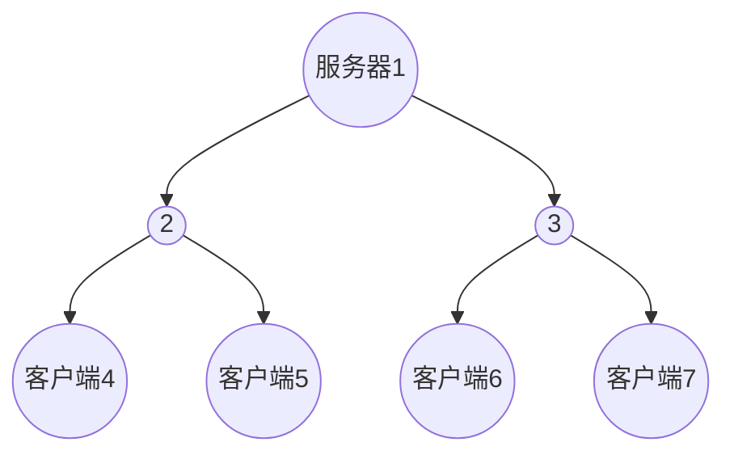
```mermaid
graph TB
1((服务器1))--> 2((2))
1((服务器1))-->3((3))
2((2))--> 4((客户端4))
2((2))-->5((客户端5))
3((3))-->6((客户端6))
3((3))-->7((客户端7))
```


## 计算机网络2-DNS和P2P


### DNS服务器
 往往我们访问的网站是www.baidu.com，这个叫名字，他对应的IP为36.152.44.96,这个过程可以使用ping得到，名字到IP是谁为我们在提供服务呢？这时候就出现了DNS服务器，将名字映射为IP，

#### 分布式DNS服务器
 这个必须分布式

#### 层次化
 DNS服务器就像一棵决策树一样，每一层都在分类，最顶层是Zone,他知道.com, .edu, .net 等DNS服务器在哪， .edu服务器又知道 .washington.edu ， .cug.edu , .tingshua.edu在哪， 这样一层一层向下


#### 本地DNS服务器
 就是学校、公司的DNS服务器

#### 一个例子
 比方一个地大的要找gaia.cs.umass.edu, 他就先找地大的DNS服务器dns.cug.edu.cn， 然后找到Zone，然后找到.edu服务器, 然后去找.umass.edu服务器, 然后去找.cs.umass.edu服务器，最后就找到了gaia.cs.umass.edu，然后就找到IP了。

#### 递归还是非递归
 即我问了A，A替我去问B，B回答A，A回答我，这就是递归
 我问A，A说不知道并让我去问B，我去问B，B回答我，这就是非递归
 显然本地服务器采取递归，其他服务器采取非递归好。

#### DNS缓存
&esmp; 缓存两天

#### DNS插入新值
 花钱买域名

#### 负载均衡
 多个IP地址对应一个名字，即服务端有多个IP，他们共用一个名字，这时候DNS服务器收到询问会轮流指向这些IP地址。

### P2P
 没有服务器，自组织传输，当规模庞大以后会遇到问题

#### 发布内容很快
 当一个文件要发给所有客户端的时候，这个速度是呈现指数增长的。

#### 动机
 上传助人，下载助己。你传给我，我就传给你，这样就能合作

#### 分布式哈希表
 每个节点只储存一部分数据，从而在整个网络上寻址和储存，这样我们就能找到我们要的文件储存在哪。

#### BitTorrent协议
 将文件划分为小块，利用并行机制快速传输数据。
 首先联系分布式哈希表，把自己加入其中，然后会得到一堆端(peers),与不同的端并行传输数据，优先和快的端传输
 本身拥有文件但不给别的端传输的端，我们也不给他传文件。
 

## 计算机网络3-可靠传输


### UDP 
 不可靠传输，Voice-over-IP、DNS、RPC、DHCP??????
### UDP头
 16位源端口，16位目标端口，16位UDP长度，16位checksum
### UDP问题
 长度受限制了，我们要将大文件分割成小文件，哪一层来负责？为什么要分为小块？更可靠，但是可能导致后发送的先到达。

### 不可靠传输的包的问题
- 丢失
- 损坏
- 乱序到达
- 延时到达
- 重复包

### 什么叫可靠？
- 正确、及时、高效、公正


### 正确
 不丢失、不损坏、不乱序

### 丢失

#### 包丢失解决方案1
-   频繁而快速地发送单个包
 正确，但效率差，缺乏接收端的反馈，不知道何时停止。

#### 反馈
 ACK:收到包了，
 NACK: 没有收到包(你确定？别人给你发包了吗？) —> 当损坏的时候使用
#### 包丢失解决方案2
 收到ACK以前，一直重复发包，好吗？ 优化了时间效率，但浪费了带宽。特别是长延时网络。

#### 包丢失解决方案3
 发送包以后设置时钟，在这段时间内收到ACK则结束，否则重发，但是时间设置为多少？？？？

#### 多个包的问题
 单包方案在局域网不会出现问题，因为距离近，但是在更大的网络呢？效率非常差，带宽利用率过低。

#### 多包的解决方案
 使用流水线+滑动窗口，用窗口大小控制链路上包的数量
 窗口的目的 限制带宽、限制接收端的缓冲区数量
 为什么要限制带宽？ 用来拥塞控制

#### 多包的反馈
 累加ACK，ACK的时候回馈未收到的包的最小序号
 完全ACK，回馈所有未收到的包序号，这个不常用,可能会与累加ACK一起使用

#### 如何检测丢包
 累加ACK多次返回同一个值的时候，那个包就丢包了，

#### 如何响应丢包
 检测到5号包丢失的时候，包5肯定要重发，包6呢？

#### GO-BACK-N算法
 当检测到5号包丢失的时候，把窗口滑向5，然后重新发送窗口中所有的包。

##### GO-BACK-N缺点
- 丢失
- 顺坏
- 重排
- 延时
- 重复

#### 完全应答ACK
 基于窗口，在超时或者多次ACK用一个值后重发。

### 公正
 基于窗口的AIMD,发现丢包以后滑动窗口减半，成功收到ACK后窗口增大1


## 计算机网络4-TCP


### TCP
 TCP传输是一种可靠传输的实现

### 不可靠传输的问题
- 包丢失
- 包损坏
- 包乱序
- 包延时
- 包重复

### 建立TCP连接
 为什么TCP连接需要建立呢? 为了确保网络的可达性。

#### 如何建立连接，为什么是三次握手
 考虑这样一个场景，有个人叫C在河边散步，他记得河对面有个人叫S，但是河上雾太大了，他看不清对面。他想和对面的人对话。
 既然是你想和对面的人说话，你首先得喊一声吧: "喂喂喂！河对面的S在吗？"，这时候可能有多种情况发生，见1，2，3，4
 1. 突然河面上跳出一条大鱼，把你的声音盖住了，S没有听到你的声音。于是对话结束了吗？不你得多试几次。再去喊他，要是每次都被这条该死的鱼给盖住了，那就意味着你的消息无法送达到河对面。对不起，网络连接可能有问题。
 2. 你的声音传了过去，但是被河中间的河神偷偷改变了，于是对面听到"喂喂喂！河对面的S死了吗？"，这时候S可能就不高兴了，他尽量分析你的句子的意思，这时候如果他分析出来你想说"喂喂喂！河对面的S在吗？"，那就好这等价于下面的情况4，若分析不出，他可能就当你是个傻子说骚话了，就不管你了。
 3. 你的声音传了过去，对面不在，哦豁，这时你可能会再叫他，叫的次数多了就知道叫不通了。
 4. 你的声音传了过去，对面听到了，作为一个礼貌的人，S要回答你的话。他对你说"我S在河对面！"，这时候又得看大鱼跳还是不跳了和河神干不干坏事了,如5，6，7,8
 5. 大鱼跳了，S一看自己说话了半天，你不回答他，S就要再次说"我S在河对面！"，这就又重复到情况4去了，要是S说了多次你还不回答他,S就不理你了，而你可能还会以为他没有听到你说的"喂喂喂！对面的S在吗？"在不断的尝试。
 6. 河神干坏事了，结果你听到了"我lbw真的没有开挂！"，你就得发挥你机智的头脑，把这句话分析为"我S在河对面"。要是分析不出来，和情况5没啥区别，要是分析出来了就进入7,8
 7. 你的声音传了过去，对面听到了，给你说了"我S在河对面！"，你也听到了，很多人这就结束了，你是过瘾了，喊S说话，S理了你，但S呢，莫名其妙的有个人叫了自己，自己给他回了话，然后对面就不说话了，这是S可能就在担心，"哎！他听到我说我在河对面了吗？"，然后他为了验证自己的担心不是多余的，就一直继续说"我S在河对面！",时间长了S就会想，对面怕不会是个聋子吧。这个交流显然是失败的。
 8. 你的声音传了过去，对面听到了，给你说了"我S在河对面！"，你也听到了，这时候为了防止对面认为你是个聋子，你得再给他说一句，"很好很好，我知道你在河对面了"，这是有可能发生很多情况，就得看鱼和河神了。
 9.要是他俩又干坏事，S要么听不到你说话，认为你是个聋子，要么听见你说骚话，认为你是个傻子，这两种情况他都会不断地多次对你说，"我S在河对面"，要不就分析出你说"很好很好，我知道你在河对面了",认为你是个正常人。现在你们都认为对面是正常人了。谈话很愉快。

#### 三次握手携带更多的信息
 通常我们在握手的时候，就告诉对面自己的初始包号，然后第二次和第三次握手的时候就能携带ACK数据了。

### 如何关闭连接，为什么是四次挥手
 原理一样的，我们忽略丢包和包损坏，不妨设C要准备去吃饭了，这时候S还在滔滔不绝的讲着他的故事，C对S说，"我要吃饭了"，S听到后说"好的，我听到你说你要去吃饭了，但是你先等我把这故事讲完再走"，这是C能离开吗？显然不能，他得等着，知道S说"我讲完了"，这时候已经挥手了三次了，你还不能走，你得根S说，"我听到你说讲完了"之后才能离开，为什么呢?因为你要是不说的话，对面可能以为你没听到他说的“我讲完了"，说一共是挥手4次。

### 滑动窗口超时问题
 多久没有收到ACK才代表着所有的包全部丢失？这个很难确定，我们可以让他自适应

#### 自适应RTT
$$SRTT_n = 0.9*SRTT_{n-1} + 0.1*RTT_n$$ 这个代表RTT的期望
$$SVAR_n = 0.9*SVAR_{n-1} + 0.1*|RTT_n-SRTT_n|$$ 这个代表RTT的方差
 当一个包超过期望+3倍的方差仍未回应ACK，视为丢包

### 滑动窗口丢包问题
 3次ACK，则丢包

### 流控制
 我们一直在想办法加速我们的网络，用到了发送端滑动窗口，但是如果接收端的内存太小，受不起如此快的传输，就只能丢弃后面收到的包，尽管已经收到了，这时候我们常常让接收端告诉发送端自己还剩下多少缓存取，来放慢传输速率，高效利用网络。


### 拥塞控制
 由于网络上各个线路的带宽不同，可能导致拥堵，TCP协议是闭环，通过反馈信息来判断是否拥堵。
#### AIMD
 没有阻塞的时候，滑动窗口大小+1，阻塞的时候除以2，

### ACK时钟启动
 发送端一次性发送大量的包，然后开始等待ACK，等到一个ACK就发下一个包，这样就能降低丢包和延时？？，刚开始会有网络的爆发，后面会平滑

### TCP慢启动
 使用指数的方式，先发一个包，然后每收到一个ACK，(滑动窗口增大1)发两个包，当拥塞的时候滑动窗口减半。

### 超时控制
 超时以后使用慢启动(AIMD),更好的检测丢包能保证更好的AIMD

### 快速重传快速恢复
 当3次ACK检测丢包后，认为丢包，重传一个段,然后积性减少滑动窗口
#### 为什么是3次
 顺序重排也会导致多次ACK
#### 为什么积性减少
 消除超时或丢失后的慢启动，因为重传了一个段，可能后面会收到大量的ACK，预先减少滑动窗口，防止拥塞

### ECN(Explicit Congestion Notification)
 显示拥塞通知,路由器通过队列检测拥塞，标记收影响的包，被标记的包送达时，接收端视为丢失，然后反馈给发送端拥塞消息。


## 计算机网络5-IP


### IPv4与IPv6
 IPv4使用32位地址,IPv6使用128位地址

### 早期的地址
 前八位为网络地址，后24位为主机地址，人们认为256个网络就足够了

### 类地址
 接下来人们设计了ABCDE类的地址

|类别|IP|
|--|--|
| A类 | 0\*\*\*\*\*\*\* \*\*\*\*\*\*\*\* \*\*\*\*\*\*\*\* \*\*\*\*\*\*\*\* |
| B类 | 10\*\*\*\*\*\* \*\*\*\*\*\*\*\* \*\*\*\*\*\*\*\* \*\*\*\*\*\*\*\* |
| C类 | 110\*\*\*\*\* \*\*\*\*\*\*\*\* \*\*\*\*\*\*\*\* \*\*\*\*\*\*\*\* |
| D类 | 1110\*\*\*\* \*\*\*\*\*\*\*\* \*\*\*\*\*\*\*\* \*\*\*\*\*\*\*\* |
| E类 | 11110\*\*\* \*\*\*\*\*\*\*\* \*\*\*\*\*\*\*\* \*\*\*\*\*\*\*\* |


 其中的E是不使用的，D是多播的
 C类地址太多了，路由器存不下

### 现在的路由表
- CIDR = 无类别域间路由
- 网络和主机地址间的划分是可变的
- 为了辨认这两个，提出了掩码，IP按位与掩码就是网络


| perfix | Next Hop |
| -- | -- |
| 192.24.0.0/19 | D |
| 192.24.12.0/22 | B |

#### 如何寻路？ 
 匹配LCP(最长公共前缀),常用X快速前缀树这个数据结构，链接在这, 通过最佳匹配项，找到应该走的路径即可。

#### 碰到环路
 为每一个IP包设置TTL，每一次寻路就让其减少1，减少到0的时候就丢掉这个包。

##### Traceroute
 发送TTL从1开始的包，可以用于网络检测


#### 包太大怎么办
 又的路由器low一点，只能收小包,但是到底多大的包才是最合适的？分包会增加丢包率
 发现路径的最大传输单位，主机先发一个大包，路由器传输，若出错，返回最大支持的包大小。

#### ICMP
 是IP的伴侣协议，提供转发时发生的错误信息，当路由器遇到错误，就发送一个ICMP给IP源地址

#### 发送拥塞信号
 为包打标记，告知主机发生拥塞

### 如何获得IP地址
 过去手动配置，现在使用DHCP

#### DHCP
 向其他节点发放IP地址，提供网络前缀，提供本地路由器地址，提供DNS服务器、时间服务器等
 节点只需要在网络上广播，DHCP服务器便会回应。

### IPV6
 从根本上而言，IPv6不与IPv4兼容，那我们怎么在IPv4网络中发送IPv6的包呢？我们在其包外封装一层IPv4头即可。

### NAT
 本质上就是将内网地址+端口映射到外网地址+端口

| Internal IP:port | External IP: port| 
|--|--|
| 192.168.1.12:5523 | 44.25.80.3:1500|
| 192.168.1.13:5523 | 44.25.80.3:1502|
| 192.168.1.20:5523 | 44.25.80.3:1505|

- 缺点： 外网无法直接访问内网，需要内网先与外网建立链接
- 优点： 缓解IP地址压力，易于部署，私密


### 解决路由器环路
#### flood 
 泛洪，由一个节点开始，向四周扩散，flood包最终会发给每个其他节点，于是大家都知道了如何到达第一个节点的路径
#### 学习型交换机
 当包到达，查看源ID，已经进入的端口，将其存入路由表，并设置着一项的存活时间，如果不知道要怎么走，就发给所有相邻路由器

### 解决最短路径问题
&esmp;分布式bellman-ford算法，记录一个矩阵，D(X,Y,Z)代表从X到Y经过Z的最佳距离，然后跑bellman-ford算法就可以了


### 毒性逆转
 有点复杂了，溜溜球


### 多径路由
 保存最短路dag，转发的时候就能选择多个后继节点发送，进行负载均衡

### 层次路由
 路由到一个区域而不是单个节点，先路由到区域，然后到区域内的IP前缀

### 策略路由
 ISP为客户提供路由服务，客户为ISP付费，ISP内的客户互相路由不付费

## 计算机网络6-链路层


### 帧
 就是一串数字

#### 字节计数
 每一帧的第一个数字记录了这一帧的长度,很辣鸡，错位就凉凉

#### 字节填充
 前后加上特殊flag，就像字符串的写法一样，如abc"abc就写成了"abc\"abc",这样做导致flag要转码。
#### 位填充
 flag为6个连续的1，发送数据的时候五个连续的1后插入一个0，原理是什么?
 编码？下图是一个正常的编码。他只能识别00，01，10，11
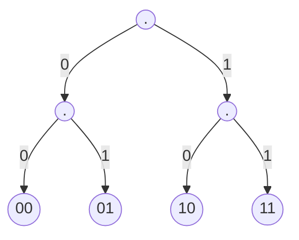
```mermaid
graph TB
s((.))--0--> 0((.))
s((.))--1--> 1((.))
1((.)) --0--> 10((10))
1((.)) --1--> 11((11))
0((.)) --0--> 00((00))
0((.)) --1--> 01((01))
```
 这样改进一下呢?（我太菜了mermaid用不好，第一层的1居然在左边)
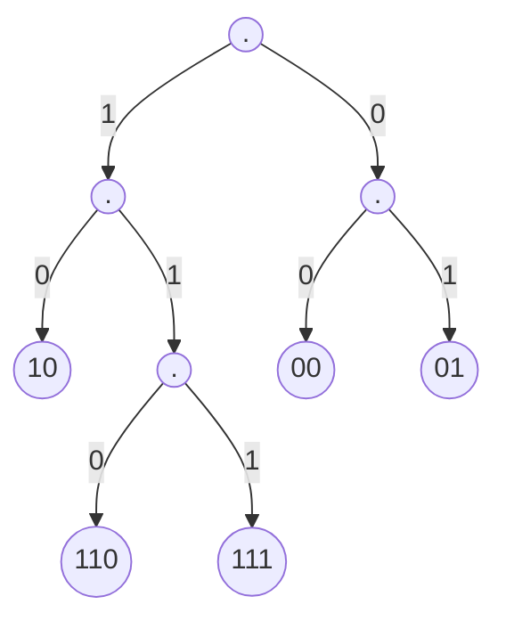
```mermaid
graph TB
s((.))--0--> 0((.))
s((.))--1--> 1((.))
0((.)) --0--> 00((00))
0((.)) --1--> 01((01))
1((.)) --0--> 10((10))
1((.)) --1--> 11((.))
11((.)) --0--> 110((110))
11((.)) --1--> 111((111))
```
 然后就能识别00，01，10，110，111,我们让111作文分割符，110表示11即可。
 为了能让这个更加棒，我们可以把树的高度弄大一点。这里我就不画了。

### 如何侦错
 搞两个拷贝，不同即错。太low了
 搞hash check sum，这个很棒
 internet校验和 定义函数f(x) = x>=n?f(x%n+x/n):x，n为一个二的幂， check = n-f(sum)-1, 验证： f(check+sum)=n-1，这个是显然的
 循环冗余校验 这个就是使用多项式在系数膜2的剩余体系下的除法运算，将得到的模数添加到最后面用于侦错。

### 如何纠错
 汉明码 通常使用二的幂-1对齐，如果我们放入k个检验位，则在最多出现一个错误的情况下可以保护2^k-1个位，为什么？二分！我们讲检验位放在1，2，4，8...等地方，然后使用二进制分类的方式对整个序列进行异或即可。解码的时候重新计算检验位，本质上就是在二分。得到的值位0，表示无错误，否则翻转后的位就是错误位。
 卷积码。

### 侦错还是纠错？
 需要根据错误率来选择

### 多路复用
 时分和频分


## 计算机网络7-安全


### 安全
 加密，有两种，对称加密和非对称加密，先用非对称加密，然后用对称加密
 加密 = 正确的发送者和完整性

### RSA加密
 两个大素数p,q相乘得到N，显然$$\phi(N)=\phi(p)*\phi(q)=(p-1)*(q-1)$$,找到两个数e,d满足$$ed\%\phi(N)=1$$,这里可以先随便生成一个e，然后利用exgcd算出d，显然e需要与$$\phi(N)$$互质，否则无解。
 其中(e,N)为公钥，(d,N)为私钥。
 证明$x^{ed}\%N=x$,如果x与N互质，显然成立，如果x与N不互质，不是一般性，假设$x=kp$， 则$$x^{ed}\%q=x\%q$$, 于是$$x^{ed}=x+tq$$,这一步很细节，都知道$$=x\%q+tq$$成立，为什么这样也成立？则$$x^{ed}\%p=(x+tq)\%p=tq\%p=0$$，即tq同时是p和q的倍数，于是$$x^{ed}\%N=(x+tq)\%N=x$$

### 数字签名
 和信息一起发送，让别人知道这条信息是自己发的，因为公钥解密后是签名

#### 加速签名
 RSA性能不佳，只对摘要签名，摘要是校验和加认证加上时间戳，要不然别人拿着老消息断章取义

### 无线网安全
 防监听，防蹭网


#### WPA2

### WEB安全
 监听c/s流量，篡改c/s消息，假冒web服务器

#### SSL/TLS
~~浏览器通知服务器自己支持的加密协议，服务器选择协议并告诉浏览器证书，浏览器用CA的公钥鉴别证书，浏览器用公钥加密一个随机数发给服务器，服务器解密后把随机数和加密后的新的对称密钥返回给浏览器，双方开始对称加密。~~
 客户端请求SSL连接，发送一个随机数和客户端支持的加密算法，
 服务端回复加密算法，一个随机数，CA证书和签名，公钥
 客户端验证CA证书和签名，再生成一个随机数，并用公钥加密，返回给服务端
 服务端用私钥解密随机数，现在他应该知道3个随机数，用他们通过一定算法生产对称加密的密钥，然后尝试用这个给客户端发送一个消息来测试密钥

### DNS安全
 DNS伪装,使用加密。


### 防火墙
 防火墙对每个包，作出决策，接受或丢弃
#### 无状态防火墙
 拒绝某些服务、端口、目标
#### 有状态防火墙
 允许内部主机连接后接受TCP包
#### 应用层防火墙
 查看包内容，进行安全检测

### VPN
#### 隧道
 IP in IP，在IP外再次封装一层IP实现虚拟链路封包

### DoS
 畸形包、发送TCP连接请求但不发送接下来的，
#### IP伪装
 将假的源地址放到包上，ISP要干一些事情来预防这种事件

## 计算机网络8-加密算法


### MD5算法和SHA1算法
 这是一个哈希函数，他很复杂，取了很多奇怪的数字，然后对数据分段，然后疯狂的加减和各种位运算，这导致了他不可逆

### CRC算法
 把数据看为一个二进制串，进而把每一位看作系数，于是成了一个多项式f(x)，让这个多项式乘以$x^k$,然后模上g(x),得到余数h(x), 我们传输的时候传输$F(x)=f(x)*x^k+h(x)$,验证的时候F(x)模g(x)为0即可

### 置换
 这个东西嘿嘿嘿，不是这篇博客的重点，了解一小下叫置换群：）
 只要知道置换是可逆的就行了

### AES算法
 把明文分组，每组128位即16字节
 先把一维的message做成一个二维的列优先矩阵[4\*4], 然后进行很多轮下述操作
- 字节置换， 把矩阵的每一个元素查表替换为另一个元素
- 行位移， 第一行不变，第二行向右移动一个单位，第三行移动两个，以此类推
- 列混淆，在模群下，让自己乘上一个矩阵A(确保A存在逆元)， 
- 轮密钥加，就是异或另一个矩阵B即可
 不难发现第四步可以再次异或B复原，第三步可以乘上A的逆复原，第二步可以向左移位复原，第一步可以查表复原，第

### DES算法
 把明文分组，每组64位即8字节
- 初始置换， 通过查表的方式，把每一位上的元素替换为另一个位上的元素
- 加密处理，共16轮，先把64位的数据拆为两个32位的数据L和R，$L_i=R_{i-1},R_i=L_{i-1}^f(R_{i-1],k_{n-1}})$ k是一个密钥
- 函数f 第一步，密钥置换 ， 用64位的密钥生成16个48位的子密钥，每一轮使用不同的子密钥，使用循环左移生成
- 函数f 第二步，拓展置换 ， 讲32位的R改变位的次序并重复某些位，拓展为48位，
- 函数f 第三步，S盒替换 ， 把48位的R分割为8个6位的小段，对每一个段使用S盒来替换，输出是4位，故而最终R又从48位变成了32位，
- 函数f 第四步，P盒置换 , 把32位的R再次和初始置换类似的方法置换即可
 解密一样的啦

### RSA算法
 基于大合数难以分解的原理，达到难以破解，基于模群的性质达到加密和解密

### ECC算法
 一个基于圆锥曲线的算法，非对称加密算法


## 计算机网络9-HPACK压缩算法


HPACK: 专门为头部设计的压缩算法，使用两个索引表来把头部映射到索引值，一个是静态索引，一个是动态索引
静态索引表: 预先只有少量的值,但是这个表是固定的
动态索引表: 是一个先进先出的队列维护的空间有限的表，每个动态表只针对一个连接，
整形编码: 头+value，如果不够长度，则下一个字节为0+value(x-2^n+1)
字符串编码: H+len+data, 是否曼哈顿+字符串长度+数据， 有两种编码方式，看第一位如果为1就算哈夫曼编码，否则是原串
二进制编码: 然后就开始维护动态表

## 计算机网络10-内网穿透

### 问题提出
最近在我的世界群里面看到他们谈论游戏的时候，谈到了服务器上面，他们一谈服务器就是192.168.xxx.xxx, 这就让我很困惑，这不是局域网IP吗，你们是怎么玩到一起去的？
### 内网穿透
就是一种技术，他可以让不同的局域网中的机器通过互联网互联
<!-- more -->
### 前置知识
- IP:网络中的逻辑地址
- 域名: IP的别名
- DNS服务器: 将域名转化为IP的服务器
- DDNS服务器: 将域名转化为动态IP的服务器
- NAT: 通过端口映射，让局域网中的多台机器共享一个IP的技术
- 正向Proxy: 你翻墙的时候，有一个服务器拦截你的请求，替你发给其他人 
- 反向Proxy: 服务器集群被访问的时候，请求被拦截，然后被分发

### 内网穿透要解决的问题
NAT就实现了局域网中的机器与外网中的机器通信的问题，但是通信只能由局域网内部发起
### 解决他
我们在两个NAT之间构造一个索引服务器，用心跳机制让局域网内部IP在索引服务器上注册端口映射，例如让机器1向索引服务器发送心跳，注册自己在局域网1的公网IP的私有Port，机器4也是如此，此后，他们就可以通过索引服务器正常通信了 。
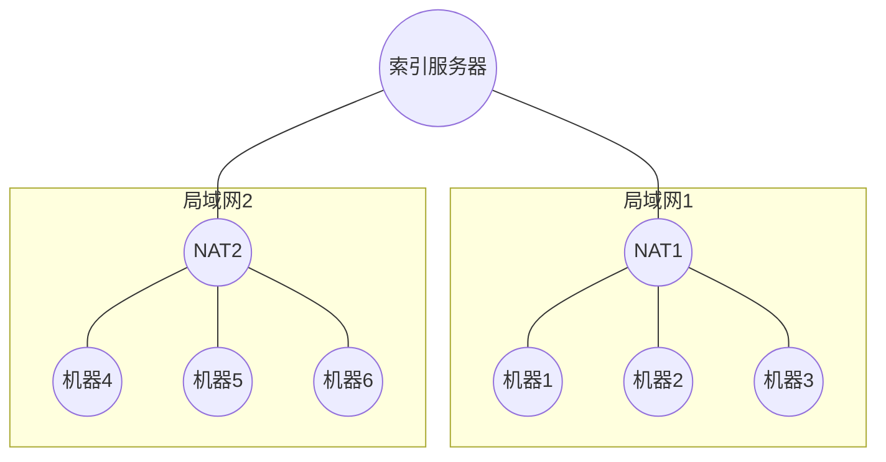
```mermaid
graph TB;
  索引服务器((索引服务器)) --- NAT1((NAT1)) & NAT2((NAT2))
  subgraph 局域网1
    NAT1((NAT1)) --- 机器1((机器1)) & 机器2((机器2)) & 机器3((机器3));
  end
  subgraph 局域网2
    NAT2((NAT2)) --- 机器4((机器4)) & 机器5((机器5)) & 机器6((机器6));
  end
```

### 参考
[内网穿透的实现和原理解析](https://blog.csdn.net/xinpz/article/details/82732217)
[内网穿透原理解析小知识](http://service.oray.com/question/5571.html)

# OS

## 操作系统1 - 操作系统


### 操作系统是什么
 是一个控制软件，能管理应用程序，为应用程序提供服务，杀死应用程序，能够分配资源，能够管理外部设备，承上启下，硬件之上，应用程序之下，
### Kernel
 CPU调度,物理内存管理，虚拟内存管理，文件系统管理，中断处理和设备驱动
### Kernel特征
 并发，共享(1在一个时间点，只有一个程序能够访问2同时访问)，虚拟（利用多到程序设计技术，让每个用户都觉得有一个计算机为他服务），异步(程序走走停停，而不是一直走)
<!-- more -->
### 操作系统实例
 Unix,Linux,Windows等


## 操作系统2-中断异常调用


### 操作系统的启动
 DISK中放操作系统，BIOS是基本的IO系统，检测外设，Bootloader能够加载OS，BIOS从CS段寄存器;IP指令寄存器开始执行，然后BIOS会POST(加电自检)，然后BIOS找到bootloader加载Bootloader，并传递控制权,然后Bootloader找到OS，读到内存吧控制权交给OS
### 操作系统的中断、系统调用、异常
 系统调用是应用程序主动想操作系统发出服务请求，
 异常是来源于不良的应用程序的非法指令
 中断是来自不同硬件设备到额计时器和网络的中断
 我们不能让应用程序直接访问外设，这不安全，另外OS可以提供更好的借口，通用可移植
### 中断处理
 保存现场、查表、中断处理、清楚中断标志、恢复现场
<!-- more -->
### 异常处理
 保存现场、查表、异常处理(杀死程序或者重新执行异常指令)、恢复现场
### 系统调用
 printf(..); 会触发系统调用write(); 程序主要是用高层次API而不是系统调用，用户是不知道系统调用怎么实现的。
### 用户态
 是一个cpu状态，有一部分权限
### 内核态
 有更多权限
### 系统调用
 会发生用户态到内核态的转化
### 操作系统的开销
 建立中断、异常、系统调用号与相印服务的开销，建立内核堆栈的开销，验证用户程序发出的参数的开销，内核态映射用户态的时候页面映射权限更新的开销，TLB的开销


## 操作系统3-连续内存分配


### CPU内存
 CPU-L1cache-L2cache-memery-disk
### 逻辑地址空间
 抽象、隔离、保护、共享、虚拟化(临时放入disk)
### 内存管理
 程序重定向，分段，分页，虚拟内存，按需分叶虚拟内存
### 地址空间和地址生成
 C程序用变量表示地址，汇编还是用符号，机器码就开始使用逻辑地址了，CPU的MMU中有一段区域来映射逻辑地址到物理地址
### 约束程序的内存
 程序只可以访问他自己的内存，当他访问其他地方的时候，操作系统应该使用安全检测
### 内存碎片
 外部碎片，是分配单元之间的内存碎片
 内部碎片，已经分配给了应用程序，但是应用程序没法使用它
### 连续内存分配
 程序启动的时候要分配，运行的时候要分配
<!-- more -->
### 第一匹配分配算法
 一个一个找，第一个碰到的合法的就分出去，
 需要按地址排序，分配的时候需要寻找合适的分区，还有看自由分区能否与相邻空闲分区合并
 简单，容易产生更大的空闲块，
容易产生外碎片
### 最优分配算法
 找差值最小的分区，分过去
 按尺寸排序，分配需要查找，也要合并相邻空闲分区
 避免分割大空间块，当大部分分配的是小尺寸的时候非常有效，
 容易产生外部碎片，合并空闲分区慢，容易产生大量微小碎片
### 最差匹配分配
 找最大的分区分过去
 按尺寸排序，分配快，也要合并
 分配中等尺寸有效
 合并慢，外部碎片，破碎空间没有大空间了
### 压缩式碎片整理
 挪动已经分配过的空间，
 什么时候挪动？销量？
### 交换式碎片整理
 和硬盘交换，使用虚拟内存的方法。
 把哪个换出去？什么时候换？


## 操作系统4-非连续内存分配


### 非连续内存分配
优点: 一个程序的物理空间是非连续的，更好的内存利用，允许共享代码与数据(共享库等),支持动态加载和动态链接
### 分段机制
 程序等栈段、堆段、数据段、等等分散到多个物理空间，
### 硬件堆分段寻址方案
 段号+偏移量，高位为段号，低位为偏移量，用段表来映射，段表中存了起始地址和长度信息，CPU可以在访问前做安全检测，
### 分页机制
 让段的长度固定，就成了分页机制。
### 页帧
 物理内存被分割为大小相等的帧
### 页表
 dirtybit+residentbit+clockbit+页帧号
### 分页机制的性能
 访问一个内存单元需要两次访问： 页表+数据
  页表太大怎么办，多个程序多个页表，更大了，这个不能放到cpu，放到内存又会很慢

<!-- more -->
### TLB快表
 本质上是页表的缓存，容量有限，速度快
### 多级页表
 多了一次查找，但是空间占用更加低了，就像一个字典树一样，当然省空间
### 反向页表
 那么页表项的数量就只和物理内存大小有关了，和虚拟大小无关了，但是查找就很慢了，第一张方法是使用关联内存，并行查找，但是这个东西的设计成本太高了，第二种方法是Hash查找，用硬件加速，


## 操作系统5-虚拟内存


### 虚拟内存
### 覆盖技术
 把一些不会相互调用的函数分配到相同的地址空间，当需要调用的时候覆盖内存就可以了。
 需要程序员来设计，费时费力，模块的覆盖是时间换空间
### 交换技术
 让暂时不运行的程序交换到磁盘中，当使用的时候换回内存。
 只在内存不够的时候交换，磁盘的交换区的空间必须足够大，换出然后换入的时候物理内存不一定一样了，但是我们可以用虚地址解决这个问题。
### 虚存技术
 像覆盖技术一样不把程序所有的内容都放入内存，想交换技术那样，只对进程的部分内容进行交换，
<!-- more -->
### 虚存技术的页表项
 逻辑页号+访问位+修改位+保护位+驻留位+物理页号
 驻留位表示页面是否在内存中，保护位表示权限，修改位表示这个页是否被写过用于支持内存硬盘的一致性，访问位表示这个页面最近是否被访问过
 如果我们发现驻留位为0，则触发缺页中断，操作系统把页面读入，然后修改页表，最后跳回发生缺页中断的位置继续执行
### 后备存储
 可以映射到已有的二进制文件中，可以映射到同台调用的库文件中，


## 操作系统6-页面置换算法


### 页面置换算法
 当缺页中断发生的时候，需要做交换，我们需要尽量减少交换的次数。
### 最优页面置换算法
 将等待下一层的访问时间最长的那个页面置换出去，这个算法不可能实现，但是可作为评价其他算法的标准
### 先进先出页面置换算法
 维护一个队列，FIFO即可
 性能很差，被调出的页面可能是要经常访问的页面
### 最近最久未使用算法 LRU
 这个算法基于空间局部性
 维护一个页面链表，将刚刚使用过的页面作为首节点，那么缺页中断的时候淘汰链表尾部即可
<!-- more -->
### 时钟页面置换算法
 让页表组织成一个环形链表，把指针指向最老的页面，当发生缺页中断的时候，从老页面开始扫描，对碰到的访问位为0的页表置换出去，如果都是1以后，把他们清0
### 二次机会法
 同时利用修改位和访问位来指导置换，当访问位位0修改位为1的时候，将它保留下来，并把修改位改为0，这里改为0以后还要写回内存。给这个页面第二次机会。
### 最不常用法 LFU
 淘汰掉访问次数最少的那个，对每个页面都增加一个访问计数器，当访问后计数器+1，注意到这个算法新页很吃亏，我们尝试定期将计数器除以2，又是ADMI和式增加积式减少的手段。
### Belady现象
 在FIFO算法中，会出现分配物理页面数增加缺页率反而提高的异常现象。
### 工作集替换算法
 工作集大小 单位时间内访问的页面总类，
 将不再工作集中的页面换走
### 缺页率页面置换算法
 缺页率: 缺页次数除以内存访问次数
 基于缺页率来动态调整常驻集的大小
 常驻集大小 当前实际驻内存的页面种类，
### 抖动问题
 随着驻留内存的进程数目不断增加，分配给每个进程的物理页面数不断减少，缺页率上升，造成频繁的替换，这就是抖动
### 量化抖动
 缺页频度： 两次缺页的平均间隔时间，
 工作集大小


## 操作系统7-进程


### 进程管理
### 进程的组成
 代码+数据+程序计数器中的值，堆和栈，一组资源(打开的文件)
### 进程的特点
 动态创建，并发或者并行，独立(执行的正确性不受其他进程影响)
### 进程控制块(PCB)
 操作系统为每个进程维护了一个进程控制块，用来保存与该进程有关的各种状态信息。是进程存在的唯一标示。
 包含了进程标识信息(父进程，用户标识)， 处理器状态信息保存区(用户可见寄存器，PC寄存器，程序状态字，栈指针)， 进程控制信息(调度和状态信息、进程键通讯信息，储存管理信息，进程所用资源信息，数据结构连接信息)
 PCB的组织方式： 链表或者索引表
### 进程的创建的时机
 系统初始化, 用户的请求，进程的请求
<!-- more -->
### 进程的运行
 由操作系统调度执行
### 进程的等待
 请求并等待系统服务，启动某种操作，需要的数据没有到达
### 进程的唤醒
 被阻塞的进程需要的资源得到满足，等待的事件到达，PCB被插入到就绪队列。
### 进程的退出
 正常退出、错误退出、致命错误导致被强制退出，被其他进程杀掉
### 进程的状态
 运行 就绪 阻塞
### 进程挂起
 当进程被刮起的时候，他将没有占用内存空间,阻塞、就绪、运行都可能被挂起。
### 阻塞挂起
 进程在外存并等待某事件的出现
### 就绪挂起
 进程在外存，只要进入内存就可以运行。
### 状态队列
 不同的状态分别用不同的队列维护


## 操作系统8-线程


### 线程管理
### 线程控制块 TCB
 类似PCB
### 线程优点
 一个进程可以同时存在多个线程，各个线程之间可以并发执行，各个线程之间可以恭喜那个地址空间和文件资源。
### 线程缺点
 一个线程崩溃会导致所属进程的所有线程崩溃。
### 进程与线程
 进程是资源分配单位，线程是CPU调度单位
  进程拥有完整的资源平台，线程只独享其中的寄存器和栈
  线程也有就绪阻塞执行三种状态和状态转化关系
 线程能减少并发执行的时间和空间开销,线程创建终止块，切换快，共享资源可直接进行不依赖内核通信。
### 用户线程和内核线程
 用户线程操作系统看不到，内核线程操作系统看得到
### 用户线程
 线程的创建终止同步和调度都是线程库实现的。TCB在进程内部
### 用户线程的缺点
 当一个线程阻塞以后，整个进程都阻塞了，因为操作系统看不到用户心线程，只能看到进程。
<!-- more -->
### 内核线程
 内核线程是操作系统看得到的，他的TCB在和PCB放在一起
 内核线程的创建终止等都是通过系统调用或内核函数的方式来进行，有内核完成，开销较大，如果内核线程阻塞了，不会影响其他内核线程。时间片分给线程，多线程的进程可以获得更多的CPU时间。
### 轻量级进程
 一个进程可以有多个轻量级进程，每个轻量级进程由一个单独的内核线程来支持。
### 上下文切换
 把进程的资源的上下文(CPU状态)放入PCB中，然后才能安全的调度
### exec()
 加载程序取代当前进程。
### fork()
 完全拷贝一份进程，pid不同, 99%的情况，fork()后马上exec()
### vfork()
 轻量级fork，不创建内存映像，然后调用用exec的时候就比fork+exec快多了。
### cow技术 copy on write
 当fork的时候不拷贝内存，只有当写的时候才拷贝内存
### wait()
常常父进程需要等待子进程结束。wait()等待子进程的exit()的返回值，然后回收子进程的PCB。
### exit()
 当子进程exit,但是父进程没有做完wait的时候，他就成了僵尸态。
### 父进程比子进程先死掉怎么办
 root进程会在定期扫描进程，寻找僵尸态进程,并终结他们。


## 操作系统9-CPU调度


### CPU调度
### 调度指标
 CPU使用率(CPU忙状态所占的时间比例)，吞吐量(单位时间内完成的进程数量)，周转时间(一个进程从初始化到结束，花费的所有时间), 等待时间(进程在就绪队列中等待的总时间)， 响应时间(一个请求从提交到产生相应所花费的时间)
### FCFS 
 first come first served
 先来先服务
### SPN
 Shortest Process Next
 短进程优先 （抢占或者不抢占）
 导致长任务饥饿
### HRRN
 Highest Response Ratio Next
 最高响应比优先，等待时间/执行时间
 不可抢占，关注等待，防止无期限推迟。
<!-- more -->
### Round Robin
 时间片轮循
 时间片太长导致退化为FCFS，太短导致吞吐量受影响
### Multilevel Feedback Queue
 优先级队列中的轮循，把所有就绪进程分为不同的级别队列，分为交互性和后台，每个队列有自己的调度方法，一个进程可以在不同队列中移动，时间片大小随优先级增加而减少，如果一个认为在当前时间片没有完成，则降级,获得更多的时间片
### Fair Share Scheduling
 公平共享调度
### 实时调度
 强实时系统，保证在时间内完成，
 弱实时系统，尽量在时间内完成，
### 静态优先级调度
 在任务前就确定了优先级,如RM(Rate Monotonic)速率单调调度，周期越短优先级越高
### 动态优先级调度
 在运行期间确定优先级，EDF(Earliest Deadline First)最早期限调度，Dealine越早就越先调度。
### 多处理器调度
 主要考虑负载均衡，
### 优先级反转
 先给3个任务，T1&gt;T2&gt;T3, 如果T3先出现，则调度T3，T3访问了一个共享资源，后来T1来了，T1优先级最高，所以抢占，但是共享资源被T3锁住了，于是阻塞，T1开始执行，但是这时候T2横插一手，导致T1有不能执行，最终导致T1不能正常完成，
 我们应该设计优先级继承，即当T1在等待T3执行完成的时候，将T3的优先级提升到和T1一样，让T2插不进来，才能保证T3的完成，进而释放资源好让T1完成。
 这个方法又叫优先级天花板


## 操作系统10-进入临界区


[n个进程互斥，留坑](https://www.bilibili.com/video/BV1js411b7vg?p=61)

### 禁用中断
 进入临界区以后禁用中断，离开临界区以后开启中断
 一但禁用了中断，整个系统都停止，可能导致饥饿，要是临界区有个死循环就完蛋，多个CPU无法解决问题。

<!-- more -->

### 利用软件解决
#### 轮换
```cpp
do{
  while(turn!=i);
  // 进入临界区
  // do something
  turn=j
  // 离开临界区
}while(1);
```

#### peterson算法
```cpp
do{
  flag[i]=true; // 自己要进去
  turn = j; // 把机会让给别人
  while(flag[j]&&turn==j);
  // 进入临界区
  // do something 
  flag[i]=false;
  // 离开临界区
}while(1);
```

#### n个进程的互斥
 Bakery算法， 进入临界区以前，进程接受一个数字，得到最小数字的进入临界区，如果数字相同，id小的进去

### 基于硬件解决
 优点: 简单，适用于多CPU中任意数量的进程，支持多临界区，开销小
 可能发生饥饿，可能死锁，如果低优先级进程拥有锁，高优先级进程拥有CPU，还在忙等待，就死锁了
#### Test and Set
```cpp
bool testAndSet(bool*p){ 
  bool res = *p;
  *p=true;
  return res;
}
```

#### change
```cpp
void swap(bool *a,bool*b){
  bool tmp = *a;
  *a=*b;
  *b=tmp;
}
```


## 操作系统11-同步


### 信号量
 就是一个整型加上一个队列
```cpp
class Semaphore{
  int sem;
  WaitQueue q;
}
```

### P操作
 让信号量减少1，如果&lt;0，把自己挂起
```cpp
// 有原子性
P(){
  sem--;
  if(sem<0){
    Add this thread to q;
    block(t);
  }
}
```

<!-- more -->

### V操作
 让信号量加1，如果&le;0，唤醒挂起的一个线程
```cpp
// 有原子性
V(){
  sem++;
  if(sem<=0){
    Remove a thread  t from q;
    wakeUp(t);
  }
}
```

### 简单的同步
 这是A的代码
```cpp
do a1
do a2
```
 这是B的代码
```cpp
do b1
do b2
```
我们需要保证a2在b1之后执行，应该怎么办？
 我们可以让信号量设为0，如果A先执行完a1，则P()导致阻塞，当B执行完b1以后，A被唤醒，代码如下
```cpp
do a1
P()
do a2
```
```cpp
do b1
V()
do b2
```

### 生产者与消费者
 任何时间只有一个线程操作缓冲区(互斥)
 当缓冲区空，消费者要等待生产者(同步)
 当缓冲区满，生产者等待消费者(同步)
 所以我们需要一个互斥量，两个个信号量
```cpp
mutex = 1; // 互斥量
fullBuffers = 0; // 缓冲区满的信号量
emptyBuffers = n; // 缓存区空的信号量
```
 生产者
```cpp
emptyBuffers.P(); // 我们要生产之前需要判断空缓冲区的信号量，如果空间不足就要阻塞
mutex.P(); // 进入临界区
Add
mutex.V(); // 退出临界区
fullBuffers.V(); // 释放
```

 消费者
```cpp
fullBuffers.P(); 
mutex.P(); 
Del
mutex.V(); 
emptyBuffers.V(); 
```

 mutex.V和fullBuffers.V可以交换，但是P不行，会死锁

### 管程
 包含了一个锁，包含了很多条件变量
```cpp
class Condition{
  int numWaiting=0; // 队列中的元素个数
  WaitQueue q;
  void Wait(lock){
    numwaiting++;
    Add this thread to q;
    release(lock);
    schedule();
    require(lock);
  }
  void Signal(){
    if(numWaiting>0){
      Remove a thread t from q;
      wakeup(t);
      numWaiting--;
    }
  }
}
```
 想想如何用管程实现生产者消费者
 一个锁lock+两个条件变量notFull和notEmpty+一个计数器记录缓冲区的食物数量
```cpp
// 生产者
lock.require();
while(count==n) notFull.Wait(&lock); // 如果满了就等待，参加上面的wait会释放锁
Add， count++;
notEmpty.Signal(); // 生产了以后就可以去唤醒别人了
lock.Release();
```
```cpp
// 消费者
lock.require();
while(count==0) notEmpty.Wait(&lock); 
Del， count--;
notFull.Signal(); 
lock.Release();
```

 注意到消费者的Signal后,有两种选择，第一是继续执行，直到release，第二是将CPU交给被唤醒的线程去执行管程，
 我们先考虑第一种方案，当唤醒线程以后，自己的release执行完以前，没有任何其他线程能够进入临界区，当自己release以后，我们来考虑所有的生产者，有若干个被唤醒的线程已经在临界区里面了，可能还有一些生产者也在临界区中然而没有被唤醒，这种我们不用管他，还有一种在临界区外正准备争夺临界区的控制，所以，为了避免那些临界区外和若干个临界区内被唤醒的线程发生冲突，我们必须用while来保证只有一个线程再次获得控制权。
 为什么会有若干个未被唤醒的线程出现在临界区中? 我们考虑这样一种情况,此时缓冲区食物满了，一个生产者进入了临界区，发现count=n,于是开始wait,这导致了锁被释放，之后就有两个分支了，要么是又来了一个生产者争夺了锁，要么来了一个消费者开始消费，如果来的是生产者，他发现count=n,又会开始wait,这就是为什么会出现多个未被唤醒的生产者出现在临界区中。
 为什么会有若干个被唤醒的线程出现在临界区中，我们先考虑现在只有一个未被唤醒的生产者在临界区，此时cpu在消费者手中，当消费者signal以后，会唤醒生产者，但是生产者不见得能拿到CPU，当消费者release以后，临界区的那个生产者跃跃欲试，然后临界区外面还有一群生产者也在等着呢，要是他们拿到了，临界区中的生产者虽然被唤醒，但是还是会被require阻塞,这种情况下，被唤醒的生产者就一个接一个的被阻塞了。
 如果我们改进CPU，使用第二种方法，让被唤醒的线程去执行管程，那就不会发生上面的问题，我们的while可以换位if，但是这样的CPU难以设计。


### 读者与写者
 两个信号量countMutex和writeMutex，一个整形Rcount
### 读者优先
```cpp
// write
lock(writeMutex); // 上锁，私有锁

write

unlock(writeMutex);
```
```cpp
// 写者
lock(CountMutex); // 上私有锁
if(Rcount=0) lock(writeMutex); // 读者的锁共享
++Rcount
unlock(CountMutex);

read;

lock(CountMutex); // 上私有锁
--Rcount
if(Rcount=0) unlock(writeMutex); // 读者的锁共享
unlock(CountMutex);
```

### 写者优先
 使用管程实现
```cpp
void read(){
  wait until no writers; // 等待所有的活跃的读者和等待的读者
  read;
  wakeup waiting writers; // 唤醒等待的读者
}
void write(){
  wait until no readers/writers; // 等待活跃的读者和活跃的写者
  write;
  wakeup waiting readers/writers; // 优先唤醒等待的写者
}
```


### 哲学家进餐
 错误： 先拿左边，再拿右边，如果右边没拿到则放下左边的，然后等待一段时间, 可能导致饥饿
 错误： 让筷子变成互斥的，导致只有一个人能够吃面条
```cpp
if(state[i]==HUNGRY&&state[LEFT]!=EATING&&state[RIGHT]!=EATING){
  state[i]=EATING;
  V(s[i]);
}
```
```cpp
think();

P(mutex);
state[i]=HUNGRY;
test_take_left_right_forks(LEFT); // 自己吃
V(mutex);
P(s[i])

eat();

P(mutex);
state[i]=THINKING;
test_take_left_right_forks(LEFT); // 左邻居吃
test_take_left_right_forks(RIGHT); //右邻居吃
V(mutex);
```

## 操作系统12-死锁


### 资源分配图
 有两个集合，一个是进程集合，另一个是资源集合，如果进程i需要某资源j的一部分，则连边$i\to j$, 如果一个资源j的一部分被分配给了进程i，则连边$j\to i$,
 资源分配图出现了有向环是发生了死锁的必要不充分条件。因为边只表示一部分资源的分配，而不是全部资源

### 死锁的必要条件
 互斥、持有并等待、无抢占、循环等待

<!-- more -->

### 死锁预防
 破坏互斥不现实，破快占用并等待不实现，因为资源无法动态预判，可能发生饥饿，破坏抢占也不现实，破坏循环等待有效，将资源排序并让进程按顺序申请。

### 死锁避免
 判断某个资源的分配是否导致了死锁，需要系统具有额外的先验信息提供，
 安全状态: 存在序列$P_1$，$P_2$...，针对每个$P_i$,$P_i$要求的资源能够由当前可用资源+所有的$P_j$持有的资源来满足$j\lt i$

### 银行家算法
 寻找安全序列是否存在的算法。

### 死锁的检测
 1简化资源分配图为线程等待图，如果线程等待图出现了环则发生了死锁。
 2找到能结束的程序，假设他结束，然后拿走资源，循环。
 杀，按照优先级杀掉死锁，剩余运行时间，占用自用资源、完成所需要的资源、需要终止的进程数量等
 回滚，重启进程，这有可能导致某个进程一直被重启

### IPC 进程间的通信
 通信有两种模型，第一是直接通信，第二是通过内核间接通信
 通信可以是阻塞或者非阻塞的
 通信缓存区的大小可以是有限的或者无限的

### 信号
 发出通知信息，软件中断和事件处理，收到信号的时候可以指定信号处理函数被调用或者依靠操作系统的默认操作，
 应用程序要先注册信号处理函数，当收到信号的时候，在内核态修改应用程序的堆栈，然后跳回用户态执行，即操作系统来帮助跳转到信号处理函数执行，然后返回之前的现场

### 管道
```
ls | more
```
 发送数据 shell -> ls -> 管道 -> more, 注意管道是有限的，可能会阻塞。

### 消息队列
 管道是字节流，不是结构化数据。 
 Message是一个字节序列储存，Message Queues是消息数组，然后FIFO或者FILO实现。

### 共享内存
 方便、快速、高效、但是需要同步, 将同一块物理内存映射到不同的逻辑页面.

### socket
 套接字

## 操作系统13-文件系统


### 文件系统和文件
 一种持久性存储的系统抽象。

### 文件头
 储存文件信息，保存文件属性，跟踪那一块储存块属于逻辑上文件结构的哪一个偏移。

### 需要哪些元数据来管理打开的文件
 文件指针，文件打开计数，文件储存位置，访问权限

### 访问2-12字节的空间
 读一个或者多个扇区，然后返回

### 访问方式
 基于顺序一次读取，随机访问，基于内容查找的访问

<!-- more -->
### 文件类型
 操作系统不关心

### 文件的锁
 锁粒度？操作系统提供了不同的锁

### 目录
 目录是特殊的文件，每个目录都有一张表

### 目录如何存
 数组、链表、hash、其他数据结构都可以

### 名字解析
 一层一层解析，为了提高效率，可以使用当前工作目录(缓冲)

### 文件系统挂载
 mount和unmount

### 文件别名
 硬链接: 多个文件项指向一个文件
 软链接: 存路径，

### 删除文件
 引用计数 stat指令
 间接层，目录项数据结构存指针，根据指针来定位

### 如何避免目录死循环
 通过检测来避免死循环

### 文件系统的类别
 磁盘文件系统 FAT,NTFS,ext2/3/4,ISO9660等
 数据库文件系统 WinFs
 日志文件系统 journaling file system
 网络文件系统 NFS，SMB(局域网方便)，
 分布式文件系统 GFS(google的集群，高吞吐，容错，高可靠，大量数据，server，网络中心，数据中心，计算中心)，AFS
 虚拟文件系统 proc(内核信息通过文件的方式来展现)

### 分布式文件系统
 读写一致性，可靠性，安全性，访问延迟都要考虑，是当前研究的热点

### 虚拟文件系统
 通过虚拟文件系统层屏蔽了底层不同的物理文件系统，
 卷 - 目录节点 - 文件节点

### 数据块缓存
 将磁盘缓存到内存，可以按需读取，推迟写入，

### 打开文件的数据结构
 找到文件，放入文件表，通过index找到文件头，通过offset找到扇区，

### 文件大小
 大部分文件小，少部分文件大，

### 文件的连续分配
 文件头指定起始块和长度，高效的顺序和随机访问，当文件增长的时候不好分配，可能需要预分配，
 分配策略有最先、最佳、最大分配方法

#### 文件链式分配
 用链表组织，创建增大缩小很容易，没有碎片，不可能实现高效的随机访问，不可靠，链断了以后很严重

#### 文件索引分配
 将索引放入文件头，创建增大缩小容易，没有碎片，可以直接访问，但是小文件的话索引开销太大。

#### 多级索引块
 对索引分层，但是会引入更多的时间开销

### 空闲空间
 位图，如何解决一致性问题，先将bit设为1，然后分配，最后在内存中将bit设为1 ， 如果这里断电以后会导致那一部分磁盘空间无法使用

### 多磁盘管理
 用多个便宜的磁盘，通过并行来增加吞吐量和可靠性可用性，即冗余磁盘阵列，可以让硬件实现，也可以让软件实现。

### 奇偶校验磁盘
 我们使用纠错码，将纠错码存到另一个磁盘里面，用于纠错，但是这就导致了奇偶校验磁盘的压力太大了，大家都要来访问他，我们其实可以让奇偶校验的块均匀分布到所有的阵列当中，就提高了效率


### 磁盘调度
 先进先出，最少移动优先(导致饥饿)，磁壁仅向一个方向移动(到达最边缘的之后立刻反转)，磁盘分区(区内部使用单向移动，区之间使用先进先出)


## 操作系统IO

[Linux的inode的理解](https://blog.csdn.net/xuz0917/article/details/79473562)
[每天进步一点点——Linux中的文件描述符与打开文件之间的关系](https://blog.csdn.net/cywosp/article/details/38965239)
[Linux下文件描述符](https://blog.csdn.net/kumu_linux/article/details/7877770)
[聊聊Linux 五种IO模型](https://www.jianshu.com/p/486b0965c296)
[select、poll、epoll之间的区别总结](https://www.cnblogs.com/Anker/p/3265058.html)
[select，poll，epoll实现分析—结合内核源代码](https://blog.csdn.net/vividonly/article/details/7539342)
[select、poll、epoll之间的区别(搜狗面试)](https://www.cnblogs.com/aspirant/p/9166944.html)
[面试题 —— select poll epoll](https://www.jianshu.com/p/4a36cf56727a)
[Java中的NIO](https://russxia.com/2019/08/01/Java中的NIO/)
[NIO代码](https://github.com/wsyingang/JAVANIO/tree/master/src/main/java/NIOLearn)

# others

## c++快读


```cpp
//究极读入挂
inline char nc(){
    static char buf[100000],*p1=buf,*p2=buf;
    return p1==p2&&(p2=(p1=buf)+fread(buf,1,100000,stdin),p1==p2)?EOF:*p1++;
}
inline int read(){
    char ch=nc();int sum=0;
    while(!(ch>='0'&&ch<='9'))ch=nc();
    while(ch>='0'&&ch<='9')sum=sum*10+ch-48,ch=nc();
    return sum;
}
```

## 软件需求复习


##### 软件工程与软件需求
<details>
<summary>什么是软件</summary>
软件是使硬件充分、自动、智能化地发挥作用的纽带<br>
软件是用户和计算机硬件之间的接口和桥梁    
</details>

<details>
<summary>软件开发的目标是什么</summary>
为用户提供满意的软件产品或服务
</details>


<details>
<summary>什么是需求</summary>
需求是在一定的时期,在一既定的价格水平下，消费者愿意并且能够购买的商品数量
</details>

<details> 
<summary>软件开发瀑布模型</summary>
需求分析、设计、编码、测试、维护
</details>

<details>
<summary>软件项目成功的主要因素</summary>
*用户的参与<br>
执行层的支持<br>
*清晰的需求描述<br>
合理的规划<br>
*现实的客户期望<br>
</details>

<details>
<summary>软件项目失败的主要因素</summary>
*不完整的需求<br>
*缺乏用户参与<br>
资源不足<br>
*不切实际的用户期望<br>
缺乏执行层的支持<br>
*需求变更频繁<br>
规划不足<br>
*提供了不再需要的<br>
缺乏IT管理<br>
技术能力不足<br>
</details>

<details>
<summary style="color:red;">需求工程包括那两个部分</summary>
需求开发和需求管理
</details>

<details>
<summary style="color:red;">需求开发包括哪些基本过程</summary>
业务需求定义、需求获取、需求分析与建模、需求描述、需求验证
</details>


#####  需求定义

<details>
<summary>什么是业务需求定义</summary>
明确需求目标<br>
界定需求范围<br>
</details>

<details>
<summary>业务需求定义与那个层次的需求相关</summary>
定义业务需求
</details>

<details>
<summary>SMART原则</summary>
s=specific 明确的<br>
m=measurable 可衡量的<br>
a=attainable 可达到的<br>
r=relevant/realistic 相关的/现实的<br>
t=timebased/timebound 有时间期限的<br>
</details>

<details>
<summary>问题分析五步法是哪五步</summary>
问题定义达成共识<br>
分析问题，理解根本原因<br>
确定相关人员或用户<br>
定义解决方案的界限<br>
确定加在解决方案上的约束<br>
</details>

<details>
<summary>如何确定目标</summary>
找到问题 -> 利用鱼骨图和Pareto图分析
找到主因
</details>


<details>
<summary>定义需求范围三步法是哪三步</summary>
划分主题域,[使用构件图]<br>
确定主题域范围,[使用上下文关系图]<br>
标识业务事件与报表,[event,report]
</details>

<details>
<summary>SRS</summary>
软件需求规格说明书
</details>

#####  需求捕获
<details>
<summary>换句话解释什么是需求捕获</summary>
需求捕获就是收集用户需求<br>
是熟悉用户的工作场景，了解业务事件、报表和流程，进而理解用户碰到的真正的问题和障碍
</details>

<details>
<summary style="color:red;">需求捕获有哪些策略</summary>
主动、聚焦、破解隐藏需求、破解阻碍心理、不忽视变更、协商
</details>

<details>
<summary style="color:red;">需求捕获有哪些主要方法</summary>
用户访谈、用户调查、文档考古、情节串联版、现场观摩、联合开发
</details>

<details>
<summary>需求捕获的常用工具</summary>
三表一图（业务属性表、业务活动表、业务岗位角色表、业务流程图）<br>
SERU (主题、事件、报表、用例)<br>
任务卡片<br>
场景说明
</details>

##### 需求分析与建模
<details>
<summary>需求分析做什么</summary>
是业务分析<br>
是对业务相关人员、数据、事件、报表等作全面的分解和研究<br>
是对业务活动和流程的梳理和理解<br>
在上诉基础上通过流程图、活动图、数据流图对业务流程进行描述，通过类图、ER图对业务实体进行描述、通过用例图对需求场景和角色进行描述、并对上诉业务流程实体场景和角色的相关内容进行细化
</details>

<details>
<summary>需求分析的第一个周期是什么</summary>
理清框架和脉络
</details>

<details>
<summary style="color:red;">需求分析的第一阶段包括哪三个方面的分析</summary>
业务流程分析，业务实体分析，场景和角色分析
</details>

<details>
<summary>流程一般分为哪三个层次，一般有哪三种类型</summary>
三个层次：组织级、部门级、岗位级别<br>
三种类型：生产流程、管理流程、支持流程
</details>

<details>
<summary>业务流程分析的产物包括哪三种图</summary>
跨职责流程图、活动图、数据流图
</details>

<details>
<summary>什么是业务实体分析</summary>
业务实体分析是找出业务相关的数据、报表、术语，以及他们之间的关系。
</details>

<details>
<summary>业务实体分析与业务流程分析有什么区别</summary>
流程分析是识别出各种活动的顺序或步骤<br>
业务实体分析是识别出各种活动相关的数据输入、输出或其他相关角色、概念等。
</details>

<details>
<summary>业务实体分析等产物是什么</summary>
类图、E-R图
</details>

<details>
<summary>业务实体分析过程中进行类图绘制的主要步骤包括哪几步？</summary>
标识类、确定类的属性名和方法名、标识类间的关系、标识约束和规则
</details>

<details>
<summary>角色与使用场景分析中，参与者和用例是什么关系？</summary>
参与者是系统的使用者，是系统的直接参与者，在系统外，是用例的调用者；用例是系统的组成部分，在系统内。
</details>


<details>
<summary>需求分析的第二周期与第一周期的区别在哪里？试举例说明在第二周期中需明确的需求细节。</summary>
第一周期是理清框架和脉络，第二周期是确定细节。<br>
在第二周期中需明确的需求细节如：类成员函数的参数、属性的类型、取值范围等。<br>
</details>

<details>
<summary style="color:red;">需求分析的第二个周期做什么</summary>
填充细节<br>
流程分析的细节: 入口条件、输入、活动、输出、输出条件、活动间的依赖关系。描述方法：流程表、跨职责流程图、活动图<br>
实体分析的细节: 对第一阶段形成的报表、类图、E-R图等的细节进行填充<br>
场景分析的细节: 明确事件流、功能点、界面原型、规则与约束等
</details>

##### 需求验证
<details>
<summary style="color:red;">需求验证的方法</summary>
形式化方法和人工技术评审
</details>


##### 需求管理
<details>
<summary>什么是SRS，什么是需求项</summary>
SRS是软件需求规格说明书<br>
需求项是需求文档中相对独立的功能和非功能需求描述，被唯一的编号，不同的需求项之间没有矛盾没有重叠
</details>

<details>
<summary>需求项如何划分优先级</summary>
先做WBS<br>
业务优先判断，再做技术依赖，项目风险判断
</details>

<details>
<summary>什么是德尔菲(Delphi)法</summary>
也叫专家意见法，即应用背对背的通信方式征询专家小组成员的意见
</details>

<details>
<summary style="color:red;">需求管理包括哪些</summary>
基线管理、变更管理、跟踪管理
</details>


<details>
<summary style="color:red;">什么是版本，什么是基线</summary>
在项目开发过程中，绝大部分的配置项都要经过多次的修改才能最终确定下来。对配置项的任何修改都将产生新的版本。所以版本是某个配置项的状态标识。基线则是特定的版本，是一组配置项的集合。
</details>


<details>
<summary style="color:red;">需求管理的目的是什么</summary>
为了有效地控制和管理需求更改等
</details>

<details>
<summary style="color:red;">为什么需求跟踪要双向跟踪</summary>
</details>

<details>
<summary style="color:red;">需求变更影响分析从哪三个方面进行</summary>
业务影响分析、技术影响分析、项目影响分析
<details>
<summary style="color:red;">需求变更的技术影响分析指的是什么？</summary>
是指变更带来多大工作量的变化的分析。
</details>

<details>
<summary style="color:red;">需求变更的业务影响分析指的是什么？</summary>
影响的范围、影响哪些人、影响的结果这三个方面，最后得出变更的合理性、必要性、影响度方面的评价。
</details>

<details>
<summary style="color:red;">需求变更的项目影响分析又是指什么？</summary>
是指基于工作量分析，对整个项目在时间、进度、成本方面的影响。

</details>
</details>


## hexo博客重新搭建


### 博客崩溃了
 我很难受，重新开始配置一下，然后我记录一下过程

### 初始化博客
```shell script
hexo init
```
 然后我碰到了第一个问题
```shell script
INFO  Cloning hexo-starter https://github.com/hexojs/hexo-starter.git
Cloning into '/Users/s/Documents/debug'...
remote: Enumerating objects: 30, done.
remote: Counting objects: 100% (30/30), done.
remote: Compressing objects: 100% (24/24), done.
remote: Total 161 (delta 12), reused 12 (delta 4), pack-reused 131
Receiving objects: 100% (161/161), 31.79 KiB | 262.00 KiB/s, done.
Resolving deltas: 100% (74/74), done.
Submodule 'themes/landscape' (https://github.com/hexojs/hexo-theme-landscape.git) registered for path 'themes/landscape'
Cloning into '/Users/s/Documents/debug/themes/landscape'...
remote: Enumerating objects: 1063, done.        
remote: Total 1063 (delta 0), reused 0 (delta 0), pack-reused 1063        
Receiving objects: 100% (1063/1063), 3.21 MiB | 2.87 MiB/s, done.
Resolving deltas: 100% (585/585), done.
Submodule path 'themes/landscape': checked out '73a23c51f8487cfcd7c6deec96ccc7543960d350'
INFO  Install dependencies

> ejs@2.7.4 postinstall /Users/s/Documents/debug/node_modules/ejs
> node ./postinstall.js

Thank you for installing EJS: built with the Jake JavaScript build tool (https://jakejs.com/)

npm notice created a lockfile as package-lock.json. You should commit this file.
added 254 packages from 454 contributors and audited 470 packages in 12.565s

5 packages are looking for funding
  run `npm fund` for details

found 1 low severity vulnerability
  run `npm audit fix` to fix them, or `npm audit` for details
INFO  Start blogging with Hexo!
```
<!--more-->
 修复他
```shell script
npm audit fix
```

### 下载next主题
[github下载地址](https://github.com/iissnan/hexo-theme-next/releases)

 下载完成以后得到了这个，我们把它放到主题文件夹下


### 使用next主题
&emsp 修改主配置文件_config.yml
```text
### Extensions
#### Plugins: https://hexo.io/plugins/
#### Themes: https://hexo.io/themes/
theme: landscape
```
 改为
```text
### Extensions
#### Plugins: https://hexo.io/plugins/
#### Themes: https://hexo.io/themes/
theme: hexo-theme-next-5.1.4
```

### 启动hexo
```shell script
hexo s
```
&esmp; 发现了新版本
```shell script
INFO  Start processing
WARN  ===============================================================
WARN  ========================= ATTENTION! ==========================
WARN  ===============================================================
WARN   NexT repository is moving here: https://github.com/theme-next 
WARN  ===============================================================
WARN   It's rebase to v6.0.0 and future maintenance will resume there
WARN  ===============================================================
```
&esmp; [新版本地址](https://github.com/theme-next/hexo-theme-next)

### 下载新版本
```shell script
git clone https://github.com/theme-next/hexo-theme-next themes/next
```
 查看版本,发现是7.8.0
```shell script
cd themes/next
git tag -l
```
同上再次修改主题为next，然后启动，发现启动成功了

### 主配置文件

```shell script
### Hexo Configuration
#### Docs: https://hexo.io/docs/configuration.html
#### Source: https://github.com/hexojs/hexo/


### Site
title: Believe it
subtitle: ''
description: 相信战胜死亡的年轻
keywords:
author: fightinggg
language: zh-CN
timezone: ''

### URL
#### If your site is put in a subdirectory, set url as 'http://yoursite.com/child' and root as '/child/'
url: http://yoursite.com
root: /
permalink: :title/
permalink_defaults:
pretty_urls:
  trailing_index: true # Set to false to remove trailing 'index.html' from permalinks
  trailing_html: true # Set to false to remove trailing '.html' from permalinks

### Directory
source_dir: source
public_dir: public
tag_dir: tags
archive_dir: archives
category_dir: categories
code_dir: ./
i18n_dir: :lang
skip_render:

### Writing
new_post_name: :title.md # File name of new posts
default_layout: post
titlecase: false # Transform title into titlecase
external_link:
  enable: true # Open external links in new tab
  field: site # Apply to the whole site
  exclude: ''
filename_case: 0
render_drafts: false
post_asset_folder: false
relative_link: false
future: true
highlight:
  enable: true
  line_number: true
  auto_detect: false
  tab_replace: ''
  wrap: true
  hljs: false

### Home page setting
### path: Root path for your blogs index page. (default = '')
### per_page: Posts displayed per page. (0 = disable pagination)
### order_by: Posts order. (Order by date descending by default)
index_generator:
  path: ''
  per_page: 10
  order_by: -date

### Category & Tag
default_category: uncategorized
category_map:
tag_map:

### Metadata elements
#### https://developer.mozilla.org/en-US/docs/Web/HTML/Element/meta
meta_generator: true

### Date / Time format
#### Hexo uses Moment.js to parse and display date
#### You can customize the date format as defined in
#### http://momentjs.com/docs/#/displaying/format/
date_format: YYYY-MM-DD
time_format: HH:mm:ss
#### Use post's date for updated date unless set in front-matter
use_date_for_updated: false

### Pagination
#### Set per_page to 0 to disable pagination
per_page: 10
pagination_dir: page

### Include / Exclude file(s)
#### include:/exclude: options only apply to the 'source/' folder
include:
exclude:
ignore:

### Extensions
- hexo-generator-baidu-sitemap
- hexo-generator-sitemap

baidusitemap:
    path: baidusitemap.xml
sitemap:
    path: sitemap.xml
baidu_url_submit:
  count: 10 ## 比如3，代表提交最新的三个链接
  host: https://fightinggg.github.io ## 在百度站长平台中注册的域名
  token: your_token ## 请注意这是您的秘钥， 请不要发布在公众仓库里!
  path: baidu_urls.txt ## 文本文档的地址， 新链接会保存在此文本文档里
#### Plugins: https://hexo.io/plugins/
#### Themes: https://hexo.io/themes/
theme: next

### Deployment
#### Docs: https://hexo.io/docs/deployment.html
deploy:
  type: git
  repo: 
    coding: git@git.dev.tencent.com:fightinggg/fightinggg.git
    github: git@github.com:fightinggg/fightinggg.github.io.git
  branch: master
```

### 修改主题配置文件
#### 切换风格
```shell script
### Schemes
### scheme: Muse
### scheme: Mist
scheme: Pisces
### scheme: Gemini
```
#### 打开侧边栏
```shell script
menu:
  home: / || fa fa-home
  about: /about/ || fa fa-user
  tags: /tags/ || fa fa-tags
  categories: /categories/ || fa fa-th
  archives: /archives/ || fa fa-archive
  schedule: /schedule/ || fa fa-calendar
  sitemap: /sitemap.xml || fa fa-sitemap
  commonweal: /404/ || fa fa-heartbeat
```

#### 数学公式
 打开数学公式
```shell script
math:
  # Default (true) will load mathjax / katex script on demand.
  # That is it only render those page which has `mathjax: true` in Front-matter.
  # If you set it to false, it will load mathjax / katex srcipt EVERY PAGE.
  per_page: true

  # hexo-renderer-pandoc (or hexo-renderer-kramed) required for full MathJax support.
  mathjax:
    enable: true
    # See: https://mhchem.github.io/MathJax-mhchem/
    mhchem: false

  # hexo-renderer-markdown-it-plus (or hexo-renderer-markdown-it with markdown-it-katex plugin) required for full Katex support.
  katex:
    enable: false
    # See: https://github.com/KaTeX/KaTeX/tree/master/contrib/copy-tex
    copy_tex: false
```
 切换数学公式引擎
```shell script
npm uninstall hexo-renderer-marked --save
npm install hexo-renderer-kramed --save
```
 碰到未知问题，修复他npm audit fix
```shell script
audited 449 packages in 2.108s

5 packages are looking for funding
  run `npm fund` for details

found 1 low severity vulnerability
  run `npm audit fix` to fix them, or `npm audit` for details
```

 解决正则表达式的冲突 /node_modules/kramed/lib/rules/inline.js 
```js
var inline = {
  escape: /^\\([`*\[\]()#$+\-.!_>])/, 
  autolink: /^<([^ >]+(@|:\/)[^ >]+)>/,
  url: noop,
  html: /^<!--[\s\S]*?-->|^<(\w+(?!:\/|[^\w\s@]*@)\b)*?(?:"[^"]*"|'[^']*'|[^'">])*?>([\s\S]*?)?<\/\1>|^<(\w+(?!:\/|[^\w\s@]*@)\b)(?:"[^"]*"|'[^']*'|[^'">])*?>/,
  link: /^!?\[(inside)\]\(href\)/,
  reflink: /^!?\[(inside)\]\s*\[([^\]]*)\]/,
  nolink: /^!?\[((?:\[[^\]]*\]|[^\[\]])*)\]/,
  reffn: /^!?\[\^(inside)\]/,
  strong: /^__([\s\S]+?)__(?!_)|^\*\*([\s\S]+?)\*\*(?!\*)/,
  em: /^\*((?:\*\*|[\s\S])+?)\*(?!\*)/, 
  code: /^(`+)\s*([\s\S]*?[^`])\s*\1(?!`)/,
  br: /^ {2,}\n(?!\s*$)/,
  del: noop,
  text: /^[\s\S]+?(?=[\\<!\[_*`$]| {2,}\n|$)/,
  math: /^\$\$\s*([\s\S]*?[^\$])\s*\$\$(?!\$)/,
};
```

### 安装mermaid
```shell script
npm install hexo-filter-mermaid-diagrams
```
 出错了，修复
```shell script
+ hexo-filter-mermaid-diagrams@1.0.5
added 3 packages from 2 contributors and audited 472 packages in 46.646s

5 packages are looking for funding
  run `npm fund` for details

found 1 low severity vulnerability
  run `npm audit fix` to fix them, or `npm audit` for details
```
 然后在next的配置文件中打开mermaid
```shell script
### Mermaid tag
mermaid:
  enable: true
  # Available themes: default | dark | forest | neutral
  theme: forest
```

### 评论
 去填充appid和appkey
```shell script
### Valine
### You can get your appid and appkey from https://leancloud.cn
### For more information: https://valine.js.org, https://github.com/xCss/Valine
valine:
  enable: true # When enable is set to be true, leancloud_visitors is recommended to be closed for the re-initialization problem within different leancloud adk version
  appid: ???
  appkey: ???
  notify: false # Mail notifier. See: https://github.com/xCss/Valine/wiki
  verify: false # Verification code
  placeholder: Just go go # Comment box placeholder
  avatar: mm # Gravatar style
  guest_info: nick,mail,link # Custom comment header
  pageSize: 10 # Pagination size
  language: # Language, available values: en, zh-cn
  visitor: true # leancloud-counter-security is not supported for now. When visitor is set to be true, appid and appkey are recommended to be the same as leancloud_visitors' for counter compatibility. Article reading statistic https://valine.js.org/visitor.html
  comment_count: true # If false, comment count will only be displayed in post page, not in home page
  recordIP: false # Whether to record the commenter IP
  serverURLs: # When the custom domain name is enabled, fill it in here (it will be detected automatically by default, no need to fill in)
  #post_meta_order: 0
```

### 字数和时长
```shell script
npm install hexo-symbols-count-time --save
```
 在主题配置文件中加入
```shell script
### Post wordcount display settings
### Dependencies: https://github.com/theme-next/hexo-symbols-count-time
symbols_count_time:
  separated_meta: true     # 是否另起一行（true的话不和发表时间等同一行）
  item_text_post: true     # 首页文章统计数量前是否显示文字描述（本文字数、阅读时长）
  item_text_total: false   # 页面底部统计数量前是否显示文字描述（站点总字数、站点阅读时长）
  awl: 4                   # Average Word Length
  wpm: 275                 # Words Per Minute（每分钟阅读词数）
  suffix: mins.
```

### 唯一链接
```shell script
npm install hexo-abbrlink --save
```
 修改主配置文件
```shell script
permalink: :abbrlink/
```

### 网站运行时间
 /themes/next/layout/_partials/footer.swig 
```shell script
<span id="timeDate">载入天数...</span><span id="times">载入时分秒...</span>
<script>
    var now = new Date(); 
    function createtime() { 
        var grt= new Date("08/06/2019 00:00:00");//在此处修改你的建站时间，格式：月/日/年 时:分:秒
        now.setTime(now.getTime()+250); 
        days = (now - grt ) / 1000 / 60 / 60 / 24; dnum = Math.floor(days); 
        hours = (now - grt ) / 1000 / 60 / 60 - (24 * dnum); hnum = Math.floor(hours); 
        if(String(hnum).length ==1 ){hnum = "0" + hnum;} minutes = (now - grt ) / 1000 /60 - (24 * 60 * dnum) - (60 * hnum); 
        mnum = Math.floor(minutes); if(String(mnum).length ==1 ){mnum = "0" + mnum;} 
        seconds = (now - grt ) / 1000 - (24 * 60 * 60 * dnum) - (60 * 60 * hnum) - (60 * mnum); 
        snum = Math.round(seconds); if(String(snum).length ==1 ){snum = "0" + snum;} 
        document.getElementById("timeDate").innerHTML = "本站已安全运行 "+dnum+" 天 "; 
        document.getElementById("times").innerHTML = hnum + " 小时 " + mnum + " 分 " + snum + " 秒"; 
    } 
setInterval("createtime()",250);
</script>
```


### fork me
 放到themes/next/layout/_layout.swig的headband下面
```shell script
<a href="https://github.com/fightinggg" class="github-corner" aria-label="View source on GitHub"><svg width="80" height="80" viewBox="0 0 250 250" style="fill:#151513; color:#fff; position: ab    solute; top: 0; border: 0; right: 0;" aria-hidden="true"><path d="M0,0 L115,115 L130,115 L142,142 L250,250 L250,0 Z"></path><path d="M128.3,109.0 C113.8,99.7 119.0,89.6 119.0,89.6 C122.0,82.7     120.5,78.6 120.5,78.6 C119.2,72.0 123.4,76.3 123.4,76.3 C127.3,80.9 125.5,87.3 125.5,87.3 C122.9,97.6 130.6,101.9 134.4,103.2" fill="currentColor" style="transform-origin: 130px 106px;" class=    "octo-arm"></path><path d="M115.0,115.0 C114.9,115.1 118.7,116.5 119.8,115.4 L133.7,101.6 C136.9,99.2 139.9,98.4 142.2,98.6 C133.8,88.0 127.5,74.4 143.8,58.0 C148.5,53.4 154.0,51.2 159.7,51.0     C160.3,49.4 163.2,43.6 171.4,40.1 C171.4,40.1 176.1,42.5 178.8,56.2 C183.1,58.6 187.2,61.8 190.9,65.4 C194.5,69.0 197.7,73.2 200.1,77.6 C213.8,80.2 216.3,84.9 216.3,84.9 C212.7,93.1 206.9,96.0     205.4,96.6 C205.1,102.4 203.0,107.8 198.3,112.5 C181.9,128.9 168.3,122.5 157.7,114.1 C157.9,116.9 156.7,120.9 152.7,124.9 L141.0,136.5 C139.8,137.7 141.6,141.9 141.8,141.8 Z" fill="currentCol    or" class="octo-body"></path></svg></a><style>.github-corner:hover .octo-arm{animation:octocat-wave 560ms ease-in-out}@keyframes octocat-wave{0%,100%{transform:rotate(0)}20%,60%{transform:rota    te(-25deg)}40%,80%{transform:rotate(10deg)}}@media (max-width:500px){.github-corner:hover .octo-arm{animation:none}.github-corner .octo-arm{animation:octocat-wave 560ms ease-in-out}}</style>  
```

### 百度站点地图
```shell script
npm install hexo-generator-sitemap --save
npm install hexo-generator-baidu-sitemap --save
```

### enhancder
 这个插件完美的避开了date、title、categories、tags、abbrlink
 date、title就是文件名
 categories就是文目录
 abbrlink是文件名的crc加密
 tags是主题词分析
 [中文博客](https://sulin.me/2019/Z726F8.html)
```sh
npm uninstall hexo-abbrlink --save
npm install hexo-enhancder --save
```
 安装完成后会碰到一些小问题，其实只需要修改这里即可hexo/node_modules/hexo-enhancer/index.js
```js
if (metadata.title) {
data.title = metadata.title;
log.i("Generate title [%s] for post [%s]", metadata.title, data.source);
}
```

### 404.html
 在目录/hexo/source下创建404.md,随便东西你就可以使用了

### 本地搜索
```
npm install hexo-generator-searchdb --save
```
 然后配置全局config
```
search:
  path: search.xml
  field: post
  format: html
  limit: 10000
```
 最后修改next的主题配置
```
local_search: true
```

### 友链搭建
[参考](https://www.jianshu.com/p/ef110f36650b)
`hexo new page links`
修改主题配置`links: /links/ || fa fa-link`
增加themes/next/languages/zh-Hans.yml ` links: 友链`
增加文件themes/next/layout/links.swig
```swig


  {######################}
  {### LINKS BLOCK ###}
  {######################}

    <div id="links">
        <style>

            #links{
               margin-top: 5rem;
            }

            .links-content{
                margin-top:1rem;
            }

            .link-navigation::after {
                content: " ";
                display: block;
                clear: both;
            }

            .card {
                width: 300px;
                font-size: 1rem;
                padding: 10px 20px;
                border-radius: 4px;
                transition-duration: 0.15s;
                margin-bottom: 1rem;
                display:flex;
            }
            .card:nth-child(odd) {
                float: left;
            }
            .card:nth-child(even) {
                float: right;
            }
            .card:hover {
                transform: scale(1.1);
                box-shadow: 0 2px 6px 0 rgba(0, 0, 0, 0.12), 0 0 6px 0 rgba(0, 0, 0, 0.04);
            }
            .card a {
                border:none;
            }
            .card .ava {
                width: 3rem!important;
                height: 3rem!important;
                margin:0!important;
                margin-right: 1em!important;
                border-radius:4px;

            }
            .card .card-header {
                font-style: italic;
                overflow: hidden;
                width: 236px;
            }
            .card .card-header a {
                font-style: normal;
                color: #2bbc8a;
                font-weight: bold;
                text-decoration: none;
            }
            .card .card-header a:hover {
                color: #d480aa;
                text-decoration: none;
            }
            .card .card-header .info {
                font-style:normal;
                color:#a3a3a3;
                font-size:14px;
                min-width: 0;
                text-overflow: ellipsis;
                overflow: hidden;
                white-space: nowrap;
            }
        </style>
        <div class="links-content">
            <div class="link-navigation">

                

                    <div class="card">
                        
                        <div class="card-header">
                        <div><a href="{{ link.site }}" target="_blank">@ {{ link.nickname }}</a></div>
                        <div class="info">{{ link.info }}</div>
                        </div>
                    </div>

                

            </div>
            {{ page.content }}
            </div>
        </div>

  {##########################}
  {### END LINKS BLOCK ###}
  {##########################}

```
修改themes/next/layout/page.swig, 改了两个地方
```swig




  

  
    {{- __('title.category') + page_title_suffix }}
  
    {{- __('title.tag') + page_title_suffix }}
  
    {{- __('title.links') + page_title_suffix }}
  
    {{- __('title.schedule') + page_title_suffix }}
  
    {{- page.title + page_title_suffix }}
  


page posts-expand



    {##################}
    {### PAGE BLOCK ###}
    {##################}
    <div class="post-block" lang="{{ page.lang or config.language }}">
      
      {#################}
      {### PAGE BODY ###}
      {#################}
      <div class="post-body rtl">
        
          <div class="tag-cloud">
            <div class="tag-cloud-title">
              {{ _p('counter.tag_cloud', site.tags.length) }}
            </div>
            <div class="tag-cloud-tags">
              {{ tagcloud({
                min_font   : theme.tagcloud.min,
                max_font   : theme.tagcloud.max,
                amount     : theme.tagcloud.amount,
                color      : true,
                start_color: theme.tagcloud.start,
                end_color  : theme.tagcloud.end})
              }}
            </div>
          </div>
        
          <div class="category-all-page">
            <div class="category-all-title">
              {{ _p('counter.categories', site.categories.length) }}
            </div>
            <div class="category-all">
              {{ list_categories() }}
            </div>
          </div>
        
          <div class="event-list">
          </div>
          
        
          
        
          {{ page.content }}
        
      </div>
      {#####################}
      {### END PAGE BODY ###}
      {#####################}
    </div>
    
    {######################}
    {### END PAGE BLOCK ###}
    {######################}




  {{ sidebar_template.render(true) }}


```
添加主题配置文件
```yml
mylinks:
  - nickname: Fi9Coder  #友链名称
    avatar: https://www.safeinfo.me/images/avatar.gif  #友链头像
    site: https://www.safeinfo.me  #友链地址
    info: 致力于Web安全与Python学习,研究,开发。  #友链说明
  - nickname: Leaf's Blog
    avatar: https://leafjame.github.io/images/beichen.png
    site: https://leafjame.github.io
    info: Java狮 北漂男 摄影 旅行 赚钱
```

# problems

## hdu6625


##### name
three arrays


##### descirption
There are three integer arrays a,b,c. The lengths of them are all N. You are given the full contents of a and b. And the elements in c is produced by following equation: c[i]=a[i] XOR b[i] where XOR is the bitwise exclusive or operation.

Now you can rearrange the order of elements in arrays a and b independently before generating the array c. We ask you to produce the lexicographically smallest possible array c after reordering a and b. Please output the resulting array c.


##### input
The first line contains an integer T indicating there are T tests.

Each test consists of three lines. The first line contains one positive integer N denoting the length of arrays a,b,c. The second line describes the array a. The third line describes the array b.

* T≤1000

* $1≤N≤10^5$

* integers in arrays a and b are in the range of [0,230).

* at most 6 tests with N>100

##### output
For each test, output a line containing N integers, representing the lexicographically smallest resulting array c.

##### sample input
1
3
3 2 1
4 5 6

##### sample output
4 4 7

##### toturial
对于每一个数来说，能够与他匹配最优的数个数可能很多，但是值肯定只有一个，我们以这种关系建图，把数组a的数放在左边，数组b的数放在右边，建立出来的图一定是二分图。
易证此二分图中可能存在环，若有环，可能有多个数，但必定只有两个值，且这两个值一定是最佳匹配，我们将所有的最佳匹配去掉以后，剩下的是dag图，我们对此图逆拓扑排序，得到的结果即为答案，用栈模拟，字典树加速即可

##### code
```cpp
### include<bits/stdc++.h>
using namespace std;

int read(){int x;scanf("%d",&x);return x;}
const int maxn=1e5+5;
int trans[maxn*61][2],s[maxn*61],tot;

inline int newnode(){
    tot++;
    trans[tot][0]=trans[tot][1]=s[tot]=0;
    return tot;
}

inline void insert(int rt,int x){
    int cur=rt; s[cur]++;
    for(int j=29;j>=0;j--){
        int nex=(1<<j&x)>>j;
        if(trans[cur][nex]==0) trans[cur][nex]=newnode();
        cur=trans[cur][nex]; s[cur]++;
    }
}

inline void erase(int rt,int x){
    int cur=rt; s[cur]--;
    for(int j=29;j>=0;j--){
        int nex=(1<<j&x)>>j;
        cur=trans[cur][nex]; s[cur]--;
    }
}

inline int find(int rt,int x){
    int cur=rt,res=0;
    for(int j=29;j>=0;j--){
        int nex=(1<<j&x)>>j;
        if(s[trans[cur][nex]]==0) nex^=1;
        cur=trans[cur][nex];
        res|=nex<<j;
    }
    return res;
}

int a[maxn],b[maxn];

int main(){
    int ti=read();
    while(ti--){
        int n=read();
        tot=0;
        int rta=newnode(),rtb=newnode();
        for(int i=0;i<n;i++) insert(rta,a[i]=read());
        for(int i=0;i<n;i++) insert(rtb,b[i]=read());
        vector<int> ans;
        stack<int> stk;
        while(ans.size()!=n){
           // getchar();
            if(stk.empty()) stk.push(find(rta,214340));
            int top=stk.top(); stk.pop();
            if((stk.size()&1)==0){// in a
                int priority=find(rtb,top);
                //cout<<top<<" "<<priority<<endl;
                if(!stk.empty()&&stk.top()==priority){
                    ans.push_back(priority^top);
                  //  cout<<ans.back()<<endl;
                    stk.pop();
                    erase(rta,top);
                    erase(rtb,priority);
                }
                else{
                    stk.push(top);
                    stk.push(priority);
                }
            }
            else{// in b
                int priority=find(rta,top);
               // cout<<top<<" "<<priority<<endl;
                if(!stk.empty()&&stk.top()==priority){
                    ans.push_back(priority^top);
                   // cout<<ans.back()<<endl;

                    stk.pop();
                    erase(rtb,top);
                    erase(rta,priority);
                }
                else{
                    stk.push(top);
                    stk.push(priority);
                }
            }
        }
        sort(ans.begin(),ans.end());
        for(int i=0;i+1<ans.size();i++){
            printf("%d ",ans[i]);
        }
        printf("%d\n",ans.back());
    }
}
```


## p2444


##### name
病毒

##### descirption
二进制病毒审查委员会最近发现了如下的规律：某些确定的二进制串是病毒的代码。如果某段代码中不存在任何一段病毒代码，那么我们就称这段代码是安全的。现在委员会已经找出了所有的病毒代码段，试问，是否存在一个无限长的安全的二进制代码。

示例：
例如如果{011, 11, 00000}为病毒代码段，那么一个可能的无限长安全代码就是010101…。如果{01, 11, 000000}为病毒代码段，那么就不存在一个无限长的安全代码。

任务：
请写一个程序：
1.在文本文件WIR.IN中读入病毒代码；
2.判断是否存在一个无限长的安全代码；
3.将结果输出到文件WIR.OUT中。


##### input
在文本文件WIR.IN的第一行包括一个整数n(n≤2000)，表示病毒代码段的数目。以下的n行每一行都包括一个非空的01字符串——就是一个病毒代码段。所有病毒代码段的总长度不超过30000。

##### output
在文本文件WIR.OUT的第一行输出一个单词：
TAK——假如存在这样的代码；
NIE——如果不存在。

##### sample input
3
01 
11 
00000

##### sample output
NIE

##### toturial
建立ac自动机后，判断trans是否构成环即可

##### code
```cpp
### include<bits/stdc++.h>
using namespace std;

const int maxn=1e6+5;
int trans[maxn][2],fail[maxn],ed[maxn],ban[maxn];
int root,cnt;

inline int new_node(){
    //fail指针不需要初始化,因为在bfs的时候他被更新
    for(int i=0;i<2;i++)trans[cnt][i]=0;
    ed[cnt]=0;
    ban[cnt]=0;
    return cnt++;
}

void ini(){
    cnt=0;
    root=new_node();
}

void extend(char*buf){
    int len=(int)strlen(buf+1);
    int u=root;
    for(int i=1;i<=len;i++){
        if(trans[u][buf[i]-'0']==0)
            trans[u][buf[i]-'0']=new_node();
        u=trans[u][buf[i]-'0'];
    }
    ed[u]++;
}

void get_fail(){
    queue<int>q;
    q.push(root);
    while(!q.empty()){
        int u=q.front();q.pop();
        for(int i=0;i<2;i++){
            if(trans[u][i]==0){
                trans[u][i]=-abs(trans[fail[u]][i]);//采用负数来表示非树边。。
            }
            else{
                q.push(trans[u][i]);
                fail[trans[u][i]]=abs(trans[fail[u]][i]);
                if(u==root)fail[trans[u][i]]=root;
            }
        }
        if(ban[fail[u]]==1) ban[u]=1;
        if(ed[u]!=0) ban[u]=1;
    }
}

int ins[maxn];
bool dfs(int u=root){// return ture if have huan
    ins[u]=1;
    for(int i=0;i<2;i++){
        if(ban[abs(trans[u][i])]) continue;
        if(ins[abs(trans[u][i])]) return true;
        if(dfs(abs(trans[u][i]))) return true;
    }
    ins[u]=0;
    return false;
}

char s[maxn];

int main(){
    int n; scanf("%d",&n);
    ini();
    while(n--){
        scanf("%s",s+1);
        extend(s);
    }
    get_fail();
    if(dfs()) puts("TAK");
    else puts("NIE");
}
```


## hdu6624


##### name
fraction

##### descirption
Many problems require printing the probability of something. Moreover, it is common that if the answer is $\frac{a}{b}$, you should output $a×b^{−1}(modp)$ (p is a prime number). In these problems, you cannot know the exact value of the probability. It's so confusing!!! Now, we want to reverse engineer the exact probability from such calculated output value x. We do so by guessing the probability is the one with the minimum b such that $a×b^{−1}=x(modp)$. Now we invite you to solve this problem with us!
You are given two positive integers p and x, where p is a prime number.
Please find the smallest positive integer b such that there exist some positive integer a satisfying $a\lt b$ and a≡bx(modp).


##### input
The first line contains an integer T indicating there are T tests. Each test consists of a single line containing two integers: p,x.
* $1≤T≤2×10^5$
* $3≤p≤10^{15}$
* p is a prime
* $1\lt x\lt p$

##### output
For each test, output a line containing a string represents the fraction $\frac{a}{b}$ using the format "a/b" (without quotes).

##### sample input
3
11 7
998244353 554580197
998244353 998244352

##### sample output
2/5
8/9
499122176/499122177

##### toturial
$$
a≡bx(modp) 
\\\Leftrightarrow bx-pk=a
\\\Leftrightarrow 0\lt bx-pk\lt b
\\\Leftrightarrow \frac{p}{x}\lt \frac{b}{k}\lt \frac{p}{x-1}
$$
等价于求一个分子最小的分数，其值在$(\frac{p}{x},\frac{p}{x-1})$,欧几里得辗转相除即可

##### code
```cpp
### include<bits/stdc++.h>
using namespace std;

typedef long long ll;

void solve(ll u1,ll u2,ll&r1,ll&r2,ll v1,ll v2){ // u1/u2<r1/r2<v1/v2
    if((u1+u2-1)/u2<=v1/v2) r1=(u1+u2-1)/u2,r2=1;
    else{
        ll d=u1/u2; //u1/u2-d<r1/r2-d<v1/v2-d
        solve(v2,v1-v2*d,r2,r1,u2,u1-u2*d);
        r1+=d*r2;
    }
}

int main(){
    int t;
    scanf("%d",&t);
    while(t--){
        ll p,x; scanf("%lld%lld",&p,&x);
        ll b,k; solve(p,x,b,k,p,x-1);
        printf("%lld/%lld\n",b*x-p*k,b);
    }
}
```


## 2019牛客多校7E


##### name
Find the median

##### descirption
Let median of some array be the number which would stand in the middle of this array if it was sorted beforehand. If the array has even length let median be smallest of of two middle elements. For example, median of the array [10,3,2,3,2] is 3 Median of the array [1,5,8,1] is 1

At first, you're given an empty sequence. There are N operations. The i-th operation contains two integers$L_i$and$R_i$.This means that adding $R_i-L_i+1$ integers $L_i,L_i+1,...,R_i$into the sequence. After each operation, you need to find the median of the sequence.

##### input
The first line of the input contains an integer N(1≤N≤400000)as described above.

The next two lines each contains six integers in the following format, respectively:
- $X_1X_2A_1B_1C_1M_1$
- $Y_1Y_2A_2B_2C_2M_2$

These values are used to generate $L_i,R_i$as follows:

We define:
- $X_i=(A_1X_{i-1}+B_1X_{i-2}+C_1)module\quad  M_1,for\quad  i=3\quad to\quad  N$
- $Y_i=(A_2Y_{i-1}+B_2Y_{i-2}+C_2)module\quad  M_1,for\quad  i=3\quad to\quad  N$

We also define:
- $L_i=min(X_i,Y_i)+1,for\quad  i=1\quad  to\quad  N$
- $R_i=max(x_i,Y_i)+1,for\quad  i=1\quad  to\quad  N$

Limits:
$1≤N≤400000$
$0≤A_1,B_1,C_1,X_1,X_2<M_1$
$0≤A_2,B_2,C_2,Y_1,Y_2<M_2$
$1≤M1,M2≤10^9$

##### output
You should output N lines. Each line contains an integer means the median.

##### sample input
5
3 1 4 1 5 9
2 7 1 8 2 9

##### sample output
3
4
5
4
5

##### hint
L = [3, 2 ,4, 1, 7]
R = [4, 8, 8, 3, 9]

##### toturial
离散化区间后用权值线段树维护区间和,直接在树上二分答案

##### code
```cpp
### include<bits/stdc++.h>
using namespace std;

vector<int>disc;
int getid(int x){return lower_bound(disc.begin(),disc.end(),x)-disc.begin();}

### define ml ((l+r)>>1)
### define mr (ml+1)
const int maxn = 8e5+55;
int ls[maxn*2],rs[maxn*2],add[maxn*2],tot;//update用了几次，就要乘以多少
long long siz[maxn*2];

void maketrue(int&u){if(u==0) u=++tot,ls[u]=rs[u]=siz[u]=add[u]=0;}
void pushup(int u,int l,int r){siz[u]=siz[ls[u]]+siz[rs[u]];}
void pushdown(int u,int l,int r){
    maketrue(ls[u]);
    maketrue(rs[u]);
    add[ls[u]]+=add[u];
    add[rs[u]]+=add[u];
    siz[ls[u]]+=add[u]*(disc[ml+1]-disc[l]);
    siz[rs[u]]+=add[u]*(disc[r+1]-disc[mr]);
    add[u]=0;
}

void update(int&u,int l,int r,int ql,int qr){//把u按照pre复制，然后更新pos
    maketrue(u);
    if(ql<=l&&r<=qr){
        siz[u]+=disc[r+1]-disc[l];
        add[u]++;
        return;
    }
    pushdown(u,l,r);
    if(ml>=ql)update(ls[u],l,ml,ql,qr);
    if(mr<=qr)update(rs[u],mr,r,ql,qr);
    pushup(u,l,r);
}

int query(int&u,int l,int r,long long k){
    maketrue(u);
    if(l==r) {
        int ct=siz[u]/(disc[l+1]-disc[l]);
        return disc[l]-1+(k+ct-1)/ct;
    }
    pushdown(u,l,r);
    if(siz[ls[u]]>=k) return query(ls[u],l,ml,k);
    else return query(rs[u],mr,r,k-siz[ls[u]]);
}

int main(){
    long long n,x1,x2,a1,b1,c1,m1,y1,y2,a2,b2,c2,m2;
    scanf("%lld%lld%lld%lld%lld%lld%lld%lld%lld%lld%lld%lld%lld",&n,&x1,&x2,&a1,&b1,&c1,&m1,&y1,&y2,&a2,&b2,&c2,&m2);
    vector<int> x(n+1),y(n+1);
    x[1]=x1; x[2]=x2;
    y[1]=y1; y[2]=y2;
    for(int i=3;i<=n;i++){
        x[i]=(1ll*a1*x[i-1]+1ll*b1*x[i-2]+c1)%m1;
        y[i]=(1ll*a2*y[i-1]+1ll*b2*y[i-2]+c2)%m2;
    }
    for(int i=1;i<=n;i++) {
        x[i]++,y[i]++;
        if(x[i]>y[i]) swap(x[i],y[i]);
    }
    for(int i=1;i<=n;i++) disc.push_back(x[i]),disc.push_back(y[i]+1);
    disc.push_back(-2e9),disc.push_back(2e9);
    sort(disc.begin(),disc.end());
    disc.erase(unique(disc.begin(),disc.end()),disc.end());

    tot=0;
    long long sum=0;
    int rt=0;
    for(int i=1;i<=n;i++){
        sum+=y[i]-x[i]+1;
        update(rt,1,disc.size(),getid(x[i]),getid(y[i]+1)-1);
        printf("%d\n",query(rt,1,disc.size(),(sum+1)/2));
    }
}
```


## 2019牛客多校7H


##### name
Pair

##### descirption
Given three integers A, B, C. Count the number of pairs &lt;x,y&gt; (with 
1≤x≤A and 1≤y≤B)such that at least one of the following is true:
- (x and y) > C
- (x xor y) < C
("and", "xor" are bit operators)


##### input
The first line of the input gives the number of test cases, T (T≤100).  T test cases follow.

For each test case, the only line contains three integers A, B and C.
$1≤A,B,C≤10^9$

##### output
For each test case, the only line contains an integer that is the number of pairs satisfying the condition given in the problem statement.

##### sample input
3
3 4 2
4 5 2
7 8 5

##### sample output
5
7
31

##### toturial
可以直接dfs搜索，然后记忆化加速，写起来很复杂，但是能过

##### code
```cpp
### include<bits/stdc++.h>
using namespace std;
 
typedef  long long ll;
 
typedef pair<pair<int,int>,pair<int,int>> pair4;
inline pair4 mp(int a,int b,int c,int d){return make_pair(make_pair(a,b),make_pair(c,d));}
 
map<pair4,ll> hashxor,hashand;
ll gxor(ll a,ll b,ll hi,ll c){//       ^<c
    if(a==-1||b==-1)return 0;
    if(hi<=1) {
        ll ct=0;
        for(ll i=0;i<=a;i++){
            for(ll j=0;j<=b;j++){
                if((i^j)<c) ct++;
            }
        }
        return ct;
    }
 
    if(hashxor.find(mp(a,b,hi,c))!=hashxor.end()) return hashxor[mp(a,b,hi,c)];
 
    ll a0=a>=hi-1?hi-1:a;// bg with 0
    ll b0=b>=hi-1?hi-1:b;// bg with 1
    ll a1=a>=hi?(a&(hi-1)):-1;
    ll b1=b>=hi?(b&(hi-1)):-1;
    if(c&hi) return hashxor[mp(a,b,hi,c)]=(a0+1)*(b0+1)+(a1+1)*(b1+1)+gxor(a0,b1,hi>>1,c&(hi-1))+gxor(a1,b0,hi>>1,c&(hi-1));
    else return hashxor[mp(a,b,hi,c)]=gxor(a0,b0,hi>>1,c&(hi-1))+gxor(a1,b1,hi>>1,c&(hi-1));
}
 
ll gand(ll a,ll b,ll hi,ll c){//  &>c
    if(a==-1||b==-1)return 0;
    if(hi<=1) {
        ll ct=0;
        for(ll i=0;i<=a;i++){
            for(ll j=0;j<=b;j++){
                if((i&j)>c) ct++;
            }
        }
        return ct;
    }
 
    if(hashand.find(mp(a,b,hi,c))!=hashand.end()) return hashand[mp(a,b,hi,c)];
 
    ll a0=a>=hi-1?hi-1:a;// bg with 0
    ll b0=b>=hi-1?hi-1:b;// bg with 1
    ll a1=a>=hi?(a&(hi-1)):-1;
    ll b1=b>=hi?(b&(hi-1)):-1;
    if(c&hi) return hashand[mp(a,b,hi,c)]=gand(a1,b1,hi>>1,c&(hi-1));
    else return hashand[mp(a,b,hi,c)]=(a1+1)*(b1+1)+gand(a0,b1,hi>>1,c&(hi-1))+gand(a1,b0,hi>>1,c&(hi-1))+gand(a0,b0,hi>>1,c&(hi-1));
}
 
ll f(ll a,ll b,ll hi,ll c){// &>c ^<c
    if(hi<=1){
        ll ct=0;
        for(ll i=0;i<=a;i++){
            for(ll j=0;j<=b;j++){
                if((i&j)>c||(i^j)<c) ct++;
            }
        }
        return ct;
    }
    ll a0=a>=hi-1?hi-1:a;// bg with 0
    ll b0=b>=hi-1?hi-1:b;// bg with 1
    ll a1=a>=hi?(a&(hi-1)):-1;
    ll b1=b>=hi?(b&(hi-1)):-1;
    if(c&hi) return (a0+1)*(b0+1)+(a1+1)*(b1+1)+gxor(a0,b1,hi>>1,c&(hi-1))+gxor(a1,b0,hi>>1,c&(hi-1));// ^ ^  & &
    else return (a1+1)*(b1+1)+gand(a0,b1,hi>>1,c&(hi-1))+gand(a1,b0,hi>>1,c&(hi-1))+f(a0,b0,hi>>1,c&(hi-1));
}
 
 
ll debug(ll a,ll b,ll c){
    hashxor.clear();
    hashand.clear();
 
    ll hi=max({a,b,c});
    while(hi&(hi-1)) hi&=hi-1;
    return f(a,b,hi,c)+1-min(a+1,c)-min(b+1,c);
}
 
ll baoli(ll a,ll b,ll c){
    ll ct=0;
    for(ll i=1;i<=a;i++){
        for(ll j=1;j<=b;j++){
            if((i&j)>c||(i^j)<c) ct++;
        }
    }
    return ct;
}
 
int main(){
//    srand(time(NULL));
//    int up=300;
//    while(true){
//        int i=rand()%20000+1;
//        int j=rand()%20000+1;
//        int k=rand()%20000+1;
//        int fuck1=baoli(i,j,k);
//        int fuck2=debug(i,j,k);
//        cout<<i<<" "<<j<<" "<<k<<" "<<" "<<fuck1<<" "<<fuck2<<endl;
//        if(fuck1!=fuck2){
//            cout<<baoli(i,j,k)<<endl;
//            cout<<debug(i,j,k)<<endl;
//            cout<<i<<j<<k<<endl;
//            getchar();
//        }
//
//
//    }
    ll a,b,c,t;
    scanf("%lld",&t);
    while(t--){
        hashxor.clear();
        hashand.clear();
 
        scanf("%lld%lld%lld",&a,&b,&c);
        ll hi=max({a,b,c});
        while(hi&(hi-1)) hi&=hi-1;
        printf("%lld\n",f(a,b,hi,c)+1-min(a+1,c)-min(b+1,c));
    }
}
```

##### toturial2
考虑数位dp

##### code
```cpp
### include<bits/stdc++.h>
using namespace std;
typedef long long ll;

### define REP(i,j,k) for(int i=(j);i<=(k);i++)
ll dp[33][2][2][3][3],A[33],B[33],C[33];

ll cmp(ll a,ll b){
    if(a<b) return -1;
    if(a==b) return 0;
    return 1;
}

ll dfs(ll bit,ll la,ll lb,ll ad,ll xr){
    if(bit==-1) return ad==1||xr==-1;
    ll&res=dp[bit][la][lb][ad+1][xr+1];
    if(res!=-1) return res;
    res=0;
    REP(i,0,la?A[bit]:1) REP(j,0,lb?B[bit]:1) res+=dfs(bit-1,la&&i==A[bit],lb&&j==B[bit],ad?ad:cmp(i&j,C[bit]),xr?xr:cmp(i^j,C[bit]));
    return res;
}

int main(){
    int t;
    scanf("%d",&t);
    while(t--){
        memset(dp,-1,sizeof(dp));
        ll a,b,c; scanf("%lld%lld%lld",&a,&b,&c);
        REP(i,0,30) A[i]=bool(1<<i&a),B[i]=bool(1<<i&b),C[i]=bool(1<<i&c);
        printf("%lld\n",dfs(30,1,1,0,0)+1-min(a+1,c)-min(b+1,c));
    }
}

```

## hdu6635


##### name
Nonsense Time

##### description
You a given a permutation $p_1,p_2,…,p_n$ of size n. Initially, all elements in p are frozen. There will be n stages that these elements will become available one by one. On stage i, the element $p_{k_i}$ will become available.

For each i, find the longest increasing subsequence among available elements after the first i stages.


##### input
The first line of the input contains an integer T(1≤T≤3), denoting the number of test cases.

In each test case, there is one integer n(1≤n≤50000) in the first line, denoting the size of permutation.

In the second line, there are n distinct integers $p_1,p_2,...,p_n(1≤p_i≤n)$, denoting the permutation.

In the third line, there are n distinct integers $k_1,k_2,...,k_n(1≤k_i≤n)$, describing each stage.

It is guaranteed that $p_1,p_2,...,p_n$ and $k_1,k_2,...,k_n$ are generated randomly.

##### output
For each test case, print a single line containing n integers, where the i-th integer denotes the length of the longest increasing subsequence among available elements after the first i stages.

##### sample input
1
5
2 5 3 1 4
1 4 5 3 2
 
##### sample output
1 1 2 3 3

##### toturial
lis单调不减，所以我们可以直接采取倍增的思路，去尝试计算，即若存在ans[i]=ans[j]则所有ij之间的数，ans[k]=ans[i]=ans[j]他们都相等。可惜用树状数组写常数太大炸了，改正常写法才过

##### code
```cpp
### include<bits/stdc++.h>
using namespace std;

const int maxn=5e4+55;
int p[maxn],k[maxn],ans[maxn],a[maxn],dp[maxn];
int N;

int getlis(int*a,int n){
    static int v[maxn];
    int tot=0;
    for(int i=1;i<=n;i++){
        int*it=lower_bound(v+1,v+tot+1,a[i]);
        if(it==v+tot+1) v[++tot]=a[i];
        else *it=a[i];
    }
    return tot;
}

int vis[maxn];
inline void solve(int n){
    if(n<5e3){
        for(int i=1;i<=n;i++) dp[i]=k[i]; sort(dp+1,dp+1+n);
        for(int i=1;i<=n;i++) a[i]=p[dp[i]];
    }
    else{
        for(int i=1;i<=N;i++) vis[i]=0;
        for(int i=1;i<=n;i++) vis[k[i]]=1;
        int tot=0;
        for(int i=1;i<=N;i++){
            if(vis[i]==0) continue;
            a[++tot]=p[i];
        }
    }
    ans[n]=getlis(a,n); //a[1,n]
}

//究极读入挂
inline char nc(){
    static char buf[100000],*p1=buf,*p2=buf;
    return p1==p2&&(p2=(p1=buf)+fread(buf,1,100000,stdin),p1==p2)?EOF:*p1++;
}
inline int read(){
    char ch=nc();int sum=0;
    while(!(ch>='0'&&ch<='9'))ch=nc();
    while(ch>='0'&&ch<='9')sum=sum*10+ch-48,ch=nc();
    return sum;
}

int main(){
    int t=read();
    while(t--){
        int n=read(); N=n;
        for(int i=1;i<=n;i++) p[i]=read();
        for(int i=1;i<=n;i++) k[i]=read();
        solve(1); solve(n);
        set<int>se; se.insert(n);

        int cur=1;
        while(cur<n){
            int begin=*se.begin();
            if(cur+1==begin){
                cur=begin;
                se.erase(begin);
            }
            else if(ans[begin]==ans[cur]){
                while(cur<begin) ans[++cur]=ans[begin];
                se.erase(begin);
            }
            else{
                int x=(cur+begin)>>1;
                solve(x); se.insert(x);
            }
        }
        for(int i=1;i<=n;i++) printf("%d%c",ans[i],i==n?'\n':' ');
    }
}
```


## Codeforces Round ##FF(Div.1) C


##### name
DZY Loves Fibonacci Numbers

##### discription
time limit per test:4 seconds
memory limit per test:256 megabytes
In mathematical terms, the sequence $F_n$ of Fibonacci numbers is defined by the recurrence relation

$F_1 = 1; F_2 = 1; F_n = F_{n - 1} + F_{n - 2} (n > 2)$.
DZY loves Fibonacci numbers very much. Today DZY gives you an array consisting of n integers: $a_1, a_2, ..., a_n$. Moreover, there are m queries, each query has one of the two types:

Format of the query "1 l r". In reply to the query, you need to add $F_{i - l + 1}$ to each element ai, where l ≤ i ≤ r.
Format of the query "2 l r". In reply to the query you should output the value of  modulo 1000000009 (10^9 + 9).
Help DZY reply to all the queries.


##### input
The first line of the input contains two integers n and m (1 ≤ n, m ≤ 300000). The second line contains n integers $a_1, a_2, ..., a_n (1 ≤ a_i ≤ 10^9)$ — initial array a.

Then, m lines follow. A single line describes a single query in the format given in the statement. It is guaranteed that for each query inequality 1 ≤ l ≤ r ≤ n holds.

##### output
For each query of the second type, print the value of the sum on a single line.

##### sample input
4 4
1 2 3 4
1 1 4
2 1 4
1 2 4
2 1 3

##### sample output
17
12

##### hint
After the first query, a = [2, 3, 5, 7].
For the second query, sum = 2 + 3 + 5 + 7 = 17.
After the third query, a = [2, 4, 6, 9].
For the fourth query, sum = 2 + 4 + 6 = 12.

##### toturial
斐波那契数列在模$10^9+7$的时候,可以写成这样的形式 $F_n=276601605(691504013^n − 308495997^n)$因为5是一个二次剩余，于是题目就转化为了区间加上等比数列，区间和查询了，加等比数列我们可以直接记录首项然后合并懒惰标记,注意预处理快速幂就能过了。

##### code
```cpp
### include<bits/stdc++.h>
using namespace std;

### define rep(i,j,k) for(int i=(j);i<=(k);i++)

const int mod=1e9+9,mul=276601605,b0=691504013,b1=308495997;
const int maxn=3e5+55;

int qp[2][maxn];
void qpowini(){
    qp[0][0]=qp[1][0]=1;
    int b[2]={b0,b1};
    rep(i,0,1)rep(j,1,maxn-1) qp[i][j]=1ll*qp[i][j-1]*b[i]%mod;
}

int qpow(int a,int b){
    if(b>=maxn){
        int res=1;
        while(b){
            if(b&1) res=1ll*res*a%mod;
            a=1ll*a*a%mod;
            b>>=1;
        }
        return res;
    }
    if(a==b0) return qp[0][b];
    if(a==b1) return qp[1][b];
    assert(false);
}

int fenmu0=qpow((1-b0+mod)%mod,mod-2);
int fenmu1=qpow((1-b1+mod)%mod,mod-2);

int f0(int a1,int n){
    int fenzi=1ll*a1*(1-qpow(b0,n)+mod)%mod;
    return 1ll*fenzi*fenmu0%mod;
}
int f1(int a1,int n){
    int fenzi=1ll*a1*(1-qpow(b1,n)+mod)%mod;
    return 1ll*fenzi*fenmu1%mod;
}

### define ml ((l+r)>>1)
### define mr (ml+1)
int ls[maxn*2],rs[maxn*2],fst[2][maxn*2],sum[maxn*2],a[maxn],tot;

void pushup(int&u){sum[u]=(sum[ls[u]]+sum[rs[u]])%mod;}
void pushson(int&u,int l,int r,int d0,int d1){
    sum[u]=(0ll+sum[u]+f0(d0,r-l+1)+f1(d1,r-l+1))%mod;
    fst[0][u]=(fst[0][u]+d0)%mod;
    fst[1][u]=(fst[1][u]+d1)%mod;
}

void pushdown(int&u,int l,int r){
    pushson(ls[u],l,ml,fst[0][u],fst[1][u]);
    pushson(rs[u],mr,r,1ll*fst[0][u]*qpow(b0,ml-l+1)%mod,1ll*fst[1][u]*qpow(b1,ml-l+1)%mod);
    fst[0][u]=fst[1][u]=0;
}

void build(int&u,int l,int r){
    u=++tot;
    fst[0][u]=fst[1][u]=0;
    if(l==r){
        sum[u]=a[l];
        return;
    }
    build(ls[u],l,ml);
    build(rs[u],mr,r);
    pushup(u);
}

void update(int&u,int l,int r,int ql,int qr,int d0,int d1){
    if(ql<=l&&r<=qr){
        pushson(u,l,r,1ll*d0*qpow(b0,l-ql)%mod,1ll*d1*qpow(b1,l-ql)%mod);
        return;
    }
    pushdown(u,l,r);
    if(ql<=ml) update(ls[u],l,ml,ql,qr,d0,d1);
    if(mr<=qr) update(rs[u],mr,r,ql,qr,d0,d1);
    pushup(u);
}

int query(int&u,int l,int r,int ql,int qr){
    if(ql<=l&&r<=qr) return sum[u];
    int res=0;
    pushdown(u,l,r);
    if(ql<=ml) res+=query(ls[u],l,ml,ql,qr);
    if(mr<=qr) res+=query(rs[u],mr,r,ql,qr);
    return res%mod;
}

int main(){
    qpowini();
    int n,m; scanf("%d%d",&n,&m);
    rep(i,1,n) scanf("%d",&a[i]);
    tot=0;
    int rt;
    build(rt,1,n);
    rep(i,1,m){
        int u,l,r; scanf("%d%d%d",&u,&l,&r);
        if(u==1) update(rt,1,n,l,r,1ll*mul*b0%mod,1ll*(mod-mul)*b1%mod);
        else printf("%d\n",query(rt,1,n,l,r));
    }
}
```


## Codeforces Round #172(Div.1) D


##### name
k-Maximum Subsequence Sum

##### descirption
time limit per test 4 seconds
memory limit per test 256 megabytes
Consider integer sequence $a_1, a_2, ..., a_n$. You should run queries of two types:
The query format is "0 i val". In reply to this query you should make the following assignment: $a_i$ = val.
The query format is "1 l r k". In reply to this query you should print the maximum sum of at most k non-intersecting subsegments of sequence $a_l, a_{l + 1}, ..., a_r$. Formally, you should choose at most k pairs of integers $(x_1, y_1), (x_2, y_2), ..., (x_t, y_t) (l ≤ x_1 ≤ y_1 < x_2 ≤ y_2 < ... < x_t ≤ y_t ≤ r; t ≤ k)$ such that the sum $a_{x_1
} + a_{x_1 + 1} + ... + a_{y_1} + a_{x_2} + a_{x_2 + 1} + ... + a_{y_2} + ... + a_{x_t} + a_{x_t + 1} + ... + a_{y_t}$ is as large as possible. Note that you should choose at most k subsegments. Particularly, you can choose 0 subsegments. In this case the described sum considered equal to zero


##### input
The first line contains integer $n (1 ≤ n ≤ 10^5)$, showing how many numbers the sequence has. The next line contains n integers a1, a2, ..., an (|ai| ≤ 500).
The third line contains integer $m (1 ≤ m ≤ 10^5)$ — the number of queries. The next m lines contain the queries in the format, given in the statement.
All changing queries fit into limits: 1 ≤ i ≤ n, |val| ≤ 500.
All queries to count the maximum sum of at most k non-intersecting subsegments fit into limits: 1 ≤ l ≤ r ≤ n, 1 ≤ k ≤ 20. It is guaranteed that the number of the queries to count the maximum sum of at most k non-intersecting subsegments doesn't exceed 10000.

##### output
For each query to count the maximum sum of at most k non-intersecting subsegments print the reply — the maximum sum. Print the answers to the queries in the order, in which the queries follow in the input.

##### sample input
9
9 -8 9 -1 -1 -1 9 -8 9
3
1 1 9 1
1 1 9 2
1 4 6 3

##### sample output
17
25
0

##### sample input
15
-4 8 -3 -10 10 4 -7 -7 0 -6 3 8 -10 7 2
15
1 3 9 2
1 6 12 1
0 6 5
0 10 -7
1 4 9 1
1 7 9 1
0 10 -3
1 4 10 2
1 3 13 2
1 4 11 2
0 15 -9
0 13 -9
0 11 -10
1 5 14 2
1 6 12 1

##### sample output
14
11
15
0
15
26
18
23
8

##### hint
In the first query of the first example you can select a single pair (1, 9). So the described sum will be 17.

Look at the second query of the first example. How to choose two subsegments? (1, 3) and (7, 9)? Definitely not, the sum we could get from (1, 3) and (7, 9) is 20, against the optimal configuration (1, 7) and (9, 9) with 25.

The answer to the third query is 0, we prefer select nothing if all of the numbers in the given interval are negative.

##### toturial
先考虑k=1的情况, 我么你可以直接用线段树来维护，这是一个经典问题，但是当k>1的时候，我们可以这样来做，我们做k次下诉操作，取出最大字段和，然后将这一段数乘以-1，直到最大字段和为负或者执行了k次操作，如此我们就能得到最大k字段和。正确性可以用费用流来证明。

##### code
```cpp
### include<bits/stdc++.h>
using namespace std;

### define rep(i,j,k) for(int i=(j);i<=(k);i++)
### define ml ((l+r)>>1)
### define mr (ml+1)

inline void swap2(int&a,int&b){a*=-1;b*=-1;swap(a,b);}
struct sub{
    int maxl,maxlat;
    int minl,minlat;
    int maxr,maxrat;
    int minr,minrat;
    int maxv,maxvlat,maxvrat;
    int minv,minvlat,minvrat;
    int sum,l,r;
    void mul(int val){
        if(val==-1){
            swap2(maxl,minl);
            swap2(maxr,minr);
            swap2(maxv,minv);
            swap(maxlat,minlat);
            swap(maxrat,minrat);
            swap(maxvlat,minvlat);
            swap(maxvrat,minvrat);
            sum*=-1;
        }
    }
    void cov(int val){
        if(val>0){
            maxl=maxr=maxv=sum=val*(r-l+1);
            maxlat=maxvrat=r;
            maxrat=maxvlat=l;
            minl=minr=minv=0;
        }
        else{
            minl=minr=minv=sum=val*(r-l+1);
            minlat=minvrat=r;
            minrat=minvlat=l;
            maxl=maxr=maxv=0;
        }
    }
};
inline sub merge(const sub&a,const sub&b){
    if(a.l>a.r) return b;
    sub res=a;
    res.maxr=b.maxr;
    res.minr=b.minr;
    res.maxrat=b.maxrat;
    res.minrat=b.minrat;
    if(res.maxl<a.sum+b.maxl) res.maxl=a.sum+b.maxl,res.maxlat=b.maxlat;
    if(res.minl>a.sum+b.minl) res.minl=a.sum+b.minl,res.minlat=b.minlat;
    if(res.maxr<b.sum+a.maxr) res.maxr=b.sum+a.maxr,res.maxrat=a.maxrat;
    if(res.minr>b.sum+a.minr) res.minr=b.sum+a.minr,res.minrat=a.minrat;
    if(res.maxv<b.maxv) res.maxv=b.maxv,res.maxvlat=b.maxvlat,res.maxvrat=b.maxvrat;
    if(res.maxv<a.maxr+b.maxl) res.maxv=a.maxr+b.maxl,res.maxvlat=a.maxrat,res.maxvrat=b.maxlat;
    if(res.minv>b.minv) res.minv=b.minv,res.minvlat=b.minvlat,res.minvrat=b.minvrat;
    if(res.minv>a.minr+b.minl) res.minv=a.minr+b.minl,res.minvlat=a.minrat,res.minvrat=b.minlat;
    res.sum=a.sum+b.sum, res.l=a.l, res.r=b.r;
    return res;
}

const int maxn=1e5+5;
int ls[maxn*2],rs[maxn*2],cov[maxn*2],mul[maxn*2],a[maxn],tot;
sub s[maxn*2];

void pushup(int&u){s[u]=merge(s[ls[u]],s[rs[u]]);}
void pushdown(int&u,int l,int r){
    if(cov[u]<2e9){
        cov[ls[u]]=cov[rs[u]]=cov[u];
        mul[ls[u]]=mul[rs[u]]=1;
        s[ls[u]].cov(cov[u]);
        s[rs[u]].cov(cov[u]);
        cov[u]=2e9;
    }
    if(mul[u]==-1) {
        mul[ls[u]]*=mul[u];
        mul[rs[u]]*=mul[u];
        s[ls[u]].mul(mul[u]);
        s[rs[u]].mul(mul[u]);
        mul[u]=1;
    }
}

void build(int&u,int l,int r){
    u=++tot;
    cov[u]=2e9;
    mul[u]=1;
    s[u].l=l;
    s[u].r=r;
    if(l==r){
        s[u].cov(a[l]);
        return;
    }
    build(ls[u],l,ml);// ls[u]
    build(rs[u],mr,r);// rs[u]
    pushup(u);// s[u]
}

void update(int&u,int l,int r,int ql,int qr,int d,int flag){
    if(ql<=l&&r<=qr){
        if(flag==0) {//cover
            cov[u]=d;
            mul[u]=1;
            s[u].cov(d);
        }
        else{// multi
            mul[u]*=d;
            s[u].mul(d);
        }
        return;
    }
    pushdown(u,l,r);
    if(ql<=ml) update(ls[u],l,ml,ql,qr,d,flag);
    if(mr<=qr) update(rs[u],mr,r,ql,qr,d,flag);
    pushup(u);
}


sub query(int&u,int l,int r,int ql,int qr){
    if(ql<=l&&r<=qr) return s[u];
    pushdown(u,l,r);
    sub res; res.l=res.r+1;
    if(ql<=ml) res=merge(res,query(ls[u],l,ml,ql,qr));
    if(mr<=qr) res=merge(res,query(rs[u],mr,r,ql,qr));
    return res;
}

int main(){
    int n;scanf("%d",&n);
    rep(i,1,n) scanf("%d",&a[i]);
    tot=0;
    int rt; build(rt,1,n);
    int m;scanf("%d",&m);
    int op,i,val,l,r,k;
    while(m--){
        scanf("%d",&op);
        if(op==0){
            scanf("%d%d",&i,&val);
            update(rt,1,n,i,i,val,0);
        }
        if(op==1){
            scanf("%d%d%d",&l,&r,&k);
            int ans=0;
            vector<int>L,R;
            while(k--){
                sub res=query(rt,1,n,l,r);
                if(res.maxv<=0) break;
                ans+=res.maxv;
                L.push_back(res.maxvlat);
                R.push_back(res.maxvrat);
                update(rt,1,n,L.back(),R.back(),-1,1);
            }
            while(!L.empty()){
                update(rt,1,n,L.back(),R.back(),-1,1);
                L.pop_back();R.pop_back();
            }
            printf("%d\n",ans);
        }
    }
}
```


## p4121[wc2005]


##### name
双面棋盘

##### descirption
佳佳有一个 n 行 n 列的黑白棋盘，每个格子都有两面，一面白色，一面黑色。佳佳把棋盘平放在桌子上，因此每个格子恰好一面朝上，如下图所示：
![wtf][base64str]
我们把每行从上到下编号为 1，2，3，……，n，各列从左到右编号为 1，2，3，……，n，则每个格子可以用棋盘坐标(x,y)表示。在上图中，有8个格子黑色朝上，另外17 个格子白色朝上。
如果两个同色格子有一条公共边，我们称这两个同色格子属于同一个连通块。上图共有 5 个黑色连通块和 3 个白色连通块。
佳佳可以每分钟将一个格子翻转（即白色变成黑色，黑色变成白色），然后计算当前有多少个黑色连通块和白色连通块，你能算得更快吗？


##### input
输入文件的第一行包含一个正整数 n，为格子的边长。以下 n 行每行 n 个整数，非 0 即 1，表示初始状态。0 表示白色，1 表示黑色。下一行包含一个整数 m，表示操作的数目。以下 m 行每行两个整数 x, y (1 ≤ x, y ≤ n)，表示把坐标为(x,y)的格子翻转。

##### output
输出文件包含 m 行，每行对应一个操作。该行包括两个整数 b, w，表示黑色区域和白色区域数目。

##### sample input
5
0 1 0 0 0
0 1 1 1 0
1 0 0 0 1
0 0 1 0 0
1 0 0 0 0
2
3 2
2 3

##### sample out
4 3
5 2

##### hint
○1 ≤ n ≤ 200
○1 ≤ m ≤ 10,000

##### toturial
用线段树维护并查集，每个节点维护两个并查集，最上面的一行和最下面的一行，合并的时候根据四个并查集来维护即可，注意并查集的合并操作要仔细即可。

##### code
```cpp
### include<bits/stdc++.h>
using namespace std;

### define rep(i,j,k) for(int i=(j);i<=(k);i++)
struct DSU{
    int f[810];
    inline void ini(int n){rep(i,1,n)f[i]=i;}
    inline int find(int x){return x==f[x]?x:f[x]=find(f[x]);}
    inline void join(int x,int y){f[find(x)]=find(y);}
};

int mp[222][222];

### define ml ((l+r)>>1)
### define mr (ml+1)
int ls[210*2],rs[210*2],tot,n;
struct treenode{
    DSU d;
    int sz[2];
}tr[210*2];

void build(treenode&res,int*a){
    res.d.ini(n+n);
    rep(i,2,n) if(a[i]==a[i-1]) res.d.join(i,i-1),res.d.join(n+i,n+i-1);
    rep(i,1,n) res.d.join(i+n,i);
    res.sz[0]=res.sz[1]=0;
    static int vis[220];
    rep(i,1,n) vis[i]=0;
    rep(i,1,n) if(!vis[res.d.find(i)]) res.sz[a[i]]++,vis[res.d.find(i)]=1;
}

void merge(treenode&a,treenode&b,int c1,int c2){
    a.sz[0]=a.sz[0]+b.sz[0];
    a.sz[1]=a.sz[1]+b.sz[1];
    rep(i,1,2*n) a.d.f[i+2*n]=b.d.f[i]+2*n;
    DSU&dsu=a.d;
    rep(i,1,n) if(mp[c1][i]==mp[c2][i]){
        if(dsu.find(i+n)!=dsu.find(i+2*n)){
            dsu.join(i+n,i+2*n);
            a.sz[mp[c1][i]]--;
        }
    }
    rep(i,1,n) if(dsu.find(i)>n&&dsu.find(i)<=3*n) dsu.f[dsu.find(i)]=i,dsu.f[i]=i;
    rep(i,3*n+1,4*n) if(dsu.find(i)>n&&dsu.find(i)<=3*n) dsu.f[dsu.find(i)]=i,dsu.f[i]=i;
    rep(i,3*n+1,4*n) dsu.f[i-2*n]=dsu.f[i]>n?dsu.f[i]-2*n:dsu.f[i];
}

void build(int&u,int l,int r){
    u=++tot;
    if(l==r){
        build(tr[u],mp[l]);
        return;
    }
    build(ls[u],l,ml);
    build(rs[u],mr,r);
    tr[u]=tr[ls[u]];
    merge(tr[u],tr[rs[u]],ml,mr);
}

void update(int&u,int l,int r,int q){
    if(l==r){
        build(tr[u],mp[l]);
        return;
    }
    if(q<=ml) update(ls[u],l,ml,q);
    else update(rs[u],mr,r,q);
    tr[u]=tr[ls[u]];
    merge(tr[u],tr[rs[u]],ml,mr);
}

int main(){
    scanf("%d",&n);
    rep(i,1,n)rep(j,1,n) scanf("%d",&mp[i][j]);
    int rt; build(rt,1,n);
    int m;scanf("%d",&m);
    while(m--){
        int x,y;scanf("%d%d",&x,&y);
        mp[x][y]^=1;
        update(rt,1,n,x);
        printf("%d %d\n",tr[1].sz[1],tr[1].sz[0]);
    }
}
```


[base64str]:

## uoj119


##### name
决战圆锥曲线

##### descirption
数学考试，一道圆锥曲线的题难住了你，你开始疯狂地笔算。但是，这题实在太难，于是你决定每种思路多尝试尝试。

你的思维过程可以转化为如下过程：
有一个随机数产生器，有个内部变量 x 初始时为 x0，每次产生随机数时它会将 x 变为 (100000005x+20150609)mod998244353，然后返回 ⌊x100⌋。（amodb 表示 a 除以 b的余数，该运算的优先级高于加减法。⌊α⌋表示 α向下取整后的结果。）初始时有 n个点，分别编号为 1,…,n，按编号从小到大顺序生成第 i个点的坐标：把横坐标赋为 i。产生一个随机数 y^，把纵坐标赋为 y^mod100001。有 m个操作，表示你的思路过程。操作共有三种：C：按顺序产生随机数 p^,y^，令 p=p^modn+1,y=y^mod100001，然后把第 p 个点的纵坐标修改为 y。R：按顺序产生随机数 p^,q^
，令 p=min{p^modn+1,q^modn+1},q=max{p^modn+1,q^modn+1}，把编号大于等于 p 小于等于 q的点的纵坐标 y改为 100000−y。Q a b c：查询操作。按顺序产生随机数 p^,q^，令 p=min{p^modn+1,q^modn+1},q=max{p^modn+1,q^modn+1}，求最小的整数 t使得：对于所有编号大于等于 p小于等于 q的点 (x,y)都满足 ax+by+cxy≤t。（a,b,c均为非负整数）

##### input
第一行三个整数 n,m,x0。保证 n,m≥1，0≤x0<998244353 且 x0≠340787122。
接下来 m行，每行表示一个操作，格式如前所述。

##### output
对于每个查询操作输出一个整数表示最小的 t。

##### sample input
3 3 2705443
C
R
Q 872784 195599 7

##### sample output
13035048532

##### hint
最开始三个点的坐标分别是 (1,91263),(2,33372),(3,10601)。
第一个操作把第三个点的坐标改成了 (3,94317)。
第二个操作修改了区间 [2,3]，第二个点变成了 (2,66628)，第三个点变成了 (3,5683)。
最后一个操作询问区间 [2,3]，可以发现最小的 t 是 13035048532。

##### totuirial
对于$x_i&lt;x_j$且$y_i&lt;y_j$显然i不可能是答案，据此分析，每次取出y最大的点，然后就不用考虑左边的区间了，递归下去，复杂度$nlogn^2$ 在线段树上启发式查询即可


##### code
```cpp
### include<bits/stdc++.h>
using namespace std;

### define ml ((l+r)>>1)
### define mr (ml+1)

const int maxn=1e5+5;
int ls[maxn<<1],rs[maxn<<1],rev[maxn<<1],mx[maxn<<1],mi[maxn<<1],a[maxn],tot;
void pushup(int&u){
    mx[u]=max(mx[ls[u]],mx[rs[u]]);
    mi[u]=min(mi[ls[u]],mi[rs[u]]);
}
void pushdown(int&u){
    if(rev[u]){
        swap(mx[ls[u]],mi[ls[u]]);
        mx[ls[u]]=1e5-mx[ls[u]];
        mi[ls[u]]=1e5-mi[ls[u]];
        rev[ls[u]]^=1;

        swap(mx[rs[u]],mi[rs[u]]);
        mx[rs[u]]=1e5-mx[rs[u]];
        mi[rs[u]]=1e5-mi[rs[u]];
        rev[rs[u]]^=1;

        rev[u]=0;
    }
}
void build(int&u,int l,int r){
    u=++tot;
    rev[u]=0;
    if(l==r){mx[u]=mi[u]=a[l];return;}
    build(ls[u],l,ml); build(rs[u],mr,r);
    pushup(u);
}
void update1(int&u,int l,int r,int q,int d){
    if(l==r){mx[u]=mi[u]=d;return;}
    pushdown(u);
    if(q<=ml)update1(ls[u],l,ml,q,d);
    if(q>=mr)update1(rs[u],mr,r,q,d);
    pushup(u);
}
void update2(int&u,int l,int r,int ql,int qr){
    if(ql<=l&&r<=qr){
        rev[u]^=1;
        swap(mx[u],mi[u]); mx[u]=1e5-mx[u]; mi[u]=1e5-mi[u];
        return;
    }
    pushdown(u);
    if(ql<=ml) update2(ls[u],l,ml,ql,qr);
    if(mr<=qr) update2(rs[u],mr,r,ql,qr);
    pushup(u);
}
int A,B,C;
long long f(int x,int y){return 1ll*x*A+1ll*y*B+1ll*x*y*C;}

long long query(int&u,int l,int r,int ql,int qr){
    if(mx[u]==mi[u]) return f(r,mx[u]);
    pushdown(u);
    if(qr<=ml) return query(ls[u],l,ml,ql,qr);
    else if(ql>=mr) return query(rs[u],mr,r,ql,qr);
    else {
        long long f1=f(ml,mx[ls[u]]),f2=f(r,mx[rs[u]]);
        long long res=0;
        if(f1>f2){
            res=query(ls[u],l,ml,ql,qr);
            if(f2>res) res=max(res,query(rs[u],mr,r,ql,qr));
        }
        else{
            res=query(rs[u],mr,r,ql,qr);
            if(f1>res) res=max(res,query(ls[u],l,ml,ql,qr));
        }
        return res;
    }
}


int x;
int read(){
    x=(100000005ll*x+20150609)%998244353;
    return x/100;
}

int main(){
    int n,m;
    scanf("%d%d%d",&n,&m,&x);
    for(int i=1;i<=n;i++) a[i]=read()%100001;
    char s[10];
    int rt; build(rt,1,n);
    while(m--){
        scanf("%s",s);
        if(s[0]=='C'){
            int p=read()%n+1;
            int y=read()%100001;
            update1(rt,1,n,p,y);
        }
        else if(s[0]=='R'){
            int p=read()%n+1;
            int q=read()%n+1;
            if(p>q) swap(p,q);
            update2(rt,1,n,p,q);
        }
        else{
            scanf("%d%d%d",&A,&B,&C);
            int p=read()%n+1;
            int q=read()%n+1;
            if(p>q) swap(p,q);
            printf("%lld\n",query(rt,1,n,p,q));
        }
    }
}

```


## hdu4578


##### name
Transformation

##### description
Yuanfang is puzzled with the question below: 
There are n integers, $a_1, a_2, …, a_n$. The initial values of them are 0. There are four kinds of operations.
Operation 1: Add c to each number between ax and ay inclusive. In other words, do transformation $a_k=a_k+c$, k = x,x+1,…,y.
Operation 2: Multiply c to each number between ax and ay inclusive. In other words, do transformation $a_k=a_k×c$, k = x,x+1,…,y.
Operation 3: Change the numbers between ax and ay to c, inclusive. In other words, do transformation $a_k=c$, k = x,x+1,…,y.
Operation 4: Get the sum of p power among the numbers between ax and ay inclusive. In other words, get the result of $a_x^p+a_{x+1}^p+…+a_y^p$.
Yuanfang has no idea of how to do it. So he wants to ask you to help him. 


##### input
There are no more than 10 test cases.
For each case, the first line contains two numbers n and m, meaning that there are n integers and m operations. 1 <= n, m <= 100,000.
Each the following m lines contains an operation. Operation 1 to 3 is in this format: "1 x y c" or "2 x y c" or "3 x y c". Operation 4 is in this format: "4 x y p". (1 <= x <= y <= n, 1 <= c <= 10,000, 1 <= p <= 3)
The input ends with 0 0.

##### output
For each operation 4, output a single integer in one line representing the result. The answer may be quite large. You just need to calculate the remainder of the answer when divided by 10007.

##### sample input
5 5
3 3 5 7
1 2 4 4
4 1 5 2
2 2 5 8
4 3 5 3
0 0

##### sample output
307
7489

##### tutorial
练习splay代替线段树

##### cdoe
``` cpp
### include<bits/stdc++.h>
using namespace std;

const int mod=10007;
inline int M(int a,int b){return 1ll*a*b%mod;}
inline int M(int a,int b,int c){return M(M(a,b),c);}
inline int p2(int a){return M(a,a);}
inline int p3(int a){return M(a,a,a);}
inline int A(int a,int b){a+=b;return a>=mod?a-mod:a;}
inline int A(int a,int b,int c){return A(A(a,b),c);}
inline int A(int a,int b,int c,int d){return A(A(a,b,c),d);}

const int N=8e5+3;
int c[N][2],f[N],nie=N-1,tot;//树结构,几乎不用初始化
int nu[N],w[N],add[N],cov[N],mul[N];//值和懒惰标记结构,一定要赋初值，
int sz[N],s[N][3];//区间结构，不用赋予初值，
inline void pushup(int u){
    sz[u]=sz[c[u][0]]+sz[c[u][1]]+nu[u];// assert(sz[nie]==0);
    s[u][0]=A(s[c[u][0]][0],s[c[u][1]][0],w[u]);
    s[u][1]=A(s[c[u][0]][1],s[c[u][1]][1],p2(w[u]));
    s[u][2]=A(s[c[u][0]][2],s[c[u][1]][2],p3(w[u]));
}
inline void modify(int u,int _cov,int _mul,int _add){
    if(u==nie) return;
    if(_cov!=-1){
        s[u][0]=M(sz[u],_cov);
        s[u][1]=M(s[u][0],_cov);
        s[u][2]=M(s[u][1],_cov);
        cov[u]=_cov,mul[u]=1,add[u]=0;w[u]=_cov;
    }
    if(_mul!=1){
        s[u][0]=M(s[u][0],_mul);
        s[u][1]=M(s[u][1],p2(_mul));
        s[u][2]=M(s[u][2],p3(_mul));
        mul[u]=M(mul[u],_mul);
        add[u]=M(add[u],_mul);
        w[u]=M(w[u],_mul);
    }
    if(_add!=0){
        s[u][2]=A(s[u][2],M(sz[u],p3(_add)),M(3,s[u][0],p2(_add)),M(3,s[u][1],_add));
        s[u][1]=A(s[u][1],M(sz[u],p2(_add)),M(2,s[u][0],_add));
        s[u][0]=A(s[u][0],M(sz[u],_add));
        add[u]=A(add[u],_add);
        w[u]=A(w[u],_add);
    }
}
inline void pushdown(int u){
    if(u==nie) return;
    modify(c[u][0],cov[u],mul[u],add[u]);
    modify(c[u][1],cov[u],mul[u],add[u]);
    cov[u]=-1,mul[u]=1,add[u]=0;
}
inline void rotate(int x){// rotate后x的区间值是错误的，需要pushup(x)
    int y=f[x],z=f[y],xis=c[y][1]==x,yis=c[z][1]==y;
    f[x]=z,f[y]=x,f[c[x][xis^1]]=y;//father
    c[z][yis]=x,c[y][xis]=c[x][xis^1],c[x][xis^1]=y;//son
    pushup(y);
}
inline void splay(int x,int aim){//由于rotate后x的区间值不对，所以splay后x的区间值依旧不对，需要pushup(x)
    while(f[x]!=aim){
        int y=f[x],z=f[y];
        if(z!=aim) (c[y][0]==x)^(c[z][0]==y)?rotate(x):rotate(y);// 同一个儿子先旋转y
        rotate(x);
    }
}
inline int id(int x,int u=c[nie][0]){ // 查询排名为x的数的节点下标 n个数 [1,n]
    while(true){
        pushdown(u);
        if(sz[c[u][0]]>=x) u=c[u][0];
        else if(sz[c[u][0]]+nu[u]<x) x-=sz[c[u][0]]+nu[u],u=c[u][1];
        else return u;
    }
}
int build(int father,int l,int r){// 把区间l,r建树，返回根(l+r)>>1
    int u=(l+r)>>1;
    f[u]=father;
    c[u][0]=l<=u-1?build(u,l,u-1):nie;
    c[u][1]=r>=u+1?build(u,u+1,r):nie;
    pushup(u);
    return u;
}

//究极读入挂
inline char nc(){
    static char buf[100000],*p1=buf,*p2=buf;
    return p1==p2&&(p2=(p1=buf)+fread(buf,1,100000,stdin),p1==p2)?EOF:*p1++;
}
inline int read(){
    char ch=nc();int sum=0;
    while(!(ch>='0'&&ch<='9'))ch=nc();
    while(ch>='0'&&ch<='9')sum=sum*10+ch-48,ch=nc();
    return sum;
}

int main(){
    while(true){
        int n=read(),m=read();
        for(int i=0;i<=n+1;i++) w[i]=0,nu[i]=1,cov[i]=-1,mul[i]=1,add[i]=0;// 初始化节点信息 ,我们维护额外两个点的信息
        c[nie][1]=f[nie]=nie,c[nie][0]=build(nie,0,n+1);
        if(n==0&&m==0) break;
        for(int i=0;i<m;i++){
            int op=read(),x=id(1+read()-1),y=id(1+read()+1),p=read();
            splay(x,nie), splay(y,x);
            switch(op){
                case 1:modify(c[y][0],-1,1,p);break;// add
                case 2:modify(c[y][0],-1,p,0);break;// mulity
                case 3:modify(c[y][0],p,1,0);break;// cover
                case 4:printf("%d\n",s[c[y][0]][p-1]);break;
            }
            pushup(y), pushup(x);
        }
    }
}
```


## bzoj4999


##### name
This Problem Is Too Simple！

##### description
给您一颗树，每个节点有个初始值。
现在支持以下两种操作：
1. C i x(0<=x<2^31) 表示将i节点的值改为x。
2. Q i j x(0<=x<2^31) 表示询问i节点到j节点的路径上有多少个值为x的节点。


##### input
第一行有两个整数N,Q（1 ≤N≤ 100,000；1 ≤Q≤ 200,000），分别表示节点个数和操作个数。
下面一行N个整数，表示初始时每个节点的初始值。
接下来N-1行，每行两个整数x,y，表示x节点与y节点之间有边直接相连（描述一颗树）。
接下来Q行，每行表示一个操作，操作的描述已经在题目描述中给出。

##### output
对于每个Q输出单独一行表示所求的答案。

##### sample input
5 6
10 20 30 40 50
1 2
1 3
3 4
3 5
Q 2 3 40
C 1 40
Q 2 3 40
Q 4 5 30
C 3 10
Q 4 5 30

##### sample output
0
1
1
0

##### toturial
树剖后直接对每一个数值都维护一颗权制线段树，动态开点即可

##### code
```cpp
### include<bits/stdc++.h>
using namespace std;

int n;
namespace segtree{
    const int maxn=4e5+5;
    int ls[maxn*20],rs[maxn*20],siz[maxn*20];
    int rt[maxn],a[maxn],tot,vis[maxn];

    void update2(int&u,int l,int r,int pos,int val){
        if(u==0) u=++tot,assert(u<maxn*20),ls[u]=rs[u]=siz[u]=0;
        siz[u]+=val;
        if(l==r) return;
        int mid=(l+r)>>1;
        if(pos<=mid) update2(ls[u],l,mid,pos,val);
        else update2(rs[u],mid+1,r,pos,val);
    }
    void update(int x,int w){// a[x]=w
        if(vis[x]==1) update2(rt[a[x]],1,n,x,-1);
        a[x]=w; vis[x]=1;
        update2(rt[w],1,n,x,1);
    }

    int query2(int u,int l,int r,int ql,int qr){
        if(ql<=l&&r<=qr) return siz[u];
        int res=0,mid=(l+r)>>1;
        if(ql<=mid) res+=query2(ls[u],l,mid,ql,qr);
        if(mid+1<=qr) res+=query2(rs[u],mid+1,r,ql,qr);
        return res;
    }
    int query(int l,int r,int w){// a[?]=w
        return query2(rt[w],1,n,l,r);
    }
}

const int maxn=1e5+5;
int to[maxn<<1],nex[maxn<<1],head[maxn],w[maxn],cnt;
void ini(){cnt=-1;for(int i=0;i<=n;i++) head[i]=-1;}
void add_edge(int u,int v){to[++cnt]=v;nex[cnt]=head[u];head[u]=cnt;}

int dep[maxn],dad[maxn],siz[maxn],son[maxn],chain[maxn],dfn[maxn];//
void dfs1(int u,int father){//dfs1(1,0)
    dep[u]=dep[father]+1;//ini  because dep[0]=1
    dad[u]=father, siz[u]=1, son[u]=-1;
    for(int i=head[u];~i;i=nex[i]){
        int v=to[i];
        if(v==father)continue;
        dfs1(v,u);
        siz[u]+=siz[v];
        if(son[u]==-1||siz[son[u]]<siz[v]) son[u]=v;
    }
}
void dfs2(int u,int s,int&step){
    dfn[u]=++step;
    chain[u]=s;
    if(son[u]!=-1) dfs2(son[u],s,step);
    for(int i=head[u];~i;i=nex[i]){
        int v=to[i];
        if(v!=son[u]&&v!=dad[u]) dfs2(v,v,step);
    }
}
int query(int x,int y,int k){
    int res=0;
    while(chain[x]!=chain[y]){
        if(dep[chain[x]]<dep[chain[y]]) swap(x,y); //dep[chain[x]]>dep[chain[y]]
        res+=segtree::query(dfn[chain[x]],dfn[x],k);// [左，右，值]
        x=dad[chain[x]];
    }
    if(dep[x]>dep[y]) swap(x,y);// dep[x]<dep[y]
    return res+segtree::query(dfn[x],dfn[y],k);// [左,右,值]
}

vector<int>disc;
int getid(int x){return lower_bound(disc.begin(),disc.end(),x)-disc.begin()+1;}

char op[maxn*2];
int x[maxn*2],y[maxn*2],z[maxn*2];

int main(){
    int q;scanf("%d%d",&n,&q);
    ini();
    for(int i=1;i<=n;i++) scanf("%d",&w[i]),disc.push_back(w[i]);
    for(int i=2;i<=n;i++) {
        int u,v; scanf("%d%d",&u,&v);
        add_edge(u,v);add_edge(v,u);
    }
    for(int i=1;i<=q;i++){
        scanf(" %c%d%d",op+i,x+i,y+i);
        if(op[i]=='Q') scanf("%d",z+i),disc.push_back(z[i]);
        else disc.push_back(y[i]);
    }
    sort(disc.begin(),disc.end());
    disc.erase(unique(disc.begin(),disc.end()),disc.end());

    int step=0;
    dfs1(1,0),dfs2(1,0,step);
    for(int i=1;i<=n;i++) segtree::update(dfn[i],getid(w[i]));
    for(int i=1;i<=q;i++){
        if(op[i]=='Q') {
            int id=getid(z[i]);
            printf("%d\n",disc[id-1]==z[i]?query(x[i],y[i],id):0);
        }
        else segtree::update(dfn[x[i]],getid(y[i]));
    }
}
```


## hdu6647


##### name
Bracket Sequences on Tree

##### decription
Cuber QQ knows about DFS on an undirected tree, he's sure that you are familiar with it too. In case you are not, Cuber QQ is delighted to share with you a snippet of pseudo code:


function dfs(int cur, int parent):
  print('(')
  for all nxt that cur is adjacent to:
    dfs(nxt, cur)
  print(')')

You might notice that Cuber QQ print a "(" when entering a node, and a ")" when leaving a node. So when he finishes this DFS, in his console, he will see a bracket sequence of length 2n, where n is the number of vertices in the tree.

Obviously, if the tree is undirected and the nodes are unlabelled (meaning that all the nodes are treated equally), you can get a lot of different bracket sequences when you do the DFS. There are two reasons accounting for this. Firstly, when you are at cur, you can follow any permutation of the nodes that cur is adjacent to when you visit nxt. Secondly, the entrance to the tree, that is the root, is undeterministic when you start your DFS.

So Cuber QQ couldn't help wondering how many distinct bracket sequences he can get possibly. As the answer can be very large, output it modulo 998 244 353.

##### input
The first line of the input consists of one integer t $(1≤t≤10^5)$, which is the number of the test cases.

For each test case, the tree is given in a standard format, which you might be very familiar with: first line n $(1≤n≤10^5)$, the size of tree; then n−1 lines, each consisting of two space-separated integers u, v (1≤u,v≤n, u≠v), denoting an edge.

The sum of n from all test cases does not exceed $3.2×10^6$.

##### output
For each test case, output the answer in one line.

##### sample input
3
4
1 3
2 3
4 3
5
1 2
2 3
3 4
4 5
5
1 2
2 3
3 4
3 5


##### sample output
2
4
8


##### toturial
其实很简单，就一个树hash然后树dp就秒掉了，但是由于之前学某博客的树hash，结果冲突掉了，最后看了杨弋的论文才懂了怎么一回事

##### code
```cpp
### include<bits/stdc++.h>
using namespace std;

### define get64(a,b) ((a)*2000000000ll+(b))
typedef pair<int,int> pii;
### define __int64 long long

const int maxn=2e5+5;


// tree 节点0不准使用
int head[maxn];// point
int to[maxn*2],nex[maxn*2],tot;// edge
inline void _addedge(int u,int v){to[++tot]=v,nex[tot]=head[u],head[u]=tot;}
inline void addedge(int u,int v){_addedge(u,v),_addedge(v,u);}
void deltree(int rt,int father){// deltree() and also don't forget tot
    for(int i=head[rt];i;i=nex[i]) if(to[i]!=father) deltree(to[i],rt);
    head[rt]=0;
}
//  struct tree{int rt,n;}


//tree hash
int pw[maxn*2]={1},hshmod;//pw要两倍
int *hsh,siz[maxn]; //point
int *ehsh; //edge
void dfs(int u,int father){
    siz[u]=1;
    for(int i=head[u];i;i=nex[i]){
        if(to[i]==father)continue;
        dfs(to[i],u), siz[u]+=siz[to[i]];
    }
}
void dfs1(int u,int father){// solve every edge from father->u
    for(int i=head[u];i;i=nex[i]){
        if(to[i]==father) continue;
        dfs1(to[i],u);

        vector<pii>buf;
        for(int j=head[to[i]];j;j=nex[j]){
            if(to[j]==u) continue;
            buf.emplace_back(ehsh[j],2*siz[to[j]]);
        }
        sort(buf.begin(),buf.end());
        ehsh[i]=1;// 左边放1
        for(pii x:buf) ehsh[i]=(1ll*ehsh[i]*pw[x.second]+x.first)%hshmod;
        ehsh[i]=(1ll*ehsh[i]*pw[1]+2)%hshmod;// 右边放2
    }
}
void dfs2(int u,int father,int rt){
    vector<pii>buf;
    for(int i=head[u];i;i=nex[i]) {
        if(to[i]==father) buf.emplace_back(ehsh[i],2*(siz[rt]-siz[u]));
        else buf.emplace_back(ehsh[i],2*siz[to[i]]);
    }
    sort(buf.begin(),buf.end());
    hsh[u]=1;// 左边放1
    for(pii x:buf) hsh[u]=(1ll*hsh[u]*pw[x.second]+x.first)%hshmod;
    hsh[u]=(1ll*hsh[u]*pw[1]+2)%hshmod;// 右边放2

    vector<pii>pre(buf),suf(buf);// 对后面进行处理
    int sz=suf.size();
    for(int i=1,j=sz-2;i<sz;i++,j--){
        pre[i].first=(1ll*pre[i-1].first*pw[pre[i].second]+pre[i].first)%hshmod;// merge i-1 and i
        suf[j].first=(1ll*suf[j].first*pw[suf[j+1].second]+suf[j+1].first)%hshmod;// merge j and j+1
        pre[i].second+=pre[i-1].second;
        suf[j].second+=suf[j+1].second;
    }

    for(int i=head[u];i;i=nex[i]){
        if(father==to[i]) continue;
        ehsh[i^1]=1;//左边放1
        int idx=lower_bound(buf.begin(),buf.end(),pii(ehsh[i],2*siz[to[i]]))-buf.begin();
        if(idx-1>=0) ehsh[i^1]=(1ll*ehsh[i^1]*pw[pre[idx-1].second]+pre[idx-1].first)%hshmod;// 前缀
        if(idx+1<sz) ehsh[i^1]=(1ll*ehsh[i^1]*pw[suf[idx+1].second]+suf[idx+1].first)%hshmod;// 后缀
        ehsh[i^1]=(1ll*ehsh[i^1]*pw[1]+2)%hshmod;//右边放2
        dfs2(to[i],u,rt);
    }
}
void treehash(int u,int*hsh_,int*ehsh_,int base,int hshmod_){//hash all tree of tree u
    hsh=hsh_,ehsh=ehsh_,hshmod=hshmod_;
    dfs(u,0); for(int i=1;i<=siz[u]*2;i++) pw[i]=1ll*pw[i-1]*base%hshmod;
    dfs1(u,0),dfs2(u,0,u);
}
////// end


const int mod=998244353;
int qpow(int a,int b){
    int res=1;
    while(b){
        if(b&1) res=1ll*res*a%mod;
        a=1ll*a*a%mod;
        b>>=1;
    }
    return res;
}
int fac[maxn]={1},rev[maxn]={1};
void ini(){
    for(int i=1;i<maxn;i++) fac[i]=1ll*fac[i-1]*i%mod;
    rev[maxn-1]=qpow(fac[maxn-1],mod-2);
    for(int i=maxn-2;i>=0;i--) rev[i]=1ll*rev[i+1]*(i+1)%mod;
}


int myhsh[4][maxn],ans[maxn]; // point
int myehsh[4][maxn*2],eans[maxn*2]; // edge
void dfs3(int u,int father){// solve edge from father->u
    for(int i=head[u];i;i=nex[i]){
        if(to[i]==father) continue;
        dfs3(to[i],u);

        map<__int64,pii>mp;
        int son=0;
        for(int j=head[to[i]];j;j=nex[j]){
            if(to[j]==u) continue;
            __int64 key=get64(myehsh[0][j],myehsh[1][j]);
            if(mp.find(key)!=mp.end()) mp[key].first++;
            else mp[key]=pii(1,eans[j]);// 数量+方案
            son++;
        }
        eans[i]=fac[son];//全排列
        for(auto it:mp){
            eans[i]=1ll*eans[i]*rev[it.second.first]%mod;//去全排
            eans[i]=1ll*eans[i]*qpow(it.second.second,it.second.first)%mod;//自排
        }
    }
}
void dfs4(int u,int father){
    map<__int64,pii>mp;
    int son=0;
    for(int i=head[u];i;i=nex[i]) {
        __int64 key=get64(myehsh[0][i],myehsh[1][i]);
        if(mp.find(key)!=mp.end()) mp[key].first++;
        else mp[key]=pii(1,eans[i]);// 数量+方案
        son++;
    }
    ans[u]=fac[son];

    for(auto it:mp){
        ans[u]=1ll*ans[u]*rev[it.second.first]%mod;//去全排
        ans[u]=1ll*ans[u]*qpow(it.second.second,it.second.first)%mod;//自排
    }

    for(int i=head[u];i;i=nex[i]){
        if(to[i]==father) continue;
        __int64 key=get64(myehsh[0][i],myehsh[1][i]);
        int a=mp[key].first, x=eans[i];// a^x
        eans[i^1]=1ll*ans[u]*a%mod*qpow(1ll*x*son%mod,mod-2)%mod;
        dfs4(to[i],u);
    }
}

int main(){
    ini();
    int times;scanf("%d",&times);
    while(times--){
        tot=1;
        int n;scanf("%d",&n);
        for(int i=0;i<n-1;i++){
            int u,v;scanf("%d%d",&u,&v);
            addedge(u,v);
        }
        int b[]={3,5},p[]={1000000009,1000000009};
        for(int i=0;i<2;i++) treehash(1,myhsh[i],myehsh[i],b[i],p[i]);
        dfs3(1,0),dfs4(1,0);
        map<__int64,int>mp;
        long long res=0;
        for(int i=1;i<=n;i++) {
            __int64 key=get64(myhsh[0][i],myhsh[1][i]);
            if(mp[key]==0) res+=ans[i];// ans<1e14
            mp[key]=1;
        }
        printf("%d\n",int(res%mod));
        deltree(1,0),tot=1;
    }
}
```


## hdu5634


##### name
Rikka with Phi

##### decription
Rikka and Yuta are interested in Phi function (which is known as Euler's totient function).
Yuta gives Rikka an array A[1..n] of positive integers, then Yuta makes m queries. 
There are three types of queries: 

1lr 
Change A[i] into φ(A[i]), for all i∈[l,r].

2lrx 
Change A[i] into x, for all i∈[l,r].

3lr 
Sum up A[i], for all i∈[l,r].
Help Rikka by computing the results of queries of type 3.


##### input
The first line contains a number T(T≤100) ——The number of the testcases. And there are no more than 2 testcases with $n>10^5$
For each testcase, the first line contains two numbers n,m($n≤3×10^5,m≤3×10^5$)。
The second line contains n numbers A[i]
Each of the next m lines contains the description of the query. 
It is guaranteed that $1≤A[i]≤10^7$ At any moment.

##### output
For each query of type 3, print one number which represents the answer.

##### sample input
1
10 10
56 90 33 70 91 69 41 22 77 45
1 3 9
1 1 10
3 3 8
2 5 6 74
1 1 8
3 1 9
1 2 10
1 4 9
2 8 8 69
3 3 9
 
##### sample output
80
122
86

##### toturial
phi函数求不了几次就会变成1,区间修改只会让区间值变化为相同，两个修改都逐渐让区间值变成相同。所以可以用线段树维护一个区间最大值，一个区间最小值，当区间最大值等于区间最小值的时候，我们可以把求phi操作对整个区间一起做了。
第二点，这个问题如果用splay将达到更高的效率，区间赋值的时候，我们直接在splay上删除原区间，用一个节点代替，求phi同理，跑起来飞快

##### code-线段树
```cpp
### include<bits/stdc++.h>
using namespace std;

typedef long long ll;
namespace math{
    const int maxn=1e7+7;
    bool no_pri[maxn]={0,1,0};
    int pri[664579+100],low[maxn],phi[maxn];
    void f_ini(){
        for(int i=2;i<maxn;i++){
            if(!no_pri[i]) low[i]=pri[++pri[0]]=i;
            for(int j=1;1ll*pri[j]*i<maxn;j++){
                no_pri[pri[j]*i]=1;
                if(i%pri[j]==0) {
                    low[pri[j]*i]=low[i]*pri[j];
                    break;
                }
                else low[pri[j]*i]=pri[j];
            }
        }

        phi[1]=1;
        for(int i=1;i<=pri[0];i++){
            for(ll mul=pri[i],ct=1;mul<maxn;mul*=pri[i],ct++){
                phi[mul]=mul/pri[i]*(pri[i]-1);// 改这里
            }
        }

        for(int i=2;i<maxn;i++){
            for(int j=1;1ll*pri[j]*i<maxn;j++){
                int x=low[i*pri[j]], y=i*pri[j]/x;
                phi[x*y]=phi[x]*phi[y];
                if(i%pri[j]==0) break;
            }
        }
    }
}

### define ml ((l+r)>>1)
### define mr (ml+1)
const int maxn=3e5+5;
int a[maxn];
int ls[maxn*2],rs[maxn*2],tot;// 树结构
int cov[maxn*2];// 懒惰标记结构
ll sum[maxn*2];int mi[maxn*2],mx[maxn*2];// 区间结构

inline void modify(int&u,int l,int r,int cov_){// 这个函数要注意重写
    if(cov_!=-1){
        cov[u]=cov_;
        sum[u]=1ll*cov_*(r-l+1);
        mi[u]=mx[u]=cov_;
    }
}

inline void push_down(int u,int l,int r){
    modify(ls[u],l,ml,cov[u]);// 这行要注意重写
    modify(rs[u],mr,r,cov[u]);// 这行要注意重写
    cov[u]=-1;// 这行要注意重写
}

inline void pushup(int u,int l,int r){
    mi[u]=min(mi[ls[u]],mi[rs[u]]);// 这行要注意重写
    mx[u]=max(mx[ls[u]],mx[rs[u]]);// 这行要注意重写
    sum[u]=sum[ls[u]]+sum[rs[u]];// 这行要注意重写
}

void updatecov(int u,int l,int r,int ql,int qr,int d){//
    if(ql<=l&&r<=qr){
        modify(u,l,r,d);// 这行要注意重写
        return;
    }
    push_down(u,l,r);
    if(ml>=ql) updatecov(ls[u],l,ml,ql,qr,d);
    if(mr<=qr) updatecov(rs[u],mr,r,ql,qr,d);
    pushup(u,l,r);
}

void updatephi(int u,int l,int r,int ql,int qr){
    if(ql<=l&&r<=qr&&mi[u]==mx[u]){
        modify(u,l,r,math::phi[mi[u]]);// 这行要注意重写
        return;
    }
    push_down(u,l,r);
    if(ml>=ql) updatephi(ls[u],l,ml,ql,qr);
    if(mr<=qr) updatephi(rs[u],mr,r,ql,qr);
    pushup(u,l,r);
}

ll query(int u,int l,int r,int ql,int qr){
    if(ql<=l&&r<=qr) return sum[u];// 这行要注意重写
    push_down(u,l,r);
    ll ret=0;// 这行要注意重写
    if(ml>=ql) ret+=query(ls[u],l,ml,ql,qr);// 这行要注意重写
    if(mr<=qr) ret+=query(rs[u],mr,r,ql,qr);// 这行要注意重写
    return ret;
}

void build(int&u,int l,int r){
    u=++tot;
    cov[u]=-1;
    if(l==r) sum[u]=mi[u]=mx[u]=a[l];
    else{
        build(ls[u],l,ml);
        build(rs[u],mr,r);
        pushup(u,l,r);
    }
}

int read(){int x;scanf("%d",&x);return x;}

int main(){
    math::f_ini();
    int t=read();
    while(t--){
        int n=read(),m=read();
        for(int i=1;i<=n;i++) a[i]=read();
        tot=0;
        int rt; build(rt,1,n);
        for(int i=1;i<=m;i++){
            int op=read(),l=read(),r=read();
            switch(op){
                case 1:updatephi(rt,1,n,l,r);break;
                case 2:updatecov(rt,1,n,l,r,read());break;
                default:printf("%lld\n",query(rt,1,n,l,r));
            }
        }
    }
}
```

##### code-splay
```cpp
### include<bits/stdc++.h>
using namespace std;

typedef long long ll;
namespace math{
    const int maxn=1e7+7;
    bool no_pri[maxn]={0,1,0};
    int pri[664579+100],low[maxn],phi[maxn];
    void f_ini(){
        for(int i=2;i<maxn;i++){
            if(!no_pri[i]) low[i]=pri[++pri[0]]=i;
            for(int j=1;1ll*pri[j]*i<maxn;j++){
                no_pri[pri[j]*i]=1;
                if(i%pri[j]==0) {
                    low[pri[j]*i]=low[i]*pri[j];
                    break;
                }
                else low[pri[j]*i]=pri[j];
            }
        }

        phi[1]=1;
        for(int i=1;i<=pri[0];i++){
            for(ll mul=pri[i],ct=1;mul<maxn;mul*=pri[i],ct++){
                phi[mul]=mul/pri[i]*(pri[i]-1);// 改这里
            }
        }

        for(int i=2;i<maxn;i++){
            for(int j=1;1ll*pri[j]*i<maxn;j++){
                int x=low[i*pri[j]], y=i*pri[j]/x;
                phi[x*y]=phi[x]*phi[y];
                if(i%pri[j]==0) break;
            }
        }
    }
}

const int N=3e5+3;
int c[N][2],f[N],stk[N],nie=N-1,tot;//树结构,几乎不用初始化
int nu[N],w[N],cov[N];//值和懒惰标记结构,一定要赋初值，
int sz[N],mx[N],mi[N]; long long s[N];//区间结构，不用赋予初值，

inline void pushfrom(int u,int son){// assert(son!=nie)
    sz[u]+=sz[son],mx[u]=max(mx[u],mx[son]),mi[u]=min(mi[u],mi[son]),s[u]+=s[son];
}
inline void pushup(int u){// assert(u!=nie)
    sz[u]=nu[u],mi[u]=mx[u]=w[u],s[u]=1ll*w[u]*nu[u];
    if(c[u][0]!=nie) pushfrom(u,c[u][0]);
    if(c[u][1]!=nie) pushfrom(u,c[u][1]);
}
inline void modify(int u,int _cov){// assert(u!=nie)
    if(_cov!=-1) {
        w[u]=mx[u]=mi[u]=_cov;
        s[u]=1ll*sz[u]*_cov;
    }
}
inline void pushdown(int u){
    if(u==nie||cov[u]==-1) return;
    if(c[u][0]!=nie) modify(c[u][0],cov[u]);
    if(c[u][1]!=nie) modify(c[u][1],cov[u]);
    cov[u]=-1;
}
inline void rotate(int x){// rotate后x的区间值是错误的，需要pushup(x)
    int y=f[x],z=f[y],xis=c[y][1]==x,yis=c[z][1]==y;
    f[x]=z,f[y]=x,f[c[x][xis^1]]=y;//father
    c[z][yis]=x,c[y][xis]=c[x][xis^1],c[x][xis^1]=y;//son
    pushup(y);
}
inline void splay(int x,int aim){//由于rotate后x的区间值不对，所以splay后x的区间值依旧不对，需要pushup(x)
    while(f[x]!=aim){
        int y=f[x],z=f[y];
        if(z!=aim) (c[y][0]==x)^(c[z][0]==y)?rotate(x):rotate(y);// 同一个儿子先旋转y
        rotate(x);
    }
}
void del(int u){// del compress newnode decompress 是一套独立的函数，可以直接删除，也可以与上面的代码共存
    stk[++stk[0]]=u;
    if(c[u][0]!=nie) del(c[u][0]);
    if(c[u][1]!=nie) del(c[u][1]);
}
inline void compress(int u){ // 压缩区间，将节点丢进栈 assert(u!=nie)
    if(c[u][0]!=nie) del(c[u][0]);
    if(c[u][1]!=nie) del(c[u][1]);
    c[u][0]=c[u][1]=nie,nu[u]=sz[u];
}
inline int newnode(int father,int val,int siz){//
    int u=stk[0]==0?(++tot):stk[stk[0]--];
    f[u]=father,c[u][0]=c[u][1]=nie; //树结构
    w[u]=val,nu[u]=siz,cov[u]=-1; //值和懒惰标记结构,
    sz[u]=siz,mi[u]=mx[u]=val,s[u]=1ll*val*siz;//区间结构
    return u;
}
inline void decompress(int x,int u){// 解压区间并提取第x个值 assert(u!=nie)
    int ls=c[u][0],rs=c[u][1];
    if(x>1) c[u][0]=newnode(u,w[u],x-1),c[c[u][0]][0]=ls;
    if(x<nu[u]) c[u][1]=newnode(u,w[u],nu[u]-x),c[c[u][1]][1]=rs;
    nu[u]=1;
}
inline int id(int x,int u=c[nie][0]){ // 查询排名为x的数的节点下标 n个数 [1,n]
    while(true){
        pushdown(u);
        if(sz[c[u][0]]>=x) u=c[u][0];
        else if(sz[c[u][0]]+nu[u]<x) x-=sz[c[u][0]]+nu[u],u=c[u][1];
        else{
            if(nu[u]!=1) decompress(x,u);
            return u;
        }
    }
}
int build(int father,int l,int r){// 把区间l,r建树，返回根(l+r)>>1
    int u=(l+r)>>1;
    f[u]=father;
    c[u][0]=l<=u-1?build(u,l,u-1):nie;
    c[u][1]=r>=u+1?build(u,u+1,r):nie;
    pushup(u);
    return u;
}

void updatephi(int u){
    pushdown(u);
    if(c[u][0]!=nie) updatephi(c[u][0]);
    if(c[u][1]!=nie) updatephi(c[u][1]);
    w[u]=math::phi[w[u]];
    pushup(u);
    if(nu[u]!=1&&mi[u]==mx[u]) compress(u);
}

int read(){int x;scanf("%d",&x);return x;}

int main(){
    math::f_ini();
    int t=read();
    while(t--){
        int n=read(),m=read();
        for(int i=0;i<=n+1;i++) nu[i]=1,cov[i]=-1;
        for(int i=1;i<=n;i++) w[i]=read();
        c[nie][1]=f[nie]=nie;c[nie][0]=build(nie,0,n+1);// 左边放一个 右边放一个 刚刚好
        tot=n+1;stk[0]=0;// init rubbish

        for(int i=1;i<=m;i++){
            int op=read(),l=read(),r=read();// [1,n]->[2,n+1]
            int x=id(1+l-1),y=id(1+r+1);
            splay(x,nie);splay(y,x);
            switch(op){
                case 1:updatephi(c[y][0]);break;
                case 2:modify(c[y][0],read()),compress(c[y][0]);break;
                default:printf("%lld\n",s[c[y][0]]);
            }
            pushup(y),pushup(x);
        }
    }
}
```


## hdu6667


##### name
Roundgod and Milk Tea

##### decription
Roundgod is a famous milk tea lover at Nanjing University second to none. This year, he plans to conduct a milk tea festival. There will be n classes participating in this festival, where the ith class has ai students and will make bi cups of milk tea.

Roundgod wants more students to savor milk tea, so he stipulates that every student can taste at most one cup of milk tea. Moreover, a student can't drink a cup of milk tea made by his class. The problem is, what is the maximum number of students who can drink milk tea?


##### input
The first line of input consists of a single integer T (1≤T≤25), denoting the number of test cases.

Each test case starts with a line of a single integer n $(1≤n≤10^6)$, the number of classes. For the next n lines, each containing two integers a,b (0≤a,b≤109), denoting the number of students of the class and the number of cups of milk tea made by this class, respectively.

It is guaranteed that the sum of n over all test cases does not exceed $6×10^6$.

##### output
For each test case, print the answer as a single integer in one line.
 

##### sample input
1
2
3 4
2 1


##### sample output
3

##### toturial
霍尔定理

##### code
```cpp
### include<bits/stdc++.h>
using namespace std;

typedef long long ll;
### define rep(i,j,k) for(ll i=(j);i<=(k);i++)

const int maxn=1e6+6;
ll a[maxn],b[maxn];
int main(){
    ll t; scanf("%lld",&t);
    while(t--){
        ll n; scanf("%lld",&n);
        ll sa=0,sb=0,mx=0;// 空集
        rep(i,1,n) scanf("%lld%lld",a+i,b+i),sa+=a[i],sb+=b[i];
        rep(i,1,n) mx=max(mx,a[i]-(sb-b[i]));// 子集中一个元素
        printf("%lld\n",sa-max(mx,sa-sb));// 子集中大于一个元素
    }
}
```


 


## 2019牛客多校8E


##### name
explorer

##### description
Gromah and LZR have entered the fifth level. Unlike the first four levels, they should do some moves in this level.

There are nvertices and m bidirectional roads in this level, each road is in format (u,v,l,r) , which means that vertex u and v are connected by this road, but the sizes of passers should be in interval [l,r] . Since passers with small size are likely to be attacked by other animals and passers with large size may be blocked by some narrow roads.

Moreover, vertex 1 is the starting point and vertex n is the destination. Gromah and LZR should go from vertex 1 to vertex n to enter the next level.

At the beginning of their exploration, they may drink a magic potion to set their sizes to a fixed positive integer. They want to know the number of positive integer sizes that make it possible for them to go from 1 to n .

Please help them to find the number of valid sizes.


##### input
The first line contains two positive integers n,m , denoting the number of vertices and roads.
Following m lines each contains four positive integers u,v,l,r  , denoting a bidirectional road (u,v,l,r)  .
$1≤n,m≤10^5 ,1≤u\lt v≤n,1≤l≤r≤10^9$

##### output
Print a non-negative integer in a single line, denoting the number of valid sizes.

##### sample input
5 5
1 2 1 4
2 3 1 2
3 5 2 4
2 4 1 3
4 5 3 4

##### sample output
2

##### hint
There are 2 valid sizes : 2 and 3.
For size 2, there exists a path 1→2→3→5.
For size 3, there exists a path 1→2→4→5.

##### toturial
把l,r看作限制，从小到大枚举区间，则表现为删边加边，然后问图的联通情况。这可以用直接lct维护。

##### code
```cpp
### include<bits/stdc++.h>
using namespace std;

static const int N=4e5+555;
int X[N],Y[N],L[N],R[N],sa[2][N];
int n,m;

int top,c[N][2],f[N],tim[N],sta[N],rev[N],val[N];
void ini(){
    for(int i=0;i<=n;i++)c[i][0]=c[i][1]=f[i]=rev[i]=0,tim[i]=i,val[i]=2e9;
    for(int i=n+1;i<=n+m;i++)c[i][0]=c[i][1]=f[i]=rev[i]=0,tim[i]=i,val[i]=R[i-n];
}
inline void pushup(int x){
    tim[x]=x;
    if(val[tim[c[x][0]]]<val[tim[x]]) tim[x]=tim[c[x][0]];
    if(val[tim[c[x][1]]]<val[tim[x]]) tim[x]=tim[c[x][1]];
}
inline void pushdown(int x){
    int l=c[x][0],r=c[x][1];
    if(rev[x]){
        rev[l]^=1;rev[r]^=1;rev[x]^=1;
        swap(c[x][0],c[x][1]);
    }
}
inline bool isroot(int x){return c[f[x]][0]!=x&&c[f[x]][1]!=x;}
inline void rotate(int x){
    int y=f[x],z=f[y],xis=c[y][1]==x,yis=c[z][1]==y;//
    if(!isroot(y)) c[z][yis]=x;//son
    f[x]=z;f[y]=x;f[c[x][xis^1]]=y;//father
    c[y][xis]=c[x][xis^1];c[x][xis^1]=y;//son
    pushup(y);
}
inline void splay(int x){
    top=1;sta[top]=x;//init stack
    for(int i=x;!isroot(i);i=f[i])sta[++top]=f[i];//update stack
    for(int i=top;i;i--)pushdown(sta[i]);//pushroad
    while(!isroot(x)){
        int y=f[x],z=f[y];
        if(!isroot(y)) (c[y][0]==x)^(c[z][0]==y)?rotate(y):rotate(x);
        rotate(x);
    }pushup(x);
}
inline void access(int x){for(int t=0;x;t=x,x=f[x])splay(x),c[x][1]=t,pushup(x);}
inline int treeroot(int x){access(x);splay(x);while(c[x][0])x=c[x][0];return x;}
inline void makeroot(int x){access(x);splay(x);rev[x]^=1;}// 让x变成根
inline void cut(int x,int y){makeroot(x);access(y);splay(y);f[x]=c[y][0]=0;pushup(y);}
inline void link(int x,int y){makeroot(x);f[x]=y;}
inline void cut2(int i){
    makeroot(X[i]);
    if(treeroot(Y[i])!=X[i]) return;
    cut(X[i],n+i),cut(Y[i],n+i);
}
inline void link2(int i){
    makeroot(X[i]);
    if(treeroot(Y[i])==X[i]) {// access(y) splay(y)
        int p=tim[Y[i]]-n;
        if(R[p]>=R[i]) return;// 这个非常重要
        cut(X[p],n+p),cut(Y[p],n+p);
    }
    link(X[i],n+i),link(Y[i],n+i);
}

int main(){
    scanf("%d%d",&n,&m);
    for(int i=1;i<=m;i++) scanf("%d%d%d%d",X+i,Y+i,L+i,R+i),sa[0][i]=sa[1][i]=i;
    ini();

    sort(sa[0]+1,sa[0]+1+m,[](int a,int b){return L[a]<L[b];});
    sort(sa[1]+1,sa[1]+1+m,[](int a,int b){return R[a]<R[b];});
    vector<int>disc;
    for(int i=1;i<=m;i++) disc.push_back(L[i]),disc.push_back(R[i]+1);// [)
    sort(disc.begin(),disc.end());
    disc.erase(unique(disc.begin(),disc.end()),disc.end());

    int ans=0;
    for(int t=0,i=1,j=1;t<disc.size();t++){//   [T,T+1)
        while(i<=m&&L[sa[0][i]]==disc[t]) link2(sa[0][i++]);
        while(j<=m&&R[sa[1][j]]+1==disc[t]) cut2(sa[1][j++]);
        makeroot(1);if(treeroot(n)==1) ans+=disc[t+1]-disc[t];
    }
    cout<<ans<<endl;
}
```


 

## 2019牛客多校9A


##### name
the power of Fibonacci

##### description
Amy asks Mr. B  problem A. Please help Mr. B to solve the following problem.
Let Fi be fibonacci number.
$F_0 = 0, F_1 = 1, F_i = F_{i-1} + F_{i-2}$ 
Given n and m, please calculate
$\sum^n_{i=0}{F_i^m}$  
As the answer might be very large, output it module 1000000000.

##### input
The first and only line contains two integers n, m(1 <= n <= 1000000000, 1 <= m <= 1000).

##### output
Output a single integer, the answer module 1000000000.

##### sample input 1
5 5

##### sample output 1
3402

##### sample input 2
10 10

##### sample output 2
696237975

##### sample input 3
1000000000 1000

##### sample output 3
641796875

##### toturial
对$10^9$进行分解，$10^9=2^9\*5^9$,然后打表，分别找到循环节的长度，最后用中国剩余定理合并

##### code
```cpp
### include<bits/stdc++.h>
using namespace std;

typedef long long ll;
### define rep(i,j,k) for(int i=(j);i<=(k);++i)
const int len5=7812500,len2=768;
int fib5[len5+1],fib2[len2+1];

int qpow(int a,int b,int mod){
    int res=1;
    for(;b;b>>=1,a=1ll*a*a%mod) if(b&1)res=1ll*res*a%mod;
    return res;
}

void Exeuclid(ll a, ll& x, ll b, ll& y, ll c){
    if (!b) { x = c / a, y = 0; }
    else {
        Exeuclid(b, x, a % b, y, c);
        x -= a / b * y;
        swap(x, y);
    }
}

int merge(int x1,int p1,int x2,int p2){
    // u*p1+x1=v*p2+x2
    // u*p1-v*p2=x2-x1
    ll u,v;
    Exeuclid(p1,u,p2,v,x2-x1);
    ll p=p1*p2;
    return ((u*p1+x1)%p+p)%p;
}

int main(){
    // cout<<1ll*len5/__gcd(len5,len2)*len2<<endl;
    fib2[1]=fib2[2]=fib5[1]=fib5[2]=1;
    rep(i,3,len2) fib2[i]=(fib2[i-1]+fib2[i-2])%512;
    rep(i,3,len5) fib5[i]=(fib5[i-1]+fib5[i-2])%1953125;
    int n,m; scanf("%d%d",&n,&m);
    rep(i,1,len2) fib2[i]=(qpow(fib2[i],m,512)+fib2[i-1])%512;
    rep(i,1,len5) fib5[i]=(qpow(fib5[i],m,1953125)+fib5[i-1])%1953125;
    int ans2=(1ll*fib2[len2]*(n/len2)+fib2[n%len2])%512;
    int ans5=(1ll*fib5[len5]*(n/len5)+fib5[n%len5])%1953125;
    printf("%d\n",merge(ans2,512,ans5,1953125));
}
```


## hdu6705


##### name
path

##### descripption
You have a directed weighted graph with n vertexes and m edges. The value of a path is the sum of the weight of the edges you passed. Note that you can pass any edge any times and every time you pass it you will gain the weight.

Now there are q queries that you need to answer. Each of the queries is about the k-th minimum value of all the paths.

 
##### input
The input consists of multiple test cases, starting with an integer t (1≤t≤100), denoting the number of the test cases.
The first line of each test case contains three positive integers n,m,q. $(1≤n,m,q≤5∗10^4)$

Each of the next m lines contains three integers ui,vi,wi, indicating that the i−th edge is from ui to vi and weighted wi.$(1≤u_i,v_i≤n,1≤w_i≤10^9)$

Each of the next q lines contains one integer k as mentioned above.$(1≤k≤5∗10^4)$

It's guaranteed that$ Σn ,Σm, Σq,Σmax(k)≤2.5∗10^5$ and max(k) won't exceed the number of paths in the graph.

##### output
For each query, print one integer indicates the answer in line.

##### sample input
1
2 2 2
1 2 1
2 1 2
3
4

##### sample output
3
3

##### hint
1->2 value :1

2->1 value: 2

1-> 2-> 1 value: 3

2-> 1-> 2 value: 3


##### toturial
拓展一条边有两种方式，第一终点往外走 ， 第二相同起点的下一条边，这样做的前提是边要有序，从小到大排好


##### code
```cpp
### include<bits/stdc++.h>
using namespace std;
### define rep(i,j,k) for(int i=j;i<=(k);++i)
### define per(i,j,k) for(int i=j;i>=(k);--i)
### define repe(i,u) for(int i=head[u];i;i=nex[i])

// graph
const int V=5e4+5,E=5e4+5;
int head[V];
int to[E],nex[E],ew[E],tot=1;
inline void addedge1(int u,int v,int w) {to[++tot]=v,nex[tot]=head[u],ew[tot]=w,head[u]=tot;}
void del(int u){repe(i,u) head[u]=0,del(to[i]);}

// kthpath
typedef long long ll;
struct path{
    int u,id;ll d;
    bool operator<(const path&rhs)const{return d>rhs.d;}
};
void kthpath(int l,int r,int k,vector<ll>&dist){ // assert(dist.empty())
    priority_queue<path>q;
    rep(i,l,r) if(head[i]) q.push(path{i,head[i],ew[head[i]]});
    while(k--&&!q.empty()){
        int u=q.top().u,id=q.top().id;
        ll d=q.top().d; q.pop();
        dist.push_back(d);
        if(head[to[id]]) q.push(path{to[id],head[to[id]],d+ew[head[to[id]]]});
        if(nex[id]) q.push(path{u,nex[id],d-ew[id]+ew[nex[id]]});
    }
}

struct edge{ll u,v,w;};

int main() {
    ll T; scanf("%lld",&T);
    while(T--){
        ll n,m,q; scanf("%lld%lld%lld",&n,&m,&q);
        rep(i,1,n) head[i]=0; tot=1;
        vector<edge> vec;
        while(m--){
            ll u,v,w; scanf("%lld%lld%lld",&u,&v,&w);
            vec.push_back(edge{u,v,w});
        }
        sort(vec.begin(),vec.end(),[](edge&a,edge&b){return a.w>b.w;});
        for(edge e:vec) addedge1(e.u,e.v,e.w);
        vector<ll> ans;
        kthpath(1,n,5e4+5,ans);
        while(q--){
            ll k; scanf("%lld",&k);
            printf("%lld\n",ans[k-1]);
        }
    }
}
```


## hdu6578


##### name
Blank

##### description
There are N blanks arranged in a row. The blanks are numbered 1,2,…,N from left to right.
Tom is filling each blank with one number in {0,1,2,3}. According to his thought, the following M conditions must all be satisfied. The ith condition is:
There are exactly $x_i$ different numbers among blanks $∈[l_i,r_i]$.
In how many ways can the blanks be filled to satisfy all the conditions? Find the answer modulo 998244353.


##### input
The first line of the input contains an integer T(1≤T≤15), denoting the number of test cases.
In each test case, there are two integers n(1≤n≤100) and m(0≤m≤100) in the first line, denoting the number of blanks and the number of conditions.
For the following m lines, each line contains three integers l,r and x, denoting a condition(1≤l≤r≤n, 1≤x≤4).
 
##### output
For each testcase, output a single line containing an integer, denoting the number of ways to paint the blanks satisfying all the conditions modulo 998244353.

##### sample input
2
1 0
4 1
1 3 3

##### sample output
4
96


##### toturial
设dp[a][b][c][d]为填完前d个数之后0，1，2，3最后出现的位置为a,b,c,d且前a个位置都满足题意的方案数，于是我们就可以转移了，注意到0，1，2，3具有轮换对称性，那么dp一定也有他的规律，举个很简单的例子dp[9][3][5][7]和dp[9][7][5][3]一定是相等的，于是我们可以对b,c,d排序来进一步压缩状态，可以提高程序的速度,时间复杂度$n^4$,空间上滚动即可达到$n^3$的复杂度

##### code
```cpp
### include<bits/stdc++.h>
using namespace std;

### define rep(i,j,k) for(int i=(j);i<=(k);++i)

const int maxn=103;
int dp[2][maxn][maxn][maxn];
int mx[maxn][5],mi[maxn][5];

const int mod=998244353;
void add(int&a,int&b){a+=b;if(a>=mod) a-=mod;}

int main(){
    int T; scanf("%d",&T);
    while(T--){
        int n,m; scanf("%d%d",&n,&m);
        rep(i,1,n) rep(j,1,4) mx[i][j]=-1e9,mi[i][j]=1e9;
        rep(i,1,m){
            int l,r,x; scanf("%d%d%d",&l,&r,&x);
            mx[r][x]=max(mx[r][x],l);
            mi[r][x]=min(mi[r][x],l);
        }
        rep(i,0,n)rep(j,0,i)rep(k,0,j)dp[1&1][i][j][k]=0;
        dp[1&1][0][0][0]=4;// 因为第一个位置可以填四种数，不妨假设位置0填了所有的数字
        rep(t,1,n){
            rep(i,0,t) rep(j,0,i) rep(k,0,j)dp[(t+1)&1][i][j][k]=0;
            rep(i,0,t-1) rep(j,0,i) rep(k,0,j){
                if(mi[t][1]<=i||mi[t][2]<=j||mi[t][3]<=k||mx[t][2]>i||mx[t][3]>j||mx[t][4]>k) dp[t&1][i][j][k]=0;
                if(dp[t&1][i][j][k]==0) continue;
                add(dp[(t+1)&1][t][i][j],dp[t&1][i][j][k]);
                add(dp[(t+1)&1][t][i][k],dp[t&1][i][j][k]);
                add(dp[(t+1)&1][t][j][k],dp[t&1][i][j][k]);
                add(dp[(t+1)&1][i][j][k],dp[t&1][i][j][k]);
            }
        }
        int ans=0;
        rep(i,0,n-1) rep(j,0,i) rep(k,0,j) add(ans,dp[n&1][i][j][k]);
        printf("%d\n",ans);
    }
}
```

## hdu6579


##### name
Operation

##### descirption
There is an integer sequence a of length n and there are two kinds of operations:
0 l r: select some numbers from $a_l...a_r$ so that their xor sum is maximum, and print the maximum value.

1 x: append x to the end of the sequence and let n=n+1.


##### input
There are multiple test cases. The first line of input contains an integer T(T≤10), indicating the number of test cases.
For each test case: 
The first line contains two integers n,m$(1≤n≤5×10^5,1≤m≤5×10^5)$, the number of integers initially in the sequence and the number of operations.
The second line contains n integers a1,a2,...,an$(0≤a_i\lt 2^{30})$, denoting the initial sequence.
Each of the next m lines contains one of the operations given above.
It's guaranteed that $∑n≤10^6,∑m≤10^6,0≤x\lt 2^{30}$.
And operations will be encrypted. You need to decode the operations as follows, where lastans denotes the answer to the last type 0 operation and is initially zero: 
For every type 0 operation, let $l=(l xor lastans)mod n + 1$, $r=(r xor lastans)mod n + 1$, and then swap(l, r) if $l>r$.
For every type 1 operation, let x=x xor lastans.

##### output
For each type 0 operation, please output the maximum xor sum in a single line.

##### sample input
1
3 3
0 1 2
0 1 1
1 3
0 3 4

##### sample output
1
3

##### toturial
我们使用线性基，对每一个前缀都建立一个线性基，贪心的选择考后的向量作为基即可，如此则查询T(30)，添加值T(30)，关键点在于如何通过一个前缀构建另一个前缀的线形基，我们只要保证线形基中的元素有顺序，即某个前缀的基都是相对于这个前缀的后缀最简形式，那么我们就可以在后面进行换基，来构建另一个前缀的基

##### code
```cpp
### include<bits/stdc++.h>
using namespace std;

### define rep(i,j,k) for(int i=(j);i<=(k);++i)
### define per(i,j,k) for(int i=(j);i>=(k);--i)

const int maxn=1e6+6;
int bs[maxn][30],ps[maxn][30];
void add(int n,int x){
    rep(i,0,29) bs[n][i]=bs[n-1][i],ps[n][i]=ps[n-1][i];
    int pos=n;
    per(i,29,0) if(1<<i&x) {
        if(bs[n][i]==0) {
            bs[n][i]=x,ps[n][i]=pos;
            break;
        }
        else {
            if(ps[n][i]<pos)swap(bs[n][i],x),swap(ps[n][i],pos);
            x^=bs[n][i];
        }
    }
}
inline int read(){int x;scanf("%d",&x);return x;}
int main() {
    int t=read();
    while(t--){
        int n=read(),m=read();
        rep(i,1,n) add(i,read());
        int lst=0;
        while(m--){
            if(read()==1) add(++n,read()^lst);
            else{
                int l=(read()^lst)%n+1,r=(read()^lst)%n+1;
                if(l>r)swap(l,r);
                lst=0;
                per(i,29,0) if(ps[r][i]>=l) lst=max(lst,lst^bs[r][i]);
                printf("%d\n",lst);
            }
        }
    }
}
```

## hdu6581


##### name
Vacation

##### descirption
Tom and Jerry are going on a vacation. They are now driving on a one-way road and several cars are in front of them. To be more specific, there are n cars in front of them. The ith car has a length of $l_i$, the head of it is $s_i$ from the stop-line, and its maximum velocity is $v_i$. The car Tom and Jerry are driving is $l_0$ in length, and $s_0$ from the stop-line, with a maximum velocity of $v_0$.
The traffic light has a very long cycle. You can assume that it is always green light. However, since the road is too narrow, no car can get ahead of other cars. Even if your speed can be greater than the car in front of you, you still can only drive at the same speed as the anterior car. But when not affected by the car ahead, the driver will drive at the maximum speed. You can assume that every driver here is very good at driving, so that the distance of adjacent cars can be kept to be 0.
Though Tom and Jerry know that they can pass the stop-line during green light, they still want to know the minimum time they need to pass the stop-line. We say a car passes the stop-line once the head of the car passes it.
Please notice that even after a car passes the stop-line, it still runs on the road, and cannot be overtaken.


##### input
This problem contains multiple test cases.
For each test case, the first line contains an integer n $(1≤n≤10^5,∑n≤2×10^6)$, the number of cars.
The next three lines each contains n+1 integers, $l_i,s_i,v_i (1≤s_i,v_i,l_i≤10^9)$. It's guaranteed that $s_i≥s_i+1+li+1,∀i∈[0,n−1]$
 
##### output
For each test case, output one line containing the answer. Your answer will be accepted if its absolute or relative error does not exceed $10^{−6}$.
Formally, let your answer be a, and the jury's answer is b. Your answer is considered correct if $|a−b|max(1,|b|)≤10^{−6}$.
The answer is guaranteed to exist.

##### sample input
1
2 2
7 1
2 1
2
1 2 2
10 7 1
6 2 1

##### sample output
3.5000000000
5.0000000000
 
##### toturial
我们尝试把位移时间图画出来，发现这是一个凸壳，我们直接暴力维护凸壳即可

##### code
```cpp
### include<bits/stdc++.h>
using namespace std;

### define ll long long

struct frac{
    ll x,y;
    frac(ll x_,ll y_){
        ll gcd=__gcd(abs(x_),abs(y_));
        x=x_/gcd;
        y=y_/gcd;
        if(y<0){
            x*=-1;
            y*=-1;
        }
    }
    bool operator>=(const frac&rhs)const{
        ll lcm=y/__gcd(y,rhs.y)*rhs.y;
        return x*(lcm/y)>=rhs.x*(lcm/rhs.y);
    }
};

struct line{ll k,b,h;};

frac getx(line l1,line l2){
    return frac(-(l1.b-l2.b),l1.k-l2.k);
}

double gety(line l1,line l2){
    frac t=getx(l1,l2);
    return double(l1.k)/t.y*t.x+l1.b;
}

int stk[101010];

int main(){
    //freopen("/Users/s/Desktop/02.txt","r",stdin);
    //freopen("/Users/s/Desktop/02out.txt","w",stdout);
    int n;
    while(~scanf("%d",&n)){
        vector<line> l(n+1);
        for(int i=0;i<=n;i++) scanf("%lld",&l[i].h);
        for(int i=0;i<=n;i++) scanf("%lld",&l[i].b),l[i].b*=-1;
        for(int i=0;i<=n;i++) scanf("%lld",&l[i].k);
        stk[0]=0;
        ll d=0;
        for(int i=n;i>=0;i--){
            l[i].b-=d;
            while(stk[0]>=1&&l[stk[stk[0]]].k>=l[i].k) stk[0]--;
            while(stk[0]>=2&&l[stk[stk[0]]].k<l[i].k&& \
                getx(l[i],l[stk[stk[0]]])>=getx(l[stk[stk[0]]],l[stk[stk[0]-1]])) stk[0]--;
            stk[++stk[0]]=i;
            d-=l[i].h;
        }
        d+=l[0].h;
//        cout<<d<<endl;
        for(int i=1;i<=stk[0];i++) l[stk[i]].b+=d;
        while(stk[0]>=2&&gety(l[stk[stk[0]]],l[stk[stk[0]-1]])<=0)stk[0]--;
        line linex{0ll,0ll,0ll};
        frac ans=getx(l[stk[stk[0]]],linex);
        printf("%.12f\n",double(ans.x)/ans.y);
    }
}

/*
 1
 2 2
 14 2
 4 2


 2
2 2 2
100 14 2
1 4 2

 *
 *
 * */
```


## hdu6582


##### name
Path

##### descirption
Years later, Jerry fell in love with a girl, and he often walks for a long time to pay visits to her. But, because he spends too much time with his girlfriend, Tom feels neglected and wants to prevent him from visiting her.
After doing some research on the neighbourhood, Tom found that the neighbourhood consists of exactly n houses, and some of them are connected with directed road. To visit his girlfriend, Jerry needs to start from his house indexed 1 and go along the shortest path to hers, indexed n. 
Now Tom wants to block some of the roads so that Jerry has to walk longer to reach his girl's home, and he found that the cost of blocking a road equals to its length. Now he wants to know the minimum total cost to make Jerry walk longer.
Note, if Jerry can't reach his girl's house in the very beginning, the answer is obviously zero. And you don't need to guarantee that there still exists a way from Jerry's house to his girl's after blocking some edges.


##### input
The input begins with a line containing one integer T(1≤T≤10), the number of test cases.
Each test case starts with a line containing two numbers n,m(1≤n,m≤10000), the number of houses and the number of one-way roads in the neighbourhood.
m lines follow, each of which consists of three integers $x,y,c(1≤x,y≤n,1≤c≤10^9)$, denoting that there exists a one-way road from the house indexed x to y of length c.

##### output
Print T lines, each line containing a integer, the answer.

##### sample input
1
3 4
1 2 1
2 3 1
1 3 2
1 3 3

##### sample output
3

##### toturial
扣最短路跑最大流即可

##### code
```cpp
### include<bits/stdc++.h>
using namespace std;

### define rep(i,j,k) for(int i=j;i<=(k);++i)
### define per(i,j,k) for(int i=j;i>=(k);--i)
### define repe(i,u) for(int i=head[u];i;i=nex[i])

// graph
const int V=5e4+5,E=5e4+5;
int head[V];
int to[E],nex[E],ew[E],tot=1;
inline void addedge1(int u,int v,int w) {to[++tot]=v,nex[tot]=head[u],ew[tot]=w,head[u]=tot;}
void del(int u){repe(i,u) head[u]=0,del(to[i]);}

// dijkstra算法
typedef long long ll;
ll d[V];// 距离数组
typedef pair<ll,int>pii;
void dijkstra(int base,int n,int s,ll*dist){
    rep(i,base+1,base+n) dist[i]=1e18;
    priority_queue<pii,vector<pii>,greater<pii>>q;// dis and vertex
    q.emplace(dist[base+s]=0,base+s);
    while(!q.empty()){
        int u=q.top().second; q.pop();
        repe(i,u){
            int v=to[i],w=ew[i];
            if(dist[u]+w<dist[v])q.emplace(dist[v]=dist[u]+w,v);
        }
    }
}

//最大流最小割算法
int lv[V],current[V],src,dst;
int *cap=ew;//容量等于边权
bool maxflowbfs(){
    queue<int>q;
    lv[src]=0, q.push(src);
    while(!q.empty()){
        int u=q.front();q.pop();
        repe(i,u){
            if(cap[i]==0||lv[to[i]]>=0)continue;
            lv[to[i]]=lv[u]+1, q.push(to[i]);
        }
    }
    return lv[dst]>=0;
}
int maxflowdfs(int u,int f){
    if(u==dst)return f;
    for(int&i=current[u];i;i=nex[i]){//当前弧优化
        if(cap[i]==0||lv[u]>=lv[to[i]])continue;
        int flow=maxflowdfs(to[i],min(f,cap[i]));
        if(flow==0) continue;
        cap[i]-=flow,cap[i^1]+=flow;
        return flow;
    }
    return 0;
}
ll maxflow(int base,int n,int s,int t){
    src=base+s,dst=base+t;
    ll flow=0,f=0;// 计算最大流的过程中不可能爆int 唯独在最后对流量求和对时候可能会比较大 所以只有这里用ll
    while(true){
        rep(i,base+1,base+n) current[i]=head[i],lv[i]=-1;
        if(!maxflowbfs())return flow;
        while(f=maxflowdfs(src,2e9))
            flow+=f;
    }
}

int main(){
    int T;scanf("%d",&T);
    while(T--){
        int n,m;scanf("%d%d",&n,&m);
        struct edge{int u,v,w;};
        vector<edge>e;
        rep(i,1,m) {
            int u,v,w; scanf("%d%d%d",&u,&v,&w);
            addedge1(u,v,w);
            e.push_back(edge{u,v,w});
        }
        dijkstra(0,n,1,d);
        tot=max(tot,tot^1);
        for(edge&x:e) if(d[x.u]+x.w==d[x.v]) {
            addedge1(n+x.u,n+x.v,x.w);
            addedge1(n+x.v,n+x.u,0);
        }
        printf("%lld\n",maxflow(n,n,1,n));
        rep(i,1,2*n) head[i]=0; tot=1;
    }
}
```

## hdu6583


##### name
Typewriter

##### descirption
One day, Jerry found a strange typewriter. This typewriter has 2 input modes: pay p coins to append an arbitrary single letter to the back, or q coins to copy a substring that has already been outputted and paste it in the back.
Jerry now wants to write a letter to Tom. The letter is a string S which contains only lowercase Latin letters. But as Jerry is not very wealthy, he wants to know the minimum number of coins he needs to write this letter.


##### input
This problem contains multiple test cases. Process until the end of file.
For each test case, the first line contains string S $(|S|≤2×10^5,∑|S|≤5×10^6)$, consisting of only lowercase Latin letters. And the second line contains 2 integers p and q $(1≤p,q<2^{31})$.

##### output
For each test case, output one line containing the minimum number of coins Jerry needs to pay.
 
##### sample input
abc
1 2
aabaab
2 1

##### sample output
3
6

##### toturial
这个题目首先dp肯定跑不掉的，我们设dp[i]为构造出前i个字母的代价，我们先来分析dp函数的特点，他具有以下这些性质，
\* $1.$ dp单调不减
\* $2.$ 复制方案的决策点递增，
这两个性质非常好证明

据此我们就可以直接来dp了
dp[i] &lt;- dp[i-1] 
dp[i] &lt;- dp[j] 这里要求j是最小的值使得前缀S[1..j]包含子串S[j+1..i]

第二个转移方程的决策点递增，于是我们就可以直接利用这一点，来使用后缀自动机加速
##### code
```cpp
### include<bits/stdc++.h>
using namespace std;

struct SAM{//下标从1开始，0作为保留位，用于做哨兵
    //如果没有特殊要求，尽量选择合适的自动机，要算好内存
    //经过hdu1000测试，10000个map大概是10kb,对于1e6的字符串，不建议使用后缀自动机
    typedef map<int,int>::iterator IT;
    static const int MAXN=2e5+10;
    int cnt,last,par[MAXN<<1],len[MAXN<<1];
//    map<int,int>trans[MAXN<<1];//map用于字符集特别大的时候，注意这里占内存可能会特别大
    int trans[MAXN<<1][26];

    inline int newnode(int parent,int length){
        par[++cnt]=parent;
        len[cnt]=length;
//        trans[cnt].clear();
        for(int i=0;i<26;i++) trans[cnt][i]=-1;
        return cnt;
    }

    void ini(){
        cnt=0;
        last=newnode(0,0);
    }

    void extend(int c){
        int p=last;
        int np=newnode(1,len[last]+1);//新建状态，先让parent指向根（1）
        while(p!=0&&trans[p][c]==-1){//如果没有边，且不为空，根也是要转移的
            trans[p][c]=np;//他们都没有向np转移的边，直接连过去
            p=par[p];//往parent走
        }
        if(p!=0){//如果p==0，直接就结束了，什么都不用做，否则节点p是第一个拥有转移c的状态，他的祖先都有转移c
            int q=trans[p][c];//q是p转移后的状态
            if(len[q]==len[p]+1)par[np]=q;//len[q]是以前的最长串，len[p]+1是合并后的最长串，相等的话，不会影响，直接结束了，
            else{
                int nq=newnode(par[q],len[p]+1);
//                trans[nq]=trans[q];//copy出q来，
                for(int i=0;i<26;i++) trans[nq][i]=trans[q][i];
                par[np]=par[q]=nq;//改变parent树的形态
                while(trans[p][c]==q){//一直往上面走
                    trans[p][c]=nq;//所有向q连边的状态都连向nq
                    p=par[p];
                }
            }
        }
        last=np;//最后的那个节点
    }//SAM到此结束
}sam;


int main(){
    // freopen("/Users/s/Desktop/02in.txt","r",stdin);
//    freopen("/Users/s/Desktop/02out.txt","w",stdout);
    ios::sync_with_stdio(false);
    cin.tie(0); cout.tie(0);
    string s;
    int a,b;
    while(cin>>s>>a>>b){
        vector<int>dp(s.size());
        sam.ini();
        sam.extend(s[0]-'a');
        dp[0]=a;
        int last=1; //rt
        int j=0;// match s[j+1,i]
        for(int i=1;i<s.size();i++){
            //assert(sam.len[sam.par[last]]<=i-1-(j+1)+1);
            while(j<i){
                if(sam.trans[last][s[i]-'a']!=-1) {
                    last=sam.trans[last][s[i]-'a'];
                    break;// find it
                }
                else{//match s[j+1,i-1] and can't match s[j+1,i] -> match s[j+2,i-1]
                    sam.extend(s[++j]-'a');
                    if(last!=1&&sam.len[sam.par[last]]>=(i-1)-(j+1)+1) last=sam.par[last];
                    if(last!=1&&sam.len[sam.par[last]]>=(i-1)-(j+1)+1) last=sam.par[last];
                }//只跳一步是不够的，因为extend的时候可能会让原last多一个父亲,所以要跳两步
            }
            dp[i]=dp[i-1]+a;
            if(j!=i) dp[i]=min(dp[i],dp[j]+b);
        }
        cout<<dp.back()<<endl;
    }
}


/*
 *
 *
 *


baaabbabbbabbaa
1 1


 */


```


## hdu6584


##### name
Meteor

##### descirption
hough time passes, there is always someone we will never forget.
"The probability of being hit by a meteor is one in a billion, but it is much more miraculous, to meet you in my life." said Tom to Jerry with affection.
"One in a billion? I may not agree with you." answered Jerry proudly, "Let's do the math."
...
Thinking of the days they have happily spent together, Tom can't help bursting into tears. Though Jerry has been gone for a long time, Tom still misses him every day. He remembers it was a sunny afternoon when Jerry and him were lying in the yard, working on the probability of a man being hit by a meteor.
Unlike Jerry, he was always slow. Jerry got the answer soon, but Tom was stuck as usual. In the end, Tom lost patience and asked Jerry to tell him the answer.
"I can't be so straightforward," snickered Jerry, "the only thing I will tell you is that the answer is $\frac{p}{q}$, where p,q≤n,gcd(p,q)=1."
"Is it $\frac{1}{n}$?"
"Is it $\frac{1}{n-1}$?"
...
If answered "No" , he would try the minimum larger number that satisfies the requirement.
Tom only remembered n given by Jerry, and k, the times that he tried, but forgot what matters the most: Jerry's answer. Now, he wants you to help him find it.


##### input
The first line contains an integer $T(T≤10^2)$, the number of test cases.
The next T lines, each line contains two number$s, n,k(2≤n≤10^6)$, indicating a query.
The answer is guaranteed to be in (0,1].

##### output
T lines, each line contains a fraction in term of p/q ,where gcd(p,q)=1.

##### sample input
5
4 6
5 1
9 9
3 4
7 11

##### sample output
1/1
1/5
1/3
1/1
3/5

##### toturial
$$
\begin{aligned}
&答案肯定是找到一个分子分母小于n的分数\frac{p}{q}他满足下面的特征\\
&(\sum_{i=1}^n\sum_{j=1}^n[gcd(i,j)=1][\frac{i}{j} \leq \frac{p}{q}]) = k\\
&我们对左式化简\\
&=\sum_{i=1}^n\sum_{j=1}^n[gcd(i,j)=1][i \leq \frac{p}{q}j]\\
&=\sum_{i=1}^{\lfloor \frac{p}{q}j\rfloor}\sum_{j=1}^n[gcd(i,j)=1]\\
&=\sum_{i=1}^{\lfloor \frac{p}{q}j\rfloor}\sum_{j=1}^ne(gcd(i,j))\\
&=\sum_{i=1}^{\lfloor \frac{p}{q}j\rfloor}\sum_{j=1}^n(u*1)(gcd(i,j))\\
&=\sum_{i=1}^{\lfloor \frac{p}{q}j\rfloor}\sum_{j=1}^n\sum_{d|gcd(i,j)}u(d)*1(d)\\
&=\sum_{i=1}^{\lfloor \frac{p}{q}j\rfloor}\sum_{j=1}^n\sum_{d|gcd(i,j)}u(d)\\
&=\sum_{i=1}^{\lfloor \frac{p}{q}j\rfloor}\sum_{j=1}^n\sum_{d|i,d|j}u(d)\\
&=\sum_{d=1}^{n}u(d)\sum_{i=1}^{\lfloor \frac{p}{q}j\rfloor}\sum_{j=1}^n[d|i,d|j]\\
&=\sum_{d=1}^{n}u(d)\sum_{xd=1}^{\lfloor \frac{p}{q}(yd)\rfloor}\sum_{yd=1}^n[d|(xd),d|(yd)]\\
&=\sum_{d=1}^{n}u(d)\sum_{x=1}^{\lfloor\frac{\lfloor \frac{p}{q}(yd)\rfloor}{d}\rfloor}\sum_{y=1}^{\lfloor\frac{n}{d}\rfloor}1\\
&=\sum_{d=1}^{n}u(d)\sum_{y=1}^{\lfloor\frac{n}{d}\rfloor}\lfloor\frac{\lfloor \frac{p}{q}(yd)\rfloor}{d}\rfloor\\
&=\sum_{d=1}^{n}u(d)\sum_{y=1}^{\lfloor\frac{n}{d}\rfloor}{\lfloor \frac{p}{q}y\rfloor}\\
\end{aligned}
$$
这里是可以求出答案的,对d分块，右边的部分采用类欧几里得算法
我们一直往下二分，直到区间足够小，最后用 Stern-Brocot Tree 或 法雷序列找出答案

##### code
```cpp
### include<bits/stdc++.h>
using namespace std;

typedef long long ll;

/****  * 超级积性函数线性筛 *  ****/
typedef long long ll;
const ll maxn=2e6+10;
ll no_pri[maxn]={0,1,0},pri[maxn],low[maxn];
ll PHI[maxn],DDD[maxn],XDX[maxn],MUU[maxn],SIG[maxn];
void f_ini(){
    for(ll i=2;i<maxn;i++){
        if(!no_pri[i]) low[i]=pri[++pri[0]]=i;
        for(ll j=1;pri[j]*i<maxn;j++){
            no_pri[pri[j]*i]=1;
            if(i%pri[j]==0) {
                low[pri[j]*i]=low[i]*pri[j];
                break;
            }
            else low[pri[j]*i]=pri[j];
        }
    }

    DDD[1]=PHI[1]=MUU[1]=SIG[1]=1;// 改这里
    for(ll i=1;i<=pri[0];i++){
        for(ll mul=pri[i],ct=1;mul<maxn;mul*=pri[i],ct++){
            DDD[mul]=ct+1;// 改这里
            SIG[mul]=SIG[mul/pri[i]]+mul;// 改这里
            MUU[mul]=ct==1?-1:0;// 改这里
            PHI[mul]=mul/pri[i]*(pri[i]-1);// 改这里
        }
    }

    for(ll i=2;i<maxn;i++){
        for(ll j=1;pri[j]*i<maxn;j++){
            ll x=low[i*pri[j]], y=i*pri[j]/x;
            DDD[x*y]=DDD[x]*DDD[y];
            MUU[x*y]=MUU[x]*MUU[y];
            PHI[x*y]=PHI[x]*PHI[y];
            SIG[x*y]=SIG[x]*SIG[y];
            if(i%pri[j]==0) break;
        }
    }

    for(ll i=1;i<maxn;i++) {
        DDD[i]+=DDD[i-1];
        MUU[i]+=MUU[i-1];
        PHI[i]+=PHI[i-1];
        SIG[i]+=SIG[i-1];
        XDX[i]=(DDD[i]-DDD[i-1])*i+XDX[i-1];
    }
}


struct frac{
    ll x,y;
    frac(ll x_=0,ll y_=1){
        ll gcd=__gcd(x_,y_);
        x=x_/gcd;
        y=y_/gcd;
    }
    frac operator +(const frac&rhs){
        ll lcm=y/__gcd(y,rhs.y)*rhs.y;
        return frac(x*(lcm/y)+rhs.x*(lcm/rhs.y),lcm);
    }
    frac operator /(ll k){
        ll gcd=__gcd(k,x);
        return frac(x/gcd,y*(k/gcd));
    }
    bool operator <=(const frac&rhs){
        ll lcm=y/__gcd(y,rhs.y)*rhs.y;
        return x*(lcm/y)<=rhs.x*(lcm/rhs.y);
    }
};

// a>=0 b>=0 c>0 n>=0         -> O(lg(a,c))
void calfgh(ll a,ll b,ll c,ll n,ll&f,ll&g,ll&h){
    ll A=a/c,B=b/c,s0=n+1,s1=n*(n+1)/2,s2=n*(n+1)*(2*n+1)/6;
    f=s1*A+s0*B;
    g=s2*A+s1*B;
    h=s2*A*A+s0*B*B+2*s1*A*B-2*B*f-2*A*g;// 先减掉
    a%=c,b%=c;
    ll m=(a*n+b)/c;
    if(m!=0) {
        ll ff,gg,hh; calfgh(c,c-b-1,a,m-1,ff,gg,hh);
        f+=n*m-ff;
        g+=(n*m*(n+1)-hh-ff)/2;
        h+=n*m*m-2*gg-ff;
    }
    h+=2*B*f+2*A*g;//再加上
}


ll count(frac k,int n){
    ll ret=0;
    for(int i=1,ed;i<=n;i=ed+1){
        ed=n/(n/i);
        ll a[3]; calfgh(k.x,0,k.y,n/i,a[0],a[1],a[2]);
        ret+=1ll*(MUU[ed]-MUU[i-1])*a[0];
    }
    return ret;
}

int main(){
    f_ini();
    ll t,n,k;
    scanf("%lld",&t);
    while(t--){
        scanf("%lld%lld",&n,&k);
        frac l(0,1),r(1,1);// [l,r]
        for(int ijk=0;ijk<40;ijk++){
            frac mid=(l+r)/2;
            ll ct=count(mid,n);//[0,mid]
            if(ct>=k)r=mid;
            else l=mid;
        }
        //[l,r]
        frac L(0,1),R(1,0);
        while(true){
            frac mid(L.x+R.x,L.y+R.y);
            if(mid.x<=n&&mid.y<=n&&l<=mid&&mid<=r){
                printf("%lld/%lld\n",mid.x,mid.y);
                break;
            }
            if(!(l<=mid)){
                L=mid;
            }
            if(!(mid<=r)){
                R=mid;
            }
        }
    }
}
```

## hdu6586


##### name
String

##### descirption
Tom has a string containing only lowercase letters. He wants to choose a subsequence of the string whose length is k and lexicographical order is the smallest. It's simple and he solved it with ease.
But Jerry, who likes to play with Tom, tells him that if he is able to find a lexicographically smallest subsequence satisfying following 26 constraints, he will not cause Tom trouble any more.
The constraints are: the number of occurrences of the ith letter from a to z (indexed from 1 to 26) must in $[L_i,R_i]$.
Tom gets dizzy, so he asks you for help.


##### input
The input contains multiple test cases. Process until the end of file.
Each test case starts with a single line containing a string $S(|S|≤10^5)$and an integer k(1≤k≤|S|).
Then 26 lines follow, each line two numbers$ L_i,R_i(0≤L_i≤R_i≤|S|)$. 
It's guaranteed that S consists of only lowercase letters, and $∑|S|≤3×10^5$.
 
##### output
Output the answer string. 
If it doesn't exist, output −1.

##### sample input
aaabbb 3
0 3
2 3
0 0
0 0
0 0
0 0
0 0
0 0
0 0
0 0
0 0
0 0
0 0
0 0
0 0
0 0
0 0
0 0
0 0
0 0
0 0
0 0
0 0
0 0
0 0
0 0
##### sample output
abb

##### toturial
遇到这种题一般要想到一位一位去构造，贪心的选择小的字母，从而构造出最小字典序，而这一步我们需要的是验证此字母是否合法。因为是在选子序列，所以我们只需要统计后缀是否满足要求即可，后缀中的字母都满足数量足够即可

##### code
```cpp
### include<bits/stdc++.h>
using namespace std;

### define rep(i,j,k) for(int i=(j);i<=(k);++i)
### define per(i,j,k) for(int i=(j);i>=(k);--i)

const int maxn=1e5+5;
char s[maxn];
int k;
int l[maxn],r[maxn];

int suf[maxn][26],ct[maxn][26];
char ans[maxn];

int main(){
    while(~scanf("%s%d",s,&k)){
        rep(i,0,25) scanf("%d%d",l+i,r+i);
        int len=strlen(s);

        rep(j,0,25) suf[len][j]=-1,ct[len][j]=0;
        per(i,len-1,0){
            rep(j,0,25) suf[i][j]=suf[i+1][j],ct[i][j]=ct[i+1][j];
            suf[i][s[i]-'a']=i;
            ct[i][s[i]-'a']++;
        }

        int cur=0;// no choose
        rep(i,0,k-1){
            rep(j,0,25){
                if(suf[cur][j]!=-1) {
                    l[j]--,r[j]--;
                    int nex=suf[cur][j]+1;
                    int ok=1,nd=0;
                    for(int t=0;t<26;t++){
                        if((nex==len?0:ct[nex][t])<l[t]||r[t]<0) ok=0;
                        nd+=max(0,l[t]);
                    }
                    if(ok==1&&i+1+nd<=k){
                        ans[i]=j+'a';
                        cur=nex;
                        break;
                    }
                    l[j]++,r[j]++;
                }
                if(j==25){
                    printf("-1\n");
                    goto failed;
                }
            }
        }
        for(int i=0;i<k;i++) printf("%c",ans[i]);
        printf("\n");

        failed:;
    }
}
```

## hdu6588


##### name

##### descirption


##### input

##### output

##### sample input

##### sample output

##### toturial
先来看一个简单的变形
$$
\begin{aligned}
&\sum_{i=1}^{n}gcd(x,i)\\
=&\sum_{d|x}\sum_{i=1}^{n}[gcd(x,i)=d]\\
=&\sum_{d|x}\sum_{i=1}^{\lfloor\frac{n}{d}\rfloor}[gcd(\frac{x}{d},i)=1]\\
=&\sum_{d|x}\sum_{i=1}^{\lfloor\frac{n}{d}\rfloor}\sum_{y|\frac{x}{d},y|i}\mu(y)\\
=&\sum_{y|x}\sum_{d|\frac{x}{y}}\sum_{y|i,i\leq\lfloor\frac{n}{d}\rfloor}\mu(y)\\
=&\sum_{y|x}\sum_{d|\frac{x}{y}}\frac{\lfloor\frac{n}{d}\rfloor}{y}\mu(y)\\
=&\sum{}\\
\end{aligned}
$$
题目让我们求的东西是这个
$$
\begin{aligned}
\sum_{i=1}^{n}gcd(\lfloor\sqrt[3]{i}\rfloor,i)
\end{aligned}
$$
##### code
```cpp
### include<bits/stdc++.h>
using namespace std;
```


## hdu6703


##### name
array

##### descirption
You are given an array $a_1,a_2,...,a_n(∀i∈[1,n],1≤a_i≤n)$. Initially, each element of the array is **unique**.

Moreover, there are m instructions.

Each instruction is in one of the following two formats:

1. (1,pos),indicating to change the value of $a_{pos}$ to $a_{pos}+10,000,000$;
2. (2,r,k),indicating to ask the minimum value which is **not equal** to any $a_i$ ( 1≤i≤r ) and **not less** than k.

Please print all results of the instructions in format 2.

##### input
The first line of the input contains an integer T(1≤T≤10), denoting the number of test cases.

In each test case, there are two integers n(1≤n≤100,000),m(1≤m≤100,000) in the first line, denoting the size of array a and the number of instructions.

In the second line, there are n distinct integers $a_1,a_2,...,a_n (∀i∈[1,n],1≤a_i≤n)$,denoting the array.
For the following m lines, each line is of format $(1,t_1) or (2,t_2,t_3)$.
The parameters of each instruction are generated by such way :

For instructions in format 1 , we defined $pos=t_1⊕LastAns$ . (It is promised that 1≤pos≤n)

For instructions in format 2 , we defined $r=t_2⊕LastAns,k=t_3⊕LastAns$. (It is promised that 1≤r≤n,1≤k≤n )

(Note that ⊕ means the bitwise XOR operator. )

Before the first instruction of each test case, LastAns is equal to 0 .After each instruction in format 2, LastAns will be changed to the result of that instruction.

(∑n≤510,000,∑m≤510,000 )

##### output
For each instruction in format 2, output the answer in one line.

##### sample input
3
5 9
4 3 1 2 5 
2 1 1
2 2 2
2 6 7
2 1 3
2 6 3
2 0 4
1 5
2 3 7
2 4 3
10 6
1 2 4 6 3 5 9 10 7 8 
2 7 2
1 2
2 0 5
2 11 10
1 3
2 3 2
10 10
9 7 5 3 4 10 6 2 1 8 
1 10
2 8 9
1 12
2 15 15
1 12
2 1 3
1 9
1 12
2 2 2
1 9


##### sample output
1
5
2
2
5
6
1
6
7
3
11
10
11
4
8
11

##### hint
note:
After the generation procedure ,the instructions of the first test case are :
2 1 1, in format 2 and r=1 , k=1
2 3 3, in format 2 and r=3 , k=3
2 3 2, in format 2 and r=3 , k=2
2 3 1, in format 2 and r=3 , k=1
2 4 1, in format 2 and r=4 , k=1
2 5 1, in format 2 and r=5 , k=1
1 3  , in format 1 and pos=3
2 5 1, in format 2 and r=5 , k=1
2 5 2, in format 2 and r=5 , k=2

the instructions of the second test case are :
2 7 2, in format 2 and r=7 , k=2
1 5  , in format 1 and pos=5
2 7 2, in format 2 and r=7 , k=2
2 8 9, in format 2 and r=8 , k=9
1 8  , in format 1 and pos=8
2 8 9, in format 2 and r=8 , k=9

the instructions of the third test case are :
1 10   , in format 1 and pos=10
2 8 9  , in format 2 and r=8 , k=9
1 7    , in format 1 and pos=7
2 4 4  , in format 2 and r=4 , k=4
1 8    , in format 1 and pos=8
2 5 7  , in format 2 and r=5 , k=7
1 1    , in format 1 and pos=1
1 4    , in format 1 and pos=4
2 10 10, in format 2 and r=10 , k=10
1 2    , in format 1 and pos=2

##### toturial1
先不考虑修改，若只有查询，我们发现每次都是前缀的查询，这里显然是可以使用主席树用log的复杂度完成的，然后我们考虑修改，我们发现修改等价于删除数字，那么这样一来，又因为每个数都是独一无二的，删除只会让答案变得更小，且恰好变成删掉的数字，我们可以尝试用一个集合记录所有删掉的数字，然后用lower_bound来查询，和主席树得到的答案取得最小值，就是真正的答案。证明过程很简单，分类证明即可。

##### code1
```cpp
// 主席树+set
### include<bits/stdc++.h>
using namespace std;
### define rep(i,j,k) for(int i=j;i<=int(k);++i)

inline int read(){int x;scanf("%d",&x);return x;}

const int maxn = 1e5+5;
int ls[maxn*20*1],rs[maxn*20*1],siz[maxn*20*1],tot,rt[maxn];//update用了几次，就要乘以多少
void update(int pre,int&u,int l,int r,int pos,int val){//把u按照pre复制，然后更新pos
    u=++tot;
    ls[u]=ls[pre];rs[u]=rs[pre];
    siz[u]=siz[pre]+val;
    if(l==r)return ;
    int mid=(l+r)>>1;
    if(pos<=mid) update(ls[pre],ls[u],l,mid,pos,val);
    else update(rs[pre],rs[u],mid+1,r,pos,val);
}

int query(int u,int l,int r,int ql,int qr){
    int mid=(l+r)>>1,res=1e9;
    if(ql<=l&&r<=qr){
        if(l==r)return siz[u]==0?l:1e9;
        if(siz[ls[u]]!=mid-l+1) return query(ls[u],l,mid,ql,qr);
        else return query(rs[u],mid+1,r,ql,qr);
    }
    if(ql<=mid)res=min(res,query(ls[u],l,mid,ql,qr));
    if(res!=1e9)return res;
    if(qr>=mid+1)res=min(res,query(rs[u],mid+1,r,ql,qr));
    return res;
}

int a[maxn];
int main(){
    int T=read();
    rep(times,1,T){
        tot=0;
        set<int>se;
        se.insert(1e9);
        int n=read(),m=read();
        rep(i,1,n) update(rt[i-1],rt[i],1,n+1,a[i]=read(),1);
        int lastans=0;
        rep(i,1,m){
            if(read()==1) se.insert(a[read()^lastans]);
            else{
                int r=read()^lastans,k=read()^lastans;
                printf("%d\n",lastans=min(*se.lower_bound(k),query(rt[r],1,n+1,k,n+1)));
            }
        }
    }
}
```

##### toturial2
逆向思维，反转键值，题目让我们在键区间[1,r]上找到最小的不小于k的值，我们反转后变成了在值区间[k,n+1]上找到值最小的键，其键不小于k，修改操作就成了把值所对的键修改为无穷大，这个问题用普通最值线段树很轻松就能解决

##### code2
```cpp
// 逆向思维 键值颠倒
### include<bits/stdc++.h>
using namespace std;
### define rep(i,j,k) for(int i=j;i<=int(k);++i)

inline int read(){int x;scanf("%d",&x);return x;}

### define ml ((l+r)>>1)
### define mr (ml+1)
const int maxn = 1e5+20;
int ls[maxn*2],rs[maxn*2],mx[maxn*2],a[maxn],pos[maxn],tot;//update用了几次，就要乘以多少
void build(int&u,int l,int r){
    u=++tot;
    if(l==r) {mx[u]=pos[l];return;}
    build(ls[u],l,ml);
    build(rs[u],mr,r);
    mx[u]=max(mx[ls[u]],mx[rs[u]]);
}

void update(int&u,int l,int r,int q,int d){
    if(l==r) {mx[u]=d;return;}
    if(q<=ml) update(ls[u],l,ml,q,d);
    else update(rs[u],mr,r,q,d);
    mx[u]=max(mx[ls[u]],mx[rs[u]]);
}

int query(int u,int l,int r,int ql,int qr,int x){// >x
    int ans=1e9;
    if(ql<=l&&r<=qr){
        if(mx[u]<=x) return 1e9;
        if(l==r) return l;
        ans=query(ls[u],l,ml,ql,qr,x);
        if(ans!=1e9) return ans;
        return query(rs[u],mr,r,ql,qr,x);
    }
    if(ml>=ql) ans=min(ans,query(ls[u],l,ml,ql,qr,x));
    if(ans!=1e9) return ans;
    if(mr<=qr) ans=min(ans,query(rs[u],mr,r,ql,qr,x));
    return ans;
}

int main(){
    int T=read();
    rep(times,1,T){
        tot=0;
        int n=read(),m=read(),rt;
        rep(i,1,n) a[i]=read(),pos[a[i]]=i;
        a[n+1]=n+1,pos[n+1]=n+1;
        build(rt,1,n+1);
        int lastans=0;
        rep(i,1,m){
            if(read()==1) {
                int val=a[read()^lastans];
                update(rt,1,n+1,val,n+1);
              //  pos[val]=n+1;
            }
            else{
                int r=read()^lastans,k=read()^lastans;
                printf("%d\n",lastans=query(rt,1,n+1,k,n+1,r));
              //  rep(i,k,n+1) if(pos[i]>r) {cout<<"        "<<i<<endl;lastans=i;break;}
            }
        }
    }
}
```

## 牛客挑战赛33D


##### name
种花家的零食

##### descirption
在很久以前，有一颗蓝星，蓝星上有一个种花家。
种花家有1到n共n包零食，同时种花家的兔子又有1到n共n个朋友(比如毛熊，鹰酱，脚盆鸡等）。
昨天，兔子的n个朋友都到他家来玩了。他的n个朋友瓜分了他的n包零食，每个人都恰好吃了一包零食，没有两个人吃了同一包零食。
兔子发现，第i个朋友吃第j包零食能获得的愉悦值是$i\mod j$。
今天，兔子想回忆起每个朋友吃的是哪包零食，他想不起来了，但是他却记得了所有人的愉悦值之和s。于是，兔子找上了你，请你构造出一种可能的方案。
由于兔子记忆力不好，他有可能记错了s，所以可能会存在无解的情况。


##### input
一行两个整数$n(1\leq n\leq 10^6)$和$s(1\leq s\leq10^{18})$

##### output
如果不存在满足条件的方案，输出一行-1。
否则输出n行，每行一个整数，第i行的整数表示第i个朋友吃的是哪包零食。

##### sample input
5 7

##### sample output
1
4
3
5
2

##### sample input
5 100

##### sample output
-1

##### toturial
分析出上界为$\frac{n(n-1)}{2}$后，分类讨论，用数学归纳法证明特例即可

##### code
```cpp
### include<bits/stdc++.h>
### define rep(i,j,k) for(ll i=(j);i<=(k);++i)

using namespace std;
typedef long long ll;

const int maxn=1e6+10;
ll ans[maxn];
vector<ll>vec;
void solve(ll n,ll s){
    if(n==1) {
        vec.push_back(1);
        return;
    }
    // choose n-1
    s-=n-1;
    n--;
    if(s!=n*(n-1)/2-1&&s!=2&&s!=0&&s>0){
        vec.push_back(n);
        solve(n,s);
        return;
    }
    n++;
    s+=n-1;


    solve(n-1,s);
}

int main() {
    ll n,s;
    cin>>n>>s;
    if(s>n*(n-1)/2) ans[0]=-1;
    else if(n==1){
        if(s==0) ans[1]=1;
        else ans[0]=-1;
    }
    else if(n==2){
        if(s==0) ans[1]=1,ans[2]=2;
        else if(s==1) ans[1]=2,ans[2]=1;
        else ans[0]=-1;
    }
    else if(s==0) rep(i,1,n) ans[i]=i;
    else if(s==2) {
        ans[1]=3;;
        ans[2]=1;
        ans[3]=2;
        rep(i,4,n) ans[i]=i;
    }
    else if(s==n*(n-1)/2-1){
        if(n%2==0){
            ans[1]=1;
            rep(i,2,n-1) ans[i]=i+1;
            ans[n]=2;
        }
        else{
            ans[1]=3;
            ans[2]=1;
            rep(i,3,n-1) ans[i]=i+1;
            ans[n]=2;
        }
    }
    else {
        vec.push_back(n);
        solve(n,s);
        rep(i,1,n) ans[i]=i;
        int sz=vec.size();
       // rep(i,0,sz-1) cout<<vec[i]<<endl;
       // cout<<endl;
        rep(i,0,sz-1)ans[vec[i]]=vec[(i-1+sz)%sz];
    }
    if(ans[0]==-1) printf("-1\n");
    else {
        ll ss=0;
        rep(i,1,n) ss+=i%ans[i],printf("%lld\n",ans[i]);
        assert(ss==s);
       // cout<<s<<endl;
    }
}
```


## hdu6607


##### name
Easy Math Problem
##### descirption
One day, Touma Kazusa encountered a easy math problem. Given n and k, she need to calculate the following sum modulo $1e9+7$.  
$$∑_{i=1}^n∑^n_{j=1}gcd(i,j)^klcm(i,j)\[gcd(i,j)∈prime\]\%(1e9+7) $$
However, as a poor student, Kazusa obviously did not, so Touma Kazusa went to ask Kitahara Haruki. But Kitahara Haruki is too busy, in order to prove that he is a skilled man, so he threw this problem to you. Can you answer this easy math problem quickly?

##### input
There are multiple test cases.$（T=5）$ The first line of the input contains an integer$T$, indicating the number of test cases. For each test case:  
There are only two positive integers n and k which are separated by spaces.  
$1≤n≤1e10$
$1≤k≤100$
##### output
An integer representing your answer.
##### sample input
1
10 2
##### sample output
2829
##### toturial
$$
\begin{aligned}
&\sum_{i=1}^n\sum_{j=1}^n i*j*gcd(i,j)^{k-1} gcd is prime
\\=&\sum_{d\in prime} \sum_{i=1}^n\sum_{j=1}^nijd^{k-1}[gcd(i,j)=d]
\\=&\sum_{d\in prime} \sum_{i=1}^{\lfloor\frac{n}{d}\rfloor}\sum_{j=1}^{\lfloor\frac{n}{d}\rfloor}ijd^{k+1}[gcd(i,j)=1]
\\=&\sum_{d\in prime}d^{k+1} \sum_{i=1}^{\lfloor\frac{n}{d}\rfloor}\sum_{j=1}^{\lfloor\frac{n}{d}\rfloor}ij[gcd(i,j)=1]
\\=&\sum_{d\in prime}d^{k+1} \sum_{j=1}^{\lfloor\frac{n}{d}\rfloor}j^2\phi(j)
\end{aligned}
$$
我们可以对n分块了，前面可以min25筛
$\begin{aligned}f(j)=j^2\phi(j)\end{aligned}$ 
$\begin{aligned}g(j)=j^2\end{aligned}$ 
$\begin{aligned}f\ast g(j)=\sum_{i|j}i^2\phi(i)(\frac{j}{i})^2=j^2\sum_{i|j}\phi(i)=j^2(\phi\ast 1)(j)=j^3\end{aligned}$
于是后面可以杜教筛 
##### code
```cpp
### include<bits/stdc++.h>
using namespace std;
typedef long long ll;

// 模意义
const ll mod=1e9+7;
ll qpow(ll a,ll b){
    assert(a<mod);
    ll res=1;
    while(b){
        if(b&1) res=res*a%mod;
        a=a*a%mod;
        b>>=1;
    }return res;
}
const ll inv2=qpow(2,mod-2),inv3=qpow(3,mod-2);
inline ll reduce(ll x){return x<0?x+mod:x;}
inline ll A(ll a,ll b){assert(a<mod&&b<mod); return reduce(a+b-mod);}
inline ll M(ll a,ll b){assert(a<2*mod&&b<2*mod); return a*b%mod;}
inline ll M(ll a,ll b,ll c){return M(M(a,b),c);}

//线性筛
// 3e7 int = 120mb
const ll maxn=2.5e7;
bitset<maxn>vis;
int siiphi[maxn];
ll p[1565927+100];
void f_ini(){
    siiphi[1]=1;
    for (ll i=2;i<maxn;i++){
        if(!vis[i]) p[++p[0]]=i,siiphi[i]=i-1;
        for (ll j=1;i*p[j]<maxn;j++){
            vis[i*p[j]]=true;
            if(i%p[j])siiphi[i*p[j]]=siiphi[i]*(p[j]-1);//由积性函数性质推
            else{siiphi[i*p[j]]=siiphi[i]*p[j];break;}
        }
    }
    for(ll i=1;i<maxn;i++) siiphi[i]=A(siiphi[i-1],M(i,i,siiphi[i]));
}

// 分块
const ll sqr=3e5;
ll id1[sqr],id2[sqr],w[sqr],idn,idm;// w[x] 第几大的分块值是多少
inline ll& id(ll x){return x<sqr?id1[x]:id2[idn/x];}//返回x是第几大的整除分块值
void ini(ll n){
    idn=n;idm=0;
    for(ll l=1,r;l<=n;l=r+1){
        r=n/(n/l);
        id(n/l)=++idm;
        w[idm]=n/l;
    }
}

namespace min25shai{
    ll g[sqr],sp[sqr];
    ll getsum(ll x,ll n){// O(n) n次多项式有n+1项 y[0]...y[n] -> y[x]
        static ll prepre[1000],suf[1000],r[1000]={1,1},y[1000],*pre=prepre+1;
        if(y[999]!=++n) {//这里非常重要
            y[999]=n;
            for(ll i=1;i<=n;i++) y[i]=A(y[i-1],qpow(i,n-1));
            for(ll i=2;i<=n;i++) r[i]=M(mod-mod/i,r[mod%i]);
            for(ll i=2;i<=n;i++) r[i]=M(r[i],r[i-1]);
        }
        pre[-1]=suf[n+1]=1;
        for(ll i=0;i<=n;++i) pre[i]=M(pre[i-1],x%mod-i+mod);//这个地方爆掉了
        for(ll i=n;i>=0;i--) suf[i]=M(suf[i+1],i-x%mod+mod);//这个地方爆掉了
        ll b=0;
        for(ll i=0;i<=n;++i) {
            ll up=M(pre[i-1],suf[i+1]);
            ll down=M(r[i],r[n-i]);
            b=A(b,M(y[i],up,down));
        }
        return b;
    }
    void min25(ll*g,ll n,ll k,ll(*f)(ll,ll),ll(*s)(ll,ll)){
        for(ll i=1;i<=idm;++i) g[i]=A(s(w[i],k),mod-1);
        for(ll j=1;p[j]*p[j]<=n;j++){
            ll t=f(p[j],k);
            sp[j]=A(sp[j-1],t);
            for(ll i=1;w[i]>=p[j]*p[j];++i) g[i]=A(g[i],M(sp[j-1]-g[id(w[i]/p[j])]+mod,t));
            // w[i]从大到小 当i等于m的时候 w[i]>=p[j]*p[j]恒不成立
        }
    }
}

namespace dujiaoshai{
    // g(1)S(n)=(1≤i≤n)h(i)+(2≤d≤n)g(d)S(n/d)
    // f(n)=n*n*phi(n)
    // g(n)=n*n
    // h(n)=n*n*n
    ll s[sqr];// 前缀和
    inline ll s1(ll n){return M(n,n+1,inv2);}
    inline ll s2(ll n){return M(s1(n),2*n+1,inv3);}
    inline ll s3(ll n){return M(s1(n),s1(n));}
    void ini(){for(ll i=1;i<=idm;i++)s[i]=0;}
    ll dujiao(ll n){
        if(n<maxn) return siiphi[n];
        if(s[id(n)]!=0) return s[id(n)];
        s[id(n)]=s3(n%mod);
        for(ll l=2,r;l<=n;l=r+1){
            r=n/(n/l);
            s[id(n)]-=(s2(r%mod)-s2((l-1)%mod))*dujiao(n/l)%mod;
        }
        return s[id(n)]=(s[id(n)]%mod+mod)%mod;
    }
}

ll solve(ll n,ll k){
    ini(n);
    dujiaoshai::ini();
    #define F(M) [](ll n,ll k){return ll(M);}
    min25shai::min25(min25shai::g,n,k+1,F(qpow(n%mod,k)),F(min25shai::getsum(n,k)));
    #undef F
    ll res=0;
    for(ll l=1,r;l<=n;l=r+1){
        r=n/(n/l);
        ll t1=dujiaoshai::dujiao(n/l);
        ll t2=min25shai::g[id(r)];
        if(l!=1) t2+=mod-min25shai::g[id(l-1)];
        res+=M(t1,t2);
    }
    return res%mod;
}

inline ll read(){ll x;cin>>x;return x;}
int main() {
    f_ini();
    for(ll t=read();t>=1;t--){
        ll n=read(),k=read();
        cout<<solve(n,k)<<endl;
    }
}
```


## P1368最小表示法


### 题目描述
小敏和小燕是一对好朋友。
他们正在玩一种神奇的游戏，叫 Minecraft。
他们现在要做一个由方块构成的长条工艺品。但是方块现在是乱的，而且由于机器的要求，他们只能做到把这个工艺品最左边的方块放到最右边。
他们想，在仅这一个操作下，最漂亮的工艺品能多漂亮。
两个工艺品美观的比较方法是，从头开始比较，如果第i 个位置上方块不一样那么谁的瑕疵度小，那么谁就更漂亮，如果一样那么继续比较第i+1 个方块。如果全都一样，那么这两个工艺品就一样漂亮。


### 输入格式
第一行一个整数 n，代表方块的数目。
第二行 n 个整数，每个整数按从左到右的顺序输出方块瑕疵度的值。

### 输出格式
一行n 个整数，代表最美观工艺品从左到右瑕疵度的值。

### 输入样例
```
10
10 9 8 7 6 5 4 3 2 1
```
### 输出样例
```
1 10 9 8 7 6 5 4 3 2
```

### 数据范围
n&lt;3e5

### 做法1
 维护两个指针i,j让其表示两个子串，开始向后匹配，直到匹配失败，则S[i+k]和S[j+k]不一样了，可以证明如果S[i+k]小，则最小表示法一定不在区间[i,i+k]上，我们可以直接让i=i+k+1;j同理，复杂度On
```cpp
### include <bits/stdc++.h>
using namespace std;

int v[300000 + 5];

int main() {
  int n;
  scanf("%d", &n);
  for (int i = 0; i < n; i++) scanf("%d", v + i);
  int i = 0, j = 1, k = 0;
  while (i < n && j < n && k < n) {
    if (v[(i + k) % n] == v[(j + k) % n])
      k++;
    else {
      v[(i + k) % n] < v[(j + k) % n] ? j += k + 1 : i += k + 1;
      k = 0;
      if (i == j) j++;
    }
  }
  int ans = min(i, j);
  for (int x = 0; x < n; x++) printf("%d ", v[(ans + x) % n]);
}
```

### 做法2
 后缀数组+倍增字符串
```cpp
### include <bits/stdc++.h>
using namespace std;

const int N = 6e5 + 5;

void sort(int* sa, int* rk, int* tp, int n, int m) {
  static int s[N];
  for (int i = 0; i < m; i++) s[i] = 0;                         //清空
  for (int i = 0; i < n; i++) s[rk[i]]++;                       //计数
  for (int i = 1; i < m; i++) s[i] += s[i - 1];                 //前缀和
  for (int i = n - 1; i >= 0; i--) sa[--s[rk[tp[i]]]] = tp[i];  //按tp枚举排序
}

void getsa(int* sa, int* s, int n, int m) {  // s[i]<m i<n
  static int rk[N], tp[N];  // rk和sa相对，tp是枚举顺序
  for (int i = 0; i < n; i++) rk[i] = s[i];
  for (int i = 0; i < n; i++) tp[i] = i;  // tp是枚举顺序
  sort(sa, rk, tp, n, m);                 // 第1轮排序
  for (int k = 1; k <= n; k <<= 1) {  // k 是已经排序完成的后缀长度
    for (int i = 0; i < k; i++)
      tp[i] = n - 1 - i;  // 短后缀的第二关键字为空，放到最前面
    for (int t = k, i = 0; i < n; i++)
      if (sa[i] >= k) tp[t++] = sa[i] - k;  // 按照第二关键字排好序

    sort(sa, rk, tp, n, m);
    for (int i = 0; i < n; i++) tp[i] = rk[i];  //拷贝一份
    rk[sa[0]] = 0;
    for (int i = 1; i < n; i++) {
      int x = sa[i], y = sa[i - 1];
      if (tp[x] == tp[y] && x + k < n && y + k < n && tp[x + k] == tp[y + k])
        rk[x] = rk[y];
      else
        rk[x] = rk[y] + 1;
    }
  }
}

int main() {
  int n;
  scanf("%d", &n);
  vector<int> v(n);
  for (int i = 0; i < n; i++) scanf("%d", &v[i]);
  vector<int> dist = v;
  sort(dist.begin(), dist.end());
  dist.erase(unique(dist.begin(), dist.end()), dist.end());
  for (int& x : v) x = lower_bound(dist.begin(), dist.end(), x) - dist.begin();
  for (int i = 0; i < n; i++) v.push_back(v[i]);
  vector<int> sa(v.size());
  getsa(sa.data(), v.data(), v.size(), v.size());
  int ans = 0;
  while (sa[ans] >= n) ans++;
  for (int i = 0; i < n; i++) {
    printf("%d ", dist[v[sa[ans] + i]]);
  }
}
```

### 做法3
 构建后缀自动机,每次走权值最小的边，由于数据范围大，我们需要使用map，导致复杂度增加至nlgn，可过，
#### 优化
 手写hash，维护最值，复杂度On,可过
```cpp
### include <bits/stdc++.h>
using namespace std;

const int N = 6e5 + 5;
int par[N << 1], len[N << 1];
map<int, int> son[N << 1];
int p, tot;

void extend(int c) {  // s[i]-'a'
  int np = ++tot;
  par[np] = 0;
  len[np] = len[p] + 1;
  while (son[p][c] == 0) {
    son[p][c] = np;
    p = par[p];
  }
  if (p != 0 || son[p][c] != np) {
    int q = son[p][c];
    par[np] = q;
    if (len[q] != len[p] + 1) {
      int nq = ++tot;
      son[nq] = son[q];
      par[nq] = par[q];
      len[nq] = len[p] + 1;
      par[np] = par[q] = nq;
      while (son[p][c] == q) {
        son[p][c] = nq;
        p = par[p];
      }
    }
  }
  p = np;
}

int main() {
  ios::sync_with_stdio(false);
  int n;cin>>n;
  vector<int>s(n);
  for(int i=0;i<n;i++) cin>>s[i];
  for (int x : s) extend(x);
  for (int x : s) extend(x);

  for (int i = 0, cur = 0; i < s.size(); i++) {
    auto x =son[cur].begin();
    cout<<x->first<<" ";
    cur=x->second;
  }
}
```

# Python

## 爬虫笔记1-all


### 网页
 当我们输入网址以后，会建立http(https算了)连接，我们给服务器请求，服务器给我们回应，我们不断发送request,服务器不断返回response,请求又很多种。

### 大量的response
 我们要把这些数据存起来，数据库啊啥的都行。

### 简单的爬虫
```py
import requests
res = requests.get("http://www.baidu.com")
res.encoding = 'utf-8'
print(res.text)
```
 上面的代码能够得到百度网站

### 分析html
```py
import requests
### import bs4
from bs4 import BeautifulSoup
res = requests.get("http://www.baidu.com")
res.encoding = 'utf-8'
print(res.text)
soup = BeautifulSoup(res.text,"html.parser")
print(soup.text)
```

### 得到连接
```py
import requests
import bs4
res = requests.get("http://www.baidu.com")
res.encoding = 'utf-8'
print(res.text)
soup = bs4.BeautifulSoup(res.text, "html.parser")
print(soup.text)
for link in soup.select('a'):
    print(link.text,link['href'])
```

### 结束了，好简单，还准备写一套流程的，现在免了


# String

## 后缀自动机


##### 前言
本文力争用理性分析的手段，来推测此算法发明者的思维过程， 尝试感受其在设计此算法的时所展现出的思维方式， 力求用数学证明的手段，尽可能多的为读者证明相关结论，建议有其他自动机学习的基础，最好已经学会AC自动机和回文自动机，后缀自动机很难，他 和其他自动机不一样，它的状态更加复杂，一个算法的创作过程很 复杂，学起来当然会感到很难。强烈建议看陈立杰的ppt，看一遍肯定看不懂，仔细看，一遍看不懂看多遍，第一次可能只能看懂几面，第二次可 能就能看懂到十几面了，慢慢的就全懂了。 
##### 后缀自动机为什么难？
后缀自动机是三个自动机里面最难的一个，难的地方不在与编码，在于他背后的数学推导，
想要完全理解后缀自动机，就必须深入理解什么叫自动机，这和AC自动机、回文自动机不同，因为AC自动机、回文自动机背后的数学推导过于简单。
##### 自动机
百度百科里面说的很清楚，也很抽象。自动机，是一个五元组，包含字符集，状态集合，初始状态，结束状态集合，状态转移函数。
五元组中，有四个包含了"状态"这个名词。难以理解的，正是这个状态。
##### 状态是什么
此处的状态，其实和动态规划算法中出现的名词"状态"，是同一个东西。状态的 本质就是集合，是满足某种条件的所有元素的一个集合体，当然我们很多 时候不好用计算机来储存这样的一个集合体，很多时候我们也不需要去储存他，更多的时候我们只需要储存这个集合体的某一个或者多个性质即可，
##### 自动机的状态
字符集好理解，状态集合就是自动机中所有的节点，状态转移函数就是自动机中节点之间 的边。初始状态就是自动机中字典树上的根，结束状态就是自动 机之中包含了结束标记的节点。
##### 后缀自动机和后缀数组有关吗？
后缀自动机是建立在一颗后缀树上的，当然他不像AC自动机来源于KMP算法，不像回文自动机来源于 manacher算法一样,他并不是后缀数组算法的加强。 
一个字符串的后缀树肯定是非常庞大的，n个后缀，如果我们直接把它建立出来，那么空间复杂度和 时间复杂度无疑都是O(n^2),必须优化。
我们发现后缀树上的很多节点所代表的状态有某些共同点，毕竟他们都是同一个母串的后缀， AC自动机所定义的节点代表的状态指的是:从根到此节点的路径连接成的字符串以及他的所有后缀。后缀自动机在这一点上 根AC自动机有点类似,此处暂时不先说。
##### 我们来创建一个最小状态数的后缀自动机
我们先假设我们已经建立好了一个后缀自动机,此自动机不一定状态数最少,后缀自动机的存在性就不必证明了。 然后我们尝试分析这个不太完美的后缀自动机，来尝试优化他。
##### 约定一些符号表示
我们称自动机的初始状态为init，转移函数为trans(state,str),表示状态state经过字符串str的转移后得到的新的状态。 因为是术语，此处暂时不对状态做定义。如果某个状态为结束状态，那么我们用end(state)=true来表示。
##### 将状态形象化，然后造一个暴力的后缀自动机
我们假设我们建立的后缀自动机，是一棵究极大的，n^2级别状态数量的自动机。我们先来定义此自动机的状态：某个节点 所代表的状态，就是母串的一个子串。显然这不是一个好状态。显然其中的字典树 的根节点root就是初始状态 。
##### 想办法来优化这个暴力的自动机
我们必须减少状态，然而，一个串的子串数量明显就是平方级别的，根本就没有多余的状态，对此已经无解，必须减少状态数量，我们考虑后缀自动机关心 的是后缀，而不是子串，那么可能存在某些状态，他们在另外一种状态的定义下，是等价的。我们考虑某个状态state,如果存在某个字符串 str,使得end (trans(state,str))=true,那意味着什么？state状态中的元素：子串substring，追加上str，是一个结束状态。
##### 再具体一点，我们来举例子
母串是abcabcde，考虑他的某个子串abc，显然此子串对应的状态trans(root,"abc")在经历串abcde的转移后得到了结束状态，同时此状态在经历串 de的转移后也可以得到结束状态，也就是说，子串abc对应的状态在经历串abcde或de的转移后可以得到结束状态。
##### 发现了可以优化的地方
当我们考虑串bc、串c的时候，我们发此案这两个串能够转移到的结束状态根串abc一摸一样，这可不是开玩笑的。如果可能，我们将可以合并串abc、bc、 和c对应的状态，也就是说，trans(root,"abc"),trans(root,"bc"),trans(root,"c")可以用一个状态来表示。我们来仔细研究研究，为什么会发生这种 事情？如果某两个状态trans(root,str1),trans(root,str2)能够转移的结果是完全一样的，那意味着什么？先考虑trans(root,str)能够转移到某个 结束状态，也就是说str+??？将会成为母串的后缀。
##### 约定一些符号表示
right(str)表示字符串str在母串中出现时的所有右端点的集合，suf(index)表示从下标为index开始的后缀，
##### 继续分析
容易证明状态state=trans(root,str)能转移到的结束状态，就是对于所有在right(str)中的元素x，计算出的状态：trans(state，suf(x+1)) 当right(str1)与right(str2)一摸一样的时候，其能够转移到的结束状态是一摸一样的，因为这只受到right集合的影响。既然一摸一样，有什么理由 不去利用这个优点呢？
##### 开始实现优化
我们尝试修改状态的定义，尝试把right集合一摸一样的串用一个状态来表示。让笔者来概括一下这个新状态:我们对母串 的每一个子串都统计一下right集合，将子串按照right集合分类，每一类就是一个状态。如无特殊声明，下文的出现的状态将不再指的是原状态 ，而是表示新状态。
##### 证明状态数是线性的
证明分为两个部分，先证明right集合间的关系只有两种，包含关系和无交集关系，于是right集合间的关系可以用一颗叶子节点最多n个的树来表示。（n是 母串的长度。）再证明此树最多有2n个节点来完成证明。第一部分的证明：考虑串str1，和str2，并假设str2更长，如果str1不是str2的后缀，那么他们的 right集合一定不一样，且没有交集，可以反证，若是后缀，那么str2出现的地方的右端点，也是str1出现的右端点，于是right(str2)是right(str1)的子集 。第二部分的证明很简单，笔者就不再赘述了。
既然状态数是线性，转移(边的条数)当然也是线性的。
##### 证明状态数是最小的
此处笔者由于水平原因，实在是无法证明，罪过罪过。
##### 增量法构建最小状态
所谓增量法，就是一个一个增加的意思，具体一点，如果我们要算f(10),我们先算f(1)，通过f(1)来计算f(2),通过f(2)来算f(3)...最后算出f(10),这就是增量法， 他和数学归纳法有点像。第一步，我们拥有一个初始状态：根，第二步，假设我们已经的到了字符串str的一个后缀自动机SAM(str),x是一个字符，我们怎么得到字符串 str+x的后缀自动机呢?考虑这两个字符串的区别，str+x多了一个x，后缀自动机是来识别后缀的，所以SAM(str)以前能够识别的后缀suf的那些状态全部要改，除此之外 没有其他修改的地方。怎么改呢？那些状态在SAM(str)里面确实是结束状态，但是在SAM(str+x)中却不是。但是他们能够向x字符转移，得到新的结束状态。之前证明过 状态是按照right集合来划分的，而right集合有只有两种关系，于是我们发现了一个新的东西，SAM(str)的所有结束状态在right构成的树上是一条链，也就是说right 构成的树不知可以用来证明状态树是线性的，还可以用来帮助我们建设状态。那么我们就把这棵树取出来，叫做parent树。
在parent树上，如果我们知道了状态trans(root,str)在哪，就可以根据parent树上面的边遍历所有的结束状态，因为这些结束状态的right集合一定包含了len(str) 也就是说他们都是状态trans(root,str)在parent树上面的祖先。
##### 细节处理
现在我们来总结一下，从自动机SAM(str) 增量构建自动机SAM(str+x)，我们需要更改的只是trans(root，str)以及他在parent树上面的所有祖先，容易证明如果状态 q是trans(root，str)的第一个包含字符x转移的状态，那么q的所有祖先都包含了字符x的转移。trans(root,str)到q之间(不包含q)的所有状态都不包含字符x的转移。 可以证明:如果不包含x的转移，我们直接构建一个新的状态p表示trans(root，str+x)状态,此处可以证明他的right集合只有一个元素， 就是len(str+x)。那些不包含x转移的状态，可以直接转移到p，因为那样转移之后的right集合是就是p的right集合。那么我们就一直这样做即可，那么q以及q的祖先呢？他们包含了字符x的转移 但是我们可以直接在那个地方设置一个结束标志吗？这不一定？为什么呢？首先，我们的状态定义是依据right集合的，也就是说right集合一摸一样的，才能用一个状态表示。 如果我们那样做，会造成什么后果呢？节点q向x转移的状态trans(q,x)的right集合是不包含len(str+x)的，我们那样做，会导致right集合扩大。right集合扩大，可能会 导致以前能够用trans(q,x)表示的某些串，不能用trans(q,x)表示了。
举个例子,abcxabc+x和abcxbc+x，对于第一个，原本abc拥有向x的转移，当时还不是结束标记，当我们加入字符x后我们强行让这个转移变为结束标记，一点问题都没有，abcx 确实是新的结束标记，然而对于第二个，原本bc拥有向x的转移，当时还不是结束标记，当我们加入字符x后，如果还是强行让这个转移变为结束标记，出现问题了，abcx也可以转移到 那里，可是abcx不是串的结束状态。
##### 到底什么时候需要创建新的节点
我们来思考一下，什么时候那样做是对的。如果无脑加结束标记是对的，那就意味着，以前能够到达trans(q,x)的串，他们的right集合，现在都能够到达len(str+x),我们再一次 思考状态state的意义，相同right集合的串，用同一个状态表示，这些串之间有什么关系吗？如果我们定义max(state)为这个状态能表达的串的最大长度，min(state)表示这个 状态=能表达的串的最小长度，可以证明，这个state能表达的所有串，恰好为max(state)和min(state)之间的所有串，举个例子:如果max(state)为abcdef,min（state)为 def,实际上，state的所有串是:def,cdef,bcdef,abcdef，还可以证明,min(state)=max(fa(state))-1，fa(state)表示在parent树上state的父亲。
我们不难证明在原串中如果max(q+x)=max(q)+1的时候，无脑加入结束标记是对的，这确保没有比max(q)更大的其他状态能够转移到trans(root,q+x)在这种情况下，直接设置一下 fa(p)=trans（root,q+x),可以证明整个更新到此就已经结束了。
但是如果不等呢？肯定是不可以那样做的，我们考虑状态到定义，我们发现我们必须重建一个新的状态，来把目前到这个trans(root，q+x)状态分解为两个状态，一个储存串使得max(q'+x)=max（q)+x 另一个储存剩余的，那些东西要移到q'+x去呢？我们发现那些q的祖先中，能够转移到trans(root，q+x)的都要改到q'+x ，如此过后，我们发现现在的情况变得根上一段一摸一样了， 终于，整个后缀自动机构建完成。

```cpp
### include<bits/stdc++.h>
using namespace std;

struct SAM{//下标从1开始，0作为保留位，用于做哨兵
    //如果没有特殊要求，尽量选择合适的自动机，要算好内存
    //经过hdu1000测试，10000个map大概是10kb,对于1e6的字符串，不建议使用后缀自动机
    typedef map<int,int>::iterator IT;
    static const int MAXN=2e5+10;
    int cnt,last,par[MAXN<<1],len[MAXN<<1];
//    map<int,int>trans[MAXN<<1];//map用于字符集特别大的时候，注意这里占内存可能会特别大
    int trans[MAXN<<1][26];

    inline int newnode(int parent,int length){
        par[++cnt]=parent;
        len[cnt]=length;
//        trans[cnt].clear();
        for(int i=0;i<26;i++) trans[cnt][i]=-1;
        return cnt;
    }

    void ini(){
        cnt=0;
        last=newnode(0,0);
    }

    void extend(int c){
        int p=last;
        int np=newnode(1,len[last]+1);//新建状态，先让parent指向根（1）
        while(p!=0&&trans[p][c]==-1){//如果没有边，且不为空，根也是要转移的
            trans[p][c]=np;//他们都没有向np转移的边，直接连过去
            p=par[p];//往parent走
        }
        if(p!=0){//如果p==0，直接就结束了，什么都不用做，否则节点p是第一个拥有转移c的状态，他的祖先都有转移c
            int q=trans[p][c];//q是p转移后的状态
            if(len[q]==len[p]+1)par[np]=q;//len[q]是以前的最长串，len[p]+1是合并后的最长串，相等的话，不会影响，直接结束了，
            else{
                int nq=newnode(par[q],len[p]+1);
//                trans[nq]=trans[q];//copy出q来，
                for(int i=0;i<26;i++) trans[nq][i]=trans[q][i];
                par[np]=par[q]=nq;//改变parent树的形态
                while(trans[p][c]==q){//一直往上面走
                    trans[p][c]=nq;//所有向q连边的状态都连向nq
                    p=par[p];
                }
            }
        }
        last=np;//最后的那个节点
    }//SAM到此结束
}sam;
```

## AC自动机


### AC自动机
所谓AC自动机，其实是kmp算法与字典树的结合,不懂这两个，是无法学会的。
### 自动机
自动机，是一个五元组，包括了状态的非空有穷集合，符号的有限集合，状态转移函 数， 开始状态，终止状态集合，而在字典树上，增加了两个新的东西，一个标记了终止状态集合，另一个辅助了状态转移函数。 我们利用字典树上 的节点来表示状态，而边则用来表示状态转移函数的一部分。
### 匹配
当AC自动机建立好了以后，我们就可以在AC自动机上进行匹配了，我们在自动机上一 个一个 节点忘下跑，一直到失配，即到达AC自动机上某个节点后，此节点所代表的字符串，与母串的当前前缀子串相差刚好只为最后一个 字母，这 时候，我们跳跃到fail指针即可进行后面的继续匹配。
### file指针
fail指针当然跳得越深越好，这时候fail所代表的意义到底是什么呢？很明显，此时 要求与母串有 尽可能长得公共前缀，也就是说与失配发生的时候AC自动机所在节点（所表示的状态）表示的字符串的尽可能长的后缀相同的新节点 ， 这里我们明显可以采取树形dp来得到。
### 内存开销
我们用fail[u]表示节点u的失配指针，用nex[u][i]表示节点u的指向 字符i的节点， 于是我们发现 了转移式子： fail[nex[u][i]]= nex[fail[u]][i];如果fail[u]有儿子i的话，但如果没有呢？我们又要不断往上面跳跃对吧。 复杂度不是特别高，能忍受，当然这是在u有节点i的情况下。如果没有节点呢？sorry，这个问题有点复杂，一般的AC自动机不关心这种事情。因为那 会增加很多额外的开销，我们不愿意去给他们建立新节点来储存fail指针的。
### 字典图
有一种AC自动机，他索性把字典树建成了字典图，如果nex指针指向空节点，他 一定会导致失配，他的nex指针就直接指向了应该是fail指针的地方，很漂亮的做法，但是我们失去了很多，比方说，树没有了，AC自动机不能再加入新 的模式串了。这让我们很难受，抉择产生了，要么选择字典树+好几倍的新空间开销，要么选择字典图。
### 更好的解决方案
笔者对此思考了很久，很久，考虑到我们要么用-1要么用0来表示nex指针指向的 是空节点，也就是说，负数没有被使用到，我们可以这样做，如果一条边在字典树上，我们正常储存，如果他不在字典树，而是在字典图上，那我们存储 他所指向的节点的相反数，一者表示此指针指向空节点，再者表示此指针指向的节点的fail指针，这样的做法集合了上诉两种做法的优点于一身。下面 是我的代码。

```cpp
struct Aho_Corasick_automation{
    static const int maxn=1e6+5;
    int trans[maxn][26],fail[maxn],end[maxn];
    int root,cnt;

    inline int new_node(){
        //fail指针不需要初始化,因为在bfs的时候他被更新
        for(int i=0;i<26;i++)trans[cnt][i]=0;
        end[cnt]=0;
        return cnt++;
    }

    void ini(){
        cnt=0;
        root=new_node();
    }

    void extend(char*buf){
        int len=(int)strlen(buf+1);
        int u=root;
        for(int i=1;i<=len;i++){
            if(trans[u][buf[i]-'a']==0)
                trans[u][buf[i]-'a']=new_node();
            u=trans[u][buf[i]-'a'];
        }
        end[u]++;
    }

    void get_fail(){
        queue<int>q;
        q.push(root);
        while(!q.empty()){
            int u=q.front();q.pop();
            for(int i=0;i<26;i++){
                if(trans[u][i]==0){
                    trans[u][i]=-abs(trans[fail[u]][i]);//采用负数来表示非树边。。
                }
                else{
                    q.push(trans[u][i]);
                    fail[trans[u][i]]=abs(trans[fail[u]][i]);
                    if(u==root)fail[trans[u][i]]=root;
                }
            }
        }
    }

    int query(char*buf){//统计母串里面出现了几种子串
        int len=(int)strlen(buf+1);
        int u=root ,ret=0;
        for(int i=1;i<=len;i++){
            u=abs(trans[u][buf[i]-'a']);
            for(int p=u;p!=root;p=fail[p]){
                if(end[p]==-1)break;
                ret+=end[p];
                end[p]=-1;//为什么要搞-1呢？可以用来剪枝，预防这样的特殊数据-> aaaaaaaaaaa......
            }
        }
        return ret;
    }

    void debug(){
        for(int i=0;i<35;i++)printf(" ");
        for(int j=0;j<26;j++){
            printf("%2c",j+'a');
        }
        puts("");
        for(int i=0;i<cnt;i++){
            printf("id=%3d | fail=%3d | end=%3d | chi=[",i,fail[i],end[i]);
            for(int j=0;j<26;j++){
                printf("%2d",trans[i][j]);
            }
            printf("]\n");
        }
    }
};
```

## 后缀树


### 后缀树
 一颗后缀树是针对一个字符串而言的，该后缀树能识别这个字符串的所有后缀，能且仅能识别这个字符串的所有字串，
### 后缀树空间压缩
 常常我们会在后缀树的边上储存字符串，而不是字符，这样可以避免大量的内存开销，每一条边，我们都记录了两个数据，字符串的起点和终点，这样就实现了后缀树的空间压缩
### 后缀树的构造
 后缀树有很多构造算法，这里直讲最简单的，考虑一个字符串的后缀自动机，其上的paerent树便是反串的后缀树。

## 基数树


### 基数树
 基数树是一种更加节省空间的数据结构，他是字典树的升华，
### 字典树的缺陷
 常常字典树会很深，而不胖，这会导致空间的浪费，因为里面的指针很多，往往我们发现，如下列字典树
 **稍等片刻！正在将字符数据转化为图形**
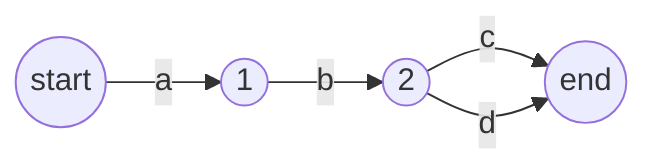
```mermaid
graph LR
start((start))--a--> 1((1))
1((1))--b-->2((2))
2((2))--c-->3((end))
2((2))--d-->3((end))
```
### 用基数树改进字典树
 我们可以通过压缩字符路径为字符串路径，即将长链压缩为一条边。
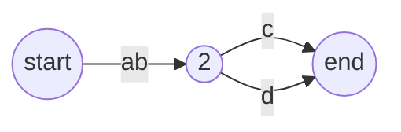
```mermaid
graph LR
start((start))--ab-->2((2))
2((2))--c-->3((end))
2((2))--d-->3((end))
```

 当然你甚至还能这样
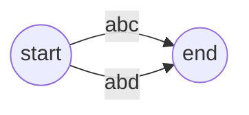
```mermaid
graph LR
start((start))--abc-->3((end))
start((start))--abd-->3((end))
```

 这些都是合法的基数树。注意，基数树仍然是字典树，只不过他压缩了路径


### 用基数树加速IP路由检索
 路由检索常常是检索一个01字符串，这时候我们可以通过压缩的方式，每两位压缩、或者三位、四位压缩，能够让查找次数更少，当然这样做可能会牺牲空间，但是他依然是基数树优化的字典树。


# test

## 软件测试-白盒测试


### 题目1


#### 流程图


#### 判定覆盖
 需要三条路径
##### 第一组：
- (x,y,z) = (4,0,9)
- (x,y,z) = (4,0,0)
- (x,y,z) = (2,0,0)

##### 第二组：
- (x,y,z) = (4,0,9)
- (x,y,z) = (4,0,0)
- (x,y,z) = (1,0,0)

#### 条件组合覆盖
| 第一个判断 | 第二个判断 |
| ---------- | ---------- |
| x>3 z<10   | x==4 y>5   |
| x<=3 z<10  | x!=4 y>5   |
| x>3 z>=10  | x==4 y<=5  |
| x<=3 z>=10 | x!=4 y<=5  |
 所以4个组合
- (x,y,z)=(4,6,9)
- (x,y,z)=(3,6,9)
- (x,y,z)=(4,5,10)
- (x,y,z)=(3,5,10)


#### 流程图


#### 点覆盖
0,1,2,3,4,5,6
0,1,2,3,4,8,4
0,1,2,7,2,3,4,5,7
0,1,2,7,2,3,4,8,4,5,6
7,2,7
8,4,8

#### 边覆盖
(0,1),(1,2),(2,3),(3,4),(4,5),(5,6),(2,7),(7,2),(4,8),(8,2)

#### 边对覆盖
(0,1,2),(1,2,3),(1,2,7),(2,3,4),(2,7,2),(3,4,5),(3,4,8),(4,5,6),(4,8,4)

#### 主路径覆盖
0，1，2，3，4，5，6


# Vim

## vim入门教程


### vim
 vim是一款强大的文本编辑器,如果配置到位，真的真的非常漂亮，如下图violet主题的浅色和深色


 还有经典的molokai配色主题
 还有c++高亮配色

 c++补全

 多行编辑


### 笔者的vim经历
 先后尝试vim，笔者已经度过了两年，学到了很多，却也很少，

### vim安装
 以前笔者使用过linux下的vim，现在正使用的mac下的vim，这里只讲mac如何安装vim，mac本身自带vim,当然mac也可以使用指令
```bash
brew install vim
```

### vim基本配置
 vim是需要简单配置一下的，对于没有配置的vim而言，会很难受，下面我先发一下我的vim配置
```
set et "tab用空格替换

set tabstop=2
set expandtab
" Tab键的宽度

set softtabstop=2
set shiftwidth=2
"  统一缩进为2

set number
" 显示行号

set history=10000
" 历史纪录数

set hlsearch
set incsearch
" 搜索逐字符高亮

set encoding=utf-8
set fileencodings=utf-8,ucs-bom,shift-jis,gb18030,gbk,gb2312,cp936,utf-16,big5,euc-jp,latin1
" 编码设置

" set mouse=a
" use mouse

set langmenu=zn_CN.UTF-8
set helplang=cn
" 语言设置

set laststatus=2
" 总是显示状态行 就是那些显示 --insert-- 的怪东西

set showcmd
" 在状态行显示目前所执行的命令，未完成的指令片段亦会显示出来

set scrolloff=3
" 光标移动到buffer的顶部和底部时保持3行距离

set showmatch
" 高亮显示对应的括号

set matchtime=1
" 对应括号高亮的时间（单位是十分之一秒）
```

### vim的插件
 这里推荐vundle，安装vundle后，我们的配置前面就多了一些东西
<summary>代码</summary>
```
" Vundle set nocompatible
filetype off
set rtp+=~/.vim/bundle/Vundle.vim
call vundle#begin()
Plugin 'VundleVim/Vundle.vim'
Plugin 'The-NERD-Tree'
Plugin 'gdbmgr'
Plugin 'mbbill/undotree'
Plugin 'majutsushi/tagbar'
Plugin 'vim-airline/vim-airline' " 状态栏
Plugin 'vim-airline/vim-airline-themes' "状态栏
Plugin 'cohlin/vim-colorschemes' " 主题
Plugin 'tomasr/molokai' " molokai
Plugin 'jiangmiao/auto-pairs' " 括号补全
Plugin 'plasticboy/vim-markdown'
Plugin 'iamcco/mathjax-support-for-mkdp' " 数学公式
Plugin 'iamcco/markdown-preview.vim' " markdown预览
Plugin 'Valloric/YouCompleteMe'
Plugin 'zxqfl/tabnine-vim'
Plugin 'w0rp/ale' " 语法纠错
Plugin 'octol/vim-cpp-enhanced-highlight' " c++语法高亮
Plugin 'Shougo/echodoc.vim' " c++函数提示
Plugin 'Chiel92/vim-autoformat' " c++代码格式化
Plugin 'scrooloose/nerdcommenter' " c++代码注释
Plugin 'ashfinal/vim-colors-violet' " 配色
Plugin 'terryma/vim-multiple-cursors' " vim 多行编辑
Plugin 'mhinz/vim-startify'
call vundle#end()
filetype plugin indent on
```
 这里的Plugin "..."指的是使用啥啥啥插件的意思。

### vim基础操作
 下面我们进入到最核心的地方，vim的快捷操作
#### vim 基本移动操作
##### 基本跳转
 jkhl分别对应了上下左右
##### 字符串跳转
 b是向前跳转一个单词，w是向后跳转一个单词
##### 行内跳转
 $跳转到行末,A跳转到行末并输入,0跳转到行首,^跳转到行首非空字符,I跳转到行首非空字符并输入
 f+a跳转到后面的第一个a, F+a跳转到前面第一个a
##### 行间跳转
 gg到首行，G到尾行, :100到100行
 H到屏幕顶，M到屏幕中，L到屏幕底
##### 屏幕跳转
 zz把当前行变为屏幕正中间。
 <C-y>向上移动一行，<C-e>向下移动一行
 <C-b>向上整个屏幕, <C-f>向下整个屏幕
##### 文件跳转
 :bn到缓冲区下一个文件，bp到前一个
 :A .c与.h文件跳转
 :IH 到光标指向文件

#### vim 多行操作
用插件会卡，这里我们可以<C-v>, 移动,I,写,ESC 
指令10,20s/^/#/g


##### vim 高质量跳转
 % 跳转括号


#### vim 高质量组合操作
 c<space> 删除当前字符并插入
 caw  change a word删除当前单词并插入 
```
one
two
three
four
```
渴望变成
```
one,two,three,four
```
先定位到one的o，然后<C-v> 进入列选择，3j将列选择光标移动到four的f,$将光标移动到尾部，A进入插入模式，,添加逗号，Esc作用与所有列，V进入块选择，3j定位到four,J将行合并，结束了。


# 实习

## 字节一面

- 自我介绍
- c++的多态
 虚函数，用基类的指针可以访问到对象的相应函数
- 你这是运行期多态，编译期多态呢？
 不知道了(嗝屁)
- c++内存布局呢
 堆和栈(嗝屁)
- c++map怎么实现的
 红黑树
- c++map线程安全吗
 不安全
- 怎么改进c++map，让他线程安全
 为整个数据结构加一把大锁，或者为内部节点加锁
- 开始谈TCP
 拥塞控制、流控制，滑动窗口，TCP慢启动，可靠传输，
 用UDP建立TCP 项目的细节: 封包: 头+数据+校验和， 如何启动: 收到一个ack发出去两个包，如何拥塞控制：和式增加积式减少，如何流控制： 接收端反馈缓冲区大小，如何ack：前缀ack，或者前缀ack附加当前包序列，如何判断丢包: 3次ack等等
- 线程和进程的区别
 线程是进程的一部分，共享进程的资源，进程独享资源
- 资源是什么
 内存寄存器等
- 进程通信
 信号量互斥量，管道，消息队列，socket
- 进程的信号量怎么实现
 只会线程的信号量，原子操作(嗝屁)
- 写题,二维01数组，1表示岛屿，0表示海洋，问最大岛屿的面积
 并查集，或者targin算法，让我用并查集写。

### 补题
- 编译器多态是模版和重载
- 内存布局 内核空间、栈、内存映射、堆、数据区、代码区
- 信号量在共享内存中，这片区域大家都看的到，所以就能拿到信号量的值了。


## 阿里一面


### 问题
- 自我介绍
- hash_map的hashcode 和equal
 hashcode是对对象的加密,是equal的必要条件，equal是判断对象是否相等的充要条件
- hashcode不同但equal相同导致什么后果。
 map的contain函数出错
- hash碰撞怎么办
 hash就是数组，线性探测，二次探测，数组的每个元素是链表,链表过长进化为红黑树
- 有人在代码中写了hashcode为返回常数会怎样
 所有元素发生碰撞，hash_map退化为红黑树，O1变O(lgn)
- hash_map线程不安全怎么办
 hash_table为整个数据结构加锁,current_hash_map加分段锁
- current_hash_map 的size函数是否返回正确结果
 不一定返回正确结果
- java锁
 synchronized
- 乐观锁和悲观锁
 悲观锁就是使用互斥量的那一类锁，乐观锁就是使用版本号
- 乐观锁版本号如何解决ABA问题
 A1B2A3, A还是那个A，但是版本不同了
- violate作用
 禁止指令重排，JVM保证load和read的有序，violate保证读取的时候和内存同步
- violate有原子性吗
 没有
- 可重用锁知道吗
 不知道(嗝屁)
- java Automic了解吗
 没有(嗝屁)
- 线程死锁的条件
 互斥、不可抢占、占有与等待、环路等待
- 如何解决死锁
 破坏死锁的条件之一，忽略死锁，检测并释放死锁
- 如何检测死锁
 转化为图论，本质是又向图判环，tarjan算法，spfa算法，普通dfs
- TCP三次招手和四次挥手
 (慢慢讲...)
- TCP慢启动
 收到一个包后发送两个包
- 网络拥塞控制
 和式增加积式减少
- TCP和UDP的区别
 TCP面向连接，可靠传输，UDP不可靠,会丢失延时重复乱序损坏
- UDP的作用
 电话和电视
- QQ为什么用不可靠的UDP
 UDP即使不可靠，但是我们可以通过ack机制让其可靠起来。
- HTTP1.1/2.0的区别
 头部压缩，多路复用，服务器推送(嗝屁)
- 头部压缩的算法
 (嗝屁)
- HTTP2.0的队头阻塞怎么处理的
(嗝屁)
- HTTPS的四次招手
 (慢慢讲...)
- HTTPS如何处理假冒服务器的人
 CA证书+签名+日期
- mysql数据库innodb索引
 B+树
- B+树和B树的区别，B+树的优点
 叶子结点的双向环状链表
- mysql有个联合索引(A,B,C),查询A=1,B&gt;2,C&lt;3能用索引吗?
 (A,B)可以用，但是C不行，理论上C可行，因为C虽然全局无序，但是局部有序，然而mysql不支持，

### 补题
- 可重用锁就是递归锁
- java Automic是一个原子类
- HTTP2.0的特性还有二进制分帧、请求优先级
- 头部压缩的算法是HPACK算法
- 队头阻塞是http1.0的缺陷，可以使用流水线解决

## 腾讯一面

### 感想
 面试官的问题太开放了，我还是太菜了

### 问题
- 讲一下你的产学研项目
- 来个题： 一个矩阵，从左上角向右下角走，只能向右或者向下，问经过的点的权值和最少是多少
 dp
- 去掉向右或者向下走的限制呢,每个点只能走一次
 dijkstra,每个点向四周连边就可以了，如果有负数的话需要拆点(这里我说的其实是错的,有负数的情况下应该使用bellman算法或者spfa算法)
- 讲一下mysql
- 再来个题： 一个表[学号,科目,成绩] , 想得到这样的表[学号,语文成绩,数学成绩,英语成绩]怎么写
- 讲一下spring

```sql
create table score ( stu_no int, cname int, mark int);
insert into score values(1,-1,99) ;
insert into score values(1,-2,98) ;
insert into score values(1,-3,97) ;
insert into score values(2,-1,96) ;
insert into score values(2,-2,95) ;
insert into score values(2,-3,94) ;
```

```sql
select distinct a.stu_no, b.mark,c.mark,d.mark
from 
  score as a
  inner join score as b 
  on a.stu_no = b.stu_no and b.cname = '-1'
  inner join score as c
  on a.stu_no = c.stu_no and c.cname = '-2'
  inner join score as d
  on a.stu_no = d.stu_no and d.cname = '-3'
```

## 腾讯二面

### 二面
 面试官让我自我介绍，然后就开始做题了，问我哪方面比较强，我说都还好行,然后面试官给了我一个大数据的题目
 我还以为说的是算法题呢(我当时应该说图论、字符串、dp)
- 一个20亿行的数据，第一列是qq号，第二列是手机号，问哪些手机号对应了多个qq号
 我没看清到20亿的数据，直接说了一个字典树，然后就被提醒了，然后我就开始想把手机号分成4+7位，按照前4位分成1000组，每组分别是独立的，然后合并答案，面试官问还有没有其他做法，我说可以利用归并排序的思路，将数据随机分成1000组，然后对电话号码排序，最后用堆归并
 正解应该是mapreduce分发任务然后合并
- 第二题是mysql,给你一个每天的签到表[name,day,sign]你要输出每个员工的到今天的连续签到天数
- 第三题是写LRU算法，
 用链表+map就可以实现，
- 如果是高并发的LRU呢
 map改为分段锁


## 阿里二面


### 问题
- 自我介绍
- c++和java各说3个优点
 c++ 高效、模版元的图灵完全性、多继承
 java 跨平台、更强的面向对象、更多的框架、社区
<!--more-->
- java什么时候把代码变成native方法
 把热点循环和热点函数变为natine方法
- native方法和c++的效率有区别吗
 没区别，都是机器码
- 讲spring的特点
 IOC控制反转和AOP面向切面编程
- 设计模式有23种，但是他们有一些设计原则，讲一下IOC用到了哪个
 工厂模式？（不对，是依赖反转)
- 讲一下设计模式的原则
 里氏替换、开闭原则、迪米特原则(掉了依赖反转、单一职责、接口隔离、合成复用)
- 滑动窗口
 讲了个拥塞控制，正准备说流控制，面试官说拥塞是整个网络的状态，而窗口控制的是端到端，IP控制点到点，TCP控制端到端
 感觉说的挺对的，我是这样理解的，滑动窗口确实无法直接控制整个网络的拥塞，网络的拥塞是网络上所有的滑动窗口共同控制的,
- 路由器、交换机、hub的区别
 没答上来，
- 讲TCP的优点
 我准备从不可靠传输开始讲起，开始说不可靠传输的错误： 包丢失、损坏、重复、乱序、延时，然后面试官开始强调乱序不是错误，他说你点了两个快递，先点的后到，算错误吗？
 我说不算，我就开始想错误这个词语该哪什么来替换，最后还是没想到，(应该说不可靠传输的现象)
- 来和我说几句英语
 ... 瞬间想到了good evening，但我感觉说这话不太好，太low了，然后就全程没说话。


## 腾讯三面


### 前言
 面试官说你这是三面了吧，一面二面有没有跟你讲过部门相关的事情
 第一次半个小时结束面试，挺突然的。

### 问题
- 自我介绍 
- STL源码读过吗
 读过
- Boost源码读过吗
 只读了any
<!--more-->
- Java堆和栈分别存了哪些东西
 理论上堆存对象，但是jvm会优化，将一些对象拆分为基本数据类型放到栈中,栈存局部变量表
- Java垃圾回收器
 分为针对老生代的和新生代的，有并行的并发的串行的，标记整理，标记清除，复制的，还有个G1，
- 讲一下标记整理、标记清除、复制
- Java锁了解吗
 synchronized和lock
- Java有哪些锁
 偏向锁，CAS，自旋锁，管道实现的重量级锁，逐步升级
- sql怎么样
 能写，但不熟练
- 线程和进程的区别
 线程是调度的基本单位，进程是资源分配的基本单位
- 做题 比较版本号 1.01 = 1.1， 1.2.1 > 1.1.2,  7.2.0 = 7.2
- 考研吗
- 最开心的事情
- 你的优点
- 你的缺点


## 腾讯hr面


- 自我介绍
- 武汉解封没
- 最自豪的事情
- 为什么要实习
- 能实习多久
- 最早啥时候开始实习
- 你觉得前几次面试怎么样
- 有什么想问我的

## 网易一面


 昨天腾讯offer call了，阿里还卡在二面，可我还是想进阿里，
 今天早上起的比较早，来面试，开始用的safari,卡了半天进不去，后来改为crome才进去，挺耽误面试官时间的

- 题目1 给n个矩形，你需要使用最小的矩形覆盖者n个矩形
- 题目2 算了没看懂，不知道想表达什么意思，后来听yg说可以问面试官，让他解释样例。


- C++和Java的优缺点
 C++高效、模版是编译期多态、有模版元
 Java跨平台、模版是运行期多态、有注解、有大量企业级别的框架

- Java内存回收策略
- Java分代策略
- IP通信的过程
- 两台物理机不通过路由器直连的通信呢
- docker原理
- vim如何查找
- 如果保证数据的可靠性
- 如何保证一致性
- 任务调度算法


## 网易二面


### 和面试官聊了些杂事
我的博客、常用的搜索引擎、开发环境
### 介绍你的项目
又被问到了项目问题，我没有大项目，顶多课程设计，可怜这些说不出口，趁着这学期的大课程设计，我要做一个超级大的项目，没有项目实在是太可怜了，这真是一个致命的缺点
<!-- more -->
### linux中一个helloworld的c代码编译出来运行的细节
先谈这是一个程序，被操作系统加载到内存中，谈了一下内存布局，然后谈pc寄存器，取出机器码，执行，碰到helloworld后，调用api输出，然后结束
### 其中发生了fork吗
不清楚(发生了的，shell就fork了一份)
### helloworld如何输出的
系统调用，发生中断，进入阻塞，执行输出，恢复现场
### ssl和tls
以前谈过这个东西
>客户端请求SSL连接，发送一个随机数和客户端支持的加密算法
>服务端回复加密算法，一个随机数，CA证书和签名，公钥
>客户端验证CA证书和签名，再生成一个随机数，并用公钥加密，返回给服务端
>服务端用私钥解密随机数，现在他应该知道3个随机数，用他们通过一定算法生产对称加密的密钥，然后尝试用这个给客户端发送一个消息来测试密钥

### 想去腾讯还是网易
之前的博客居然被面试官看到了，😨

其实这个问题一直没有想清楚，我也很迷惑，yg说，拿了腾讯的offer你就一定去腾讯吗，只能说去腾讯的可能性会大一些，啵啵也说去大厂可以学技术，去小厂能感受到软件开发的全流程。

## 美团一面


今天催了一下阿里，然后就挂了，这么秀吗兄弟
### 求最长回文子串
O(n)的算法 manacher、回文树
O(nlgn)的算法 字符串hash然后二分每个回文中心
O(n\*n)的算法 dp[i][j] = dp[i+1][j-1] && s[i]==s[j]、 字符串hash然后枚举子串
O(n\*n\*n) 的算法，要不写三个for循环？
<iframe src="//player.bilibili.com/player.html?aid=12611527&bvid=BV1Xx411p74G&cid=20746041&page=1" scrolling="no" border="0" frameborder="no" framespacing="0" allowfullscreen="true"> </iframe>


我手撸回文树，就不信这个邪, 我就不信我这撸了一年的回文树，面试的时候会撸不出来？

当年他lbw17张牌被阿姨秒，我wsx手撸个回文树不是问题，这个代码很nb，要是第45行改为`while(str[id]!=str[id - 1 -   (  len[tmp]  )    ]) tmp = suf_link[tmp];` ,我这个代码将绝杀，可惜换不得。

然后老老实实跟面试官解释dp的做法
<!-- more -->
```cpp
### include <iostream>
using namespace std;
              
struct pt{
    static const int N = 1e3+5;
    int trans[N][26]; // trans
    int suf_link[N]; // 回边
    int len[N]; // 长度
    int odd_root,even_root;
    int last_node;
    int tot;
    
    void init(){
        tot=0; 
        odd_root = new_node(0);
        even_root = new_node(-1);
        suf_link[odd_root] = even_root;
        last_node = odd_root;
    }
    
    
    int new_node(int input_len){
        // trans , suflink , len 
        len[++tot] = input_len;
        return tot;
    }
    
    // ababa + b
    // last : root-> a -> b -> a
    // ababa+b -> aba+b 
    
    
    void extend(const char* str,int id){
        // id = 0
        // 1 - 
        while(str[id]!=str[ id - 1 - len[last_node] ]) last_node = suf_link[last_node];
        cout<<"hello"<<endl;
        //  找到了最长回文真后缀 last_node
        if(!trans[last_node][str[id]-'a']) {
            // create
            trans[last_node][str[id]-'a'] = new_node(len[last_node]+2);
            // suf link
            int tmp = last_node;
            // babab ->  bab
            while(str[id]!=str[id - 1 -   (  len[suf_link[tmp]]  )    ]) tmp = suf_link[tmp];
            
            suf_link[ trans[last_node][str[id]-'a'] ] = tmp;
        }
        last_node = trans[last_node][str[id]-'a'];
    }
    
    int getans(){
        int ans = 0;
        for(int i=0;i<=tot;++i) ans = max(ans,len[i]);
        return ans;
    }
}my_pt;

int main() {
    string str;
    cin>>str;
    my_pt.init();
    for(int i=0;i<str.size();i++) {
        my_pt.extend(str.data(),i);
    }
    cout<<my_pt.getans()<<endl;
}
```

- Java的内存布局
- Java的堆布局
- 常量在哪个区域
- Java的gc算法
- Java的多线程创建
- Java的多线程同步
- Java的Integer
- Java的集合
- Java的HashMap
- 红黑树特性
- 七层网络
- TCP和UDP的区别
- TCP拥塞控制
- TCP三次招手
- MYSQL索引分类
- MYSQL覆盖索引


## 笔试

### 阿里笔试


#### 阿里笔试
 感觉很难受，笛卡尔树没写出来，气死了，我咋这么菜 

#### 第一题
 有n个羊圈，第i个羊圈初始有a[i]个羊，每天早上每个羊圈会增加k的羊，每天晚上主人会选出羊圈中羊最多的那个，卖掉一半，变为$\lfloor \frac{a[i]}{2}\rfloor$个羊，问m天后剩下多少只羊。

 n,k,m,a[i]&lt;1e5 

 每天增加本质是区间加法，寻找羊最多的是区间最值查询，减半是单点修改，第一想到线段树，但是这么敲也太莽撞了，然后发现区间修改为全区间修改，考虑到可以懒惰化，即增加一个值add用来表示全区间增大的情况。区间加法的时候让add+=k即可，查询的时候是最值查询，修改的时候注意$\lfloor \frac{a[i]+add}{2}-add\rfloor$,这样用一个多重集合维护即可


#### 第二题
 给一个长度为n的数组，任意选择一个子串，问最大值的期望, n&lt;1e6
 笛卡尔树的板子题，太丢人了，没做出来，考虑建一颗笛卡尔树，那么区间最值就是树根，树形dp维护子树大小，dfs统计答案。
 代码祭天,下次一定分情况讨论，先写个暴力偏点分，不然笛卡尔树没搞好，暴力也没写太惨了。
```cpp
#### include <bits/stdc++.h>
using namespace std;

int read() {
  int x;
  scanf("%d", &x);
  return x;
}

const int N = 1e6 + 6;
int l[N], r[N], siz[N], a[N];
int n;
int s[N], top;

double dfs(int rt) {
  if (rt == 0) return 0;
  double ans = dfs(l[rt]) + dfs(r[rt]);
  siz[rt] = siz[l[rt]] + siz[r[rt]] + 1;
  double ls = siz[l[rt]] + 1;
  double rs = siz[r[rt]] + 1;
  ans += a[rt] * ls * rs / n / (n + 1) * 2;
  return ans;
}

double f2() {
  top = 0;
  s[++top] = 1;
  for (int i = 2; i <= n; i++) {
    while(top&&a[s[top]]<=a[i]) l[i]=s[top--];
    if(top) r[s[top]]=i;
    s[++top]=i;
  }
  return dfs(s[1]);
}

double f1() {
  static int mx[10005][10005];
  for (int i = 1; i <= n; i++) {
    mx[i][i] = a[i];
    for (int j = i + 1; j <= n; j++) mx[i][j] = max(mx[i][j - 1], a[j]);
  }
  double ans = 0;
  for (int i = 1; i <= n; i++) {
    for (int j = i; j <= n; j++) {
      ans += mx[i][j];
    }
  }
  return ans / n / (n + 1) * 2;
}

int main() {
  while (true) {
    n = 1e3;
    for (int i = 0; i <= n + 10; i++)
      a[i] = rand() % 10, l[i] = r[i] = siz[i] = 0;
    double ans1 = f1();
    double ans2 = f2();
    printf("%.6f %.6f\n", ans1, ans2);
    fflush(stdout);
    assert(fabs(ans1-ans2)<1e-8);
  }
  n = read();
  for (int i = 1; i <= n; i++) a[i] = read();
  printf("%.6f\n", f2());
  printf("%.6f\n", f1());
}
```

### 网易笔试


#### 第一题
输入一个n，表示n个点的完全图，输入m表示后续有m个操作，输入s表示你站在s点这个位置
接下来m行，每行两个数字x,y
 如果x=0 表示与y相连的所有边断开
 否则 表示边x-y断开
 你需要输出一个数x，表示这m个操作的前x个操作可以让s点与其他所有点断开连接
```cpp
set<int>se;
for(int i=1;i<=m;i++){
  cin>>x>>y;
  if(x==0) {
    if(y==s) return i;
    else se.insert(y);
  }else {
    if(x==s) se.inesrt(y);
    if(y==s) se.insert(x);
  }
  if(se.size()==n) return i;
}
return 0;
```
 怎么说呢，我就是这样写的，显然se.size()==n写错了，应该说n-1，跟yg讲这题的时候才想起来，我原地爆炸了，一直怀疑题目有问题，然后只过了10%，到最后都没找到bug
<!--more-->

#### 第二题
 输入一个数n表示n个人，输入一个数m表示他们搞了m次聚会,输入一个数f表示f被感染了
 他们举办聚会，如果聚会中有一个人被感染,则参加聚会的其他人都会被感染
 输入m行，每行行首一个q，表示这一次聚会有q个人参加，q后面跟着q个数，表示这q个人的编号
 你需要输出最终多少人被感染了
```cpp
for(int i=0;i<m;i++){
  cin>>q;
  vector<int> vec;
  for(int i=0;i<q;i++) {
  	cin>>x;
  	vec.push_back(x);
  	if(dead[x]) flag=true;
  }
  if(flag) for(int x:vec) dead[x]=true;
}
int ans=0;
for(bool x:dead) if(x) ans++;
cout<<ans<<endl;
```
 这代码能有问题？？？？？？只能过60%，开玩笑呢

#### 第三题
 给一个数字字符串S，一个数字m，
 你需要计算出S有多少个划分，讲他划分为S1，S2，S3，。。 且每个数都是m的倍数，答案对1e9+7取模
```java
import java.math.BigDecimal;
import java.math.BigInteger;
import java.util.Scanner;

public class Main {
    static String s;
    static BigInteger split(int l,int r){
        return new BigInteger(s.substring(l,r+1));
    }

    static int mod=(int)(1e9+7);
    public static void main(String[] args){
        Scanner cin = new Scanner(System.in);
        int T= cin.nextInt();
        for(int ii=0;ii<T;ii++) {
            int n=cin.nextInt();
            BigInteger m=cin.nextBigInteger();
            s = cin.next();
            long dp[]= new long[n+100];
            for(int i=0;i<n;i++){
                dp[i]=m.mod(split(0,i)).equals(BigInteger.ZERO)?1:0;
                for(int j=1;j<=i;j++){
                    if(split(j,i).mod(m).equals(BigInteger.ZERO)) dp[i]=(dp[i]+dp[j-1])%mod;
                }
            }
            System.out.println(dp[n-1]);
        }
    }


}
```
 java代码在这，我库鸟。这代码TLE，后来跟yg讲的时候发现split(i,j)%mod这句话可以通过字符串hash优化到O1，我真是，为什么笔试的时候没想到呢

#### 第四题
 太菜了，没看

#### 叙述题
 50G的文件，每行一个int，你需要在512MB内存的机器上求出TOP100
 这个很有意思，显然mapreduce
 先说一个常规的做法，抽象为n个int，取出TOP m
 我们每次从n个数中选出k个来，求这k个数的TOP m,使用线性时间选择算法
 这里一共执行了$$\lceil \frac{n}{k}\rceil$$次，取出了不超过$$\lceil \frac{n}{k}\rceil*m$$个数,于是合并解的时候复杂度为$$O(\lceil \frac{n}{k}\rceil*m)$$,  前面的复杂度为$$O(n)$$, 所以总时间复杂度为$$O(n+\lceil \frac{mn}{k}\rceil)$$<br>
 空间复杂度的话就是$$O(k)+O(\lceil \frac{mn}{k}\rceil)$$<br>
 我们稍微权衡一下，很容易发现时间复杂度就是$$O(n)$$,空间复杂度当k取到$$\sqrt{mn}$$的时候达到最优为$$O(\sqrt{mn})$$<br>
 然后我们来讲mapreduce的做法，我们每份分出去x台机器，map时间复杂度为$$O(n)$$,其他机器上为$$O(\frac{n}{x})$$,然后reduce，我们还有$$x*m$$个数，总共是$$O(n+\frac{n}{x}+x*m)$$

### 网易笔试第三题


给一个数字字符串S，一个数字m，
你需要计算出S有多少个划分，讲他划分为S1，S2，S3，。。 且每个数都是m的倍数，答案对1e9+7取模
例如 123456 2
可以划分为 
123456
1234|56
12|3456
12|34|56

 最近发现这题不对劲，有新想法，先上代码
```cpp
string s;
int m;
cin>>s>>m;
const int mod = 1e9+7;
int cnt=0;
int cur=0;
for(char ch:s){
   cur = (cur*10ll+ch-'0')%m;
   if(cur==0) cnt++;
}
int ans=0;
if(cur=0) ans=0;
else ans=1;
for(int i=1;i<cnt;i++) ans=(ans*2)%mod;
cout<<ans<<endl;
```

- 约定S下标从1开始到n结束，即S=S[1,n]
- 定义一个大数S的子串为S[l,r] 代表从l开始，到r结束，包含l和r， 
- 定义一个大数S的划分序列为数组$$\{k_1,k_2,...k_i\}$$, 表示S被划分为了$S[k_1,k_2-1],S[k_2,k_3-1]...$ ,显然这里有$$1=k_1\lt k_2\lt k_3...$$
- 我们不难贪心，每次都找靠左最短的序列，即在$$S[1,n]$$中找最短前缀$$S[1,k_2-1]$$,然后再到$$S[k_1,n]$$中找第二个前缀，于是我们找到了cnt个
- 于是我们可以在序列$$\{k_1,k_2,...k_i\}$$中任意取一个子序列，他们都是合法的划分，
- 假设某个划分序列$$\{t_1,t_2,...t_j\}$$不是$$\{k_1,k_2,...k_i\}$$的子序列,我们先在t中找到一个最小的$$t_u$$, 他没有出现在k中,我们考虑他左边的是$$t_{u-1}$$,我们在k中找到最大的小于$$t_u$$的数$$k_v$$
-  现在$$t_{u-1}\lt k_v\lt t_u\lt k_{v+1}$$
-  现在我们来推翻这个假设，t说$$S[t_{u-1},t_u-1]\%m=0$$,k说$$S[t_{u-1},k_v-1]\%m=0$$, 那么我们可以推出$$S[k_v,t_u-1]\%m=0$$,这个结论显然不成立，因为$$k_{v+1}\ne t_u$$

### 美团笔试


2020/4/16美团笔试
不多说，美团的题真的出的好，尽管我没有做完，但是体验挺好的。
#### 第一题
n个人，每个人m个科目，只要一个人某科是最高分或者最高分之一，我们就要为他颁奖，每个人最多颁奖一次，问最需要多少次颁奖
统计最值就ok了
#### 第二题
输入a,b,x,m, 你讲进行不断的迭代x = (a*x+b)%m, 问x的循环节是多少， m&lt;1e5
暴力枚举2*m轮，枚举的时候
<!-- more -->
```cpp
for(int i=0;i<2*m;i++){
  x = (a*x+b)%m;
  pre[x]=i;
}
cout<<2*m-pre[(a*x+b)%m]<<endl;
```
#### 第三题
有一个长度为n的数组，将他们两两组合为数对，会得到$n^2$个数对，数对比大小的时候先比较第一个值，如果第一个值相同，则按照第二个值排序，问排名第k的数对是哪一个

我二分答案的，先二分第一个值，然后二分第二个值,千万注意存在数值相同的情况, 我们考虑数对(x,y)的最大排名，显然我们用upper_bound找到x和y的位置，然后lower_boundx的位置，然后就能根据这三个值算出(x,y)的排名了 
#### 第四题
伪中位数， 我们定义排名为$\lfloor\frac{n+1}{2}\rfloor$的数为伪中位数，给你一个数组a[]和一个数k,问你至少在a中添加多少个数一个k成了a[]的伪中位数，我们统计小于k的数x个，大于k的数y个，然后执行下面的程序，去模拟这个过程，不知道为啥，我这题没有通过，卡在了56%的位置,挺遗憾的,就差一点点就AK了
```cpp
x // 小于k的数的个数
y // 大于k的数的个数
n // 数组长度
int f(int x,int y,int n){
  while(x+y<n-1){
    if(x<y) x++;
    else y++;
  }
  int ans = 0;
  while(true){
    if(x==y)break;
    if(x==y-1)break;
    if(x<y) x++;
    else y++;
    ans++;
  }
  cout<<ans<<endl;
}
```
#### 第五题
输入串S和T，在S中选一个子序列s，在T中选一个子串t，问有多少个选法，使得s=t，答案对1e9+7取模
设dp[i][j]为S[0:i], T[0:j] 且必须选T的结尾的字符的情况下的方案数量， 那么
```cpp
dp[i][j] = S[0:i] 中S[?]==T[j]的个数 再加上下面的
dp[i][j] += dp[k-1][j-1] 当且仅当k<=i且S[k]==T[j]
```
现在我们就可以写出一个$n^3$复杂度的算法了

考虑优化它，设Sum[i][j] 为 dp[k-1][j-1] 在k&lt;=i且S[k]==T[j]的和， 然后推导
```cpp
Sum[i][j] = Sum[i-1][j] 
当S[i]==R[j]的时候 Sum[i][j] = Sun[i-1][j] + dp[i-1][j-1]
```
现在我们得到了双线dp，这两个dp互相向后推导，最终得出答案,复杂度$n^2$

#### 2020/4/19更新
感谢指正，我想复杂了，我还是太菜了


#### 2020/4/17更新
一觉醒来挺多人找我要代码的，由于笔试的代码没有复制，所以我就重新敲一遍
##### 第二题
```cpp
#### include <iostream>
using namespace std;

const int N=1e5+5;
int pre[N];

int main(){
  long long a,b,x,m;
  cin>>a>>b>>x>>m;
  for(int i=0;i<3*m;i++){
    cout<<x<<" ";
    x = (a*x+b)%m;
    pre[x]=i;
  }
  cout<<endl;
  cout<<3*m-pre[(a*x+b)%m]<<endl;
}
```
##### 第三题
```cpp
#### include <iostream>
#### include <vector>
using namespace std;

typedef long long ll;

vector<ll> vec;
ll n,k;

ll maxrank(ll x,ll y){
  ll idx1 = lower_bound(vec.begin(),vec.end(),x)-vec.begin(); // vec[idx1] = x    idx1是最小的
  ll idx2 = upper_bound(vec.begin(),vec.end(),x)-vec.begin()-1; // vec[idx2] = x  idx2是最大的
  ll idy2 = upper_bound(vec.begin(),vec.end(),y)-vec.begin()-1;
  return (idx1-1-0+1)*n+(idx2-idx1+1)*(idy2-0+1);
  // 左边是第一个值小于自己的数的个数
  // 右边是第一个值等于自己的的数的个数
}

ll getidx(){
  ll l=0,r=n-1;
  while(l<r){
    ll mid = (l+r)/2;
    if(maxrank(vec[mid],vec[n-1])<k) l=mid+1;
    else r=mid;
  }
  return l;
}
ll getidy(ll idx){
  ll l=0,r=n-1;
  while(l<r){
    ll mid = (l+r)/2;
    if(maxrank(vec[idx],vec[mid])<k) l=mid+1;
    else r=mid;
  }
  return l;
}


int main(){
  cin>>n>>k;
  for(ll i=0;i<n;i++) {
    ll x;
    cin>>x;
    vec.push_back(x);
  }
  sort(vec.begin(),vec.end());
  for(ll i=0;i<n*n;i++){
    k = i+1;
    ll idx=getidx();
    ll idy=getidy(idx);
    cout<<vec[idx]<<" "<<vec[idy]<<endl;
  }
}
```
##### 第五题
```cpp
#### include <iostream>
using namespace std;

const int N=5555;
const int mod = 1e9+7;
int dp[N][N];
int sum[N][N];
int size[N][26];
string s,t;
int n,m;

// aaa
// aaa
// a 3*3 = 9
// aa 3*2 = 6
// aaa 1
// ans = 16

int main(){
  cin>>s>>t;
  int n = s.size();
  int m = t.size();

  for(int i=0;i<n;i++){
    for(int j=0;j<m;j++){
      sum[i][j] = 0;
      if(i>0) sum[i][j] += sum[i-1][j];
      if(i>0&&j>0&&s[i]==t[j]) sum[i][j] += dp[i-1][j-1];
      sum[i][j] %= mod;
    }

    for(int j=0;j<26;j++) {
      if(i>0) size[i][j] = size[i-1][j];
    }
    size[i][s[i]-'a']++;

    for(int j=0;j<m;j++){
      dp[i][j] = size[i][t[j]-'a'] + sum[i][j];
      dp[i][j] %= mod;
    }
  }

  int ans = 0;
  for(int j=0;j<m;j++) ans = (ans+dp[n-1][j])%mod;
  cout<<ans<<endl;
}
```

# HTTPS深入浅出


## HTTP介绍

> 读者不要认为HTTP负责数据传输，它实际上负责数据请求和响应，真正的数据传输由其他网络层处理

>Web 确切地说是一种信息索取方式，是互联网的某个子应用 。Web 最核 心的 组成部分是 HTTP,HTTP 由服务器和客户端组成，有了 HTTP ，互联网上的不同终端才能够交换信息。

### HTTP 请求和响应结构

> 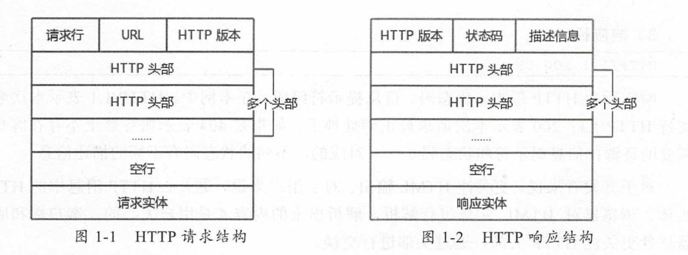

### HTTP协议不安全的根本原因

- 数据没有加密
- 无法互相验证身份
- 数据容易被篡改


### XSS攻击

恶意用户写入了一段恶意代码到论坛，其他人只要看到了他的论坛，就会执行恶意脚本。

### W3C

>Tim Berners -Lee 教授提出 Web 技术后成立了 W3C 组织，W3C 主要制定 Web 技术的标准，比如 HTML 标准、DOM 标准、css 标准、ECMA Script 标准

>W3C 主要以HTTP 头部的方式提供安全保护，比如Access - Control - Allow-Origin 、X-XSS -Protection 、Strict-Transport-Security 、Content-Security-PolicyHTTP 头部，一 旦开发者和浏览器正确地遵守安全标准，就能缓解安全问题。


## 密码学

- 密码学是科学
- 密码学理论是公开的
- 密码学算法是相对安全的
- 密码学攻击方法是多样化的
- 密码学应用标准很重要

>在使用密码学算法的时候也不要画蛇添足 ， 一个简单的软件为了保障安全性可能使用一 种密码学算法即可，没有必要组合多种密码学算法 。

### OpenSSL

https://www.openssl.org/


### 密码学中的随机数

块密码算法CTR模式

摘要算法

[流密码算法](#流密码算法)

### HASH算法

Hash算法的一个用途是解决数据的完整性问题

#### Hash算法的拓展

密码学中的Hash算法是一个非常重要的加密基元，密码学中的摘要、散列、指纹都是Hash算法

> 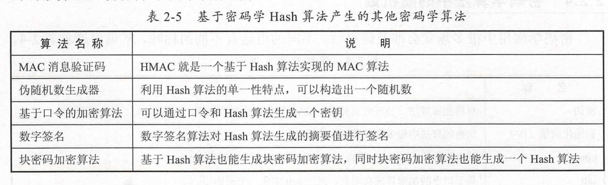


#### Hash算法的用途

文本比较： 例如两个文件的MD5值比较

身份验证： 在数据库中储存密码Hash而不是明文, <span style='color:red'>这个做法不安全</span>


#### Hash算法的类型

MD5： MD5是不安全的算法，违反了抗碰撞性

SHA： SHA-1是不安全的，SHA-2推荐使用，SHA-3不是为了取代SHA-2而是在设计上和SHA-2完全不同


### 对称加密

对称加密算法可以用来解决数据的窃听问题

用同一个密钥可以对明文进行加密，可以对密文进行解密，有两种类型： 块密码算法和流密码算法

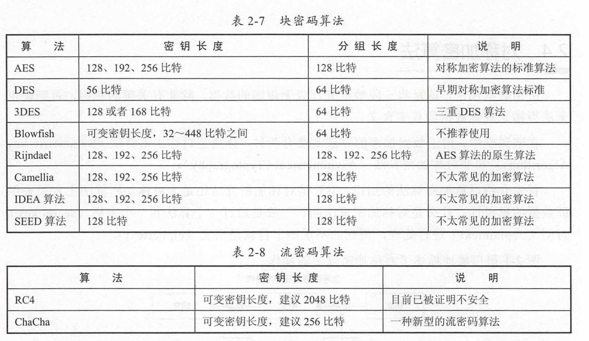

#### 流密码算法

##### 一次性密码本

密码本长度和明文一样长，他们异或起来就是密文，把密文和密码本异或可以得到明文

##### RC4算法

RC4的密码流来着随机数流，随机数种子就是密钥， so easy， <span style='color:red'> RC4算法被证明不安全！</span>


#### 块密码算法

即将明文分块，对于无法分出的整数块进行填充，下面介绍模式，<span style="color:red">任何一种对称加密算法都可以与下面的模式相组合。</span>

##### ECB模式(Eletronic Codebook)

对每一个块分别做加密，然后进行传输，这个过程可以并行处理，由于固定的明文块会得到固定的密文块，所以ECB模式是<span style='color:red'>不安全</span>的

##### CBC模式(Cipher Block Chaining)

引入初始化向量，在加密前对第一个块进行混淆，用加密结果对下一个块进行混淆,初始化向量是一个随机数

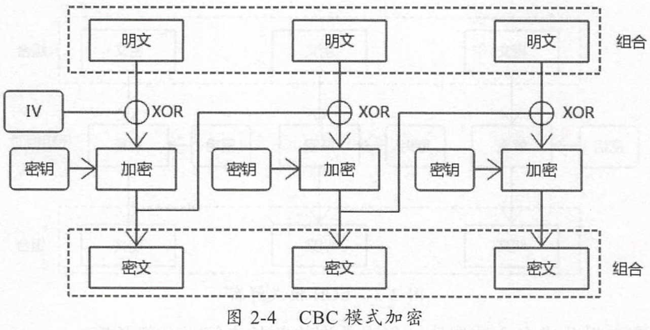

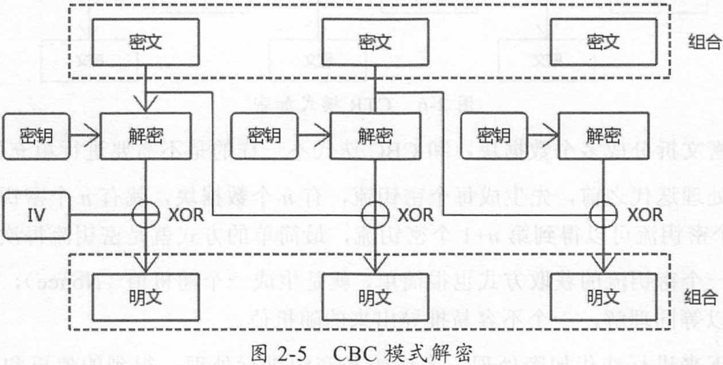


##### CTR模式(Counter)

CTR模式不需要填充，因为他对每一个块进行了流密码算法，有多少个块就有多少个密钥流，密钥流的密钥可以来源于前一个密钥流的密钥，第一个密钥流的密钥称之为Nonce，与CBC模式的IV类似

#### 填充算法

> 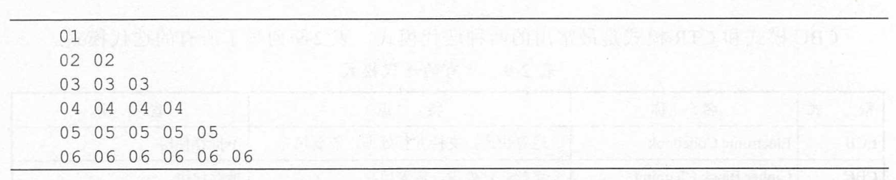

> 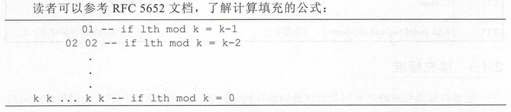

### 消息验证码

消息验证码： Message Authentication Code (MAC)

HASH算法解决了数据的完整性问题，对称加密算法解决了数据的窃听问题，但是他们都不能解决数据的篡改问题

#### 攻击者如何篡改消息？

由于攻击者的目标是篡改消息，而不是窃听和破坏消息，针对于ECB模式，它可以收集统计信息，将密文分块并篡改为以前的密文块等，然后重新HASH(HASH算法是公开的)，并篡改HASH值后转发。 

#### MAC算法

MAC算法致力于两点： 

- 证明消息没有被篡改
- 证明消息来源于正确的发送者

MAC算法： 核心原理就是在消息中携带密钥，然后使用HASH算法和加密算法，由于篡改者没有密钥，所以他无法篡改数据

MAC算法的类型： HMAC，CBC-MAC，OMAC

HMac算法流程： 注意不是hash(message//key) ， <span style="color:red">why not?</span>

> 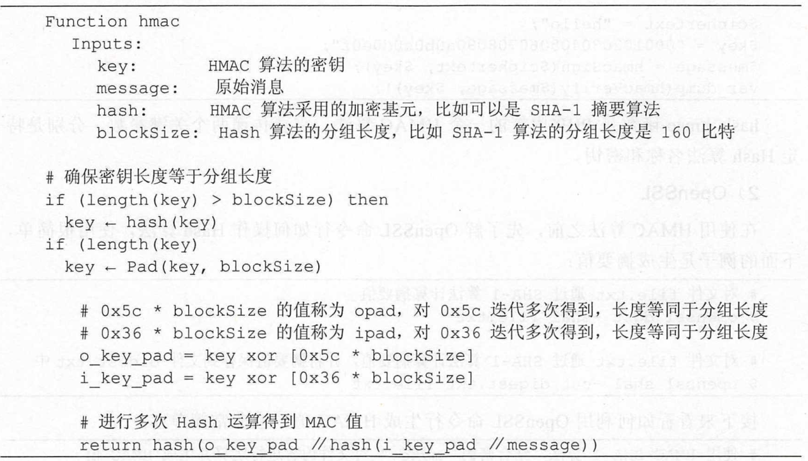

#### AE加密模式

结合对称加密算法和MAC算法又叫AE加密模式，Authenticated Encryption， 如何结合就有了多种选择

| 加密模式         | 代码                        | 备注                 |
| ---------------- | --------------------------- | -------------------- |
| MAC-and-Encrypt  | encry(message)+mac(message) | 使用不当会导致不安全 |
| MAC-then-Encrypt | encry(mac(message))         | 使用不当会导致不安全 |
| Encrypt-then-MAC | mac(encry(message))         | 建议使用             |

#### AEAD加密模式

结合对称加密算法和MAC算法如果处理不当会导致安全问题，AEAD模式(Authenticated Encryption with Associated Data)就是在底层组合了加密算法和MAC算法

##### CCM模式

CCM （Counter with CBC-MAC ）模式是一种 AEAD 模式 ， 不过在 HTTPS 中使用 得比较少 。 是AES算法的CRT模式组合了CBC-MAC算法，底层采用了MAC-then-Encrypt

##### GCM模式

>GCM ( Galois/Counter Mode ） 是目 前比较流行的 AEAD 模式 。在 GCM 内部，采用GHASH 算法（一种 MAC 算法）进行 MAC 运算，使用块密码 AES 算法 CTR 模式的 一种变种进行加密运算，在效率和性能上，GCM 都是非常不错的。


### 非对称加密

非对称加密又叫公开密钥算法，公钥加密，私钥解密

#### RSA

单步加密

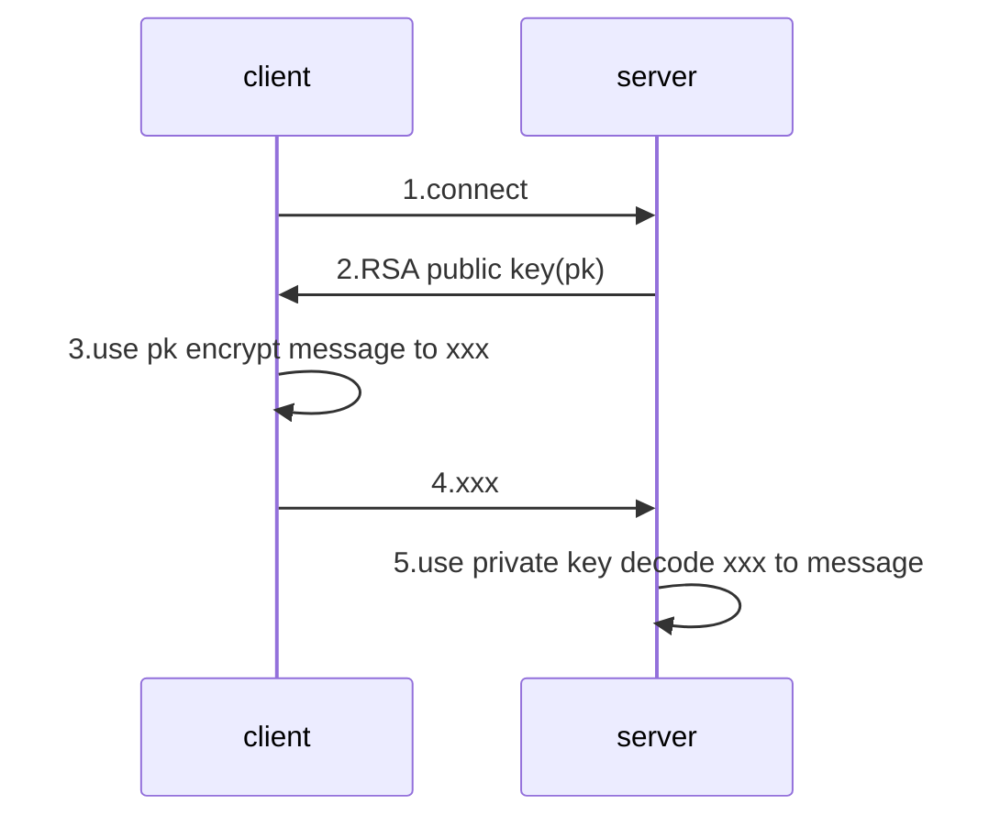
```mermaid
sequenceDiagram 
client->>server : 1.connect
server->>client : 2.RSA public key(pk)
client->>client : 3.use pk encrypt message to xxx
client->>server : 4.xxx
server->>server : 5.use private key decode xxx to message
```

双向加密

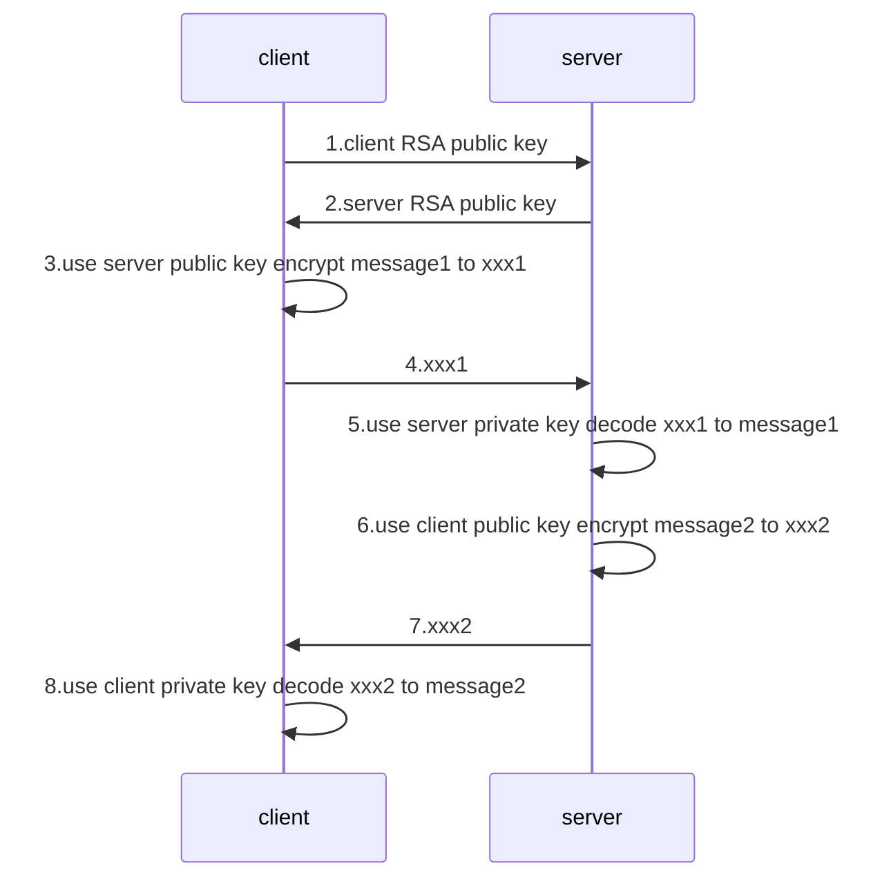
```mermaid
sequenceDiagram 
client->>server : 1.client RSA public key
server->>client : 2.server RSA public key
client->>client : 3.use server public key encrypt message1 to xxx1
client->>server : 4.xxx1
server->>server : 5.use server private key decode xxx1 to message1
server->>server : 6.use client public key encrypt message2 to xxx2
server->>client : 7.xxx2
client->>client : 8.use client private key decode xxx2 to message2
```

#### ECC

pass


### 密钥协商算法

#### RSA

缺点：

1. 会话密钥完全由client决定
2. 无法提供前向安全性

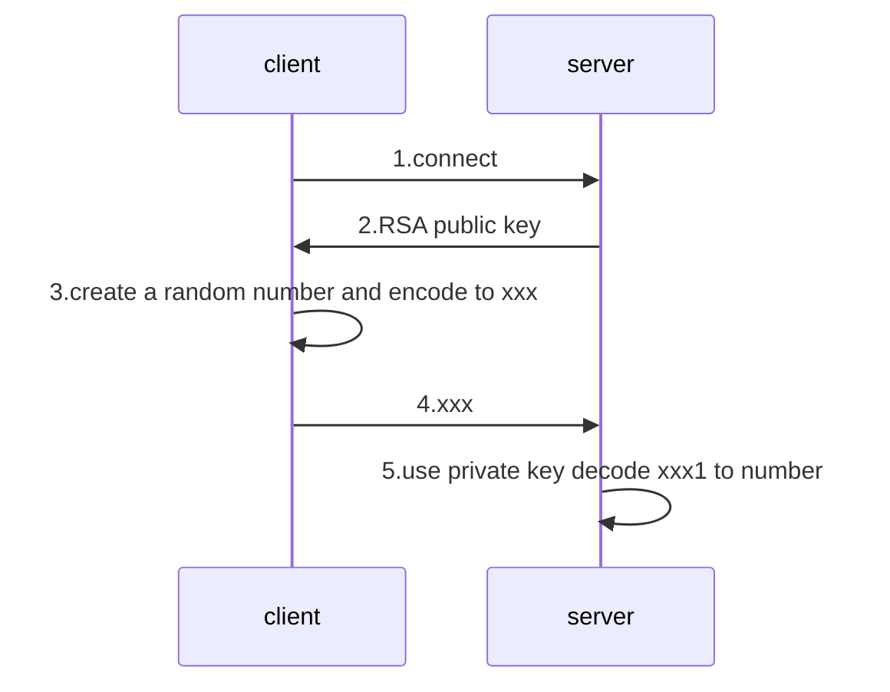
```mermaid
sequenceDiagram 
client->>server : 1.connect
server->>client : 2.RSA public key
client->>client : 3.create a random number and encode to xxx
client->>server : 4.xxx
server->>server : 5.use private key decode xxx1 to number
```


#### DH

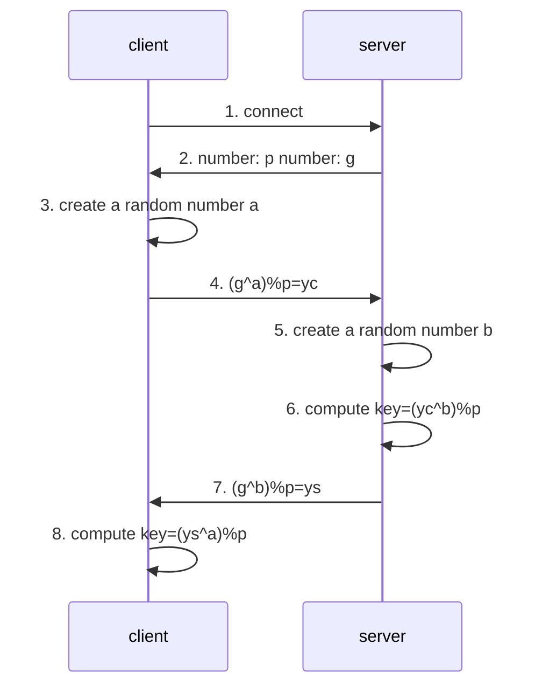
```mermaid
sequenceDiagram 
client->>server : 1. connect
server->>client : 2. number: p number: g
client->>client : 3. create a random number a
client->>server : 4. (g^a)%p=yc
server->>server : 5. create a random number b
server->>server : 6. compute key=(yc^b)%p
server->>client : 7. (g^b)%p=ys
client->>client : 8. compute key=(ys^a)%p
```

#### ECDH

ECC+DH协商密钥， pass

### 数字签名

#### RSA签名

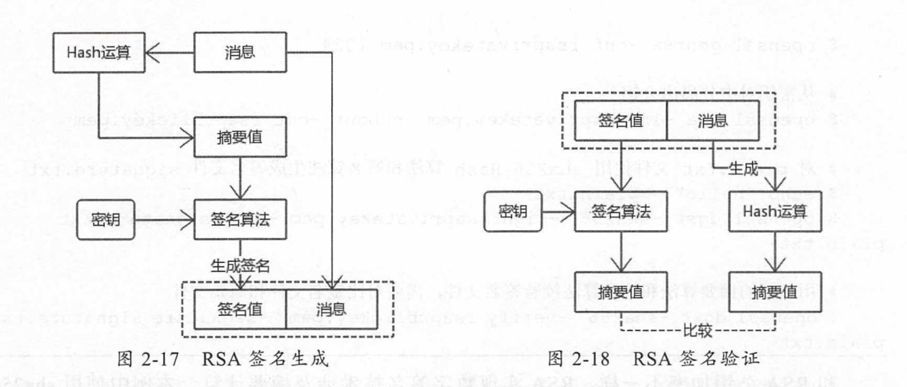


#### DSA签名

pass

#### ESDSA签名

pass

## 宏观理解TLS

### TLS/SSL背后的算法

加密算法： 对称加密后者非对称加密，保证机密性

MAC算法： 保证完整性

密钥协商算法： 传输对称加密的密钥

密钥衍生算法： 通过一个不定长度的预备主密钥转换为固定长度的主密钥，然后用主密钥转化出任意数量，任意长度的密钥块

### HTTPS总结

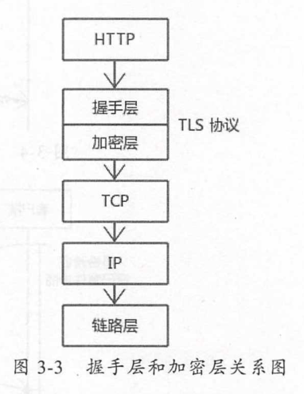

#### 握手层

客户端在进行密钥交换前，必须验证服务器身份，用CA证书来解决

在握手阶段，客户端服务器需要协商出双方都认可的密码套件，这包括了身份验证算法，密码协商算法，加密算法加密模式，HMAC算法的加密基元，PRF算法的加密基元

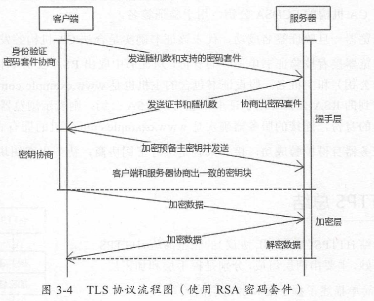

#### 加密层

流密码加密： RC4（MAC-then-Encrypt）

分组加密模式： AES-128-CBC（AES算法，密钥128比特，CBC分组）

AEAD：


# 30天自制操作系统


## 第0天

## 第1天 从计算机结构到汇编程序入门

### 二进制编辑器

[Bz162](https://github.com/YoungWilliamZ/30dayToMakeAnOS/tree/master/Day1)

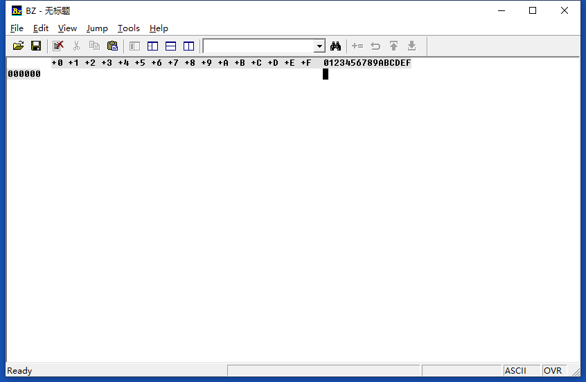


### QEMU

[官网](https://www.qemu.org/download/#windows)

[git](git clone git://git.qemu-project.org/qemu.git)

```sh
wget https://download.qemu.org/qemu-3.0.0.tar.xz
tar xvJf qemu-3.0.0.tar.xz
cd qemu-3.0.0
./configure
make

git clone git://git.qemu.org/qemu.git
cd qemu
git submodule init
git submodule update --recursive
./configure
make
```


## xxxx

### 概念解释

虚拟地址： 程序员看到的地址

物理地址： 硬件的内存地址

段描述符表： 多个段描述符放在一起构成的表

段描述符： 描述段的属性（基地址，段长，特权级，读写权限）

段选择子： 用于在段描述符表中定位段描述符的索引


# 设计模式（JAVA版）

 

## 第四章 结构型模式

### 代理模式

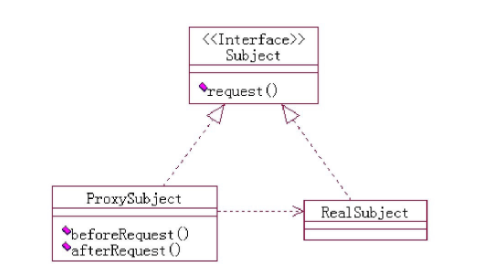


在spring中，我们常用的动态代理就是代理模式，代理模式目的是代理对象，增强其原有的功能，例如日志打印，数据库事务等


### 装饰模式

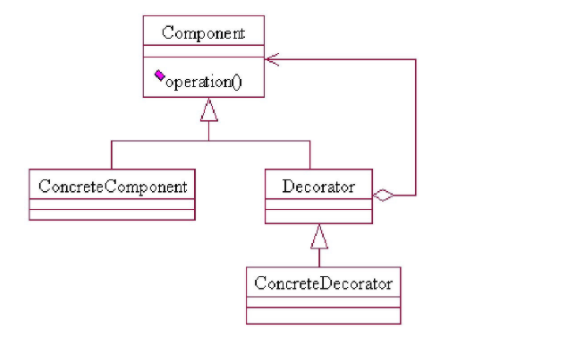

装饰模式的目的是拓展、增强原有功能，例如在Java中FilterInputStream

```java
InputStream inputStream = System.in;
DataInputStream dataInputStream = new DataInputStream(new BufferedInputStream(inputStream));
```

FilterInputStream的子类均为装饰器


#### 装饰模式和代理模式的区别

代理模式侧重于代理，增强原有函数的能力，代理模式一般为硬编码，一般就一两层

装饰模式侧重于拓展，优化原有函数的能力，可以不断装饰，一层又一层


### 适配器模式


把一个类对另一个接口进行适配，让其可以被当作另一个接口使用，在Java中我们有Callable和Runnable， 此时如果我们有一个Runnable的对象，但是后面需要把它当作Callable来使用，这时候我们查看jdk8源码中的java.util.concurrent.Executors.RunnableAdapter

```java
/**
 * A callable that runs given task and returns given result.
 */
private static final class RunnableAdapter<T> implements Callable<T> {
    private final Runnable task;
    private final T result;
    RunnableAdapter(Runnable task, T result) {
        this.task = task;
        this.result = result;
    }
    public T call() {
        task.run();
        return result;
    }
    public String toString() {
        return super.toString() + "[Wrapped task = " + task + "]";
    }
}
```

#### 适配器模式和代理模式的区别

适配器模式适配的结果不会对被适配者进行增强，只是执行接口转换，代理模式代理的结果会执行增强

#### 适配器模式和装饰模式的区别

适配器模式的目的是适配，而不是拓展，适配结果不会改变逻辑，装饰模式要拓展接口，改进接口，让其具备更多的功能

适配结果往往让对象的能力更弱，装饰的结果往往让对象能力更强


### 组合模式

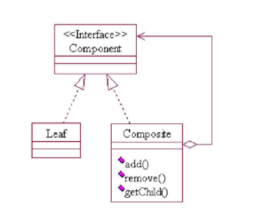


### 桥梁模式


### 外观模式


SLF4J，所有的日志将不再依赖具体的日志系统，而是依赖SLF4J日志门面


### 享元模式

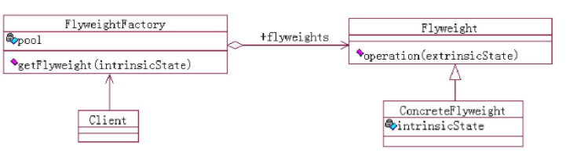

即对象重用，通过享元工厂创建对象，对象在工厂中进行池化，Integer，String等都有体现


## 第五章 行为型模式

### 模板方法模式


> 使用模板方法模式的典型场景如下。
>
> ■ 多个子类有公共方法，并且逻辑基本相同时。
>
> ■ 可以把重要的、复杂的、核心算法设计为模板方法，周边的相关细节功能则由各个子类实现。
>
> ■ 重构时，模板方法模式是一个经常使用的模式，将相同的代码抽取到父类中。

```java
// JDK8 java.util.concurrent.locks.AbstractQueuedSynchronizer
public abstract class AbstractQueuedSynchronizer
    extends AbstractOwnableSynchronizer
    implements java.io.Serializable {
    
    protected boolean tryAcquire(int arg) {
        throw new UnsupportedOperationException();
    }
    
    public final void acquire(int arg) {
        if (!tryAcquire(arg))
            acquire(null, arg, false, false, false, 0L);
    }
```


# 操作系统导论


## 第4章 进程

运行的程序就是进程，操作系统有很多关于进程的API，

> ·创建（create）：操作系统必须包含一些创建新进程的方法。在shell中键入命令或双击应用程序图标时，会调用操作系统来创建新进程，运行指定的程序。
>
> ·销毁（destroy）：由于存在创建进程的接口，因此系统还提供了一个强制销毁进程的接口。当然，很多进程会在运行完成后自行退出。但是，如果它们不退出，用户可能希望终止它们，因此停止失控进程的接口非常有用。
>
> ·等待（wait）：有时等待进程停止运行是有用的，因此经常提供某种等待接口。
>
> ·其他控制（miscellaneous control）：除了杀死或等待进程外，有时还可能有其他控制。例如，大多数操作系统提供某种方法来暂停进程（停止运行一段时间），然后恢复（继续运行）。
>
> ·状态（statu）：通常也有一些接口可以获得有关进程的状态信息，例如运行了多长时间，或者处于什么状态。


把程序和静态数据加载到内存，然后执行他就成了进程，现代操作系统将加载的过程lazily懒惰化了，需要用的时候才加载

进程有三个状态，运行、就绪、阻塞


## 第5章 进程API

fork , 复制当前的进程，父进程返回子进程pid，子进程返回0

wait，父进程等待子进程执行完毕

exec，加载某个程序到内存中运行，覆盖当前进程

>shell也是一个用户程序[插图]，它首先显示一个提示符（prompt），然后等待用户输入。你可以向它输入一个命令（一个可执行程序的名称及需要的参数），大多数情况下，shell可以在文件系统中找到这个可执行程序，调用fork()创建新进程，并调用exec()的某个变体来执行这个可执行程序，调用wait()等待该命令完成。子进程执行结束后，shell从wait()返回并再次输出一个提示符，等待用户输入下一条命令。


## 第6章 机制：受限直接执行

OS不可能说，创建了一个进程，把所有权限完全交给进程，然后把自己挂起，那坏蛋写一个死循环，我们就只能重启计算机了，OS会把CPU交给进程，但是他如何拿回来呢？

>答案很简单，许多年前构建计算机系统的许多人都发现了：时钟中断（timer interrupt）[M+63]。时钟设备可以编程为每隔几毫秒产生一次中断。产生中断时，当前正在运行的进程停止，操作系统中预先配置的中断处理程序（interrupt handler）会运行。此时，操作系统重新获得CPU的控制权，因此可以做它想做的事：停止当前进程，并启动另一个进程。

## <span style="color:red">第8章 调度：多级反馈队列</span>


> ·规则1：如果A的优先级 > B的优先级，运行A（不运行B）。
>
> ·规则2：如果A的优先级 = B的优先级，轮转运行A和B。
>
> ·规则3：工作进入系统时，放在最高优先级（最上层队列）。
>
> ·规则4：一旦工作用完了其在某一层中的时间配额（无论中间主动放弃了多少次CPU），就降低其优先级（移入低一级队列）。
>
> ·规则5：经过一段时间S，就将系统中所有工作重新加入最高优先级队列。

规则4是反馈

规则5可避免饥饿


# Typora

## 自定义配置

[参考](https://xieshaohu.wordpress.com/2019/03/09/typora%e9%85%8d%e7%bd%ae%e6%ad%a3%e6%96%87%e3%80%81%e7%9b%ae%e5%bd%95%e3%80%81%e4%be%a7%e8%be%b9%e5%a4%a7%e7%ba%b2%e4%b8%ad%e7%9a%84%e6%a0%87%e9%a2%98%e8%87%aa%e5%8a%a8%e7%bc%96%e5%8f%b7/?unapproved=453&moderation-hash=029307ad5fc7504e2f306c9a941eee2a#comment-453)

```css
/**************************************
* Header Counters in TOC
**************************************/

/* No link underlines in TOC */
.md-toc-inner {
    text-decoration: none;
    }
    
    .md-toc-content {
    counter-reset: h1toc
    }
    
    .md-toc-h1 {
    margin-left: 0;
    font-size: 1.5rem;
    counter-reset: h2toc
    }
    
    .md-toc-h2 {
    font-size: 1.1rem;
    margin-left: 2rem;
    counter-reset: h3toc
    }
    
    .md-toc-h3 {
    margin-left: 3rem;
    font-size: .9rem;
    counter-reset: h4toc
    }
    
    .md-toc-h4 {
    margin-left: 4rem;
    font-size: .85rem;
    counter-reset: h5toc
    }
    
    ADVERTISEMENT
    REPORT THIS AD
    
    .md-toc-h5 {
    margin-left: 5rem;
    font-size: .8rem;
    counter-reset: h6toc
    }
    
    .md-toc-h6 {
    margin-left: 6rem;
    font-size: .75rem;
    }
    
    .md-toc-h1:before {
    color: black;
    counter-increment: h1toc;
    content: counter(h1toc) ". "
    }
    
    .md-toc-h1 .md-toc-inner {
    margin-left: 0;
    }
    
    .md-toc-h2:before {
    color: black;
    counter-increment: h2toc;
    content: counter(h1toc) ". " counter(h2toc) ". "
    }
    
    .md-toc-h2 .md-toc-inner {
    margin-left: 0;
    }
    
    .md-toc-h3:before {
    color: black;
    counter-increment: h3toc;
    content: counter(h1toc) ". " counter(h2toc) ". " counter(h3toc) ". "
    }
    
    .md-toc-h3 .md-toc-inner {
    margin-left: 0;
    }
    
    .md-toc-h4:before {
    color: black;
    counter-increment: h4toc;
    content: counter(h1toc) ". " counter(h2toc) ". " counter(h3toc) ". " counter(h4toc) ". "
    }
    
    .md-toc-h4 .md-toc-inner {
    margin-left: 0;
    }
    
    .md-toc-h5:before {
    color: black;
    counter-increment: h5toc;
    content: counter(h1toc) ". " counter(h2toc) ". " counter(h3toc) ". " counter(h4toc) ". " counter(h5toc) ". "
    }
    
    .md-toc-h5 .md-toc-inner {
    margin-left: 0;
    }
    
    .md-toc-h6:before {
    color: black;
    counter-increment: h6toc;
    content: counter(h1toc) ". " counter(h2toc) ". " counter(h3toc) ". " counter(h4toc) ". " counter(h5toc) ". " counter(h6toc) ". "
    }
    
    .md-toc-h6 .md-toc-inner {
    margin-left: 0;
    }
    
    /**************************************
    * Header Counters in Content
    **************************************/
    
    /** initialize css counter */
    #write {
    counter-reset: h1
    }
    
    h1 {
    counter-reset: h2
    }
    
    h2 {
    counter-reset: h3
    }
    
    h3 {
    counter-reset: h4
    }
    
    h4 {
    counter-reset: h5
    }
    
    h5 {
    counter-reset: h6
    }
    
    /** put counter result into headings */
    #write h1:before {
    counter-increment: h1;
    content: counter(h1) 
    }
    /**************************************
    * Header Counters in TOC
    **************************************/
    
    /* No link underlines in TOC */
    .md-toc-inner {
    text-decoration: none;
    }
    
    .md-toc-content {
    counter-reset: h1toc
    }
    
    .md-toc-h1 {
    margin-left: 0;
    font-size: 1.5rem;
    counter-reset: h2toc
    }
    
    .md-toc-h2 {
    font-size: 1.1rem;
    margin-left: 2rem;
    counter-reset: h3toc
    }
    
    .md-toc-h3 {
    margin-left: 3rem;
    font-size: .9rem;
    counter-reset: h4toc
    }
    
    .md-toc-h4 {
    margin-left: 4rem;
    font-size: .85rem;
    counter-reset: h5toc
    }
    
    ADVERTISEMENT
    REPORT THIS AD
    
    .md-toc-h5 {
    margin-left: 5rem;
    font-size: .8rem;
    counter-reset: h6toc
    }
    
    .md-toc-h6 {
    margin-left: 6rem;
    font-size: .75rem;
    }
    
    .md-toc-h1:before {
    color: black;
    counter-increment: h1toc;
    content: counter(h1toc) ". "
    }
    
    .md-toc-h1 .md-toc-inner {
    margin-left: 0;
    }
    
    .md-toc-h2:before {
    color: black;
    counter-increment: h2toc;
    content: counter(h1toc) ". " counter(h2toc) ". "
    }
    
    .md-toc-h2 .md-toc-inner {
    margin-left: 0;
    }
    
    .md-toc-h3:before {
    color: black;
    counter-increment: h3toc;
    content: counter(h1toc) ". " counter(h2toc) ". " counter(h3toc) ". "
    }
    
    .md-toc-h3 .md-toc-inner {
    margin-left: 0;
    }
    
    .md-toc-h4:before {
    color: black;
    counter-increment: h4toc;
    content: counter(h1toc) ". " counter(h2toc) ". " counter(h3toc) ". " counter(h4toc) ". "
    }
    
    .md-toc-h4 .md-toc-inner {
    margin-left: 0;
    }
    
    .md-toc-h5:before {
    color: black;
    counter-increment: h5toc;
    content: counter(h1toc) ". " counter(h2toc) ". " counter(h3toc) ". " counter(h4toc) ". " counter(h5toc) ". "
    }
    
    .md-toc-h5 .md-toc-inner {
    margin-left: 0;
    }
    
    .md-toc-h6:before {
    color: black;
    counter-increment: h6toc;
    content: counter(h1toc) ". " counter(h2toc) ". " counter(h3toc) ". " counter(h4toc) ". " counter(h5toc) ". " counter(h6toc) ". "
    }
    
    .md-toc-h6 .md-toc-inner {
    margin-left: 0;
    }
    
    /**************************************
    * Header Counters in Content
    **************************************/
    
    /** initialize css counter */
    #write {
    counter-reset: h1
    }
    
    h1 {
    counter-reset: h2
    }
    
    h2 {
    counter-reset: h3
    }
    
    h3 {
    counter-reset: h4
    }
    
    h4 {
    counter-reset: h5
    }
    
    h5 {
    counter-reset: h6
    }
    
    /** put counter result into headings */
    #write h1:before {
    counter-increment: h1;
    content: counter(h1) ". "
    }
    
    #write h2:before {
    counter-increment: h2;
    content: counter(h1) "." counter(h2) ". "
    }
    
    #write h3:before, h3.md-focus.md-heading:before { /*override the default style for focused headings */
    counter-increment: h3;
    content: counter(h1) "." counter(h2) "." counter(h3) ". "
    }
    
    #write h4:before, h4.md-focus.md-heading:before {
    counter-increment: h4;
    content: counter(h1) "." counter(h2) "." counter(h3) "." counter(h4) ". "
    }
    
    #write h5:before, h5.md-focus.md-heading:before {
    counter-increment: h5;
    content: counter(h1) "." counter(h2) "." counter(h3) "." counter(h4) "." counter(h5) ". "
    }
    
    #write h6:before, h6.md-focus.md-heading:before {
    counter-increment: h6;
    content: counter(h1) "." counter(h2) "." counter(h3) "." counter(h4) "." counter(h5) "." counter(h6) ". "
    }
    
    /** override the default style for focused headings */
    #write>h3.md-focus:before, #write>h4.md-focus:before, #write>h5.md-focus:before, #write>h6.md-focus:before, h3.md-focus:before, h4.md-focus:before, h5.md-focus:before, h6.md-focus:before {
    color: inherit;
    border: inherit;
    border-radius: inherit;
    position: inherit;
    left: initial;
    float: none;
    top: initial;
    font-size: inherit;
    padding-left: inherit;
    padding-right: inherit;
    vertical-align: inherit;
    font-weight: inherit;
    line-height: inherit;
    }
    
    /**************************************
    * Header Counters in sidebar
    **************************************/
    .sidebar-content {
    counter-reset: h1
    }
    
    .outline-h1 {
    counter-reset: h2
    }
    
    .outline-h2 {
    counter-reset: h3
    }
    
    .outline-h3 {
    counter-reset: h4
    }
    
    .outline-h4 {
    counter-reset: h5
    }
    
    .outline-h5 {
    counter-reset: h6
    }
    
    .outline-h1>.outline-item>.outline-label:before {
    counter-increment: h1;
    content: counter(h1) ". "
    }
    
    .outline-h2>.outline-item>.outline-label:before {
    counter-increment: h2;
    content: counter(h1) "." counter(h2) ". "
    }
    
    .outline-h3>.outline-item>.outline-label:before {
    counter-increment: h3;
    content: counter(h1) "." counter(h2) "." counter(h3) ". "
    }
    
    .outline-h4>.outline-item>.outline-label:before {
    counter-increment: h4;
    content: counter(h1) "." counter(h2) "." counter(h3) "." counter(h4) ". "
    }
    
    .outline-h5>.outline-item>.outline-label:before {
    counter-increment: h5;
    content: counter(h1) "." counter(h2) "." counter(h3) "." counter(h4) "." counter(h5) ". "
    }
    
    .outline-h6>.outline-item>.outline-label:before {
    counter-increment: h6;
    content: counter(h1) "." counter(h2) "." counter(h3) "." counter(h4) "." counter(h5) "." counter(h6) ". "
    }
    
    #write h2:before {
    counter-increment: h2;
    content: counter(h1) "." counter(h2) ". "
    }
    
    #write h3:before, h3.md-focus.md-heading:before { /*override the default style for focused headings */
    counter-increment: h3;
    content: counter(h1) "." counter(h2) "." counter(h3) ". "
    }
    
    #write h4:before, h4.md-focus.md-heading:before {
    counter-increment: h4;
    content: counter(h1) "." counter(h2) "." counter(h3) "." counter(h4) ". "
    }
    
    #write h5:before, h5.md-focus.md-heading:before {
    counter-increment: h5;
    content: counter(h1) "." counter(h2) "." counter(h3) "." counter(h4) "." counter(h5) ". "
    }
    
    #write h6:before, h6.md-focus.md-heading:before {
    counter-increment: h6;
    content: counter(h1) "." counter(h2) "." counter(h3) "." counter(h4) "." counter(h5) "." counter(h6) ". "
    }
    
    /** override the default style for focused headings */
    #write>h3.md-focus:before, #write>h4.md-focus:before, #write>h5.md-focus:before, #write>h6.md-focus:before, h3.md-focus:before, h4.md-focus:before, h5.md-focus:before, h6.md-focus:before {
    color: inherit;
    border: inherit;
    border-radius: inherit;
    position: inherit;
    left: initial;
    float: none;
    top: initial;
    font-size: inherit;
    padding-left: inherit;
    padding-right: inherit;
    vertical-align: inherit;
    font-weight: inherit;
    line-height: inherit;
    }
    
    /**************************************
    * Header Counters in sidebar
    **************************************/
    .sidebar-content {
    counter-reset: h1
    }
    
    .outline-h1 {
    counter-reset: h2
    }
    
    .outline-h2 {
    counter-reset: h3
    }
    
    .outline-h3 {
    counter-reset: h4
    }
    
    .outline-h4 {
    counter-reset: h5
    }
    
    .outline-h5 {
    counter-reset: h6
    }
    
    .outline-h1>.outline-item>.outline-label:before {
    counter-increment: h1;
    content: counter(h1) ". "
    }
    
    .outline-h2>.outline-item>.outline-label:before {
    counter-increment: h2;
    content: counter(h1) "." counter(h2) ". "
    }
    
    .outline-h3>.outline-item>.outline-label:before {
    counter-increment: h3;
    content: counter(h1) "." counter(h2) "." counter(h3) ". "
    }
    
    .outline-h4>.outline-item>.outline-label:before {
    counter-increment: h4;
    content: counter(h1) "." counter(h2) "." counter(h3) "." counter(h4) ". "
    }
    
    .outline-h5>.outline-item>.outline-label:before {
    counter-increment: h5;
    content: counter(h1) "." counter(h2) "." counter(h3) "." counter(h4) "." counter(h5) ". "
    }
    
    .outline-h6>.outline-item>.outline-label:before {
    counter-increment: h6;
    content: counter(h1) "." counter(h2) "." counter(h3) "." counter(h4) "." counter(h5) "." counter(h6) ". "
    }
```


