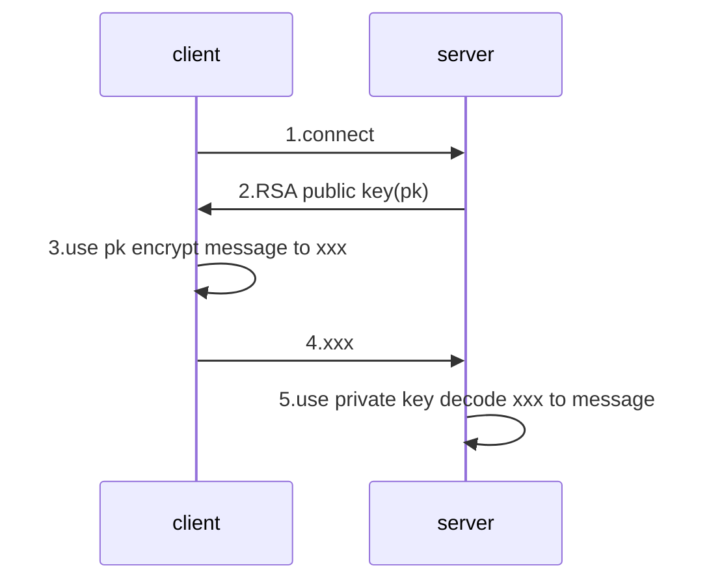
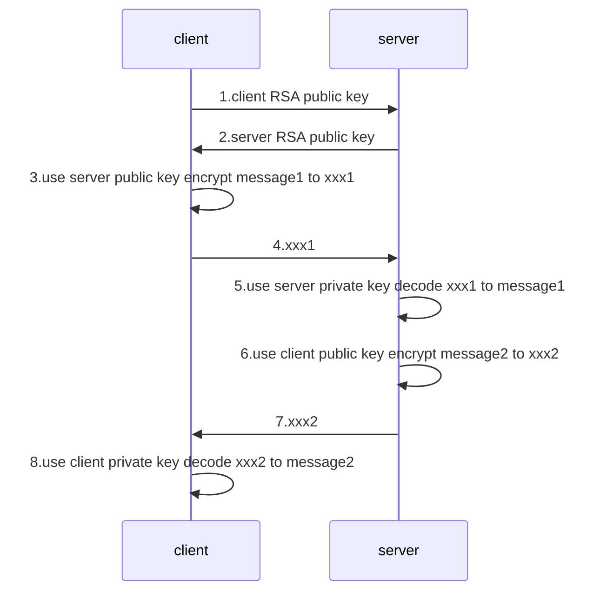
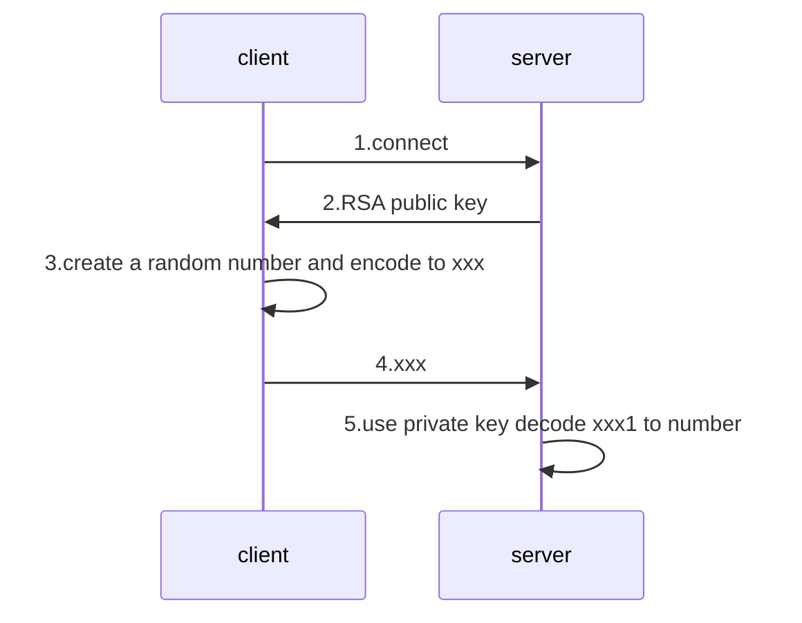
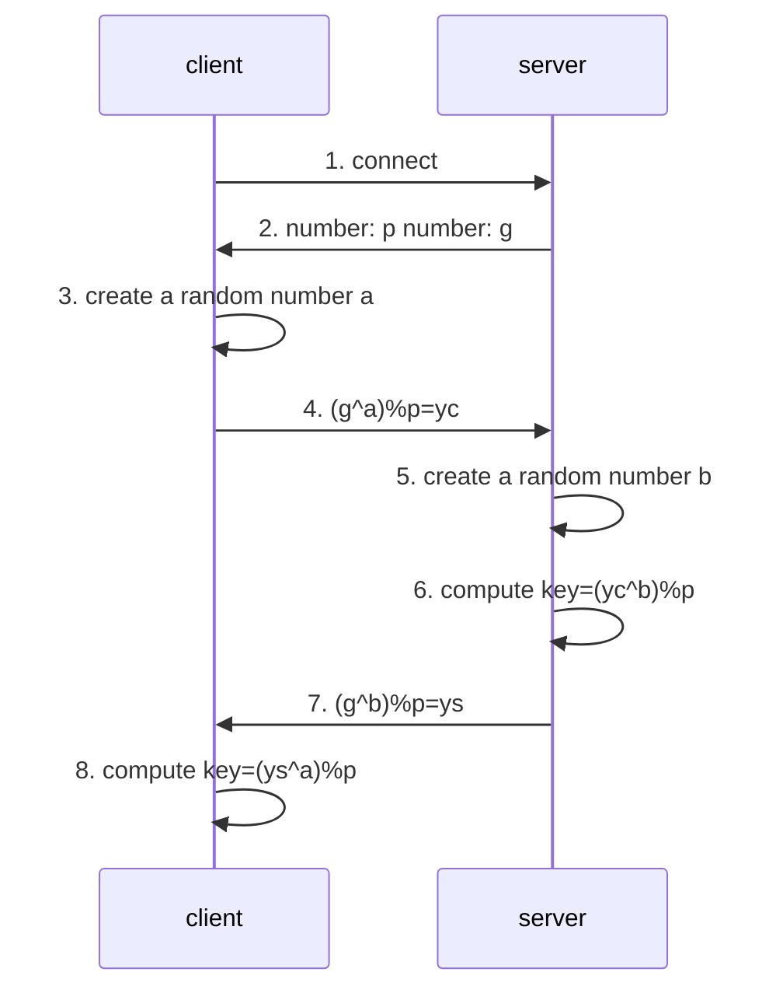

./img

[TOC]

# Nginx

```sh
# 支持stream 的nginx
cd 
wget http://nginx.org/download/nginx-1.16.1.tar.gz
tar -zxf nginx-1.16.1.tar.gz -C /usr/local
cd /usr/local/nginx-1.16.1
./configure --prefix=/usr/local/nginx --with-http_stub_status_module --with-http_ssl_module --with-stream
make && make install 
/usr/local/nginx/sbin/nginx -v

stream {
    upstream myapp{
        server IP:9000;
    }
    server {
        listen 20000;
        proxy_connect_timeout 5s;
        proxy_timeout 5s;
        proxy_pass myapp;
    }
}
/usr/local/nginx/sbin/nginx -s reload
```

# 大数据

## Hadoop

### 安装

#### Docker Install

```sh
echo -e "===prepare workspace==="
if [ ! -d "workspace" ]; then
echo "create new workspace"
mkdir workspace
fi
cd workspace

echo -e "===goto current space==="
version=$[$(ls | sort -n | tail -n 1)+1]
mkdir $version
cd $version
echo "Version: $version"
echo "Space: $(pwd)"

cp ../../Dockerfile Dockerfile

cat>core-site.xml<<EOF
<configuration>
    <property>
        <name>fs.defaultFS</name>
        <value>hdfs://localhost:9000</value>
    </property>
    <property>
        <name>hadoop.tmp.dir</name>
        <value>/data/hadoop</value>
    </property>
</configuration>
EOF

cat>mapred-site.xml<<EOF
<configuration>
    <property>
        <name>mapreduce.framework.name</name>
        <value>yarn</value>
    </property>
    <property>
        <name>mapreduce.application.classpath</name>
        <value>\$HADOOP_MAPRED_HOME/share/hadoop/mapreduce/*:\$HADOOP_MAPRED_HOME/share/hadoop/mapreduce/lib/*</value>
    </property>
</configuration>
EOF

cat>yarn-site.xml<<EOF
<configuration>
    <property>
        <name>yarn.nodemanager.aux-services</name>
        <value>mapreduce_shuffle</value>
    </property>
    <property>
        <name>yarn.nodemanager.env-whitelist</name>
        <value>JAVA_HOME,HADOOP_COMMON_HOME,HADOOP_HDFS_HOME,HADOOP_CONF_DIR,CLASSPATH_PREPEND_DISTCACHE,HADOOP_YARN_HOME,HADOOP_MAPRED_HOME</value>
    </property>
    <property>
        <name>yarn.resourcemanager.address</name>
        <value>localhost:8032</value>
      </property>
      <property>
        <name>yarn.resourcemanager.scheduler.address</name>
        <value>localhost:8030</value>
      </property>
      <property>
        <name>yarn.resourcemanager.resource-tracker.address</name>
        <value>localhost:8031</value>
      </property>
</configuration>
EOF

cat>entrypoint.sh<<EOF
/usr/sbin/sshd
if [ ! -d "/data/hadoop" ]; then
hdfs namenode -format
fi
hdfs --daemon start datanode
hdfs --daemon start namenode
\$HADOOP_HOME/sbin/start-yarn.sh
echo "done!"
while true; do sleep 30; done;
EOF

docker build -t hadoop:$version .

docker rm -f hadoop || true
docker run -idt --rm \
  -p 9870:9870 \
  -p 8088:8088 \
  -v /data/hadoop:/data \
  --name hadoop \
  hadoop:$version
docker logs hadoop -f
```

```dockerfile
FROM centos:centos8

# install ssh
RUN \
yum install openssh-server openssh-clients passwd  -y; \
sed -i "s/^UsePAM yes/UsePAM no/g" /etc/ssh/sshd_config; \
echo 123456 | passwd root --stdin; \
ssh-keygen -t rsa -P '' -f ~/.ssh/id_rsa; \
cat ~/.ssh/id_rsa.pub >> ~/.ssh/authorized_keys; \
chmod 0600 ~/.ssh/authorized_keys; \
ssh-keygen -q -N "" -t rsa -f /etc/ssh/ssh_host_rsa_key; \
ssh-keygen -q -N "" -t ecdsa -f /etc/ssh/ssh_host_ecdsa_key; \
ssh-keygen -q -N "" -t ed25519 -f /etc/ssh/ssh_host_ed25519_key;

# install java
RUN \
yum install wget -y; \
wget https://download.java.net/java/early_access/jdk16/27/GPL/openjdk-16-ea+27_linux-x64_bin.tar.gz ;\
tar -zxf openjdk-16-ea+27_linux-x64_bin.tar.gz -C /usr/local/; 

# env java
ENV JAVA_HOME /usr/local/jdk-16
ENV PATH $PATH:$JAVA_HOME/bin

# install hadoop
RUN \
yum install wget -y; \
wget https://mirror.bit.edu.cn/apache/hadoop/common/hadoop-3.3.0/hadoop-3.3.0.tar.gz; \
tar -zxf hadoop-3.3.0.tar.gz -C /usr/local/; 

# env hadoop
ENV HADOOP_MAPRED_HOME /usr/local/hadoop-3.3.0
ENV HADOOP_HOME /usr/local/hadoop-3.3.0
ENV PATH $PATH:$HADOOP_HOME/bin
ENV HDFS_NAMENODE_USER root
ENV HDFS_DATANODE_USER root
ENV HDFS_SECONDARYNAMENODE_USER root
ENV YARN_RESOURCEMANAGER_USER root
ENV YARN_NODEMANAGER_USER root

RUN \
sed '1 iexport JAVA_HOME=/usr/local/jdk-16' \
	-i $HADOOP_HOME/etc/hadoop/hadoop-env.sh; \
sed '1 iexport HADOOP_HOME=/usr/local/hadoop-3.3.0' \
	-i $HADOOP_HOME/etc/hadoop/hadoop-env.sh;
COPY core-site.xml $HADOOP_HOME/etc/hadoop/core-site.xml
COPY mapred-site.xml $HADOOP_HOME/etc/hadoop/mapred-site.xml
COPY yarn-site.xml $HADOOP_HOME/etc/hadoop/yarn-site.xml
COPY entrypoint.sh /entrypoint.sh

CMD ["sh", "/entrypoint.sh"]
```

#### K8S Install

```yaml
cd .
mkdir hadoop || true
cd hadoop

cat>hadoop-deployment.yaml<<EOF
apiVersion: apps/v1
kind: Deployment
metadata:
  name: hadoop-deployment
  labels:
    app: hadoop
spec:
  replicas: 1
  selector:
    matchLabels:
      app: hadoop
  template:
    metadata:
      labels:
        app: hadoop
    spec:
      containers:
      - name: hadoop
        image: sequenceiq/hadoop-docker:latest
        command: ["/etc/bootstrap.sh"]
        args: ["-d"]
        ports:
        - containerPort: 50070
EOF

cat>hadoop-service.yaml<<EOF
apiVersion: v1
kind: Service
metadata:
  name: hadoop-service
spec:
  type: NodePort
  selector:
    app: hadoop
  ports:
    - port: 50070
      targetPort: 50070
      nodePort: 30000
EOF

kubectl apply -f hadoop-deployment.yaml
kubectl apply -f hadoop-service.yaml
```

### Hadoop概述

#### 优点

- 高可靠
- 高拓展
- 高效性
- 高容错

#### HDFS

HDFS是分布式文件系统，包含NameNode, DataNode和Secondary NameNode

| 组件               | 功能                   |
| ------------------ | ---------------------- |
| NameNode           | 储存文件的元数据       |
| DataNode           | 储存文件块，校验和     |
| Secondary NameNode | 协助NameNode处理元数据 |

#### YARN

YARN是分布式资源调度器，包含了ResourceManager, NodeManager, ApplicationMaster, Container

| 组件              | 功能                                                         |
| ----------------- | ------------------------------------------------------------ |
| ResourceManager   | 处理客户端请求，监控NodeManager, 启动ApplicationMaster, 分配和调度资源 |
| NodeManager       | 管理单个节点上的资源，处理ResourceManager和ApplicationMaster的命令 |
| ApplicationMaster | 切分数据，为应用程序申请资源，并分配给任务，处理任务的监控和容错 |
| Container         | 代表节点的CPU,内存，磁盘，网络                               |

#### MapReduce

MapReduce是一个计算模型， Map阶段并行处理数据，Reduce阶段对Map汇总

### HDFS

HDFS全称为Hadoop Distributed File System,适用于一次写入，多次读出，不支持修改

#### Block

文件分块存储，默认是128M，block的寻址时间一般为10ms，寻址时间为传输时间的1%的时候，达到最佳状态，机械硬盘的速率是100M/s, 所以文件分块的大小为100M 较佳，近似到128M.
$$
10ms / 1\% \to 1s\\
1s / 100MB/s \to 100MB \\
100MB \to 128MB
$$

block太小增加寻址时间，太大会导致数据传输的时间过长，所以block的大小取决于磁盘的传输速率

#### HDFS shell

https://hadoop.apache.org/docs/current/hadoop-project-dist/hadoop-common/FileSystemShell.html

#### HDFS读写文件


#### NameNode工作机制

NameNode将内存数据持久化到磁盘中，分为fsimage和edits两个文件，fsimage是老的内存镜像，edits是追加格式的日志，表示着内存的变化情况，随着NameNode工作，edits会越来越大，这时候SecondaryNameNode会协助NameNode将edits与fsimage合并为新的fsimage。 注意下图紫色部分的流程即可


#### 集群安全模式

当NameNode不是第一次启动的时候，会加载Fsimage，并执行Edits日志，最后合并，此后开始监听DataNode请求，这个过程中NameNode一直是安全模式，文件系统处于只读状态，如果满足最小副本数，NameNode会在30秒后退出安全模式

#### NameNode多目录配置

```xml
<property>
	<name>dfs.namenode.name.dir</name>
    <value>file:///xxx,file:///xxx</value>
</property>
```

当我们配置了多个目录以后， NameNode的数据会同时存储在这些目录中，这些目录中的内容是一样的，如果一个目录损坏，NameNode会通过另一个目录恢复

#### DataNode工作机制


超时时间是2 \* dfs.namenode.heartbeat.recheck-interval + 10 \* dfs.hertbeat.interval

### MapReduce

#### 全过程

(input) `<k1, v1> ->` **map** `-> <k2, v2> ->` **combine** `-> <k2, v2> ->` **reduce** `-> <k3, v3>` (output)

##### InputFormat

InputFormat是执行MapReduce的第一步，他主要用于在从HDFS文件系统输入到MapTask的过程

| 名词     | 解释                                                  |
| -------- | ----------------------------------------------------- |
| 数据块   | Block是HDFS物理上把数据分成的多块                     |
| 数据切片 | Split是逻辑上对数据的分片，每个Split由一个MapTask处理 |
|          |                                                       |

| 切片方法                | 备注                                                         |
| ----------------------- | ------------------------------------------------------------ |
| TextInputFormat         | 按照大小切片，kv分别是行偏移量和行的具体数据                 |
| KeyValueTextInputFormat | 按照大小切片，kv是每一行由分隔符分割的左右两部分             |
| NLineInputFormat        | 按照行数切片，kv分别是行偏移量和行的具体数据                 |
| CombineTextInputFormat  | 按照大小拆分大文件，合并小文件，kv分别是行偏移量和行的具体数据 |

##### Map

 当经过了InputFormat以后，数据就进入到了Map阶段，

在这个阶段，Map框架会对每一对KV进行并行处理，并输出为新的KV，

把新的KV写入环形缓冲区，一端写索引，另一端写数据，

直到环形缓冲区达到80%(80MB)，Map框架将缓冲区数据排序并写入磁盘文件进行分区

直到文件数量达到一定上限，Map框架将文件排序合并，并进行分区


##### Partition

Map后，需要将数据写入不同的分区，

- ReduceTask数大于分区数，则最后几个Reduce为空

- ReduceTask小于分区数大于1，则异常

- ReduceTask=1，则只有一个输出文件

默认的分区是HashPartitioner

###### MapReduce中的排序

MapReduce两个阶段都会进行排序，不管实际是否需要

- Map： 环形缓冲区 -> 达到80% -> 快排 -> 写入文件 -> Map完成 -> 所有文件归并排序
- Reduce： 远程拷贝文件到内存-> 达到内存阈值-> 写入一个磁盘文件-> 磁盘文件个数达到阈值-> 合并文件 ->  拷贝完成->  所有数据(磁盘+内存)归并排序

###### 排序的方法

- 部分排序： 输出是多个文件，保证每个文件有序
- 全排序： 输出是一个文件，保证这个文件有序
- 辅助排序： 
- 二次排序： 排序中有两个判断条件

###### 如何排序

实现WriteableCompable接口即可

##### Combiner

Combiner就是一个局部的Reduce，他不一定必要，并不通用于所有的MR程序，比如求平均值，但是在局部Reduce不影响全局Reduce的情况下它可以降低网络传输压力

```java
job.setCombinerClass(IntSumReducer.class);
```

##### Shuffle

往往我们称Map之后，Reduce之前的操作为Shuffle

##### Reduce


##### OutputFormat

| OUTPUTFORMAT             | 描述             |
| ------------------------ | ---------------- |
| TextOutputFormat         | 把结果写成文本行 |
| SequenceFileOutputFormat | 写成二进制文件   |
|                          |                  |

#### Join

在Reduce端Join： 用同一个key即可

在Map端Join： 用字典手动Join

#### Compress

支持gzip,bzip,Lzo等压缩方式，可以用于输入文件的解压缩，输出文件的压缩，mapreduce中间文件的压缩

Map端压缩

```java
configuration.setBoolean("mapreduce.map.output.compress",true);
configuration.setClass("mapreduce.map.output.compress.codec",
                          BZip2Codec.class, CompressionCodec.class)
```

Reduce压缩

```java
FileOutputFormat.setCompressOutput(job,true);
FileOutputormat.setOutputCompressorClass(job,GzipCodec.class);
```

#### MR速度慢的原因

计算机性能： CPU、内存、磁盘、网络

IO: 数据倾斜，小文件多，不可分块的超大文件多，spill次数多，merge次数多

##### MR优化

- 输入阶段：合并小文件
- Maper阶段：调整环形缓冲区大小和溢写比例
- Maper阶段：调整合并文件的文件个数阈值
- Maper阶段：使用Combiner
- Reduce阶段：合理设置Map Reduce个数
- Reduce阶段：调整slowstart.completedmaps,提前申请Reduce资源
- Reduce阶段：MapTask机器文件 -> ReduceTask机器Buffer -> 磁盘 -> Reduce,  调整Buffer，让Buffer中保留一定的数据，直接传给Reduce
- 压缩数据
- 开启JVM重用

### Yarn

#### 流程


#### 调度器

- FIFIO调度器： 先进先出
- 容量调度器（默认）：支持多个队列，每个队列 有一定的资源，各自采用FIFO，对同一个用户的作业所占资源进行限制，安装任务和资源比例分配新的任务，按照任务优先级、提交时间、用户的资源限制、内存限制对队列中的任务排序
- 公平调度器（并发度非常高）： 多个队列，每个队列中的job可以并发运行，可以每个job都有资源，哪个job还缺的资源最多，就给哪个job分配资源

#### 任务推测执行

当前Job已完成的Task达到5%， 且某任务执行较慢，则开始备份任务
$$
当前任务完成时刻 = 当前时刻 +（当前时刻 - 任务开始时刻）/ 任务运行进度\\
备份任务完成时刻 = 当前时刻 + 所有任务平均花费时间
$$
每个任务最多一个备份任务，每个作业也有备份任务上限

### HA

#### HDFS HA


#### YARN HA

## Impala

impala提供对HDFS、Hbase数据的高性能、低延迟的交互式SQL查询功能。基于Hive使用内存计算，兼顾数据仓库、具有实时、批处理、多并发等优点。

### Impala的优点

- 基于内存计算

- 不使用MR

- C++编写计算层，Java编写编译层

- 兼容大部分HiveSQL

- 支持数据本地计算

- 可以使用Impala JDBC访问

### Impala的缺点

- 对内存依赖很大
- 完全依赖Hive
- 只能读取文本文件，不能读取二进制文件
- 在Impala更新的数据会同步到Hive，但是在Hive更新的数据不会自动同步到Impala

### Impala和关系型数据库的异同

- Impala不支持事务和索引
- Impala可以管理PB级数据，但是关系型数据库只能管理TB

### Impala和Hive的异同

- 使用HDFS，HBase储存数据
- 使用相同的元数据
- 使用类似的SQL词法分析生成执行计划
- Impala生成执行计划树，Hive会生成MR模型
- Impala使用拉的方式，后续节点主动拉取前面节点的数据，是流， Hive使用推的方式，前面的节点执行完成后会将数据主动推送给后面的节点

### Impala的架构

Impala集群有三个重要的组件，他们分别是Impala Daemon, Impala Statestore和Impala Metastore


#### Impala Daemon

Impala Daemon（Impalad）在安装Impala的每个节点上运行, 接受来着各种接口的查询，当一个查询提交到某个Impala Daemon的时候，这个节点就充当协调器，将任务分发到集群

#### Impala State

Impala State负责检测每个Impalad的运行状况，如果某个Impala Daemon发生了故障，则这个消息会被通知到所有其他Impla Daemon

#### Impala Matestore

Impala Matestore储存表的元数据信息


### Impala语法

- 时间函数【时间差】

  ```impala
  datediff(now(),to_timestamp(strleft(ftime,10), 'yyyy-MM-dd')) <= 7
  ```

- 字符串求和

  ```impala
  sum(cast(time as bigint))
  ```


## Elasticsearch

### 文档

https://www.elastic.co/guide/en/elasticsearch/reference/current/elasticsearch-intro.html

### Install ES

#### Docker Install ES

```sh
docker run -d \
--name elasticsearch \
-p 9200:9200 \
-p 9300:9300 \
-e "discovery.type=single-node" \
elasticsearch:7.10.1; \

docker run -d \
--link elasticsearch:elasticsearch \
-p 5601:5601 \
kibana:7.10.1
```

#### K8s Install ES


```sh
echo -e "===prepare workspace==="
if [ ! -d "workspace" ]; then
echo "create new workspace"
mkdir workspace
fi
cd workspace

echo -e "===goto current space==="
version=$[$(ls | sort -n | tail -n 1)+1]
mkdir $version
cd $version
echo "Version: $version"
echo "Space: $(pwd)"

echo -e "===deploy to k8s==="
mkdir deploy
cd deploy
cat>elasticsearch-deployment.yaml<<EOF
apiVersion: apps/v1
kind: Deployment
metadata:
  name: elasticsearch-deployment
  labels:
    app: elasticsearch
spec:
  replicas: 1
  selector:
    matchLabels:
      app: elasticsearch
  template:
    metadata:
      labels:
        app: elasticsearch
    spec:
      containers:
      - name: elasticsearch
        image: elasticsearch:7.5.1
        imagePullPolicy: IfNotPresent
        env: 
        - name: "discovery.type"
          value: "single-node"
        ports:
        - containerPort: 9200
        - containerPort: 9300
        resources:
          limits: 
            cpu: 0.3
            memory: 2000Mi
          requests:
            cpu: 0.3
            memory: 300Mi
       # livenessProbe:
       #   httpGet:
       #     path: /
        #    port: 9200
       #   initialDelaySeconds: 10
       #   periodSeconds: 3
      - name: kibana
        image: kibana:7.5.1
        imagePullPolicy: IfNotPresent
        env:
        - name: "ELASTICSEARCH_HOSTS"
          value: "http://127.0.0.1:9200"
        ports:
        - containerPort: 5601
        resources:
          limits: 
            cpu: 0.3
            memory: 1000Mi
          requests:
            cpu: 0.3
            memory: 300Mi
        #livenessProbe:
        #  httpGet:
        #   port: 5601
        #  initialDelaySeconds: 10
        #  periodSeconds: 3
EOF

cat>elasticsearch-service.yaml<<EOF
apiVersion: v1
kind: Service
metadata:
  name: elasticsearch-service
spec:
  type: NodePort
  selector:
    app: elasticsearch
  ports:
    - port: 5601
      targetPort: 5601
      nodePort: 5601
      name: kibana-web
    - port: 9200
      targetPort: 9200
      nodePort: 9200
      name: es-http
    - port: 9300
      targetPort: 9300
      nodePort: 9300
      name: es-tcp
EOF

kubectl apply -f elasticsearch-deployment.yaml
kubectl apply -f elasticsearch-service.yaml
cd ..
```

### Chrome Head Plugin

[插件地址](https://chrome.google.com/webstore/detail/elasticsearch-head/ffmkiejjmecolpfloofpjologoblkegm/related)


### Shell 连接

```sh
curl -u 'password' IP:9200
```


# Linux

换源

https://zhuanlan.zhihu.com/p/61228593

## ele

### firefox

```shell
sudo dpkg --remove --force-remove-reinstreq google-chrome-stable
apt-get install firefox
```

## XXD

这是一个16进制查看工具

```sh
# 查看帮助
xxd -h

# 查看文件前100个字节
xxd -l 100 file.bin
```


## SSH

### Install

```sh
# 必须安装passwd
yum install openssh-server openssh-clients passwd  -y; \
sed -i "s/^UsePAM yes/UsePAM no/g" /etc/ssh/sshd_config; \
echo 123456 | passwd root --stdin; \
ssh-keygen -t rsa -P '' -f ~/.ssh/id_rsa; \
cat ~/.ssh/id_rsa.pub >> ~/.ssh/authorized_keys; \
chmod 0600 ~/.ssh/authorized_keys; \
ssh-keygen -q -N "" -t rsa -f /etc/ssh/ssh_host_rsa_key; \
ssh-keygen -q -N "" -t ecdsa -f /etc/ssh/ssh_host_ecdsa_key; \
ssh-keygen -q -N "" -t ed25519 -f /etc/ssh/ssh_host_ed25519_key; \
/usr/sbin/sshd
```

### Problem

- [System is booting up. Unprivileged users are not permitted to log in yet](https://unix.stackexchange.com/questions/487742/system-is-booting-up-unprivileged-users-are-not-permitted-to-log-in-yet)


### Docker Install

- Dockerfile

```txt
FROM centos:centos8
RUN yum install openssh-server openssh-clients passwd  -y; \
sed -i "s/^UsePAM yes/UsePAM no/g" /etc/ssh/sshd_config; \
echo 123456 | passwd root --stdin; \
ssh-keygen -t rsa -P '' -f ~/.ssh/id_rsa; \
cat ~/.ssh/id_rsa.pub >> ~/.ssh/authorized_keys; \
chmod 0600 ~/.ssh/authorized_keys; \
ssh-keygen -q -N "" -t rsa -f /etc/ssh/ssh_host_rsa_key; \
ssh-keygen -q -N "" -t ecdsa -f /etc/ssh/ssh_host_ecdsa_key; \
ssh-keygen -q -N "" -t ed25519 -f /etc/ssh/ssh_host_ed25519_key;
EXPOSE 22
CMD ["/usr/sbin/sshd", "-D"]
```

- Build

```sh
docker build -t sshd:centos8 .
```

- Run

```sh
docker run -itd -p 2222:22 sshd:centos8
```

- Connect

```sh
ssh localhost -p 2222
```

### USE

```sh
ssh root@9.135.10.2 -p 36000 -P
xxxx
```


## Git

```sh
docker run -it --rm \
	-v ${HOME}:/root \
	-v $(pwd):/git \
	alpine/git \
	clone https://github.com/alpine-docker/git.git
```

### 源码安装

```sh
wget https://github.com/git/git/archive/v2.29.2.tar.gz; \
tar -zxf v2.29.2.tar.gz; \
rm v2.29.2.tar.gz; \
cd /git-2.29.2; \
yum install -y curl-devel expat-devel gettext-devel \
    openssl-devel zlib-devel gcc perl-ExtUtils-MakeMaker; \
make prefix=/usr/local/git all; \
make prefix=/usr/local/git install; \
echo "GIT_HOME=/usr/local/git" >> ~/.bashrc; \
echo "PATH=\$GIT_HOME/bin:\$PATH" >> ~/.bashrc; \
source ~/.bashrc; \
git --version; 

```

修改Git默认编辑器

```sh
 git config --global core.editor "vim"
```

### GIT提交规范

```txt
feat：新功能（feature）
fix：修补bug
docs：文档（documentation）
style： 格式（不影响代码运行的变动）
refactor：重构（即不是新增功能，也不是修改bug的代码变动）
test：增加测试
chore：构建过程或辅助工具的变动
```

### 提交Tag

```
git push origin --tags
```


## vim

```sh
git clone https://github.com/VundleVim/Vundle.vim.git ~/.vim/bundle/Vundle.vim
 
echo >~/.vimrc<<EOF 
" Vundle set nocompatible
filetype off
set rtp+=~/.vim/bundle/Vundle.vim
call vundle#begin()
Plugin 'VundleVim/Vundle.vim'
Plugin 'The-NERD-Tree'
Plugin 'gdbmgr'
Plugin 'mbbill/undotree'
Plugin 'majutsushi/tagbar'
Plugin 'vim-airline/vim-airline' " 状态栏
Plugin 'vim-airline/vim-airline-themes' "状态栏
Plugin 'cohlin/vim-colorschemes' " 主题
Plugin 'tomasr/molokai' " molokai
Plugin 'jiangmiao/auto-pairs' " 括号补全
Plugin 'plasticboy/vim-markdown'
Plugin 'iamcco/mathjax-support-for-mkdp' " 数学公式
Plugin 'iamcco/markdown-preview.vim' " markdown预览
"Plugin 'Valloric/YouCompleteMe'
"Plugin 'zxqfl/tabnine-vim'
Plugin 'w0rp/ale' " 语法纠错
Plugin 'octol/vim-cpp-enhanced-highlight' " c++语法高亮
Plugin 'Shougo/echodoc.vim' " c++函数提示
Plugin 'Chiel92/vim-autoformat' " c++代码格式化
Plugin 'scrooloose/nerdcommenter' " c++代码注释
Plugin 'ashfinal/vim-colors-violet' " 配色
Plugin 'terryma/vim-multiple-cursors' " vim 多行编辑
Plugin 'mhinz/vim-startify'
call vundle#end()
filetype plugin indent on


set et "tab用空格替换

set tabstop=2
set expandtab
" Tab键的宽度

set softtabstop=2
set shiftwidth=2
"  统一缩进为2

set number
" 显示行号

set history=10000
" 历史纪录数

set hlsearch
set incsearch
" 搜索逐字符高亮

set encoding=utf-8
set fileencodings=utf-8,ucs-bom,shift-jis,gb18030,gbk,gb2312,cp936,utf-16,big5,euc-jp,latin1
" 编码设置

" set mouse=a
" use mouse

set langmenu=zn_CN.UTF-8
set helplang=cn
" 语言设置

set laststatus=2
" 总是显示状态行 就是那些显示 --insert-- 的怪东西

set showcmd
" 在状态行显示目前所执行的命令，未完成的指令片段亦会显示出来

set scrolloff=3
" 光标移动到buffer的顶部和底部时保持3行距离

set showmatch
" 高亮显示对应的括号

set matchtime=1
" 对应括号高亮的时间（单位是十分之一秒）

colorscheme molokai
EOF

vim +PluginInstall +qall
```

## Net Commond

### Centos8 IP网络配置

```sh
/etc/sysconfig/network-scripts/*
```


### Centos8重新载入网络设置

```sh
nmcli c reload
nmcli c up ens32
```


# Mysql

## 查看表的定义

```mysql
show create table table_name;
```

## 时间函数

```mysql
date_add(date(imp_date), interval 1 week)
```


# Docker

## 修改源

```sh
cat>/etc/docker/daemon.json<<EOF
{
    "registry-mirrors": [
        "https://dockerhub.woa.com",
        "http://docker.oa.com:8080"
    ],
    "insecure-registries" : [ 
        "hub.oa.com",
        "docker.oa.com:8080",
        "bk.artifactory.oa.com:8080"
    ],
    "exec-opts":["native.cgroupdriver=systemd"]
}
EOF
```

## 常见参数

### 资源限制

```
--cpus 0.8
-m 800m
```

### 文件夹映射

```
-v /root/.m2:/root/.m2
```

# K8S

## 初始化K8S集群


```sh
kubeadm init --pod-network-cidr=10.244.0.0/16
kubectl apply -f https://raw.githubusercontent.com/coreos/flannel/master/Documentation/kube-flannel.yml
kubectl taint nodes --all node-role.kubernetes.io/master-
vim /etc/kubernetes/manifests/kube-apiserver.yaml
#- --service-node-port-range=1000-32000
```

## K8S客户端

```sh
export KUBECONFIG=/etc/kubernetes/admin.conf
sudo kubectl get pods
```

## K8S资源负载情况

```sh
curl -L https://github.com/kubernetes-sigs/metrics-server/releases/download/v0.3.6/components.yaml \
| sed -s 's/k8s.gcr.io/registry.cn-hangzhou.aliyuncs.com\/google_containers/g' \
| kubectl apply -f -
```

[参考](https://www.sklinux.com/posts/k8s/%E9%9B%86%E7%BE%A4%E6%A0%B8%E5%BF%83%E6%8C%87%E6%A0%87%E6%9C%8D%E5%8A%A1/)

```sh
# echo "serverTLSBootstrap: true" >> /var/lib/kubelet/config.yaml

systemctl daemon-reload
systemctl restart kubelet.service
kubectl get csr
kubectl certificate approve xxx ???
```

## K8S 资源限制

```sh
echo "===prepare workspace==="
if [ ! -d "workspace" ]; then
echo "create new workspace"
mkdir workspace
fi
cd workspace

echo "===goto current space==="
version=$[$(ls | sort -n | tail -n 1)+1]
mkdir $version
cd $version
echo "Version: $version"
echo "Space: $(pwd)"


echo "===deploy to k8s==="
mkdir deploy
cd deploy
cat>limitRange.yaml<<EOF
apiVersion: v1
kind: LimitRange
metadata:
  name: cpu-min-max-demo-lr
spec:
  limits:
  - max:
      cpu: "800m"
    min:
      cpu: "200m"
    type: Container
EOF
kubectl apply -f limitRange.yaml
cd ..
```

## K8S重启失败

```sh
systemctl status kubelet -n 1000

free -m # 看看swap分区是否被打开
swapoff -a

systemctl daemon-reload
systemctl restart kubelet

hostname -f
hostname xxxxxxx
```

### 重装

```sh
kubeadm reset
rm -rf /etc/kubernetes
rm -rf /var/lib/etcd/
```


## simple Java Project

```sh
echo -e "===prepare workspace==="
if [ ! -d "workspace" ]; then
echo "create new workspace"
mkdir workspace
fi
cd workspace

echo -e "===goto current space==="
version=$[$(ls | sort -n | tail -n 1)+1]
mkdir $version
cd $version
echo "Version: $version"
echo "Space: $(pwd)"

echo -e "===set parmas==="
gitPath=xxxx
girBranch=xxxx
# mavenMirror=https://maven.aliyun.com/repository/public
mavenMirror=xxxx
mavenCacheVolume=maven-repo
# mavenImage=maven:3.6.3-openjdk-16
mavenImage=maven:3.6.3-jdk-8
mavenPackageTarget=xxx-start/target/*.jar
# jdkImage=openjdk:16-jdk
jdkImage=openjdk:8-jdk
javaApp=xxxx

echo -e "===get code==="
docker run -i --rm \
	-v ${HOME}:/root \
	-v $(pwd)/src:/git \
	alpine/git \
	clone $gitPath .
pwd
echo $girBranch
docker run -i --rm \
	-v ${HOME}:/root \
	-v $(pwd)/src:/git \
	alpine/git \
	checkout $girBranch 
	

echo -e "===build target==="
mkdir .m2
cat>.m2/settings.xml<<EOF
<settings>
    <mirrors>
        <mirror>
            <id>proxy</id>
            <mirrorOf>central</mirrorOf>
            <name>proxy maven</name>
            <url>$mavenMirror</url>
        </mirror>
    </mirrors>
</settings>
EOF
docker volume create --name $mavenCacheVolume
docker run -i --rm \
	-v $(pwd)/src:/usr/src/mymaven \
	-v $mavenCacheVolume:/root/.m2/repository \
	-v $(pwd)/.m2/settings.xml:/root/.m2/settings.xml \
	-w /usr/src/mymaven \
	$mavenImage \
	mvn package -Dmaven.test.skip=true

echo -e "===move jar==="
mkdir image
mv src/$mavenPackageTarget image/main.jar

echo -e "===build image==="
cd image
cat>Dockerfile<<EOF
FROM $jdkImage
COPY main.jar /main.jar
COPY entrypoint.sh /entrypoint.sh
CMD ["sh","entrypoint.sh"]
EOF
cat>entrypoint.sh<<EOF
java -jar -Xmx250m -Xms200m -Dserver.port=80 /main.jar --logger.print-parmas.enable=true
EOF
docker build -t $javaApp:$version .
cd ..

echo -e "===deploy to k8s==="
mkdir deploy
cd deploy
cat>${javaApp}-deployment.yaml<<EOF
apiVersion: apps/v1
kind: Deployment
metadata:
  name: ${javaApp}-deployment
  labels:
    app: $javaApp
spec:
  replicas: 1
  selector:
    matchLabels:
      app: $javaApp
  template:
    metadata:
      labels:
        app: $javaApp
    spec:
      containers:
      - name: $javaApp
        image: $javaApp:$version
        imagePullPolicy: IfNotPresent
        env: 
        - name: ENV
          value: "env"
        ports:
        - containerPort: 80
        resources:
          limits: 
            cpu: 0.3
            memory: 400Mi
          requests:
            cpu: 0.3
            memory: 300Mi
        livenessProbe:
          httpGet:
            path: /swagger-ui/
            port: 80
          initialDelaySeconds: 100
          periodSeconds: 3
  strategy: # 策略
    type: RollingUpdate # 也可以是Recreate
    rollingUpdate: 
      maxUnavailable: 50% # 滚动更新的时候的最大不可用pod数量， 可以是绝对数字或者比例10%
      maxSurge: 50% # 动更新的时候的溢出的pod数量，也可以是绝对数字
  progressDeadlineSeconds: 150 # 进度期限秒数，不懂是什么
  minReadySeconds: 100 # 最短就绪时间， 容器创建多久以后被视为就绪
  revisionHistoryLimit: 3 # 历史修订限制， 保留的rs的数量，这个数量会消耗etcd资源，rs删除了就不能回滚刀那个版本的Deployment了
EOF

cat>${javaApp}-service.yaml<<EOF
apiVersion: v1
kind: Service
metadata:
  name: ${javaApp}-service
spec:
  type: NodePort
  selector:
    app: $javaApp
  ports:
    - port: 80
      targetPort: 80
      nodePort: 10010
EOF

kubectl apply -f ${javaApp}-deployment.yaml
kubectl apply -f ${javaApp}-service.yaml
cd ..
```


# JAVA

## IDEA

### Spring Boot 启动命令行太长

修改文件.idea/workspace.xml

```xml
  <component name="PropertiesComponent">
    <property name="dynamic.classpath" value="true" />
```

##  反编译

```sh
 # https://varaneckas.com/jad/
 wget https://varaneckas.com/jad/jad158e.linux.static.zip; \
 unzip jad158e.linux.static.zip
 jad xxx.class
 cat xxx.jad
```

## Java启动参数

### JVM参数


```sh
-ea
-Dhttp.proxyPort=12639
-Dhttp.proxyHost=127.0.0.1
-Dhttps.proxyPort=12639
-Dhttps.proxyHost=127.0.0.1
-Xmx400m # JVM最大内存
-Xms300m # JVM初始内存
-Xmn200m # 年轻代内存
-Xss128k # 线程堆栈
```

### Java参数

```
--server.port=80
--jasypt.encryptor.password=xxx
--spring.profiles.active=development
```

## Maven

```sh
docker run -it --rm \
	-v "$(pwd)":/usr/src/mymaven \
	-w /usr/src/mymaven \
	maven:3.3-jdk-8 \
	mvn clean install
```

```sh
# 发布
mvn clean javadoc:jar source:jar deploy
```

### 单元测试

```java
@Import(XxxServiceImpl.class)
@RunWith(SpringJUnit4ClassRunner.class)
@SpringBootTest(classes = TestRunner.class)
public class ScriptBizServiceTest {
    @Autowired
    XxxService xxxService;

    @MockBean
    XxxService xxxService;
}
```

```xml
    <dependency>
      <groupId>junit</groupId>
      <artifactId>junit</artifactId>
      <scope>test</scope>
    </dependency>
    <dependency>
      <groupId>org.springframework.boot</groupId>
      <artifactId>spring-boot-starter-test</artifactId>
      <scope>test</scope>
    </dependency>
```

### 源码上传插件

```xml
<plugin>
    <groupId>org.apache.maven.plugins</groupId>
    <artifactId>maven-source-plugin</artifactId>
    <version>3.0.1</version>
    <configuration>
        <attach>true</attach>
    </configuration>
    <executions>
        <execution>
            <phase>compile</phase>
            <goals>
                <goal>jar</goal>
            </goals>
        </execution>
    </executions>
</plugin>
```

### 规范

#### 多仓库规范

https://maven.apache.org/guides/mini/guide-multiple-repositories.html


Remote repository URLs are queried in the following order for artifacts until one returns a valid result:

1. Global `settings.xml`
2. User `settings.xml`
3. Local POM
4. Parent POMs, recursively
5. Super POM

For each of these locations, the repositories within the profiles are queried first in the order outlined at [Introduction to build profiles](https://maven.apache.org/guides/introduction/introduction-to-profiles.html).


## Guava

### RateLimiter

```java
RateLimiter rateLimiter = RateLimiter.create(10);
for (int i = 0; i < 20; i++) {
    int finalI = i;
    new Thread(new Runnable() {
        @Override
        public void run() {
            int cnt = 0;
            while (true) {
                if (rateLimiter.tryAcquire()) {
                    cnt++;
                    System.out.println("thread: " + finalI + " cnt: " + cnt);
                }
            }
        }
    }).start();
}
Thread.sleep(1000 * 100 * 1000);
```


源码流程图：


## Spring

### Spring Webflux 5.3.2


#### ResponseBodyResultHandler

这个ResultHandler是最常用的一个,我们可以看到他在containingClass被ResponseBody标记或者方法被ResponseBody标记时生效

```java
	@Override
	public boolean supports(HandlerResult result) {
		MethodParameter returnType = result.getReturnTypeSource();
		Class<?> containingClass = returnType.getContainingClass();
		return (AnnotatedElementUtils.hasAnnotation(containingClass, ResponseBody.class) ||
				returnType.hasMethodAnnotation(ResponseBody.class));
	}

	@Override
	public Mono<Void> handleResult(ServerWebExchange exchange, HandlerResult result) {
		Object body = result.getReturnValue();
		MethodParameter bodyTypeParameter = result.getReturnTypeSource();
		return writeBody(body, bodyTypeParameter, exchange);
	}

```

#### ViewResolutionResultHandler

ViewResolutionResultHandler支持的attributes比较多，它可以解析CharSequence，Rendering，Model，Map，View等

```java
	@Override
	public boolean supports(HandlerResult result) {
		if (hasModelAnnotation(result.getReturnTypeSource())) {
			return true;
		}

		Class<?> type = result.getReturnType().toClass();
		ReactiveAdapter adapter = getAdapter(result);
		if (adapter != null) {
			if (adapter.isNoValue()) {
				return true;
			}
			type = result.getReturnType().getGeneric().toClass();
		}

		return (CharSequence.class.isAssignableFrom(type) ||
				Rendering.class.isAssignableFrom(type) ||
				Model.class.isAssignableFrom(type) ||
				Map.class.isAssignableFrom(type) ||
				View.class.isAssignableFrom(type) ||
				!BeanUtils.isSimpleProperty(type));
	}
```


#### ServerResponseResultHandler

ServerResponseResultHandler只处理返回值为ServerResponse类型的Response，并使用内置的messageWriters和视图解析器来处理他们

```java
	@Override
	public void afterPropertiesSet() throws Exception {
		if (CollectionUtils.isEmpty(this.messageWriters)) {
			throw new IllegalArgumentException("Property 'messageWriters' is required");
		}
	}

	@Override
	public boolean supports(HandlerResult result) {
		return (result.getReturnValue() instanceof ServerResponse);
	}

	@Override
	public Mono<Void> handleResult(ServerWebExchange exchange, HandlerResult result) {
		ServerResponse response = (ServerResponse) result.getReturnValue();
		Assert.state(response != null, "No ServerResponse");
		return response.writeTo(exchange, new ServerResponse.Context() {
			@Override
			public List<HttpMessageWriter<?>> messageWriters() {
				return messageWriters;
			}
			@Override
			public List<ViewResolver> viewResolvers() {
				return viewResolvers;
			}
		});
	}
```

## Spring Boot

### 源码下載

```
git clone https://github.com/spring-projects/spring-boot.git
```

[checkout failed原因](https://www.howtogeek.com/266621/how-to-make-windows-10-accept-file-paths-over-260-characters/)

```sh
git config core.longPaths true
```

### Aware

#### BeanNameAware

beanNameAware可以获得容器中Bean的名称，作用于每一个Bean。当bean被创建的时候设置他的名字，在基本properties填充完成以后，init调用前执行

> 摘自： spring-beans:5.3.4 org.springframework.beans.factory.BeanNameAware
>
> Set the name of the bean in the bean factory that created this bean. <p>Invoked after population of normal bean properties but before an init callback such as {@link InitializingBean#afterPropertiesSet()} or a custom init-method.

```java
package com.example.demo;

import org.springframework.beans.factory.BeanNameAware;
import org.springframework.stereotype.Component;

@Component
public class BeanNameAwareDemo implements BeanNameAware {
    @Override
    public void setBeanName(String name) {
        System.out.println(name);
    }
}
```

输出: 

```txt
beanNameAwareDemo
```


### BeanFactoryAware

 注入beanFactory

```java
package com.example.demo;

import org.springframework.beans.BeansException;
import org.springframework.beans.factory.BeanFactory;
import org.springframework.beans.factory.BeanFactoryAware;
import org.springframework.stereotype.Component;

@Component
public class BeanFactoryAwareDemo implements BeanFactoryAware {
    @Override
    public void setBeanFactory(BeanFactory beanFactory) throws BeansException {
        System.out.println(beanFactory);
    }
}
```

### 自定义starter

@ConfigurationProperties 不能缺少下面这个依赖，否则不会自动处理配置的提示

```xml
<dependency>
    <groupId>org.springframework.boot</groupId>
    <artifactId>spring-boot-configuration-processor</artifactId>
    <optional>true</optional>
    <scope>compile</scope>
</dependency>
```

### Feign

```java
import com.fasterxml.jackson.databind.DeserializationFeature;
import com.fasterxml.jackson.databind.ObjectMapper;
import feign.codec.Decoder;
import feign.codec.Encoder;
import java.util.Arrays;
import lombok.extern.slf4j.Slf4j;
import org.springframework.beans.factory.ObjectFactory;
import org.springframework.boot.autoconfigure.http.HttpMessageConverters;
import org.springframework.cloud.openfeign.support.ResponseEntityDecoder;
import org.springframework.cloud.openfeign.support.SpringDecoder;
import org.springframework.cloud.openfeign.support.SpringEncoder;
import org.springframework.context.annotation.Bean;
import org.springframework.context.annotation.Configuration;
import org.springframework.http.MediaType;
import org.springframework.http.converter.HttpMessageConverter;
import org.springframework.http.converter.json.MappingJackson2HttpMessageConverter;

@Slf4j
@Configuration
public class CustomFeignConfig {
    @Bean
    public Decoder feignDecoder() {
        MappingJackson2HttpMessageConverter jacksonConverter =
                new MappingJackson2HttpMessageConverter(customObjectMapper());
        jacksonConverter.setSupportedMediaTypes(Arrays.asList(
                MediaType.ALL
        ));
        ObjectFactory<HttpMessageConverters> objectFactory =
                () -> new HttpMessageConverters(jacksonConverter);
        return new ResponseEntityDecoder(new SpringDecoder(objectFactory));
    }
    @Bean
    public Encoder feignEncoder() {
        MappingJackson2HttpMessageConverter jacksonConverter =
                new MappingJackson2HttpMessageConverter(customObjectMapper());
        jacksonConverter.setSupportedMediaTypes(Arrays.asList(
                MediaType.ALL
        ));
        ObjectFactory<HttpMessageConverters> objectFactory =
                () -> new HttpMessageConverters(jacksonConverter);
        return new SpringEncoder(objectFactory);
    }
    public ObjectMapper customObjectMapper() {
        ObjectMapper objectMapper = new ObjectMapper();
        //Customize as much as you want
        objectMapper.configure(DeserializationFeature.ACCEPT_EMPTY_STRING_AS_NULL_OBJECT, true);
        return objectMapper;
    }
}
```

### Validaction

https://cloud.tencent.com/developer/article/1465749


依赖

```xml
<dependency>
    <groupId>org.springframework.boot</groupId>
	<artifactId>spring-boot-starter-validation</artifactId>
</dependency>
```

使用方案

```txt
@Null 验证对象是否为null
@NotNull 验证对象是否不为null, 无法查检长度为0的字符串
@NotBlank 检查约束字符串是不是Null还有被Trim的长度是否大于0,只对字符串,且会去掉前后空格.
@NotEmpty 检查约束元素是否为NULL或者是EMPTY.
Booelan检查
@AssertTrue 验证 Boolean 对象是否为 true
@AssertFalse 验证 Boolean 对象是否为 false
长度检查
@Size(min=, max=) 验证对象（Array,Collection,Map,String）长度是否在给定的范围之内
@Length(min=, max=) Validates that the annotated string is between min and max included.
日期检查
@Past 验证 Date 和 Calendar 对象是否在当前时间之前
@Future 验证 Date 和 Calendar 对象是否在当前时间之后
@Pattern 验证 String 对象是否符合正则表达式的规则
数值检查
建议使用在Stirng,Integer类型，不建议使用在int类型上，因为表单值为“”时无法转换为int，但可以转换为Stirng为"",Integer为null
@Min 验证 Number 和 String 对象是否大等于指定的值
@Max 验证 Number 和 String 对象是否小等于指定的值
@DecimalMax 被标注的值必须不大于约束中指定的最大值. 这个约束的参数是一个通过BigDecimal定义的最大值的字符串表示.小数存在精度
@DecimalMin 被标注的值必须不小于约束中指定的最小值. 这个约束的参数是一个通过BigDecimal定义的最小值的字符串表示.小数存在精度
@Digits 验证 Number 和 String 的构成是否合法
@Digits(integer=,fraction=) 验证字符串是否是符合指定格式的数字，interger指定整数精度，fraction指定小数精度。 @Range(min=, max=) Checks whether the annotated value lies between (inclusive) the specified minimum and maximum. @Range(min=10000,max=50000,message=“range.bean.wage”) private BigDecimal wage;
@Valid 递归的对关联对象进行校验, 如果关联对象是个集合或者数组,那么对其中的元素进行递归校验,如果是一个map,则对其中的值部分进行校验.(是否进行递归验证)
@CreditCardNumber信用卡验证
@Email 验证是否是邮件地址，如果为null,不进行验证，算通过验证。
@ScriptAssert(lang= ,script=, alias=)
@URL(protocol=,host=, port=,regexp=, flags=)
```

### Spring Boot Starter Webflux

各个bean详细的功能详见[Spring Webflux 5.3.2](#Spring Webflux 5.3.2)


## Spring Cloud

### Spring Cloud Cluster 1.0.1.RELEASE

[参考](https://cloud.spring.io/spring-cloud-static/spring-cloud.html#_spring_cloud_cluster)

Spring Cloud Cluster提供了分布式系统中集群的特性，例如选主，集群持久化信息储存，全局锁和一次性token

以下是Spring Cloud Cluster 1.0.1的Spring Boot 自动装配流程，其中的zk模式主要用到了第三方框架[CuratorFramework](#CuratorFramework)


### Spring Cloud Gateway


```java
package com.example.demo;

import java.util.ArrayList;
import java.util.List;
import org.springframework.boot.SpringApplication;
import org.springframework.boot.autoconfigure.SpringBootApplication;
import org.springframework.cloud.gateway.event.RefreshRoutesEvent;
import org.springframework.cloud.gateway.route.RouteDefinition;
import org.springframework.cloud.gateway.route.RouteDefinitionRepository;
import org.springframework.context.ApplicationEventPublisher;
import org.springframework.context.ApplicationEventPublisherAware;
import org.springframework.web.bind.annotation.DeleteMapping;
import org.springframework.web.bind.annotation.GetMapping;
import org.springframework.web.bind.annotation.PostMapping;
import org.springframework.web.bind.annotation.PutMapping;
import org.springframework.web.bind.annotation.RequestBody;
import org.springframework.web.bind.annotation.RestController;
import reactor.core.publisher.Flux;
import reactor.core.publisher.Mono;

// 动态路由
// https://zhuanlan.zhihu.com/p/125018436
@RestController
@SpringBootApplication
public class DemoApplication implements RouteDefinitionRepository, ApplicationEventPublisherAware {

    public static void main(String[] args) {
        SpringApplication.run(DemoApplication.class, args);
    }

    // event publisher
    ApplicationEventPublisher applicationEventPublisher;

    @Override
    public void setApplicationEventPublisher(ApplicationEventPublisher applicationEventPublisher) {
        this.applicationEventPublisher = applicationEventPublisher;
    }


    // router
    List<RouteDefinition> memery = new ArrayList<>();

    private void refreshRoute() {
        applicationEventPublisher.publishEvent(new RefreshRoutesEvent(this));
    }

    @PutMapping
    Mono<Void> putRoute(@RequestBody Mono<RouteDefinition> o) {
        return o.flatMap(routeDefinition -> {
            memery.add(routeDefinition);
            refreshRoute();
            return Mono.empty();
        });
    }

    @PostMapping
    Mono<Void> postRoute(@RequestBody Mono<RouteDefinition> o) {
        return o.flatMap(routeDefinition -> {
            for (int i = 0; i < memery.size(); i++) {
                if (memery.get(i).getId().equals(routeDefinition.getId())) {
                    memery.set(i, routeDefinition);
                }
            }
            refreshRoute();
            return Mono.empty();
        });
    }

    @DeleteMapping
    Mono<Void> deleteRoute(@RequestBody Mono<String> o) {
        return o.flatMap(id -> {
            memery.removeIf(routeDefinition -> routeDefinition.getId().equals(id));
            refreshRoute();
            return Mono.empty();
        });
    }

    @GetMapping
    Mono<List<RouteDefinition>> getRoute(){
        return Mono.just(memery);
    }

    @Override
    public Flux<RouteDefinition> getRouteDefinitions() {
        return Flux.fromIterable(memery);
    }

    @Override
    public Mono<Void> save(Mono<RouteDefinition> route) {
        return Mono.empty();
    }

    @Override
    public Mono<Void> delete(Mono<String> routeId) {
        return Mono.empty();
    }
}
```

```txt
GET http://localhost:52834/test

###

PUT http://localhost:52834
Content-Type: application/json

{
    "id": "test",
    "predicates": [
        {
            "name": "Path",
            "args": {
                "pattern": "/test"
            }
        }
    ],
    "filters": [
        {
            "name": "RewritePath",
            "args": {
                "regexp": "/test",
                "replacement": "/s"
            }
        }
    ],
    "uri": "http://www.baidu.com",
    "order": 0
}

###

GET http://localhost:52834

###

GET http://localhost:52834/test
```

# 微服务

## Zookeeper

### CuratorFramework

# 容器化开发

https://segmentfault.com/a/1190000023095631


## 注意事项

对于所有的容器化开发，我们的时区都需要设置

```docker
-v /etc/localtime:/etc/localtime
```


## Nodejs开发

```sh
docker run -itd \
--restart=always \
--name xxx \
-v /src/xxx:/src/xxx \
-v /etc/localtime:/etc/localtime \
-v /root/.ssh:/root/.ssh \
-p 3000:3000 \
node:14.4.0

# 这个时区设置添加到启动程序中
# process.env.TZ = 'Asia/Shanghai';
```

## Java开发

```sh
# docker 参数
-m 800m
--cpus 1
-v /root/.m2/:/root/.m2
-p 8080:8080 -p
--net docker-net
--ip 192.168.11.2
```

```Dockerfile
FROM maven:3.6.3-jdk-8
COPY . /src
WORKDIR /src
CMD ["sh", "dockerEntryPoint.sh"]
```

```sh
mvn -v
echo "package"
mvn clean package -Dmaven.test.skip=true
echo "start java application ... "
#java -jar -agentlib:jdwp=transport=dt_socket,server=n,address=10.40.28.63:5005,suspend=y main.jar
java -jar \
  -agentlib:jdwp=transport=dt_socket,server=y,suspend=n,address=5005 \
  *.jar
```


第一步，开发一个Spring程序


第二步，连接远端Centos


第三步修改docker启动参数并重启docker

```sh
vim /lib/systemd/system/docker.service 
```

增加 ` -H tcp://0.0.0.0:2375`


```sh
systemctl daemon-reload && systemctl restart docker && systemctl status docker
```

第四步创建Dockerfile以及entrypoint.sh

**注意Dockerfile中移动的jar包是编译产物**

**注意entrypoint.sh中的address后是自己本地机器的ip**


```dockerfile
FROM openjdk:15
WORKDIR /
COPY entrypoint.sh /entrypoint.sh
COPY target/demo-0.0.1-SNAPSHOT.jar /main.jar
CMD ["sh", "/entrypoint.sh"]
```

```sh
java --version
echo "start java application ... "
java -jar -agentlib:jdwp=transport=dt_socket,server=n,address=192.168.0.109:5005,suspend=y -Duser.timezone=Asia/Shanghai /main.jar
```

第五步创建Docker启动配置和Debug启动配置

**注意Dockerfile的Before lanch前加上 mvn package**

**注意Debug的Host为远程ip**


第六步先启动远程调试，后启动docker build


第七步： enjoy it


# HTTPS深入浅出


## HTTP介绍

> 读者不要认为HTTP负责数据传输，它实际上负责数据请求和响应，真正的数据传输由其他网络层处理

>Web 确切地说是一种信息索取方式，是互联网的某个子应用 。Web 最核 心的 组成部分是 HTTP,HTTP 由服务器和客户端组成，有了 HTTP ，互联网上的不同终端才能够交换信息。

### HTTP 请求和响应结构

> 

### HTTP协议不安全的根本原因

- 数据没有加密
- 无法互相验证身份
- 数据容易被篡改


### XSS攻击

恶意用户写入了一段恶意代码到论坛，其他人只要看到了他的论坛，就会执行恶意脚本。

### W3C

>Tim Berners -Lee 教授提出 Web 技术后成立了 W3C 组织，W3C 主要制定 Web 技术的标准，比如 HTML 标准、DOM 标准、css 标准、ECMA Script 标准

>W3C 主要以HTTP 头部的方式提供安全保护，比如Access - Control - Allow-Origin 、X-XSS -Protection 、Strict-Transport-Security 、Content-Security-PolicyHTTP 头部，一 旦开发者和浏览器正确地遵守安全标准，就能缓解安全问题。


## 密码学

- 密码学是科学
- 密码学理论是公开的
- 密码学算法是相对安全的
- 密码学攻击方法是多样化的
- 密码学应用标准很重要

>在使用密码学算法的时候也不要画蛇添足 ， 一个简单的软件为了保障安全性可能使用一 种密码学算法即可，没有必要组合多种密码学算法 。

### OpenSSL

https://www.openssl.org/


### 密码学中的随机数

块密码算法CTR模式

摘要算法

[流密码算法](#流密码算法)

### HASH算法

Hash算法的一个用途是解决数据的完整性问题

#### Hash算法的拓展

密码学中的Hash算法是一个非常重要的加密基元，密码学中的摘要、散列、指纹都是Hash算法

> 


#### Hash算法的用途

文本比较： 例如两个文件的MD5值比较

身份验证： 在数据库中储存密码Hash而不是明文, <span style='color:red'>这个做法不安全</span>


#### Hash算法的类型

MD5： MD5是不安全的算法，违反了抗碰撞性

SHA： SHA-1是不安全的，SHA-2推荐使用，SHA-3不是为了取代SHA-2而是在设计上和SHA-2完全不同


### 对称加密

对称加密算法可以用来解决数据的窃听问题

用同一个密钥可以对明文进行加密，可以对密文进行解密，有两种类型： 块密码算法和流密码算法


#### 流密码算法

##### 一次性密码本

密码本长度和明文一样长，他们异或起来就是密文，把密文和密码本异或可以得到明文

##### RC4算法

RC4的密码流来着随机数流，随机数种子就是密钥， so easy， <span style='color:red'> RC4算法被证明不安全！</span>


#### 块密码算法

即将明文分块，对于无法分出的整数块进行填充，下面介绍模式，<span style="color:red">任何一种对称加密算法都可以与下面的模式相组合。</span>

##### ECB模式(Eletronic Codebook)

对每一个块分别做加密，然后进行传输，这个过程可以并行处理，由于固定的明文块会得到固定的密文块，所以ECB模式是<span style='color:red'>不安全</span>的

##### CBC模式(Cipher Block Chaining)

引入初始化向量，在加密前对第一个块进行混淆，用加密结果对下一个块进行混淆,初始化向量是一个随机数


##### CTR模式(Counter)

CTR模式不需要填充，因为他对每一个块进行了流密码算法，有多少个块就有多少个密钥流，密钥流的密钥可以来源于前一个密钥流的密钥，第一个密钥流的密钥称之为Nonce，与CBC模式的IV类似

#### 填充算法

> 

> 

### 消息验证码

消息验证码： Message Authentication Code (MAC)

HASH算法解决了数据的完整性问题，对称加密算法解决了数据的窃听问题，但是他们都不能解决数据的篡改问题

#### 攻击者如何篡改消息？

由于攻击者的目标是篡改消息，而不是窃听和破坏消息，针对于ECB模式，它可以收集统计信息，将密文分块并篡改为以前的密文块等，然后重新HASH(HASH算法是公开的)，并篡改HASH值后转发。 

#### MAC算法

MAC算法致力于两点： 

- 证明消息没有被篡改
- 证明消息来源于正确的发送者

MAC算法： 核心原理就是在消息中携带密钥，然后使用HASH算法和加密算法，由于篡改者没有密钥，所以他无法篡改数据

MAC算法的类型： HMAC，CBC-MAC，OMAC

HMac算法流程： 注意不是hash(message//key) ， <span style="color:red">why not?</span>

> 

#### AE加密模式

结合对称加密算法和MAC算法又叫AE加密模式，Authenticated Encryption， 如何结合就有了多种选择

| 加密模式         | 代码                        | 备注                 |
| ---------------- | --------------------------- | -------------------- |
| MAC-and-Encrypt  | encry(message)+mac(message) | 使用不当会导致不安全 |
| MAC-then-Encrypt | encry(mac(message))         | 使用不当会导致不安全 |
| Encrypt-then-MAC | mac(encry(message))         | 建议使用             |

#### AEAD加密模式

结合对称加密算法和MAC算法如果处理不当会导致安全问题，AEAD模式(Authenticated Encryption with Associated Data)就是在底层组合了加密算法和MAC算法

##### CCM模式

CCM （Counter with CBC-MAC ）模式是一种 AEAD 模式 ， 不过在 HTTPS 中使用 得比较少 。 是AES算法的CRT模式组合了CBC-MAC算法，底层采用了MAC-then-Encrypt

##### GCM模式

>GCM ( Galois/Counter Mode ） 是目 前比较流行的 AEAD 模式 。在 GCM 内部，采用GHASH 算法（一种 MAC 算法）进行 MAC 运算，使用块密码 AES 算法 CTR 模式的 一种变种进行加密运算，在效率和性能上，GCM 都是非常不错的。


### 非对称加密

非对称加密又叫公开密钥算法，公钥加密，私钥解密

#### RSA

单步加密



双向加密



#### ECC

pass


### 密钥协商算法

#### RSA

缺点：

1. 会话密钥完全由client决定
2. 无法提供前向安全性




#### DH



#### ECDH

ECC+DH协商密钥， pass

### 数字签名

#### RSA签名


#### DSA签名

pass

#### ESDSA签名

pass

## 宏观理解TLS

### TLS/SSL背后的算法

加密算法： 对称加密后者非对称加密，保证机密性

MAC算法： 保证完整性

密钥协商算法： 传输对称加密的密钥

密钥衍生算法： 通过一个不定长度的预备主密钥转换为固定长度的主密钥，然后用主密钥转化出任意数量，任意长度的密钥块

### HTTPS总结


#### 握手层

客户端在进行密钥交换前，必须验证服务器身份，用CA证书来解决

在握手阶段，客户端服务器需要协商出双方都认可的密码套件，这包括了身份验证算法，密码协商算法，加密算法加密模式，HMAC算法的加密基元，PRF算法的加密基元


#### 加密层

流密码加密： RC4（MAC-then-Encrypt）

分组加密模式： AES-128-CBC（AES算法，密钥128比特，CBC分组）

AEAD：


# 30天自制操作系统


## 第0天

## 第1天 从计算机结构到汇编程序入门

### 二进制编辑器

[Bz162](https://github.com/YoungWilliamZ/30dayToMakeAnOS/tree/master/Day1)


### QEMU

[官网](https://www.qemu.org/download/#windows)

[git](git clone git://git.qemu-project.org/qemu.git)

```sh
wget https://download.qemu.org/qemu-3.0.0.tar.xz
tar xvJf qemu-3.0.0.tar.xz
cd qemu-3.0.0
./configure
make

git clone git://git.qemu.org/qemu.git
cd qemu
git submodule init
git submodule update --recursive
./configure
make
```


## xxxx

### 概念解释

虚拟地址： 程序员看到的地址

物理地址： 硬件的内存地址

段描述符表： 多个段描述符放在一起构成的表

段描述符： 描述段的属性（基地址，段长，特权级，读写权限）

段选择子： 用于在段描述符表中定位段描述符的索引


# Typora

## 自定义配置

[参考](https://xieshaohu.wordpress.com/2019/03/09/typora%e9%85%8d%e7%bd%ae%e6%ad%a3%e6%96%87%e3%80%81%e7%9b%ae%e5%bd%95%e3%80%81%e4%be%a7%e8%be%b9%e5%a4%a7%e7%ba%b2%e4%b8%ad%e7%9a%84%e6%a0%87%e9%a2%98%e8%87%aa%e5%8a%a8%e7%bc%96%e5%8f%b7/?unapproved=453&moderation-hash=029307ad5fc7504e2f306c9a941eee2a#comment-453)

```css
/**************************************
* Header Counters in TOC
**************************************/

/* No link underlines in TOC */
.md-toc-inner {
    text-decoration: none;
    }
    
    .md-toc-content {
    counter-reset: h1toc
    }
    
    .md-toc-h1 {
    margin-left: 0;
    font-size: 1.5rem;
    counter-reset: h2toc
    }
    
    .md-toc-h2 {
    font-size: 1.1rem;
    margin-left: 2rem;
    counter-reset: h3toc
    }
    
    .md-toc-h3 {
    margin-left: 3rem;
    font-size: .9rem;
    counter-reset: h4toc
    }
    
    .md-toc-h4 {
    margin-left: 4rem;
    font-size: .85rem;
    counter-reset: h5toc
    }
    
    ADVERTISEMENT
    REPORT THIS AD
    
    .md-toc-h5 {
    margin-left: 5rem;
    font-size: .8rem;
    counter-reset: h6toc
    }
    
    .md-toc-h6 {
    margin-left: 6rem;
    font-size: .75rem;
    }
    
    .md-toc-h1:before {
    color: black;
    counter-increment: h1toc;
    content: counter(h1toc) ". "
    }
    
    .md-toc-h1 .md-toc-inner {
    margin-left: 0;
    }
    
    .md-toc-h2:before {
    color: black;
    counter-increment: h2toc;
    content: counter(h1toc) ". " counter(h2toc) ". "
    }
    
    .md-toc-h2 .md-toc-inner {
    margin-left: 0;
    }
    
    .md-toc-h3:before {
    color: black;
    counter-increment: h3toc;
    content: counter(h1toc) ". " counter(h2toc) ". " counter(h3toc) ". "
    }
    
    .md-toc-h3 .md-toc-inner {
    margin-left: 0;
    }
    
    .md-toc-h4:before {
    color: black;
    counter-increment: h4toc;
    content: counter(h1toc) ". " counter(h2toc) ". " counter(h3toc) ". " counter(h4toc) ". "
    }
    
    .md-toc-h4 .md-toc-inner {
    margin-left: 0;
    }
    
    .md-toc-h5:before {
    color: black;
    counter-increment: h5toc;
    content: counter(h1toc) ". " counter(h2toc) ". " counter(h3toc) ". " counter(h4toc) ". " counter(h5toc) ". "
    }
    
    .md-toc-h5 .md-toc-inner {
    margin-left: 0;
    }
    
    .md-toc-h6:before {
    color: black;
    counter-increment: h6toc;
    content: counter(h1toc) ". " counter(h2toc) ". " counter(h3toc) ". " counter(h4toc) ". " counter(h5toc) ". " counter(h6toc) ". "
    }
    
    .md-toc-h6 .md-toc-inner {
    margin-left: 0;
    }
    
    /**************************************
    * Header Counters in Content
    **************************************/
    
    /** initialize css counter */
    #write {
    counter-reset: h1
    }
    
    h1 {
    counter-reset: h2
    }
    
    h2 {
    counter-reset: h3
    }
    
    h3 {
    counter-reset: h4
    }
    
    h4 {
    counter-reset: h5
    }
    
    h5 {
    counter-reset: h6
    }
    
    /** put counter result into headings */
    #write h1:before {
    counter-increment: h1;
    content: counter(h1) 
    }
    /**************************************
    * Header Counters in TOC
    **************************************/
    
    /* No link underlines in TOC */
    .md-toc-inner {
    text-decoration: none;
    }
    
    .md-toc-content {
    counter-reset: h1toc
    }
    
    .md-toc-h1 {
    margin-left: 0;
    font-size: 1.5rem;
    counter-reset: h2toc
    }
    
    .md-toc-h2 {
    font-size: 1.1rem;
    margin-left: 2rem;
    counter-reset: h3toc
    }
    
    .md-toc-h3 {
    margin-left: 3rem;
    font-size: .9rem;
    counter-reset: h4toc
    }
    
    .md-toc-h4 {
    margin-left: 4rem;
    font-size: .85rem;
    counter-reset: h5toc
    }
    
    ADVERTISEMENT
    REPORT THIS AD
    
    .md-toc-h5 {
    margin-left: 5rem;
    font-size: .8rem;
    counter-reset: h6toc
    }
    
    .md-toc-h6 {
    margin-left: 6rem;
    font-size: .75rem;
    }
    
    .md-toc-h1:before {
    color: black;
    counter-increment: h1toc;
    content: counter(h1toc) ". "
    }
    
    .md-toc-h1 .md-toc-inner {
    margin-left: 0;
    }
    
    .md-toc-h2:before {
    color: black;
    counter-increment: h2toc;
    content: counter(h1toc) ". " counter(h2toc) ". "
    }
    
    .md-toc-h2 .md-toc-inner {
    margin-left: 0;
    }
    
    .md-toc-h3:before {
    color: black;
    counter-increment: h3toc;
    content: counter(h1toc) ". " counter(h2toc) ". " counter(h3toc) ". "
    }
    
    .md-toc-h3 .md-toc-inner {
    margin-left: 0;
    }
    
    .md-toc-h4:before {
    color: black;
    counter-increment: h4toc;
    content: counter(h1toc) ". " counter(h2toc) ". " counter(h3toc) ". " counter(h4toc) ". "
    }
    
    .md-toc-h4 .md-toc-inner {
    margin-left: 0;
    }
    
    .md-toc-h5:before {
    color: black;
    counter-increment: h5toc;
    content: counter(h1toc) ". " counter(h2toc) ". " counter(h3toc) ". " counter(h4toc) ". " counter(h5toc) ". "
    }
    
    .md-toc-h5 .md-toc-inner {
    margin-left: 0;
    }
    
    .md-toc-h6:before {
    color: black;
    counter-increment: h6toc;
    content: counter(h1toc) ". " counter(h2toc) ". " counter(h3toc) ". " counter(h4toc) ". " counter(h5toc) ". " counter(h6toc) ". "
    }
    
    .md-toc-h6 .md-toc-inner {
    margin-left: 0;
    }
    
    /**************************************
    * Header Counters in Content
    **************************************/
    
    /** initialize css counter */
    #write {
    counter-reset: h1
    }
    
    h1 {
    counter-reset: h2
    }
    
    h2 {
    counter-reset: h3
    }
    
    h3 {
    counter-reset: h4
    }
    
    h4 {
    counter-reset: h5
    }
    
    h5 {
    counter-reset: h6
    }
    
    /** put counter result into headings */
    #write h1:before {
    counter-increment: h1;
    content: counter(h1) ". "
    }
    
    #write h2:before {
    counter-increment: h2;
    content: counter(h1) "." counter(h2) ". "
    }
    
    #write h3:before, h3.md-focus.md-heading:before { /*override the default style for focused headings */
    counter-increment: h3;
    content: counter(h1) "." counter(h2) "." counter(h3) ". "
    }
    
    #write h4:before, h4.md-focus.md-heading:before {
    counter-increment: h4;
    content: counter(h1) "." counter(h2) "." counter(h3) "." counter(h4) ". "
    }
    
    #write h5:before, h5.md-focus.md-heading:before {
    counter-increment: h5;
    content: counter(h1) "." counter(h2) "." counter(h3) "." counter(h4) "." counter(h5) ". "
    }
    
    #write h6:before, h6.md-focus.md-heading:before {
    counter-increment: h6;
    content: counter(h1) "." counter(h2) "." counter(h3) "." counter(h4) "." counter(h5) "." counter(h6) ". "
    }
    
    /** override the default style for focused headings */
    #write>h3.md-focus:before, #write>h4.md-focus:before, #write>h5.md-focus:before, #write>h6.md-focus:before, h3.md-focus:before, h4.md-focus:before, h5.md-focus:before, h6.md-focus:before {
    color: inherit;
    border: inherit;
    border-radius: inherit;
    position: inherit;
    left: initial;
    float: none;
    top: initial;
    font-size: inherit;
    padding-left: inherit;
    padding-right: inherit;
    vertical-align: inherit;
    font-weight: inherit;
    line-height: inherit;
    }
    
    /**************************************
    * Header Counters in sidebar
    **************************************/
    .sidebar-content {
    counter-reset: h1
    }
    
    .outline-h1 {
    counter-reset: h2
    }
    
    .outline-h2 {
    counter-reset: h3
    }
    
    .outline-h3 {
    counter-reset: h4
    }
    
    .outline-h4 {
    counter-reset: h5
    }
    
    .outline-h5 {
    counter-reset: h6
    }
    
    .outline-h1>.outline-item>.outline-label:before {
    counter-increment: h1;
    content: counter(h1) ". "
    }
    
    .outline-h2>.outline-item>.outline-label:before {
    counter-increment: h2;
    content: counter(h1) "." counter(h2) ". "
    }
    
    .outline-h3>.outline-item>.outline-label:before {
    counter-increment: h3;
    content: counter(h1) "." counter(h2) "." counter(h3) ". "
    }
    
    .outline-h4>.outline-item>.outline-label:before {
    counter-increment: h4;
    content: counter(h1) "." counter(h2) "." counter(h3) "." counter(h4) ". "
    }
    
    .outline-h5>.outline-item>.outline-label:before {
    counter-increment: h5;
    content: counter(h1) "." counter(h2) "." counter(h3) "." counter(h4) "." counter(h5) ". "
    }
    
    .outline-h6>.outline-item>.outline-label:before {
    counter-increment: h6;
    content: counter(h1) "." counter(h2) "." counter(h3) "." counter(h4) "." counter(h5) "." counter(h6) ". "
    }
    
    #write h2:before {
    counter-increment: h2;
    content: counter(h1) "." counter(h2) ". "
    }
    
    #write h3:before, h3.md-focus.md-heading:before { /*override the default style for focused headings */
    counter-increment: h3;
    content: counter(h1) "." counter(h2) "." counter(h3) ". "
    }
    
    #write h4:before, h4.md-focus.md-heading:before {
    counter-increment: h4;
    content: counter(h1) "." counter(h2) "." counter(h3) "." counter(h4) ". "
    }
    
    #write h5:before, h5.md-focus.md-heading:before {
    counter-increment: h5;
    content: counter(h1) "." counter(h2) "." counter(h3) "." counter(h4) "." counter(h5) ". "
    }
    
    #write h6:before, h6.md-focus.md-heading:before {
    counter-increment: h6;
    content: counter(h1) "." counter(h2) "." counter(h3) "." counter(h4) "." counter(h5) "." counter(h6) ". "
    }
    
    /** override the default style for focused headings */
    #write>h3.md-focus:before, #write>h4.md-focus:before, #write>h5.md-focus:before, #write>h6.md-focus:before, h3.md-focus:before, h4.md-focus:before, h5.md-focus:before, h6.md-focus:before {
    color: inherit;
    border: inherit;
    border-radius: inherit;
    position: inherit;
    left: initial;
    float: none;
    top: initial;
    font-size: inherit;
    padding-left: inherit;
    padding-right: inherit;
    vertical-align: inherit;
    font-weight: inherit;
    line-height: inherit;
    }
    
    /**************************************
    * Header Counters in sidebar
    **************************************/
    .sidebar-content {
    counter-reset: h1
    }
    
    .outline-h1 {
    counter-reset: h2
    }
    
    .outline-h2 {
    counter-reset: h3
    }
    
    .outline-h3 {
    counter-reset: h4
    }
    
    .outline-h4 {
    counter-reset: h5
    }
    
    .outline-h5 {
    counter-reset: h6
    }
    
    .outline-h1>.outline-item>.outline-label:before {
    counter-increment: h1;
    content: counter(h1) ". "
    }
    
    .outline-h2>.outline-item>.outline-label:before {
    counter-increment: h2;
    content: counter(h1) "." counter(h2) ". "
    }
    
    .outline-h3>.outline-item>.outline-label:before {
    counter-increment: h3;
    content: counter(h1) "." counter(h2) "." counter(h3) ". "
    }
    
    .outline-h4>.outline-item>.outline-label:before {
    counter-increment: h4;
    content: counter(h1) "." counter(h2) "." counter(h3) "." counter(h4) ". "
    }
    
    .outline-h5>.outline-item>.outline-label:before {
    counter-increment: h5;
    content: counter(h1) "." counter(h2) "." counter(h3) "." counter(h4) "." counter(h5) ". "
    }
    
    .outline-h6>.outline-item>.outline-label:before {
    counter-increment: h6;
    content: counter(h1) "." counter(h2) "." counter(h3) "." counter(h4) "." counter(h5) "." counter(h6) ". "
    }
```


